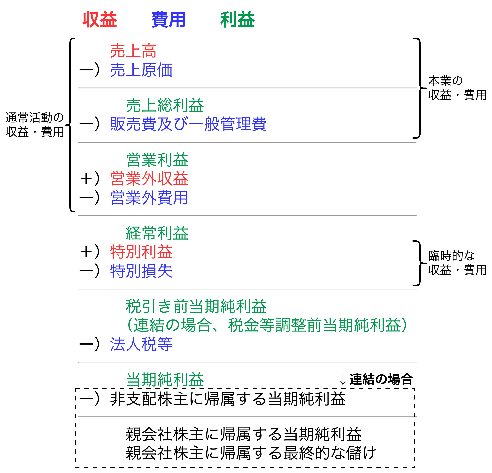
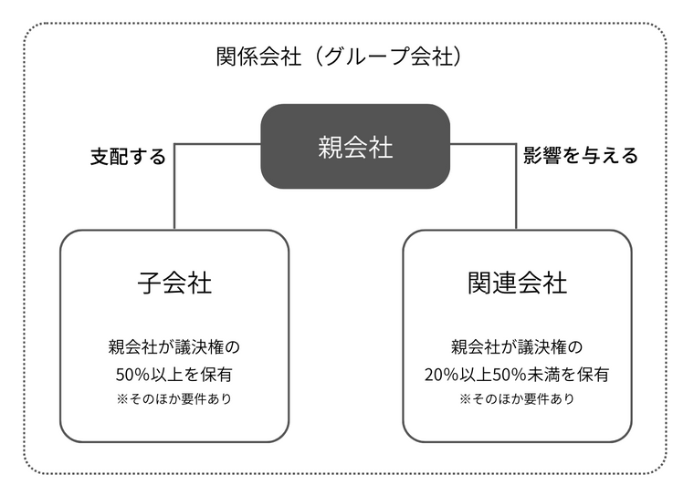
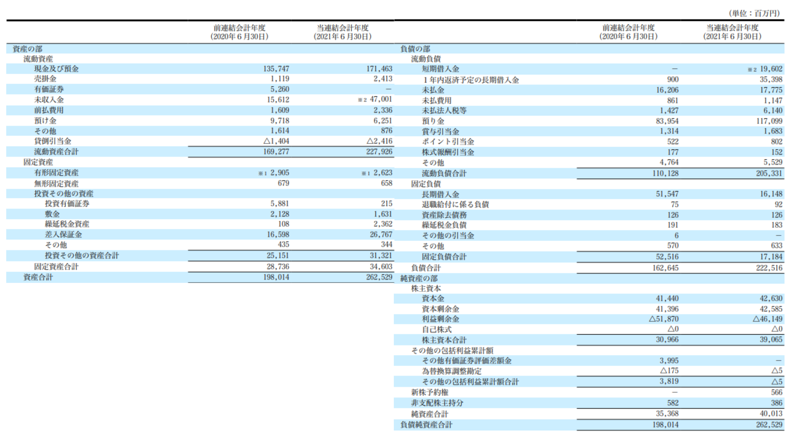
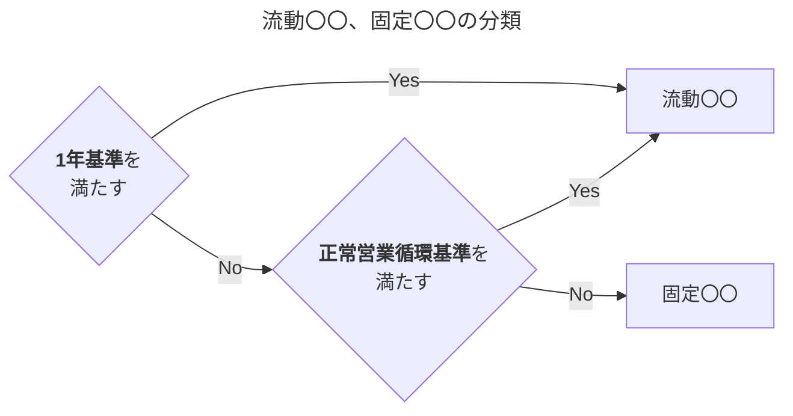
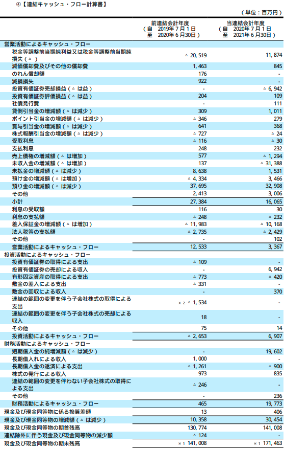

<div class=chap1>

# 財務会計と会社を見る目

### 第1章のはじめに

現在の社会経済は多数の企業が互いに複雑な取引活動を行うことで成り立っている。具体的には規模や業種業界、国籍、製品・サービスの売買、株主出資など多岐にわたる。企業の事業活動の成否を判断するためにビジネスの状況を定量化し「**会社の健康状態を可視化**」する必要がある。これにより不測の事態に陥る前にリスクや問題点を洗い出せる。会社の健康状態が可視化された結果がP/L、B/S、C/Sであり、**会社の健康診断書**になる。本章では、これらの財務諸表から「**見るべき数字**」を自分から見に行くためのコツを養う。

## 会社の実態を見抜く

- 【**ポイント**】財務諸表とは会社の経営成績や財政状態を表す決算書の総称である。ある一定の日における財政状態を表す**B/S**、ある一定期間の経営成績を表す**P/L**、ある一定期間の現金の出入りを表す**C/S**を合わせて財務3表とよぶ。まずは、財務3表の成り立ちと基本的な読み方を学ぶ

<div style="page-break-before:always"></div>

### 貸借対照表(B/S)の成り立ち


- <font color=red>貸借対照表は「ある一定の日における企業の財政状態」を表す財務諸表</font>であり、バランスシート(B/S)とも呼ばれる。左側に**資産**、右側に**負債**と**純資産**が計上される。
  - 【**資産**】現金、商品、売掛金(売上代金のうち未回収の残高)、建物、設備などの企業が有する財産
  - 【**負債**】買掛金(商品や原材料の購入代金のうち未払いの残高)や借入金などの株主以外からの資金調達であり、「**返済期限を有するもの**」
  - 【**純資産**】株主からの出資及び事業活動の結果である利益の累積。会社が存続する限り「**返済の必要がない**」
- B/Sのバランスには2つの意味がある
  - 【**1つ目の意味**】分割した左右それぞれの合計欄が等しくなる(バランスする)という意味
  - 【**2つ目の意味**】企業がある一次店で有する資産、負債、純資産にかかる各項目の残高(バランス)という意味
- <font color=red>貸借対照表の右側(負債と純資産)で調達した資金が左側の資産に姿を変えている</font>というように考えると、左右合計が常に一致するということは<font color=red>同じ資金を異なる側面から見ているだけ</font>の違いとして捉えられる。

### 損益計算書(P/L)の成り立ち



- <font color=red>損益計算書は「ある一定期間における企業の経営成績」を表す財務諸表</font>であり、P/Lと呼ばれる。
  - 【**B/S**】一時点の状況を表すストックの概念に基づくもの
  - 【**P/L**】一定期間の会社の活動を集計したフローの概念に基づくもの
- P/Lは3つの収益、5つの費用、5つの利益から構成される。
  - 【**収益**】売上高、営業外収益、特別利益
  - 【**費用**】売上原価、販売費及び一般管理費、営業外費用、特別損失
  - 【**利益**】売上総利益、営業利益、経常利益、税引き前当期純利益、当期純利益

#### 5つの利益について

- 【**売上総利益**】<u>会社の目的である財・サービスの提供により獲得された収益</u>。企業の技術開発や製造の効率性、売上対象の付加価値を示す利益であり、**粗利益・粗利**とも言われる。
- 【**営業利益**】売上総利益から販管費を引いた利益であり、<u>企業が本業で稼いだ利益</u>である。販管費とは販売活動や経営管理活動における費用であり、販売活動に係る費用には営業担当者の人件費や広告費、経営管理活動にかかる費用には管理部門の人件費や本社ビル家賃などが含まれる。
- 【**経常利益**】営業利益から営業外損益を計算した利益であり、<u>本業で稼いだ利益に加えて、本業以外の継続的な活動(受取利息、受取配当、支払利息など)も含めた、会社が通常行う活動の結果</u>である。ここで「営業外」とは財務活動、すなわち本業を行うための資金調達や運用活動に関して生じたものを指す。
- 【**税引き前当期純利益**】経常利益から特別損益を計算した利益であり、<u>臨時的・偶発的に発生した損益が加味された利益</u>である。なお、企業グループ全体の財務諸表の1つである「連結P/L」においては**税金等調整前当期純利益**と呼ばれる。
- 【**当期純利益**】税引き前当期純利益から法人税等(法人税、住民税、事業税、及び法人税等調整額)を引いた利益であり、<u>企業に残る最終的な利益</u>である。「最終利益」、「純利益」とも呼ばれる。なお、連結P/Lにおいてはさらに「親会社以外の株主である非支配株主に帰属する当期純利益」を引くことで「**親会社株主に帰属する当期純利益**」が導かれ、これが企業グループ全体の「当期純利益」に該当する。<u>この当期純利益はB/Sの純資産の部の利益剰余金に計上される</u>。

### キャッシュフロー計算書(C/S)の成り立ち

- <font color=red>キャッシュフロー計算書(C/S)は現金の出入りを表す財務諸表</font>であり、キャッシュの側面から会社の実態を把握するためのものである。
- C/Sが重要視される背景にはP/Lにある。P/Lは企業活動の実態を表すよう「**実現主義**」及び「**発生主義**」の考え方に基づいており、現金の出入りのタイミングとは一致せず、現金の流れ(キャッシュフロー)がわからない。例えば、利益計上されても借入金の返済原資がないために倒産（黒字倒産）するリスクはP/Lからは捉えられない。
- C/Sは当該期間におけるキャッシュの順増減額を3つの小計欄に分ける形式となっている。
  - 【**営業活動によるキャッシュフロー**】会社の本来の営業活動によりいくら稼いだかを示す。
  - 【**投資活動によるキャッシュフロー**】固定資産の取得等の設備投資、株式の売買、貸付金の融資などに関わるキャッシュの増減を示す。
  - 【**財務活動によるキャッシュフロー**】営業活動や投資活動を支援するために必要な資金の調達、返済にかかるキャッシュの増減を示す。借入や返済、増資などが含まれる。


### 貸借対照表を読む

- 【**留意**】本節での以後の数値は全て**連結財務諸表**に基づくものである。<u>連結財務諸表とは「グループ全体としての事業活動の成果を表す財務諸表」</u>であり、親会社の数値のみならず一定の基準を満たした子会社及び関連会社について数値も取り込んでいる。<font color=red>有価証券報告書を提出している会社は基本的に連結財務諸表の開示が求められる</font>。

#### 子会社と関連会社の違い



- 子会社と関連会社で連結財務諸表の取り込まれ方は異なる。
  - 【**子会社**】連結会計処理を通じて財務諸表全体が合算される
  - 【**関連会社**】財務諸表全体は合算されず、対象会社の損益の持分比率相当が、貸借対照表上は投資有価証券の増減として、損益計算書上は「持分法による投資損益」として取り込まれる(この処理を**持分法**という)。
- 【**連結決算に含める子会社の範囲**】<u>当該企業の意思決定機関を「実質的に」支配しているか</u>が判断基準になる。従って、単に議決権の過半数を有している場合のみならず、保有議決権が過半数を下回るような場合であっても緊密者(当該企業の意思と同一内容の議決権を行使すると認められる者)や役員、使用人(従業員)、契約関係等の実態を考慮し、実質的な支配があるかどうかの判定が必要になる。
- 【**関連会社の範囲**】<u>出資、人事、資金、技術、取引等の関係を通じて、事業方針に重要な影響を与え得るか</u>で判断する。議決権の$20\%$以上の保有という目安はあるが、これについても「実質的」な影響の判断が必要になり、$20\%$未満の議決権保有の場合でも関連会社と判断される場合もあることに留意が必要である。

#### メルカリの連結貸借対照表



- BSは資産の部、負債の部、純資産の部の3つに分けられる。
##### 【メルカリの資産】
- 【**流動資産**】
  - 現金及び預金
  - 売掛金　※現金化に1年以上かかっても営業サイクルに含まれるため流動資産に計上。
  - 未収入金(購入者からの代金未回収分)
  - 預け金(出品者への代金先払い分)
- 【**固定資産**】営業サイクルに含まれない、かつ、1年以内に現金化されない資産。
  - 【**有形固定資産**】建物や車両等の形ある資産。
  - 【**無形固定資産**】ソフトウェア等の形のない資産。無形固定資産が多額な場合、「**買収によるのれん**」の形状に起因していることも多い。
  - 【**投資その他の資産**】長期貸付金、出資金、敷金、差入補償金、繰延税金資産などの有形固定資産や無形固定資産に当てはまらない固定資産。
- 【**補足**】<u>製造業や小売業などでは原材料や製品、商品などの**棚卸資産**も流動資産に含められる</u>。ここで、棚卸資産について、現金化に1年以上を要する(**1年基準を満たす**)場合でも、営業サイクルに含まれる(**正常営業循環基準を満たす**)場合は流動資産に計上している。

<div style="page-break-before:always"></div>

##### 【メルカリの負債】
- 【**流動負債**】
  - 【**1年基準を満たす科目**】預り金(予定されている出品者への支払い)、短期借入金(契約日から**1年以内**に返済期限が到来する借入)、1年以内に返済予定の長期借入金、未払い法人税等
  - 【**正常営業循環基準を満たす**】賞与引当金、ポイント引当金、買掛金
- 【**固定負債**】
  - 長期借入金
  - 繰延税金負債

##### 【メルカリの純資産】
- 【**株主資本**】
  - 【資本金と資本剰余金】株主からの出資による払い込み分。
  - 【利益剰余金】会社設立当初からの利益の累積額であり、任意積立金(将来使用するための備え)と繰越利益剰余金(使用目的が決まっていない利益)から構成される。
  - 【自己株式】企業が自社の株式を買い戻したもの。<font color=red>他社の株式購入は資産計上になるが、自社の株式購入は株主資本のマイナスとして計上する</font>。
- 【**その他の包括利益累計額合計**】当期純利益以外に起因する純資産増減の累計額。
- 【**新株予約権**】会社に対して株主を予め定められた価格で購入できる権利をいう。新株予約権を発行した際に払い込まれた金額を新株予約権として計上する。新株予約権は将来、権利行使され払込資本となる場合と失効しては鋳込み資本とならない場合の双方が考えられる。
- 【**非支配株主持分**】<font color=red>グループ会社の純資産のうち親会社以外の外部の株主の持分に該当する部分であり、連結B/Sのみ計上される項目</font>。

##### 【まとめ】

- <font color=red>$資産合計>負債合計$</font>の時、純資産は正の値を取るが、財務的な危機から<font color=red>$資産合計<負債合計$</font>になった時、純資産は負の値をとり「債務超過」になることがある。これは<u>過去の利益の累積である利益剰余金のマイナス、つまり、損失の累積が主な原因</u>である。
- 上記を踏まえ、<font color=red>「資本金の金額」は純資産の1項目に過ぎず、会社の体力を判断する際に資本金の金額の大小のみではなく純資産全体として把握することが重要である</font>。

<div style="page-break-before:always"></div>

##### 流動〇〇、固定〇〇の分類(正常営業循環基準と1年基準について)



- 資産は大きく流動資産と固定資産に分けられ、負債も大きく流動負債と固定負債に分けられる。これらはどちらも**1年基準**と**正常営業循環基準**という2つの判断基準で分類される。
  - 【**1年基準(ワンイヤールール)**】営業サイクルに含められない資産(負債)につき、B/Sの決算日の翌日から起算し、1年以内に現金化されるものを流動資産(流動負債)、1年超となるものを固定資産(固定負債)とする判断基準
  - 【**正常営業循環基準**】仕入、製造、販売、代金回収といった「会社の通常の営業活動のサイクル」に含められる資産(負債)を流動資産(流動負債)とする判断基準。

##### 【コラム】ブランドや人材・技術力は「資産」にどのように反映されているか

- 会社の競争力の源泉として、

##### 「のれん」とは何か


<div style="page-break-before:always"></div>

### 損益計算書を読む


<div style="page-break-before:always"></div>

### キャッシュフロー計算書を読む



- 営業活動によるキャッシュフローは約$33$億円
- 投資活動によるキャッシュフローは約$69$億円
- 財務活動によるキャッシュフローは約$197$億円
- 期首の合計キャッシュフローが約$1410$億円
- 期末の合計キャッシュフローは約$1714$億円

#### 【営業活動によるCF】本業で獲得した現金

- <font color=red>営業活動によるCF（以下、営業CF）は「<b>本業で獲得した現金</b>」であり、<u>会社の活動全般において必要なキャッシュの重要な資源</u>である</font>。
- 「売上や費用の計上のタイミング」と「実際の現金の出入りのタイミング」は必ずしも一致しない。そこで、<u>営業CFを求める上では税引き前当期純利益とキャッシュ増減の差異を調整していくという形式</u>が取られている。

##### 運転資本


$$
\begin{align*}
\bold{\color{red}運転資本}&=売上債権+棚卸資産-仕入債務\\
\bold{\color{red}運転資本}&=流動負債-流動資産\hspace{4mm}※
\end{align*}
$$

- 営業CFの構成項目の中で在庫や売上債権などの$資産の増加→キャッシュの減少項目$、買入債務などの$負債の増加→キャッシュの増加項目$として記載されていると述べたが、この背景には**運転資本**の概念がある。
- **運転資本**は運転資本は一般的に上式のように求められ、以下の特徴を持つ。
  - 営業活動に投下された資金を指し、ワーキングキャピタル(WC)と呼ばれる
  - <u>通常の事業活動の中で資金が他のものに拘束されている部分であり、これを圧縮することがキャッシュの観点からは有利となる</u>
  - 支払いから回収のタイムラグの期間で現金不足を埋めるために必要な資金
  - 資金ショートを回避し、一定のキャッシュを融通する現金

<div style="page-break-before:always"></div>

#### 【投資活動によるCF】会社の将来に対する投資への姿勢

$$
FCF=営業CF+投資CF
$$

- <font color=red>投資活動のキャッシュフロー（以下、投資CF）は会社の投資活動に伴うキャッシュの増減を表し、会社の将来に対する投資への姿勢を示す</font>。
- 具体的には、設備投資や証券投資、融資などの**支出**と設備や株式の売却、貸付金の回収などによる**収入**がある。
- 通常、投資に伴う支出の金額はP/Lにおいて読み取ることができない。有形固定資産を購入した場合、B/Sには購入金額が資産計上され、P/Lには耐用年数にわたり減価償却費として費用計上される。

#### 【財務活動によるCF】資金調達や借入金返済

- <font color=red>財務活動のキャッシュフロー（以下、財務CF）は営業活動と投資活動を行うためにどのように「<b>資金調達</b>」し、「<b>借入金返済</b>」しているのかを表す</font>。具体的には銀行借入や社債/株式発行による資金調達やその返済、配当支払や原資等による現金の増減が記載される。

<div style="page-break-before:always"></div>

## 経営の実態を見抜く

- 【**ポイント**】指標分析（比率分析）は会社の経営の実態を見抜き、それをさまざまな意思決定に反映させる上で非常に有効なツールである。ただし、指標分析を行う場合には一面的な分析にならないよう、さまざまな視点から行う必要がある。また指標の意味を十分理解することはもちろん、その限界や留意点についてもしっかり認識する必要がある。

### 指標分析の体系

- 指標分析とはP/LとB/Sの数字を組み合わせて算出した指標を用いることで、より効率的にその会社の経営状況を「**多面的**」に比較、検討、評価することである。ここで、多面的の意味は2つある。
  1. 自社の過去の数字や業界平均の数字など、目的に応じて比較分析する対象が多様だということ
  2. 会社が利益を生み出す力が大きいか小さいか(**収益性**)、B/S上の資産がどの程度売り上げに結びついているか(**効率性**)、債権者に対する支払能力が十分かどうか(**安全性**)等の観点を組み合わせて分析すること
- 比較方法は以下の通り。
  - 【**時系列比較**】<font color=red>過去の指標と現在の指標を時系列比較する</font>ことで、その会社の業績が好調か不調か、どのような経営状態かを中長期的視点で把握することができる。また、傾向の推移を見ることで、良化（悪化）の兆候を判断することができる。
  - 【**業界平均値との比較**】<font color=red>業界平均と比較する</font>ことで業界内において自社の経営状況が相対的にどのような状況なのか、立ち位置を把握することができる。また、業界内における自社の指標のユニークさに表れる自社の戦略の特徴や、自社の強み・弱みなどを見抜くことができる。
  - 【**競合他社との比較**】<font color=red>競合他社と比較する</font>ことで、自社との経営状態の違いを把握することができる。また、自社の優れている点や劣っている点を認識することで、戦略の検討材料にすることができる。例えば、自社の売り上げが前年から成長していたとしても、競合の売り上げ成長がそれを上回っていた場合、自社の成長戦略の見直しが必要と判断できる。
  - 【**目標との比較**】<font color=red>中長期的な目標値と比較する</font>ことで、現状と目標とのギャップを把握することができる。現状と目標とギャップがある場合は、どこに問題があるのか原因を分析し、改善策の検討が必要となる。
- **指標分析は総合力・収益性・効率性・安全性・成長性の5つに分類できる**。次項よりそれぞれの指標をメルカリとブックオフの実例を用いながら一つ一つ紹介していく。なお、ここでは、メルカリとブックオフの指標が良いか悪いかを評価するのではなく、2社のビジネスモデルや事業活動の特徴が数字にどう表れているかに着目して考える。


### 指標分析の流れ

```plantuml
title 分析の流れ

rectangle "1.事業構造を概観する" as step1
rectangle "2.財務数値、指標を確認する" as step2
rectangle "3.比較し、評価する" as step3
rectangle "4.課題設定" as step4 {
  rectangle 問いを立てる as step41
  rectangle 分解して絞る as step42
  step41 <-> step42
}
rectangle "5.仮説検証" as step5 {
  rectangle 仮説を立てる as step51
  rectangle 検証する as step52
  step51 <-> step52
}
rectangle "6.分析のアウトプットをまとめる" as step6

note right of step1
[顧客]-[提供価値]-[価値提供のための活動]
-[活動に必要な経営資源]のつながりを考える
end note
note right of step2
財務諸表や指標の数値を大きく捉えて、
数値上の特徴を掴む
end note
note right of step3
競合、業界平均、時系列などの数値を
物差しにして良し悪しを確認する
end note
note right of step4
「なぜそんな数字になっているのか？」

大きく捉えた数値から具体的な企業活動が
イメージできそうなレベルまで分解する
end note
note right of step5
正解に拘らず答えを想像してみる

「本当か」と疑ってみる
end note
note right of step6
人に伝えやすい言葉で
シンプルに表現する
end note

step1 --> step2
step2 --> step3
step3 --> step4
step4 --> step5
step5 --> step6
```

1. 【**事業構造を概観する**】指標分析は財務3表とは別の情報源を通じ、分析対象となる企業の事業構造を概観することから始まる。具体的には、顧客は誰か、その顧客に対してどのような価値を提供していて、その価値提供の活動は何か、活動に必要な経営資源は何かのつながりを整理する。
1. 【**財務数値、指標を確認する**】主要な財務数値や各財務指標を確認し、どのような特徴があるか、「ざっくり」と全体像を把握する。
1. 【**比較し、評価する**】分析の目的に応じて、競合、業界平均、時系列などの数字を物差しにし、その会社の数字の良し悪しを確認する。こうすることでその会社の着目すべきポイントの目星をつけることができる。
1. 【**課題設定**】1.で整理した事業構造を踏まえて、3.で目星をつけた着眼点について、「なぜそのような数字になっているのか」と問いを立て、分解をしながらその要因を一つ一つ検討する。例えば、この会社のROE（自己資本利益率）が高ければ、なぜ高いのかを収益性、効率性、安全性に分解をして考えていく。
1. 【**仮説検証**】4.を通して、「この指標が良いのは、きっとこの会社のあの戦略が効いているからだろう」「この指標が悪いのは海外のあのマーケットで苦労していたせいかな」というように、なぜ指標がそのような数字になっているのか仮説を立てる。そして、この仮説が本当にそうなのかということを、他の情報との照合等を通じて検証する。<font color=red>正解に拘らず仮説を立て、それを検証する作業を繰り返すことで、仮説の精度が上がる</font>。
1. 【**分析のアウトプットをまとめる**】仮説と検証を繰り返すことで、その会社のビジネスの特徴や経営課題が明らかになる。これを人に伝えやすい言葉でシンプルにまとめると、分析のアウトプットになる。

### 総合力を見抜く

- **総合力**とは、会社全体として利益を上げることのできる力、つまり、総合的な収益性を指す。代表的な指標は以下の2つがある。
  - 【**ROA**】Return on Assets、総資産利益率
  - 【**ROE**】Return on Equity、自己資本利益率
- この2つの指標が総合力指標と言われるのは大きく次の2つの理由による。
  - 【**理由1**】
  - 【**理由2**】

```plantuml
title "指標分析の全体像"

rectangle "【**総合力**】\nROE" as node1
rectangle "ROA" as roa
rectangle "【**安全性**】\n財務レバレッジ" as node3
rectangle "流動比率" as current_ratio
rectangle "固定比率" as fixed_ratio

rectangle "【**収益性**】\n売上高\n当期純利益率" as node4
rectangle "売上高\n利益率" as gross_profit_margin
rectangle "売上高\n営業利益率" as operating_profit_margin
rectangle "売上高\n経常利益率" as net_profit_margin
rectangle "売上高\n当期純利益率" as net_income_margin

rectangle "【**効率性**】\n総資本\n回転率" as node5
rectangle "売上債権\n回転期間" as accounts_receivable_turnover_period
rectangle "棚卸資産\n回転期間" as inventory_turnover_period
rectangle "仕入債務\n回転期間" as accounts_payable_turnover_period

rectangle "【**成長性**】\n成長性" as node2

node1 .[hidden] node2
node1 -- node3
node1 -- roa
roa --- node4
roa -- node5
node3 -- current_ratio
node3 -- fixed_ratio
node4 -- gross_profit_margin
node4 -- operating_profit_margin
node4 -- net_profit_margin
node4 -- net_income_margin
node5 -- accounts_receivable_turnover_period
node5 -- inventory_turnover_period
node5 -- accounts_payable_turnover_period
```

### 収益性を見抜く

- 

### 効率性を見抜く

- 

### 安全性を見抜く

- 

### 成長性を見抜く

- 

### 指標分析の限界を留意点

- 

<div style="page-break-before:always"></div>

## 業界の実態を見抜く

- 【**ポイント**】

### 状況の整理

- 

### まとめ

- 

</div>