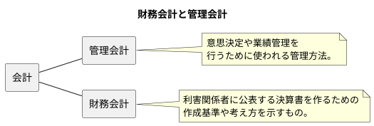
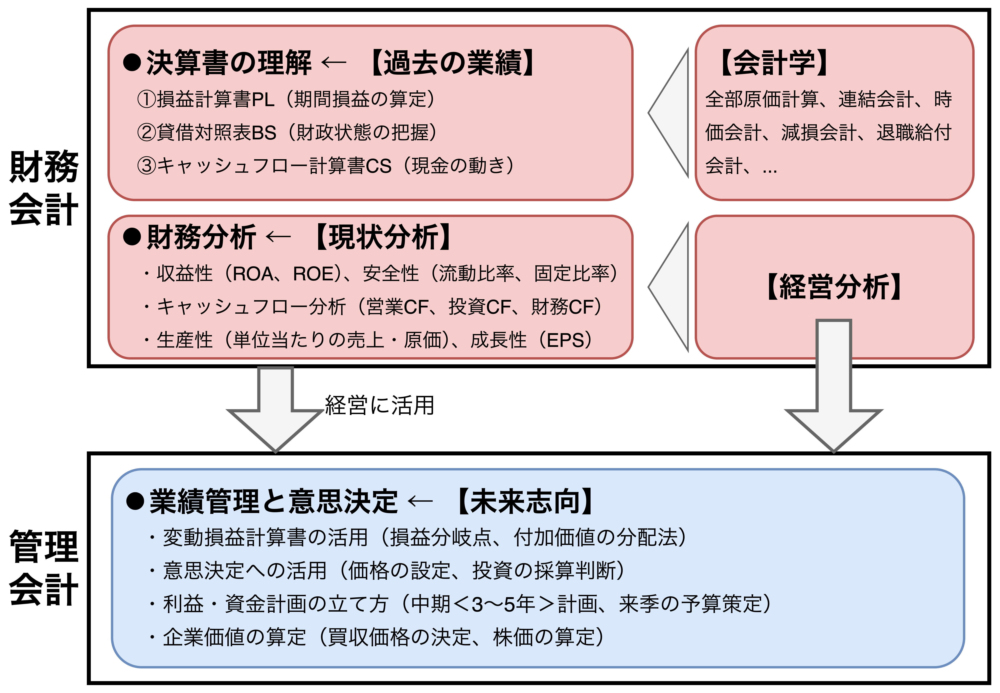
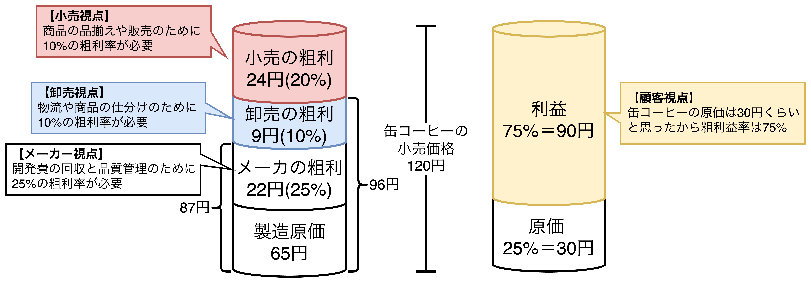
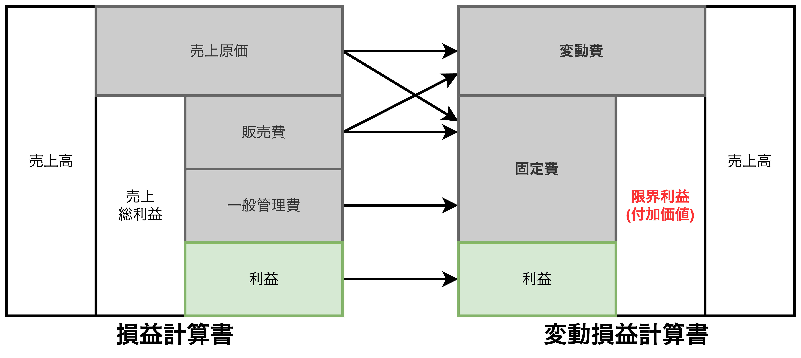
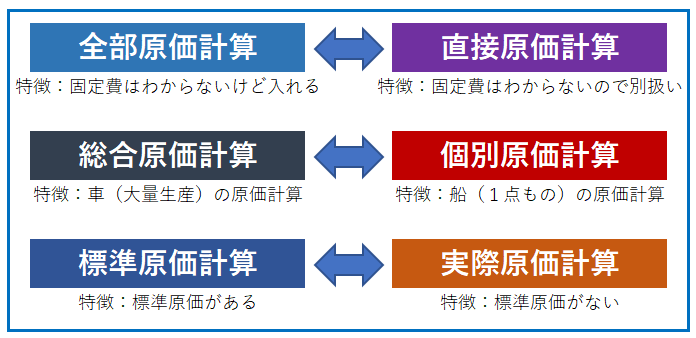

# 管理会計で数字を見ると経営の本質が浮かび上がる

## 経営者、管理者に必要な会計

- 【**ポイント**】財務会計は外部に公表・提出する決算書の作成基準や考え方であり、「経理」のための活用法になる。管理会計は意思決定や業績管理を行うための数字の見方であり、「<b>経営</b>」のための活用法になる。
- **管理会計**は経営プロセスにおいて「どのように付加価値を創出」し、「利益貢献できるのか」を示し、業績管理を重視するため、「**経営者や管理者が理解しやすい独自ルールを設定しても良い**」。
  - 【**営業**】受注ベースで売上高や原価を認識する。
  - 【**製造**】開発ベースで売上高や原価を認識する。
- **財務会計**は顧客が確実に売上代金を支払う状況になったときに売上高と認識すべきと考えるため、「**検収ベースでの売上高の認識**」になる。

## 財務会計は過去会計、管理会計は未来会計

<table>
	<tbody>
		<tr>
			<th></th>
			<th>財務会計</th>
			<th>管理会計</th>
		</tr>
		<tr>
			<th>目的</th>
			<td>ステークホルダが業績評価や 競合企業との比較で活用するため。</td>
			<td><b>商品の価格設定</b>、<b>採用人数</b>、設備投資、 企業の買収価格設定(M&A)、 <b>戦略的意思決定</b>などの多岐に渡る 未来に向けた経営をするため。</td>
		</tr>
		<tr>
			<th>役割</th>
			<td>会計基準(IFRS)に沿って <b>決算書を作成すること</b>。</td>
			<td>経営情報を集め、経営者や管理者が 活用できるように加工して、 <b>有益な情報を提供すること</b>(≒ETLツール)。</td>
		</tr>
		<tr>
			<th>ターゲット</th>
			<td>株主、金融機関、税務署などの 社外の関係者</td>
			<td>経営者、管理者などの 社内の関係者</td>
		</tr>
	</tbody>
</table>

- 【**ポイント**】管理会計は財務会計の基礎知識(現状分析のための財務分析、経営分析など)を使う。
- 財務会計と管理会計は目的・役割・ターゲットが全く異なるが、学習範囲が一部重なる。

## 財務会計と管理会計の考え方の違い

- 【**ポイント**】顧客が考える原価は小さく、会計が考える原価は大きい。
- 管理会計のテーマは主に3つ
  - 【**損益分析と業績管理**】損益分岐点分析と変動損益計算書の活用
  - 【**原価管理**】原価計算の基本
  - 【**意思決定**】短期利益計画と中期経営計画への活用

### 顧客視点と企業視点

- 120円の缶コーヒーと1,000円のホテルのコーヒーがあるとき、財務会計と管理会計で考え方が全く異なる。
  - 【**財務会計**】2つのコーヒーの原価(人件費、労務費、経費)から、粗利益率を考える（メーカー視点）。
  - 【**管理会計**】2つのコーヒーの価格設定と売り方から売れる理由と根拠を考える（顧客視点）。
- メーカーや顧客によって数字の判断や見方は異なる。このような将来の意思決定や事業計画に活かす能力を計数感覚と言い、立場によって変わる。例えば、以下のように缶コーヒーの製造〜販売までに売上総利益の乗せ方は異なるはずである。
  - 【**メーカー**】開発費の回収と品質管理のために$25\%$の粗利率が必要。
  - 【**卸売**】物流や商品の仕分けのために$10\%$の粗利率が必要。
  - 【**小売**】商品の品揃えや販売のために$20\%$の粗利率が必要。
  - 【**顧客**】缶コーヒーの原価は30円くらいと思ったから粗利率は$75\%$
- 管理会計では「顧客視点」で粗利率$75\%$を納得させる仕掛け(投資)を行う。味やデザイン、ブランドや売る場所、特典や配達サービスなどの付加価値を創出し、顧客に提供する。

### 変動損益計算書で付加価値がわかる

- 管理会計の具体的なツールとして変動損益計算書がある。変動損益計算書は費用を変動費と固定費に分類して利益を計算していく損益計算書になる。
  - 【**変動費**】材料費
  - 【**固定費**】人件費、減価償却費、研究開発費

## コストダウンで利益は増えるのか？

- 【**ポイント**】コストをかけないと利益は出ない。
- 「利益、売上高、費用」を企業経営を意識して並び替えなさい
  - 【**財務会計**】$売上高→費用→利益$
  - 【**管理会計**】$費用→売上高→利益$
- 管理会計では$|短期的な利益|<|機会損失|$を意識する、つまり、<u>事故が起きて発生する損失や失う利益の方が利益より大きい</u>。
- 短期的な利益のためのコストダウンは「**悪いコストダウン**」に繋がりやすい。例えば、人件費や研究開発費の削減、設計費や保守点検費用の削減など。
- 中・長期的な利益のためのコストダウンは「**良いコストダウン**」に繋がりやすい。例えば、無駄な作業費削減(システム化)、消耗品費削減(ペーパーレス化、LED照明の導入)など。

## 【利益は見解、現金は事実】利益が出ていればそれでいいのか？

<table>
    <caption>ある会社での3年間の業績推移</caption>
	<tbody>
		<tr>
			<th></th>
			<th>スタート</th>
			<th>1年度</th>
			<th>2年度</th>
			<th>3年度</th>
			<th>3年合計</th>
		</tr>
		<tr>
			<th>売上高</th>
			<td></td>
			<td>200</td>
			<td>300</td>
			<td>400</td>
			<td>900</td>
		</tr>
		<tr>
			<th>費用</th>
			<td></td>
			<td>110</td>
			<td>200</td>
			<td>300</td>
			<td>610</td>
		</tr>
		<tr>
			<th>減価償却費</th>
			<td></td>
			<td>60</td>
			<td>60</td>
			<td>60</td>
			<td>180</td>
		</tr>
		<tr style="border-bottom: 3px double black;">
			<th>営業利益</th>
			<td></td>
			<td>30</td>
			<td>40</td>
			<td>40</td>
			<td>110</td>
		</tr>
	</tbody>
    <tbody>
		<tr>
			<th>設備投資 (5年で焼却)</th>
			<td></td>
			<td>▲300</td>
			<td></td>
			<td></td>
			<td></td>
		</tr>
		<tr>
			<th>在庫</th>
			<td>0</td>
			<td>0</td>
			<td>0</td>
			<td>40</td>
			<td></td>
		</tr>
		<tr style="border-bottom: 15px double black;">
			<th>売掛金</th>
			<td>0</td>
			<td>0</td>
			<td>0</td>
			<td>10</td>
			<td></td>
		</tr>
	</tbody>
    <tbody>
		<tr>
			<th colspan=2>営業CF</th>
			<td>90</td>
			<td>100</td>
			<td>50</td>
			<td>240</td>
		</tr>
		<tr>
			<th colspan=2>投資CF</th>
			<td>▲300</td>
			<td>0</td>
			<td>0</td>
			<td>▲300</td>
		</tr>
		<tr>
			<th colspan=2>FCF(フリーキャッシュフロー)</th>
			<td>▲210</td>
			<td>100</td>
			<td>50</td>
			<td>▲60</td>
		</tr>
	</tbody>
</table>

- 【**ポイント**】フリーキャッシュフロー$(FCF=営業CF+投資CF)$で「投資の採算」を判断する。
※【**FCF**】営業活動で残った現金(営業CF)から設備投資の金額(投資CF)を引いて残った自由なお金。
- 利益と費用の算出は財務会計と管理会計で異なる。理由は財務会計では財務省が定めた法定耐用年数を用いて減価償却を行うが、管理会計では経営者の判断で耐用年数を決めることができるからである。
- キャッシュフローは「現金預金の出入り」であり、計算結果は財務会計、管理会計によらず常に一致する。
- 利益は企業の経営者が選択する会計処理によって変動するが、キャッシュフローは現金預金の出入りであることから誤魔化しが効かない。そのため、「**利益は見解、現金は事実**」と言われる。

## 管理会計の3つのテーマ

- 【**ポイント**】管理会計の3つのテーマ
  1. 【**損益分析と業績管理**】損益分岐点分析と変動損益計算書の活用
  2. 【**原価管理**】原価計算の基本
  3. 【**意思決定**】短期利益計画と中期経営計画への活用

### 損益分析と業績管理

- 損益分析の基本は「**損益分岐点分析**」であり、「利益を産んでいる売上高(経営安全額)」や「固定費を支払うための売上高(損益分岐点)」がわかる。さらに企業の損益体質(固定費型、変動費型)も明らかになる。
- 【**損益分岐点分析の作業フロー例**】
  1. 変動損益計算書の作成する。
  2. 変動損益計算書からコスト構造を明らかにし、損益分岐点分析の基礎データを入手する。
  3. 付加価値分析する。
  4. 付加価値分析の結果から、社員の人件費、業績賞与などを合理的に決定する。

### 原価管理

- 原価管理の基本は「**原価計算**」であり、製品、プロジェクト、ソフトウェアなど多岐に渡る。

### 意思決定〜短期的意思決定と戦略的意思決定〜

- 短期的意思決定は「**1年以内の予算策定などで必要になる課題に対する意思決定**」を意味する。次期の利益や予算の計画だけでなく、その計画で必要となる個別的な決定事項を含む。<u>「個別的な決定事項」には販売価格や受注件数、社員の給与や時給などがある</u>。
- 戦略的意思決定は「**1年を超える期間で必要となる課題に対する意思決定**」を意味する。中長期の経営計画の策定とそれに関連して発生する問題領域を扱う。具体的にはキャッシュフローを使った考え方が中心であり、**①企業価値算定**、**②設備投資の採算計画**、**③DCF(Discounted Cash Flow)法**、**④内部利益率(IRR: Internal Rate of Return)** などがある。
