<style>
    body {
      counter-reset: chapter 1;
    }
    h1 {
        counter-reset: sub-chapter;
    }
    h2 {
        counter-reset: section;
    }

    h1::before {
        counter-increment: chapter;
        content: "第" counter(chapter) "章 ";
    }
    h2::before {
        counter-increment: sub-chapter;
        content: counter(chapter) "-" counter(sub-chapter) " ";
    }
</style>

# 損益分岐点分析で管理会計入門

## コーヒー店の損益分岐点分析

```bash
# コーヒー専門店「カフェクローバー」の1ヶ月間の利益計画
◾販売予定                   4000杯(販売価格300円/杯)
◾コーヒー1杯あたりの材料費     45円/杯
---
◾店の家賃                   30  万円/月
◾その他の費用                19.9万円/月
◾人件費                     47  万円/月         計 96.9万円/月
```

- 【**ポイント**】損益分岐点では「固定費＝限界利益」になる。
- 損益分岐点を調べるためには「売上高、変動費、固定費」の3つが必要になる。損益分岐点の売上高は以下の等式を満たす。
$$
\begin{align*}
損益分岐点売上高&=(固定費+変動費比率\times 損益分岐点売上高)
\end{align*}
$$上式から損益分岐点売上高を求めると以下のようになる。
$$
\begin{align*}
損益分岐点売上高&=\frac{固定費}{1-\color{red}変動費比率}=\frac{固定費}{\color{blue}限界利益率}\\[3mm]
\color{red}変動費比率&=\frac{変動費}{売上高}=\frac{1杯の材料費}{1杯の販売価格}\\[3mm]
\color{blue}限界利益率&=1-\frac{変動費}{売上高}=\frac{売上高-変動費}{売上高}=\frac{限界利益}{売上高}
\end{align*}
$$
- 「カフェクローバー」の変動費比率、限界利益率、損益分岐点売上高を求めると以下の通り。
$$
\begin{align*}
\color{red}変動費比率&=\frac{45}{300}=0.15=15[\%]\\[3mm]
\color{blue}限界利益率&=1-\frac{変動費}{売上高}=0.85=85[\%]\\[3mm]
損益分岐点売上高&=\frac{969,000}{0.85}=1,140,000=114[万円]
\end{align*}
$$

<div style="page-break-before:always"></div>

## 経営安全率と損益分岐点比率

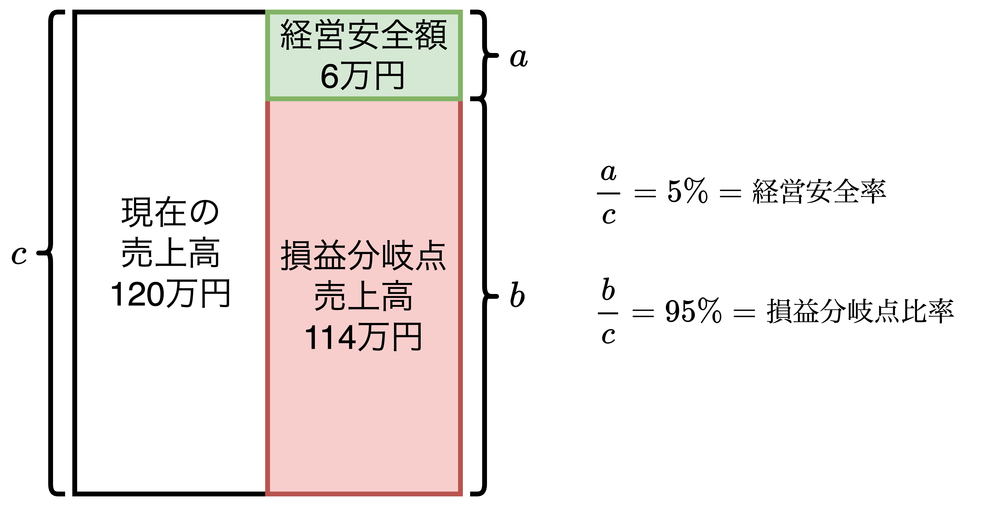

- 【**ポイント**】<font color=red>経営安全額から生まれる限界利益は利益であり、$経営安全率+損益分岐点比率=100\%$</font>
- 損益分岐点を超えた売上高は「**経営安全額**」と言われ、経営安全額を売上高で割った比率を**経営安全率**と呼ぶ。
- もし利益を増加さえようと考えた場合、考えられることは以下の2つ
  1. 経営安全額を増やす
  2. 限界利益率を増やす

$$
\begin{align*}
&\color{red}経営安全率\color{black}=\frac{経営安全額}{売上高(>損益分岐点売上高)}\\[3mm]
&\color{blue}損益分岐点比率\color{black}=\frac{損益分岐点売上高}{売上高(>損益分岐点売上高)}\\[3mm]
&\color{red}{経営安全率}\color{black}+\color{blue}損益分岐点比率\color{black}=1\\[3mm]
&\bold{経営安全額\times 限界利益率=利益}
\end{align*}
$$

<div style="page-break-before:always"></div>

## 損益分岐点を図でイメージできるようになろう

<table>
    <tr>
        <th>損益分岐点図表</th>
        <th>　限界利益図表　　　</th>
    </tr>
    <tr>
        <td>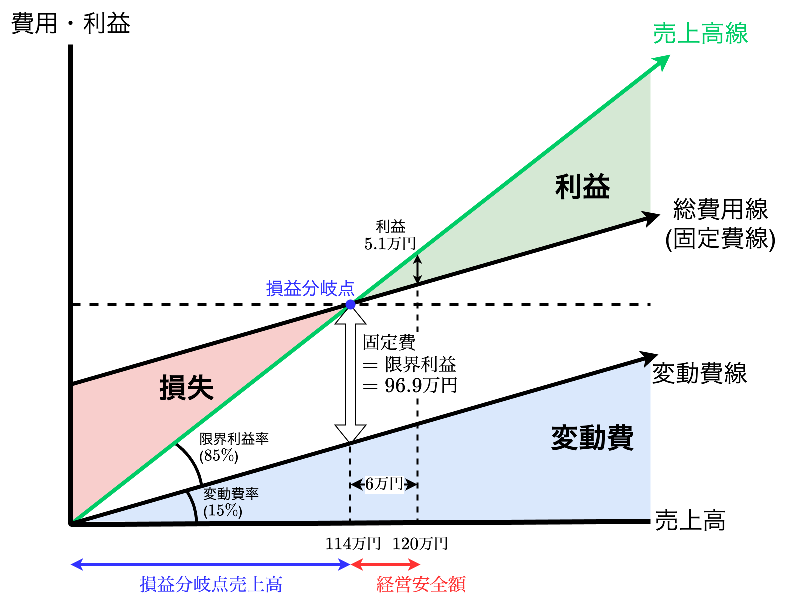</td>
        <td>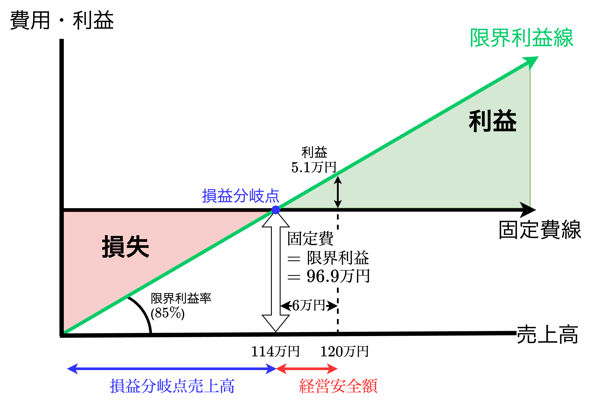</td>
    </tr>
</table>

- 【**ポイント**】限界利益図表で損益分岐点を考えると理解しやすい。
- **損益分岐点図表**
  1. 縦軸に「**費用・利益**」、横軸に「**売上高**」をとる。
  2. 原点を通る線を引き、これを「**売上高線**」とする。横軸と売上高線のなす角を「**限界利益率**」とする。
  3. 売上高線を参考に原点を通る「**変動費線**」を書く。横軸と変動費線のなす角を「**変動費比率**」とする。
  4. 変動費線に対して固定費の分だけ縦軸方向に伸ばし、これを「**総費用線(固定費線)**」とする。
  5. 売上高線と総費用線の交点が「**損益分岐点**」である。
  6. 売上高線と総費用線の2線で挟まれた領域のうち、損益分岐点より左側の領域は「**損失**」、右側の領域は「**利益**」である。
- **限界利益図表**　<font color=red>※損益分岐点図表から変動費線を引き抜いた図表</font>
  1. 縦軸に「**費用・利益**」、横軸に「**売上高**」をとる。
  2. 限界利益率$85\%(=\frac{300-45}{300})$の傾きで対角線を書き、これを「**限界利益線**」とする。
  3. 固定費の値を通る横軸と平行な線を書き、これを「**固定費線**」とする。
  4. 限界利益線と固定費線の交点が「**損益分岐点**」である。
  5. 限界利益線と固定費線の2線で囲まれた領域のうち、損益分岐点より左側の領域は「**損失**」、右側の領域は「**利益**」である。

## 短期利益計画に応用する

- 【**ポイント**】利益計画では「費用＝変動費＋固定費」に分解して考える。

### 目標利益達成までに必要な売上高

```
【Question】
カフェクローバーにおいて、原価構造は変わらないとして、
月に利益30万円を稼ぎたい時の「売上高と販売数量」は
それぞれどの程度にすれば良いか。
```

- 利益$30万円$と固定費$96.9万円$を合わせた$126.9万円$が必要な利益であることがわかる。この必要な利益に限界利益率を割った値が必要売上高になる。

$$
\begin{align*}
必要売上高[円]&=\frac{固定費+必要利益}{限界利益率}\\[3mm]
&=\frac{96.9万円+30万円}{\frac{255円}{300円}}\\[3mm]
&=300[円]\times \frac{1,269,000}{255}[杯]\\[3mm]
&≒300[円]\times 4976.47[杯]≒300[円]\times 4977[杯]\\[3mm]
&=1,493,100[円]
\end{align*}
$$

<div style="page-break-before:always"></div>

### 制約がある場合の必要売上高

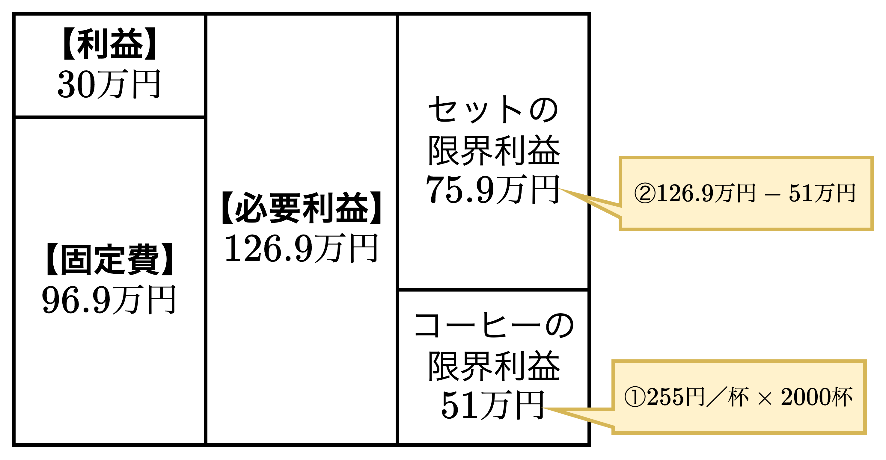

```
【Question】
4977杯を売れば利益30万円が挙げられることがわかったが、
1ヶ月4000杯が限界であることがわかった。
そこでコーヒーとケーキのセット販売で利益30万円を上げることを考える。
セット販売の原価を120円/個とし、2000個/月の販売を考えた時、
「セット価格」はいくらであれば良いか。
(他の条件は当初の計画通りとする。)
```

- 上記のケーキセットのように**別の商品やサービスとセットで販売する手法は限界利益が高くなることが多いため、よく使われる**。例えば、ラーメンと半チャーハンセット、お酒とおつまみのセット(ほろよいセット)、カツ丼とうどん/そばのセット、コーヒーとケーキのセット、サンドイッチとコーヒーのセットなど。
- 計算手順としては以下の通り。
  1. コーヒー4000杯のうち2000杯はコーヒーとして販売するため、2000杯売り上げた時の限界利益を求める。限界利益は$255円/杯\times 2000杯=\bold{\underline{510,000円}}$。
  2. 次に必要な利益$1,296,900円$から$510,000円$を差し引き、セット価格の必要利益を求める。$1,269,000-510,000=\bold{\underline{759,000円}}$
  3. をセット販売することを考える。セット価格を$x$とすると、計算式は以下の通り。

$$
\begin{align*}
(x&-変動費)\times 販売数量=必要利益\\[3mm]
(x&-165)\times 2000=759,000\\[3mm]
x&-165=\frac{759,000}{2000}=379.5≒380\hspace{3mm}
\therefore\hspace{3mm}&x=380+165=\bold{\underline{545円}}
\end{align*}
$$

### ケーキを自家製にしたらどうなるか(原価構造が変化した場合)

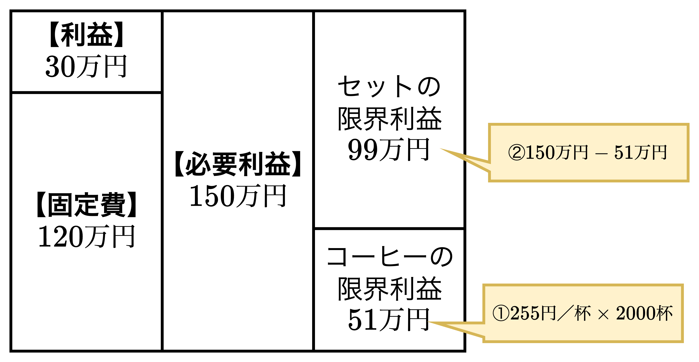

```bash
# ケーキを自家製にした場合の1ヶ月の利益目標
◾販売予定    コーヒー単品    2000杯(販売価格300円/杯)
            ケーキセット    2000セット
◾コーヒー1杯あたりの材料費      45円/杯
◾ケーキ1個あたりの材料費        80円/個
---
◾店の家賃                    30万円/月
◾その他の費用                 25万円/月(+5.1万円/月)
◾人件費                      65万円/月(+18万円/月)    計 120万円/月
```

- 利益目標30万円を考えた時、以下の手順でケーキセットの限界利益を求める。
  1. 固定費を求める。$30+25+65=\bold{\underline{120万円}}$
  2. 必要利益を求める。$120+30=\bold{\underline{150万円}}$
  3. 必要利益からコーヒー2000杯売り上げた時の限界利益を引いてケーキセットの限界利益を求める。$150万円-255円/杯\times 2000杯=150万円-51万円=\bold{\underline{99万円}}$
- ケーキセットの限界利益（$99万円$）からケーキセットの販売価格を求める
  1. ケーキセットの販売価格を$x$とすると、以下の式から算出できる。

$$
\begin{align*}
(&x-125)\times 2,000=990,000\\[3mm]
&x-125=\frac{990,000}{2,000}=495円\hspace{3mm}
&\therefore\hspace{3mm}x=495+125=\bold{\underline{620円}}
\end{align*}
$$

<div style="page-break-before:always"></div>

### 価格500円の自家製ケーキセットを2,000セット、コーヒー単品2,000杯の販売では利益はいくらでしょう

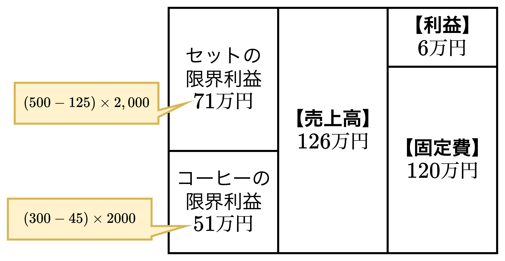

- 売上高を$x$とした時、以下の式から算出可能。

$$
\begin{align*}
x&=(300-45)\times 2,000+(500-125)\times 2,000\\
&=255\times 2,000+375\times 2,000\\
&=510,000+750,000=1,260,000=\bold{\underline{126万円}}
\end{align*}
$$

### 売上高、原価、利益でシミュレーションするCVP分析

- これまでに、<font color=red>原価(Cost)、売上高や販売費用(Volume)、利益(Profit)の関係を条件を変えてシミュレーションしながら分析することを<b>CVP分析</b></font>と呼ぶ。
- 変動費、固定費のコスト構造がわかると、損益分岐点分析だけでなく**計画策定などに使うCVP分析も可能**になる。変動P/LはCVP分析に有用であり、結果を「視覚化」することができる。

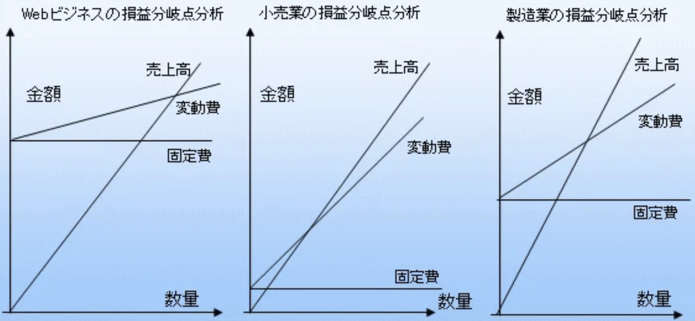

<div style="page-break-before:always"></div>

### 利益を生み出す3つの視点

- **利益を上げるとは、「限界利益を上げる」もしくは「固定費を下げる」の2つの視点がある**。限界利益を上げるには「材料単価の値下げ(変動比率を下げる)」もしくは「販売価格を上げる(限界利益率を上げる)」のさらに2つの視点がある。

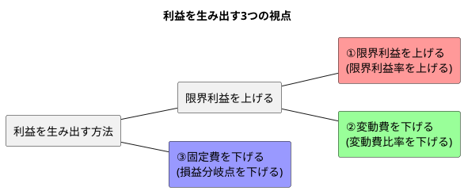

$$
\begin{align*}
利益&=限界利益-\color{blue}固定費\\
&=売上高\times \color{red}限界利益率\color{black}-\color{blue}固定費\\
&=売上高\times (1-\color{green}変動費比率\color{black})-\color{blue}固定費
\end{align*}
$$

### 損益分岐点の売上高を下げるイメージを図表で掴もう

- 損益分岐点の売上高を下げて利益を出す方法は3つある。
  - 【<b>パターン1: <font color=blue>固定費</font>の削減</b>】人件費や家賃などの削減のこと。固定費を削減できれば、損益分岐点の売上高は下がり、利益の出やすい体質になる。
  - 【<b>パターン2: <font color=green>変動費比率</font>を下げる</b>】変動費総額を下げるのではなく、販売価格に占める変動費の割合を引き下げること。具体的にはコーヒー1杯あたりの変動費を45→40→35円と引き下げることを意味する。
  - 【<b>パターン3:  <font color=red>限界利益率</font>を上げる</b>】<u>固定費が変化しないという前提のもと</u>、サービスミックス(ランチのセット、パソコンの初期設定セット、自動車保険と火災保険セットなど)によるトータルの限界利益率をアップさせる方法を取る。

$$
\begin{align*}
損益分岐点売上高&=\frac{\color{blue}固定費}{\color{red}限界利益率}=\frac{\color{blue}固定費}{1-\color{green}変動費比率}
\end{align*}
$$

#### 【パターン1】<font color=blue>固定費</font>の削減→費用低下

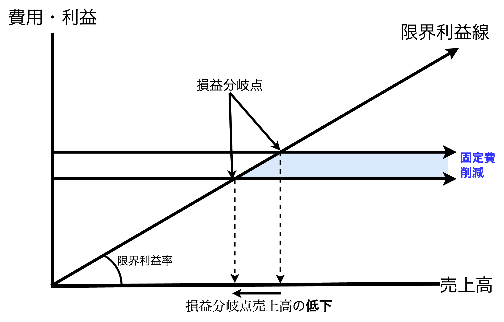

#### 【パターン2】<font color=green>変動比率</font>を下げる→費用低下

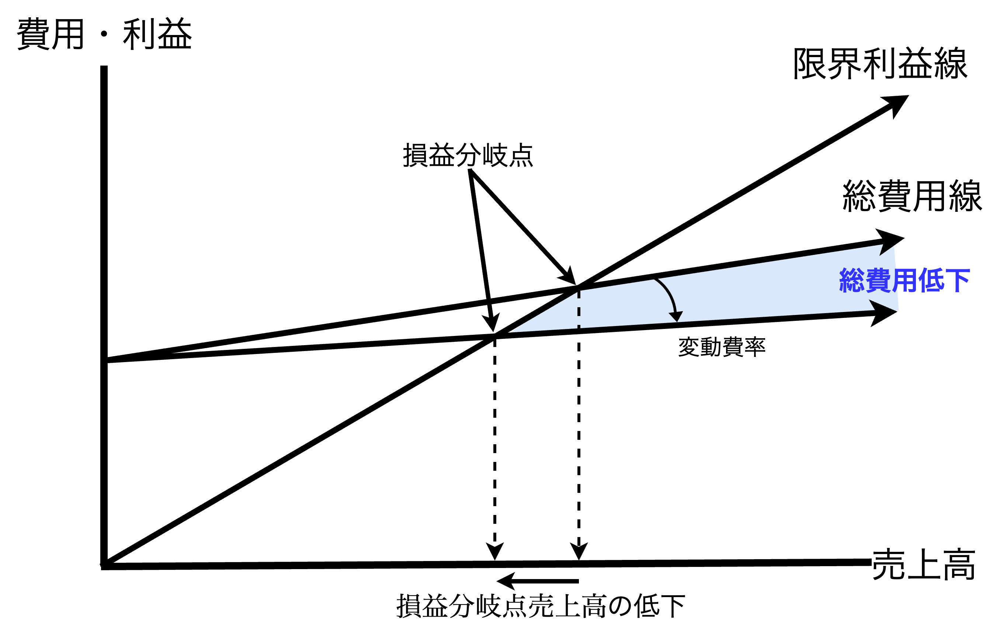

#### 【パターン3】<font color=red>限界利益率</font>を上げる→利益増加

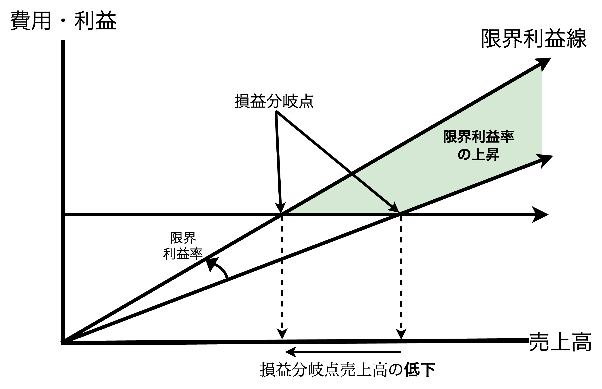

## 変動費と固定費の見分け方、考え方

- 【**ポイント**】変動費は「**外部から購入した価値**」、固定費は「**付加価値を生み出す力**」

### 変動費(Variable Cost)の内容

- <font color=red>変動費と固定費は勘定科目ごとに分類する方法がよく使用される</font>。
- カフェクローバーでは材料費を変動費としていたが、製造業、建設業、飲食業、ソフト開発業によって材料費の内容はそれぞれ異なる。
  - 【**カフェクローバーにおける代表的な変動費**】材料費(水、コーヒー豆などの材料費だけでなく、<u>砂糖、ミルク、紙おしぼりなどの消耗品費も材料費として含む</u>)。
  - 【**製造業・建設業における変動費**】材料費、補助材料費、買入部品費、消耗品費
  - 【**卸・小売業における変動費**】商品売上原価(※1)
  【※**1**】商品仕入額のうち「販売された商品は商品売上原価」に計上し、「残ったものは在庫」に計上する。
  - 【**その他の変動費**】発送配達費、梱包資材費(※2)、燃料費(※2)
  【※**2**】実際には消耗品費になっていることが多い。
- 製造業、建設業、ソフト開発業で利用が増えている「**外注加工費**」や「**業務委託費**」も変動費である。

### 変動費の3つの特徴

- **変動費は業界によって異なるが**、材料費、消耗品費、買入部品費、商品売上原価、外注加工費(外注費)、発送配達費、燃料費、梱包資材費など**多岐にわたる勘定科目を含む**。
- 変動費に共通3つの特徴は以下の通り。
  - 【**1つ目**】変動費は売上高に比例して発生する。このため、<u>変動費は比例費とも呼ばれる</u>。
  - 【**2つ目**】変動費は直接費である。生産活動、販売活動との関連が強いので<u>変動費は業務活動原価とも呼ばれる</u>。商品や外注費などの変動費は次の活動資金に回す必要があるため、売上代金から優先的に支払われる。
  - 【**3つ目**】変動費は外部から購入した価値である(**本質的な部分**)。自社で作った価値ではなく他社が作った価値を購入したものであり、<font color=red><b>変動費は付加価値を構成しない</b></font>。

<div style="page-break-before:always"></div>

### 固定費(Fixed Cost)の内容

- <font color=red>固定費は「どれだけ商品を作ったり、モノを売ったりしても金額が変わらない費用」</font>である。実際には、**総費用から変動費を取り出してそれ以外を固定費とするのが実務的である**。「$変動費の勘定科目数< 固定費の勘定科目数$」であるため、変動費を特定できれば自然と固定費は判明する。
- 代表的な固定費は以下の通り。
  - 【**人件費**】給与、法定福利費(厚生年金、健康保険などの会社負担分)など
  - 【**設備関連費**】地代家賃、減価償却費、リース料など
  - 【**金融費用**】支払利息など

### 固定費(Fixed Cost)の3つの特徴

- 固定費に共通3つの特徴は以下の通り。
  - 【**1つ目**】固定費はどれだけ生産・販売を行なっても、生産高や販売量に比例して費用が増えず、常に一定額が発生する費用である。
  - 【**2つ目**】固定費は生産・販売体制を維持し、管理するための費用である。生産台数が変化しても「一定額」の減価償却費やリース料、地代家賃は発生する。またメンテナンス費用も生産・販売に比例して発生するわけでもない。このことから<u>固定費は「キャパシティコスト(能力原価)」とも呼ばれる。</u>
  - 【**3つ目**】固定費は時間経過に伴い発生する費用である。**財務会計**では決算時に減価償却費を計上するが、これでは部門ごとに月次で損益計算書を作る場合、期末の月度のみ減価償却費用が大きくなる(期中は減価償却費用0)。一方、**管理会計**では、減価償却費用を12で割り、月毎に減価償却費用を計上することで<u>業績管理に役立てることができる</u>。

<div style="page-break-before:always"></div>

### 売上に連動しない固定費をなぜかけるのか

```
【Question】
もし変動費だけをかけて、固定費を1円もかけなかった場合、利益はどうなるか。

【Answer】
費用と売上の値が一致し、利益が1円も生まれない。
(費用＝売上＝商品仕入原価)
```

- 例えば、定価100円のジュースを買い、100円で売ることと同じである。変動費100円、固定費0円、売上100円になる。つまり、「<font color=red><b>固定費をかけるとは手間をかけ、付加価値(粗利益)を生むこと</b></font>」である。
- もし<u>固定費をかけない場合</u>、総費用は変動費のみとなり、もし原価に上乗せしても、顧客に商品のメリットを何も感じさせることができない。実際の商売でも、<font color=red>販促費や人件費という固定費(手間)をかけることで仕入原価に利益を乗せて販売できる</font>。

### 【固定費の本質(4つ目の特徴)】固定費には付加価値創造力がある

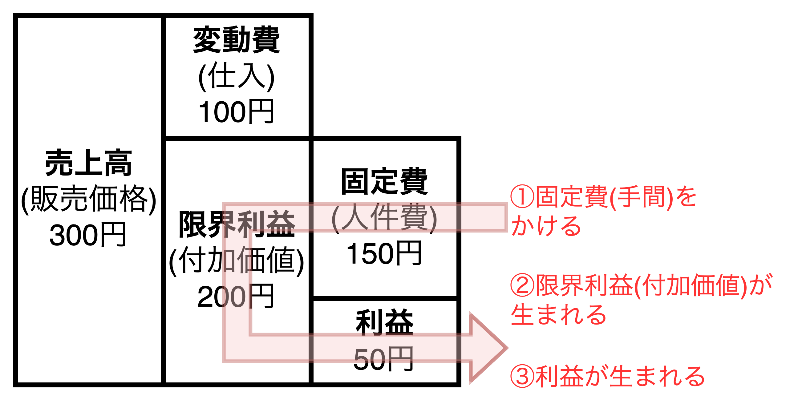

- 固定費をかけることで限界利益(固定費＋利益)を作り出し、付加価値を生み出すことができる。
- 必ずしも固定費かければ付加価値が生まれるわけではなく、付加価値(限界利益)を生まない手間(固定費)は削減の対象になる。<font color=red>「適切な手間(固定費)」が「適当な付加価値」を生む</font>。

$$
\color{red}固定費をかける→付加価値を生み出す→利益が生まれる
$$

<div style="page-break-before:always"></div>

## 固定費と変動費がはっきりしないときの考え方

<table>
    <tr>
        <th>準変動費<br>(電気代、ガス代、水道代、電話代など)</th>
        <th>準固定費<br>(パート、アルバイド代、販売促進費など)</th>
    </tr>
    <tr>
        <td>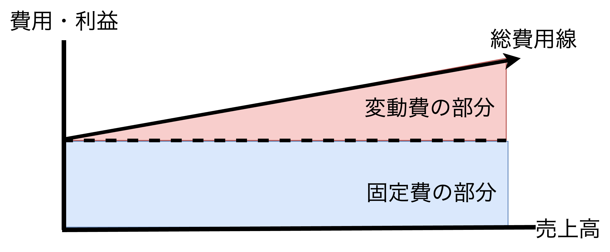</td>
        <td></td>
    </tr>
</table>

- 【**ポイント**】<u>一定の操業度を前提とすると</u>、<font color=red><b>短期的(1年以内)には準変動費・準固定費は固定費である</b></font>。
※操業度とは、生産設備の利用状況を示す割合や度合いであり、具体的には企業の生産能力（設備、人員、資材など）に対して、実際にどの程度設備が利用されているかを示すもの。<u>稼働率や利用率とも呼ばれる</u>。
- 【<font color=red><b>重要な視点</b></font>】損益分岐点分析と短期利益計画で使用される「変動費」と「固定費」は以下の<u>2つの前提</u>を持つ。
  1. **1年以内(短期間)の分析**であること
  2. **正常な操業度(販売量、生産量、営業時間などのこと)の範囲**で考えること
- 勘定科目ごとに変動費と固定費を分類する方法を「**勘定科目精査法**」と呼び、変動損益計算書を作成する際によく使用される手法。この時、**準変動費**と**準固定費**と呼ばれる変動費と固定費の要素が混在する勘定科目が存在する。
  - 【**準変動費**】固定費と変動費の2つの要素を持つ勘定科目。
  - 【**準固定費**】一定の操業度の水準を超えると急に増加する固定費(一定の操業度では一定の固定費になる)。
- 【**補足**】準変動費について固定費部分を固定費、変動費部分を変動費として分けて扱う考え方もあるが、その方法は正しくはない。電気代やガス代などは売上に対して比例せず、「営業時間」に対して比例する費用であり、固定費の特徴と一致している。<u>【<font color=red><b>重要な視点</b></font>】の説明にある2つの前提を適用できる場合は**準変動費は固定費として考えても良い**</u>。
- 【**補足**】1年以内で考える短期利益計画では、一定の操業度で一定の固定費が発生することを前提とするが、3ヵ年の利益計画を考えるときは売上規模の変化に伴い「変動費比率」や「固定費の発生総額」も変化することがある。そのため、<u>1年を超える利益計画では、毎年、変動費比率と固定費総額を売上高や生産高に応じて変更して考える必要がある</u>。

<div style="page-break-before:always"></div>

## 勘定科目別データがないときの損益分岐点の求め方

- 【**ポイント**】最小2乗法は収益と費用の関係を分析するのに役立つ。
- 本節では、勘定科目別データが存在しない場合に変動費比率と固定費総額を求める。

<table>
    <caption>【表1: サンプルデータ】ある企業の売上高と費用の6年間のデータ</caption>
	<tbody>
		<tr>
			<th></th>
			<th>売上高(x) [百万円]</th>
			<th>費用(y) [百万円]</th>
			<th>偏差(x)</th>
			<th>偏差(y)</th>
		</tr>
		<tr>
			<td>2020年</td>
			<td>1,200</td>
			<td>1,170</td>
			<td>-250</td>
			<td>-215</td>
		</tr>
		<tr>
			<td>2021年</td>
			<td>1,300</td>
			<td>1,240</td>
			<td>-150</td>
			<td>-145</td>
		</tr>
		<tr>
			<td>2022年</td>
			<td>1,400</td>
			<td>1,330</td>
			<td>-50</td>
			<td>-55</td>
		</tr>
		<tr>
			<td>2023年</td>
			<td>1,500</td>
			<td>1,425</td>
			<td>+50</td>
			<td>+40</td>
		</tr>
		<tr>
			<td>2024年</td>
			<td>1,600</td>
			<td>1,530</td>
			<td>+150</td>
			<td>+145</td>
		</tr>
		<tr>
			<td>2025年</td>
			<td>1,700</td>
			<td>1,620</td>
			<td>+250</td>
			<td>+235</td>
		</tr>
	</tbody>
</table>

### 最小二乗法による回帰分析

- 上表から回帰式を求め、固定費と変動費を考える。総費用線$y$を求めるには売上高の平均$\mu_x$、費用の平均$\mu_y$、売上高の分散$\sigma_{x}$、費用と売上高の共分散$\sigma_{xy}$を求める。

$$
\begin{align*}
\mu_x&=\displaystyle{\frac{1200+1300+1400+1500+1600+1700}{6}}=1450[百万円]\\[3mm]
\mu_y&=\displaystyle{\frac{1170+1240+1330+1425+1530+1600}{6}}=1385.8\dot{3}≒1386[百万円]\\[3mm]
\sigma_x&=\frac{(-250)^2+(-150)^2+(-50)^2+50^2+150^2+250^2}{6}=29166.\dot{6}≒29167[百万円^2]\\[3mm]
\sigma_{xy}&=\frac{53958+21875+2792+1958+21625+58542}{6}=26791.\dot{6}≒26792[百万円^2]\\
&\therefore y-\mu_y=\frac{\sigma_{xy}}{\sigma_x^2}(x-\mu_x)\Leftrightarrow y-1386=\frac{26792}{29167}(x-1450)\Leftrightarrow y=0.91857x+54.07
\end{align*}
$$

- ここで、$0.91857$が変動費比率、$54.07$万円が固定費になるため、損益分岐点売上高$y_{BEP}$は以下の通り。

$$
y_{BEP}=\frac{54.07}{1-0.91857}≒663.3≒\bold{\underline{663[百万円]}}
$$

<div style="page-break-before:always"></div>

#### 【補足】最小二乗法による回帰式の求め方

$n$個の実測データを$(x_i, y_i)$とすると求める回帰式$\hat{y}=ax+b$を用いて、目的関数$S$は以下のようになる。

$$
min\hspace{2mm}S=\sum_{i=1}^n(y_i-\hat{y_i})^2
$$

この式に対して$a$と$b$それぞれで微分すると以下の通り。

$$
\begin{align*}
\frac{\delta S}{\delta a}&=\sum_{i=1}^n2x_i(y_i-\hat{y_i})=2\left(\sum_{i=1}^nx_iy_i-a\sum_{i=1}^nx_i^2-b\sum_{i=1}^nx_i\right)=0\\[3mm]
\frac{\delta S}{\delta b}&=\sum_{i=1}^n2(y_i-\hat{y_i})=2\left(\sum_{i=1}^ny_i-a\sum_{i=1}^nx_i-b\sum_{i=1}^n1\right)=0
\end{align*}
$$

つまり、

$$
\left\{
    \begin{array}{l}
    \displaystyle{\sum_{i=1}^nx_iy_i-a\sum_{i=1}^nx_i^2-b\sum_{i=1}^nx_i=0}\hspace{21mm}(1)\\[5mm]
    b=\mu_y-a\mu_x\hspace{50mm}(2)
    \end{array}
  \right.
$$

ここで、$\mu_x、\mu_y、\sigma_x^2、\sigma_{xy}$はそれぞれ実測値$x$の平均、実測値$y$の平均、実測値$x$の分散、実測値$x$と$y$の共分散を表す。次に、式$(2)$を式$(1)$に代入して整理する。

$$
\sum_{i=1}^nx_iy_i-a\sum_{i=1}^nx_i^2-(\mu_y-a\mu_x)\sum_{i=1}^nx_i=0\Leftrightarrow
a\left(\sum_{i=1}^nx_i^2-n\mu_x^2\right)=\sum_{i=1}^nx_iy_i-\mu_x\mu_y\\[3mm]
\sigma_x^2a=\sigma_{xy}\hspace{3mm}
\therefore\hspace{3mm}\underline{a=\frac{\sigma_{xy}}{\sigma_x^2}\hspace{1mm},\hspace{1mm}b=\mu_y-\frac{\sigma_{xy}}{\sigma_x^2}\mu_x}
$$

ここで、<b>$ax$は変動費($a$は変動費比率)、$b$は固定費</b>となるため、損益分岐点売上高は以下のようになる。

$$
\begin{align*}
損益分岐点売上高&=\frac{固定費}{限界利益率}=\underline{\frac{b}{1-a}=\frac{\sigma_{xy}\mu_y-\sigma_x^2\mu_x}{\sigma_{xy}-\sigma_x^2}}
\end{align*}
$$

<div style="page-break-before:always"></div>

## 【まとめ】損益分岐点分析で登場した計算式

<table>
    <tr>
        <th>損益分岐点図表</th>
        <th>　限界利益図表　　　</th>
    </tr>
    <tr>
        <td></td>
        <td></td>
    </tr>
</table>
<table>
    <tr>
        <th>経営安全額と損益分岐点売上高</th>
        <th>変動費と固定費と利益の関係</th>
    </tr>
    <tr>
        <td></td>
        <td></td>
    </tr>
</table>

$$
\color{red}変動費\color{black}率=\frac{\color{red}変動費}{売上高}=\frac{\color{red}変動費\color{black}/個}{販売価格/個}\\[2mm]
\color{red}変動費\color{black}率+限界\color{green}利益\color{black}率=1\\[2mm]
損益分岐点売上高=\frac{\color{blue}固定費}{限界\color{green}利益\color{black}率}=\frac{\color{blue}固定費}{1-\color{red}変動費\color{black}率}\\[3mm]
必要売上高=\frac{\color{blue}固定費\color{black}+\color{green}目標利益\color{black}}{限界利益率}\\[3mm]
経営安全率+損益分岐点比率=1\\[2mm]
経営安全額+損益分岐点売上高=売上高\\[2mm]
限界利益=売上高-\color{red}変動費\color{black}=\color{blue}固定費\color{black}+\color{green}利益\color{black}\iff 売上高=\color{red}変動費\color{black}+\color{blue}固定費\color{black}+\color{green}利益\color{black}
$$
