<style>
    body {
      counter-reset: chapter 2;
    }
    h1 {
        counter-reset: sub-chapter;
    }
    h2 {
        counter-reset: section;
    }

    h1::before {
        counter-increment: chapter;
        content: "第" counter(chapter) "章 ";
    }
    h2::before {
        counter-increment: sub-chapter;
        content: counter(chapter) "-" counter(sub-chapter) " ";
    }
</style>

# 変動損益計算書の活用法

## 変動損益計算書を作ってみよう

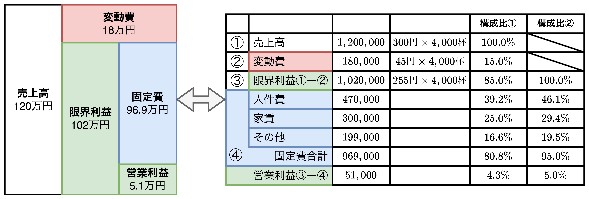

- 【**ポイント**】<font color=red>変動損益計算書は損益をシミュレーションできる。</font>
- 「変動損益計算書は管理会計の入口」と言え、業績管理に役立つ情報が満載である。**変動損益計算書を見ることで変動費や固定費の変化が売上にどう影響するのかがわかる**。
- 損益分岐点分析では、売上高から変動費を引いたものが限界利益、限界利益から固定費を引いたものが利益であり、**損益分岐点分析で登場する「利益」は「営業利益」を指す**。つまり、<u>固定費と変動費は売上原価と販売費・一般管理費を対象に分類することになる</u>。

```plantuml
title 費用について
left to right direction

rectangle 費用 as cost
note top of cost
損益計算書と変動損益計算書で
費用の分類方法は異なる。
end note
rectangle 変動損益計算書 {
    rectangle 変動費 as variable
    rectangle 固定費 as fixed
}
rectangle 損益計算書 {
    rectangle 売上原価 as genka
    rectangle "販売費・一般管理費" as hankan
}

variable -- cost
fixed -- cost
cost -- hankan
cost -- genka
```

$$
\begin{align*}
【\bold{損益計算書}】営業利益&=売上総利益-販管費=売上高-(売上原価+販管費)\\[2mm]
【\bold{変動損益計算書}】営業利益&=限界利益\hspace{3.5mm}-固定費=売上高-(変動費+固定費)
\end{align*}
$$

<div style="page-break-before:always"></div>

### 目標利益30万円、2,000杯のコーヒーと2,000個のケーキセットを販売した場合の変動損益計算書

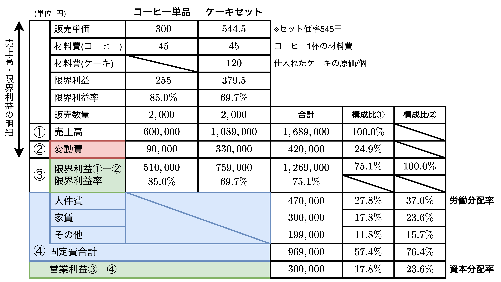

- 変動損益計算書を見ることで以下の内容を確認できる。
  1. 「商品別」の売上高と変動費と限界利益
  2. 「全体」の売上高と変動費と固定費(と営業利益)
- 上表の変動損益計算書からは<b>変動費比率$24.9\%$、固定費比率$57.4\%$、営業利益率$17.8\%$</b>であることがわかる。
- 変動損益計算書のうち、**構成比②**は「限界利益に対する構成比」になっており、<font color=red>限界利益に対する人件費は<b>労働分配率</b></font>、<font color=red>限界利益に対する営業利益は<b>資本分配率</b></font>と呼び、人件費分析や業績管理で重要になる。

<div style="page-break-before:always"></div>

### 変動損益計算書でシミュレーションする

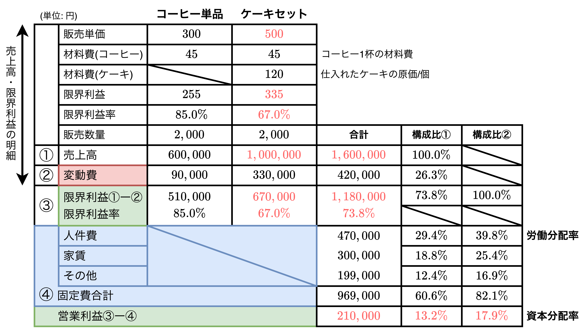

- ケーキセットの販売価格を$545→500$円に変更することでどのように変化するかを分析する。
- 分析結果として分かったことは以下の通り。
  - ケーキセットの販売価格を下げると<font color=red>売上高、限界利益、営業利益が下がる</font>ことがわかった(当たり前)。具体的には、売上高は160万円、限界利益は118万円、営業利益が21万円に下がる。
  - <font color=red>費用の比率(変動費比率や固定費比率、労働分配率など)が上がる</font>(当たり前)。具体的には、変動費比率が$26.3\%$、固定費比率が$60.6\%(82.1\%)$、労働分配率が$29.4\%(39.8\%)$に上がる。

<div style="page-break-before:always"></div>

### 自家製ケーキセットを2,000個、コーヒーを2,000杯を販売し、目標利益30万円

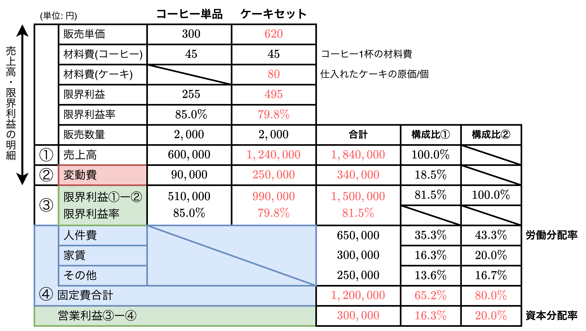

- ケーキセットを自家製にし、目標営業利益を$30$万円としたときの必要な売上高を考える。この時、全体で必要な原価利益は$150$万円($120+30$万円)であり、このうち、$99$万円($150-51$万円)がケーキセットに必要な限界利益であるため、ケーキセットの販売価格$x$は$(x-125)\times 2000=990,000$の等式で表現でき、$x=620$となることがわかる。
- 分析結果としてわかったことは以下の通り。
  - <font color=red>ケーキを自家製にし、目標利益30万円を得るには売上高を$15.1$万円上げないといけない$(168.9万円→184万円)$</font>。
  - ケーキを自家製にすると固定費比率が$57.4\%(76.4\%)→65.2\%(80.0\%)$に上がる。
  - ケーキセットの限界利益率も上がり、$69.7\%→79.8\%(10.1\%↑)$になる。また全体の限界利益率も上がり、$75.1\%→81.5\%(6.4\%↑)$になる。つまり、<font color=red>「<b>ケーキの付加価値を高めた</b>」と解釈できる</font>。

<div style="page-break-before:always"></div>

### 自家製ケーキセットを550円で目標利益30万円を達成できるケーキの販売数(ただしコーヒー4,000杯が上限)

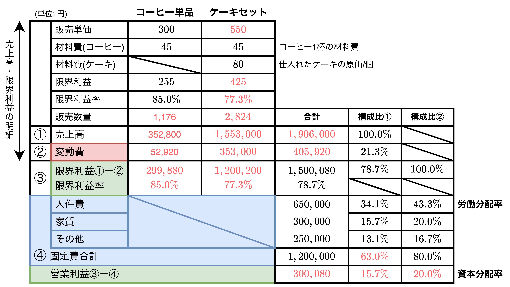

- 目標利益$30$万円のためにケーキセットを$620$円にすると、競争の観点から適正価格とは言い切れない。そこで$620→550$円に変更し、変動損益計算書を作成する。
- 分析結果としてわかったことは以下の通り。
  - ケーキセットの販売数量を$2,824$杯にすると$30$万円を超える。その際のコーヒーの販売数量は$1,176杯(4,000-2824)$。
  - 自家製ケーキ620円と550円の変動損益計算書を比較すると、売上高の増加に伴い、限界利益率と営業利益率が低下傾向にある。
  - <font color=red>仕入れケーキ545円と自家製ケーキ550円を比較すると販売数量が824個増えることから、自家製ケーキの独自性が必要になる</font>。

<div style="page-break-before:always"></div>

### ケーキ単品（テイクアウト有り）の500個販売時の変動損益計算書

#### 【独自性の追加】自家製ケーキをテイクアウト可能にする

```plantuml
title 変動損益計算書のシミュレーション
left to right direction

rectangle "①**仕入れ**\nケーキセット\n545円\n\n②**仕入れ**\nケーキセット\n500円" as step1
rectangle "③**自家製**\nケーキセット\n620円\n\n④**自家製**\nケーキセット\n550円" as step2
rectangle "⑤**自家製**\n個売りケーキ\n300円" as step3
note right of step3
今ここ
end note

step1 --> step2
step2 --> step3
```

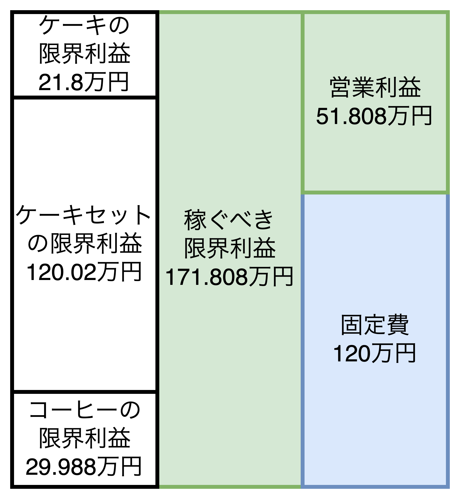

- 仕入れたケーキセット545円を2,000個販売すると営業利益30万円を達成できることを確認し、自家製ケーキ550円を2,824個販売すると営業利益30万円を達成できることを確認した。
- 仕入れケーキか自家製ケーキのどちらかを選ぶ基準として、「<font color=red>自社の特徴(<b>付加価値</b>)を創出できるかどうか</font>」が重要になる。例えば、自家製ケーキをテイクアウト可能にすることを考える。<u>検討事項として包装箱(ケーキ4個まで包装可能)が必要</u>になる。
- 例えば、包装箱1つで5円の費用がかかるとする。ケーキ単体を300円/個として、顧客当たり$2.5$個のケーキを販売する場合、1人あたり$(300円/個-80円/個)\times 2.5個-5円=\bold{\underline{545円}}$の限界利益が考えられる。テイクアウトで400人販売できれば$545円/人\times 400人=\bold{\underline{21.8万円}}$の限界利益を得ることが想定できる。

#### 変動損益計算書

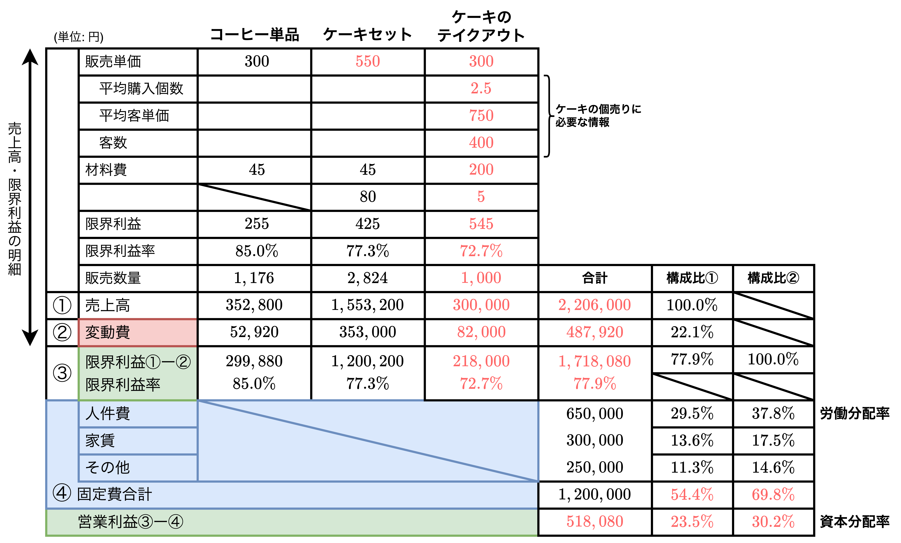

- 上表はケーキのテイクアウトを適用した場合の変動損益計算書である。ケーキのテイクアウトの効果は以下の通り。
  - <font color=red>限界利益$\bold{\underline{21.8万円}}$がそのまま営業利益になる</font>
  - 固定費比率が$63.0\%(80.0\%)→54.4\%(69.8\%)$に下がる。
  - 資本分配率が$15.7\%(20.0\%)→23.5\%(30.2\%)$に上がる。
- **①仕入れケーキセット**と**⑤自家製個売りケーキ**それぞれの変動損益計算書を比較して、固定費が$96.9万円→120万円$に増加しているが、営業利益は$30万円→51.8万円$に増加していることがわかる。このことから、<font color=red>固定費は付加価値創造力を持つ</font>ことがわかる。つまり、<u>変動損益計算書は業績管理ツールである</u>。
- 【**補足**】コーヒー$1,176$杯とケーキセット$2,824$個の販売の時点で損益分岐点を超えているため、ケーキの個売りの利益は全て経営安全額として上乗せする。**一般的に、経営安全額(損益分岐点売上高を超える売上高)から生まれる限界利益は全て営業利益として計上できる**。

<div style="page-break-before:always"></div>

## 変動損益計算書は付加価値計算書だ

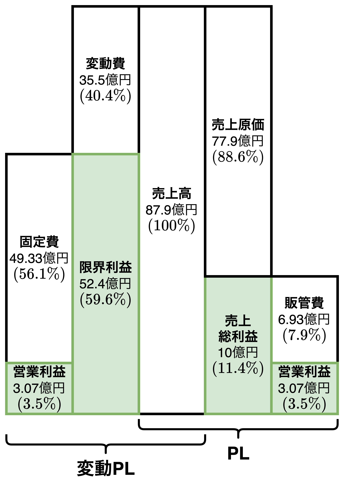

- 【**ポイント**】変動損益計算書は付加価値の金額、発生した理由(固定費の内容)を明らかにできる。
- 費用を<font color=red>「変動費と固定費」で分けると商品やサービスの「付加価値」を視覚化（<b>顧客の視点</b>）</font>でき、<font color=red>「売上原価と販管費」で分けると「会社の収益構造」を視覚化（<b>企業の視点</b>）</font>できる。

<div style="page-break-before:always"></div>

### 一般の損益計算書(P/L)でわかること

<table>
    <caption>スーパー銭湯の損益計算書</caption>
	<tbody>
		<tr>
			<th>項目</th>
			<th>金額(単位：万円)</th>
			<th>構成比</th>
		</tr>
		<tr>
			<td>売上高</td>
			<td>879,000</td>
			<td>100.0%</td>
		</tr>
		<tr>
			<td>売上原価</td>
			<td>779,000</td>
			<td>88.6%</td>
		</tr>
		<tr>
			<td>売上総利益</td>
			<td>100,000</td>
			<td>11.4%</td>
		</tr>
		<tr>
			<td>販売費・一般管理費</td>
			<td>69,300</td>
			<td>7.9%</td>
		</tr>
		<tr>
			<td>営業利益</td>
			<td>30,700</td>
			<td>3.5%</td>
		</tr>
	</tbody>
</table>

<table>
    <tr>
        <td>
            <table>
                <caption>売上原価の内訳</caption>
                <tbody>
                    <tr>
                        <th>項目</th>
                        <th>金額</th>
                        <th>構成比</th>
                    </tr>
                    <tr>
                        <td>商品売上原価</td>
                        <td>112,000</td>
                        <td>14.4%</td>
                    </tr>
                    <tr>
                        <td>サービス原価</td>
                        <td>667,000</td>
                        <td>85.6%</td>
                    </tr>
                    <tr>
                        <td>　労務費</td>
                        <td>160,000</td>
                        <td>20.5%</td>
                    </tr>
                    <tr>
                        <td>　業務委託費</td>
                        <td>117,000</td>
                        <td>15.0%</td>
                    </tr>
                    <tr>
                        <td>　水道光熱費</td>
                        <td>120,000</td>
                        <td>15.4%</td>
                    </tr>
                    <tr>
                        <td>　その他経費</td>
                        <td>270,000</td>
                        <td>34.7%</td>
                    </tr>
                    <tr>
                        <td>合計</td>
                        <td>779,000</td>
                        <td>100.0%</td>
                    </tr>
                </tbody>
            </table>
        </td>
        <td>
            <table>
                <caption>販売費・一般管理費の内訳</caption>
                <tbody>
                    <tr>
                        <th>項目</th>
                        <th>金額</th>
                        <th>構成比</th>
                    </tr>
                    <tr>
                        <td>販管人件費</td>
                        <td>32,200</td>
                        <td>46.5%</td>
                    </tr>
                    <tr>
                        <td>ポイント販促費</td>
                        <td>6,000</td>
                        <td>8.7%</td>
                    </tr>
                    <tr>
                        <td>その他</td>
                        <td>31,100</td>
                        <td>44.8%</td>
                    </tr>
                    <tr>
                        <td>合計</td>
                        <td>69,300</td>
                        <td>100%</td>
                    </tr>
                </tbody>
            </table>
        </td>
    </tr>
</table>

- 「1-3.顧客視点と企業視点」でも紹介した通り、$\bold{限界利益(付加価値)}=固定費(手間)+営業利益$ であり、一休みの空間や従業員のサービス、ムードのある高価な調度品や綺麗な景色を提供により実現している。
- 上表は損益計算書と費用(売上原価と販管費)の内訳を表しており、わかることは以下の通り。
  - 売上原価はスーパー銭湯を運営するための「直接原価」であり、商品売上原価とサービス原価に分けられ、$88.6\%$かかっている。<u>サービス業としての特徴が出ている</u>。
    - 【**商品売上原価**】スーパー銭湯内の飲料や入浴用品などの仕入商品の売上原価。
    - 【**サービス原価**】銭湯の現場で発生した費用。人件費(労務費)や業務委託費(清掃作業など)、水道光熱費、その他経費(減価償却費、リース料など)が含まれる。
  - 販管費は本社で発生した費用であり、$7.9\%$と少ない。

<div style="page-break-before:always"></div>

### 変動損益計算書(変動P/L)でわかること

<table>
    <caption>スーパー銭湯の変動P/L</caption>
	<tbody>
		<tr>
			<th>項目</th>
			<th>金額(単位：万円)</th>
			<th>構成比①</th>
			<th>構成比②</th>
		</tr>
		<tr>
			<td><b>A.売上高</td>
			<td>879,000</td>
			<td>100.0%</td>
			<td>ー</td>
		</tr>
		<tr>
			<td><b>B.変動費合計<br>(①+②+③+④)</td>
			<td>355,000</td>
			<td>40.4%</td>
			<td>ー</td>
		</tr>
		<tr>
			<td>　①商品売上原価</td>
			<td>112,000</td>
			<td>12.7%</td>
			<td>ー</td>
		</tr>
		<tr>
			<td>　②業務委託費</td>
			<td>117,000</td>
			<td>13.3%</td>
			<td>ー</td>
		</tr>
		<tr>
			<td>　③水道光熱費</td>
			<td>120,000</td>
			<td>13.7%</td>
			<td>ー</td>
		</tr>
		<tr>
			<td>　④ポイント販促費</td>
			<td>6,000</td>
			<td>0.7%</td>
			<td>ー</td>
		</tr>
		<tr>
			<td><b>C.限界利益<br>(A-B)</td>
			<td>524,000</td>
			<td>59.6%</td>
			<td>100.0%</td>
		</tr>
		<tr>
			<td><b>⑤人件費合計<br>(⑤-1+⑤-2)</td>
			<td>192,200</td>
			<td>21.9%</td>
			<td>36.7%</td>
		</tr>
		<tr>
			<td>　⑤-1労務費</td>
			<td>160,000</td>
			<td>18.2%</td>
			<td>30.5%</td>
		</tr>
		<tr>
			<td>　⑤-2販管人件費</td>
			<td>32,200</td>
			<td>3.7%</td>
			<td>6.1%</td>
		</tr>
		<tr>
			<td>⑥その他経費</td>
			<td>270,000</td>
			<td>30.7%</td>
			<td>51.5%</td>
		</tr>
		<tr>
			<td>⑦その他の販管費</td>
			<td>31,100</td>
			<td>3.5%</td>
			<td>5.9%</td>
		</tr>
		<tr>
			<td><b>D.固定費合計<br>(⑤+⑥+⑦)</td>
			<td>493,300</td>
			<td>56.1%</td>
			<td>94.1%</td>
		</tr>
		<tr>
			<td><b>営業利益<br>(C-D)</td>
			<td>30,700</td>
			<td>3.5%</td>
			<td>5.9%</td>
		</tr>
	</tbody>
</table>

- <font color=red>売上高と営業利益はP/Lと同じであるが、限界利益が売上総利益と異なる</font>。具体的には**売上総利益は10億円(11.4%)**、**限界利益は52.4億円(59.6%)** であり、5.24倍になっている。
- 違いは費用の分け方にあり、<font color=red>P/Lからは固定費(手間)の部分が見えない。つまり、<b>P/Lを見てもどのように付加価値を高めたかわからない</b></font>。

<div style="page-break-before:always"></div>

## 変動損益計算で見えてくる経営の姿

- 【**ポイント**】変動P/Lは①付加価値(限界利益)の大きさ、②付加価値を生み出す源泉(固定費)、③付加価値の人への分配割合(労働分配率)、④その他固定費への分配、が見える業績管理表である。

### 経営の流れは「投資に始まり、分配で清算する」

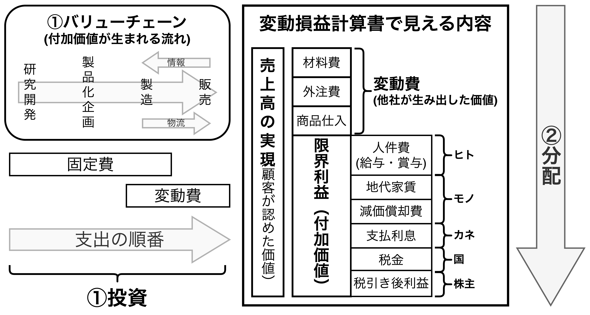

#### 【①投資】バリューチェーンと固定費

- 研究開発から始まり、製品・サービスの企画→製造→販売という流れの中で付加価値が構築されていく。この**付加価値を生み出す流れをバリューチェーン(価値連鎖)** と呼ぶ。
- 研究開発費(研究開発)、生産設備や店舗設備の資金(製造)、人件費や教育訓練費の資金(販売)などは「**固定費**」として表れる。固定費の発生後は材料仕入、外注費、商品仕入などの「**変動費**」を使った活動が始まる。変動費は生産・販売を行うと発生するため、固定費より後の段階で発生する傾向があり、固定費をかけないと全ての活動はスタートしない。

#### 【②分配】変動費の回収と付加価値の分配

- <font color=red>販売によって売上が計上されると、まずは売上高から変動費を支払う原資を確保する</font>。<u>理由は次の生産の材料仕入や商品仕入を続け、生産・販売をストップさせないためである</u>。このことから、変動費は「**業務活動原価**」を呼ばれる。
- 売上高から変動費を支払うと「**限界利益**」が残る。この限界利益が「**付加価値**」であり、この限界利益をヒト・モノ・カネ・国・株主などへ分配する。
- 最優先は給与や賞与などの「ヒトへの分配」であり、支払利息、税金と続き、最後に残る付加価値は「当期純利益」になる。最後は当期純利益が配当や自社株買いを通して株主へ分配する。

### 変動P/Lで明らかになる5つの経営指標

<table>
    <caption>スーパー銭湯の変動P/L</caption>
	<tbody>
		<tr>
			<th></th>
			<th></th>
			<th>構成比①</th>
			<th>構成比②</th>
		</tr>
		<tr>
			<td><b>A.売上高</td>
			<td>879,000</td>
			<td>100.0%</td>
			<td>ー</td>
		</tr>
		<tr>
			<td><b>B.変動費合計(①+②+③+④)</td>
			<td>355,000</td>
			<td>40.4%</td>
			<td>ー</td>
		</tr>
		<tr>
			<td>　①商品売上原価</td>
			<td>112,000</td>
			<td>12.7%</td>
			<td>ー</td>
		</tr>
		<tr>
			<td>　②業務委託費</td>
			<td>117,000</td>
			<td>13.3%</td>
			<td>ー</td>
		</tr>
		<tr>
			<td>　③水道光熱費</td>
			<td>120,000</td>
			<td>13.7%</td>
			<td>ー</td>
		</tr>
		<tr>
			<td>　④ポイント販促費</td>
			<td>6,000</td>
			<td>0.7%</td>
			<td>ー</td>
		</tr>
		<tr>
			<td><b>C.限界利益(A-B)<br>(D.限界利益率)</td>
			<td>524,000<br>(59.6%)</td>
			<td>59.6%</td>
			<td>100.0%</td>
		</tr>
		<tr>
			<td><b>⑤人件費合計(⑤-1+⑤-2)</td>
			<td>192,200</td>
			<td>21.9%</td>
			<td>36.7%</td>
		</tr>
		<tr>
			<td>　⑤-1労務費</td>
			<td>160,000</td>
			<td>18.2%</td>
			<td>30.5%</td>
		</tr>
		<tr>
			<td>　⑤-2販管人件費</td>
			<td>32,200</td>
			<td>3.7%</td>
			<td>6.1%</td>
		</tr>
		<tr>
			<td>⑥その他経費</td>
			<td>270,000</td>
			<td>30.7%</td>
			<td>51.5%</td>
		</tr>
		<tr>
			<td>⑦その他の販管費</td>
			<td>31,100</td>
			<td>3.5%</td>
			<td>5.9%</td>
		</tr>
		<tr>
			<td><b>E.固定費合計(⑤+⑥+⑦)</td>
			<td>493,300</td>
			<td>56.1%</td>
			<td>94.1%</td>
		</tr>
		<tr>
			<td><b>営業利益(C-D)</td>
			<td>30,700</td>
			<td>3.5%</td>
			<td>5.9%</td>
		</tr>
		<tr>
			<td><b>F.損益分岐点売上高(E÷D)<br>G.損益分岐点比率(F÷A)</td>
			<td>827,501<br>94.1%</td>
		</tr>
		<tr>
			<td>経営安全額(A-F)<br>経営安全率(1-G)</td>
			<td>51,499<br>5.9%</td>
		</tr>
		<tr>
			<td>労働分配率[%]（人件費合計÷限界利益）</td>
			<td>36.7%</td>
		</tr>
		<tr>
			<td>労働生産性[万円]（限界利益÷社員数）</td>
			<td>1,278</td>
		</tr>
		<tr>
			<td>一人当たりの人件費[万円]（人件費合計÷社員数）</td>
			<td>469</td>
		</tr>
		<tr>
			<td>社員数[人]</td>
			<td>410</td>
		</tr>
	</tbody>
</table>

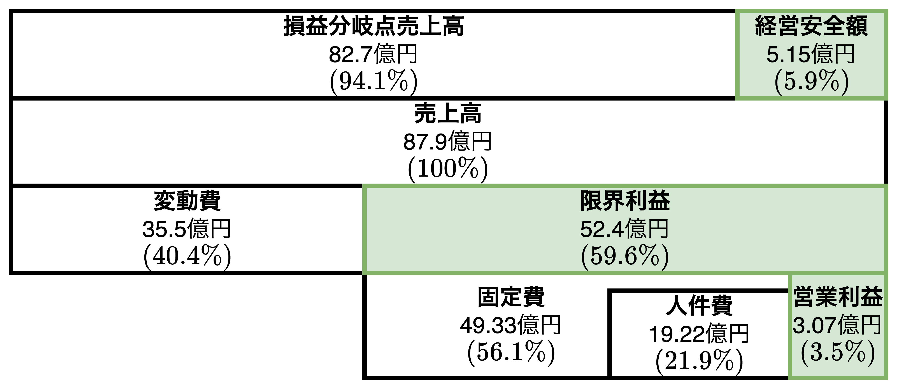

$$
\color{green}限界利益\color{black}=売上高-変動費
\hspace{1mm},\hspace{3mm}
限界利益率=\frac{\color{green}限界利益\color{black}}{売上高}\\[3mm]
損益分岐点売上高=\frac{固定費}{限界利益率}
\hspace{1mm},\hspace{3mm}
損益分岐点比率=\frac{損益分岐点売上高}{売上高}\\[3mm]
経営安全額=売上高-損益分岐点売上高\\[3mm]
経営安全率=\frac{経営安全額}{売上高}=1-損益分岐点比率\\[3mm]
\color{red}労働分配率[\%]\color{black}=\frac{人件費}{\color{green}限界利益\color{black}}
\hspace{1mm},\hspace{3mm}
資本分配率[\%]=\frac{営業利益}{\color{green}限界利益\color{black}}\\[3mm]
\color{blue}労働生産性[円/人]\color{black}=\frac{\color{green}限界利益\color{black}}{社員数}
\hspace{1mm},\hspace{3mm}
\color{red}労働分配率[\%]\color{black}=\frac{1人当たりの人件費}{\color{blue}労働生産性\color{black}}
$$

```plantuml
title 労働生産性と労働分配率の関係
left to right direction

rectangle "労働生産性が増える" as elem1 #aaf
rectangle "労働分配率が減る" as elem2 #faa
rectangle "限界利益が増える" as elem3 #afa
rectangle "人件費が減る" as elem4
rectangle "社員数が減る" as elem5
rectangle "【**具体策**】\n人員コスト見直し\n(リストラや給与・賞与見直し)" as elem6
rectangle "【**具体策**】\n高付加価値戦略への転換" as elem7

elem1 -- elem5: パラメータ
elem1 - elem3: パラメータ
elem2 -- elem4: パラメータ
elem3 - elem2: パラメータ
elem3 --> elem7
elem4 --> elem6
elem5 --> elem6
```

<div style="page-break-before:always"></div>

#### 【指標1】限界利益と限界利益率

- 付加価値の分析には限界利益と限界利益率を求める。どの程度付加価値があるのか確認する。
  - スーパー銭湯の場合、$59.6\%$の限界利益率(付加価値率)がある
- **粗利（売上総利益）** は企業の直接的な利益であり、**限界利益**は商品・サービスの付加価値である。

#### 【指標2】損益分岐点の売上高と損益分岐点比率

<table>
	<caption><b>損益分岐点比率の判定基準</caption>
	<tbody>
		<tr>
			<th>優良</th>
			<th>健全</th>
			<th>普通</th>
			<th>注意</th>
			<th>危険</th>
		</tr>
		<tr>
			<td>〜70%未満</td>
			<td>70%以上〜80%未満</td>
			<td>80%以上〜90%未満</td>
			<td>90%以上〜95%未満</td>
			<td>95%超〜</td>
		</tr>
	</tbody>
</table>

- 利益がゼロになる売上高を損益分岐店売上高という。
- 損益分岐点比率は小さいほど赤字に陥る可能性が小さくなる。<font color=red>目安として、損益分岐点比率は$90\%$を超えるとあまり良くない水準にいる</font>。

#### 【指標3】経営安全額と経営安全率

- 売上高から損益分岐点売上高を引いた金額を「経営安全額」と呼び、**安全余裕額**とも言われる。
- <font color=red>経営安全額は「売上をどの程度下げれば赤字になるのかを表す金額」</font>を示しており、スーパー銭湯の例では$5.9\%$の売上高を下げても赤字にならないことを示している。

#### 【指標4】労働分配率(限界利益に対する人件費の割合)

- <u>労働分配率は限界利益に対する人件費の割合</u>であり、**優良企業は労働分配率が小さくなる**。理由は優良企業は「限界利益の伸び率」が「人件費の伸び率」よりも大きいことが多いからである。
- <font color=red><b>労働分配率の目安は$50\%$</b>であり、$60\%$や$70\%$を超えると利益を圧迫していると判断され、赤字の可能性が生まれるため、見直しが必要になる</font>。
- <u>経営者は限界利益の総額を予想しながら人件費を設定・管理することで労働分配率の目標を決め、**昇給や採用に役立てる**</u>。

#### 【指標5】労働生産性と1人当たり人件費

- <u>労働生産性は一人当たりの限界利益</u>であり、労働分配率を乗じれば「1人当たりの人件費」が算出できる。
- ここで、臨時社員の計算は労働時間等で設定する。正社員は8時間労働で、派遣社員は6時間の場合、0.75人として計算したりする。

<div style="page-break-before:always"></div>

## 業種別の付加価値(限界利益)の違いを理解しよう

- 【**ポイント**】限界利益率は業種別の経営の本質を示している。

### 製造業の付加価値

<table>
	<tr>
		<td>
			<table>
				<caption>一般的なP/L</caption>
				<tbody>
					<tr>
						<th>項目</th>
						<th>金額</th>
					</tr>
					<tr>
						<td>売上高</td>
						<td>10,000</td>
					</tr>
					<tr>
						<td>売上原価</td>
						<td>8,000</td>
					</tr>
					<tr>
						<td>　材料費</td>
						<td>4,000</td>
					</tr>
					<tr>
						<td>　労務費</td>
						<td>1,000</td>
					</tr>
					<tr>
						<td>　外注加工費</td>
						<td>1,200</td>
					</tr>
					<tr>
						<td>　その他経費</td>
						<td>1,800</td>
					</tr>
					<tr>
						<td>売上総利益<br>(粗利率20%)</td>
						<td>2,000</td>
					</tr>
					<tr>
						<td>輸送費等</td>
						<td>300</td>
					</tr>
					<tr>
						<td>その他販管費</td>
						<td>1,200</td>
					</tr>
					<tr>
						<td>営業利益</td>
						<td>500</td>
					</tr>
				</tbody>
			</table>
		</td>
		<td>
			<table>
				<caption>変動P/L</caption>
				<tbody>
					<tr>
						<th>売上高</th>
						<th>10,000</th>
					</tr>
					<tr>
						<td>変動費</td>
						<td>5,500</td>
					</tr>
					<tr>
						<td>　材料費</td>
						<td>4,000</td>
					</tr>
					<tr>
						<td>　外注加工費</td>
						<td>1,200</td>
					</tr>
					<tr>
						<td>　輸送費等</td>
						<td>300</td>
					</tr>
					<tr>
						<td>限界利益<br>(限界利益率45%)</td>
						<td>4,500</td>
					</tr>
					<tr>
						<td>固定費合計</td>
						<td>4,000</td>
					</tr>
					<tr>
						<td>　労務費</td>
						<td>1,000</td>
					</tr>
					<tr>
						<td>　その他経費</td>
						<td>1,800</td>
					</tr>
					<tr>
						<td>　その他販管費</td>
						<td>1,200</td>
					</tr>
					<tr>
						<td>営業利益</td>
						<td>500</td>
					</tr>
				</tbody>
			</table>
		</td>		
	</tr>
</table>

- 【**PLの特徴**】製造業は売上原価が多くなる傾向が強く、販管費の割合が比較的小さくなる傾向がある。今回の例で言うと、<u>粗利率が20%であることから販管費を20%以内に抑える必要がある</u>。
- 【**変動PLの特徴**】製造業では労務費や減価償却費などの固定費の比率が大きく、固定費が含まれている限界利益が粗利率よりも高くなる傾向がある。今回の例で言えば、<u>粗利率は20%、限界利益率は45%である</u>。<font color=red>限界利益率は製造業の活動の本質を占めている</font>。
- 現実を見ると<u>変動費の外注加工費を活用する製造業が多い</u>。以下(i)〜(iii)の流れで**負の効果**が生まれる。
  1. 外注加工費(変動費)を活用する。
  2. <font color=red>固定費をかけて付加価値を高める製造業の本質に反する。</font>
  3. 本来の企業の力を失うことになりかねない。
  4. 【**対策**】方針を見直し、高付加価値を創出する仕組み・体制を構築する必要がある。

### 小売業の付加価値

<table>
	<tr>
		<td>
			<table>
				<caption>一般的なP/L</caption>
				<tbody>
					<tr>
						<th>項目</th>
						<th>金額</th>
					</tr>
					<tr>
						<td>売上高</td>
						<td>10,000</td>
					</tr>
					<tr>
						<td>売上原価</td>
						<td>7,000</td>
					</tr>
					<tr>
						<td>売上総利益<br>(粗利率30%)</td>
						<td>3,000</td>
					</tr>
					<tr>
						<td>輸送費等</td>
						<td>300</td>
					</tr>
					<tr>
						<td>その他販管費</td>
						<td>2,200</td>
					</tr>
					<tr>
						<td>営業利益</td>
						<td>500</td>
					</tr>
				</tbody>
			</table>
		</td>
		<td>
			<table>
				<caption>変動P/L</caption>
				<tbody>
					<tr>
						<th>項目</th>
						<th>金額</th>
					</tr>
					<tr>
						<td>売上高</td>
						<td>10,000</td>
					</tr>
					<tr>
						<td>売上原価</td>
						<td>7,000</td>
					</tr>
					<tr>
						<td>輸送費等</td>
						<td>300</td>
					</tr>
					<tr>
						<td>限界利益<br>(限界利益率27%)</td>
						<td>2,700</td>
					</tr>
					<tr>
						<td>　その他販管費</td>
						<td>2,200</td>
					</tr>
					<tr>
						<td>営業利益</td>
						<td>500</td>
					</tr>
				</tbody>
			</table>
		</td>		
	</tr>
</table>

- 小売業は販売業であるため、販売現場で費用を使うことで付加価値を生み出す業種である。そのため小売業では、**販管費・一般管理費をいかに利活用するかが、付加価値を生み出すポイント**になる。例えば、教育訓練のための<u>人件費</u>、品物の欠品をなくすための<u>発送配達費</u>、販促チラシや広告などの<u>広告費</u>、などが挙げられる。これにより顧客の来店母数を増やし、粗利率を高める方法をとる。
- 小売業では販管費に投資しないと付加価値が生まれないため、時間と共に売上高も粗利も縮小していく。
- 今回の例で言えば、粗利率が30%であることから販管費を30%以内に抑える必要がある。一方、限界利益で見ると27%であり、粗利率より小さいことがわかる。<font color=red>小売業では原価の他に配送費や包装費などの消耗品費が変動費に加わるため、$粗利率(30\%)>限界利益率(27\%)$ になりやすい</font>。
- さらに、顧客にポイントを発行し、「ポイント販促費」を膨らませる小売業では変動費が増加し、限界利益率は低下するため、損益分岐点売上高$(\frac{固定費}{限界利益率})$は上がってしまう。
- 一般に**卸売業も小売業と同じく限界利益率が低くなりやすく**、粗利率の平均は18%と言われている。そのため、卸売業は以下のような取り組みを行い、固定費を上げ、付加価値を高めることを目指す。
  1. 小売業にプライベートブランド(PB)商品を企画提案する。
  2. 小売業に進出し、消費者情報を集め、小売業に活用する。
  3. 販売方法をアドバイスするなどのコンサルティング業務を行う。

<div style="page-break-before:always"></div>

## 営業所管理で活用できる変動損益計算書

- 【**ポイント**】
  - ①管理可能性に注目して固定費を分類する。
  - ②利益を区分し、責任者が木曜とする利益を明確にする。
  - ③2期比較変動損益計算書で業績管理を実践する。

<table>
	<caption><b>【例】日本アパレル販売東京営業所の変動P/L　(単位：万円)</caption>
	<tbody>
		<tr>
			<th>項目</th>
			<th>当期<br>(1)</th>
			<th>構成比①</th>
			<th>前期<br>(2)</th>
			<th>構成比②</th>
			<th>前年比<br>(1)÷(2)</th>
			<th>差異<br>(1)-(2)</th>
		</tr>
		<tr>
			<td><b>A.売上高</td>
			<td>43,000</td>
			<td>100.0%</td>
			<td>40,000</td>
			<td>100.0%</td>
			<td>107.5%</td>
			<td>3,000</td>
		</tr>
		<tr>
			<td><b>B.変動費</td>
			<td>27,000</td>
			<td>62.8%</td>
			<td>26,000</td>
			<td>65.0%</td>
			<td>103.8%</td>
			<td>1,000</td>
		</tr>
		<tr>
			<td><b>C.限界利益(A-B)<br>限界利益率(C÷A)</td>
			<td>16,000<br>37.2%</td>
			<td>37.2%</td>
			<td>14,000</td>
			<td>35.0%</td>
			<td>114.3%</td>
			<td>2,000<br>2.2%</td>
		</tr>
		<tr>
			<td><b>D.管理可能個別固定費</td>
			<td>9,000</td>
			<td>20.9%</td>
			<td>8,250</td>
			<td>20.6%</td>
			<td>109.1%</td>
			<td>750</td>
		</tr>
		<tr>
			<td>　人件費</td>
			<td>7,500</td>
			<td>17.4%</td>
			<td>6,800</td>
			<td>17.0%</td>
			<td>110.3%</td>
			<td>700</td>
		</tr>
		<tr>
			<td>　労働分配率(人件費÷C)</td>
			<td>46.9%</td>
			<td>ー</td>
			<td>48.6%</td>
			<td>ー</td>
			<td>ー</td>
			<td>▲1.7%</td>
		</tr>
		<tr>
			<td>　その他固定費</td>
			<td>1,500</td>
			<td>3.5%</td>
			<td>1,450</td>
			<td>3.6%</td>
			<td>103.4%</td>
			<td>50</td>
		</tr>
		<tr>
			<td><b>E.管理可能利益(C-D)</td>
			<td>7,000</td>
			<td>16.3%</td>
			<td>5,750</td>
			<td>14.4%</td>
			<td>121.7%</td>
			<td>1,250</td>
		</tr>
		<tr>
			<td><b>F.管理不能個別固定費</td>
			<td>4,800</td>
			<td>11.2%</td>
			<td>3,500</td>
			<td>8.8%</td>
			<td>137.1%</td>
			<td>1,300</td>
		</tr>
		<tr>
			<td>　減価償却費・リース料</td>
			<td>1,800</td>
			<td>4.2%</td>
			<td>1,000</td>
			<td>2.5%</td>
			<td>180.0%</td>
			<td>800</td>
		</tr>
		<tr>
			<td>　地代家賃</td>
			<td>3,000</td>
			<td>7.0%</td>
			<td>2,500</td>
			<td>6.3%</td>
			<td>120.0%</td>
			<td>500</td>
		</tr>
		<tr>
			<td><b>G.営業所利益(E-F)</td>
			<td>2,200</td>
			<td>5.1%</td>
			<td>2,250</td>
			<td>5.6%</td>
			<td>97.8%</td>
			<td>▲50</td>
		</tr>
		<tr>
			<td><b>H.共通固定費(配賦額)</td>
			<td>2,000</td>
			<td>4.7%</td>
			<td>1,800</td>
			<td>4.5%</td>
			<td>111.1%</td>
			<td>200</td>
		</tr>
		<tr>
			<td>営業利益(G-H)</td>
			<td>200</td>
			<td>0.5%</td>
			<td>450</td>
			<td>1.1%</td>
			<td>44.4%</td>
			<td>▲250</td>
		</tr>
		<tr>
			<td>従業員数</td>
			<td>15名</td>
			<td>ー</td>
			<td>14名</td>
			<td>ー</td>
			<td>ー</td>
			<td>ー</td>
		</tr>
	</tbody>
</table>

### 管理可能かどうかで固定費・利益を分類する

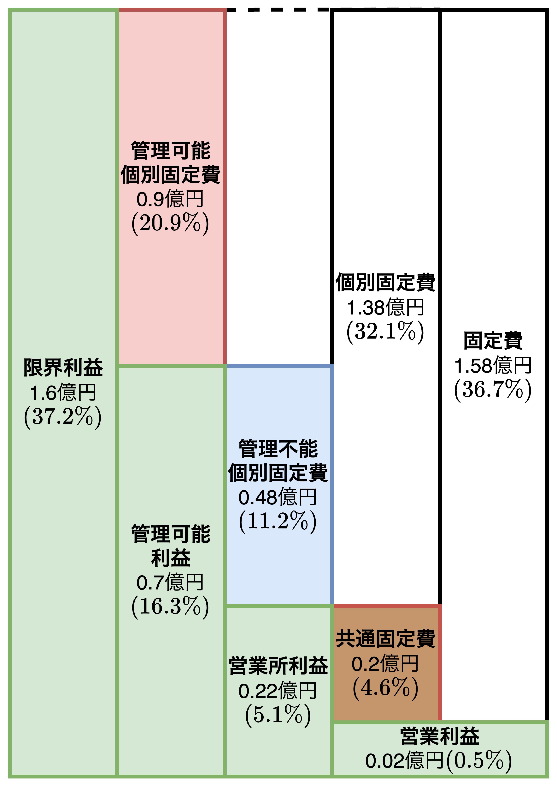

$$
\begin{align*}
管理可能利益&=\color{green}限界利益\color{black}-\color{red}管理可能個別固定費\\
営業所利益&=管理可能利益-\color{blue}管理不能個別固定費\\
営業利益&=営業所利益-\color{brown}共通固定費\\
&=\color{green}限界利益\color{black}-(\color{red}管理可能個別固定費\color{black}+\color{blue}管理不能個別固定費\color{black}+\color{brown}共通固定費\color{black})
\end{align*}
$$

<div style="page-break-before:always"></div>

- 固定費は東京営業所で個別に発生している固定費(**個別固定費**)と本社で発生している間接経費(**共通固定費**)に分類します。さらに、個別固定費は管理可能個別固定費と管理不能個別固定費に分類する。
  - 【**管理可能個別固定費**】<u>営業所の責任者が管理可能な固定費</u>。交通費、広告費、交際費、消耗品費、人件費(※)など。
  ※基本給部分は本社で決まるので管理不能であり、2面性がある。
  - 【**管理不能個別固定費**】<u>営業所では管理不可の固定費</u>。減価償却費、リース料、地代家賃のような設備費
- 管理可能利益、営業所利益の特徴は以下の通り。
  - 【**管理可能利益**】<font color=red>管理可能利益は日々の営業活動で達成責任がある利益</font>である。責任者が管理可能な利益であるため。
  - 【**営業所利益**】<font color=red>営業所利益は設備費などの費用回収ができるかどうかを判断する際に必要になるため、達成可否を意識する必要がある</font>。また、営業所利益は設備投資や出店場所によって営業所利益は大きく影響を受け、「<u>投資内容が適正かどうかの判断材料</u>」にもなる。

### 2期比較の変動P/Lの見方

- 変動P/Lの見方は以下の流れで行う。
  1. **売上高**に対する各項目の構成比を見る
  2. **売上高**の伸び率と各項目の伸びを比較する
  3. **限界利益**の伸び率と各項目の伸びを比較する

#### ①売上高に対する各項目の構成比を見る

- <u>売上高を$100\%$とした時の費用影響度合いを把握する</u>。費用がどのくらいの利益の増減に影響しており、**前期と比べて「なぜ増えたのか、なぜ減ったのか」を評価**する。
- 日本アパレル販売東京営業所の変動P/Lからわかることは以下の通り。
  - 限界利益率が$35.0\%\rightarrow 37.2\%$に2.2ポイント増加している。逆に言うと、変動費率が2.2ポイント低下している。
  → 【**評価**】<font color=red>商品別または商品グループ別の限界利益率の変化を分析する必要がある</font>。
  - 管理可能利益は$14.4\%→16.3\%$に増加、営業所利益は$5.6\%→5.1\%$に減少、営業利益は$1.1\%→0.5\%$に減少している。
  → 【**評価**】管理可能個別固定費と管理不能個別固定費の変化を分析する必要がある。例えば、管理可能利益と管理不能個別固定費の増加から「店舗への設備投資とその集客効果が現れている」ことが推測できる。一方で営業所利益の減少から「管理可能利益率は改善できたが、減価償却費の増加分を賄いきれずに営業利益率が減少した」ことが推測できる。

<div style="page-break-before:always"></div>

#### ②売上高の伸び率と各項目の伸びを比較する

- **売上高の伸び率より大きくなっている項目に注目する**。
- 日本アパレル販売東京営業所の変動P/Lからわかることは以下の通り。
  - 限界利益が前期に比べて114.3%伸びている。
  → 【**評価**】<font color=red>変動費の伸び率が103.8%と相対的に売上高の伸び率より低いことが理由</font>である。仕入原価の削減効果が出ている状態。
  - 人件費の伸び率が110.3%になっている。
  → 【**評価**】従業員が14名→15名に増えたことが原因と推測できる。
  - 管理不能個別固定費が前期に比べ137.1%と大きく増加している。内訳として、減価償却費・リース料の伸び率が180.0%、地代家賃の伸び率が120.0%になっている。
  → 何か大きな投資をしたことが推測される。具体的には、地代家賃も増加していることから「<font color=red>土地の価格が高いところに新たな拠点を設けた</font>」ことが推測される。

#### ③限界利益の伸び率と各項目の伸びを比較する

- **売上高の伸び率と比較した後は限界利益の伸び率$114.3\%$と各項目の伸び率を比較する**。
- 日本アパレル販売東京営業所の変動P/Lからわかることは以下の通り。
  - 限界利益の伸び率114.3%に対して管理可能利益が121.7%に伸びている。
  → 【**評価**】管理可能個別固定費(付加価値)が限界利益を生み出すことに貢献していることが推測される。また、限界利益の伸び率が人件費の伸び率より大きいため、労働分配率が1.7ポイント下がっている$(48.6\%→46.9\%)$。これは<u>限界利益が人件費の支払い後も多く余り、管理可能利益に多く分配されていることを意味している</u>。
  - 営業所利益の伸び率が97.8%と低下している。
  → 【**評価**】「設備投資計画に問題があった」もしくは「投資効果が次期以降に表れる」かの可能性を示唆している。

<div style="page-break-before:always"></div>

### 商品グループ別の限界利益(率)の内容をチェックする

<table>
	<caption>前期の商品グループ別実績</caption>
	<tbody>
		<tr>
			<th>項目</th>
			<th>PB商品<br>(A商品)</th>
			<th>仕入商品<br>(B商品)</th>
			<th>雑貨小物<br>(C商品)</th>
			<th>合計</th>
		</tr>
		<tr>
			<td>売上構成比</td>
			<td>20.0%</td>
			<td>60.0%</td>
			<td>20.0%</td>
			<td>100.0%</td>
		</tr>
		<tr>
			<td>　売上高</td>
			<td>8,000</td>
			<td>24,000</td>
			<td>8,000</td>
			<td>40,000</td>
		</tr>
		<tr>
			<td>　△変動費</td>
			<td>4,000</td>
			<td>15,600</td>
			<td>6,400</td>
			<td>26,000</td>
		</tr>
		<tr>
			<td>　限界利益</td>
			<td>4,000</td>
			<td>8,400</td>
			<td>1,600</td>
			<td>14,000</td>
		</tr>
		<tr>
			<td>限界利益構成比</td>
			<td>28.6%</td>
			<td>60.0%</td>
			<td>11.4%</td>
			<td>100.0%</td>
		</tr>
		<tr>
			<td>限界利益率</td>
			<td>50.0%</td>
			<td>35.0%</td>
			<td>20.0%</td>
			<td>35.0%</td>
		</tr>
	</tbody>
</table>

<table>
	<caption>当期の商品グループ別実績</caption>
	<tbody>
		<tr>
			<th>項目</th>
			<th>PB商品<br>(A商品)</th>
			<th>仕入商品<br>(B商品)</th>
			<th>雑貨小物<br>(C商品)</th>
			<th>合計</th>
		</tr>
		<tr>
			<td>売上構成比</td>
			<td>30.0%</td>
			<td>50.0%</td>
			<td>20.0%</td>
			<td>100.0%</td>
		</tr>
		<tr>
			<td>　売上高</td>
			<td>12,900</td>
			<td>21,500</td>
			<td>8,600</td>
			<td>43,000</td>
		</tr>
		<tr>
			<td>　△変動費</td>
			<td>6,450</td>
			<td>14,620</td>
			<td>5,930</td>
			<td>27,000</td>
		</tr>
		<tr>
			<td>　限界利益</td>
			<td>6,450</td>
			<td>6,880</td>
			<td>2,670</td>
			<td>16,000</td>
		</tr>
		<tr>
			<td>限界利益構成比</td>
			<td>40.3%</td>
			<td>43.0%</td>
			<td>16.7%</td>
			<td>100.0%</td>
		</tr>
		<tr>
			<td>限界利益率</td>
			<td>50.0%</td>
			<td>32.0%</td>
			<td>31.0%</td>
			<td>37.2%</td>
		</tr>
		<tr>
			<td>限界利益伸び率</td>
			<td>161.3%</td>
			<td>81.9%</td>
			<td>166.9%</td>
			<td>114.3%</td>
		</tr>
		<tr>
			<td>限界利益増減</td>
			<td>2,450</td>
			<td>▲1,520</td>
			<td>1,070</td>
			<td>2,000</td>
		</tr>
	</tbody>
</table>

<div style="page-break-before:always"></div>

```plantuml
title 商品グループ別の限界利益の内容分析
left to right direction

rectangle "A商品の販売強化" as A
rectangle "【**固定費増加**】\n設備投資(売場拡充)" as B
rectangle "【**固定費増加**】\n広告宣伝費と接客(人件費)強化" as C
rectangle "管理不能個別固定費の増加\n(減価償却費やリース料)" as D
rectangle "【**利益増加**】\nA商品の限界利益増加\n2,450万円↑" as E
rectangle "【**利益増加**】\nC商品の限界利益増加\n1,070万円↑" as F
rectangle "【**利益減少**】B商品の限界利益減少\n1,520万円↓" as G

A --> B
A --> C
B --> D
B --> E
B --> G
C --> E
C --> F
```

- 各商品グループの売上構成比と限界利益構成比の変化を整理すると以下の通り。
  - 【**A商品**】売上構成比が$20→30\%$に<font color=red>上がって</font>おり、限界利益構成比が全商品グループの中で最高の$50\%$である。
  → 【**分析**】A商品の販売強化のために売り場を拡充(設備投資)しており、結果として、<font color=red>売上構成比が上がったが、管理不能個別固定費(減価償却費・リース料)も増加した</font>。
  - 【**B商品**】売上構成比が$35→32\%$に<font color=blue>下がって</font>おり、限界利益構成比も$60→50\%$に<font color=red>下がって</font>いる。
  → 【**分析**】A商品の販売強化のためにB商品を減らしたことが推測される。
  - 【**C商品**】売上構成比は変化がないが、限界利益構成比が$20→31\%$に<font color=red>上がって</font>いる。
  → 【**分析**】A商品の広告宣伝費と接客(人件費)を強化したことで、派生してC商品の販売が伸び、限界利益が伸びたと推測できる。
- 上記分析から、前期と比べて全体で$2,000万円(2,450-1,520+1,070)$の限界利益を上げたが、固定費が$2,250万円(750+1,300+200)$となったため、営業利益が前期と比べて$\bold{\color{red}-250万円}$となった。<u>次期には設備投資による固定費増加を吸収できる、**さらなる限界利益アップ策が必要**になる</u>。

<div style="page-break-before:always"></div>

### 限界利益を図表化する

##### 前期の多品種限界利益図表

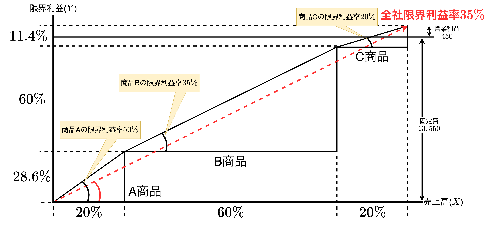

##### 当期の多品種限界利益図表

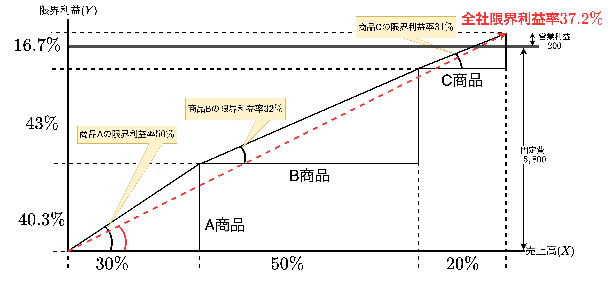

- 商品グループ別の利益貢献度の視覚化のために**多品種限界利益図表**がある。売上高($X$軸)の%のついた数字は商品グループごとの売上構成費を示し、限界利益($Y$軸)の%のついた数字は限界利益の構成比を示す。
- 三角形の傾きは「各商品グループの限界利益率」を表しており、赤点線は「全社の限界利益率」を表している。

### 利益を稼いだ日数

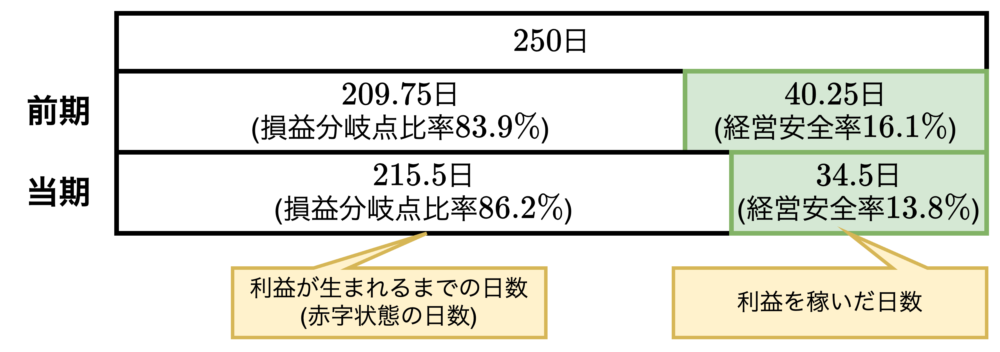

$$
\begin{align*}
利益を稼いだ日数[日]=年間営業日数[日]\times 経営安全率[\%]
\end{align*}
$$

- 当期の限界利益率は$35\%→37.2\%$で2.2ポイント増加しているが、固定費の伸び率が大きいため、損益分岐点比率が$83.9\%→86.2\%$の2.3ポイント増加している。つまり、経営安全率が$16.1\%→13.8\%$の2.3ポイント低下している。
- 経営安全率を用いて利益を稼いだ日数の算出が可能である。具体的には年間営業日数に経営安全率を乗算して求める。年間営業日数が250日とする。今回の例で言うと、前期は$250\times 16.1\%=40.25$日、当期は$250\times 13.8\%=34.5$日である。
- ここで、当期($34.5$日)と前期($40.25$日)の利益を生んだ日数の差分を計算すると$34.5-40.25=-5.75$日という日数が算出される。これは「**利益を稼ぐ機会を損失した**」ことを表している。
- 当期の限界利益が1.6億円であるため、$160,000,000[円]\div 250[日]\times 5.75[日]=640,000\times -5.75=-368万円$の営業所利益の上乗せの機会を損失したことを表している。

<div style="page-break-before:always"></div>

## 【まとめ】変動P/Lで登場した式・指標

<table>
	<tr>
		<th>労働の費用</th>
		<th>固定費の種類</th>
	</tr>
	<tr>
		<td></td>
		<td></td>
	</tr>
</table>


<table>
	<caption><b>損益分岐点比率の判定基準</caption>
	<tbody>
		<tr>
			<th>優良</th>
			<th>健全</th>
			<th>普通</th>
			<th>注意</th>
			<th>危険</th>
		</tr>
		<tr>
			<td>〜70%未満</td>
			<td>70%以上〜80%未満</td>
			<td>80%以上〜90%未満</td>
			<td>90%以上〜95%未満</td>
			<td>95%超〜</td>
		</tr>
	</tbody>
</table>

$$
\color{green}限界利益\color{black}=売上高-変動費
\hspace{1mm},\hspace{3mm}
限界利益率=\frac{\color{green}限界利益\color{black}}{売上高}\\[3mm]
損益分岐点売上高=\frac{固定費}{限界利益率}
\hspace{1mm},\hspace{3mm}
損益分岐点比率=\frac{損益分岐点売上高}{売上高}\\[3mm]
経営安全額=売上高-損益分岐点売上高\\[3mm]
経営安全率=\frac{経営安全額}{売上高}=1-損益分岐点比率\\[3mm]
\color{red}労働分配率[\%]\color{black}=\frac{人件費}{\color{green}限界利益\color{black}}
\hspace{1mm},\hspace{3mm}
資本分配率[\%]=\frac{営業利益}{\color{green}限界利益\color{black}}\\[3mm]
\color{blue}労働生産性[円/人]\color{black}=\frac{\color{green}限界利益\color{black}}{社員数}
\hspace{1mm},\hspace{3mm}
\color{red}労働分配率[\%]\color{black}=\frac{1人当たりの人件費}{\color{blue}労働生産性\color{black}}
$$

$$
\begin{align*}
管理可能利益&=\color{green}限界利益\color{black}-\color{red}管理可能個別固定費\\[1mm]
営業所利益&=管理可能利益-\color{blue}管理不能個別固定費\\[1mm]
営業利益&=営業所利益-\color{brown}共通固定費\\[1mm]
&=\color{green}限界利益\color{black}-(\color{red}管理可能個別固定費\color{black}+\color{blue}管理不能個別固定費\color{black}+\color{brown}共通固定費\color{black})
\end{align*}
$$
