<style>
    body {
      counter-reset: chapter 3;
    }
    h1 {
        counter-reset: sub-chapter;
    }
    h2 {
        counter-reset: section;
    }

    h1::before {
        counter-increment: chapter;
        content: "第" counter(chapter) "章 ";
    }
    h2::before {
        counter-increment: sub-chapter;
        content: counter(chapter) "-" counter(sub-chapter) " ";
    }
</style>

# 原価管理のポイントを理解しよう

## 原価計算と原価の関係を理解しよう

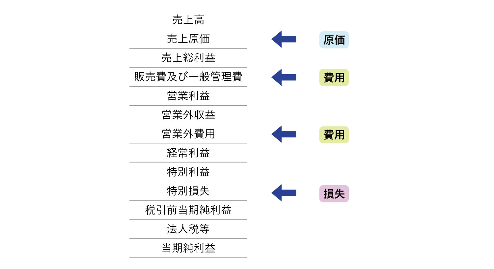

- 【**ポイント**】以下の2つのポイントがある。
  - **①原価計算は**製品原価だけでなく会議費、物流費などの**業務原価の把握もその役割である**。
  - **②原価計算は**戦略的意思決定などの**将来の採算分析という分野を含んでいる**。
- 一般的に原価計算とは「製造業」における製品の製造にいくら費用がかかったかを計算することを意味する、いわゆる**製造原価を計算すること**である。製造業以外でもソフトウェア開発会社では「ソフトウェア原価」、建設会社では「建設原価」を計算する。
- <font color=red>最近では、<u><b>営業・人事総務・物流などの分野</b>でも原価計算されるようになっている</u></font>。
  - 【**会議費の把握**】会社の会議の原価を計算し、無駄な会議の実態を明らかにする。
  - 【**物流費の明確化**】物流に要する費用集計し、効率的な物流方法を検討する。
  - 【**市場開拓費の集計**】新市場開拓に要した費用集計。
- 上記のことから、**原価計算とは広くとらえれば「経営目標を達成するために必要な情報提供を行う手法」** であり、そのために日々の事業活動で発生する製品・サービス・業務などに要した費用を集計・管理する。
- 原価と費用の違いは以下の通り。
  - 【**費用**】企業の事業活動で発生したあらゆるコストを指し、損益計算書に表示される項目。
  - 【**原価**】製品・サービス・業務など何かの目的ごとにまとめた対象についてそれぞれ集計される費用のことであり、<u>売上高に直接対応する費用</u>。　※販管費は原価ではない。
- このほか、<font color=red>物流費や会議費のような業務に関わる原価を計算するときは<b>販管費は費用かつ原価としての性格を持つ</b></font>。

### 原価の種類

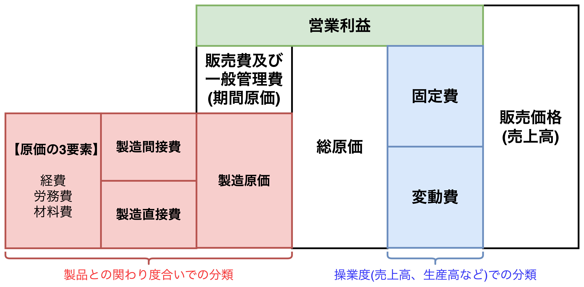

- 上図の左から以下のことがわかる。
  - 【**特徴1**】原価の3要素→直接費と間接費→製造原価と繋がっていき、製造原価と販管費を含めて総原価となる。
  - 【**特徴2**】総原価は固定費と変動費を分けることもできる。
  - 【**特徴3**】総原価に営業利益を販売価格(売上高)になる。
- 原価の3要素は**材料費**(モノを消費することで発生する原価)、**労務費**(労働力の投入によって発生する原価)、**経費**(材料費と労務費以外の原価)の3つを指し、<u>近年、経費の外注加工費と業務委託費が増えている</u>。
- 損益分岐点分析や変動P/Lは欠くことの出来ない変動費と固定費は**操業度で区別される**。
※【**操業度**】生産設備の利用状況を示す割合や度合いであり、具体的には企業の生産能力（設備、人員、資材など）に対して、実際にどの程度設備が利用されているかを示すもの。<u>稼働率や利用率とも呼ばれる</u>。
- 販管費は製品ごとに集計するのではなく、期間(半年や1年など)で集計するため「**期間原価**」と呼ばれる。
- 総原価を計画値で集計すれば予定販売価格が推定できる。電力料金など公共料金の決定に行われる手法(**統括原価主義**)である。そのため、<u>総原価を集計対象にする場合は販管費は原価になる</u>。
- <font color=red>「商品の販売で<b>ポイント販促費</b>や<b>支払販売手数料</b>が発生した」と売上高との対応関係が明らかなときは、<u>販管費を期間原価としないで変動費として売上高と対応させる</u></font>。

<div style="page-break-before:always"></div>

#### 【補足】原価の3要素とその関連

<table>
	<tbody>
		<tr>
			<th rowspan="6">製造<br>原価</th>
			<th rowspan="3">製造<br>直接費</th>
			<td>直接材料費</td>
			<td>原材料、買入材料</td>
		</tr>
		<tr>
			<td>直接労務費</td>
			<td>作業者給与、パート賃金</td>
		</tr>
		<tr>
			<td>直接経費</td>
			<td>特定の製品製造専用の機械のレンタル料、<br>特定の製造ラインの電力消費量</td>
		</tr>
		<tr>
			<th rowspan="3">製造<br>間接費</th>
			<td>間接材料費</td>
			<td>塗料、燃料、機械油、消耗品</td>
		</tr>
		<tr>
			<td>間接労務費</td>
			<td>管理・監督者給与、<br>点検・清掃作業員の賃金</td>
		</tr>
		<tr>
			<td>間接経費</td>
			<td>修繕費、賃借料、<br>設備の減価償却費、<br>工場の水道光熱費</td>
		</tr>
	</tbody>
</table>

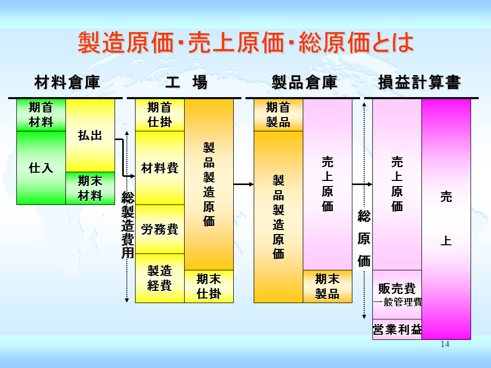

#### 【補足】非原価項目(原価にならない費用)

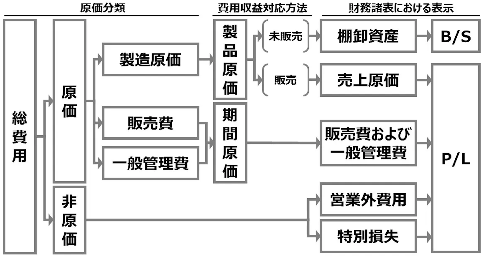

- 【**経営目的に関連しない費用**】経営活動に貢献していない遊休資産(事業用として資産を取得したものの事業変更や稼働停止している資産)、未稼働の固定資産、投資目的で所有している不動産、有価証券などから発生する費用(減価償却費、管理費、租税公課など)。
- 【**財務関連費用**】資金の調達によって発生する支払利息、支払割引料、株式や社債の発行費用などの財務費用。
- 【**異常な状態を原因とする価値の減少**】火災、地震などで被った損失、リストラによって発生した一時的・多額の退職金、経済危機などが原因で発生した多額の貸倒損失など。
- 上記費用は原価計算の対象から外すが、<u>管理会計における原価の対象適否は管理会計を利用する人が決めることができる</u>。そのため、<font color=red><b>管理会計を考えるときは利用目的に合った柔軟な発想が必要</b></font>。

<div style="page-break-before:always"></div>

### 原価計算の目的と管理会計のための原価計算

- 原価計算は経営活動を行なっていく上で利用される手法であり、業績管理の視点で整理すると6つの目的が見える。
- 【**目的1: 決算書の作成**】当期、四半期などの決算書作成時、利益を計算するためには製品在庫や製品の売上原価を計算する必要がある。<u>製品の製造原価が不明の場合、これらは計算できないため、原価計算は決算書作成で必要になる</u>。
- 【**目的2: 価格決定**】<u>販売価格の設定は事前の原価計算で決めるため、**原価の見積もりが重要**になる</u>。製造原価がわからないと販売価格を決められず、営業活動ができない。
- 【**目的3: 原価管理**】原価計算の主要な目的であり、原価の内容を分析し、どのような方法でいくら下げられるのかを計算する。例えば、$材料費=単価\times 消費量$であり、単価か消費量かどちらがアップしたのか要素を分けて考えれば、より具体的な対応策を検討できる。
- 【**目的4: 利益管理**】変動P/Lなどを用いて利益管理をする。製造原価を変動費と固定費に分けてこれまで利益管理をしたが、特に変動費だけで製品の製造原価を計算する手法を「**直接原価計算**」と呼ぶ。
- 【**目的5: 短期的意思決定に必要な情報提供**】次期利益資金計画(予算編成)を行う際、<u>製造原価を下回る受注を受けるべきかどうか</u>、<u>時給をいくらに設定すべきか</u>、<u>値下げ可能な原価かどうか</u>、など多岐に渡る決定事項がある。**1年以内の短期的な意思決定に必要な基礎データを提供するのも原価計算の目的**である。
- 【**目的6: 戦略的意思決定に必要な情報**】<u>中長期にわたる条件を検討し、戦略的な事項を決定することを**戦略的意思決定**と呼ぶ</u>。工場建設や店舗出店の計画などの戦略的な投資は5〜10年の投資回収が必要なケースが多く、長期間にわたる予想とシミュレーションが必要になる。このような長期予想では、フリーキャッシュフロー$(FCF=営業CF+投資CF)$を使用する。また、M＆A(合併・買収)を行う際に企業価値や株主価値を算定し、買収価額を決定する際にも原価計算は使用される。

<div style="page-break-before:always"></div>

## 経営の流れと原価計算の位置付け

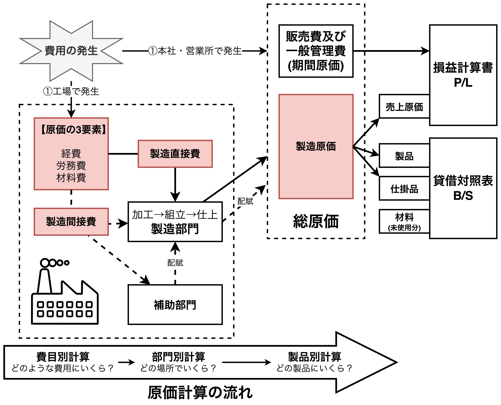

- 【**ポイント**】経営の流れとリンクさせて原価計算を理解しよう、
- 原価計算は費目別→部門別→製品別の3段階で行う。
  1. 【**費目別計算**】材料費、労務費、経費の原価の3要素に集計され、直接費と間接費に分けることも行われる。
  2. 【**部門別計算**】費目別計算で集計された原価要素を、その原価が発生した場所である部門（工場内の各製造部門や補助部門など）に集計・配賦する。<u>補助部門の費用を製造部門へ配賦したり、製造部門同士で費用を配賦する場合がある</u>。
  3. 【**製品別計算**】部門別計算で集計された原価を、製品単位に配賦・集計し、製品ごとの原価を算出する。直接費を加え、作業時間などの基準に従って間接費を配賦し、<u>製品の数量やロット単位で原価を計算し、製品の正確な原価を特定することが目的</u>。
- 製造原価から作り出される「製品」は3つに分けられ、未使用分の「材料」と合わせて計上。
  - 【**売上原価**】販売された製品。P/Lの売上原価に計上される。
  - 【**製品**】在庫として残った製品。B/Sの商品・在庫に計上される。
  - 【**仕掛品**】未完成の製品(完成品の製品とは別)。B/Sの仕掛品に計上される。
  - 【**材料(未使用分)**】余った材料。B/Sに計上される。

#### 【補足】原価計算の流れの詳細

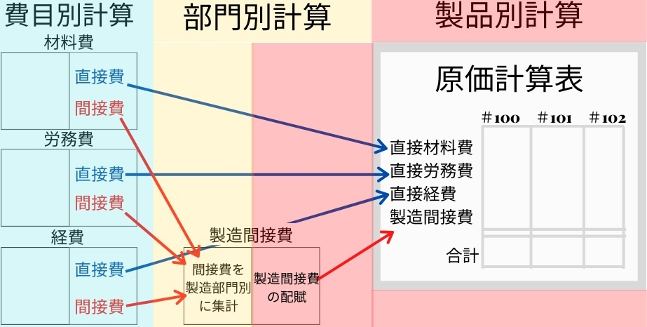

## 原価計算の分類（計算対象となる原価の捉え方）

- 【**ポイント**】原価計算は計算の目的によって色々な方法がある。

### 【原価の集計範囲の違い】全部原価計算と直接原価計算


- 【**全部原価計算**】 工場で発生した全ての原価(原価の3要素)を集計して、製品の製造原価を集計する原価計算。
  - 【**メリット**】製品がどれだけのコストで製造されたのかを正確に把握できる。<u>財務報告書では全部原価計算が原則となっているため**客観的なデータ提供ができる**</u>。
  - 【**デメリット**】売上高に比例しない固定費も含まれるため、コストや利益の増減を把握しにくい。全ての原価が含まれるため、短期的な意思決定には不向き(<font color=red>直接原価計算は短期的な意思決定が向いている</font>)。
- 【**直接原価計算**】変動費だけで製品原価を計算する方法であり、<font color=red>変動P/Lは直接原価計算を用いたP/Lである</font>。固定費は原価に含めず、発生した期間の費用として処理する。
  - 【**メリット**】変動費と固定費を明確に区別できるため、製品単位の利益貢献度やCVPの分析がしやすい。<u>売上に対する変動費の割合(変動費比率や限界利益率)がわかりやすく、利益や予算の計算・管理などの**短期的な利益計画に役立つ**</u>。
  - 【**デメリット**】恣意性が介入するため、外部報告には利用できない。固定費を含まないため、**長期的な意思決定には不向き**。

### 【原価の計算方法の違い】実際原価計算と予定原価計算


```plantuml
left to right direction

rectangle "実際原価計算" as actual
rectangle "予定原価計算" as planned
rectangle "見積原価計算" as estimated
rectangle "標準原価計算" as standard

note right of estimated
原価の発生は単なる予想
**原価の予想値**
end note
note right of standard
予定原価を科学的・統計的に算出
**こうあるべきという原価**
<color red>差異分析を理論的に行える
**以降、予定原価計算＝標準原価計算を前提とする。**
end note

actual -[hidden] planned
planned -- estimated
planned -- standard
```

- 【**実際原価計算**】実際に発生した原価を用いて原価計算を行う方法。実データを用いて昨年比や先月のデータと比較するのに利用できる。
  - 【**メリット**】実際に発生した原価を使用するため、原価を正確に算出できる。
  - 【**デメリット**】<u>集計に時間がかかる(速報性がない、タイムラグがある)ため業績管理に使えない</u>。前月・前年のデータと比較して多い少ないの評価しかできない。
- 【**予定原価計算**】実際原価に対して予定原価があり、予定原価は<u>原価の予想値を用いる「**見積原価**」</u>と<u>こうあるべきという原価を用いる「**標準原価**」</u>の2つに分けられる。
  - 【**メリット**】実際原価計算の問題点を解決する方法であり、<font color=red>あるべき原価を科学的・統計的に算出し、実際原価と比較しながら差異分析して原価計算できる</font>。標準原価と実績を比較し、製造効率の非効率性や問題点を早期に発見できる。
  - 【**デメリット**】市場の急激な変化には対応しにくい。標準原価を算出するにあたり、前提条件や計算過程でミスがあると不正確な分析結果になる。

#### 【補足】原価標準(1個)と標準原価（全体)

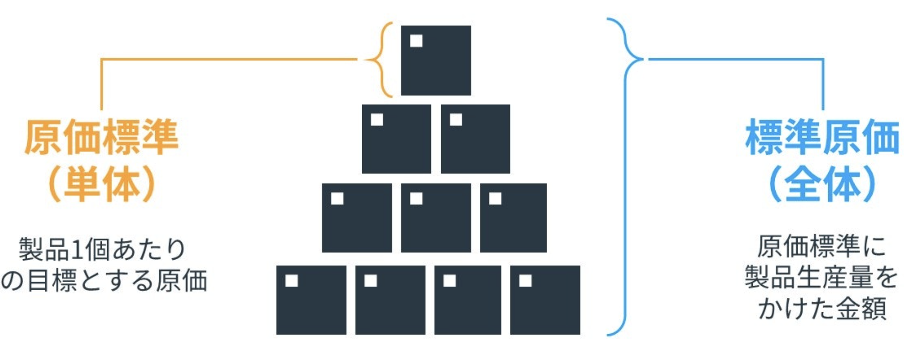

### 【製品の生産方法の違い】総合原価計算と個別原価計算


```plantuml
left to right direction

rectangle 生産形態で区別 {
  rectangle "**個別原価計算**\n(個別受注生産)" as individual
  rectangle "**総合原価計算**\n(連続大量生産)" as comprehensive
}
rectangle 生産内容で区別 {
  rectangle "**単純総合原価計算**\n1種類の製品を連続的に量産" as simple
  rectangle "**等級別総合原価計算**\n大きさ、品質、形状などで等級に\n分ける必要がある場合に適用される。\n等級をつけられない場合、**連産品**と言う" as group
  rectangle "**組別総合原価計算**\n規格や型が異なるものを並行して\n連続生産する場合" as grade
  note right of simple 
  総合原価計算の基本
  end note
  note right of group 
  【**等級有りの例**】
  ▪ポロシャツのS・M・Lサイズ
  ▪飲み物のS・M・Lサイズ

  【**等級無し(連産物)の例**】
  ▪ガソリン、灯油、軽油などの
  　原油の精製
  ▪肉、骨、皮、脂肪などの
  　肉の加工
  ▪米、糠などの米の加工
  end note
  note right of grade 
  【**例**】
  ▪自動車のセダンとワゴン
  ▪食べ物のプレーンと抹茶
  ▪机の木製とスチール製
  end note
}

individual -[hidden] comprehensive
comprehensive -- simple
comprehensive -- group
comprehensive -- grade
```

- 【**総合原価計算**】規格品を**連続的に量産**する工場で使われる原価計算。石油、化学、自動車、精密機器、電機、薬品など多くの業界に適用されている。総合原価計算は生産内容で3つ、工程で2つ(単一工程と工程別)に分けられ、計6種類の総合原価計算が存在する。
  - 【**メリット**】大量生産により<u>コスト(製造単価や人件費)と計算の手間を減らす(まとめて計算する)ことができる</u>。
  - 【**デメリット**】一定期間の製造原価をまとめて計算するためリアルタイムでの原価把握が困難。製品全体の平均を計算するため特定の製品や部品単位での正確な原価は分からない。
- 【**個別原価計算**】顧客の注文に応じて製品を**個別で受注生産**する企業が採用する原価計算。総合建設業、ハウスメーカー、造船業、プラント業、<font color=red><b>ソフトウェア業</b></font>などで使われている。<font color=red>上記業種に限らず、営業や<b>プロジェクト管理でも使用可能</b></font>。
  - 【**メリット**】<font color=red>受注案件や製品ごとに実際の販売価格や原価を<b>正確に把握・管理できる</b></font>。
  - 【**デメリット**】受注単位で個別に製造するため<u>集計に時間がかかる</u>。手間と人件費がかかる。

<div style="page-break-before:always"></div>

## 実際に原価計算してみる(総合原価計算と個別原価計算の違い)

- 【**ポイント**】①総合原価計算は企画品の原価を原価計算期間で集計する、②個別原価計算は注文品ごとに原価を集計する、の2つのポイントがある。

### 総合原価計算の事例

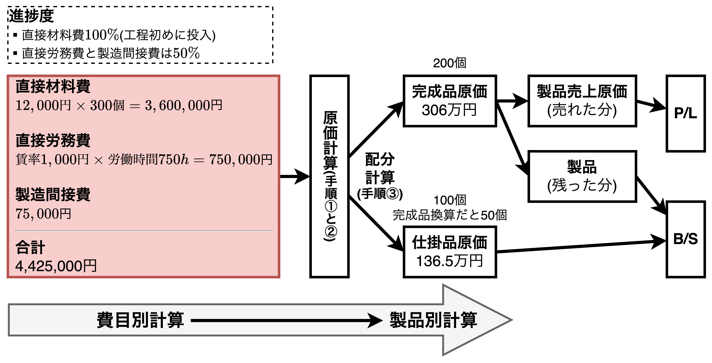

```
【総合原価計算の例】
◼︎当月製造費用
直接材料費　単価12,000円×　　数量300個　 ＝ 3,600,000[円]
直接材料費　賃率 1,000円×労働時間750時間 ＝   750,000[円]
直接材料費　　　　　　　　　　　　　　　　 ＝    75,000[円]

◼︎生産情報
完成品　200個（材料は工程の初めに全て投入。そのあとは加工していくだけ。）
仕掛品　100個（進捗度は直接労務費、製造間接費ともに50%）
```

- 総合原価計算では<u>原価計算期間で発生した製造費用(**総製造費用**)を集計し、完成品原価(**製造原価**)と未完成品原価(**仕掛品原価**)に配分計算することの理解が重要</u>である。具体的には以下の通り。
  1. 完成品換算数量を計算する
  2. 1個当たりの完成品原価(**製造原価**)を計算する
  3. 完成品と仕掛品の原価を求める(配分計算)

#### ①完成品換算数量を計算する

$$
\begin{align*}
完成品換算数量&=完成品数量+仕掛品の数量\times 進捗度\\
&=200+100\times 50\%=\bold{\underline{250個}}
\end{align*}
$$

- 個数で見ると完成品200個と仕掛品100個の合計300個であるが、仕掛品は完成品とは同等ではない。そこで、仕掛品の個数を「**進捗度を用いて完成品に換算した値**」に変換する。
- 【**補足**】仕掛品は直接材料費は完成品と同等の負担であるが、加工費(直接労務費と製造間接費)は完成品とは同等ではないため、進捗度を用いて完成品換算している。

#### ②1個当たりの完成品原価(製造原価)を計算する

$$
\begin{align*}
1個当たりの直接材料費&=3,600,000[円]\div 300[個]=12,000[円/個]\\
1個当たりの直接労務費&=750,000[円]\div 250[個]=3,000[円/個]\\
1個当たりの製造間接費&=75,000[円]\div 250[個]=300[円/個]\\[3mm]
\bold{1個当たりの完成品原価}&=12,000+3,000+300=\bold{\underline{15,300[円/個]}}
\end{align*}
$$

- 1個当たりの直接材料費、直接労務費、製造間接費を求める。直接材料費は$300個$で割るが、加工費(直接労務費と製造間接費)は完成品換算数量$250個$を用いて計算する。ここで、<u>直接労務費と製造間接費は仕掛品と完成品の負担割合が対等ではない</u>の進捗率を考慮した完成品換算数量250個を用いている。

#### ③完成品と仕掛品の原価を求める(配分計算)

##### 完成品原価

$$
\begin{align*}
\bold{\underline{完成品原価}}&=1個当たりの完成品原価\times 完成品数量\\
&=15,300[円/個]\times 200個=\bold{\underline{3,060,000円}}
\end{align*}
$$

##### 仕掛品原価

$$
\begin{align*}
直接材料費&=1個当たりの直接材料費\times 仕掛品数量\\
&12,000[円/個]\times 100個=1,200,000[円]\\
直接労務費&=1個当たりの直接労務費\times 完成品換算数量\\
&3,000[円/個]\times 50(=100\times 50\%)個=150,000[円]\\
製造間接費&=1個当たりの間接製造費\times 完成品換算数量\\
&300[円/個]\times 50(=100\times 50\%)個=15,000[円]\\[3mm]
\bold{\underline{仕掛品原価}}&=直接材料費+直接労務費+間接製造費\\
&=1,200,000+150,000+15,000=\bold{\underline{1,365,000円}}
\end{align*}
$$

<div style="page-break-before:always"></div>

### 個別原価計算の事例

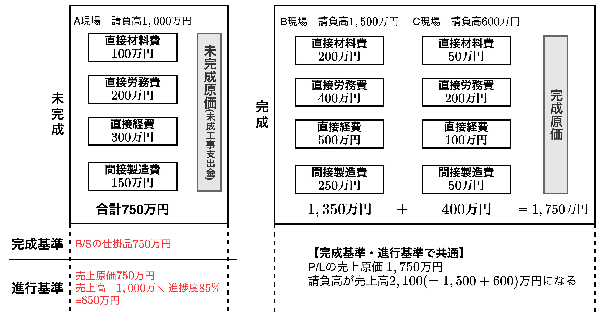

<table>
  <caption>単位：万円</caption>
	<tbody>
		<tr>
			<th rowspan="2"></th>
			<th>未完成</th>
			<th colspan="2">完成</th>
		</tr>
		<tr>
			<th>A現場</th>
			<th>B現場</th>
			<th>C現場</th>
		</tr>
		<tr>
			<td>直接材料費</td>
			<td>100</td>
			<td>200</td>
			<td>50</td>
		</tr>
		<tr>
			<td>直接労務費</td>
			<td>200</td>
			<td>400</td>
			<td>200</td>
		</tr>
		<tr>
			<td>直接経費</td>
			<td>300</td>
			<td>500</td>
			<td>100</td>
		</tr>
		<tr>
			<td>製造間接費</td>
			<td>150</td>
			<td>250</td>
			<td>50</td>
		</tr>
		<tr>
			<th>合計</th>
			<th>750</th>
			<th>1,350</th>
			<th>400</th>
		</tr>
		<tr>
			<th>請負高</th>
			<th>1,000</th>
			<th>1,500</th>
			<th>600</th>
		</tr>
	</tbody>
</table>

- 個別原価計算では、<u>注文ごと(顧客ごと)に原価を計算し、納品が完了すれば「**売上原価**」、未完成ならば「**仕掛品(未成工事支出金)**」として認識することが重要</u>である。
- 個別原価計算において、建設業のように長期間で期末を跨ぐような場合、「**完成基準での個別原価計算**」と「**進行基準での個別原価計算**」の2つの考え方がある。

#### 完成基準と進行基準の違い

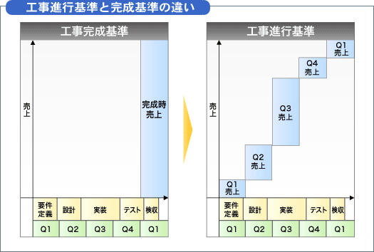

##### 完成基準

$$
\begin{align*}
未完成品&\rightarrow B/Sの\color{green}仕掛品(未成工事支出金)\color{black}に計上\\
完成品&\rightarrow P/Lの\color{blue}売上高\color{black}と\color{red}売上原価\color{black}に計上
\end{align*}
$$

##### 進行基準

$$
\begin{align*}
未完成品&\rightarrow P/Lの\color{blue}売上高\color{black}と\color{red}売上原価\color{black}に計上\\
未完成品の\color{blue}売上高\color{black}&=請負高\times 進捗度[\%]\\
未完成品の\color{red}売上原価\color{black}&=進捗度時点で把握されている費用\\
完成品&\rightarrow P/Lの\color{blue}売上高\color{black}と\color{red}売上原価\color{black}に計上
\end{align*}
$$

- 完成基準と進行基準の違いは「売上高の認識タイミング」である。
  - 【**完成基準**】完成・引き渡しによって実現し、売上高を認識する(<font color=red><b>実現主義</b></font>)
  - 【**進行基準**】工事の進行(進捗度)によって売上高を認識する(<font color=red><b>発生主義</b></font>)
- 完成基準では<u>未完成の仕掛品(**建設業では未成工事支出金と呼ばれる**)はB/Sの棚卸資産に計上</u>し、完成品はP/Lに売上高と売上原価を計上する。
- 進行基準では<font color=red>B/Sの仕掛品には計上されず</font>、売上高と売上原価はP/Lに計上される。<u>売上高は進捗度を用いて計上し、売上原価は現時点で把握されている費用を計上する</u>。

<div style="page-break-before:always"></div>

## 直接原価計算の考え方

- 【**ポイント**】直接原価計算による$P/L$は$変動P/L$と同じ考え方がである。
- 全原価計算では、製造間接費は機械運転時間や直接作業時間などを基準にして配賦計算して製造直接費に加算することで、全部原価を計算する。しかし、配賦計算そのものが便宜的なものであり、正確ではないことから**全部原価は個別の製品に関わらせて把握できず、利益計算に影響を与える**。
- 全部原価計算の問題を解決するために、<font color=red>直接原価計算は「配賦計算を行わず製造直接費だけで把握する」</font>。直接原価計算では、<u>製造間接費は販管費と同じように「期間原価」として計上し、営業利益に反映させる</u>。

### 直接原価計算の事例

```
【A社のある期間の製造・販売データ】
⚫︎材料費100、労務費200、経費100　　　合計400(製造原価)
⚫︎当期の製造数量　10個
　⚫︎販売個数6個(販売価格50/個)
　⚫︎在庫4個
⚫︎販売管理費　40
```

```plantuml
title 全部原価計算と個別原価計算
left to right direction

rectangle 全部原価計算 as all
rectangle 直接原価計算 as individual
rectangle "生産数＞販売数\n→ **全部原価計算の利益が大きくなる**" as pattern1 #faa
rectangle "生産数＝販売数\n→ **利益が一致する**" as pattern2 #afa
rectangle "生産数＜販売数\n→ **直接原価計算の利益が大きくなる**" as pattern3 #aaf

note top of all
在庫は貸借対照表に計上される。
end note
note bottom of individual
労務費と経費は固定費に計上される。
→ <color red>営業利益が全部原価計算と異なる。
end note
note right of pattern3
前期分の在庫が
売れたケース
end note

all -[hidden] individual
all =[#red]= pattern1
all =[#green]= pattern2
all =[#blue]= pattern3
individual =[#red]= pattern1
individual =[#green]= pattern2
individual =[#blue]= pattern3
```

- 全部在庫計算では、在庫を資産として計上し、「費用を次期に繰り越す」が、直接原価計算では、材料費のみを資産として計上し、固定費(労務費と経費)を「費用として当期に計上する」。
- 直接原価計算では固定費を期間原価にするため、<font color=red>在庫に含まれる固定費(労務費と経費)はその費用が発生した期に売上高から差し引かれる。そのため、<u>黒字であれば在庫費用を回収できており、赤字であれば回収できていないことを示す</u></font>。B/Sに資産計上されるのは「材料費のみ」である。そのため、**直接原価計算は「経営者感覚に近い原価計算」とも言える**。

<div style="page-break-before:always"></div>

#### 【財務会計の考え方】全部原価計算の計算例

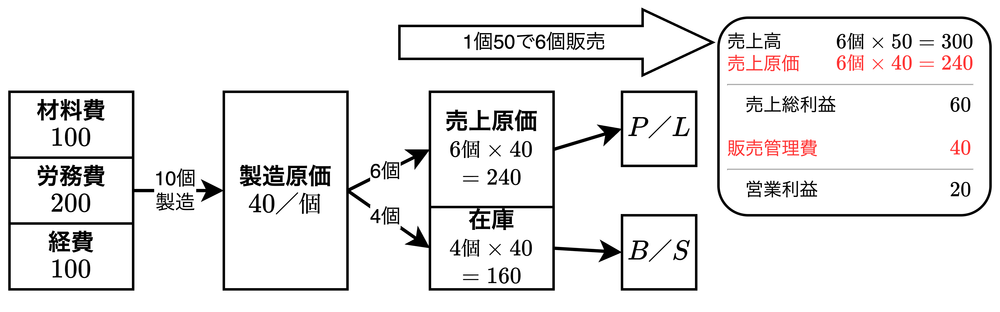

#### 【管理会計の考え方】直接原価計算の計算例

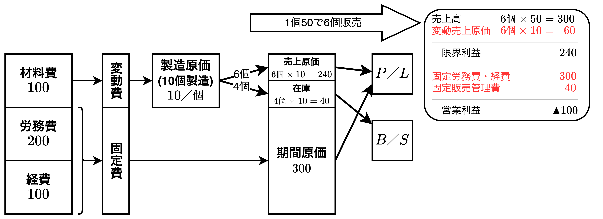

- P/Lに向かう矢印を見ると<u>全部原価計算では売上原価のみ</u>であるが、<u>直接原価計算では変動費と固定費の2本</u>がある。
- 全部原価計算と個別原価計算の営業利益はそれぞれ$20$、$▲100$であり、$|-100-20|=120$の差がある。この差は固定費にある。具体的には、固定費$300$(労務費と経費の合計)を製造数量$10$で割った<font color=red>1個当たりの固定費$30$から在庫数量4をかけた値$120(=30\times 4)$が費用に含まれるか否かの違いがある</font>。
- 上記までの例は$生産数>販売数$のケースであり、全3パターンが考えられる。特にパターン3については前期分の在庫を販売したケースであり、当期に費用計上する個別原価計算の方が全部原価計算より利益が大きくなる。
  - 【**パターン1**】$生産数>販売数→全部原価計算の利益が大きくなる$
  - 【**パターン2**】$生産数=販売数→利益が一致する$
  - 【**パターン3**】$生産数<販売数→個別原価計算の利益が大きくなる$

<div style="page-break-before:always"></div>

## 活動基準原価計算(ABC: Activity-Based Costing)の考え方

- 【**ポイント**】以下の2つのポイントがある。
  - ①**活動基準原価計算(ABC)** は製造間接費の発生の実態を把握し、正しい製品原価を捉え、製品ごとの収益性向上のための戦略的意思決定を実現するための手法である。
  - ②経営プロセスを見直し、付加価値を生み出すにはどうしたらいいかを追求するのが**活動基準管理(ABM: Activity Based Management)** である。

### マーケティングが重視される時代の原価計算

```plantuml
title 【マーケティング重視の時代】製造間接費増加の背景
left to right direction

rectangle "顧客ニーズの\n多様化・複雑化" as factor
rectangle "製造間接費の増加" as result
rectangle 具体例 {
  rectangle "【**問題1**】\nマーケティングの変化による間接費の増加" as elem1
  rectangle "【**問題2**】\n少品種大量生産→多品種少量生産へのシフト\nによる間接費の増加" as elem2
  rectangle "【**問題3**】\n販売活動の複雑化\nによる総原価(製造原価+販管費)の増加" as elem3
  elem3 -[hidden] elem2
  elem2 -[hidden] elem1
}

factor --> result
result --> elem1
result --> elem2
result --> elem3
```

- <font color=red><b>ABCは</b>製造原価だけでなく販売活動まで考慮した総原価の把握に有用な手法であり、製品別だけでなく営業所別、サービス別、業務別、顧客別など<b>応用範囲が広い</b></font>。ABCは<u>以下のようなコストの問題を解決するために登場した</u>。
  - 【**問題1: マーケティングの変化**】「他の人と同じものではなく、独自性・新規制・唯一性のある製品を作りたい」というニーズから、<u>マーケティングにおいて、$調査、発注、検査、配送、教育$などの間接費を増加させた</u>。
  - 【**問題2: 少品種大量生産→多品種少量生産へのシフト**】工場では材料の種類や発注回数、金型や色の種類の増加や、機械の段取りや検査なども必要になっており、さらに、経理や人事の仕事も複雑化していることから<u>製造支援活動の間接費を増加させた</u>。
  - 【**問題3: 販売活動の複雑化**】カタログの作成や営業担当者の教育費の増加、各種説明会の増加により販売活動が複雑化しており、<u>総原価(製造原価+販管費)を増加させた</u>。

### ABCの計算例(伝統的な原価計算と比較して学ぶ)

<table>
  <caption>予定原価の情報（単位：円）</caption>
	<tbody>
		<tr>
			<td rowspan="2"></td>
			<th>定番品</th>
			<th>定番品</th>
			<th>特注品</th>
			<th rowspan="2">合計</th>
		</tr>
		<tr>
			<th>A製品</th>
			<th>B製品</th>
			<th>C製品</th>
		</tr>
		<tr>
			<td>①生産量[個]</td>
			<td>10,000</td>
			<td>5,000</td>
			<td>500</td>
			<td>15,500</td>
		</tr>
		<tr>
			<td>②材料単価[円/個]</td>
			<td>300</td>
			<td>100</td>
			<td>900</td>
			<td>ー</td>
		</tr>
		<tr>
			<td><b>A.直接材料費[円] (①×②)</td>
			<td>3,000,000</td>
			<td>500,000</td>
			<td>450,000</td>
			<td>3,950,000</td>
		</tr>
		<tr>
			<td><b>B.直接労務費[円] (③×④)</td>
			<td>1,200,000</td>
			<td>840,000</td>
			<td>360,000</td>
			<td>2,400,000</td>
		</tr>
		<tr>
			<td>　③直接作業時間</td>
			<td>1,000</td>
			<td>700</td>
			<td>300</td>
			<td>2,000</td>
		</tr>
		<tr>
			<td>　④賃率／時</td>
			<td>1,200</td>
			<td>1,200</td>
			<td>1,200</td>
			<td>ー</td>
		</tr>
		<tr>
			<td><b>C.製造直接費[円] (A+B)</td>
			<td>4,200,000</td>
			<td>1,340,000</td>
			<td>810,000</td>
			<td>6,350,000</td>
		</tr>
		<tr>
			<td><b>D.製造間接費[円]</td>
			<td></td>
			<td></td>
			<td></td>
			<td>2,000,000</td>
		</tr>
		<tr>
			<td><b>製造原価合計[円] (C+D)</td>
			<td></td>
			<td></td>
			<td></td>
			<td>8,350,000</td>
		</tr>
	</tbody>
</table>

- 【**伝統的な原価計算のまとめ**】
  - 実際額だと集計が遅れるため、見積額での製造間接費を直接作業時間や機械運転時間などの単一的な値で割った<u>「予定配賦率」を使って製造間接費を個々の製品に配賦する</u>。
- 【**ABCのまとめ**】
  - ABCは製造間接費を「活動」に分けて配賦計算する。
  - ABCは「活動が資源を消費」し、「製品が活動を消費する」という理念で構築された原価計算ほうである。

<div style="page-break-before:always"></div>

#### 伝統的な原価計算による製造原価の算出

<table>
  <caption>伝統的な原価計算（単位：円）</caption>
	<tbody>
		<tr>
			<td rowspan="2"></td>
			<th>定番品</th>
			<th>定番品</th>
			<th>特注品</th>
			<th rowspan="2">合計</th>
		</tr>
		<tr>
			<th>A製品</th>
			<th>B製品</th>
			<th>C製品</th>
		</tr>
		<tr>
			<td>①生産量[個]/td>
			<td>10,000</td>
			<td>5,000</td>
			<td>500</td>
			<td>15,500</td>
		</tr>
		<tr>
			<td>③直接作業時間[時間]</td>
			<td>1,000</td>
			<td>700</td>
			<td>300</td>
			<td>2,000</td>
		</tr>
		<tr>
			<td><b>C.製造直接費[円] (A+B)</td>
			<td>4,200,000</td>
			<td>1,340,000</td>
			<td>810,000</td>
			<td>6,350,000</td>
		</tr>
		<tr style="border-bottom: 11px double black;">
			<td><b>D.製造間接費</td>
			<td></td>
			<td></td>
			<td></td>
			<td>2,000,000</td>
		</tr>
		<tr>
			<td><b>E.直接作業時間による予定配賦率[円/時]</td>
			<td colspan=4><font color=red><b>1,000 (=D÷③の合計)</td>
		</tr>
		<tr>
			<td><b>F.<font color=blue>製造間接費配賦額</font>[円] (③×E)</td>
			<td><font color=red><b>1,000,000</td>
			<td><font color=red><b>700,000</td>
			<td><font color=red><b>300,000</td>
			<td><b>2,000,000</td>
		</tr>
		<tr>
			<td><b>G.製造原価合計[円] (C+F)</td>
			<td><font color=red><b>5,200,000</td>
			<td><font color=red><b>2,040,000</td>
			<td><font color=red><b>1,110,000</td>
			<td>8,350,000</td>
		</tr>
		<tr>
			<td><b>H.製品1個当たりの製造原価[円/個] (G÷①)</td>
			<td><font color=red><b>520</td>
			<td><font color=red><b>408</td>
			<td><font color=red><b>2,200</td>
			<td>ー</td>
		</tr>
		<tr>
			<td><b>販売価格[円/個] ( H÷(1-粗利率) )<br>※粗利率20%</td>
			<td><font color=red><b>650</td>
			<td><font color=red><b>510</td>
			<td><font color=red><b>2,775</td>
			<td>ー</td>
		</tr>
	</tbody>
</table>

$$
\begin{align*}
個々の製品の製造原価&=各製品の製造直接費+各製品の\color{blue}製造間接費配賦額\\[2mm]
\color{blue}製造間接費配賦額&=直接作業時間\times \color{green}予定配賦率\\
&=直接作業時間\times \color{green}\frac{製造間接費合計(見積額)}{配賦基準(ここでは直接作業時間)}\\[4mm]
販売価格[円/個]&=\frac{製品1個当たりの製造原価}{1-粗利率(20\%)}=\frac{製品1個当たりの製造原価}{売上原価率(80\%)}
\end{align*}
$$

- **以下の手順**で製造原価とその販売価格を決定する。
  1. <font color=green>予定配賦率</font>を求め、**各製品の製造間接費の配賦額(F)** を決定する
  2. **各製品の製造原価合計(G)** を求める
  3. 各製品の製品1個当たりの製造原価を計算し、粗利率を用いて販売価格を決定する
- 上記の計算のように、伝統的な原価計算では製造間接費を「直接作業時間」や「機械運転時間」などで割った<b>「予定配賦率」を使って製造間接費を個々の製品に配賦する</b>。<u>実際のところ、製造間接費は実際額だと集計が遅れるため、見積額での製造間接費で計算した予定配賦率を使う</u>。

<div style="page-break-before:always"></div>

#### ABCによる製造原価の算出

```
【製造間接費内訳】
⚫︎製造間接費　　200万円
　⚫︎材料の発注
　　⚫︎発注費　　40万円
　　⚫︎発注回数　製品A、B、Cそれぞれに50回、30回、10回
　⚫︎製品の検査
　　⚫︎検査費　　160万円
　　⚫︎検査回数　製品A、B、Cそれぞれに500時間、800時間、1,000時間
```

<table>
  <caption>活動基準原価計算(ABC) （単位：円）</caption>
	<tbody>
		<tr>
			<td rowspan="2"></td>
			<th>定番品</th>
			<th>定番品</th>
			<th>特注品</th>
			<th rowspan="2">合計</th>
		</tr>
		<tr>
			<th>A製品</th>
			<th>B製品</th>
			<th>C製品</th>
		</tr>
		<tr>
			<td>①生産量[個]</td>
			<td>10,000</td>
			<td>5,000</td>
			<td>500</td>
			<td>15,500</td>
		</tr>
		<tr>
			<td>③直接作業時間[時間]</td>
			<td>1,000</td>
			<td>700</td>
			<td>300</td>
			<td>2,000</td>
		</tr>
		<tr>
			<td><b>C.製造直接費[円] (A+B)</td>
			<td>4,200,000</td>
			<td>1,340,000</td>
			<td>810,000</td>
			<td>6,350,000</td>
		</tr>
		<tr style="border-bottom: 11px double black;">
			<td><b>D.製造間接費</td>
			<td></td>
			<td></td>
			<td></td>
			<td>2,000,000</td>
		</tr>
		<tr>
			<td><b>発注費[円]</td>
			<td>400,000</td>
			<td></td>
			<td></td>
			<td></td>
		</tr>
		<tr>
			<td>　⑤単価(発注費÷全体の発注回数)</td>
			<td colspan=4>4,444[円/回] (400,000÷90)</td>
		</tr>
		<tr>
			<td>　⑥発注回数</td>
			<td>50</td>
			<td>30</td>
			<td>10</td>
			<td>90</td>
		</tr>
		<tr>
			<td><b>H.各製品への賦課金額[円] (⑤×⑥)</td>
			<td><font color=red><b>222,200</td>
			<td><font color=red><b>133,320</td>
			<td><font color=red><b>44,440</td>
			<td>399,960</td>
		</tr>
		<tr>
			<td></td>
			<td></td>
			<td></td>
			<td></td>
			<td></td>
		</tr>
		<tr>
			<td><b>検査費[円]</td>
			<td>1,600,000</td>
			<td></td>
			<td></td>
			<td></td>
		</tr>
		<tr>
			<td>　⑦単価(検査費÷全体の検査時間)</td>
			<td colspan=4>696[円/時] (1,600,000÷2,300)</td>
		</tr>
		<tr>
			<td>　⑧検査時間</td>
			<td>500</td>
			<td>800</td>
			<td>1,000</td>
			<td>2,300</td>
		</tr>
		<tr>
			<td><b>J.各製品への賦課金額[円] (⑦×⑧)</td>
			<td><font color=red><b>348,000</td>
			<td><font color=red><b>556,800</td>
			<td><font color=red><b>696,000</td>
			<td>1,600,800</td>
		</tr>
		<tr>
			<td><b>K.製造原価の合計(C+H+J)</td>
			<td><font color=red><b>4,770,200</td>
			<td><font color=red><b>2,030,120</td>
			<td><font color=red><b>1,550,440</td>
			<td>8,350,760</td>
		</tr>
		<tr>
			<td><b>L.製品1個当たりの製造原価(K÷①)</td>
			<td><font color=red><b>477</td>
			<td><font color=red><b>406</td>
			<td><font color=red><b>3,101</td>
			<td>ー</td>
		</tr>
	</tbody>
</table>

- 【**注意事項**】$H+J\neq 200万円$なのは計算誤差

<div style="page-break-before:always"></div>

- 上記内訳より<u>製造間接費は発注費と検査費の2つから構成</u>され、配賦額から以下のことがわかる。
  - 【**発注費からわかること**】<u>発注費は発注回数に比例して発生するため、直接作業時間による**従来の配賦計算では正しく計算できない**</u>。定番品のA・B製品は1回の発注で多くの数量を発注することが多く、発注回数は生産量の割には多くない。特注品のC製品は注文の都度発注することが多いため、生産量の割に発注回数が多い。
  - 【**検査費からわかること**】<u>検査費は検査時間に比例して発生するため、直接作業時間による**従来の配賦計算では正しく計算できない**</u>。B製品はA製品より複雑な構造であるため、検査時間が比較的長い。C製品は特注品であり、検査内容が製品ごとに異なるため検査時間が非常に長い。

#### 伝統的な原価計算とABCの比較

<table>
	<tbody>
		<tr>
			<td rowspan="2"></td>
			<th>定番品</th>
			<th>定番品</th>
			<th>特注品</th>
		</tr>
		<tr>
			<th>A製品</th>
			<th>B製品</th>
			<th>C製品</th>
		</tr>
		<tr>
			<td><b>L.伝統的な原価計算による1個当たり製造原価</td>
			<td>520</td>
			<td>408</td>
			<td>2,220</td>
		</tr>
		<tr>
			<td><b>M.ABCによる1個当たり製造原価</td>
			<td>477</td>
			<td>406</td>
			<td>3,101</td>
		</tr>
		<tr>
			<td><b>N.1個当たりの製造原価の差額 (L-M)</td>
			<td>43</td>
			<td>2</td>
			<td>▲881</td>
		</tr>
		<tr>
			<td>1個当たりの販売価格の差額( N÷(1-粗利率)、 粗利率20%)</td>
			<td>53.75</td>
			<td>2.5</td>
			<td>▲1101.25</td>
		</tr>
		<tr>
			<td>生産量[個]</td>
			<td>10,000</td>
			<td>5,000</td>
			<td>500</td>
		</tr>
		<tr>
			<td><b>製造原価総額の差額 (N×生産量)</td>
			<td><font color=red><b>430,000</td>
			<td><font color=red><b>10,000</td>
			<td><font color=red><b>▲440,500</td>
		</tr>
	</tbody>
</table>

- 【**伝統的な原価計算とABCの比較結果**】
  - A製品は価格を低くすべき
  → 伝統的原価計算と比較して、割高な価格設定であるため、顧客から値下げ要求をされる可能性があり、**予定価格を下げることを検討**すべき。
  - B製品は特に現在価格が妥当である。
  → 伝統的原価計算と比較して、価格設定がほぼ同じであるため、**予定価格でも販売可能**であることが示唆される。
  - C製品は価格を高くすべき。
  → 伝統的原価計算と比較して、C製品は安価であるために受注が伸びることが予想される。今後、**利益増加のために値上げを検討**すべき。
- ABCは「**活動が資源(リソース)を消費**」し、「**製品が活動を消費**」する。
  - 【**資源**】人件費、減価償却費、通信費
  - 【**活動**】発注活動、検査活動
  - 【**製品**】A製品、B製品、C製品

#### 【まとめ】ABCの流れ

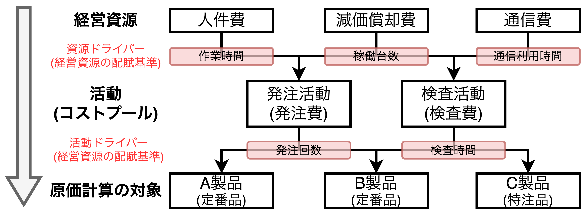

- ABCでは $経営資源→活動→原価計算の対象$ の流れで配賦計算を行う。
- 経営資源から活動への配賦基準を「**資源ドライバー**」と言い、活動から原価計算の対象への配賦基準を「**活動ドライバー**」と言う。
- 活動によって発生する費用(複合費)を**コストプール**と呼ぶ。

### ABCの原価計算対象を「総原価」に広げる〜販売活動への拡大〜


- これまでは「製造原価」を対象にしていたが販管費を含む<font color=red>「総原価」まで原価計算の対象範囲を広げると、<b>営業利益までのコスト管理が可能</b>になる</font>。

#### ①各製品の総原価を計算する

```
【販管費データ】
⚫︎物流費　　　　  520,000円
⚫︎売上獲得費　　  700,000円
⚫︎その他販管費　  300,000円
----------------------
販管費合計　　　1,520,000円

⚫︎発送回数　製品A、B、Cそれぞれに150回、50回、 20回
⚫︎訪問件数　製品A、B、Cそれぞれに100件、50件、200件
⚫︎その他販管費は直接作業時間で配賦

【注意1】単純化のために販管費の内容は簡素化している。
【注意2】物流費は「製造原価に属するもの」と「販売費に属するもの」に分けられるが、
　　　　 この例では、簡素化のために「販管費に関わるもの」として扱う。
```

- **物流費**は人件費、燃料費、減価償却費を含む複合費であり、<u>発送回数を活動ドライバーとする</u>。
- **売上獲得費**は販売促進日のように売り上げを上げるための必要経費であり、交通費、人件費、営業車両のリース料などの販売日が主要部分を占めている。<u>訪問件数を活動ドライバーとする</u>。
- **その他販管費**は適当な活動ドライバーがなかったため、<u>直接作業時間を活動ドライバーとする</u>。

<div style="page-break-before:always"></div>

<table>
  <caption>ABCによる間接費の配賦計算 （単位：円）</caption>
	<tbody>
		<tr>
			<th></th>
			<th>A製品</th>
			<th>B製品</th>
			<th>C製品</th>
      <th>合計</th>
		</tr>
		<tr>
			<td>①生産量[個]</td>
			<td>10,000</td>
			<td>5,000</td>
			<td>500</td>
			<td>15,500</td>
		</tr>
		<tr>
			<td>③直接作業時間[時間]</td>
			<td>1,000</td>
			<td>700</td>
			<td>300</td>
			<td>2,000</td>
		</tr>
		<tr style="border-bottom: 6px double black;">
			<td><b>C.製造直接費[円] (A+B)</td>
			<td>4,200,000</td>
			<td>1,340,000</td>
			<td>810,000</td>
			<td>6,350,000</td>
		</tr>
		<tr>
			<td><b>発注費[円]</td>
			<td colspan=4>400,000</td>
		</tr>
		<tr>
			<td>　⑤単価(発注費÷全体の発注回数)</td>
			<td colspan=4>4,444[円/回] (400,000÷90)</td>
		</tr>
		<tr>
			<td>　⑥発注回数</td>
			<td>50</td>
			<td>30</td>
			<td>10</td>
			<td>90</td>
		</tr>
		<tr>
			<td><b>H.各製品への賦課金額[円] (⑤×⑥)</td>
			<td><font color=red><b>222,200</td>
			<td><font color=red><b>133,320</td>
			<td><font color=red><b>44,440</td>
			<td>399,960</td>
		</tr>
		<tr>
			<td><b>検査費[円]</td>
			<td colspan=4>1,600,000</td>
		</tr>
		<tr>
			<td>　⑦単価(検査費÷全体の検査時間)</td>
			<td colspan=4>696[円/時] (1,600,000÷2,300)</td>
		</tr>
		<tr>
			<td>　⑧検査時間</td>
			<td>500</td>
			<td>800</td>
			<td>1,000</td>
			<td>2,300</td>
		</tr>
		<tr style="border-bottom: 6px double black;">
			<td><b>J.各製品への賦課金額[円] (⑦×⑧)</td>
			<td><font color=red><b>348,000</td>
			<td><font color=red><b>556,800</td>
			<td><font color=red><b>696,000</td>
			<td>1,600,800</td>
		</tr>
		<tr>
			<td><b>物流費[円]</td>
			<td colspan=4>520,000</td>
		</tr>
		<tr>
			<td>　⑨単価(物流費÷配送回数)</td>
			<td colspan=4>2,364(520,000÷220)</td>
		</tr>
		<tr>
			<td>　⑩配送回数</td>
			<td>150</td>
			<td>50</td>
			<td>20</td>
			<td>220</td>
		</tr>
		<tr>
			<td><b>O.各製品への賦課金額[円] (⑨×⑩)</td>
			<td><font color=red><b>354,600</td>
			<td><font color=red><b>118,200</td>
			<td><font color=red><b>47,280</td>
			<td>520,080</td>
		</tr>
		<tr>
			<td><b>売上獲得費[円]</td>
			<td colspan=4>700,000</td>
		</tr>
		<tr>
			<td>　⑨単価(物流費÷配送回数)</td>
			<td colspan=4>2,000(700,000÷350)</td>
		</tr>
		<tr>
			<td>　⑩配送回数</td>
			<td>100</td>
			<td>50</td>
			<td>200</td>
			<td>350</td>
		</tr>
		<tr>
			<td><b>P.各製品への賦課金額[円] (⑨×⑩)</td>
			<td><font color=red><b>200,000</td>
			<td><font color=red><b>100,000</td>
			<td><font color=red><b>400,000</td>
			<td>700,000</td>
		</tr>
		<tr>
			<td><b>その他販管費</td>
			<td colspan=4>300,000</td>
		</tr>
		<tr style="border-bottom: 6px double black;">
			<td><b>Q.③直接作業時間(計2,000時間)で配賦</td>
			<td><font color=red><b>150,000</td>
			<td><font color=red><b>105,000</td>
			<td><font color=red><b>45,000</td>
			<td>300,000</td>
		</tr>
			<td><b>R.総原価合計(C+H+J+O+P+Q)</td>
			<td><font color=red><b>5,474,800</td>
			<td><font color=red><b>2,353,320</td>
			<td><font color=red><b>2,042,720</td>
			<td>9,870,840</td>
		</tr>
		<tr>
			<td><b>製品1個当たりの製造原価(R÷①)</td>
			<td><font color=red><b>547</td>
			<td><font color=red><b>471</td>
			<td><font color=red><b>4,085</td>
			<td>ー</td>
		</tr>
	</tbody>
</table>

<div style="page-break-before:always"></div>

#### ②販売価格を設定する

<table>
  <caption><b>原価計算の違いによる販売価格の比較</caption>
	<tbody>
		<tr>
			<th></th>
			<th>A製品<br>(定番品)</th>
			<th>B製品<br>(定番品)</th>
			<th>C製品<br>(特注品)</th>
		</tr>
		<tr>
			<td><b>A.伝統的原価計算に<br>基づく販売価格<br>(<font color=red>粗利率20%</font>)</td>
			<td>650<br>(520÷0.8)</td>
			<td>510<br>(408÷0.8)</td>
			<td>2,775<br>(2,220÷0.8)</td>
		</tr>
		<tr>
			<td><b>B.ABCに基づく販売価格<br>(<font color=red>粗利率20%</font>)</td>
			<td>596<br>(477÷0.8)</td>
			<td>508<br>(406÷0.8)</td>
			<td>3,876<br>(3,101÷0.8)</td>
		</tr>
		<tr>
			<td><b>C.ABCに基づく販売価格<br>(<font color=blue>営業利益率5%</font>)</td>
			<td>576<br>(547÷0.95)</td>
			<td>496<br>(471÷0.95)</td>
			<td>4,300<br>(4,085÷0.95)</td>
		</tr>
		<tr>
			<td><b>価格の妥当性</td>
			<td>「値下げ」を検討すべき<br>(価格設定が高い)</td>
			<td>適正価格</td>
			<td>「値上げ」を検討すべき<br>(安すぎる)</td>
		</tr>
	</tbody>
</table>

```plantuml
title 伝統的原価計算とABCの販売価格

rectangle ①ABCに基づく販売価格 as price_abc
rectangle ②伝統的原価計算に基づく販売価格 as price_trad
rectangle 条件分岐 as condition
rectangle 値下げを検討 as down
rectangle 適正価格 as even
rectangle 値上げを検討 as up

condition <- price_trad
price_abc -> condition
condition =[#red]=> down: <color red>**①＜②**
condition =[#green]=> even: <color green>**①≒②**
condition =[#blue]=> up: <color blue>**①＞②**
```

$$
販売価格[円/個]=\frac{製品1個当たりの製造原価}{1-\color{red}粗利率\color{black}(=製造原価率)}=\frac{製品1個当たりの総原価}{1-\color{blue}営業利益率\color{black}(=総原価率)}
$$

- 上表より以下のことがわかる。
  - 【**A製品**】ABCに基づく販売価格(粗利率20%、営業利益率5%)が伝統的原価計算に基づく販売価格と乖離しており、かなり高く価格設定されていることがわかる。<u>値下げ競争が激しい環境では値下げを考えるべき</u>。
  - 【**B製品**】いずれの販売価格においても大きな乖離がないことから**妥当な価格設定である**。
  - 【**C製品**】ABCに基づく販売価格を見ると、伝統的原価計算の販売価格よりかなり高いことから<u><font color=red>現在の予定価格が全体の収益性に悪影響を与えている可能性がある</font>。**コスト面からは販売価格の見直し(値上げ)が必要である**</u>。

<div style="page-break-before:always"></div>

### ABCを経営改革に発展させる活動基準管理(ABM: Activity Based Management)

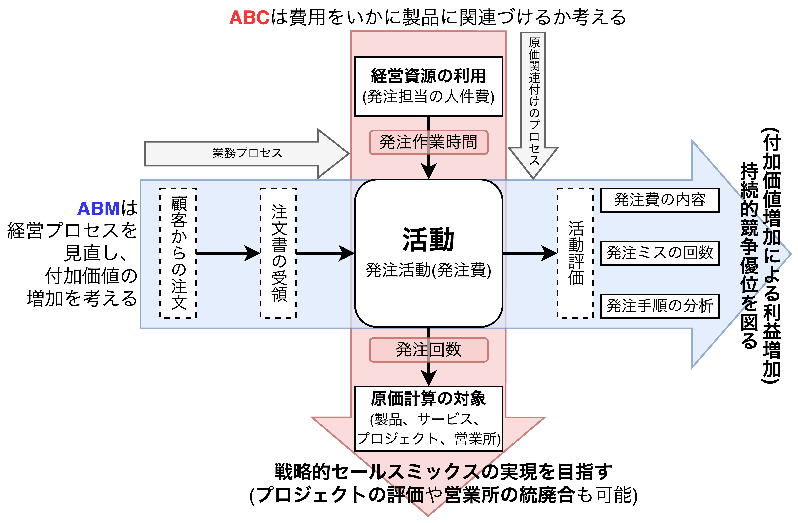

- <font color=red><b>ABC</b></font>では「活動」に注目することで「**業務に基づいた間接費の配賦**」ができる。
  - 【**例**】発注活動においては①注文書の受領、②発注書作成、③発注作業(端末操作)、④納品確認、⑤発注ミスチェックなどの一連の活動に潜む非効率な部分を見つけ出し、改善と再構築を行うことで発注費の削減を可能にする。
- 上記例の発注といった個々の活動だけでなく、在庫管理、製造、物流、販売へ至る業務プロセスまで見直して、顧客へのサービスを強化する経営改革に発展させる考え方が<font color=blue><b>ABM</b></font>であり、顧客に製品やサービスを提供する**業務プロセス分析**を行い、以下の2つを実現する。
  - ABCを利用した付加価値を生み出す活動(**付加価値活動**)を促進する**継続的な改善の取り組み**
  - 付加価値を生まない活動(**非付加価値活動**)の削減・縮小による**継続的な費用低減**
- プロセスとは製品・システムの開発、購買、製造、販売、物流、顧客サービスという一連の流れのことを指し、このプロセスの中で付加価値活動と非付加価値活動を分析して業務プロセスの改善や再構築(**リエンジニアリング**)を行うのが<font color=blue><b>ABM</b></font>である。<u><font color=blue><b>ABM</b></font>を推進するには「顧客にとって必要な活動」を重視する必要がある</u>。

<div style="page-break-before:always"></div>

## 【実践コラム】価格設定の手法あれこれ

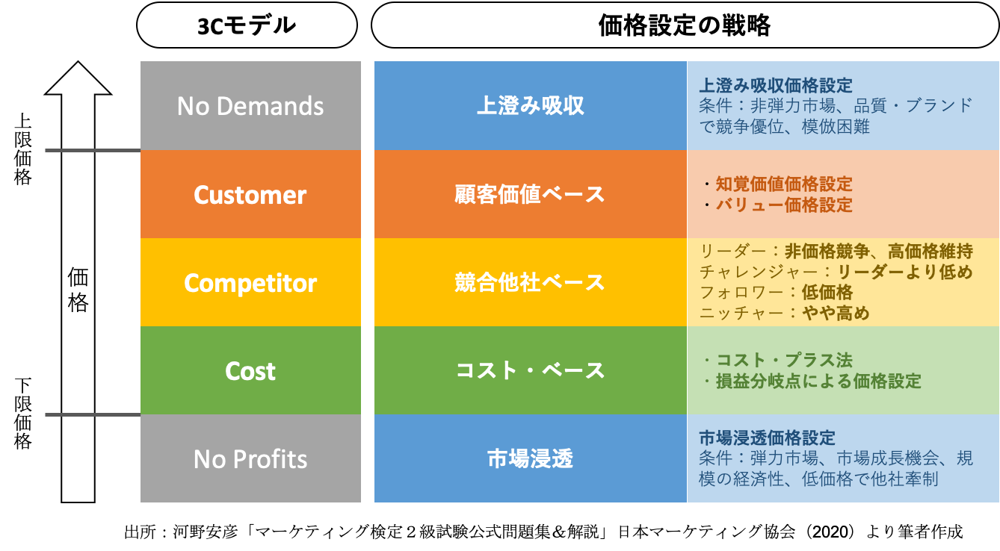

- 価格設定は「<font color=red><b>需要(Customer)・競争(Competitor)・コスト(Cost)</b></font>」の3つの切り口を考慮する。

#### 顧客価値ベース(需要志向)の価格設定

- 消費者の価格イメージや需要の強さを基準に価格を決める価格設定法であり、現実的な方法。<font color=red>低価格戦略を推進する大手の量販店などが利用する手法</font>。顧客が商品価値を高く評価すれば高価格でも受け入れられやすい一方で、需要が変動するとリスクも大きく、顧客の「分析と洞察」が必要。

#### 競合他社ベース(競争志向)の価格設定

- 競合他社を意識した価格設定であり、高粗利率商品のついで買いを誘い、全体の粗利益率をアップさせる手法(**HIGH&LOW戦略**)。チラシを使わない**EDLP(Every Day Low Price)** と比較される。市場シェアは取りやすいが、価格競争に巻き込まれやすい。
- $販売価格=製造直接費+粗利益$ (製造間接費を配賦しない価格)という思い切った低価格設定を行い、<font color=red>メーカーが一気にシェアを得る場合に利用する手法であり、自動車や家電などでよく見られる</font>。<u>配賦しなかった製造間接費はすでに好業績を上げている製品の付加価値で回収する</u>。

#### コストベース(コスト志向)の価格設定

$$
\begin{align*}
【コストプラス法】&販売価格=総原価+予定利益\\[2mm]
【利益率による方法】&販売価格=\frac{製造原価}{1-粗利率}=\frac{総原価}{1-営業利益率}
\end{align*}
$$

- 原価計算やABC(活動基準原価計算)の事例で説明した方法は製造原価や仕入原価を基準にしたコスト志向の価格設定法。<font color=red>競争力の高い製品、競争のない製品に限られる手法</font>。利益率の確保が容易だが、差別化が難しい。

## 【まとめ】ABCで登場した考え方

```plantuml
title 【マーケティング重視の時代】製造間接費増加の背景
left to right direction

rectangle "顧客ニーズの\n多様化・複雑化" as factor
rectangle "製造間接費の増加" as result
rectangle 具体例 {
  rectangle "【**問題1**】\nマーケティングの変化による間接費の増加" as elem1
  rectangle "【**問題2**】\n少品種大量生産→多品種少量生産へのシフト\nによる間接費の増加" as elem2
  rectangle "【**問題3**】\n販売活動の複雑化\nによる総原価(製造原価+販管費)の増加" as elem3
  elem3 -[hidden] elem2
  elem2 -[hidden] elem1
}

factor --> result
result --> elem1
result --> elem2
result --> elem3
```


```plantuml
title 伝統的原価計算とABCの販売価格

rectangle ①ABCに基づく販売価格 as price_abc
rectangle ②伝統的原価計算に基づく販売価格 as price_trad
rectangle 条件分岐 as condition
rectangle 値下げを検討 as down
rectangle 適正価格 as even
rectangle 値上げを検討 as up

condition <- price_trad
price_abc -> condition
condition =[#red]=> down: <color red>**①＜②**
condition =[#green]=> even: <color green>**①≒②**
condition =[#blue]=> up: <color blue>**①＞②**
```

$$
販売価格[円/個]=\frac{製品1個当たりの製造原価}{1-\color{red}粗利率\color{black}(=製造原価率)}=\frac{製品1個当たりの総原価}{1-\color{blue}営業利益率\color{black}(=総原価率)}
$$
