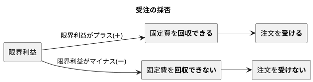
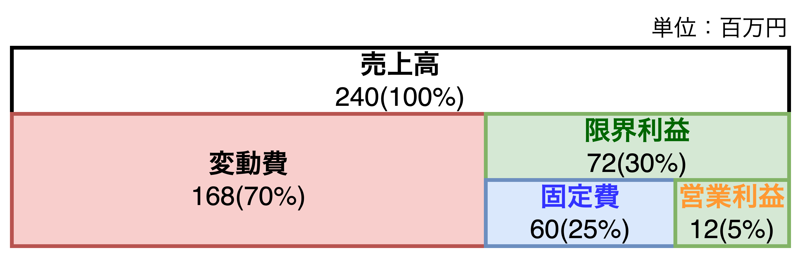
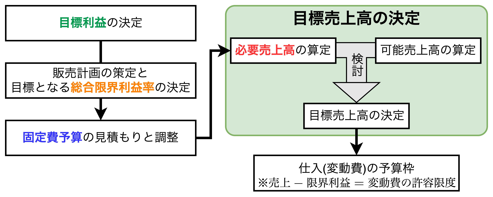
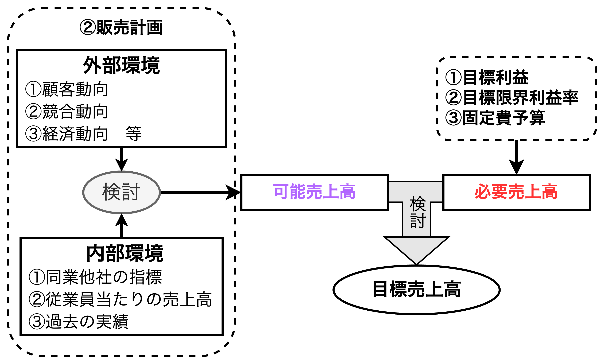

<style>
    body {
      counter-reset: chapter 4;
    }
    h1 {
        counter-reset: sub-chapter;
    }
    h2 {
        counter-reset: section;
    }

    h1::before {
        counter-increment: chapter;
        content: "第" counter(chapter) "章 ";
    }
    h2::before {
        counter-increment: sub-chapter;
        content: counter(chapter) "-" counter(sub-chapter) " ";
    }
</style>

# 短期的意思決定に役立つ考え方

## 機械式洗車は600円、手洗い洗車は1,600円。

- 【**ポイント**】財務会計では使わない機会原価を考慮すると原価が増えて売価(料金)は高くなる。

```
【Question】
ガソリンスタンドに洗車をしに行き、スタンドの店員が以下の価格表を提示した。
⚫︎全自動の機械式洗車　8分  600円
⚫︎手洗い洗車　　　　 15分1,600円
この1,000円の価格差の理由は何でしょう。手洗い洗車は基本的に1人で行います。
```

<table>
    <caption><b>機械式洗車と手洗い洗車の違い</caption>
	<tbody>
		<tr style="border-bottom: 3px solid black;">
			<td></td>
			<th>A.手洗い洗車</th>
			<th>B.機械式洗車</th>
			<th>差(A-B)</th>
		</tr>
		<tr style="border-bottom: 3px solid black;">
			<td><b>①洗車料金</td>
			<td>1,600</td>
			<td>600</td>
			<td>1,000</td>
		</tr>
		<tr>
			<td><b>②直接原価(変動費と直接固定費)</td>
			<td>550</td>
			<td>500</td>
			<td>50</td>
		</tr>
		<tr>
			<td>　洗剤</td>
			<td>100</td>
			<td>100</td>
			<td>0</td>
		</tr>
		<tr>
			<td>　水道光熱費</td>
			<td>100</td>
			<td>100</td>
			<td>0</td>
		</tr>
		<tr>
			<td>　減価償却費</td>
			<td>0</td>
			<td>200</td>
			<td>▲200</td>
		</tr>
		<tr>
			<td>　地代家賃</td>
			<td>50</td>
			<td>100</td>
			<td>▲50</td>
		</tr>
		<tr style="border-bottom: 3px solid black;">
			<td>　人件費</td>
			<td>300</td>
			<td>0</td>
			<td>300</td>
		</tr>
		<tr style="border-bottom: 3px solid black;">
			<td><b>③粗利益(①-②)</td>
			<td>1,050</td>
			<td>100</td>
			<td>950</td>
		</tr>
		<tr style="border-bottom: 3px solid black;">
			<td><b>④機会原価</td>
			<td>750</td>
			<td>0</td>
			<td>750</td>
		</tr>
		<tr>
			<td>機会原価を考慮後の粗利益(③-④)</td>
			<td>300</td>
			<td>100</td>
			<td>200</td>
		</tr>
	</tbody>
</table>

```plantuml
title 機会原価の効果
left to right direction

rectangle "【**事象**】\n機会原価の創出" as cost
rectangle "【**結果**】\n販売価格の増加" as price_up
rectangle "【**対応策**】\n人員配置や人数調整を\n調整する仕組み" as countermeasures

cost ==> price_up
price_up ==> countermeasures: 対応策
```

<div style="page-break-before:always"></div>

- 上表より、手洗い洗車と機械式洗車の**①洗車料金**はそれぞれ$1,600円$と$600円$である一方、**②直接原価**はそれぞれ$550円$と$500円$であり、**③粗利益**の差が$950(=1,050-100)円$ある。
※【**直接原価**】特定の製品・サービスの生産に明確に関連付けできる費用。
- 手洗い洗車には**④機会原価**$750円$が発生しており、機械式洗車には機会原価が発生していない。これにより、**③粗利益**に大きな差が生まれている。ここで、<font color=red><b>機会原価</b>とは、「他の行為を行わなかったことで失った利益」であり、機会損失とも言われる</font>。
- GWの観光地のホテルや旅館の宿泊代が高くなるのも機会原価を意識しているからであり、<u>機会原価の発生により販売価格が大きくなる</u>。
- **粗利益は一種の付加価値**であり、従業員の人件費(固定費)が付加価値を創出している。つまり、<font color=red>従業員が提供する「<b>安心と信頼の洗車</b>」を付加価値として粗利益を創出している</font>。
- 【**補足1**】変動費と直接原価が異なるケースがある。「洗剤と水道光熱費」は直接原価かつ変動費であるが、「減価償却費、地代家賃、人件費」は直接原価かつ固定費である。
- 【**補足2**】直接原価ではなく変動費(洗剤$100$円と水道光熱費$100$円)で考えた場合、限界利益は手洗い洗車が$\frac{1,600-200}{1,600}=\frac{7}{8}=87.5\%$、機械式洗車が$\frac{600-200}{600}=\frac{2}{3}=66.\dot{6}\%$になる。手洗い洗車の限界利益率が高い理由は固定費(減価償却費と人件費)にある。

## 原価割れでも注文を受けるべきか？

- 【**ポイント**】注文受注の採否は「限界利益がプラス」であれば注文を受けるのが有利。

### 値引き後の販売価格と比較すべき価格は何か？

```
【Question】
信州製菓では銘菓りんご最中を作っている。ある問屋から
「通常1個1,200円を900円に値引きできるのなら銘菓りんご最中を1万個購入したい」
という注文を受けた。以下の現在の原価を考慮したとき、1万個の注文を受けるべきか判断せよ。

【銘菓りんご最中の総原価(1個当たり)】
　材料費　　　　500円
　外注加工費　　100円
　固定費　　　　400円(年間予定生産量12万個を前提にしている)
-------------------
　　　　　　　1,000円

【注1】材料費と外注加工費は変動費でフル操業まで単価は変わらない
【注2】年間予定生産量12万個はフル操業の80%の状態で販売確実である
【注3】固定費総額はフル操業まで変化はないものとする
```

#### 【営業利益で分析】値引き後の販売価格と<font color=red>総原価</font>を比較した場合

$$
\begin{align*}
フル操業の生産量[個/年]&=12万個\div 0.8=15万個\\[1mm]
年間予定生産量[個/年]&=12万個+1万個=13万個<フル創業の生産量\\[2mm]
1個当たりの固定費[円/個]&=\frac{400円/個\times 12万個}{13万個}≒369\\[3mm]
1個当たりの\color{red}総原価\color{black}[円/個]&=500+100+369=\bold{\underline{969円}}\\[1mm]
1個当たりの損益(\color{green}営業利益\color{black})[円/個]&=値引き後の販売価格-\color{red}総原価\color{black}\\[1mm]
&=900-969=\bold{\underline{-69円}}（-）
\end{align*}
$$

#### 【限界利益で分析】値引き後の販売価格と<font color=blue>変動費</font>を比較した場合

$$
\begin{align*}
1個当たりの\color{blue}変動費\color{black}[円/個]&=500+100=\bold{\underline{600円}}\\[1mm]
1個当たりの損益(\color{green}限界利益\color{black})[円/個]&=値引き後の販売価格-\color{blue}変動費\color{black}\\[1mm]
&=900-600=\bold{\underline{300円}}（+）
\end{align*}
$$



- 固定費は生産水準(年15万個)を維持するためのコストで<u>能力原価(Capacity Cost)と呼ばれる</u>。つまり、注文の増減で固定費は変化せず、常に$4,800$万円発生する。このように、注文を受けるという<font color=red>「意思決定に影響与えない費用」を<b>無関連原価</b>または<b>埋没原価</b>と言う</font>。
- 限界利益の役割は「固定費の回収」であり、限界利益がプラスであれば固定費を回収できることを示す。そのため、<u>限界利益がプラスであれば注文を受けるべき</u>。しかし、他の問屋からも値引き要求が予想されるため、**数字以外の影響(商売がやりにくくなるようなこと)も考慮する必要がある**。

### 費用と収益の増減に注目して分析する「差額原価収益分析」

```
【1万個の注文を受けた場合】
　差額収益　　　900×1万個　= 900万円
▲差額費用
　材料費　　　　500×1万個　= 500万円
　外注加工費　　100×1万個　= 100万円
　固定費　　　　　　　　　　　　　 0円
---------------------------------
差額利益　　　　　　　 　　　 300万円
```

- 注文を受けた場合に「<font color=blue>増減する収益(差額収益)</font>」と「<font color=red>増減する費用(差額費用)</font>」を取り出して分析する**差額原価収益分析**がある。この分析では差額利益が$300万円$であることから「**注文を受ける方が有利**」と言うことがわかる。
- 【**補足**】上記の問題は固定費は変化しないものとして扱っているが、実際は操業度(生産量)に応じて準固定費的な増減があるはずである。

## 時給はどうやって決めるのか？

```
【Question】
10分1,000円の理容サービスがある。従業員は3名で1日8時間営業である。以下の条件から妥当な時給を算出せよ。
※時給には法定福利費や複製厚生費は含めないものとする。
⚫︎平均100名の客が来るとする。
⚫︎限界利益率95%、労働分配率50%（全業種の平均値）
```

- 【**ポイント**】限界利益と労働分配率から時給を計算。時給の額や従業員数が妥当かどうかは雇用可能人数を出して分析する。
- 【**補足**】理美容、外食、小売など労働集約的なサービス業では、<font color=red>人時生産性は重要な管理指標</font>である。人時生産性をアップさせることで1人当たりの人件費を確保し、低価格でも利益を稼げる経営を実現できる。

### 売上高から人件費を推計して「時給」を求める

- 時給算出までの流れは以下の通り。
  1. 1日当たりの限界利益を推計する
  2. 人時生産性(1人当たり1時間当たりの限界利益)を推計する
  3. 労働分配率から人件費総額を推計する
  4. 【補足】年収の確認

```plantuml
title 時給算出
left to right direction

rectangle 入力データ {
    rectangle "従業員数・営業時間" as work
    rectangle "客数と単価" as unit_price
    rectangle "限界利益率" as profit_rate #afa
    rectangle "(予定)労働分配率" as labor_share #faa
}
rectangle 出力データ {
    rectangle "①売上高" as sales
    rectangle "<color green>①限界利益" as profit
    rectangle "<color orange>②人時生産性" as hr_productivity
    rectangle "<color red>③時給" as hourly_wage
}

unit_price --> sales
sales --> profit
profit_rate ---> profit
work ---> hr_productivity
hr_productivity <- profit
hr_productivity --> hourly_wage
labor_share --> hourly_wage
```

#### ①1日当たりの限界利益を推計する

$$
\begin{align*}
売上高[円/日]&=1,000\times 100=100,000\\
\color{green}限界利益[円/日]&=売上高\times 限界利益率=100,000\times 0.95=\bold{\underline{95,000円/日}}
\end{align*}
$$

#### ②人時生産性(1人当たり1時間当たりの限界利益)を推計する

$$
\begin{align*}
\color{orange}人時生産性[円/人時]&=\frac{労働生産性}{営業時間}=\frac{限界利益}{従業員数\times 営業時間}\\[2mm]
&=\frac{95,000}{3\times 8}=3,958.\dot{3}≒\bold{\underline{3,958円/人時}}\\[2mm]
\end{align*}
$$

#### ③労働分配率から人件費総額(時給)を推計する

$$
\begin{align*}
\color{red}時給[円/時]&=人時生産性\times 労働分配率=3,958\times 0.5=\bold{\underline{1,979円/時}}\\
調整後時給[円/時]&=1,979\div 1.2≒\bold{\underline{1,649円/時}}
\end{align*}
$$

- 上記の時給$1,979円/時$ は従業員1人辺りに支払える人件費になり、**会社負担の「法定福利費や福利厚生費」も含まれる**。算出した時給$1,979円/時$ を給与・賞与の1.2倍程度の法定福利費等を含んだ時給として考えると、調整後の時給は1,979を1.2で割った$1,649円/時$ になる。

#### ④【補足】年収の確認

$$
\begin{align*}
月収[円/月]&=調整後時給\times 8時間/日\times 25日=1,979円/時\times 200時間=\bold{\underline{329,800円/月}}\\
年収[円/年]&=月収\times 12ヶ月=\bold{\underline{3,957,600円/年}}
\end{align*}
$$

<div style="page-break-before:always"></div>

### 予定平均月収から何人まで雇用可能か判断する

- 計算した人件費総額から雇用可能人数を算出する。算出手順は以下の通り。
  1. 1日当たりの人件費総額を求める
  2. 予定月給から必要人件費(1日当たり)を求める
  3. 雇用可能人数を求める

```plantuml
title 雇用可能人数算出
left to right direction

rectangle 入力データ {
    rectangle "予定時給/予定月収" as person_cost
    rectangle "限界利益" as profit #afa
    rectangle "(予定)労働分配率" as labor_share #faa
}
rectangle 出力データ {
    rectangle "①人件費総額" as payable_person_cost
    rectangle "<color red>②必要人件費" as need_person_cost
    rectangle "<color purple>③雇用可能人数" as count_worker
}

profit --> payable_person_cost
labor_share --> payable_person_cost
person_cost --> need_person_cost
need_person_cost --> count_worker
payable_person_cost --> count_worker
```

#### ①1日当たりの人件費総額を求める

$$
\begin{align*}
人件費総額[円/日]=限界利益[円/日]\times 労働分配率[\%]=95,000\times 0.5=\bold{\underline{47,500[円/日]}}
\end{align*}
$$

#### ②予定月給から必要人件費(1日当たり)を求める

$$
\begin{align*}
&【\bold{時給から換算するケース}】\\
&\color{red}必要人件費[円/人日]\color{black}=予定時給\times 営業時間=1,500\times 8=\bold{\underline{12,000円/日}}\\
&【\bold{月収から換算するケース}】\\
&\color{red}必要人件費[円/人日]\color{black}=予定月収\div 営業日数=300,000\times 25=\bold{\underline{12,000円/人日}}\\[1mm]
&調整後必要人件費[円/人日]=必要人件費\times 1.2=\bold{\underline{14,400[円/人日]}}
\end{align*}
$$

- 【**時給から換算するケース**】$時給1,500円$フルタイムで働いた人に支払う場合
- 【**月収から換算するケース**】8時間フルタイムで働いた人に$月30万円$支払う場合

#### ③雇用可能人数を求める

$$
\begin{align*}
\color{purple}雇用可能人数[人]&=\frac{人件費総額[円/日]}{調整後必要人件費[円/人日]}=\frac{47,500}{14,400}=3.2986\dot{1}≒\bold{\underline{3[人]}}
\end{align*}
$$

<div style="page-break-before:always"></div>

## 増員したい！そのとき営業所長はどう提案すべきか？

- 【**ポイント**】コスト増に伴って達成しなければならない利益を損益分岐点比率を維持するという発想で計算する方法がある。

```
【Question】
多摩営業所では営業強化を目指して1名の増員を本部に要求しています。
本部では昨年の収益性を維持し、売上を上方修正できるなら認める考えを持っている。
1名増員ごとに固定費が400万円増加するとき、最低限の売上高の増加量はどの程度の見積もりになるか。
```



### 「収益性を維持する」とは何か

$$
\begin{align*}
&【\bold{P/Lの指標}】\\[1mm]
&粗利率=\frac{\color{navy}売上総利益}{売上高}
\hspace{1mm},\hspace{3mm}
当期純利益率=\frac{当期純利益}{売上高}\\[3mm]
&【\bold{変動P/Lの指標}】\\[1mm]
&限界利益率=\frac{\color{green}限界利益}{売上高}
\hspace{1mm},\hspace{3mm}
管理可能利益率=\frac{\color{limegreen}管理可能利益}{売上高}
\hspace{1mm},\hspace{3mm}
営業利益率=\frac{\color{orange}営業利益}{売上高}
\end{align*}
$$

- 収益性の代表的な指標にROAがあるがROAは総資産や自己資本などのB/Sの項目を使用する。しかし、<u>営業所単位でB/Sの項目を管理している企業はほとんどない</u>。
- 実際のところ、損益情報(売上、費用、利益)から収益性を考えることが多い。変動P/Lからは損益分岐点比率、限界利益率、管理可能利益、営業利益率などがある。

### 最低限必要な売上高・利益の算出

##### 【方法1】売上高固定比率に注目した方法

$$
\begin{align*}
売上高固定費比率&=\frac{\color{blue}固定費}{売上高}=\frac{6,000}{24,000}=\frac{1}{4}=\bold{\underline{25[\%]}}\\[3mm]
必要売上高&=\frac{\color{blue}固定費}{売上高固定費比率}=\frac{\color{blue}400万円}{0.25}=\bold{\underline{1,600万円}}
\end{align*}
$$

##### 【方法2】損益分岐点比率に注目した方法

$$
\begin{align*}
損益分岐点比率&=\frac{損益分岐点売上高}{売上高}=\frac{損益分岐点売上高\times 限界利益率}{売上高\color{black}\times 限界利益率}\\[3mm]
&=\frac{\color{blue}固定費}{\color{green}限界利益}=\frac{\frac{固定費}{売上高}}{\frac{限界利益}{売上高}}=\frac{売上高固定費比率}{限界利益率}=\frac{25}{30}=\bold{\underline{83.\dot{3}[\%]}}\\[3mm]
必要限界利益&=\frac{\color{blue}固定費}{損益分岐点比率}=\frac{\color{blue}400万円}{25\div 30}=\bold{\underline{480万円}}
\end{align*}
$$

- 以上の式から、$400万円の\color{blue}固定費$が増加するとき、$\bold{\underline{1,600万円}}の売上高$、$\bold{\underline{480万円}}の\color{green}限界利益$が必要になる。

## 時期の利益計画(予算)はどんな手順で作るのか？

- 【**ポイント**】利益計画(予算)の流れは経営の流れ(**マネジメントサイクル**)と一致する

```
次期の利益計画(予算)を作成する場合、以下の5項目をどのような順番で決定していくべきか。
◼目標売上高　◼仕入予算　◼目標利益　◼固定費予算　◼販売計画
```

### 固定費予算、目標利益、限界利益率の決定順は？

$$
\color{red}必要売上高\color{black}=\frac{\color{blue}固定費予算\color{black}+\color{green}目標利益(営業利益)}{\color{orange}限界利益率}
$$

- 上式より<font color=red>必要売上高</font>は<font color=blue>固定費予算</font>、<font color=green>目標利益</font>、<font color=orange>限界利益率</font>が決定されると決まる値である。そのため、決定順序としては<font color=red>必要売上高</font>が最後になる。
- 次に<font color=blue>固定費予算</font>、<font color=green>目標利益</font>、<font color=orange>限界利益率</font>の決定順序であるが、これは2つの考え方がある。
  - 【**考え方1**】トップダウンで目標利益を決めてから販売計画を立て、セールスミックスで限界利益率を決める場合、$\color{green}目標利益\color{black}\rightarrow \color{orange}限界利益率\color{black}\rightarrow \color{blue}固定費予算$ で決定する
  - 【**考え方2**】販売計画は現場で行い、目標利益はトップダウンで行う場合、$\color{orange}限界利益率\color{black}\rightarrow \color{green}目標利益\color{black}\rightarrow \color{blue}固定費予算$ で決定する

### 次期の利益計画(予算)の流れ

##### 利益計画の作成モデル



#### ①目標利益の決定

- **次期目標利益はトップダウンで決めるべき**であり、<font color=red>$ROA$や$ROE$などの収益性を用いるとB/Sとの連動性が加味されて理想的</font>である。$ROA5\%$や$ROE8\%$などがある。

#### ②販売計画の策定と目標となる総合限界利益率の決定

- ①目標利益を設定した後は販売計画を立案する。具体的には、**部門別(商品、製品、サービス、エリア、事業ドメインなどの部門の想定)の販売計画の立案**を行う。
  - 顧客動向・競合動向・経済動向などの「**外部環境**」、自社の生産能力・販売力などの「**内部環境**」を加味して、<font color=red>販売目標を決める</font>。
  - 販売目標について、例えば、各製品の $市場規模\times 目標シェア$ を用いる。製品ごとの予定限界利益率を決めておき、それぞれの売上高の構成比(**セールスミックス**)を求めた後、<font color=red>全社の目標となる総合限界利益率が決定される</font>。

<div style="page-break-before:always"></div>

#### ③固定費予算の見積もりと調整

```plantuml
title 固定費予算の見積もり

rectangle 固定費予算 as fixed_cost
rectangle 人件費予算 as hr_cost
rectangle 販売費予算 as sale_cost
rectangle その他固定費 as other_cost

fixed_cost -- hr_cost
fixed_cost -- sale_cost
fixed_cost -- other_cost
```

- ①目標利益と②販売計画を決めた後、<font color=red>活動計画を立て、固定費予算を見積もる</font>。固定費予算は人件費予算、販売費予算、その他固定費の3つに分けて考える。

##### 人件費予算

$$
\bold{許容人件費}=予想限界利益\times 予定労働分配率
$$

- <font color=red>必要人員などを考慮して人件費総額を決めることで、各部門の人件費合計をコントロールし、総人件費を抑える</font>。具体的には<u>予定労働分配率を使って人件費総額の伸びをチェックする</u>と良い。

##### 販売費予算

```plantuml
title 管理会計上の販売費の分類
left to right direction

rectangle 販売費 as sale_cost
rectangle 売上獲得費 as sale_acquisition_cost
rectangle 売上実行費 as sale_act_cost

sale_cost -- sale_acquisition_cost
sale_cost -- sale_act_cost
```

- 販売費予算は売上獲得費予算と売上実行費予算の2つに分けられる。
  - 【**売上獲得費**】広告費や販売促進費など売上を上げるための必要経費。売上と連動しない。
  - 【**売上実行費**】物流費や外注費など商品を顧客に届けるための必要経費。売上と連動する。
- 特に、売上獲得費について、具体的な販促計画の裏付けが必要になる。
  - 【**良い例**】特定の販促活動に△円が必要
  - 【**悪い例**】売上高の〇%が必要

##### その他固定費

- 減価償却費、リース料、地代家賃などの**設備費**は既存設備から求め、新規設備投資計画があるときはそこから発生する設備費を加算する。
- 上記の他、**会議費**、**交際費**、**事務用品費**などの金額が大きいものは個別に見積もり、細かいものは「**その他**」としてまとめる。

#### ④必要売上高→可能売上高→目標売上高の決定



$$
\color{purple}可能売上高\color{black}\geqq目標売上高\geqq \color{red}必要売上高
$$

- ①〜③の3つが決まった後、<font color=red>必要売上高を計算し、実現可能性・妥当性を評価する</font>。
- 例えば、市場規模が1,000億円で目標シェア7%の場合、<u>70億円が<font color=purple>可能売上高</font>になるため、<font color=red>必要売上高</font>は70億円程度に設定すべき</u>である。もし、<font color=red>必要売上高</font>を100億円に設定している場合は$1.43倍(=\frac{100}{70})$の目標設定になるため、再検討が必要になる。
  - 【<font color=purple><b>可能売上高</b></font>】市場規模の中で売り上げることができる最大の売上金額。
  - 【<font color=red><b>必要売上高</b></font>】目標となる利益、限界利益率、固定費予算から算出される売上金額
- 具体的な再検討の方法として、③固定費予算と②限界利益率(販売計画)を見直し、市場規模に基づいた必要売上高の再設定を行う。なお、<u>目標売上高が必要売上高より大きいときは最終的に固定費予算で調整せざるを得ない。目標利益と限界利益率での調整は安易にはすべきではない</u>。

####　⑤仕入予算の決定

$$
仕入予算=目標売上高-目標限界利益=目標売上高-(固定費予算+目標利益)
$$

- 「仕入予算」とは、**製造業**では材料費、外注費、物流費(売上実行費)の予算、**流通業**では商品売上原価、業務委託費などの予算を意味する。すなわち、$\color{red}仕入予算=変動費予算$を指す。
- 仕入計画(**変動費予算**)は販売計画(**限界利益率**)によって制約を受ける。

#### 利益計画とマネジメントの流れは連動する

```plantuml
title 利益計画の決定順序
left to right direction

rectangle "<color green>**目標利益**\n成長戦略" as step1
rectangle "<color orange>**販売計画**\nマーケティング" as step2
rectangle "<color blue>**固定費予算**\n活動計画" as step3
rectangle "<color red>**目標売上高**\n営業目標" as step4
rectangle "**仕入予算**\n生産・仕入目標" as step5

step1 --> step2
step2 --> step3
step3 --> step4
step4 --> step5
```

<div style="page-break-before:always"></div>

## 【実践コラム】業績管理の5つのステップ

<table>
	<tbody>
		<tr>
			<th>ステップ</th>
			<th>管理レベル</th>
			<th>経営課題</th>
			<th>重点計数目標</th>
			<th>キーワード</th>
		</tr>
		<tr>
			<td>1</td>
			<td>財務会計</td>
			<td>日々の経理体制と<br>資金管理の徹底</td>
			<td>・限界利益(粗利益)<br>・運転資金</td>
			<td>正確性<br>適法性</td>
		</tr>
		<tr>
			<td>2</td>
			<td>全社業績管理</td>
			<td>毎月のタイムリーな<br>全社業務把握</td>
			<td>・営業利益<br>・営業CF</td>
			<td>適時性</td>
		</tr>
		<tr>
			<td>3</td>
			<td>部門別業績管理</td>
			<td>部門別の業績管理<br>による経営幹部の育成</td>
			<td>・部門別営業利益<br>・ROA</td>
			<td>戦略性</td>
		</tr>
		<tr>
			<td>4</td>
			<td>次期利益・資金計画<br>の導入レベル</td>
			<td>計画性のある<br>経営の始動</td>
			<td>・目標ROA<br>・FCF</td>
			<td>計画性</td>
		</tr>
		<tr>
			<td>5</td>
			<td>戦略的中期計画の<br>立案</td>
			<td>戦略の再構築</td>
			<td>・企業価値<br>・株主価値</td>
			<td>先見性</td>
		</tr>
	</tbody>
</table>

- 【**ステップ1**】経理体制と資金管理の2つを徹底するステップであり、粗利と運転資金の計数感覚を持っておく。管理会計をするには財務会計のデータ必要であり、商品や顧客ごとの売上高と限界利益(粗利)を日々のデータからわかるくらいのスピードが求められる。また、資金が回らないと倒産してしまうため、得意先別の売上債権や、仕入れ先別の買入債務の管理が重要になる。そして、販売機会損失を減少させるために在庫チェックも必要になる。これらの課題を意識し、解決していく。
- 【**ステップ2**】全社業績把握を行い、管理会計を導入し始めるステップであり、営業利益と営業CFの計数感覚を持っておく。会社レベルで月次決算ができ、毎月の変動P/LとB/Sを作成できることを目標とする。これにより、年間ベースの利益計画の立案や予算管理を行う基礎ができ、スピード感のある集計ができる。自社で財務データの集計ができる体制構築(自計化)が必要にある。
- 【**ステップ3**】部門別/営業所別の業績管理を行うステップであり、部門別の営業利益とROAの計算感覚を持っておく。①経営幹部の育成、②部門別業績の把握とその公開、③成果配分、の3つの課題があり、それぞれ「**組織化**」、「**人の評価・利活用**」、「**評価・成果配分のルール作成**」が目的にある。企業の成長に人材の評価・育成体制が追いついている状態にあるか、確認が必要である。
- 【**ステップ4**】次期利益計画や資金計画を導入するステップであり、目標ROAやFCFの計数感覚を持っておく。管理会計に必要なデータがほとんど全て揃っており、月次で予実管理が可能な状態にあり、部門単位で利益計画を立案し、第6章で説明する予想CFを加えた資金計画も同時に行う。さらに、企業の成長と人材育成が同時にできる基盤が構築されているはずである。
- 【**ステップ5**】更なる成長のために戦略投資・戦略再構築を行うステップであり、企業価値や株主価値を計数感覚として持っておく。新市場参入、新製品開発、多角化などの新たな成長戦略が経営課題になってくる段階にある。3〜5年の中期計画の策定と次期利益・資金計画を組合せた業績管理の実施や後継者問題などの対応が必要になってくる。

## 【まとめ】短期利益計画の考え方


```plantuml
title 人件費算出
left to right direction

rectangle 入力データ {
    rectangle "客数と単価" as unit_price
    rectangle "限界利益率" as profit_rate #afa
    rectangle "従業員数・営業時間" as work
    rectangle "(予定)労働分配率" as labor_share #faa
}
rectangle "A.時給データ" {
    rectangle "①売上高" as sales
    rectangle "<color green>①限界利益" as profit
    rectangle "<color orange>②人時生産性" as hr_productivity
    rectangle "<color red>③予定時給" as hourly_wage
}
rectangle "B.雇用可能人数データ" {
    rectangle "<color red>④必要人件費" as need_person_cost
    rectangle "⑤人件費総額" as payable_person_cost
    rectangle "<color purple>⑥雇用可能人数" as count_worker
}

' 時給データ
profit <- sales
hr_productivity <- profit
hourly_wage <- hr_productivity
unit_price --> sales
profit_rate --> profit
work --> hr_productivity
labor_share --> hourly_wage

' 雇用可能人数データ
profit --> payable_person_cost
labor_share --> payable_person_cost
payable_person_cost --> count_worker
hourly_wage -[#red]-> need_person_cost: <color red>1.2倍
need_person_cost --> count_worker
```

$$
\color{red}必要売上高\color{black}=\frac{\color{blue}固定費予算\color{black}+\color{green}目標利益(営業利益)}{\color{orange}限界利益率}
$$

- 上式より<font color=red>必要売上高</font>は<font color=blue>固定費予算</font>、<font color=green>目標利益</font>、<font color=orange>限界利益率</font>が決定されると決まる値である。そのため、決定順序としては<font color=red>必要売上高</font>が最後になる。
- 次に<font color=blue>固定費予算</font>、<font color=green>目標利益</font>、<font color=orange>限界利益率</font>の決定順序であるが、これは2つの考え方がある。
  - 【**考え方1**】トップダウンで目標利益を決めてから販売計画を立て、セールスミックスで限界利益率を決める場合、$\color{green}目標利益\color{black}\rightarrow \color{orange}限界利益率\color{black}\rightarrow \color{blue}固定費予算$ で決定する
  - 【**考え方2**】販売計画は現場で行い、目標利益はトップダウンで行う場合、$\color{orange}限界利益率\color{black}\rightarrow \color{green}目標利益\color{black}\rightarrow \color{blue}固定費予算$ で決定する

```plantuml
title 利益計画の決定順序
left to right direction

rectangle "<color green>**目標利益**\n成長戦略" as step1
rectangle "<color orange>**販売計画**\nマーケティング" as step2
rectangle "<color blue>**固定費予算**\n活動計画" as step3
rectangle "<color red>**目標売上高**\n営業目標" as step4
rectangle "**仕入予算**\n生産・仕入目標" as step5

step1 --> step2
step2 --> step3
step3 --> step4
step4 --> step5
```
