<style>
    body {
      counter-reset: chapter 5;
    }
    h1 {
        counter-reset: sub-chapter;
    }
    h2 {
        counter-reset: section;
    }

    h1::before {
        counter-increment: chapter;
        content: "第" counter(chapter) "章 ";
    }
    h2::before {
        counter-increment: sub-chapter;
        content: counter(chapter) "-" counter(sub-chapter) " ";
    }
</style>

# 戦略的意思決定に役立つ考え方

## キャッシュフロー重視時代の「利益の役割」

<table>
    <caption>ある会社での3年間の業績推移</caption>
	<tbody>
		<tr>
			<th></th>
			<th>スタート</th>
			<th>1年度</th>
			<th>2年度</th>
			<th>3年度</th>
			<th>3年合計</th>
		</tr>
		<tr>
			<th>売上高</th>
			<td></td>
			<td>200</td>
			<td>300</td>
			<td>400</td>
			<td>900</td>
		</tr>
		<tr>
			<th>費用</th>
			<td></td>
			<td>110</td>
			<td>200</td>
			<td>300</td>
			<td>610</td>
		</tr>
		<tr>
			<th>減価償却費</th>
			<td></td>
			<td>60</td>
			<td>60</td>
			<td>60</td>
			<td>180</td>
		</tr>
		<tr style="border-bottom: 3px double black;">
			<th><font color=red>営業利益</th>
			<td></td>
			<td>30</td>
			<td>40</td>
			<td>40</td>
			<td><font color=red>110</td>
		</tr>
	</tbody>
    <tbody>
		<tr>
			<th>設備投資(5年で焼却)</th>
			<td></td>
			<td>▲300</td>
			<td></td>
			<td></td>
			<td></td>
		</tr>
		<tr>
			<th>在庫</th>
			<td>0</td>
			<td>0</td>
			<td>0</td>
			<td>40</td>
			<td></td>
		</tr>
		<tr style="border-bottom: 15px double black;">
			<th>売掛金</th>
			<td>0</td>
			<td>0</td>
			<td>0</td>
			<td>10</td>
			<td></td>
		</tr>
	</tbody>
    <tbody>
		<tr>
			<th colspan=2>営業CF</th>
			<td>90</td>
			<td>100</td>
			<td>50</td>
			<td>240</td>
		</tr>
		<tr>
			<th colspan=2>投資CF</th>
			<td>▲300</td>
			<td>0</td>
			<td>0</td>
			<td>▲300</td>
		</tr>
		<tr>
			<th colspan=2><font color=red>FCF(フリーキャッシュフロー)</th>
			<td>▲210</td>
			<td>100</td>
			<td>50</td>
			<td><font color=red>▲60</td>
		</tr>
	</tbody>
</table>

- 【**ポイント**】利益は1年以内の短期業績の判断に使い、FCF(フリーキャッシュフロー)は複数期間にわたる戦略的な投資判断に使う。

### 利益とFCFに違いが出る理由

$$
\begin{align*}
&【\bold{3年度末で倒産した場合の利益}】\\[1mm]
&営業利益110-在庫除却損40-貸倒損失10-設備除却損120=▲60(=FCF)\\
\end{align*}
$$

- 3年合計の営業利益(+110)とFCF(-60)の違いは「設備の残存価額」「在庫」「売掛金」の存在である。上式は3年度末で会社が倒産した場合の利益計算を表しており、$FCF$の値と一致している。つまり、<font color=red>「通常」の利益計算では設備の残存価額・在庫・売掛金が控除されない</font>。

<div style="page-break-before:always"></div>

### 利益は「短期の業績」、FCFは「中長期の業績」の評価に役立つ

```plantuml
title 利益とFCFの観点
left to right direction

rectangle 短期的な業績評価 as elem1
rectangle "**【本節の内容】**\n中長期的な業績評価" as elem2
rectangle 利益 as profit
rectangle "F C F" as cf

note right of profit
◼経営が正常に推移している場合は有効
◼4半期や1年などの短期間で分析するときに有効
end note

note right of cf
◼投資効果や投資回収の判断の際に有効
◼設備投資家資本コストを考える際に有効
end note

elem1 --> profit
elem2 --> cf
```

- 事業が順調に進んでいるとき、「利益の評価が有効」であるが、先が不透明な時代には「キャッシュフローの評価が有効」である。
- **資産を多く持つ**製造業・大手小売業・不動産業などでは突然の大きな損失が発生する可能性が高くなるため、**FCFで評価する方が適切に企業の状況を判断できる**。一方、**経営が良好で数年先も事業が正常に運営できる**ことがハッキリしている企業の場合は**利益で評価しても問題ない**。
- <font color=red><b>FCFは</b>単年度で分析するより投資効果がでて投資回収の判断ができる、<b>中長期の累積値で分析する場合に有効</b></font>であり、**利益**は単年度または4半期などの徐々に採算が取れている状況を反映した短期の業績評価に有効。

## 営業キャッシュフローの捉え方を理解しよう

- 【**ポイント1**】間接法では、利益をスタートにして営業CFを計算する。
- 【**ポイント2**】営業CFの計算では、**売上債権の増加額**は利益から<font color=blue>差し引く</font>(減少額は利益を加算する)、**在庫の増加額**は利益から<font color=blue>差し引く</font>(減少額は利益を加算する)、**買入債務の増加額**は利益から<font color=red>加算</font>する(減少額は利益から差し引く)の3つがある。

### 投資回収の可否は営業CFで考える

```plantuml
title 営業CFの特徴
left to right direction

rectangle 営業CFがプラス as cf_plus
rectangle 営業CFがマイナス as cf_minus

note right of cf_plus
余裕資金により投資ができる。
【**投資CF**】設備投資のための固定資産の購入
【**財務CF**】株主への配当還元
【**財務CF**】借入金の返済
end note

note right of cf_minus
キャッシュ不足になる。
【**投資CF**】固定資産の売却
【**投資CF**】有価証券の売却
【**財務CF**】借入金の増加
end note
```

$$
\begin{align*}
\bold{営業CF}&=税引き前当期純利益-法人税・住民税の支払+減価償却費\\
&+\color{red}運転資金の調達高\\[1mm]
&=税引き前当期純利益-法人税・住民税の支払+減価償却費\\
&+(\color{red}売上債権+在庫の増加+買入債務\color{black})
\end{align*}
$$

- <font color=red>営業CFは「<b>投資額を回収する原資</b>」であり、戦略的意思決定の考え方を理解するスタートである</font>。新規出店、設備導入、研究開発、企業買収などを行うには大きな投資(**投資CF**)が必要であり、<u>投資回収の可否判断は戦略的意思決定の典型的なテーマである</u>。
- 営業CFは「ある期間のP/L」と「ある期間のスタートと終わりのB/S」から求められる。すなわち、<u>損益と売上債権や在庫などが予想できると「**予想CF**」が間接法で自動的に計算できる</u>。
  - 【**P/L**】税引き前当期純利益、減価償却費
  - 【**B/S**】売上債権、在庫

### 営業キャッシュフローの特徴

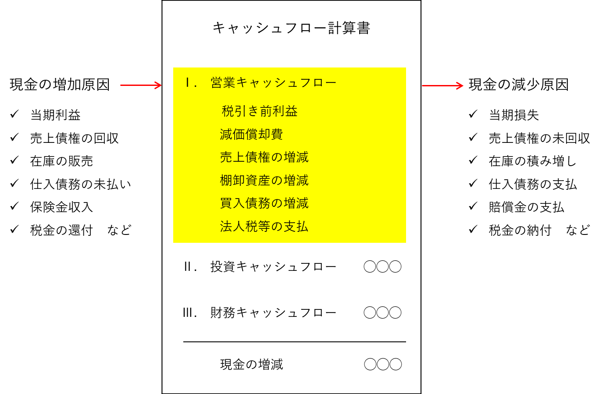

#### 【特徴1】減価償却費はその金額だけ資金が残る

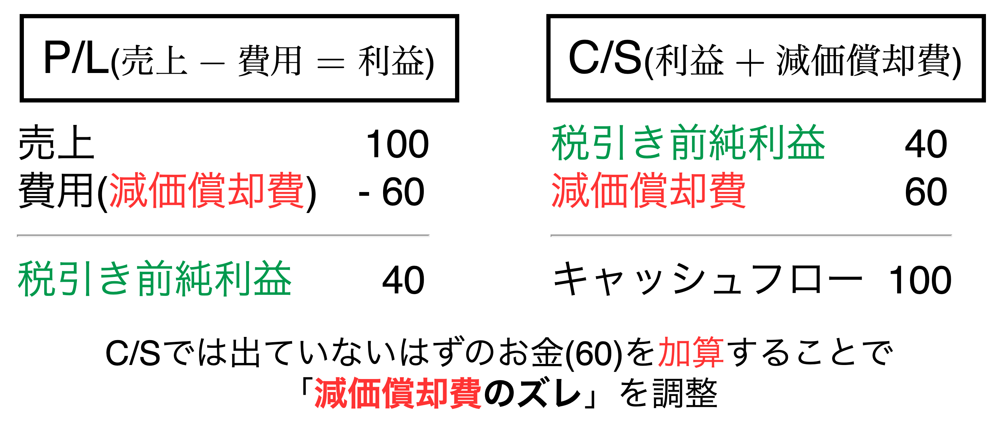

- 間接法では税引き前当期純利益に「減価償却を加算」して営業CFを求める。
- <font color=red>減価償却費は設備の使用・消耗に応じて計上する計算上の費用</font>、つまり、資金の支出は伴わない「**非資金費用**」である。**非資金費用**は減価償却費の他にも、資産の評価損や貸倒引当金繰入などがあるが、減価償却費は特に金額が大きく投資に関連して発生する代表的な非資金費用である。
- 【**減価償却費を加算する意味**】減価償却費は使用・消耗に対する費用であり、実際の資金の支出はなく、資産として残っている。そのため、<u>P/Lで引いた費用分をC/Sで加算し、減価償却費のズレを調整している</u>。

#### 【特徴2】売上債権の増加はその額だけ資金を<font color=blue>減らす</font>

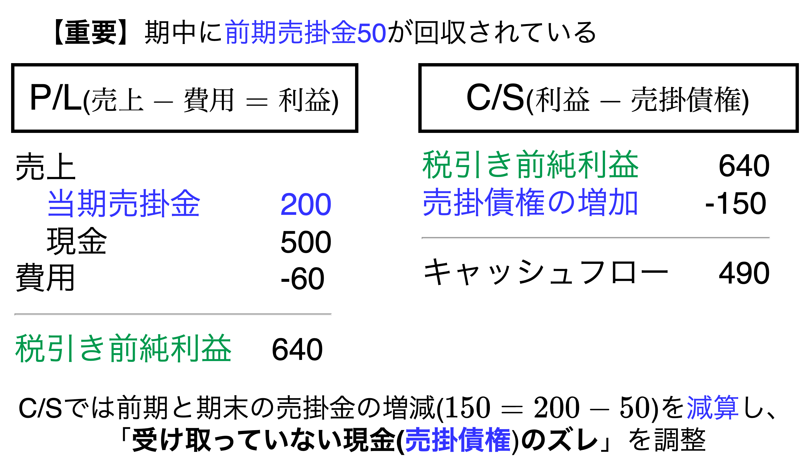

- 売掛金によるP/Lの売上高の増加分をC/Sで減算し、売掛債権のズレを調整している、つまり、<u>売上高に計上された「受け取っていない現金(売掛金)」を打ち消すためにC/Sで減算している</u>。
- <font color=red>売掛金を現金で回収できた場合、C/Sで加算し、営業CFは増加する</font>。

#### 【特徴3】在庫の増加はその額だけ資金を<font color=blue>減らす</font>

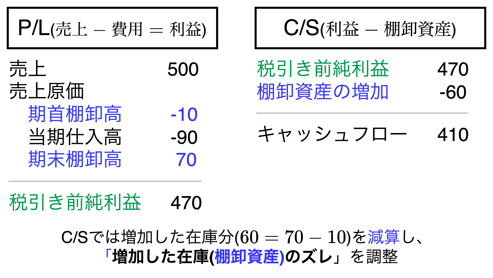

- 期首と期末の棚卸高の増減を計算する。たとえば、期首は10、期末は70とするとその増減は$70-10=+60$になる。この期首と期末の棚卸高の増減に対して税引き前当期純利益を減算する。つまり、<font color=blue>棚卸高が増えていればC/Sでは減算</font>、<font color=red>棚卸高が減っていればC/Sでは加算する</font>。

#### 【特徴4】買入債務の増加はその額だけ資金を<font color=red>増やす</font>

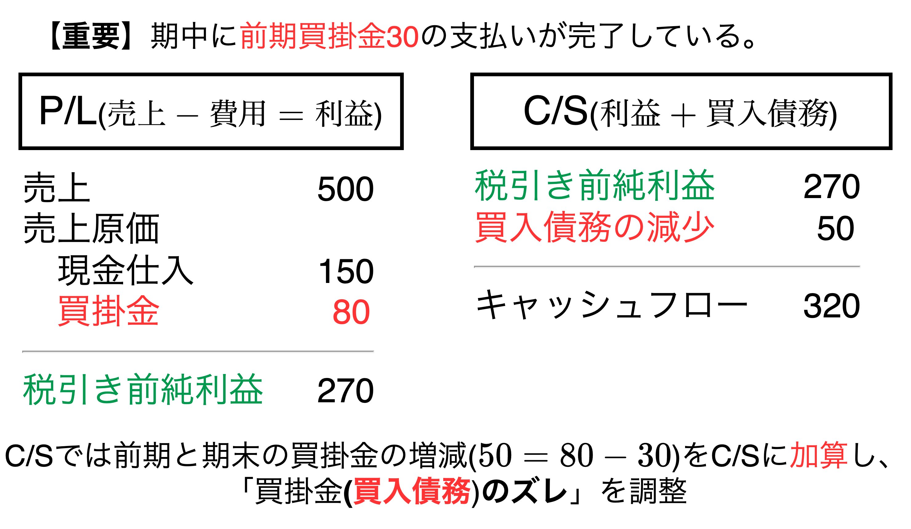

- 期首と期末の借入債務の増減を計算する。たとえば、期首は30、期末は80とするとその増減は$80-30=+50$になる。この期首と期末の買入債務の増減に対して税引き前当期純利益を減算する。つまり、<font color=red>買入債務が増えていればC/Sでは加算</font>、<font color=blue>買入債務が減っていればC/Sでは減算する</font>。

#### 【特徴5】運転資金の調達高の増加はその額だけ資金を<font color=blue>減らす</font>

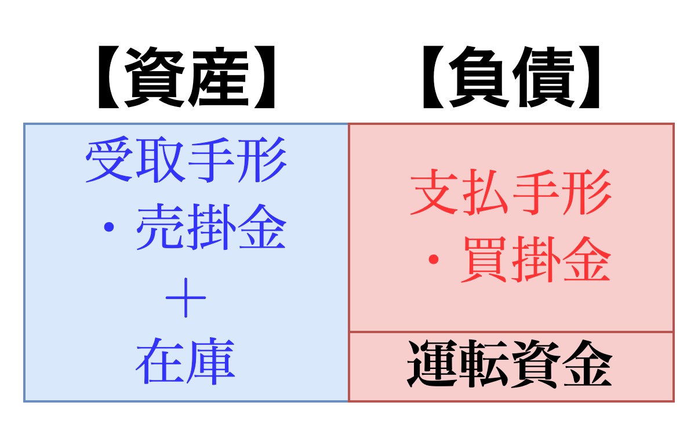

$$
\bold{運転資金}=\color{blue}売上債権\color{black}+\color{blue}在庫\color{black}-\color{red}買入債務
$$

#### 運転資金が不足する(売上債権と在庫が増加する)代表ケース

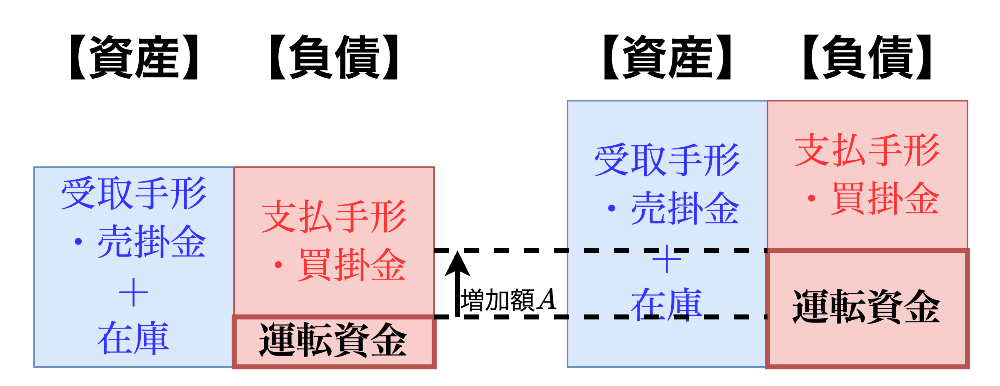

$$
\Delta(\color{blue}売上債権\color{black}+\color{blue}在庫)\color{black}>0
$$

- 売上債権(受取手形と売掛金)と在庫の増加スピードが買入債務(支払手形と買掛金)の増加スピードを上回っているケース。この時の<b>増加額$A$</b>だけ営業利益で増えるはずの営業CFが減少する。
- <u>売上債権や在庫管理を行わないときや徹底できないときにこの状態に陥る</u>。
- **建設業、製造業、卸売業、小売業**などでよく問題になる。

#### 運転資金に余裕があるケース(2パターン)


##### 【パターン1】売上債権と在庫が減少するパターン

$$
\Delta(\color{blue}売上債権\color{black}+\color{blue}在庫)\color{black}<0
$$

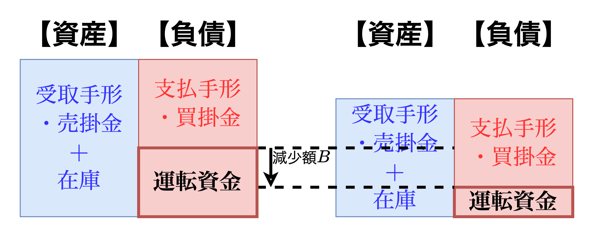

- 売上債権を回収して現金化できていたり、うまく販売して在庫を減らしたりするケースであり、運転資金の<b>減少額$B$</b>だけ営業CFが増加する。
- <font color=red>情報システムを活用した業績管理と現場社員の意識向上</font>によって、「売上高を増加させながら運転資金を調達高を減少させる状況」を生み出せる。

##### 【パターン2】マイナスの運転資金が増加するパターン

$$
\Delta\bold{運転資金}<0\hspace{3mm}\cap \hspace{3mm}\bold{運転資金}<0
$$

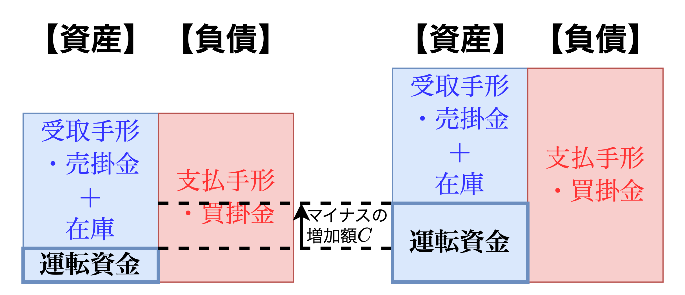

- 自社の支払いが後になる(買入債務が多い)ために手元の現金が減らず、運転資金に余裕のあるケース。$運転資金<0$の状態であり、<b>マイナスの増加額$C$</b>だけ営業CFが増加する。
- このケースは売上債権や在庫をあまり持たないが買入債務は発生する<u>飲食業などのサービス業でよく見られる</u>。

## 営業キャッシュフローを予想する

```plantuml
title 予想営業CFの算出手順
left to right direction

rectangle ①初期投資額算出 as step1
rectangle ②減価償却費予想 as step2
rectangle ③損益計画作成 as step3
rectangle ④運転資金予想 as step4

step1 --> step2
step2 --> step3
step3 --> step4
```

$$
(総)資産回転率[\%]=\frac{売上高}{総資本[総資産]}\times 100\\[3mm]
運転資金の要調達率[\%]=\frac{運転資金の調達高}{売上高}\times 100
$$

- 【**ポイント**】営業CFを予想することが投資の採算判断のスタート。なぜなら、<font color=red>投資額を回収する原資は営業CFだから</font>。
- 間接法にて営業CFを予想できれば新規設備投資の回収期間や利回りなど、投資活動の採否を判断できる。以下、計画期間を5年として営業CFを予想するまでの流れを考える。
- 【**①初期投資額算出**】総投資額を見積もる。出店計画や工場建設計画、M&A計画などあるが、出店計画を例にすると、店舗建設費都土地の補償金、什器備品の購入額などの合計が総投資額になる。
- 【**②減価償却費予想**】初期投資額に関連して減価償却費を予想する。<u>「新規設備」と「既存設備」の両方の減価償却費を計算する</u>。
- 【**③損益計画作成**】投資計画から売上高と固定費(減価償却費含む)を予想し、それらをまとめた変動P/Lを作成する。具体的な手順として、①市場分析による予想売上高と予想限界利益(率)の算出、②固定費計画としての人員計画(人件費予算)・販促計画(販売費予算)・その他固定費予算の見積り、③営業利益算出のための変動P/Lの作成、④税金(法人税等)の計算・控除と当期純利益の予想、の4つがある。
- 【**④運転資金予想**】必要運転資金である売上債権・在庫・買入債務を予想する。これには2つの方法がある。
  - 【**パターンA: 資金回転率を使った方法**】例えば売上高を$1,000\rightarrow 1,200$に$20\%$上げる計画を達成するために、在庫回転率を10→11回転にアップさせるとすると、在庫金額は$1,000\div 10=100$から$1,200\div 11=109.\dot{09}≒109$に変化し、9増加することがわかる。つまり、在庫の増加額9だけ営業CFが減少することがわかる。同様の処理を売上債権と買入債務でも行い、毎年の営業CFの増減を予想する。
  - 【**パターンB: 運転資金の要調達率を使った方法**】運転資金の要調達率は売上高に対する運転資金の調達高の割合であり、プラスであれば資金不足する割合を、マイナスであれば資金が一時的に余る割合を表す。

### 運転資金の要調達率の例

$$
\begin{align*}
\bold{営業CF}&=税引き前当期純利益-法人税・住民税の支払+減価償却費\\
&+\color{red}運転資金の調達高\\[1mm]
&=税引き前当期純利益-法人税・住民税の支払+減価償却費\\
&+(\color{red}売上債権+在庫の増加+買入債務\color{black})
\end{align*}
$$

- 例えば、1年目の年間売上高が100億円とし、運転資金の要調達率が$10\%$とすると運転資金の調達高は$100億円\times 10\%=10億円$になる、つまり、$10億円$の運転資金の不足が考えられ、その借入が必要になる。
- 翌年の2年目の売上高が120億円の場合、増加額の20億円に対する運転資金の調達高を求めると$20億円\times 10\%=2億円$となり、2億円分の借りましが必要であることがわかり、さらにその2億円が営業CFの減少分だと予想される。
- もし1年目の$利益+減価償却費=50億円$とすると、1年目の営業CFは$50億円-10億円=40億円$となり、2年目の$利益+減価償却費=80億円$とすると、2年目の営業CFは$80億円-2億円=78億円$と予想される。

## 現在価値という考え方を理解しよう

$$
\begin{align*}
&\bold{現在価値}=N年後の将来の金額\times\frac{1}{(1+r)^N}
\hspace{10mm}
N:年数\hspace{1mm},\hspace{2mm}r:利回り
\end{align*}
$$

- 【**ポイント**】現在と将来の収支を考えるとき単純な比較では正しく判断できない。将来の収支の現在価値で判断する必要がある。
- 【**現在価値**】「貨幣の時間価値」の考え方に基づいており、将来の不確実性や金利などを考慮して、将来の価値を割引率を用いて現在に割り戻して計算した値。

### 今なら100万円・2年後は110万円を受け取る時の利回り$r$は？

$$
100=110\times\frac{1}{(1+r)^2}
\iff
1+r=\sqrt{\frac{110}{100}}≒\frac{10.488}{10}=1.0488\\[3mm]
\therefore\hspace{1mm}r=0.0488=4.88\%
$$

- 上式から利回り$4.88\%$の場合、2年後にもらえる110万円と現時点の100万円の価値は一致する。
- 【**補足**】用語
  - 2年後の110万円の**現在価値(現価)** は100万円、100万円の2年後の価値(**終価**)は110万円
  - $\frac{1}{(1+r)^N}$の係数部分は「**現価計数**」と呼ばれる

## 資本コストとは何か

- 【**ポイント**】資本コストは企業が目標とする目標投下資本利益率$(ROIC)$の指針となる。
- 意思決定において最低限期待される利回り・利益率を「**資本コスト**」と呼び、企業はこの資本コストを意識する必要がある。

### 企業が資本コストを意識しなければならない理由

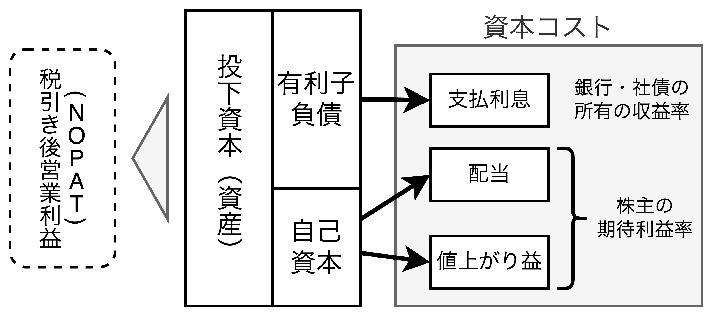

$$
\begin{align*}
&NOPAT(税引き後営業利益)=営業利益-法人税負担額\\
\end{align*}
$$

#### ①資金提供社に対する報酬が資本コスト

- 「資金集め→投資→利益」の流れで事業活動を行う。具体的には、企業は金融機関(**有利子負債**)や株主からの出資(**自己資本**)で資金を集め、設備投資や企業買収(子会社株式の購入)などに投資し(投下資本)、利益を出す。
- **資金集めについて**。事業のために有利子負債を使えば、債権者(金融機関や社債権者など)への利息の支払いが必要になります。自己資本を使えば、株主配当や株価アップによる値上がり益を提供するなどして、株主の期待に応えなければならない。
- 以上のことから、<font color=red>企業は債権者への支払利息と株主への配当や値上がり益の合計を利益の指標として評価すれば良い</font>。財務会計では税引き後営業利益と呼ばれ、管理会計ではNOPAT(Net Operating Profit After Tax)と言う。
※「$NOPAT=税引き後利益+支払利息-受取利息-受取配当金$」でも良い

#### ②資本コストを上回る収益性を目指すことの必要性

$$
\begin{align*}
&ROIC(投下資本利益率)=\frac{利益}{投下資本}=\frac{税引き後営業利益(NOPAT)}{新規投資額}\\[3mm]
&【\bold{資本コストと投資資本利益率}】\\
&資本コスト\leqq ROIC\iff 配当や株価がアップしている\\
&資本コスト>ROIC\iff 事業が縮小している(付加価値が稼げていない)
\end{align*}
$$

- 企業活動は「先行投資に対する投資利益の度合い」を利益額や収益性(利回り)で判断する。
  - 【**利益額**】営業利益、当期純利益、FCF(フリーキャッシュフロー)
  - 【**収益性**】投下資本利益率(ROIC: Return On Invested Capital)
- <font color=red>新規事業のROICの目標値は資本コスト（必要投下資本利益率）を超える必要があり、もし越えなければ資本提供者への付加価値が稼げていないことになる</font>。
  - 資本コストは投資案が越えなければならない**最低限のハードル・レート**
  - 資本コストは不利な投資案を捨てるための**切捨率**
- ROICと資本コスト(必要投下資本利益率)を比較し、ROICが資本コストを下回っている場合は利害関係社に貢献できていない事業であり、事業縮小を検討すべきである。
- **資本コスト**は投資の観点で言えば「最低限期待する利回り」、ビジネスの観点で言えば「その投資で必要な利益の割合」になる。つまり、<font color=red>資本コストは最低限の目標利回りとして新規投資の採算を判断するために将来のFCFの現在価値を計算するときの割引率(利回り)として使われる</font>。

### 資金提供者(債権者や株主)別の資本コストの計算

$$
\begin{align*}
&【\bold{債権者向けの資本コスト}】&\\
&\color{blue}有利子負債の資本コスト\color{black}[\%]=\frac{\color{navy}支払利息\color{black}の合計}{全体の借入金}\\[3mm]
&\color{navy}支払利息\color{black}[円]=\color{purple}支払利息\color{black}=\color{purple}借入金\times 借入金利\color{black}\\[3mm]
&【\bold{株主向けの資本コスト}】&\\
&\color{red}自己資本の資本コスト\color{black}=\frac{1株当たり年間配当+予想値上がり益}{株価}&\\[-2mm]
&\color{red}(株主の期待利益率)\\[1mm]
&\color{green}株主の期待利益率\color{black}=無リスク資産の利子率\\
&\hspace{28.5mm}+(市場全体の期待利益率-無リスク資産の利子率)\times\beta 率\\
\end{align*}
$$

- 資本コスト(最低限期待される利益率)は資金提供者(**債権者や株主**)への報酬であり、資本コストより大きい利回りを実現して安心させる必要がある。以下、資金提供者別に資本コストを考える。

#### 有利子負債の資本コストの計算

$$
\begin{align*}
&【\bold{A銀行の\color{navy}支払利息\color{black}}】\\
&1,000万円\times 4\%=1,000万円\times\frac{4}{100}=\bold{\underline{40万円}}\\[3mm]
&【\bold{B銀行の\color{navy}支払利息\color{black}}】\\
&2,000万円\times 3\%=2,000万円\times\frac{3}{100}=\bold{\underline{60万円}}\\[3mm]
&【\bold{\color{blue}有利子負債の資本コスト\color{black}[\%]}】\\
&\frac{40+60}{1,000+2,000}=\frac{100}{3,000}=\bold{\underline{3.\dot{3}\%}}
\end{align*}
$$

- **有利子負債の資本コストは「借入金の金利」** であり、<u>支払利息は損金に参入できる(税務上、必要経費になる)ので節税効果</u>がある。業種や規模によって異なるが、<u>**平均的には2%前後となる**</u>。
- 例えば、A銀行とB銀行からそれぞれ借入金があったとする。
  - 【**A銀行**】$1,000$万円を金利$4\%$で借りている
  - 【**B銀行**】$2,000$万円を金利$3\%$で借りている

#### 自己資本の資本コストの計算

```
【Question】
長期国債の平均利子率2%、市場の直近の60ヶ月の平均投資収益率5%とする。甲社のβ値は1.6とする。
```

$$
【甲社の期待利益率】2\% + ( 5\% - 2\% ) × 1.6 = 6.8\%
$$

- 【**一般的な考え方**】株主の期待利益率である。ただし注意点が2つあり、①自己資本の資本コストは税引き後であり「節税効果がない」こと、②値上り益は通常予想できないこと、が挙げられる。
- 【**資本資産評価モデル(CAPM)**】上場企業の株主の期待利益率である。市場平均株価(日経平均など)の動きと個別企業の株価の動きや長期金利を使って株主の期待利益率を予測する方法。
  - 【**無リスク&資産の利子率(リスクフリーレート)**】長期国債の利回り。<u>リスクフリーレートは日経新聞などで毎日公表されている</u>。
  - 【**市場全体の期待利益率**】<u>日経平均や東証株価指数(TOPIX)の平均的な変動率を使用</u>する。
  - 【**$\bold{\beta}$値**】市場の株価変動に対する個別企業の感応度（市場の動きに対してどれだけ反応するか）の値</u>である。証券会社などがWebサイト上で公表している。例えば、$\beta値=1$の時、市場平均の株価の変動率と個別企業の変動率が同じことを意味する。<u>A社の$\beta値=1.5$の時、市場全体が$10\%$増減するとA社の株価が$10\%\times1.5=15\%$増減する</u>。
  - 【**補足**】市場全体の期待利益率-無リスク資産の利子率を「リスクプレミアム」と呼ぶ。

#### 非上場企業での資本コストの捉え方

- 非上場企業で株価が不明な場合は以下の方法で資本コストを求める。
  - 【**方法1**】資産を時価評価し、そこから有利子負債を控除して時価ベースの自己資本を求め、それを発行済み株式数で割って株価を求める。
  - 【**方法2**】類似業種の株価を比較して株価を推定する。

### 加重平均資本コスト(WACC: ワック)の計算

$$
\begin{align*}
WACC&=\color{red}自己資本の資本コスト\color{black}[\%]\times\frac{自己資本}{自己資本+有利子負債}\\[3mm]
&+\color{blue}有利子負債の資本コスト\color{black}[\%]\times\frac{有利子負債}{自己資本+有利子負債}\times (1-実効税率)
\end{align*}
$$

- **加重平均資本コスト（WACC: Weighted Average Cost of Capital）は「有利子負債」と「自己資本」のそれぞれの資本コストの加重平均**である。

#### 計算例

```
【Question】
自己資本20億円、自己資本の期待利益率15%、有利子負債30億円、金利5%、法人税35%として、
加重平均資本コストを求めよ。
```

$$
\begin{align*}
&WACC=\color{red}15\%\color{black}[\%]\times\frac{20億円}{20億円+30億円}+\color{blue}5\color{black}[\%]\times\frac{30億円}{20億円+30億円}\times(100\%-35\%)\\[3mm]
&\hspace{12mm}=\color{red}6\%\color{black}[\%]+\color{blue}1.95\color{black}[\%]=\bold{\underline{7.95[\%]}}
\end{align*}
$$

- 銀行借入金の支払利息は$30億円\times5\%=1.5億円$であり、1.5億円のうち法人税$35\%$は節税になる、つまり、$1.5億円\times35\%=0.525億円$が節税対象になり、課税金額は$1.5億円-0.525億円=0.975億円$となる。以上の結果から有利子負債$30億円$の資本コストは$\frac{0.975億円}{30億円}=\color{blue}3.25\%$となる。

## 投資の採算の判断方法(時間価値を考慮しない方法)

```
【Question】
1,000万円の投資で毎年末210万円を5年間受け取れるとする。
下表のような年金型プランAがあった時、どのように意思決定するか。

※このような金融商品の場合、リスクの説明（条件）が必要ですが、
今回は単純化のために確実に受け取れる前提で考える。
```

<table>
	<caption><b>年金型プランAのケース</caption>
	<tbody>
		<tr>
			<th></th>
			<td>合計</td>
			<td>0年</td>
			<td>1年</td>
			<td>2年</td>
			<td>3年</td>
			<td>4年</td>
			<td>5年</td>
		</tr>
		<tr>
			<th>①投資額</th>
			<td>▲1,000</td>
			<td>▲1,000</td>
			<td>0</td>
			<td>0</td>
			<td>0</td>
			<td>0</td>
			<td>0</td>
		</tr>
		<tr>
			<th>②収入額(FCF)</th>
			<td>1,050</td>
			<td>0</td>
			<td>210</td>
			<td>210</td>
			<td>210</td>
			<td>210</td>
			<td>210</td>
		</tr>
		<tr>
			<th>純現金収支(利益)<br>(①+②)</th>
			<td>50</td>
			<td>▲1,000</td>
			<td>210</td>
			<td>210</td>
			<td>210</td>
			<td>210</td>
			<td>210</td>
		</tr>
	</tbody>
</table>

$$
\begin{align*}
&【\bold{収益性}】\\
&投資利回り[\%]=\frac{1,050万円-1,000万円}{1,000万円}=\bold{\underline{5[\%]}}\\[3mm]
&年平均利回り[\%]=5[\%]\div 5年=1[\%]\\[3mm]
&【\bold{安全性}】\\
&投資回収までの月数[ヶ月]=1,000万円\div 210万円/年≒4.76年=\bold{\underline{57.12ヶ月}}\\
&利益を稼いだ月数[ヶ月]=60ヶ月-投資回収までの月数=\bold{\underline{2.88ヶ月}}\\
&経営安全額=(1,050万円\div 60ヶ月)\times 2.88ヶ月=\bold{\underline{50.4万円(≒50万円)}}
\end{align*}
$$

- 【**ポイント**】投資の採算は投資の回収期間(**安全性**)を見るとともに、投資利回り(**収益性**)で判断する。
- 【**投資の利回り(収益性)**】$1,000$万円の投資で5年後、$1,050$万円になる場合、「**5年間合計の投資の収益性**」は$(1,050万円-1,000万円)\div 1,000万円=5\%$である。また、年平均利回りは$(1,050万円-1,000万円)\div 5年=10万円/年$である。
- 【**投資の回収期間(安全性)**】初期投資$1,000万円$を$210万円/年$で回収すると考えると$1,000万円\div 210万円/年=4.76年$で投資回収できる。つまり、5年のうち4.76年で1,000万円を回収でき、残りの$2.88ヶ月(=(5年-4.76年)\times12ヶ月)$で$50万円$の利益を上げることを表す。


## 投資の採算の判断方法(時間価値を考慮する方法)

- 【**ポイント**】①正味現在価値(NPV)は資本コストを使って純現金収支(現金ベースの利益=FCF)を割引計算した値であり、②NPVがプラスであれば、資本コスト(投資家の期待利益率)以上の利回りを上げていることを示す。③内部利益率(IRR)は投資の実際利回りを示し、資本コストは投資家の期待利回り(期待利益率)を示している。

<table>
	<caption><b>資本コスト4%の時の年金型プランAのケース（単位：万円）</caption>
	<tbody>
		<tr>
			<th></th>
			<td>合計</td>
			<td>0年</td>
			<td>1年</td>
			<td>2年</td>
			<td>3年</td>
			<td>4年</td>
			<td>5年</td>
		</tr>
		<tr>
			<th>①投資額</th>
			<td>▲1,000</td>
			<td>▲1,000</td>
			<td>0</td>
			<td>0</td>
			<td>0</td>
			<td>0</td>
			<td>0</td>
		</tr>
		<tr>
			<th>②収入額(FCF)</th>
			<td>1,050</td>
			<td>0</td>
			<td>210</td>
			<td>210</td>
			<td>210</td>
			<td>210</td>
			<td>210</td>
		</tr>
		<tr>
			<th>純現金収支(利益)(①+②)</th>
			<td>50</td>
			<td>▲1,000</td>
			<td>210</td>
			<td>210</td>
			<td>210</td>
			<td>210</td>
			<td>210</td>
		</tr>
		<tr style="border-bottom: 8px double black;">
			<th>④現価係数</th>
			<td>ー</td>
			<td>1.0000</td>
			<td>0.9615</td>
			<td>0.9246</td>
			<td>0.8890</td>
			<td>0.8548</td>
			<td>0.8219</td>
		</tr>
		<tr>
			<th>⑤投資額の現在価値(①×④)</th>
			<td><font color=red>▲1,000</td>
			<td>▲1,000</td>
			<td></td>
			<td></td>
			<td></td>
			<td></td>
			<td></td>
		</tr>
		<tr>
			<th>⑥収入額の現在価値(②×④)</th>
			<td><font color=red>934.9</td>
			<td>0.0</td>
			<td>201.9</td>
			<td>194.2</td>
			<td>186.7</td>
			<td>179.5</td>
			<td>172.6</td>
		</tr>
		<tr>
			<th>⑦現在価値の累計</th>
			<td>ー</td>
			<td>▲1,000</td>
			<td>▲798.1</td>
			<td>▲603.9</td>
			<td>▲417.2</td>
			<td>▲237.7</td>
			<td>▲65.1</td>
		</tr>
		<tr>
			<th>NPV(⑤+⑥)</th>
			<td><font color=red>▲65.1</td>
			<td></td>
			<td></td>
			<td></td>
			<td></td>
			<td></td>
			<td></td>
		</tr>
	</tbody>
</table>

### 正味現在価値(NPV: Net Present Value)の計算

$$
\begin{align*}
&④現価係数_N=\frac{1}{(1+0.04)^N}\hspace{1mm},\hspace{2mm}
⑥収入額の現在価値_N=210\times④現価係数_N=\frac{210}{1.04^N}\\[3mm]
&⑦現在価値の累計_N=\sum_{n=1}^N⑥収入額の現在価値_n-①投資額=\sum_{n=1}^N\frac{210}{1.04^{n}}-1,000\\[3mm]
&\hspace{30mm}=210\frac{1-\frac{1}{1.04^N}}{0.04}-1,000=5,250\times\left(1-\frac{1}{1.04^N}\right)-1,000\\[3mm]
&正味現在価値(NPV)=⑦現在価値の累計_5=5,250\times\left(1-\frac{1}{1.04^5}\right)-1,000≒-65.1\\
&※n,\hspace{1mm}N: 年数
\end{align*}
$$

- 正味現在価値とその累計を考えるとき、**1.現価係数を求め、2.毎年の現在価値を求めた後、3.正味現在価値(現在価値の累計結果)を計算**する。
- <font color=red>正味現在価値(NPV)は時間価値を考慮した投資採算の判断方法であり、<b>利益や赤字額の計算で有用</b>である</font>。NPVがプラスで大きいほど投資の価値は高く、マイナスの場合は投資すべきではないと判断されます。

### 内部利益率(IRR: Internal Rate of Return)を用いた投資判断

<table>
	<caption><b>資本コスト4%、投資額1,000万円、NPV=0となるケース（単位：万円）</caption>
	<tbody>
		<tr>
			<th></th>
			<td>合計</td>
			<td>0年</td>
			<td>1年</td>
			<td>2年</td>
			<td>3年</td>
			<td>4年</td>
			<td>5年</td>
		</tr>
		<tr>
			<th>①投資額</th>
			<td>▲1,000</td>
			<td>▲1,000</td>
			<td>0</td>
			<td>0</td>
			<td>0</td>
			<td>0</td>
			<td>0</td>
		</tr>
		<tr>
			<th>②収入額(FCF)</th>
			<td>1,123</td>
			<td>0</td>
			<td>224.63</td>
			<td>224.63</td>
			<td>224.63</td>
			<td>224.63</td>
			<td>224.63</td>
		</tr>
		<tr>
			<th>純現金収支(利益)(①+②)</th>
			<td>123</td>
			<td>▲1,000</td>
			<td>224.63</td>
			<td>224.63</td>
			<td>224.63</td>
			<td>224.63</td>
			<td>224.63</td>
		</tr>
		<tr style="border-bottom: 8px double black;">
			<th>④現価係数</th>
			<td>ー</td>
			<td>1.0000</td>
			<td>0.9615</td>
			<td>0.9246</td>
			<td>0.8890</td>
			<td>0.8548</td>
			<td>0.8219</td>
		</tr>
		<tr>
			<th>⑤投資額の現在価値(①×④)</th>
			<td><font color=red>▲1,000</td>
			<td>▲1,000</td>
			<td></td>
			<td></td>
			<td></td>
			<td></td>
			<td></td>
		</tr>
		<tr>
			<th>⑥収入額の現在価値(②×④)</th>
			<td><font color=red>1,000</td>
			<td>0.0</td>
			<td>216.0</td>
			<td>207.7</td>
			<td>199.7</td>
			<td>192.0</td>
			<td>184.6</td>
		</tr>
		<tr>
			<th>⑦現在価値の累計</th>
			<td>ー</td>
			<td>▲1,000</td>
			<td>▲784.0</td>
			<td>▲576.3</td>
			<td>▲376.6</td>
			<td>▲184.6</td>
			<td>0</td>
		</tr>
		<tr>
			<th>NPV(⑤+⑥)</th>
			<td><font color=red>0</td>
			<td></td>
			<td></td>
			<td></td>
			<td></td>
			<td></td>
			<td></td>
		</tr>
	</tbody>
</table>

$$
\begin{align*}
&【\bold{IRR}】①投資額の現在価値=正味現在価値(NPV)が成り立つ資本コストr\\
&\frac{210}{1+r}+\frac{210}{(1+r)^2}+\frac{210}{(1+r)^3}+\frac{210}{(1+r)^4}+\frac{210}{(1+r)^5}=1,000\hspace{6.5mm}\therefore\hspace{1mm}\bold{\underline{r≒1.65[\%]}}\\[4mm]
&\frac{224.63}{1+r}+\frac{224.63}{(1+r)^2}+\frac{224.63}{(1+r)^3}+\frac{224.63}{(1+r)^4}+\frac{224.63}{(1+r)^5}=1,000\hspace{4mm}\therefore\hspace{1mm}\bold{\underline{r≒4.00[\%]}}
\end{align*}
$$

- 上記の計算では正味現在価値はマイナスになった、つまり、投資すべきではないプランであり、別のプランを検討すべきである。ここで、NPVがゼロになる資本コスト$r$を考える。この時の**NPVを内部利益率IRR**と呼ぶ。<u>エクセルの$IRR$関数を用いて簡単に求められる</u>。
- IRRをシミュレーションすると、投資額$1,000$万円、収入額$1,050$万円、資本コスト$r=1.65\%$の時に$NPV=0$になり、投資額$1,000$万円、収入額$1,123$万円、資本コスト$r=4.00\%$の時に$NPV=0$になる。

#### 【補足】正味現在価値NPVと内部利益率IRRについて


- 現在価値の累計、投資額、資本コスト、$n$年後の将来価値をそれぞれ$S_n$、$b$、$r$、$a_n$とする。
- 投資回収期間を$N$年とする。

$$
\begin{align*}
&NPV=\sum_{n=1}^N\frac{a_n}{(1+r)^{n}}-b\\[3mm]
&IRR=NPV=0\iff b=\sum_{n=1}^n\frac{a_n}{(1+r)^{n}}\\[5mm]
&【\bold{a_nが固定値(a_n=C)の時}】\\[1mm]
&NPV=\sum_{n=1}^N\frac{C}{(1+r)^{n}}-b=C\times\frac{1}{1+r}\times\frac{1-\frac{1}{(1+r)^N}}{1-\frac{1}{1+r}}-b=\frac{C}{r}\times\left\{1-\frac{1}{(1+r)^N}\right\}-b\\[4mm]
&IRR=NPV=0\iff b=\frac{C}{r}\times\left\{1-\frac{1}{(1+r)^N}\right\}
\end{align*}
$$

<div style="page-break-before:always"></div>

### 資本コストの増加の影響

```plantuml
title 資本コストが増加するパターン
left to right direction

interface "スタート" as root
rectangle "利回りが大きい競合商品が\n出てくるパターン" as pattern1
rectangle "加重平均資本コスト(企業の資本コスト)が\n大きくなるパターン" as pattern2
rectangle "有利子負債の資本コスト(金利)が\nがアップするパターン" as pattern2_1
rectangle "自己資本の資本コスト(期待利益率)が\nがアップするパターン" as pattern2_2

root -- pattern1
root -- pattern2
pattern2 -- pattern2_1
pattern2 -- pattern2_2
```

- 【**利回りが大きい投資商品が出てくるパターン**】<font color=red>利回りが大きい競合商品が出てきた時のケース</font>。例えば、$4\%$の投資プランBとリスクが同じでもっと利回りが大きな「競合商品の投資プランC」が出てくれば年金型プランAは毎年収入額(FCF)を224.63万円より、さらに増やす必要がある。加えて、投資プランBは選択されなくなる(投資プランCの方が資本コストが高い)こともわかる。そこで、<u>プランAとBを扱う企業は毎年の収入額(FCF)を増やす方法を常に検討する必要がある</u>。
- 【**企業の資本コストが大きくなるパターン**】<font color=red>加重平均資本コスト(WACC)がアップするケース</font>、つまり、有利子負債もしくは自己資本の資本コストがアップするケースを意味する。
  - 【**有利子負債の資本コスト(金利)がアップするパターン**】外部環境が影響するケースと内部環境が影響するケースがある。**外部環境**について、例えば良いケースとして$\underline{\footnotesize景気加熱\rightarrow 資金需要の増加\rightarrow 金融機関の貸出金利の上昇}$がある。また、悪いケースとして$\underline{\footnotesize財政悪化\rightarrow 国債売却による長期金利の上昇\rightarrow 銀行の貸出金利が上昇}$がある。一方、**内部環境**について、例えば、$\underline{\footnotesize企業の財務の安定性悪化\rightarrow 金融機関の貸出金利の上昇}$がある。
  - 【**自己資本の資本コスト(期待利益率)がアップするパターン**】企業の業績が好調な場合や業績の高評価による株価アップの場合には株主の期待利益率がアップする。また、増配が想定されるケースでも株価がアップし、期待利益率もアップする。例えば、手元資金を多く所有しており、投資を積極的に行わない企業は増配期待で株価がアップすることがある。
- 上記のパターンより、**資本コストがアップした企業は$ROIC$を高める必要がある(6-5節参照)**、つまり、<u>将来の純現金収支(利益)を増加させるような成長戦略を市場から迫られることになる</u>。
- 純現金支出(利益)を増加させるような成長戦略の期待に答えられない上場企業は市場からの圧力を避けるために「子会社を完全子会社として吸収」や「MBO(マネジメントバイアウト)」によって経営陣が株式を購入し、上場廃止して**資本コスト(特に自己資本)の低下を図る**ケースが見られる。一方、業績が悪化した企業がリストラを徹底するために目標ROICを下げる必要から上場廃止するケースもある。
- 以上のことから、<font color=red>上場企業やファンドが出資する企業は資本コストを意識した経営が求められるようになってきている</font>。

<div style="page-break-before:always"></div>

## キャッシュフローの予測と採算判断(事例で総まとめ)

```
【Question】
以下のデータや条件から、投資の採算を判断しなさい。
```

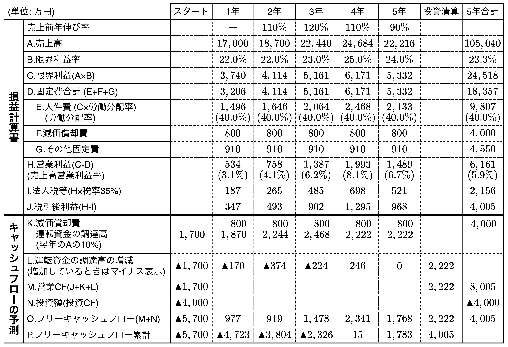

### 中期計画の手順と内容を理解する

```plantuml
title 中期計画の手順
left to right direction

rectangle "①初期投資額\nの見積り" as step1
rectangle "【**P/L**】\n②損益予想" as step2 #faa
rectangle "【**C/S**】\n③FCF予想" as step3 #afa
rectangle "【**B/S**】\n④B/S予想" as step4 #aaf
rectangle "⑤NPVとIRR\nの計算" as step5

step1 --> step2
step2 --> step3
step3 --> step4
step4 --> step5
```

- 大手企業の社内ベンチャーが5年限定の製品販売プロジェクトを立ち上げて5年後に解散するとする。その中期計画を立てることを考える。
-  大きな流れとしては、まず**P/L、C/S、B/Sの予想**をそれぞれ行い、次に**正味現在価値($NPV$)や計画利回りである内部利益率($IRR$)の計算**をすることで、<font color=red>投資実施の適否を判断する</font>。

#### ①初期投資額の見積り

```plantuml
title 初期投資額の見積り
left to right direction

rectangle "**1**.設備投資" as step1
rectangle "**2**.運転資金の要調達率の設定" as step2

step1 --> step2
```

1. 【**設備投資**】設備投資$4,000万円$(5年間で定額償却する。残存価額はゼロ)
2. 【**運転資金の要調達率の設定**】営業を開始するために必要な運転資金の調達高として1年目の売上高$10\%$を投資する。この$10\%$が運転資金の要調達率になる。

#### ②(5年間の)損益予想

```plantuml
title 5年間の損益予想
left to right direction

rectangle "**1**.販売計画から\n　売上高と\n　限界利益率予想" as step1 #faa
rectangle "**2**.労働分配率の設定" as step2 #faa
rectangle "**3**.減価償却費\nの算出" as step3 #faa
rectangle "**4**.その他固定費\nの予想" as step4 #faa
rectangle "**5**.法人税等\nの設定" as step5 #faa

step1 --> step2
step2 -> step3
step3 --> step4
step4 --> step5
```

1. 【**販売計画から売上高と限界利益率予想**】販売計画に基づいて予想(5-5節の①と②参照)
2. 【**労働分配率の設定**】人件費の予想は労働分配率を$40\%$と設定して予想。
3. 【**減価償却費の算出**】毎期の減価償却費は$800万円(=4,000万円\div 5年)$
4. 【**その他固定費の予想**】その他の固定費を予想(5-5節の③参照)
5. 【**法人税等の設定**】法人税等は営業利益の$35\%$とする

#### ③FCF予想

```plantuml
title FCF予想
left to right direction

rectangle "**1**.営業CFの予想" as step1 #afa
rectangle "**2**.運転資金の\n　調達高の予想" as step2 #afa
rectangle "**3**.投資CFの計算" as step3 #afa
rectangle "**4**.FCFの計算" as step4 #afa

step1 --> step2
step2 --> step3
step3 --> step4
```

1. 【**営業CFの予想**】営業CFを予想する。<br>$営業CF=税引き前純利益+減価償却費-運転資金の調達高の増減$
2. 【**運転資金の調達高の予想**】運転資金の調達高を予想する。<br>$前年末の運転資金の調達高=翌年売上高\times 運転資金の要調達率(=10\%)$
3. 【**投資CFの計算**】初期投資$4,000万円$のみが投資CFに該当する。
4. 【**FCFの計算**】$FCF=営業CF+投資CF(費用の場合は負の値)$を求める。

<div style="page-break-before:always"></div>

#### ④B/S予想

<table>
	<caption>予想B/S　（単位：万円）</caption>
	<tbody>
		<tr>
			<th colspan="2"></th>
			<th>スタート</th>
			<th>1年</th>
			<th>2年</th>
			<th>3年</th>
			<th>4年</th>
			<th>5年</th>
			<th>投資清算</th>
		</tr>
		<tr>
			<th rowspan="5">予想<br>B/S</th>
			<th>R.現金</th>
			<td>0</td>
			<td>977</td>
			<td>1,896</td>
			<td>3,374</td>
			<td>5,715</td>
			<td>7,483</td>
			<td>9,705</td>
		</tr>
		<tr>
			<th>S.運転資金<br>の調達高</th>
			<td>1,700</td>
			<td>1,870</td>
			<td>2,244</td>
			<td>2,468</td>
			<td>2,222</td>
			<td>2,222</td>
			<td>0</td>
		</tr>
		<tr>
			<th>T.固定資産</th>
			<td>4,000</td>
			<td>3,200</td>
			<td>2,400</td>
			<td>1,600</td>
			<td>800</td>
			<td>0</td>
			<td>0</td>
		</tr>
		<tr>
			<th>投下資本<br>(R+S+T)</th>
			<td>5,700</td>
			<td>6,047</td>
			<td>6,540</td>
			<td>7,442</td>
			<td>8,737</td>
			<td>9,705</td>
			<td>9,705</td>
		</tr>
		<tr>
			<th>自己資本<br>利益剰余金</th>
			<td>5,700<br>　　0</td>
			<td>5,700<br>&nbsp;&nbsp;&nbsp;347</td>
			<td>5,700<br>&nbsp;&nbsp;&nbsp;840</td>
			<td>5,700<br>1,742</td>
			<td>5,700<br>3,037</td>
			<td>5,700<br>4,005</td>
			<td>5,700<br>4,005</td>
		</tr>
		<tr>
			<th colspan="2">ROIC(%)<br>(税引き後利益÷投下資本)</th>
			<td></td>
			<td>5.9%</td>
			<td>7.8%</td>
			<td>12.9%</td>
			<td>16.0%</td>
			<td>10.5%</td>
			<td></td>
		</tr>
	</tbody>
</table>

```plantuml
title 予想B/Sの作成
left to right direction

rectangle "**1**.資産の\n　リストアップ" as step1 #aaf
rectangle "**2**.現金残高の計算" as step2 #aaf
rectangle "**3**.設定した運転資金の\n　調達高の記入" as step3 #aaf
rectangle "**4**.固定資産の記入" as step4 #aaf
rectangle "**5**.投下資本の計算" as step5 #aaf
rectangle "**6**.各年度の\n　ROICの計算" as step6 #aaf

step1 --> step2
step2 -> step3
step3 --> step4
step4 -> step5
step5 --> step6
```

1. 【**資産のリストアップ**】本例では現金、運転資金の調達高、固定資産の3項目をリストアップする
2. 【**現金残高の計算**】各年のFCFを累計したもの。4年末の現金（5,715万円）は1〜4年のFCFの合計（977+919+1,478+2,341=5,715万円）する。<font color=red>5年目の調達高についてはプロジェクト終了に伴い現金で回収する</font>。
3. 【**設定した運転資金の調達高の記入**】翌年の売上高の$10\%$の金額を記入する。
4. 【**固定資産の記入**】4,000万円から毎年の減価償却費800万円を控除して表示する。
5. 【**投下資本の計算**】本例では自己資本と利益剰余金の合計が投下資本になる。
6. 【**各年度のROICの計算**】税引き後純利益÷投下資本を計算する。

#### ⑤NPVとIRRを計算してプロジェクトを実施適否を判断する

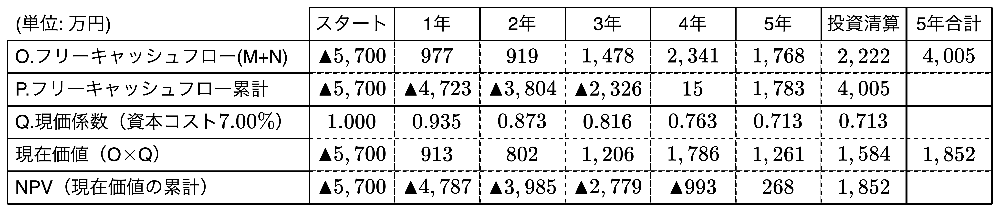

```plantuml
title プロジェクト実施適否の判断
left to right direction

rectangle "**1**.資本コストの設定と\n現価係数の計算" as step1
rectangle "**2**.NPV（正味現在価値）と\nIRR（内部利益率）の計算" as step2
rectangle "**3**.収益性と安全性の評価" as step3

step1 --> step2
step2 --> step3
```

$$
\begin{align*}
&\bold{NPV}=\frac{977}{1.07}+\frac{919}{(1.07)^2}+\frac{1,478}{(1.07)^3}+\frac{2,341}{(1.07)^4}+\frac{(1,768+2,222)}{(1.07)^5}-5,700\\[3mm]
&\hspace{9mm}=7,552-5,700=1,852\hspace{7mm}\therefore\hspace{2mm}\bold{\underline{NPV=1,852[万円]}}\\[3mm]
&【\bold{IRR}】\\[1mm]
&\frac{977}{1+r}+\frac{919}{(1+r)^2}+\frac{1,478}{(1+r)^3}+\frac{2,341}{(1+r)^4}+\frac{(1,768+2,222)}{(1+r)^5}=5,700\\[3mm]
&\therefore\hspace{2mm}r≒\bold{\underline{15.79[\%]}}
\end{align*}
$$

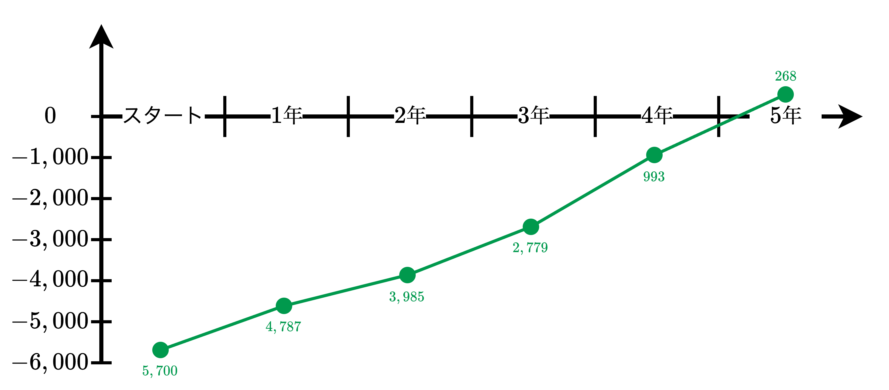

1. 【**資本コストの設定と現価係数の計算**】資本コストを$7.00\%$として現価係数を求める。
2. 【**NPVとIRRの計算**】初期投資額、C/SのFCF、現価係数を用いて$NPV$と$IRR$を求める。本例では、$NPV=1,852[万円]$、$IRR: r=15.79[\%]$が計算できた。
3. 【**収益性の評価**】IRRを用いて計算した資本コストは$15.79\%$であり、資本コスト$7.00\%$より倍以上大きい$(15.79\%>7.00\%\times 2)$ことから<font color=red>収益性は比較的高く、<b>問題のない投資</b></font>と言える。
4. 【**安全性の評価**】NPVは4年目までは赤字、5年目から黒字となっている。もし業績が計画より下回って推移した場合は回収遅延のリスクがあるため、<font color=red><b>安全性の視点では「問題ある投資」</b></font>と言える。

<div style="page-break-before:always"></div>

## 予想貸借対照表をイメージで理解しよう

- 【**ポイント**】P/L、B/S、C/Fを関連させて財務3表の関係をイメージしながら計画しよう。
- 本節ではP/Lだけのプランだけでなく、<font color=red>B/SとC/Sも連動させたビジネスプランの作成を確認</font>する。

### 事業スタートの準備

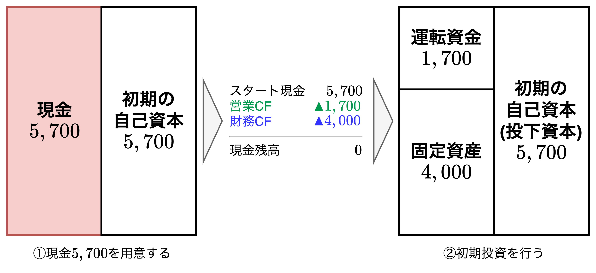

- 上図の①は現金$5,700万円$を用意した事業スタート時のB/Sである。
- 上図の②は在庫投資などの$1,700万円$と設備投資$4,000万円$を行なったB/Sであり、<u><font color=green>1,700万円は営業CF</font>、<font color=blue>4,000万円は投資CF</font></u>となる。

#### 【補足】B/S上の運転資金の調達高

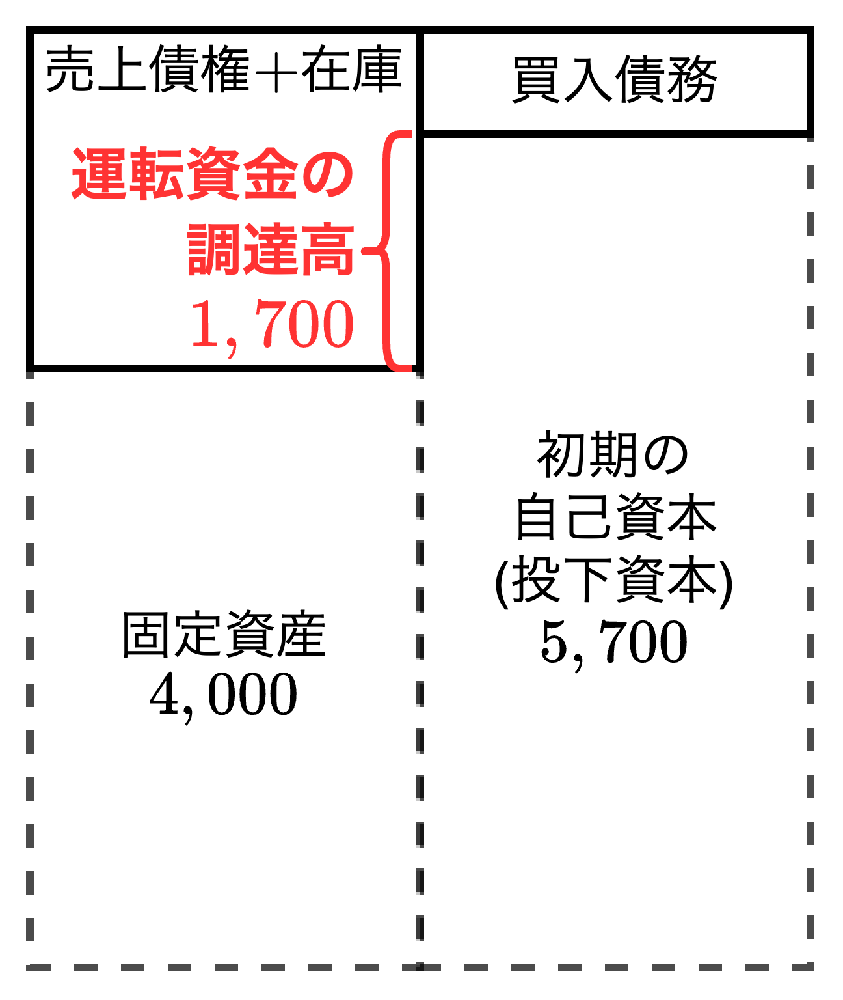

- B/Sでは、売上債権と在庫は「**資産**」、借入債務は「**負債**」である。運転資金の調達高はこれら3項目の回転率などを利用して予想する方法と、直接予想する方法の2つがある。

### 1年後と2年後のB/S

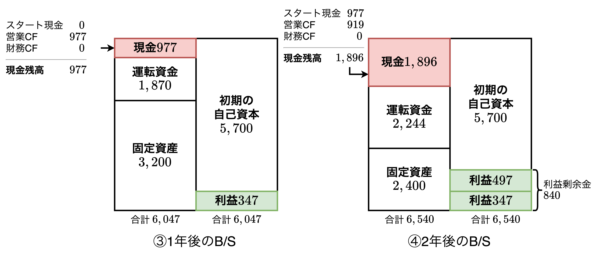

- 【**現金**】1年目は977万円の営業CFが増加し、2年目はさらに919万円の営業CFが増加し、1,896万円になっている。
- 【**利益剰余金**】1年目は利益347万円が増加し、2年目はさらに497万円が増加している。
- 【**固定資産**】耐用年数が5年であるため、毎年800万円の減価償却費を減らす。1年目は3,200万円、2年目は2,400万円となる。

### 3年後と4年後のB/S

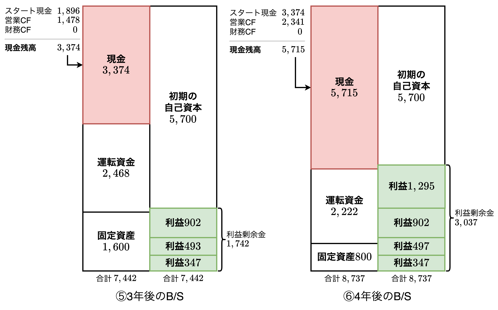

- 【**現金**】3年後は2年末の現金1,896万円に営業CF1,478万円が積み上がり3,374万円、4年末も同様の考えでさらに5,715万円となる。
- 【**利益剰余金**】税引後純利益が積み上がり3年末は902万円、4年末は1,295万円が積み上がっている。

### 5年後のB/S

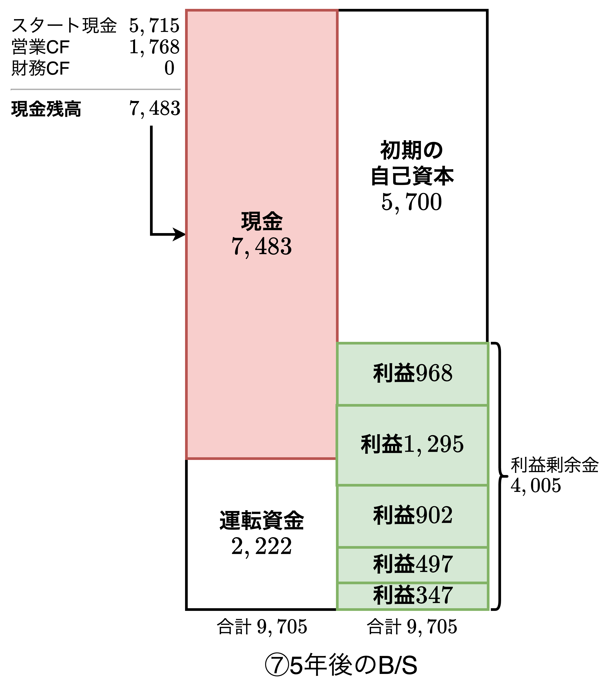

- 【**現金**】5年末の現金は4年末の現金5,715万円に営業CF1,768万円を積み上げ、7,483万円になる。
- 【**利益剰余金**】税引後利益が積み上がり5年末は968万円が増加し、自己資本が9,705万円になる。

### 5年間のFCF(純現金収支)を見る

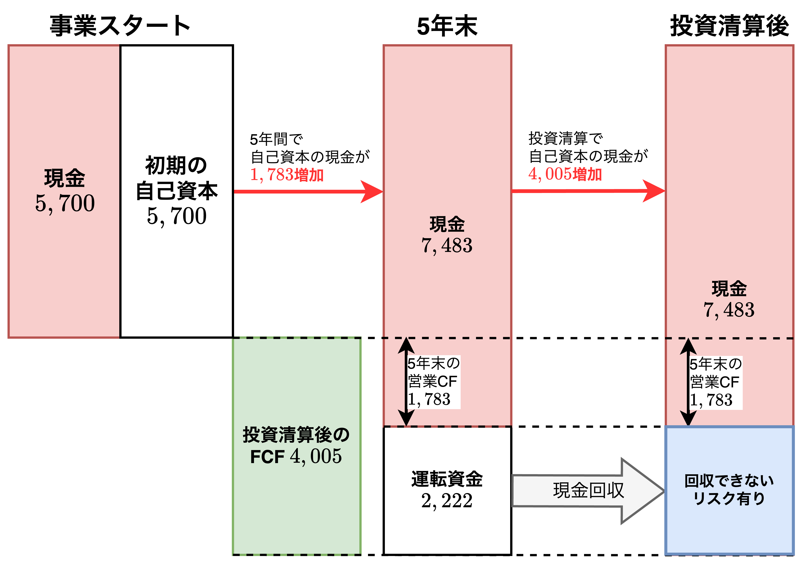

- 5年間で現金は$1,783(=7,483-5,700)万円$増加し、投資清算後の運転資金の調達高も含めると$4,005(=2,222+1,783)万円$の現金が増加する。この<font color=red>運転資金の調達高は回収できないリスクがあるため、キャッシュフローの減少になる可能性があることは考慮の必要がある</font>。

<div style="page-break-before:always"></div>

## 企業価値が向上するという意味

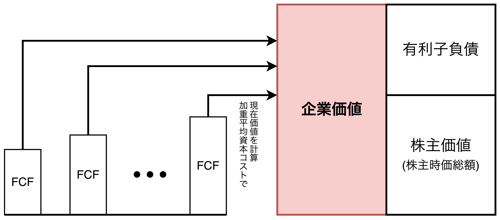

$$
\begin{align*}
\color{red}企業価値&=\sum_{n=1}^N\frac{FCF_n}{(1+r)^n}-初期投資\\[4mm]
\color{blue}株主価値&=\color{red}企業価値\color{black}-有利子負債
\hspace{1mm},\hspace{3mm}
株価&=\color{blue}株主価値\color{black}\div 発行済み株式数
\end{align*}
$$

- 【**ポイント**】資本コスト$r$の低下は企業価値(FCFの現在価値の合計)を高める。
- **企業価値**とは、<u>企業が今後生み出すと予想されるFCFの現在価値の合計</u>であり、このような企業価値評価手法を**DCF(Discounted Cash Flow)法**という。
- 成長戦略によって将来の営業CFを大きく伸ばし、投資額（投資CF）を早く回収できればFCFは早期に黒字になり、企業価値は高まる。
- 複数の事業を行う企業では各事業価値の合計が企業価値となる。例えば、<u>小売・宅配・輸送・不動産などを手掛ける電鉄会社は各事業を相互に関連させ、**シナジー効果**を発揮することで企業価値をアップさせている</u>。

<div style="page-break-before:always"></div>

### 企業価値と加重平均資本コスト(WACC)の関係

- 上式より、<font color=red>DCF法における企業価値は、WACCが大きいほど小さくなる</font>。これにより、<font color=red>株主価値と株価も資本コストが大きいほど、小さくなることがわかる</font>。
- 金利が上がると株価が下がる理由は以下の3つパターンが存在すると考えられる。
  - 【**1つ目**】借入金の支払利息増加に伴う減益でFCFが下がり、**企業価値が下がる(=株価が下がる)**。
  - 【**2つ目**】金利が上がり株式投資のリスクが増加する。これに伴い、リスクの少ない債権を買う人が増加し、**株式の相対的魅力が下がる(=株価が下がる)**。
  - 【**3つ目**】資本コストが上がり、**企業価値が下がる(=株価が下がる)**。
- では資本コストを下げる方法は何があるのか。<font color=red>資本コストは有利子負債と自己資本の2つから構成されるが、一般的に自己資本の資本コストは高く、下げることが難しい</font>。これは株主の視点から考えるとわかるが、利回りを下げることが難しいことに起因する。
- 資本コストを下げる具体的な方法は以下の2つ。
  - 【**1つ目: 有利子負債の活用**】金利が低い時期に比較的財務の安全性が高い企業が行う手法。工場建設等の新規の投資を行うときなどに活用する。「**レバレッジ**を効かせて（負債を活用して）資本コストを下げる」などと表現する。ただし、<u>財務の安全性が悪い企業では借金するときの金利がアップして資本コストの低下につながらないことがある</u>。
  - 【**2つ目: 自社株買いによる自己資本の減少**】自社株買いにより発行済み株式数を小さくする方法。自己資本比率を低下させ、資本コストを小さくする。ただし、<u>過度な負債の活用は財務の安全性を悪化させ、過度な自社株買いは株価アップに繋がるため都度適切な対応が必要になる</u>。
