

# 財務3表の基礎知識

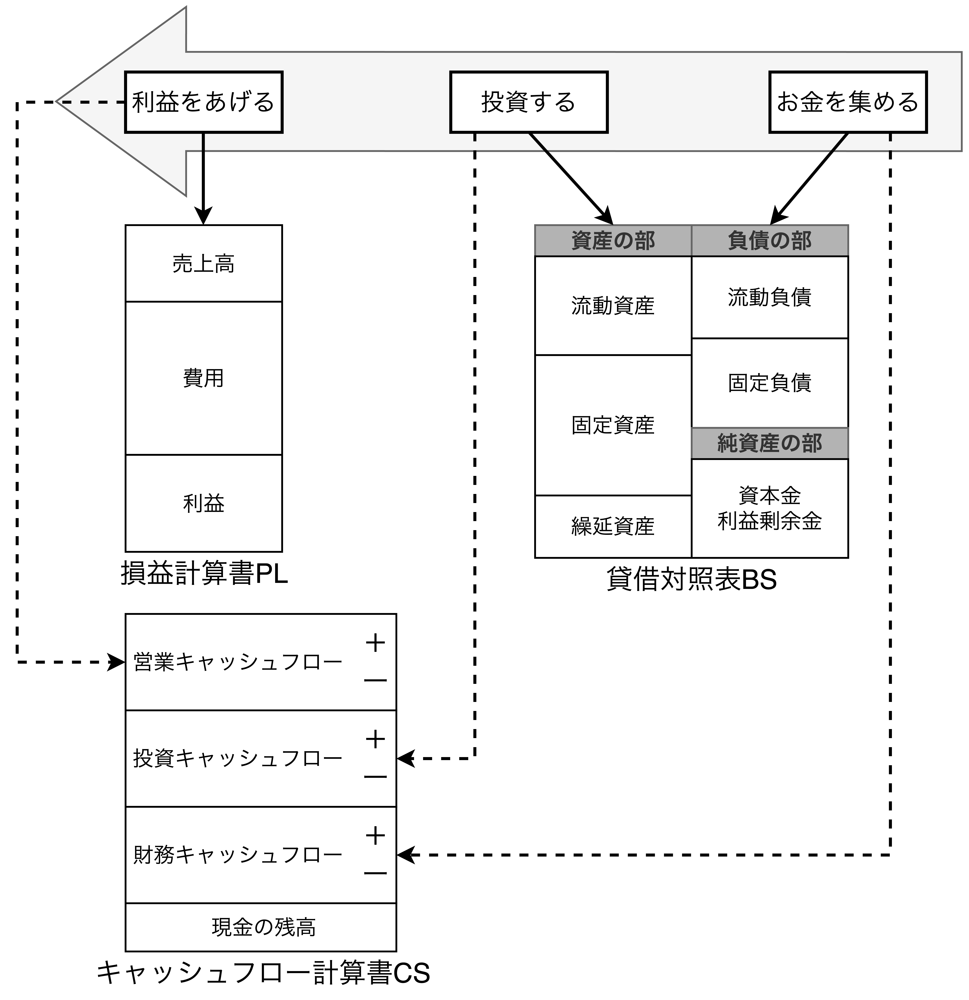

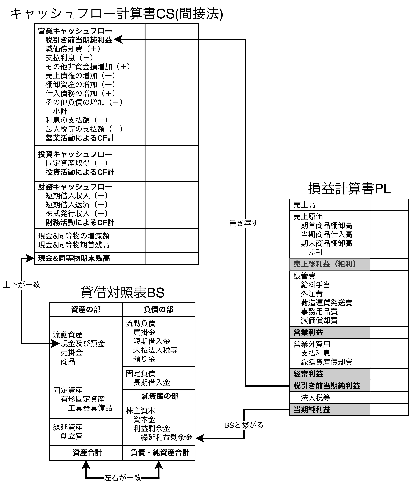

## なぜ会計が簡単に理解できるのか

### 財務諸表が作られていく手順

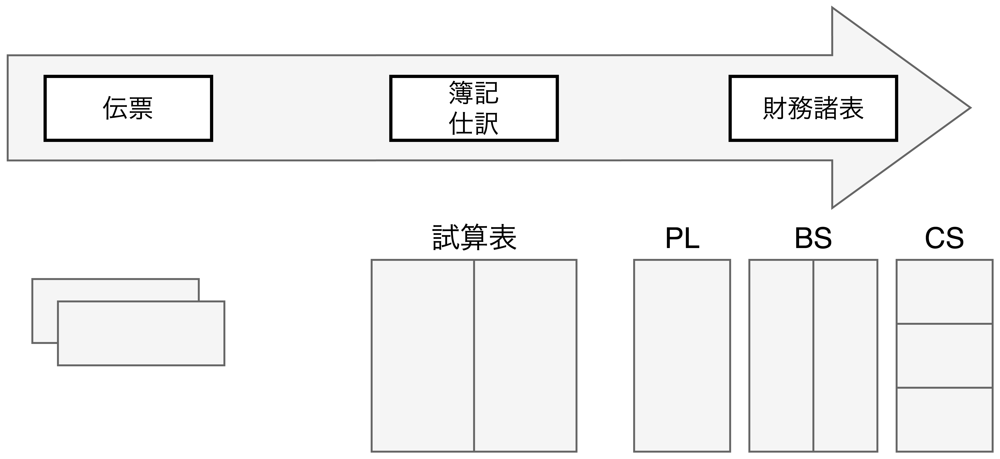

- 会社の事業活動では常に売上や仕訳の「伝票」が上がり、その伝票を経理部門の人が帳簿に記帳する(簿記)。
  - 一般的に簿記は複式簿記のことを指す。
  - 伝票を帳簿に記帳するルールを仕訳と言う。
- 全ての伝票を帳簿に記帳したものを試算表と呼び、1年に1度この試算表が財務諸表(PL, BS, CS)になる。

### 財務諸表を一体にして「繋がり」を理解する

- 財務諸表のうち、以下の3つをまとめて基本財務3表と呼ばれる。
  - 損益計算書(P/L: Profit and Loss Statement)
  - 貸借対照表(B/S: Balance Sheet)
  - キャッシュフロー計算書(C/S: Cash Flow Statement)
- 本書では日々の伝票からPL、BS、CSのどこに記入すれば良いのか追いかけることで、営業や技術の人でも会計の全体像と基本的な仕組みを理解できるようになる。**会計の森(全体)を見ながら木(伝票)を見ていく作業になる**。

## 会計の全体像

### すべての会社に共通する3つの活動と財務3表の関係

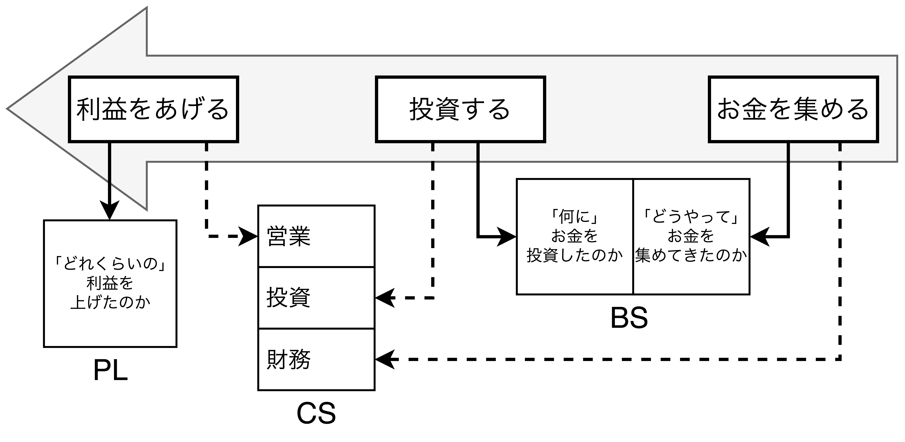

- **財務諸表を作る目的**
  - 【<b>一番の目的</b>】会社外の関係者(金融機関や投資家)に会社の実態を正しく説明するため。
  - 経営陣が会社の実態を数字で把握し、経営を継続するため。
  - 税金を計算するための元のデータになるため。
- どの業種においても基本的に会社の事業活動は3つに分類できる。
  1. 【**お金を集める**】資本金、借入金など
  2. 【**投資する**】工場建設(製造業)、店舗(飲食業)、商材(商社)など
  3. 【**利益を上げる**】販売、派遣、ローンなど

### 【CSの登場】PLとBSの数字は必ずしも「現金の動き」を表すものではない

- 会社は利益の多寡だけで評価できない。「どうやってお金を集め、何に投資し、どれくらい利益を上げたのか」という事業活動を通して作られた財務諸表を見て、判断する。
- 企業の現金創出能力や支払能力、利益の質を評価するために、2000年3月期の決算から日本の上場企業はC/Sの作成・公開が義務付けられた。
- CSは$①お金を集める\rightarrow ②投資する\rightarrow ③利益を上げる$の活動を「現金の動き」という観点から整理したもの。
  - 【**お金を集める**】財務活動によるキャッシュフロー
  - 【**投資する**】投資活動によるキャッシュフロー
  - 【**利益を上げる**】営業活動によるキャッシュフロー

## 損益計算書(PL)で5つの利益を計算する

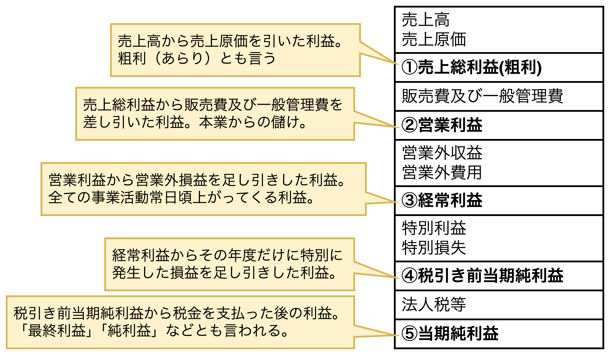

- <b>【PLを作る目的】</b>その期の正しい利益を計算する。
- 財務会計は会社の状況を外部の人に知らせる会計であり、社長の立場で勉強することが望ましい(一番フィット感がある)。
- PLでは売上高を起点として費用を引くことで利益を算出する。利益は上図からわかる通り、費用の説明を以下に示す。
  - 【**売上原価**】仕入れた商品の原価。
  - 【**販売費及び一般管理費**】人件費、交通費、通信費、広告宣伝費、運送費、外注費など。
  - 【**営業外費用**】本業の営業活動以外の費用。<u>支払利息</u>、有価証券売却損など。
  - 【**特別損失**】その事業年度だけ発生する特別な費用。固定資産売却損、固定資産除却損など。
- 会社のお金を使う際、どれだけの売上が必要になるか考える。例えば、3万円の受講料が必要な研修を受けたとする。会社の粗利率(粗利÷売上高×100)が$10\%$だとすると受講料の支払いには$3万円\div 10\%=30万円$の売上が必要になる。つまり、PL(費用と粗利率)から従業員の費用を賄うために必要な売上がわかり、<b>経営者としてのコスト・経営感覚を身につけることができる</b>。

## 貸借対照表(BS)は財産残高一覧表

### BSの目的と構造

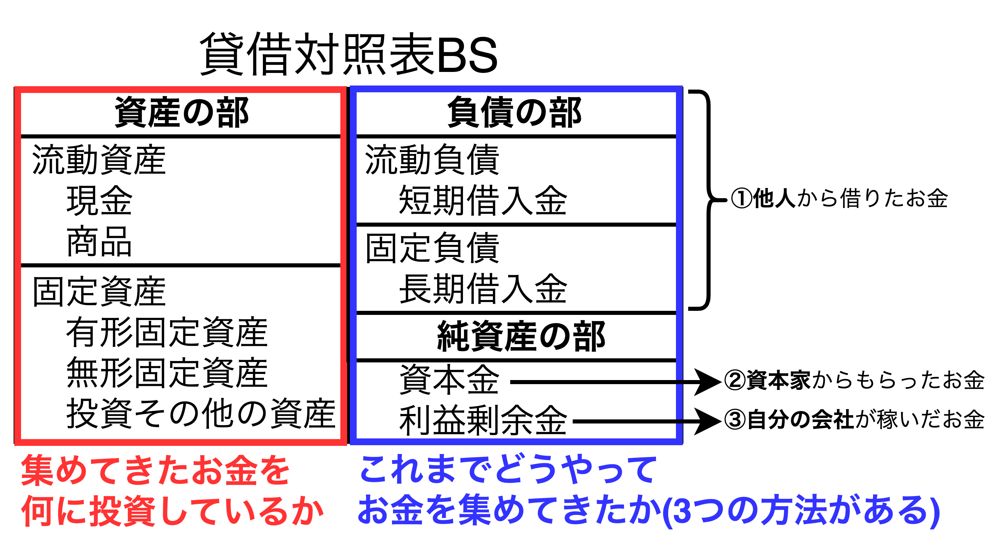

- <b>【BSを作る目的】</b>会社の正味財産(純資産)を計算すること。BSはお金を集め(**負債の部、純資産の部**)、現在どういう形で会社に存在しているか(**資産の部**)を表している。
- 投資されるものには現金や在庫としての商品などの「**流動資産**」、建物や機械装置などの「**有形固定資産**」、ソフトウェアや特許権などの「**無形固定資産**」などがある。
- 会社がお金を集めてくる方法は3つある
  1. 【**負債**】他人から借りる
  2. 【**純資産**】資本家から資本金として入れてもらう
  3. 【**純資産**】自分の会社が稼ぐ(当期純利益が利益剰余金に積み上がる)

####  総資本と総資産

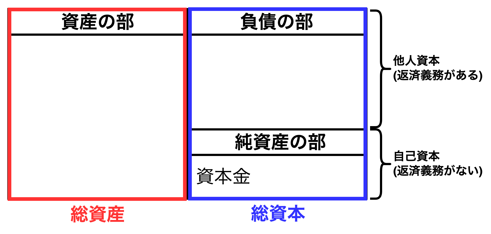

- BSの負債の部は他人資本、純資産の部は自己資本(※)と言われる。
※厳密には、$自己資本=純資産の部の合計-新株予約権と被支配株主持分$
- 総資産と総資本(他人資本+自己資本)の値は一致する。

### BSを図にしてみる

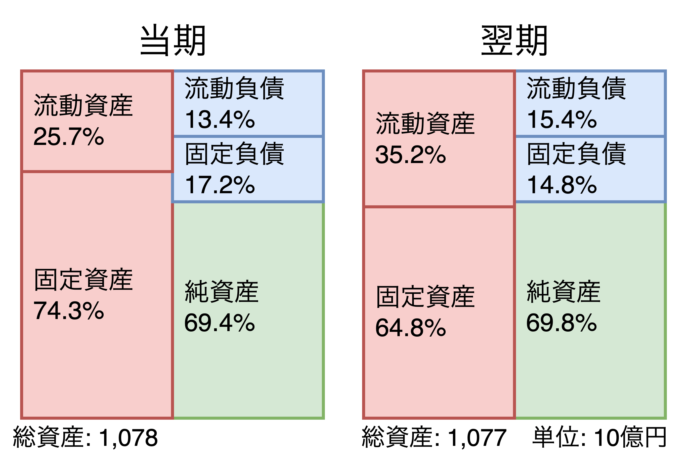

- **支払い能力を測る指標として「$\displaystyle{流動比率=\frac{流動資産}{流動負債}}$」がある**。業界によって目安は異なり、120%が一つの目安とされている。【小売業、飲食業】は100〜150%程度、【製造業】は150〜200%程度、【サービス業(医療・教育など)】120〜180%程度、と言われている。
- **経営の安全性を図る指標として「$\displaystyle{固定比率=\frac{固定資産}{自己資本}}$」がある**。100%以下であれば安全、<u>100%を超えると「支払い能力が低下している」ことを示している</u>。
- **別の経営の安全性を図る指標として「$\displaystyle{固定長期適合率=\frac{流動資産}{自己資本+固定負債}}$」がある**。100%以下であれば安全、<u>100%を超えると「資金繰りに問題がある」ことを示している</u>。

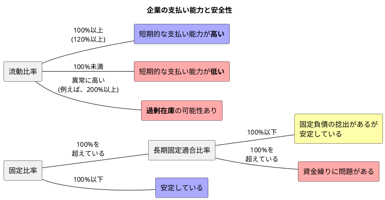

## 複式簿記とは何か

### 単式簿記と複式簿記の違い

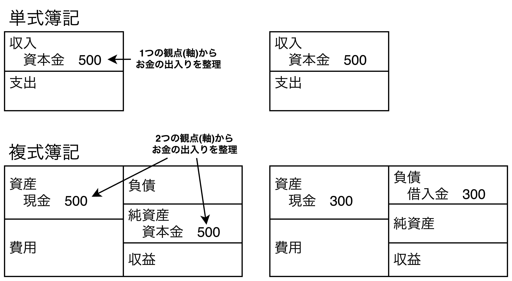

- 全ての会社は複式簿記のルールに従って帳簿に記帳しているが、複式簿記とは別で単式簿記がある。
- 単式簿記は1つの観点(軸)から収入・支出・残高の3つに整理して記帳する方法。
- 複式簿記は2つの観点(軸)から資産・費用・負債・純資産・収益の5つに整理して記帳する方法

### 試算表及びPLとBSの関係

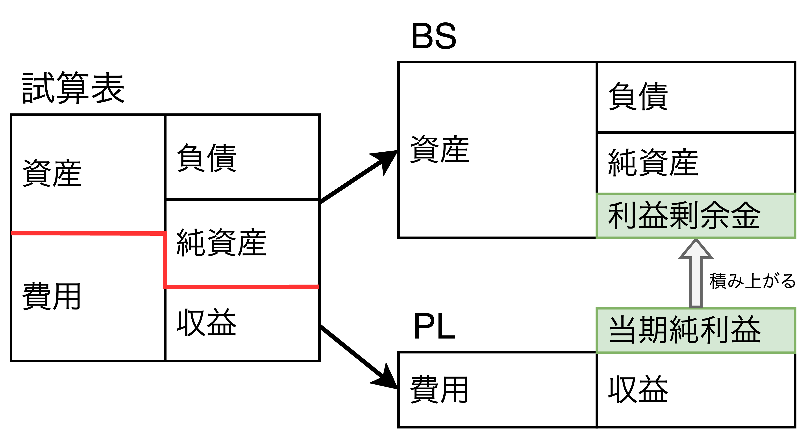

- 全ての伝票を複式簿記で記帳したものを「試算表」と呼び、右側は集めたお金(費用・純資産・収益)を表し、左側は使ったお金(資産・費用)を表す。
- 試算表からPLとBSを作成し、PLの当期純利益が利益剰余金としてBSに積み上がっていく仕組みをとる。

### BSとPLの時系列的なつながり

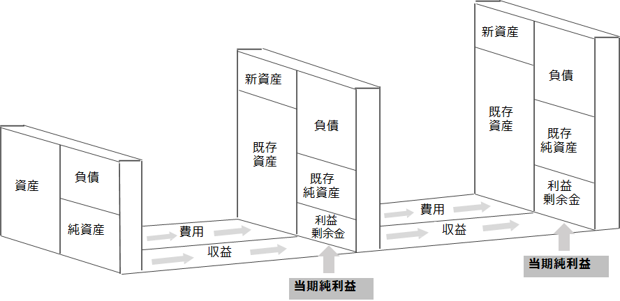

- 上図はP/Lの結果が時間経過とともにB/Sに反映されていくことを表しており、P/Lの当期純利益がB/Sの利益剰余金に積み上がっていく。
- 例えば、当期純利益が全て現金になった場合は複式簿記のルール上、右側の利益剰余金とともに左側に現金(新資産)が増える。

## キャッシュフロー計算書(CS)は会社の家計簿

### CSの構造

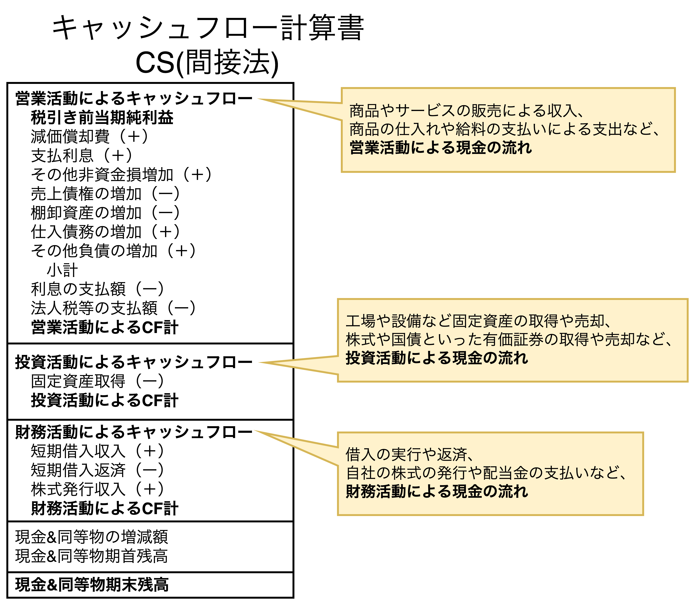

- 【<b>CSを作る目的</b>】1年間の現金の出入りを説明すること。
- キャッシュフロー計算書(CS: Cash Flow Statement)は営業活動・投資活動・財務活動に3つの欄に分かれている。
- 【**CSの大切なこと**】
  1. 営業活動によるキャッシュフローの「小計」は会社の純粋な営業活動によるキャッシュの増減を表している。<u>「小計より下の項目」は営業・投資・財務のどこの欄に分類したら良いかわからない項目をまとめている</u>。
  2. CSは間接法によって作成され、PLとBSの数字を使って間接的に現金の動きを計算する。間接法では、現金の動きとは関係なく上がったり下がったりする「<b>税引き前当期純利益を起点</b>」にすることで実際の現金の動きを計算する方法。
