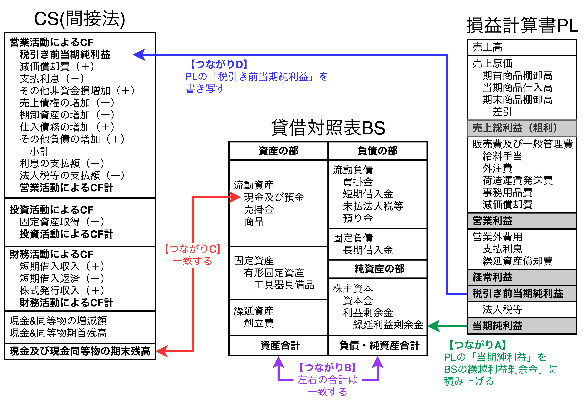
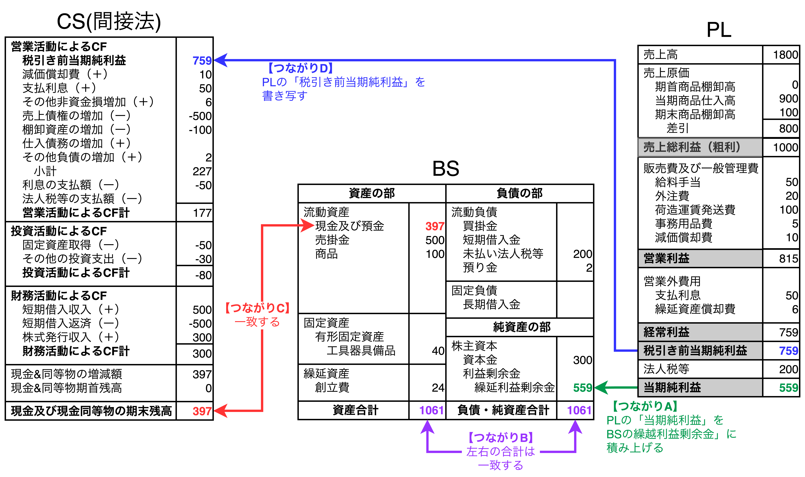
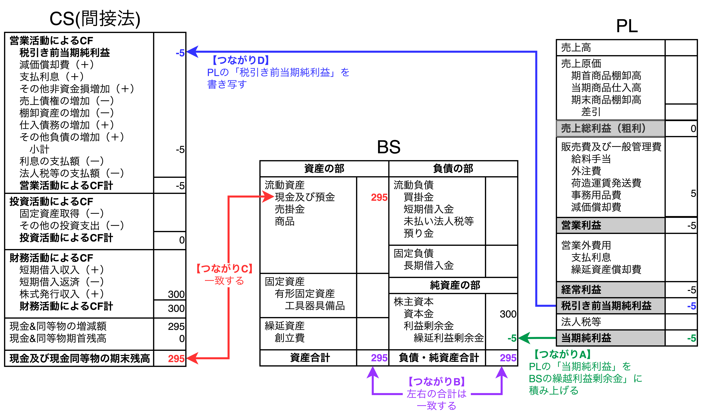
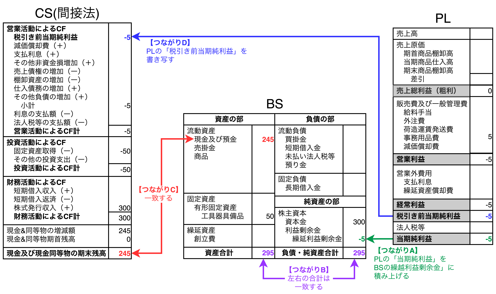
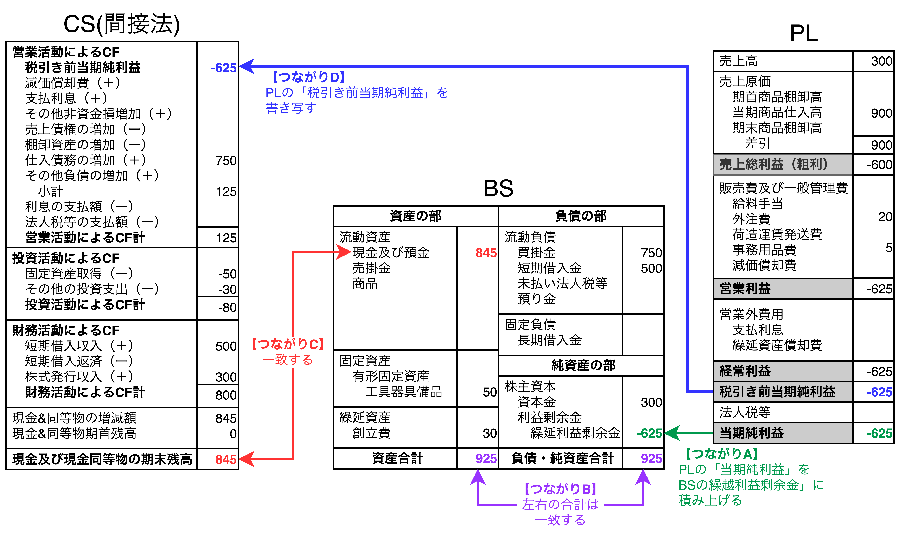
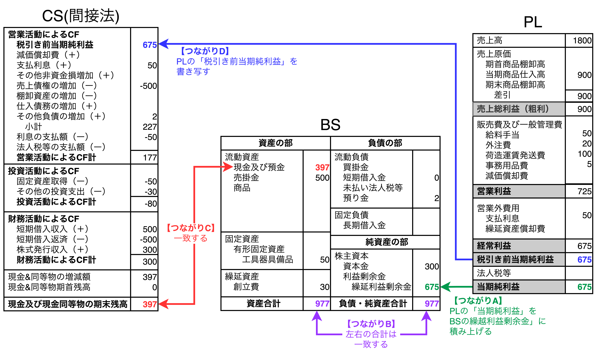
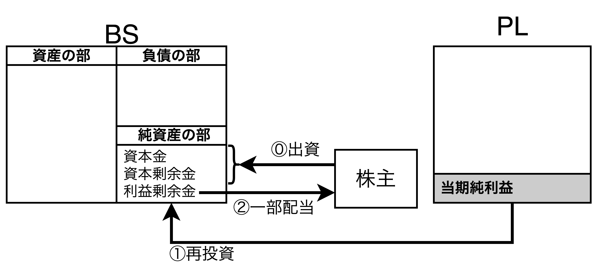
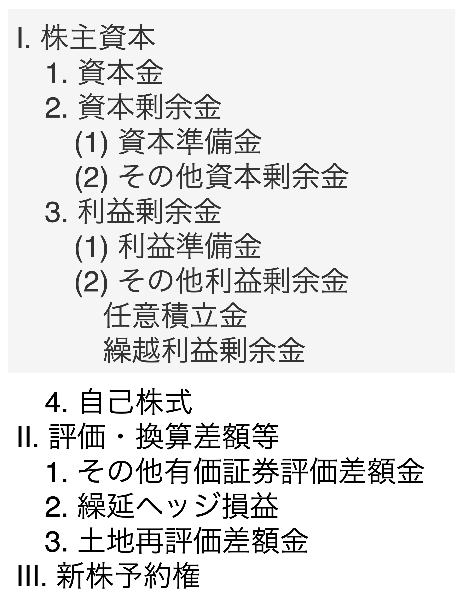
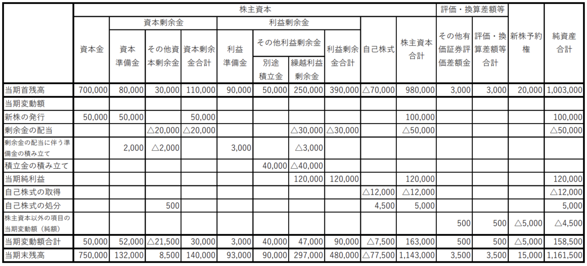
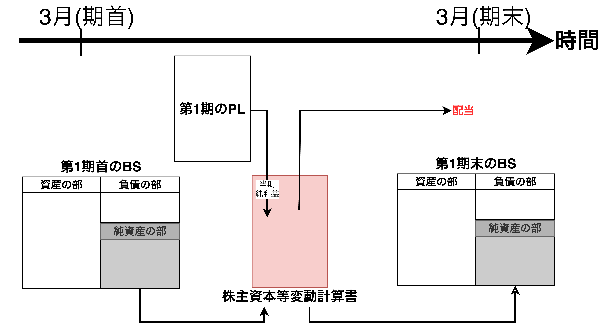

# 財務3表一体理解法〜基礎編

## 財務3表のつながりを理解する

### 財務3表の4つのつながり

- 【<b>つながりA</b>】PLの「当期純利益」はBSの純資産の部の「繰越利益剰余金」に積み上がる。
- 【<b>つながりB</b>】総資産(資産の部の合計)と総資本(負債の部と純資産の部の合計)は一致する。
- 【<b>つながりC</b>】BSの資産の部の「現金」とCSの一番下の「現金の残高」は一致する。
- 【<b>つながりD</b>】PLの「税引き前当期純利益」はCSの一番上(起点)の「税引き前当期純利益」にそのまま書き写す。

### 一つ一つの取引ごとに財務3表を見る手法

- 会社設立当初は信用がないため、商品を「<b>現金で仕入れ、現金で販売する</b>」形になる。実績を積み上げることで商品を「<b>買い掛けで仕入れ、売掛で販売する</b>」形もできるようになる。こうして利益を上げられるようになると社員に給料を支払ったり、借りていたお金を返したりして次に備える。
- 上図は財務3表のつながりの具体例であり、以下の順番で見る。
  1. それぞれの取引が**PLに影響を与えるかどうかを見る**。PLに影響を与える取引だと数字が変化する。
  2. PLの「当期純利益」がBSの「繰越利益剰余金」と繋がっていることを確認する(**つながりA**)。
  3. BSの左側の合計(総資産)と右側の合計(総資本)は常に一致する(**つながりB**)。それぞれの取引でBSのそれぞれの項目の数字の変化があっても左右が一致していることを確認する。
  4. BSの「現金」とCSの一番下の「現金&同等物期末残高」が一致していることを確認する(**つながりC**)。
  5. PLの「税引き前当期純利益」とCSの一番上の「税引き前当期純利益」が一致していることを確認する(**つながりD**)

## 一つひとつの取引が財務3表にどう反映されるかを理解する

- 【**注意**】
  - 会計の定義では、CSの「現金及び現金同等物の期末残高」には現金及び**3ヶ月以内の定期預金等が含まれ**、BSの「現金及び預金」には**1年以内の定期預金が含まれる**ため、<u>完全には一致せず、多少違いがある場合がある</u>。
- 【**学習のポイント**】
  - 1章で紹介した「お金を集める」「投資する」「利益をあげる」の3つのうちのどの事業活動に該当するのか考えることで、影響する財務諸表がわかり、お金の流れの解像度が上がる。

### 1 資本金300万円で会社を設立する

- **資本金で会社を設立することは「お金を集める」という活動にあたる**。
- 資本金は会社口座に振り込まれたお金であり、<u>BSの純資産の部の「資本金」に300万円を計上する</u>。今回はPLの変更(**つながりAとDの変更**)がなく、BSの資産の部の「現金及び預金」が0→300万円増加し、BSの総資産と総資本の合計が一致する(**つながりB**)。次に、財務CFの「株式発行収入」に300を計上し、CSの「現金及び現金同等物の期末残高」が300万円になる(**つながりC**)。

### 2 事務用品を現金5万円で購入

- **事務用品を現金で購入することは「投資する」という活動にあたる**。
- 事務用品は営業活動に必要な経費であり、<u>PLの販管費の「事務用品費」に5万円を計上する</u>。これによりPLの4つの利益が「-5万円」になり、BSの純資産の部の「繰越利益剰余金」が-5万円になる(**つながりA**)。また、現金が5万円減ったことでBSの資産の部の「現金及び預金」が300→295万円になり、BSの総資産と総資本の合計が一致する(**つながりB**)。そして、PLの「税引き前当期純利益(-5万円)」をCSの一番上に書き写し、CSの一番下の現金残高が300→295に減ることで、BSの資産の部の「現金及び預金」と一致する(**つながりC・D**)。
【**補足**】ここで、資産の部に「事務用品」を計上することも考えられるが、一般的に、1年間で使い切るようなもの(会計では「重要性に乏しい」と言う)はBSには計上せず、すべてPLに計上する処理が多い。
- 【**重要**】間接法CSはPLの「税引き前当期純利益」を起点としており、<u>営業CFの欄は現金の動きがないのに税引き前当期純利益が変わる場合に現金の動きを逆算するための欄になっている</u>。具体的には、**買掛金や売掛金などの現金の動きのない取引のところで営業CFは動く**。

### 3 パソコンを現金50万円で購入

- **パソコンを現金で購入することは「投資する」という活動にあたる**。
- パソコンは長期にわたって使用する(減価償却により分割して費用計上する)ため、<u>BSの固定資産の「工具器具備品」に50万円を計上する</u>。今回はPLの変更(**つながりAとDの変更**)がなく、BSの資産の部の「現金及び預金」が295→245万円に減り、固定資産の「工具器具備品」に減った分の50万円計上する(**つながりB**)。次に、投資CFの「固定資産取得」に-50を計上し、CSの「現金及び現金同等物の期末残高」が295→245万円に減る(**つながりC**)。
- 【**重要**】BSにはマイナスの計上は殆どなく、<u>マイナスは「現金の動き」を表すCSに計上</u>する。

### 4 ホームページ作成を発注し、外注費20万円を現金で支払う

- **ホームページ(HP)作成を外注することは「投資する」という活動にあたる**。
- HPは1年の中で頻繁に改定するため、<u>PLの販管費の「外注費」に20万円を計上する</u>(考え方は2の5万円で事務用品を買った時と同じ)。これにより、PLの4つの利益が「-25万円」になり、BSの純資産の部の「繰越利益剰余金」が-25万円になる(**つながりA**)。また、現金が20万円減ったことでBSの資産の部の「現金及び預金」が245→225万円になり、BSの総資産と総資産が一致する(**つながりB**)。そして、PLの「税引き前当期純利益(-25万円)」をCSの一番上に書き写し、CSの一番下の現金残高が245→225万円に減ることで、BSの資産の部の「現金及び預金」と一致する(**つながりC・D**)。
- もし、HPを1年以上使う予定であれば会社の資産としてBSの資産の部の「無形固定資産」に計上する方法もある。

### 5 創立費30万円を「資産」に計上する

- **創立費を資産計上することは「投資する」という活動にあたる**。
- 創立費は初年度だけに影響する費用ではないため、<u>BSの繰延資産の「創立費」に300万円を計上する</u>(考え方は3の50万円でパソコンを買った時と同じ)。今回はPLの変更(**つながりAとDの変更**)がなく、BSの資産の部の「現金及び預金」が225→195万円に減り、繰延資産の「創立費」に減った分の30万円計上する(**つながりB**)。次に、投資CFの「その他の投資支出」に-30を計上し、CSの「現金及び現金同等物の期末残高」が225→195万円に減る(**つながりC**)。
- 【**補足**】創立費は形がないため、パソコンのように「資産」として計上することに違和感があるかもしれないが、「そうするように決まっている」と考えるしかない。
- 【**補足**】繰延資産は**創立費**の他に以下のような勘定科目がある。<u>創立費を含めて以下の5科目は将来にわたって出てくるものであるため覚えておく</u>。
  - 【**開業費**】会社設立後営業開始までに支出した開業準備のための費用
  - 【**開発費**】新技術の開発や新市場の開拓などのための費用
  - 【**株式交付費、社債発行費**】会社の社債発行や株式交付などに伴って発生する費用

### 6 販売する商品を現金150万円で仕入れる

- **販売する商品を現金で仕入れることは「投資する」という活動にあたる**。
- 販売する商品を仕入れるため、<u>PLの売上原価の「当期商品仕入高」に150万円を計上する</u>(考え方は2と4と同じ)。これにより、PLの当期商品仕入高に150を計上し、売上総利益が-150万円になったあと、残り4つの利益が「-175万円」になり、BSの純資産の部の「繰越利益剰余金」が-175万円になる(**つながりA**)。また、現金が150万円減ったことでBSの資産の部の「現金及び預金」が195→45万円になり、BSの総資産と総資産が一致する(**つながりB**)。そして、PLの「税引き前当期純利益(-175万円)」をCSの一番上に書き写し、CSの一番下の現金残高が195→45万円に減ることで、BSの資産の部の「現金及び預金」と一致する(**つながりC・D**)。
- 【**補足**】商品を在庫とする考え方は次の6-2で考える。

### 6-2 商品をまず在庫として150万円計上する方法

- **在庫商品を現金で仕入れることは「投資する」という活動にあたる**。
- 商品在庫として資産計上するため、<u>BSの固定資産の「商品」に計上する</u>。今回はPLの変更(**つながりAとDの変更**)がなく、BSの資産の部の「現金及び預金」が195→45万円に減り、同じ資産の部の「商品」に減った分の150万円計上する(**つながりB**)。次に、営業CFの「棚卸資産の増加」に-150を計上し、CSの「現金及び現金同等物の期末残高」が195→45万円に減る(**つながりC**)。

### 7 商品が現金300万円で売れる

- **商品を現金で販売することは「利益を上げる」という活動にあたる**。
- 商品が売れたため、<u>PLの「売上高」に300万円を計上する</u>。これにより、PLの「売上総利益」が150万円、残りの4つの利益が125万円になり、BSの純資産の部の「繰越利益剰余金」が125万円になる(**つながりA**)。また、売上として現金が300万円増えたことでBSの資産の部の「現金及び預金」が45→345万円になり、BSの総資産と総資産が一致する(**つながりB**)。そして、PLの「税引き前当期純利益(125万円)」をCSの一番上に書き写し、CSの一番下の現金残高が45→345万円に減ることで、BSの資産の部の「現金及び預金」と一致する(**つながりC・D**)。

### 8 ビジネス拡大へ運転資金500万円を借りる

- **運転資金を借りることは「お金を集める」という活動にあたる**。
- 運転資金は短期借入金であり、<u>BSの負債の部の「短期借入金」に500万円を計上する</u>(考え方は1と同じ)。今回はPLの変更(**つながりAとDの変更**)がなく、BSの資産の部の「現金及び預金」が345→845万円に増え、BSの総資産と総資本の合計が一致する(**つながりB**)。次に、財務CFの「短期借入金」に500を計上し、CSの「現金及び現金同等物の期末残高」が845万円になる(**つながりC**)。
- 【**補足**】営業活動に必要な運転資金の借入は短期借入金が一般的。
- 【**補足**】運転資金500万円は金融機関への借金であり、「連帯保証人」が必要になる。連帯保証人は抗弁権(「まず債務者本人に請求してほしい」と抗弁する権利)がない。つまり、自分で借入したことと同等の責任を負うことになる。そのため、**連帯保証人は相当の責任を負うことであり、十二分の理解が必要になる**。
s

### 9 商品750万円分を「買掛」で仕入れる ※ここから難しくなる

- <b>【注意】</b>ここから売掛や買掛などの現金の動きの伴わない取引が始まるため、難しくなる。
- **販売する商品を買掛で仕入れることは「投資する」という活動にあたる**。
- 販売する商品を買掛で仕入れるため、<u>PLの売上原価の「当期商品仕入高」に750万円を計上する</u>(考え方は2と4と6と同じ)。これにより、PLの当期商品仕入高に750を計上し、売上総利益が-600万円になったあと、残り4つの利益が「-625万円」になり、BSの純資産の部の「繰越利益剰余金」が-625万円になる(**つながりA**)。また、BSの負債の部の「買掛金」に750万円が計上され、BSの総資本が925万円となり、総資産が一致する(**つながりB**)。そして、PLの「税引き前当期純利益(-625万円)」をCSの一番上に書き写し、営業CFの「仕入債務の増加」に750万円を計上することでCSの「現金及び現金同等物の期末残高」がBSの資産の部の「現金及び預金」と一致する(**つながりC・D**)。
- 【**補足**】商品を在庫とする場合は6-2と同じ手順で計上する。
- 【**補足**】営業CFの仕入債務には「買掛金」や「支払手形」が該当する。

### 10 「売掛」で1500万円を販売

- **商品を売掛で販売することは「利益を上げる」という活動にあたる**。
- 商品が売れたため、<u>PLの「売上高」に1500万円を計上する</u>。これにより、PLの「売上総利益」が900万円、残りの4つの利益が875万円になり、BSの純資産の部の「繰越利益剰余金」が875万円になる(**つながりA**)。また、売上として売掛金が1500万円増えたことでBSの資産の部の「売掛金」が0→1500万円になり、BSの総資産と総資産が一致する(**つながりB**)。そして、PLの「税引き前当期純利益(875万円)」をCSの一番上に書き写し、営業CFの「売上債権の増加」に-1500を計上することでCSの「現金及び現金同等物の期末残高」がBSの資産の部の「現金及び預金」と一致する(**つながりC・D**)。
- 【**補足**】売掛金は債権であり、「将来支払いを受ける権利」である。
- 【**補足**】営業CFの売上債権には「売掛金」や「受取手形」が該当する。

### 11 買掛金750万円を支払う(「勘定あって銭足らず」に)

- **買掛金を返すことは「投資する」という活動にあたる**。
- 買掛金を返すため、<u>BSの負債の部の「買掛金」を750→0万円に減らす</u>。今回はPLの変更(**つながりAとDの変更**)がなく、BSの資産の部の「現金及び預金」が845→95万円に減り、総資産と総資本が一致する(**つながりB**)。次に、営業CFの「仕入債務の増加」が0になり、CSの「現金及び現金同等物の期末残高」が845→95万円に減ることで、BSの資産の部の「現金及び預金」と一致する(**つながりC**)。
- 【**補足**】税引き前当期純利益が875万円で期を迎えた時、税金はおそらく300万円程度徴収されることになるが、現金残高が95万円しかない。このため、「勘定あって銭足らず」の状態になる。
- 【**補足**】BSの負債の部の「買掛金」と営業CFの「仕入債務の増加」は連動する。
- 【**PLの利益が現金の額を表していない理由**】
  1. PLはその期の正しい営業活動を説明するために「売掛」や「買掛」の商売のように現金の動きのない売上高や仕入高が計上されるため。 ← 現金化されていない
  2. PLにはお金を集める動き(借入金や資本金など)や、投資の動き(パソコンや備品など)が一切表れないため。 ← PLではなくBSに表れる

### 12 売掛金1500万円のうち1000万円を回収する

- **売掛金を回収することは「お金を集める」という活動にあたる**。
- 売掛金の現金化になるため、<u>BSの資産の部の「売掛金」を1500→500万円に減らす</u>。今回はPLの変更(**つながりAとDの変更**)がなく、BSの資産の部の「現金及び預金」が95→1095万円に増え、資産の部の中でお金が移動する(**つながりB**)。次に、営業CFの「売上債権の増加」が1500→500に減り、CSの「現金及び現金同等物の期末残高」が95→1095万円に増えることで、BSの資産の部の「現金及び預金」と一致する(**つながりC**)。
- 【**補足**】BSの資産の部の「売掛金」と営業CFの「売上債権の増加」は連動する。

### 13 給料50万円を支払う(うち源泉所得税2万円は会社が一時預かる)

- **給料を支払うことは「投資する」という活動にあたる**。
- 給料は費用になるため、<u>PLの販管費の「給料手当」に50万円を計上する</u>(考え方は2と4と同じ)。これによりPLの4つの利益が875→825万円に減り、BSの純資産の部の「繰越利益剰余金」が825万円になる(**つながりA**)。ここで、給料50万円のうち2万円は所得税のための預かり金と会社で取得している。なので、BSの負債の部の「預り金」に2万円を計上し、資産の部の「現金及び預金」が1095→1047万円に減ることで、BSの総資産と総資本の合計が一致する(**つながりB**)。そして、PLの「税引き前当期純利益(825万円)」をCSの一番上に書き写し、CSの一番下の現金残高が1095→1047に減ることで、BSの資産の部の「現金及び預金」と一致する(**つながりC・D**)。
- 【**補足**】源泉所得税は「将来支払わなければならない義務」として流動負債の中の「預り金」に計上する。

### 14 商品の発送費用100万円を現金で一括支払い

- **発送費を支払うことは「投資する」という活動にあたる**。
- 給料は費用になるため、<u>PLの販管費の「荷造運賃発送費」に100万円を計上する</u>(考え方は13と同じ)。これによりPLの4つの利益が825→725万円に減り、BSの純資産の部の「繰越利益剰余金」が725万円になる(**つながりA**)。ここで、BSの資産の部の「現金及び預金」が1047→947万円に減り、BSの総資産と総資本の合計が一致する(**つながりB**)。そして、PLの「税引き前当期純利益(725万円)」をCSの一番上に書き写し、CSの一番下の現金残高が1047→947に減ることで、BSの資産の部の「現金及び預金」と一致する(**つながりC・D**)。
- 【**補足**】<u>商品の発送は通関の手続きも含めて発送作業を全て運送会社に委託</u>し、100万円の費用があるものとしている。

### 15 短期借入金500万円を返済し、利息50万円を支払う

- **短期借入金(8の運転資金)を返すことは「投資する」という活動にあたる**。
- 短期借入金を返すため、<u>BSの負債の部の「短期借入金」を500→0万円に減らし、PLの営業外費用の「支払利息」に50万円を計上する</u>。これによりPLの3つの利益が725→675万円に減り、BSの純資産の部の「繰越利益剰余金」が675万円になる(**つながりA**)。ここで、BSの資産の部の「現金及び預金」が947→397万円に減り、BSの総資産と総資本の合計が一致する(**つながりB**)。次にPLの「税引き前当期純利益(397万円)」をCSの一番上に書き写し、営業CFの「支払利息」に50、「利息の支払額」に-50を計上する。そして、財務CFに「短期借入収入」を500→0に減らすことでCSの一番下の現金残高が947→397に減り、BSの資産の部の「現金及び預金」と一致する(**つながりC・D**)。
- 【**補足**】会計では「利息は借入することで毎期発生する費用」と言え、<u>営業外費用の「支払利息」で費用計上する</u>。
- 【**補足**】借入金の実際の支払額は営業CFの小計の下にある「利息の支払額」に表れる。一方、<b>PL「支払利息」(=営業CF「支払利息」)は当該期間中に支払うべき理論額(費用)</b>を記載しており、期中の支払いがない場合は、PL「支払利息」と営業CF「利息の支払額」が一致しない。

### 16 棚卸により在庫100万円を認識する ※ここから期末の決算整理

- **棚卸しによる在庫確認は「投資する」という活動にあたる**。
- 棚卸は期末の商品残高の確認になるため、<u>PLの売上原価の「期末商品棚卸高」に100万円を計上する</u>。これによりPLの売上原価が900→800万円に減り、利益が100万円増えることで、BSの純資産の部の「繰越利益剰余金」が675→775万円になる(**つながりA**)。次に、BSの資産の部の「商品」に100万円計上し、BSの総資産と総資本の合計が一致する(**つながりB**)。そして、PLの「税引き前当期純利益(775万円)」をCSの一番上に書き写し、営業CFの「棚卸資産の増加」に-100(在庫認識した商品100万円分)を計上することで、CSの一番下の現金残高がBSの資産の部の「現金及び預金」と一致する(**つながりC・D**)。
- 【**補足**】<u>流通業では決算整理の時に「棚卸」をして在庫確認(残った商品の確認)を行い、その期の正味の売上原価を計算する</u>。つまり、今期の売上原価は以下の計算式で算出される。

$$
\begin{align*}
売上原価&=期首商品棚卸高-当期商品仕入高+期末商品棚卸高\\
&=0-900+100=-800
\end{align*}
$$

### 17 「減価償却費10万円」と「繰延資産償却費6万円」を計上する

- **パソコンの減価償却と創立費の繰延資産償却は「投資する」という活動にあたる**。
- <u>PLの販管費の「減価償却費」に10万円、営業外費用の「繰延資産償却費」に6万円を計上する</u>。これによりPLの「税引き前当期純利益」と「当期純利益」が775→759万円に減り、BSの純資産の部の「繰越利益剰余金」が1075→1061万円になる(**つながりA**)。次に、BSの資産の部の「工具器具備品」が50→40万円に減り、「創立費」が30→24万円に減ることで、BSの総資産と総資本の合計が一致する(**つながりB**)。そして、PLの「税引き前当期純利益(759万円)」をCSの一番上に書き写し、営業CFの「減価償却費」に10、「その他非資金損増加」に6を計上することで、CSの一番下の現金残高がBSの資産の部の「現金及び預金」と一致する(**つながりC・D**)。
- 【**補足**】財務省よりパソコンの法定耐用年数は4年と決められており、創立費は5年以内に償却しなけばならない。耐用年数がある理由は税法の目的が「公平に税金を取るため」だからである。会社によって法定年数が変わると税法の目的を満たせないために財務省令にて決められている。
- 【**補足**】繰延資産は創立費、開業費、開発費、社債発行費、株式交付費の5つあるがそれぞれ費用計上する科目が異なる。
  - 【**創立費の費用計上先**】営業外費用
  - 【**開業費の費用計上先**】販売費及び一般管理費(販管費)もしくは営業外費用
  - 【**開発費の費用計上先**】売上原価もしくは販売費及び一般管理費(販管費)
  - 【**社債発行費の費用計上先**】営業外費用
  - 【**株式交付費の費用計上先**】営業外費用

### 18 法人税200万円を計上する

- **法人税の計上は「投資する」という活動にあたる**。
- 法人税は<u>PLの「法人税等」に200万円計上する</u>。これによりPLの「当期純利益」が759→559万円に減り、BSの純資産の部の「繰延利益剰余金」が559万円になる(**つながりA**)。次に、BSの負債の部の「未払い法人税等」に200万円を計上することで、BSの総資産と総資本の合計が一致する(**つながりB**)。今回、現金と税引き前当期純利益の動きがないため、CSの変更は一切ない(**つながりC・D**)。
- 【**補足**】法人税の支払いは決算日の翌日から数えて「2ヶ月以内」に行う。つまり、<u>その期の法人税の支払いは次の期に入ってから行われるため、当期のBSには流動負債の「未払い法人税等」に計上している</u>。
- 【**補足**】次の期に入り、法人税を支払うとどうなるか説明する。BSの流動資産の「現金及び預金」から法人税を支払い、流動負債の「未払い法人税等」を0にする。その後、営業CFの「法人税等の支払額」に支払い金額を計上し、CSの更新も行う。

## 配当の仕組みと「株式資本等変動計算書」を理解する

### 利益と配当とBS(純資産の部)の関係

- 配当の仕組みを理解することで複式簿記会計が資本主義社会においていかに重要な役割を果たしているかを理解できる。**本節では、資本主義社会の論理に則って説明していく**。
- 「会社は株主のものである」は基本的な資本主義社会の考え方であり、株主は自分のお金を増やすために出資する。
- 「PLの当期純利益」と「配当」と「BSの純資産の部」の3ヶ所は密接に関係しており、以降、株式資本等変動計算書と関係する。

#### BSの「純資産の部」の構造

- 上図は純資産の部の表記例であり、ここではグレー部分の説明を行う。各項目の説明は以下の通り
  - 【**1. 資本金**】株主から資本金として注入されたお金。
  - 【**2-(1). 資本準備金**】株主からの払込資本のうち、様々な理由から資本金として計上せずに積み立てておくお金。<u>出資金の合計額のうち、2分の1（50%）を超えない金額まで資本準備金として計上できる</u>。
  - 【**2-(2). その他資本剰余金**】資本金や資本準備金を取り崩したときの減少差額などが入る科目
  - 【**3-(1). 利益準備金**】「資本準備金と利益準備金の合計」が「資本金の4分の1」に達するまでは、配当金の10分の1（10%）は積み立てる必要がある科目。
  - 【**3-(2). その他利益剰余金**】「任意積立金」は会社独自で内部に積み立てるお金であり、「繰越利益剰余金」はPLの当期純利益が積み上がったお金。

### 「株主資本等変動計算書」とは何か

- <b>株式資本等変動計算書</b>は「BSの純資産の部の項目が当期首残高から当期末残高へどのような理由でどれだけ変化したか」を表した財務諸表である。
- 株式資本等変動計算書は「**当期首残高**」「**当期変動額**」「**当期末残高**」の3つから金額を計算する。

### 株主資本等変動計算書がPLとBSをつないでいる

