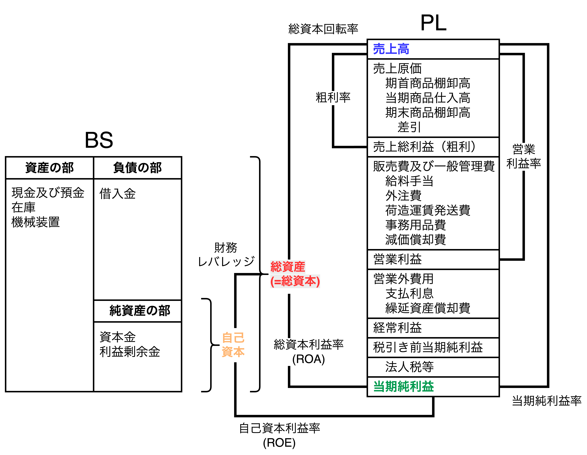
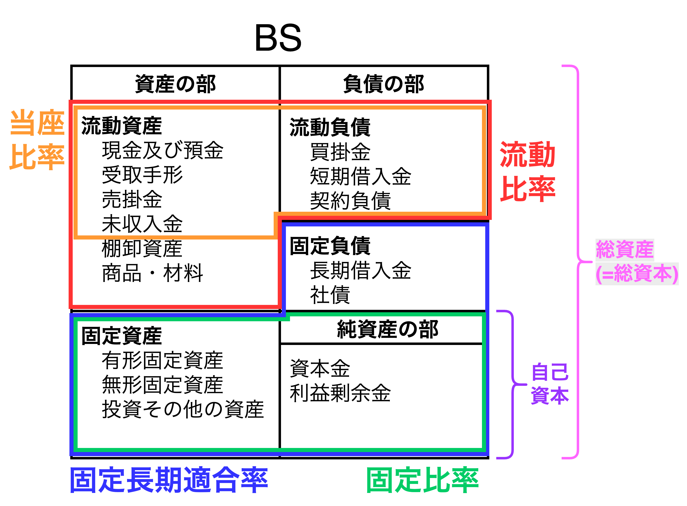

# 【補足】財務分析指標

## 収益性指標

| 指標               | 計算式                             | 目安                                                |
| ---------------- | ------------------------------ | ------------------------------------------------- |
| **売上高総利益率（粗利率）** | $\frac{売上総利益}{売上高}$ | **商品力や原価管理力を示す**。製造業は20～30％、小売業は10～20％、ソフトウェアなどは50％以上も。 |
| **営業利益率**        | $\frac{営業利益}{売上高}$ | **本業で稼ぐ力**。製造業で5％前後が平均、10％を超えると優秀。|
| **当期純利益率** | $\frac{当期純利益}{売上高}$ | **売上から生まれた利益の度合い**。業界によって異なる。 |
| **財務レバレッジ** | $\frac{総資本(総資産)}{自己資本}$ | 良し悪しではなく、**経営の方向性を示す指標**。高ければ積極的、低ければ安定的。 |
| **総資本回転率** | $\frac{売上高}{総資本}$ | **資本から売上を作った度合い**。業界によって大きく異なる。 |
| **ROA（総資産利益率）**  | $\frac{営業利益}{売上高}$   | **経営の効率性**。5％以上で良好、10％以上で優秀。                                 |
| **ROE（自己資本利益率）** | $\frac{当期純利益}{自己資本}$    | 自己資本をどれだけ効率的に増やせたか。**株主から見た利率**。8〜10％で普通、10〜15％で優秀。欧米企業は15％以上が多い。 |

## 安全性指標

| 指標         | 説明                               | 目安                                      |
| ---------- | -------------------------------- | --------------------------------------- |
| **流動比率**   |  $\frac{流動資産}{流動負債}$     | 1年以内に現金化できる流動資産で短期負債を賄えるか。100％以上で安全、200％以上で理想。                    |
| **当座比率**   | $\frac{当座資産}{流動負債}$ | 棚卸資産を除いた「すぐに現金化できる資産」で短期負債を賄えるか。80％以上で良好。|
| **固定比率**   |      $\frac{固定資産}{自己資本}$       | 自己資本で固定資産をどの程度賄えているか。100％以下が望ましい。   |
| **固定長期適合率**   |      $\frac{固定資産}{自己資本+固定負債}$         | 自己資本で固定資産をどの程度賄えているか。100％以下が望ましい。<u>固定比率と合わせて確認する</u>。   |
| **自己資本比率** |     $\frac{自己資本}{総資本}$    | 総資産に占める自己資本の割合。財務の安定性を示す。30％以上で健全、50％以上で安定。金融機関は10％でも健全とされる場合あり。 |

## 成長性

| 指標         | 説明                      | 目安                       |
| ---------- | ----------------------- | ------------------------ |
| **売上高成長率** | 前年に比べて売上がどれだけ伸びたか。      | 日本全体の平均は年数％、成長企業は10％以上。  |
| **利益成長率**  | 前年に比べて利益がどれだけ伸びたか。      | 売上成長よりも高ければ効率改善できている証拠。  |
| **EPS成長率** | 1株当たり利益の成長。株主にとってのリターン。 | 成長企業は年10％以上を目標にされることが多い。 |
