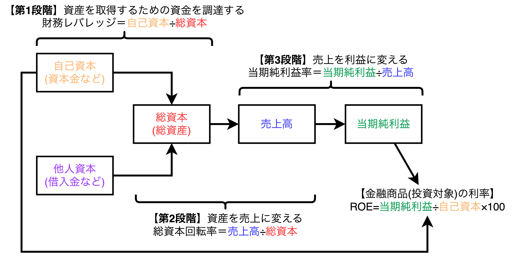
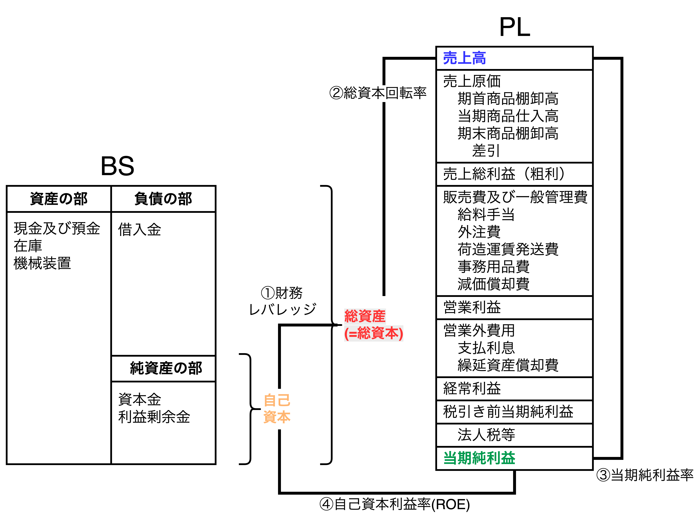

# 財務分析の考え方を知ろう

## 会社にとって大切な4つの数字

- 社長の大切な仕事の一つは事業全体のプロセスを効率よく運営することであり、株主から見て効率よく運営されているかどうかを評価する財務分析指標として自己資本利益率$ROE(Return\hspace{1mm}on\hspace{1mm}Equity)$がある。Returnは当期純利益、Equityは自己資本を表す。
- 財務諸表からざっくり会社の状況を把握するには以下の4つの指標を見る。

$$
\begin{align*}
①財務レバレッジ&=\frac{\color{red}総資本}{\color{orange}自己資本}\\[3mm]
②総資本回転率&=\frac{\color{blue}売上高}{\color{red}総資本}\\[3mm]
③当期純利益率&=\frac{\color{green}当期純利益}{\color{blue}売上高}\\[3mm]
④自己資本利益率&=\frac{\color{green}当期純利益}{\color{orange}自己資本}
\end{align*}
$$

## デュポン・モデル

- 自己資本利益率(ROE)、当期純利益率、総資産回転率はいずれも高ければ高いほど良いが、財務レバレッジは異なる。<b>財務レバレッジは事業経営の姿勢や方向性を表している指標</b>であり、<u>**良し悪しを判断する指標ではない**</u>。
- 財務レバレッジが高いと「意欲的に事業展開しているが高いリスクをとっている」と解釈でき、レバレッジが低いと「安定的な事業で挑戦的ではない事業運営をしている」と解釈できる。

$$
\begin{align*}
自己資本利益率&=\frac{\color{green}当期純利益}{\color{orange}自己資本}\\[3mm]
&=\frac{\color{green}当期純利益}{\color{blue}売上高}\times\frac{\color{blue}売上高}{\color{red}総資本}\times\frac{\color{red}総資本}{\color{orange}自己資本}\\[3mm]
&=当期純利益率\times 総資本回転率\times 財務レバレッジ
\end{align*}
$$

## キャッシュフロー分析

<table>
	<tbody>
		<tr>
			<th>パターン</th>
			<th>営業CF</th>
			<th>投資CF</th>
			<th>財務CF</th>
			<th>推測例</th>
		</tr>
		<tr>
			<td>①</td>
			<td>＋</td>
			<td>＋</td>
			<td>＋</td>
			<td>営業活動で現金を生み出している。資産売却で 現金を取得している。借入などで現金を 増やしている。<b>将来の大きな投資のために お金を集めているのだろうか。</td>
		</tr>
		<tr>
			<td>②</td>
			<td>＋</td>
			<td>＋</td>
			<td>ー</td>
			<td>営業活動で現金を生み出している。資産売却で 現金を取得している。借入の返済をしている。 <b>財務体質を改善しようとしている会社だろうか。</td>
		</tr>
		<tr>
			<td>③</td>
			<td>＋</td>
			<td>ー</td>
			<td>＋</td>
			<td>営業活動で現金を生み出している。積極的に 投資活動をしている。借入などで現金を増やし ている。<b>将来の戦略も明確な積極拡大型のパターン</td>
		</tr>
		<tr>
			<td>④</td>
			<td>＋</td>
			<td>ー</td>
			<td>ー</td>
			<td>営業活動で現金を生み出している。積極的に 投資活動をしている.
            借入の返済をしている。 <b>潤沢な営業CFがある会社だろう。</td>
		</tr>
		<tr>
			<td>⑤</td>
			<td>ー</td>
			<td>＋</td>
			<td>＋</td>
			<td>営業活動でマイナスが出ている。資産売却で 現金を取得している。借入などで現金を 増やしている。<b>問題会社の一般的なパターン</td>
		</tr>
		<tr>
			<td>⑥</td>
			<td>ー</td>
			<td>＋</td>
			<td>ー</td>
			<td>営業活動でマイナスが出ている。資産売却で 現金を取得している。借入の返済をしている。 <b>非常に多くの資産を持った会社なのかもしれない。</td>
		</tr>
		<tr>
			<td>⑦</td>
			<td>ー</td>
			<td>ー</td>
			<td>＋</td>
			<td>営業活動でマイナスが出ている。積極的に 投資活動をしている。借入などで現金を 増やしている。<b>現状は苦しいがよほど将来に 自信があるのだろう。(希望的観測)</td>
		</tr>
		<tr>
			<td>⑧</td>
			<td>ー</td>
			<td>ー</td>
			<td>ー</td>
			<td>営業活動でマイナスが出ている。積極的に 投資活動をしている。借入の返済をしている。 <b>過去によほどの現金の蓄積があったのだろう。</td>
		</tr>
	</tbody>
</table>

- PLは正しい利益を計算する表、BSはある時点の財産残高一覧表であり、いずれも現金の動きは見えてこない。CSを見れば1年間の現金の動きを確認でき、その会社の事業活動がわかる。
- CSは表の一番したの現金残高が、実際の現金残高と一致していないと、どこか間違っていることになるため、比較的粉飾しにくい。
- キャッシュフローには3種類あり、それぞれの増減で解釈が異なる。
  - 【**営業CF**】営業活動による会社のお金の増減を表す。
  - 【**投資CF**】設備投資したり、有価証券を購入したりするとマイナス（ー）、逆に設備や有価証券を売却するとプラス（＋）になる。
  - 【**財務CF**】借入金の返済や配当金があるとマイナス（ー）、借入金や新株発行すればプラス（＋）になる。
- <b>パターン⑤（ー、＋、＋）は</b>「**問題のある会社**」であり、自分の会社の資産を切り売りしていると解釈できる。さらに、各CFについては以下の解釈ができる。
  - 【**営業CF**】営業活動をやればやるほど現金が少なくなっている。これは人件費や仕入支出が営業収入より多いことを意味し、営業効率が悪い。
  - 【**投資CF**】財務CFでも補填できなかったお金を設備や土地の売却で賄っていると解釈できる。
  - 【**財務CF**】営業CFがマイナスのため人からお金を借りていると解釈できる。
- 一方、<b>パターン②（＋、＋、ー）</b>や<b>④（＋、ー、ー）</b>のように、営業CFがプラスの会社は借金を返済して自己資本比率の高い安定した企業を目指していたり、多額の配当で株主還元率が高いことが多く、財務CFがマイナスになる。
- さらに、<b>パターン③（＋、ー、＋）は</b>「営業CFによる会社の売上」と「財務CFによる借入金や社債発行」を集めて積極的な投資活動をしていると解釈でき、「<b>将来の戦略が明確な会社</b>s」と解釈することができる。
- <b>財務分析では、PLとBSから4つの指標(ROE、当期純利益率、総資本回転率、財務レバレッジ)と、CSの8つのパターンをチェックする</b>。

