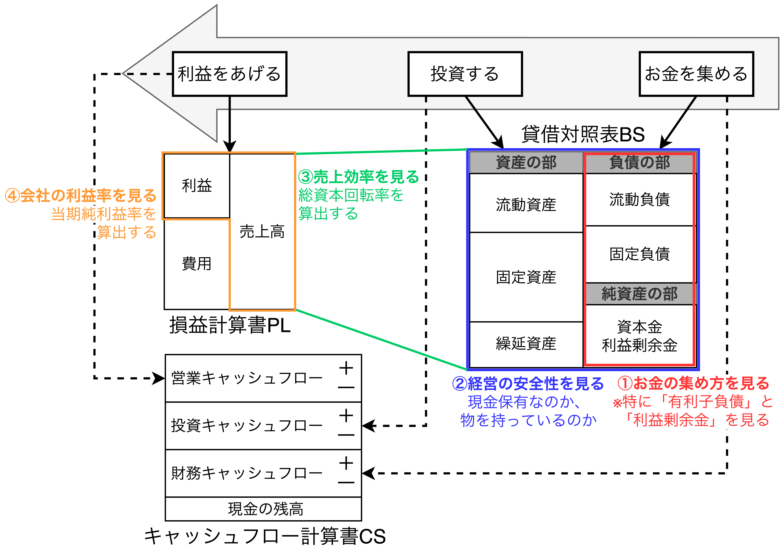
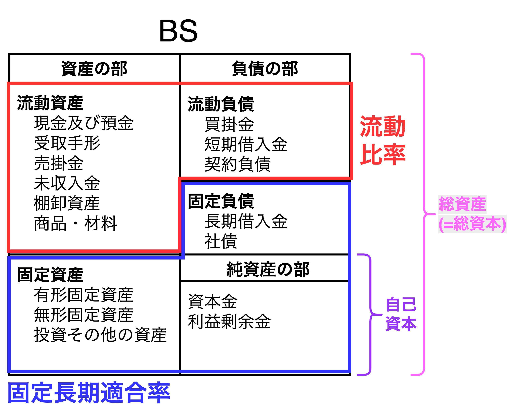
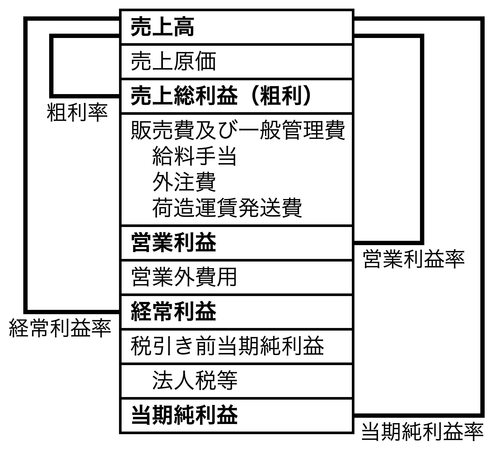
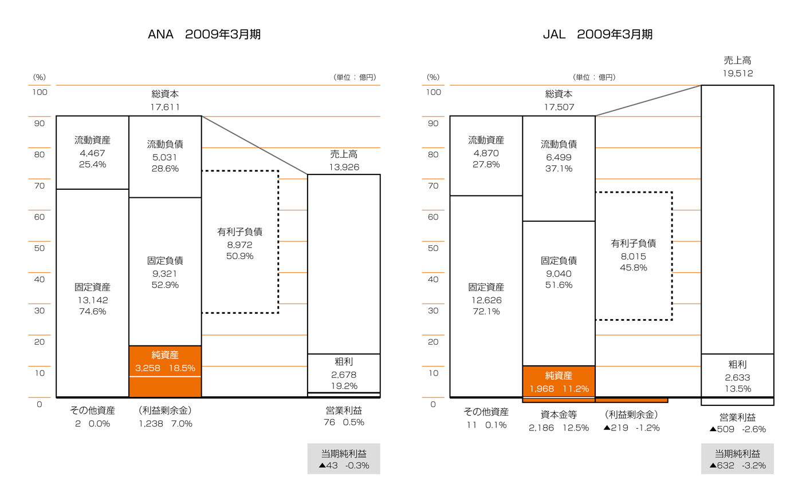
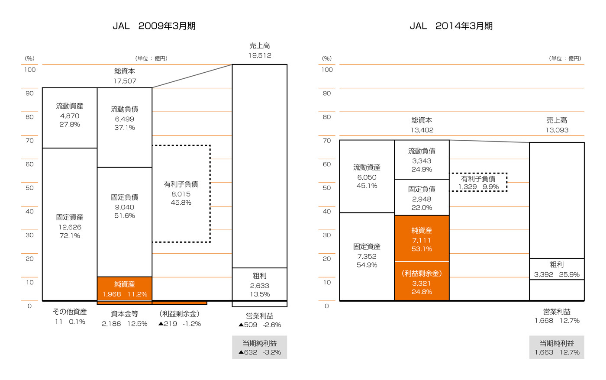

# 財務3表図解分析法

## 図解分析の基本

### 【分析手順1】お金を「どうやって」集めているのか

- 財務諸表はPLとBS空算出できる**4つの指標**（自己資本利益率ROE、当期純利益率、総資本回転率、財務レバレッジ）とCSの**8つのパターン**から会社の状況を判断する。
- 会社は事業プロセスをベースに見ていけばよく、その事業プロセスは「お金を集める→投資する→利益を上げる」の順を辿る。
- そのため、会社を見る時は**まずはBSの右側(負債の部と純資産の部)を確認する**。BSの右側で必ずチェックする項目は「有利子負債」と「利益剰余金」の2つである。
  - 【**有利子負債**】短期借入金、長期借入金、社債
  - 【**利益剰余金**】過去の利益を積み上げたお金
- 「有利子負債が少なく、利益剰余金が多い会社」は素晴らしい環境で経営ができていたことがわかる。ただし、一概に「有利子負債が多い会社」が悪いわけではない。

### 【分析手順2】集めたお金を「何に」投資しているのか確認して会社の安全性を見る

$$
\color{red}流動比率\color{black}=\frac{流動資産}{流動負債}
\hspace{3mm},\hspace{3mm}
\color{orange}当座比率\color{black}=\frac{当座資産}{流動負債}\\[3mm]
\color{green}固定比率\color{black}=\frac{固定資産}{自己資本}
\hspace{3mm},\hspace{3mm}
\color{blue}固定長期適合率\color{black}=\frac{固定資産}{固定負債+自己資本}\\[3mm]
\color{purple}自己資本比率\color{black}=\frac{自己資本}{総資本}
$$

- BSの左右を見て「<b>会社の安全性</b>」を見る。
- 流動比率を見ることで会社の金払いの良し悪しを評価でき、流動比率が良い会社は固定長期適合率も自動的に良いことになる。
  - 流動比率(金払い)が良い $\Leftrightarrow$「流動資産が高い」または「流動負債が低い」$\Leftrightarrow$「固定資産が低い」または「固定資産が高い」$\Leftrightarrow$ 固定長期適合率(経営の安全性)が良くなる
- 流動比率と固定長期適合率の他に自己資本比率があり、平均は$44\%$である。自己資本比率が高い会社は経営の安全性が高いと言われる。

### 【分析手順3】会社の売上効率(資産と売上の関係)を見る

- BSから会社の安全性を確認した後、調達資金(総資本または総資産)からどれだけの売上を出したのかを見る。具体的には**総資本回転率**を見る。
- 総資本回転率の平均は0.8と言われているが、<u>総資本回転率は業界によって値は大きく異なるため、競合他社や業界ごとに統計をとった方が良い</u>。

$$
総資本回転率=\frac{売上高}{総資本(総資産)}
$$

### 【分析手順4】会社の利益率(粗利益、営業利益、当期純利益)を見る

- PLを見て利益率を計測する。粗利率や営業利益率、当期純利益率など様々な利益率を計測することで様々な側面が見える。

## 【ANAとJALの比較】同業他社比較と期間比較

#### 2009年3月期のPLとBS

<table>
	<tbody>
		<tr>
			<th></th>
			<th>ANA 2009年3月期</th>
			<th>JAL 2009年3月期</th>
		</tr>
		<tr>
			<td>ROE</td>
			<td>-1.3%</td>
			<td>-32.1%</td>
		</tr>
		<tr>
			<td>財務レバレッジ</td>
			<td>5.41</td>
			<td>8.90</td>
		</tr>
		<tr>
			<td>総資本回転率</td>
			<td>0.79%</td>
			<td>1.11%</td>
		</tr>
		<tr>
			<td>当期純利益率</td>
			<td>-0.3%</td>
			<td>-3.2%</td>
		</tr>
	</tbody>
</table>

- 【**両者の特徴**】<u>2社とも借金が多い</u>。ANAとJALは共に航空産業であり業態的に言えば装置産業である。ジェット機という巨額の装置を購入したり、リースで運用しながら利益を上げることから比較的借金が多い。
- 【**ANAの状況**】特記事項なし。
- 【**JALの状況**】経営破綻処理前(大幅な人員削減前)

#### 【JAL】2009→2014年の変化

<table>
	<tbody>
		<tr>
			<th></th>
			<th>JAL 2009年3月期</th>
			<th>JAL 2014年3月期</th>
		</tr>
		<tr>
			<td>ROE</td>
			<td>-32.1%</td>
			<td>23.4%</td>
		</tr>
		<tr>
			<td>財務レバレッジ</td>
			<td>8.90</td>
			<td>1.88</td>
		</tr>
		<tr>
			<td>総資本回転率</td>
			<td>1.11%</td>
			<td>0.98%</td>
		</tr>
		<tr>
			<td>当期純利益率</td>
			<td>-3.2%</td>
			<td>12.7%</td>
		</tr>
	</tbody>
</table>

- 売上高が約$33\%$下がっている（$1兆9512億円\rightarrow 1兆3093億円$）
→ 会社の規模が全体的にかなり小さくなっている。
- 有利子負債が$83.5\%$下がっている（$8015億円\rightarrow 1329億円$）
→ JALを再生させるために大手金融機関が債権を放棄したため(借金返済しなくても良くなった)。
- 1万6千人近くの人員削減
→ 人件費削減による営業利益の増加($-509億円\rightarrow 1,688億円$)
- ジェット機の全機売却による固定資産の売却($1兆2,626億円\rightarrow 7,352億円$)。

## 事業再生のプロセスが財務諸表に表れる

### ①三菱自動車-マツダ

### ②スバル-マツダ

## 経営戦略が財務諸表に表れる

### ①キリン-アサヒ

### ②NTTドコモ-ソフトバンク

## 企業の方針(Policy)が財務諸表に表れる

### ①アップル-ソニー

### ②IBM-ソニー

### ③アマゾン-イオン

## CS分析(CSには会社の状況や経営者の意思が表れる)

<table>
	<caption>キリンのCS</caption>
	<tbody>
		<tr>
			<th></th>
			<th>2005年 12月期</th>
			<th>2006年 12月期</th>
			<th>2007年 12月期</th>
			<th>2008年 12月期</th>
			<th>2009年 12月期</th>
			<th>5年計</th>
		</tr>
		<tr>
			<td>営業CF</td>
			<td>1,047</td>
			<td>1,237</td>
			<td>1,146</td>
			<td>1,313</td>
			<td>1,899</td>
			<td>6,642</td>
		</tr>
		<tr>
			<td>投資CF</td>
			<td>△667</td>
			<td>△1,532</td>
			<td>△2,696</td>
			<td>△1,693</td>
			<td>△3,217</td>
			<td>△9,805</td>
		</tr>
		<tr>
			<td>財務CF</td>
			<td>△520</td>
			<td>△500</td>
			<td>1,216</td>
			<td>267</td>
			<td>1,742</td>
			<td>2,205</td>
		</tr>
	</tbody>
</table>

<table>
	<caption>NTTドコモのCS</caption>
	<tbody>
		<tr>
			<th></th>
			<th>2016年 3月期</th>
			<th>2017年 3月期</th>
			<th>2018年 3月期</th>
			<th>2019年 3月期</th>
			<th>2020年 3月期</th>
			<th>5年計</th>
		</tr>
		<tr>
			<td>営業CF</td>
			<td>12,091</td>
			<td>13,124</td>
			<td>14,986</td>
			<td>12,160</td>
			<td>13,178</td>
			<td>65,539</td>
		</tr>
		<tr>
			<td>投資CF</td>
			<td>△3,753</td>
			<td>△9,431</td>
			<td>△7,055</td>
			<td>△2,965</td>
			<td>△3,548</td>
			<td>△26,752</td>
		</tr>
		<tr>
			<td>財務CF</td>
			<td>△5,836</td>
			<td>△4,331</td>
			<td>△6,908</td>
			<td>△10,900</td>
			<td>△7,839</td>
			<td>△35,814</td>
		</tr>
	</tbody>
</table>

<table>
	<caption>ソニーのCS</caption>
	<tbody>
		<tr>
			<th></th>
			<th>2016年 3月期</th>
			<th>2017年 3月期</th>
			<th>2018年 3月期</th>
			<th>2019年 3月期</th>
			<th>2020年 3月期</th>
			<th>5年計</th>
		</tr>
		<tr>
			<td>営業CF</td>
			<td>7,464</td>
			<td>8,075</td>
			<td>12,540</td>
			<td>12,587</td>
			<td>13,497</td>
			<td>54,163</td>
		</tr>
		<tr>
			<td>投資CF</td>
			<td>△10,279</td>
			<td>△12,550</td>
			<td>△8,231</td>
			<td>△13,074</td>
			<td>△13,523</td>
			<td>△57,657</td>
		</tr>
		<tr>
			<td>財務CF</td>
			<td>3,801</td>
			<td>4,523</td>
			<td>2,465</td>
			<td>△1,229</td>
			<td>657</td>
			<td>10,217</td>
		</tr>
	</tbody>
</table>

- 

<table>
	<caption>アマゾンのCS</caption>
	<tbody>
		<tr>
			<th></th>
			<th>2015年 12月期</th>
			<th>2016年 12月期</th>
			<th>2017年 12月期</th>
			<th>2018年 12月期</th>
			<th>2019年 12月期</th>
			<th>5年計</th>
		</tr>
		<tr>
			<td>営業CF</td>
			<td>11,920</td>
			<td>16,443</td>
			<td>18,365</td>
			<td>30,723</td>
			<td>38,514</td>
			<td>115,965</td>
		</tr>
		<tr>
			<td>投資CF</td>
			<td>△6,450</td>
			<td>△9,876</td>
			<td>△27,084</td>
			<td>△12,369</td>
			<td>△24,281</td>
			<td>△80,060</td>
		</tr>
		<tr>
			<td>財務CF</td>
			<td>△3,763</td>
			<td>△2,911</td>
			<td>9,928</td>
			<td>△7,686</td>
			<td>△10,066</td>
			<td>△14,498</td>
		</tr>
	</tbody>
</table>

<table>
	<caption>トヨタのCS</caption>
	<tbody>
		<tr>
			<th></th>
			<th>2016年 3月期</th>
			<th>2017年 3月期</th>
			<th>2018年 3月期</th>
			<th>2019年 3月期</th>
			<th>2020年 3月期</th>
			<th>5年計</th>
		</tr>
		<tr>
			<td>営業CF</td>
			<td>44,609</td>
			<td>35,685</td>
			<td>42,231</td>
			<td>37,666</td>
			<td>35,906</td>
			<td>196,097</td>
		</tr>
		<tr>
			<td>投資CF</td>
			<td>△31,825</td>
			<td>△29,699</td>
			<td>△36,601</td>
			<td>△26,972</td>
			<td>△31,509</td>
			<td>△156,606</td>
		</tr>
		<tr>
			<td>財務CF</td>
			<td>△4,236</td>
			<td>△3,752</td>
			<td>△4,491</td>
			<td>△5,408</td>
			<td>3,971</td>
			<td>△13,916</td>
		</tr>
	</tbody>
</table>

<table>
	<caption>IBMのCS</caption>
	<tbody>
		<tr>
			<th></th>
			<th>2014年 12月期</th>
			<th>2015年 12月期</th>
			<th>2016年 12月期</th>
			<th>2017年 12月期</th>
			<th>2018年 12月期</th>
			<th>5年計</th>
		</tr>
		<tr>
			<td>営業CF</td>
			<td>16,868</td>
			<td>17,008</td>
			<td>16,958</td>
			<td>16,724</td>
			<td>15,247</td>
			<td>82,805</td>
		</tr>
		<tr>
			<td>投資CF</td>
			<td>△3,001</td>
			<td>△8,159</td>
			<td>△10,976</td>
			<td>△7,096</td>
			<td>△4,913</td>
			<td>△34,145</td>
		</tr>
		<tr>
			<td>財務CF</td>
			<td>△15,452</td>
			<td>△9,166</td>
			<td>△5,791</td>
			<td>△6,418</td>
			<td>△10,469</td>
			<td>△47,296</td>
		</tr>
	</tbody>
</table>

- 

## 日本の企業と海外の企業との大きな差

## GAFAの財務諸表

