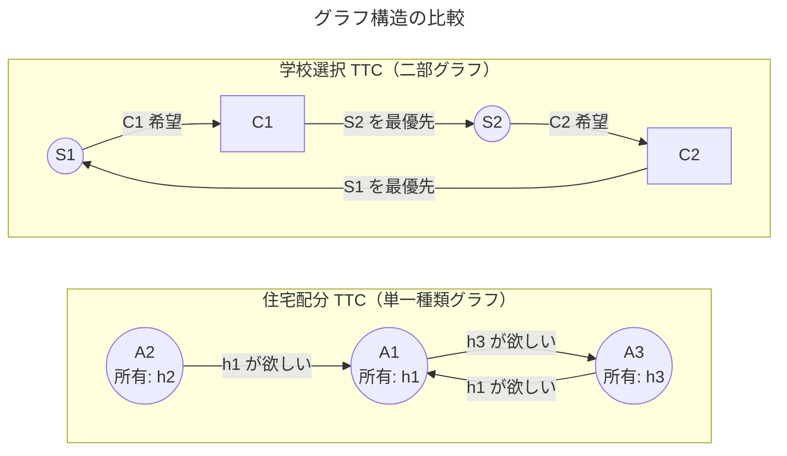
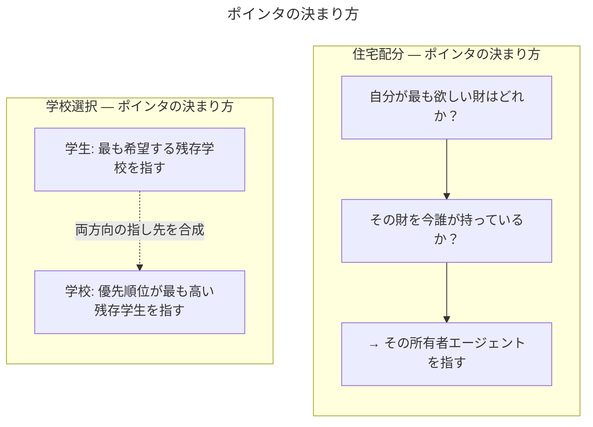
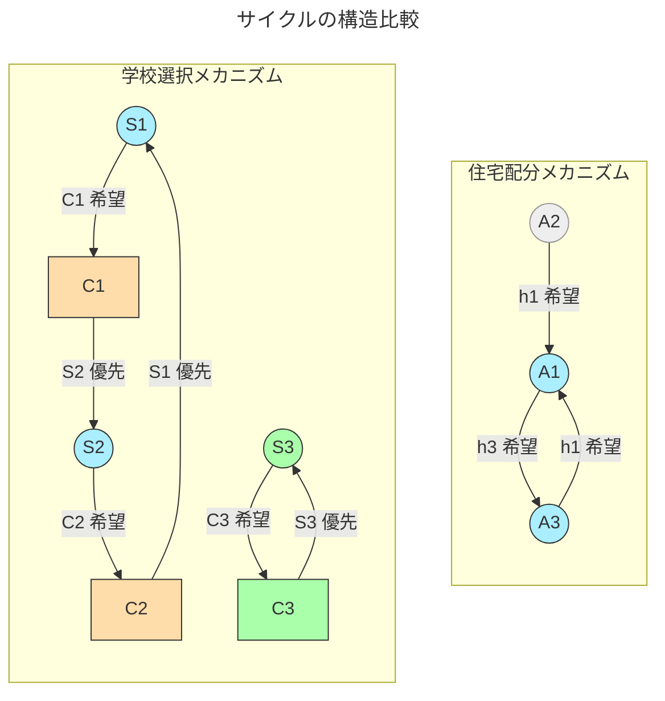
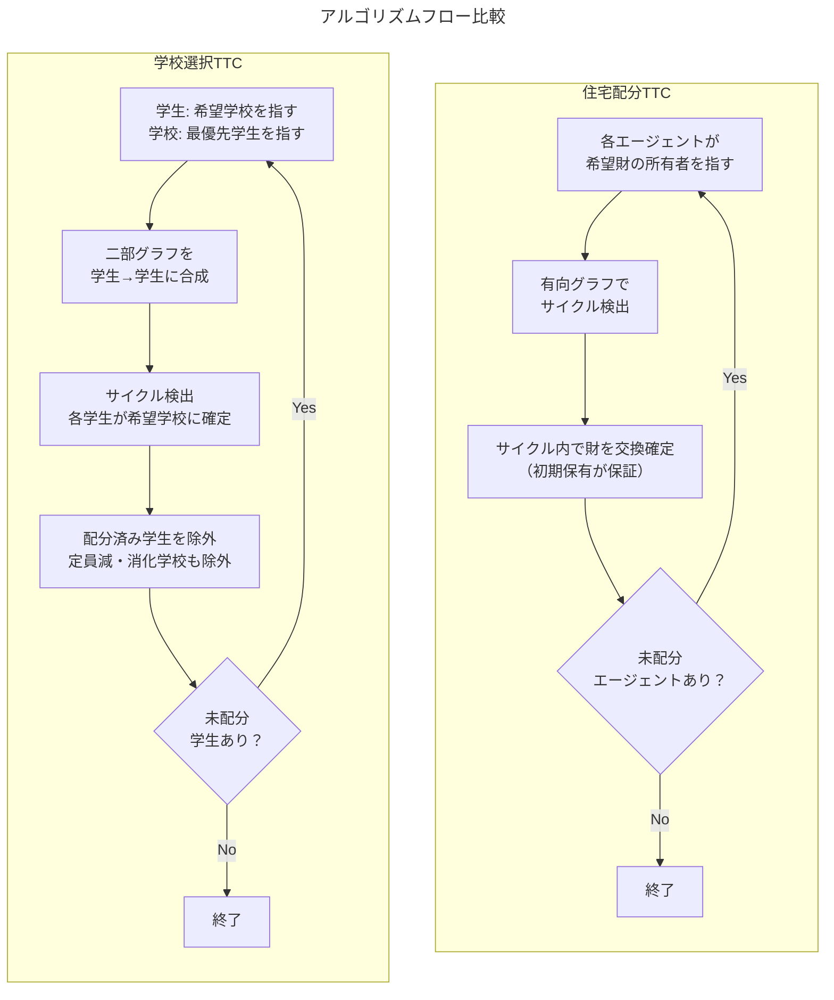

# マッチング理論

## TTCメカニズム

| 観点           | 住宅配分 TTC                     | 学校選択 TTC                         |
| -------------- | -------------------------------- | ------------------------------------ |
| 初期保有       | あり（各エージェントが財を所有） | なし                                 |
| グラフ型       | 単一種類（A → A）                | 二部グラフ（S → C → S）              |
| ポインタの根拠 | 「希望財の所有者」を指す         | 学生は希望学校、学校は優先学生を指す |
| サイクルの要素 | エージェントのみ                 | 学生と学校が交互                     |
| 合成処理       | 不要                             | S→C→S と合成して学生間サイクルを抽出 |
| 定員           | 1財1人（1対1）                   | 学校に定員あり（多対1）              |
| 公平性保証     | 個人合理性（初期保有以上）       | 優先順位の尊重                       |

【**核心的な違い**】住宅配分では「財の所有権」がトレードの根拠なのに対し、学校選択では所有権がないため、学校の「優先順位」を擬似的な所有権として機能させることで二部グラフ上のサイクルを作り出しています。これが `school_points_to` という追加構造が必要な理由です。

### グラフ構造の比較

### ポインタの決まり方

### サイクルの構造比較

### アルゴリズムフロー比較

