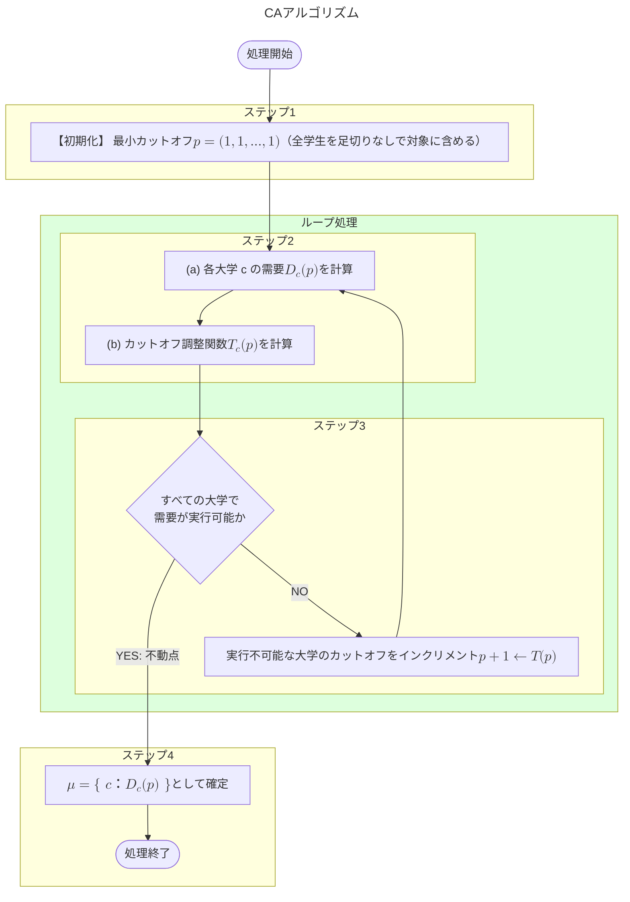

## はじめに


前回はFDAアルゴリズムを紹介し、特に地域上限という制約下における弱安定マッチングを説明しました。本記事では、CAアルゴリズムをPythonコードで実装し、動作確認しながらマッチング理論の理解を深めることを目的にしています。

今回の記事はアルゴリズムの説明に用いるルール決めが多いので難しく感じるかもしれませんが、内容自体はシンプルです。
興味がある方はぜひ読んでみてください。

- 【**想定する読者**】マッチング理論の初学者エンジニア
- [【理論編】マッチング理論](https://qiita.com/_it_/items/1cdd9059282cb774f8cc)
- [【実装編】DAアルゴリズム](https://qiita.com/_it_/items/fc3d58a337d2eb6f2408)
- [【実装編】FDAアルゴリズム](https://qiita.com/_it_/items/0b30fe9acdb55c7e8897)
- [【実装編】CAアルゴリズム](https://qiita.com/_it_/items/75f1f63e3d57a3de4aaf) ← 今回はここ！
- [サンプルコード](https://github.com/itokohei0/MarketDesignStudy/tree/master/%E3%83%9E%E3%83%83%E3%83%81%E3%83%B3%E3%82%B0%E7%90%86%E8%AB%96)

CAアルゴリズム（カットオフ調整アルゴリズム）は**一般上限制約のもとで最適公平マッチング（OFM: Optimal Fair Matching）を求めるアルゴリズム**です。FDA では「**地域上限**」という制約に限られますが、CAアルゴリズムでは定員だけでなく、予算や回避ペアなどを対象にマッチング問題を解くことが可能になります。


#### CAアルゴリズムのマッチング結果が満たす性質

| 性質       |         結果         | 補足                                       |
| ---------- | :------------------: | ------------------------------------------ |
| 個人合理性 |          ✅           |                                            |
| 耐戦略性   | ⚠️ **条件付きで成立** | 全校共通の優先順位のもとでのみ成立         |
| 安定性     |          ❌           | 制約付きマッチングでは安定性は保証されない |
| 公平性     |          ✅           | 正当な羨望を持つ学生が存在しない           |
| 効率性     |          ❌           | 一般上限制約下では効率性は保証されない     |

望ましい性質の説明のために用いる記号は前回の記事と同様、以下の学生 $s\in S$ と大学 $c\in C$ を使います。その上で本記事では、大学 $c$ にとって実行可能な学生の割り当て方を集めた全ての集合 $\mathcal{F}_c\subseteq 2^S$ を定義します。

<details><summary><b>【望ましい性質】公平性（Fairness）</b></summary>

```math
\begin{array}{c}
  \text{公平性を満たす}&\iff &\text{正当な羨望を持つ学生が存在しない}\\
  \text{正当な羨望を持つ}&\iff&(\text{i})\;\mu(s')\succ_s\mu(s)\;\text{かつ}\;(\text{ii})\;\mu(s')=c\hspace{2mm}かつ\hspace{2mm}s\succ_c s'
\end{array}
```

学生$s,s'\in S$について、上式$(\text{i})$と$(\text{ii})$を満たす学校$c$が存在するとき、**$s$は$s'$に対して正当な羨望を持つ**と言い、このような「**正当な羨望を持つ学生が存在しないこと**」＝「**公平性**」になります。

ここで、$(\text{i})$について、これは学生$s$は$s$のペアより$s'$のペアを好むことを意味します。次に$(\text{ii})$について、これは$s'$のペア$\mu(s')$である大学$c$が$s'$よりも$s$を好むことを意味します。

</details>

<details><summary><b>【望ましい性質】効率性（Efficiency）</b></summary>

```math
\begin{array}{c}
  \text{効率性を満たす}&\iff &\text{無駄が「ない」}\\[1mm]
  \text{無駄が「ある」}&\iff&(\text{i})\;c\succ_s\mu(s)\hspace{2mm}かつ\hspace{2mm}(\text{ii})\;\mu(c)\cup\{s\}\in\mathcal{F}_c
\end{array}
```

これはある種の効率性の条件であり、「大学の定員に空きがあるにも関わらず入学を希望する学生を受け入れられない事態が生じないこと」を要求しています。

</details>

:::note info
**【補足】$\mathcal{F}_c$を追加した理由**
$\mathcal{F}_c$ を用いることで大学 $c$ に課された制約を過不足なく表現できます。具体的には、何らかの学生の集合 $S'\subseteq S$ が大学 $c$ にとって実行可能ならば、$S'\in\mathcal{F}_c$、実行不可能ならば、$S'\notin\mathcal{F}_c$ と表現できます。また、マッチング $\mu$ が実行可能であるとき、全ての学校 $s\in S$ について $\mu(s)\in\mathcal{F}_c$ と表現できます。
:::


:::note info

**【安定性・公平性・効率性の関係】**

公平性・効率性は安定性の条件である「ブロッキングペア」を分解したものになります。

```math
\text{安定性} = \text{個人合理性} \quad\text{かつ}\quad \underbrace{\;\text{公平性} \quad\text{かつ}\quad \text{効率性}\;}_{=\text{ブロッキングペアなし}}
```
:::


## 課題設定とアルゴリズム

- 応募者（例：学生 $s$）$n$ 人と受入者（例：大学 $c$）$m$ 校
- 参加者は相手全員に対する選好（好み順）を持つ
- **各受入者は一般上限制約 $\mathcal{F}_c$** を持つ

### 【準備】必要知識

#### 一般上限制約の定義

```math
S' \in \mathcal{F}_c \;\text{ かつ }\; S'' \subseteq S'\implies S'' \in \mathcal{F}_c
```

上式が成り立つとき、「<font color=red><b>$\mathcal{F}_c$ は一般上限制約である</b></font>」と言います。上式は「学生の集合$S$の部分集合$S'$が一般上限制約$\mathcal{F}_c$を満たすとき、その部分集合$S''$もまた$\mathcal{F}_c$を満たす」という自然な性質です。

:::note info
【**FDAとCAで取り扱う制約の違い**】
FDAでは地域というグループ化されたパラメータを扱っていましたが、CAでは個別に独立したパラメータを制約として扱います。具体的には、一般上限制約は「**個々**」の学校（病院）ごとに「**独立**」に定められた制約を表します。そのため、地域上限のような「独立していないグループとして考慮が必要なパラメータ」は一般上限制約では対応できません。

実際、満たすべき性質がFDA（弱安定性）とCA（公平性）で異なることから両者は区別して取り扱う必要があります。
:::

また参考として、以下に一般上限制約とそうでない制約の例を示します。それぞれ定員制約、予算制約、回避制約、下限制約、比例的制約と呼ぶこととします。

**✅ 一般上限制約の例**

| 制約の種類 | 一般上限制約                                                                                                            | 例                                                             |
| ---------- | ----------------------------------------------------------------------------------------------------------------------- | -------------------------------------------------------------- |
| 定員制約   | ${F}_c=\left\lbrace S'\subseteqq S,\hspace{1mm}0\leqq q：\|S'\|\leqq q\right\rbrace$                                    | 大学や保育園の募集定員                                         |
| 予算制約   | $\mathcal{F}_c=\left\lbrace S'\subseteqq S：\underset{s\in S'}{\sum}c_s\leqq b_c\right\rbrace$                          | 障害学生の受入コストが予算内、海外留学支援金の支給上限         |
| 回避制約   | $\mathcal{F}_c=\lbrace S'\subseteqq S：(i,j)\in S\times S$<br>　　　　$\implies\lbrace i,j\rbrace\nsubseteqq S'\rbrace$ | いじめ関係者を同校に入れない、部署配属で特定の社員を合わせない |

**❌ 一般上限制約ではない例**

| 制約の種類 |                                           式                                           | 例                     |
| ---------- | :------------------------------------------------------------------------------------: | ---------------------- |
| 下限制約   | $1\leqq q,\hspace{2mm}S'\subseteqq S,\hspace{2mm}S'\in \mathcal{F}_c\iff q\leqq\|S'\|$ | 一定人数以上を必ず確保 |
| 比例的制約 |                                           ー                                           | 男女比率同数（50:50）  |


#### カットオフ（Cutoff）と需要

CAアルゴリズムでは①カットオフ、②需要、③カットオフ調整関数の3つが登場します。それぞれの定義を以下に示します。

【**カットオフ $p_c$**】「大学 $c$ の優先順位リストで下から何番目までを足切りするか」を決める整数で、市場価格のような役割を果たします。

- $p_c$：大学 $c$ の優先順位のうち下から何番目までを切り捨てるかを決める整数。市場価格のような役割。
- $p=\{p_1,p_2,\cdots,p_{|C|}\}$：すべての学校のカットオフを並べたもの、「**カットオフプロファイル**」を呼ぶ。
- $s^{(c,p_c)}$：大学 $c$ の優先順位 $\succ_c$ において下から $p_c$ 番目の学生

| $s^{(c,p_c)}$の値 | 意味                                               |
| ----------------- | -------------------------------------------------- |
| $s^{(c,1)}$       | 誰も足切りしない（全員対象）                       |
| $s^{(c,k)}$       | $\|S\|-k+1$人の学生が対象（$k-1$人の学生が対象外） |
| $s^{(c,\|S\|)}$   | 最も好ましい学生（1人だけが対象）                  |
| $s^{(c,\|S\|+1)}$ | 全員足切り（誰も入学できない）                     |


【**需要関数** $D_c(p)$】大学 $c$ の足切りライン（カットオフ $p$）を突破した学生のうち、$c$ を受け入れ可能かつ最も好んでいる学生の集合。

```math
\color{red}{D_c(p)}\color{black} = \left\{ s \in S \;\middle|\; \underbrace{\color{blue}{s \succeq_c s^{(c,\,p_c)}}}_{\text{足切り通過}},\quad \underbrace{\color{green}{c\succ_s\emptyset}}_{\text{$c$ を希望}},\quad \underbrace{\color{orange}{s \succeq_{c'} s^{(c',\,p_{c'})} \implies c \succeq_s c'}}_{\text{$c$ が最も好きな足切り通過校}} \right\}
```

以下に需要関数の補足説明をします。

- $\color{red}{D_c(p)}$は$p$番目まで切り捨てられた学校の優先順位リストに載っている学生のうち、$c$のことを受け入れ可能かつ最も好んでいるものたちをすべて含む集合。
  - $\color{blue}{s \succeq_c s^{(c,\,p_c)}}$ について、学生$s$が下から$p_c$番目以上には好まれていることを表しており、**下から$p_c-1$番目までを切り捨てた後の優先順位のリストに$s$が載っていることを意味します**。
  - $\color{green}{c\succ_s\emptyset}$ は学校$c$は$s$にとって受け入れ可能であることを意味しています。
  - $\color{orange}{s \succeq_{c'} s^{(c',\,p_{c'})} \implies c \succeq_s c'}$ は$s$が他の学校$c'\in C$の足切り済みの優先順位リストにも載っているなら、$c$は$s$に最も好まれている学校であるということを意味します。

【**カットオフ調整関数** $T_c$】需要 $D_c(p)$ が $\mathcal{F}_c$ に属さない場合にカットオフ $p_c$ を $+1$ し、そうでなければ $p_c$ を返す関数。

```math
T_c(p) = \begin{cases} p_c + 1 & \text{if } D_c(p) \notin \mathcal{F}_c \\ p_c & \text{if } D_c(p) \in \mathcal{F}_c \end{cases}
```


### アルゴリズム

- 【**ステップ1**】最小カットオフ $p = (1, 1, \ldots, 1)$ で初期化する（全学生を足切りなしで対象に含める）。
- 【**ステップ2**】
  - （**a**）各大学 $c$ の需要 $D_c(p)$ を計算する。足切りを通過した学生のうち、大学 $c$ を最も好きな足切り通過校に振り分ける。
  - （**b**）各大学 $c$ についてカットオフ調整関数 $T_c(p)$ を計算する。需要 $D_c(p)$ が実行可能でなければカットオフを +1 する。
- 【**ステップ3**】全大学について $T(p) = p$（不動点）ならばステップ4へ進む。そうでなければ $p \leftarrow T(p)$ としてステップ2に戻る。
- 【**ステップ4**】不動点 $p^*$ から得られる需要 $D_c(p^*)$ を各大学の受入学生として確定する（学生最適公平マッチング）。

:::note info
【**学生最適公平マッチングについて**】
以下の3つの条件を満たすマッチング$\mu$を「**学生最適安定マッチング（SOFM：Student Optimal Fair Matching）**」と呼びます。
1. 実行可能である
2. 個人合理性と公平性を満たす
3. 1.と2.を満たすどのマッチング $\mu'$ についても全ての学生$s\in S$について $\mu(s)\succeq\mu'(s)$を満たす
:::

<details><summary><b>フローチャート</b></summary>



</details>


## プログラム

以下に実装したソースコードの主要部分を示します。

### データ構造

DAアルゴリズムと比較して、CAアルゴリズムの `Input` では `capacities`（定員リスト）を **`constraints`（制約関数リスト）** に置き換えます。地域上限などのFDA固有のパラメータは持ちません。

```python
from dataclasses import dataclass
from typing import Callable

# 一般上限制約の型 → 実行可能かどうか
Constraint = Callable[[frozenset[int]], bool]

def capacity_constraint(cap: int) -> Constraint:
    """定員制約: |I'| <= cap"""
    return lambda proposers: len(proposers) <= cap


def budget_constraint(costs: dict[int, float], budget: float) -> Constraint:
    """予算制約: Σ cost_i <= budget"""
    return lambda proposers: sum(costs.get(p, 0.0) for p in proposers) <= budget


def collision_avoidance_constraint(conflict_pairs: list[tuple[int, int]]) -> Constraint:
    """回避制約: conflict_pairs のいずれかのペアが同じ受入者に配属されていないか判定する"""
    return lambda proposers: not any(a in proposers and b in proposers for a, b in conflict_pairs)


@dataclass
class Input:
    proposer_prefs: list[list[int]]
    receiver_prefs: list[list[int]]
    constraints:    list[Constraint]       # 受入者 j の実行可能性判定関数
    proposer_names: list[str] | None = None
    receiver_names: list[str] | None = None

    @property
    def n_proposers(self) -> int:
        return len(self.proposer_prefs)

    @property
    def n_receivers(self) -> int:
        return len(self.receiver_prefs)

    def p_name(self, i: int) -> str:
        return self.proposer_names[i] if self.proposer_names else f"P{i+1}"

    def r_name(self, j: int) -> str:
        return self.receiver_names[j] if self.receiver_names else f"R{j+1}"


@dataclass
class Result:
    proposer_match: list[int]
    receiver_match: list[list[int]]
    cutoff_profile: list[int]        # 最終カットオフプロファイル p*
```

### メインアルゴリズム

```python
def cutoff_adjustment(data: Input, verbose: bool = True) -> Result:
    """
    CA アルゴリズムを実行し、提案者最適公平マッチングを返す。

    最小カットオフ p = (1, 1, ..., 1) から出発し、カットオフ調整関数 T の最小不動点 p* を求める。
    p* のもとで需要 D_r(p*) を確定させたものが提案者最適公平マッチングとなる。
    """
    P = data.n_proposers
    R = data.n_receivers
    priority_rank = _build_priority_rank(data.receiver_prefs, P)

    # 【ステップ1】最小カットオフから開始（すべての提案者を対象に含める）
    cutoff = [1] * R

    if verbose:
        _print_preferences(data)
        print("=== CA アルゴリズム 開始 ===\n")
        print(f"  初期カットオフ: p = {cutoff}\n")

    iteration = 1
    while True:
        # 【ステップ2-a】需要 D_r(p) を計算
        demand = _compute_demand(data, cutoff, priority_rank, P, R)

        # 【ステップ2-b】カットオフ調整関数 T(p) を計算
        new_cutoff = list(cutoff)
        is_fixed_point = True

        if verbose:
            print(f"--- 反復 {iteration} ---")

        for r in range(R):
            feasible = data.constraints[r](frozenset(demand[r]))
            if not feasible:
                # 【ステップ3】カットオフをインクリメント
                new_cutoff[r] = cutoff[r] + 1
                is_fixed_point = False
            if verbose:
                demand_str = ", ".join(data.p_name(p) for p in sorted(demand[r]))
                mark = "✅" if feasible else "❌"
                print(f"  {data.r_name(r)}: p={cutoff[r]}, D=[{demand_str}] {mark}")

        if verbose and not is_fixed_point:
            print(f"  → p: {cutoff} → {new_cutoff}\n")

        if is_fixed_point:
            # 【ステップ4】不動点のため計算終了
            if verbose:
                print(f"\n  不動点到達: p* = {cutoff}\n")
            break

        cutoff = new_cutoff
        iteration += 1

        # 安全装置: すべての受入者でカットオフが P+1 を超えたら終了
        if all(c > P for c in cutoff):
            break

    # 【ステップ4】最終マッチングを確定
    demand = _compute_demand(data, cutoff, priority_rank, P, R)
    proposer_match = [-1] * P
    receiver_match = [[] for _ in range(R)]

    for r in range(R):
        receiver_match[r] = sorted(demand[r])
        for p in demand[r]:
            proposer_match[p] = r

    result = Result(
        proposer_match=proposer_match,
        receiver_match=receiver_match,
        cutoff_profile=cutoff,
    )

    print("=== CA アルゴリズム 終了 ===\n")
    _print_result(result, data)
    return result


def _compute_demand(
    data: Input,
    cutoff: list[int],
    priority_rank: list[list[int]],
    P: int,
    R: int,
) -> list[list[int]]:
    """カットオフ p のもとで各受入者の需要 D_r(p) を計算する。"""
    # 各受入者の足切り通過者集合を求める
    qualified: list[set[int]] = [set() for _ in range(R)]
    for r in range(R):
        threshold = P - cutoff[r]   # この値以下の順位を持つ提案者が通過
        for p in range(P):
            if priority_rank[r][p] <= threshold:
                qualified[r].add(p)

    # 各提案者が最も好きな「足切り通過受入者」を求め、そこに振り分ける
    demand: list[list[int]] = [[] for _ in range(R)]
    for p in range(P):
        for r_1indexed in data.proposer_prefs[p]:
            r = r_1indexed - 1
            if p in qualified[r]:
                demand[r].append(p)
                break  # 最も好きな通過受入者に割り当て、残りはスキップ

    return demand
```


### 動作確認

#### 【例1】定員制約（学生4人、大学4校）

制約が通常の定員制約のとき、CA は DA と同じ結果を返すことを確認します。内容は[DAアルゴリズムの記事の例1](https://qiita.com/_it_/items/fc3d58a337d2eb6f2408#%E4%BE%8B1%E5%AD%A6%E7%94%9F%E3%81%A8%E5%A4%A7%E5%AD%A6%E3%81%AE%E3%83%9E%E3%83%83%E3%83%81%E3%83%B3%E3%82%B01%E5%AF%BE1%E3%83%9E%E3%83%83%E3%83%81%E3%83%B3%E3%82%B0)と同様、学生4人・大学4校・各定員1人の設定です。

| 学生 | 第1志望 | 第2志望 | 第3志望 | 第4志望 |
| ---- | ------- | ------- | ------- | ------- |
| 田中 | 東工大  | 早稲田  | 慶應    | 明治    |
| 鈴木 | 東工大  | 慶應    | 早稲田  | 明治    |
| 佐藤 | 早稲田  | 東工大  | 慶應    | 明治    |
| 高橋 | 慶應    | 早稲田  | 東工大  | 明治    |

- 各大学の優先順位
  - 東工大＝鈴木＞田中＞佐藤＞高橋
  - 早稲田＝田中＞鈴木＞高橋＞佐藤
  - 慶應＝高橋＞佐藤＞田中＞鈴木
  - 明治＝佐藤＞高橋＞鈴木＞田中

<details><summary><b>【例1】の動作確認用Pythonコード</b></summary>

```python
from ca_algorithm import Input, capacity_constraint, cutoff_adjustment

data = Input(
    proposer_prefs=[
        [1, 2, 3, 4],   # 田中: 東工大 > 早稲田 > 慶應 > 明治
        [1, 3, 2, 4],   # 鈴木: 東工大 > 慶應 > 早稲田 > 明治
        [2, 1, 3, 4],   # 佐藤: 早稲田 > 東工大 > 慶應 > 明治
        [3, 2, 1, 4],   # 高橋: 慶應 > 早稲田 > 東工大 > 明治
    ],
    receiver_prefs=[
        [2, 1, 3, 4],   # 東工大: 鈴木 > 田中 > 佐藤 > 高橋
        [1, 2, 4, 3],   # 早稲田: 田中 > 鈴木 > 高橋 > 佐藤
        [4, 3, 1, 2],   # 慶應:   高橋 > 佐藤 > 田中 > 鈴木
        [3, 4, 2, 1],   # 明治:   佐藤 > 高橋 > 鈴木 > 田中
    ],
    constraints=[
        capacity_constraint(1),
        capacity_constraint(1),
        capacity_constraint(1),
        capacity_constraint(1),
    ],
    proposer_names=["田中", "鈴木", "佐藤", "高橋"],
    receiver_names=["東工大", "早稲田", "慶應", "明治"],
)

result = cutoff_adjustment(data)
```

</details>

**実行トレース**

| 反復 | カットオフ $p$ | $D_\text{東工大}$ | $D_\text{早稲田}$ | $D_\text{慶應}$ | $D_\text{明治}$ | 実行可否                  |
| ---- | -------------- | ----------------- | ----------------- | --------------- | --------------- | ------------------------- |
| 1    | [1, 1, 1, 1]   | [田中, 鈴木]      | [佐藤]            | [高橋]          | []              | 東工大❌ → p[0]: 1→2       |
| 2    | [2, 1, 1, 1]   | [田中, 鈴木]      | [佐藤]            | [高橋]          | []              | 東工大❌ → p[0]: 2→3       |
| 3    | [3, 1, 1, 1]   | [田中, 鈴木]      | [佐藤]            | [高橋]          | []              | 東工大❌ → p[0]: 3→4       |
| 4    | [4, 1, 1, 1]   | [鈴木]            | [田中, 佐藤]      | [高橋]          | []              | 早稲田❌ → p[1]: 1→2       |
| 5    | [4, 2, 1, 1]   | [鈴木]            | [田中]            | [佐藤, 高橋]    | []              | 慶應❌ → p[2]: 1→2         |
| 6    | [4, 2, 2, 1]   | [鈴木]            | [田中]            | [佐藤, 高橋]    | []              | 慶應❌ → p[2]: 2→3         |
| 7    | [4, 2, 3, 1]   | [鈴木]            | [田中]            | [佐藤, 高橋]    | []              | 慶應❌ → p[2]: 3→4         |
| 8    | [4, 2, 4, 1]   | [鈴木]            | [田中]            | [高橋]          | [佐藤]          | 全て ✅ → **不動点** $p^*$ |

東工大は田中・鈴木が競合し、カットオフを上げることで鈴木だけが通過。田中は早稲田へ流れ、佐藤は慶應の競争に敗れ明治へ落ち着きます。

```bash
...
=== CA アルゴリズム 終了 ===

【マッチング結果】
  田中: 早稲田
  鈴木: 東工大
  佐藤: 明治
  高橋: 慶應

【最終カットオフ】 p* = [4, 2, 4, 1]
```


#### 【例2】予算制約（保育園マッチング）

保育士1人が担当する保育園に5人の児童を割り当てます。0歳のコストを 1/3、1歳のコストを 1/6 として、予算制約（コスト合計 ≤ 1.0）を設定します。

| 児童   | 年齢 | コスト | 保育園の優先順位 |
| ------ | ---- | :----: | :--------------: |
| みらい | 0歳  |  1/3   |       1位        |
| はるか | 0歳  |  1/3   |       2位        |
| ゆうと | 1歳  |  1/6   |       3位        |
| みさき | 1歳  |  1/6   |       4位        |
| けんた | 1歳  |  1/6   |       5位        |

<details><summary><b>【例2】の動作確認用Pythonコード</b></summary>

```python
from ca_algorithm import Input, budget_constraint, cutoff_adjustment

costs = {
    0: 1/3,  # みらい（0歳）
    1: 1/3,  # はるか（0歳）
    2: 1/6,  # ゆうと（1歳）
    3: 1/6,  # みさき（1歳）
    4: 1/6,  # けんた（1歳）
}

data = Input(
    proposer_prefs=[[1]] * 5,              # 全員がひまわり保育園のみ希望
    receiver_prefs=[[1, 2, 3, 4, 5]],      # みらい>はるか>ゆうと>みさき>けんた
    constraints=[budget_constraint(costs, budget=1.0)],
    proposer_names=["みらい", "はるか", "ゆうと", "みさき", "けんた"],
    receiver_names=["ひまわり保育園"],
)

result = cutoff_adjustment(data)
```

</details>

**実行トレース**

| 反復 | カットオフ $p$ | 需要 $D(p)$                              | コスト合計                  | 実行可否       | 更新       |
| ---- | -------------- | ---------------------------------------- | --------------------------- | -------------- | ---------- |
| 1    | [1]            | [みらい, はるか, ゆうと, みさき, けんた] | 7/6 ≈ 1.17 > 1.0            | ❌              | p: [1]→[2] |
| 2    | [2]            | [みらい, はるか, ゆうと, みさき]         | 1/3+1/3+1/6+1/6 = 1.0 ≤ 1.0 | ✅ → **不動点** |            |

カットオフが $p=1\to2$ に上昇することで最下位のけんたが足切りとなり、4人でコストがちょうど 1.0 に収まります。

```bash
...

【児童と年齢コスト】
  みらい: コスト 0.333
  はるか: コスト 0.333
  ゆうと: コスト 0.167
  みさき: コスト 0.167
  けんた: コスト 0.167
  保育士1人の予算: 1.0人分

...

=== CA アルゴリズム 終了 ===

【マッチング結果】
  みらい: ひまわり保育園
  はるか: ひまわり保育園
  ゆうと: ひまわり保育園
  みさき: ひまわり保育園
  けんた: 未配分

【最終カットオフ】 p* = [2]
```


#### 【例3】回避制約（同一クラスへの配属禁止ペア）

学生8人・クラス4つのマッチング問題です。「同じクラスに配属してはならない」ペアが4組ある場合に、CAアルゴリズムがどのようにカットオフを調整して回避制約を満たすかを確認します。

| 禁止ペア       | 理由             | 各自の第1志望 |
| -------------- | ---------------- | :-----------: |
| (学生1, 学生2) | 前校のトラブル   |    クラスA    |
| (学生3, 学生4) | 競合プロジェクト |    クラスB    |
| (学生5, 学生6) | 学業上の利益相反 |    クラスC    |
| (学生7, 学生8) | 親族関係         |    クラスD    |

各ペアが同じクラスを第1志望としているため、初期カットオフ $p=(1,1,1,1)$ では全4クラスで禁止ペアの共存が発生します。

<details><summary><b>【例3】の動作確認用Pythonコード</b></summary>

```python
from ca_algorithm import Input, collision_avoidance_constraint, cutoff_adjustment

# 同一クラスに配属してはならないペア（0-indexed）
conflict_pairs = [(0, 1), (2, 3), (4, 5), (6, 7)]

data = Input(
    proposer_prefs=[
        [1, 2, 3, 4],   # 学生1: クラスA > クラスB > クラスC > クラスD
        [1, 3, 2, 4],   # 学生2: クラスA > クラスC > クラスB > クラスD  ← 学生1と第1志望が衝突
        [2, 1, 3, 4],   # 学生3: クラスB > クラスA > クラスC > クラスD
        [2, 4, 3, 1],   # 学生4: クラスB > クラスD > クラスC > クラスA  ← 学生3と第1志望が衝突
        [3, 2, 1, 4],   # 学生5: クラスC > クラスB > クラスA > クラスD
        [3, 4, 2, 1],   # 学生6: クラスC > クラスD > クラスB > クラスA  ← 学生5と第1志望が衝突
        [4, 1, 3, 2],   # 学生7: クラスD > クラスA > クラスC > クラスB
        [4, 2, 1, 3],   # 学生8: クラスD > クラスB > クラスA > クラスC  ← 学生7と第1志望が衝突
    ],
    receiver_prefs=[
        [1, 3, 5, 7, 6, 4, 8, 2],  # クラスA: 学生2 が最下位
        [3, 1, 5, 7, 6, 2, 8, 4],  # クラスB: 学生4 が最下位
        [5, 3, 1, 7, 2, 8, 4, 6],  # クラスC: 学生6 が最下位
        [7, 5, 3, 1, 4, 2, 6, 8],  # クラスD: 学生8 が最下位
    ],
    constraints=[
        collision_avoidance_constraint(conflict_pairs),  # クラスA
        collision_avoidance_constraint(conflict_pairs),  # クラスB
        collision_avoidance_constraint(conflict_pairs),  # クラスC
        collision_avoidance_constraint(conflict_pairs),  # クラスD
    ],
    proposer_names=["学生1","学生2","学生3","学生4","学生5","学生6","学生7","学生8"],
    receiver_names=["クラスA","クラスB","クラスC","クラスD"],
)

result = cutoff_adjustment(data)
```

</details>

**実行トレース**

| 反復 | カットオフ $p$ | $D_\text{クラスA}$ | $D_\text{クラスB}$ | $D_\text{クラスC}$ | $D_\text{クラスD}$    | 実行可否                           |
| ---- | -------------- | ------------------ | ------------------ | ------------------ | --------------------- | ---------------------------------- |
| 1    | [1, 1, 1, 1]   | [学生1, 学生2]     | [学生3, 学生4]     | [学生5, 学生6]     | [学生7, 学生8]        | 全クラス❌ → p: [1,1,1,1]→[2,2,2,2] |
| 2    | [2, 2, 2, 2]   | [学生1]            | [学生3, 学生8]     | [学生2, 学生5]     | [学生4, 学生6, 学生7] | 全クラス✅ → **不動点** $p^*$       |

$p=1$ では各クラスで禁止ペアが共存するため全クラスが実行不可能と判定されます。$p=2$（各学生の第2志望まで考慮）にカットオフを上げると、禁止ペアの一方（各クラスで優先順位が低い方）がより好む次のクラスへ流れ、全クラスで禁止ペア共存が解消されます。

```bash
...
【配属禁止ペア】（同じクラスに配属してはならない）
  (学生1, 学生2) : 前校のトラブル
  (学生3, 学生4) : 競合プロジェクト
  (学生5, 学生6) : 学業上の利益相反
  (学生7, 学生8) : 親族関係

...
=== CA アルゴリズム 終了 ===

【マッチング結果】
  学生1: クラスA
  学生2: クラスC
  学生3: クラスB
  学生4: クラスD
  学生5: クラスC
  学生6: クラスD
  学生7: クラスD
  学生8: クラスB

【最終カットオフ】 p* = [2, 2, 2, 2]
```

## 参考文献

1. [マッチング理論とマーケットデザイン](https://www.amazon.co.jp/dp/453555935X)
2. [マーケットデザイン総論 (シリーズ マーケットデザイン)](https://www.amazon.co.jp/dp/4320096819)
