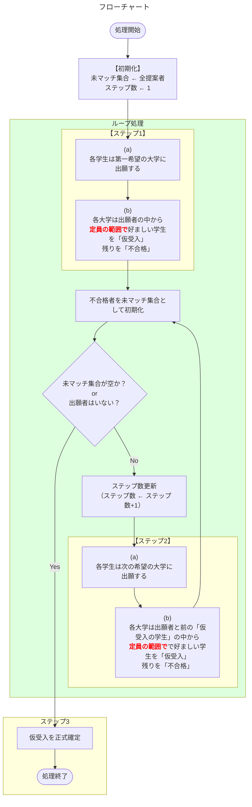

## はじめに


本記事ではDAアルゴリズムをPythonコードで実装について書いています。マッチング理論の勉強の振り返りのために、実際にソースコードを書いて、マッチング理論の理解を深めることを目的にしています。

興味がある方はぜひ読んでみてください。

- 【**想定する読者**】マッチング理論の初学者エンジニア
- [【理論編】マッチング理論](https://qiita.com/_it_/items/1cdd9059282cb774f8cc)
- [【実装編】DAアルゴリズム](https://qiita.com/_it_/items/fc3d58a337d2eb6f2408) ← 今回はここ！
- [【実装編】FDAアルゴリズム](https://qiita.com/_it_/items/0b30fe9acdb55c7e8897)
- [【実装編】CAアルゴリズム](https://qiita.com/_it_/items/75f1f63e3d57a3de4aaf)
- [サンプルコード](https://github.com/itokohei0/MarketDesignStudy/tree/master/%E3%83%9E%E3%83%83%E3%83%81%E3%83%B3%E3%82%B0%E7%90%86%E8%AB%96)

DAアルゴリズム（Deferred Acceptance Algorithm / 受入保留方式）は、Gale と Shapley が1962年に提案した**安定マッチングを求めるアルゴリズム**です。本記事は最もシンプルな設定であるDAアルゴリズムを実装します。この記事が後続のFDA・CA アルゴリズムを理解するための土台となります。

#### DAアルゴリズムのマッチング結果が満たす性質


| 性質       | 結果  | 補足                                                   |
| ---------- | :---: | ------------------------------------------------------ |
| 個人合理性 |   ✅   | どの参加者によってもブロックされないこと               |
| 耐戦略性   |   ✅   | 提案者側において耐戦略性を満たす。受入側は満たさない。 |
| 安定性     |   ✅   | 参加者がマッチング結果に対して不満がないこと           |

DAアルゴリズムにより得られるマッチング結果は安定マッチングであり、安定マッチングでは個人合理性、耐戦略性、安定性を満たします。それぞれの性質を説明するために前回の記事と同様、以下に示す学生と大学を使います。

- 学生$s$とその集合$S$
- 大学$c$とその集合$C$
- 参加者 $i\in S\cup C$ の選好 $\succ_i$
- 参加者 $i$ のペア $\mu(i)$

<details><summary><b>【望ましい性質1】個人合理性（Individual Rationality）</b></summary>

```math
\begin{array}{l}
  \text{個人合理性を満たす}&\iff&\text{参加者 }i\text{ によってブロック「されない」}\\[1mm]
  \text{参加者 }i\text{ によってブロック「される」}&\iff&\emptyset \succ_i \mu(i) \quad \forall i \in S\cup C
\end{array}
```

> どの参加者によってもブロックされないこと

別の表現をすると、「離脱するインセンティブがないこと」や「参加者が誰ともマッチしないより誰かとマッチすることを好むこと」と言い換えることができます。**個人合理性は参加制約とも言われ**、参加者がマッチング環境に参加する最低条件とも解釈できます。

例えば、あるマッチング$\mu$があり、$\mu$によって決まった学生$s$の入学先$\mu(s)$が学生$s$の嫌いな大学であった場合、つまり、入学するくらいなら大学に通わない方がマシである場合、その学生$s$は「**個人合理性を満たさない**」と言えます。

</details>

<details><summary><b>【望ましい性質2】耐戦略性（Strategy-Proofness）</b></summary>

```math
\mu(\succ_s, \succ_{-s}) \succeq_s \mu(\succ_s', \succ_{-s})
```
```math
\begin{align*}
  \succ_s&：s\text{ の正直な希望}\\
  \succ_s'&：s\text{ の嘘の希望}\\
  \succ_{-s}&：s\text{ 以外の希望}
\end{align*}
```

> 正直に自分の希望を表明することが支配戦略（他プレイヤーの行動によらず常に最適）となる性質のこと。

メカニズムが耐戦略的ならば、選好を偽って有利な結果を得ることができません。これは制度設計において非常に重要な性質です。

:::note info
【**補足**】
$\succ_{-s}$とは学生$s$以外の学生の選好を意味します。例えば、$n$人の学生がいる時、各学生の選好は$\succ=\{\succ_{s_1},\succ_{s_2},\cdots,\succ_{s_n}\}$と表現でき、$\succ_{-s_i}=\{\succ_{s_1},\succ_{s_2},\cdots,\succ_{s_{i-1}},\succ_{s_{i+1}},\cdots,\succ_{s_n}\}$を意味します。
:::

</details>

<details><summary><b>【望ましい性質3】安定性（Stability）</b></summary>

```math
\text{個人合理性を満たす}\quad\text{かつ}\quad\text{ブロッキングペアが「存在しない」}
```

> 参加者がマッチング結果に対して不満がないこと

安定性はマッチング理論で最も重要な概念の1つです。まず、ブロッキングペアが存在するとは、①学生 $s$ は今のペアより大学 $c$ の方が好き、かつ、②大学 $c$ も現在受け入れている誰かより $s$ を好む、ことを指し、下式のように表現できます。

**ブロッキングペア $(s, c)$ の定義**

```math
\begin{align*}
①c&\succ_s \mu(s)\quad\text{かつ}\quad ②\left[(\text{i})または(\text{ii})\right]\\
(\text{i})&\hspace{1mm}s\succ_cs'\quad s'\in\mu(c)\\
(\text{ii})&\hspace{1mm}|\mu(c)|<q_c\quad かつ\quad s\succ_c\emptyset\\
\end{align*}
```

「ブロッキングペアが存在する」とは「駆け落ちするメリット（二者が取引して現状から逸脱する誘因）がある」と解釈できます。

</details>


## 課題設定とアルゴリズム

- 応募者（例：学生）$n$ 人と受入者（例：大学）$m$ 校
- 参加者は相手全員に対する選好（好み順）を持つ
- **各受入者は定員 $q_c$ まで**複数の提案者を受け入れられる

### アルゴリズム

- 【**ステップ1**】
  - （**a**）各学生は第1志望の大学に出願する（なければ外部オプション$\emptyset$、つまり浪人を選択する）。
  - （**b**）各大学$c$は出願してきた学生の中から<font color=red>定員$q_c$までの範囲で</font>好ましい学生を「仮に」受け入れ、それ以外の学生を不合格とする。受け入れ可能でない出願者は不合格者とする。
- 【**ステップ2**】
  - （**a**）前のステップで不合格とされた学生は次に志望する大学に出願する（なければ外部オプション$\emptyset$、つまり浪人を選択する）。
  - （**b**）各大学$c$はこのステップで出願してきた学生と前のステップで「仮に」受け入れた学生を合わせた中から、<font color=red>定員$q_c$までの範囲で</font>好ましいものを「仮に」受け入れ、それ以外の学生を不合格とする。受け入れ可能でない出願者は不合格とする。
- 【**ステップ3**】出願がなくなるまでステップ2を繰り返し、最後に大学が「仮に」受け入れしている学生を正式に受け入れ、入学させる。


<details><summary><b>フローチャート</b></summary>



::: note info
**【補足】プログラムの終了条件について**

終了条件は2つの`OR`で構成されています。以下に2つの条件の解釈と終了条件の場合分けを示します。

- 未マッチ集合が空 → 不合格者が発生したかどうかの条件
- 不合格者の出願が全て終わった → 最終ステップが終了したかどうかの条件

<table>
  <caption><b>【表】終了条件の場合分け</caption>
	<tbody>
		<tr>
			<th colspan="2" rowspan="2"></th>
			<th colspan="2">未マッチ集合が空</th>
		</tr>
		<tr>
			<td>True</td>
			<td>False</td>
		</tr>
		<tr>
			<th rowspan="2">出願者はいない</th>
			<td>True</td>
			<td>【<b>処理終了</b>】<br>ステップ3に移動。<br>最終ステップで<br>全員がマッチに成功</td>
			<td>【<b>処理終了</b>】<br>ステップ3に移動。<br>最終ステップで<br>マッチに失敗し、<br>入学できない学生が発生</td>
		</tr>
		<tr>
			<td>False</td>
			<td>【<b>処理終了</b>】<br>ステップ3に移動。<br>最終ステップより前に<br>全員がマッチに成功</td>
			<td>【<b>ループ継続</b>】<br>ステップ2(a)に移動。</td>
		</tr>
	</tbody>
</table>

:::

</details>


## プログラム

以下に実装したソースコードの主要部分を示します。

### データ構造

```python
from dataclasses import dataclass

@dataclass
class Input:
    proposer_prefs: list[list[int]]        # 提案者 i の選好リスト
    receiver_prefs: list[list[int]]        # 受入者 j の選好リスト
    capacities:     list[int]              # 受入者 j の定員
    proposer_names: list[str] | None = None  # 提案者の個別名（省略時は "P1", "P2", ...）
    receiver_names: list[str] | None = None  # 受入者の個別名（省略時は "R1", "R2", ...）

    @property
    def n_proposers(self) -> int:
        return len(self.proposer_prefs)

    @property
    def n_receivers(self) -> int:
        return len(self.receiver_prefs)

    def p_name(self, i: int) -> str:
        return self.proposer_names[i] if self.proposer_names else f"P{i+1}"

    def r_name(self, j: int) -> str:
        return self.receiver_names[j] if self.receiver_names else f"R{j+1}"


@dataclass
class Result:
    proposer_match: list[int]        # 応募側のマッチング結果
    receiver_match: list[list[int]]  # 受入側のマッチング結果
```

### メインアルゴリズム

```python
def deferred_acceptance(data: Input, verbose: bool = True) -> Result:
    """
    DA アルゴリズムを実行し、提案者最適な安定マッチングを返す。
    """
    P = data.n_proposers
    R = data.n_receivers

    # 受入者の優先順位表（r_rank[j][i] = 受入者jにとっての提案者iの順位）
    r_rank = _build_rank(data.receiver_prefs, P)

    proposer_match: list[int]        = [-1] * P   # 応募側のマッチング結果
    receiver_match: list[list[int]]  = [[] for _ in range(R)] # 受入側のマッチング結果
    next_proposal:  list[int]        = [0]  * P   # 次に応募する志望順位
    free: set[int] = set(range(P))                # 未マッチの提案者

    if verbose:
        _print_preferences(data)
        print("=== DA アルゴリズム 開始 ===\n")

    step = 1
    while free:
        if verbose:
            print(f"--- ステップ {step} ---")

        # (a) 提案フェーズ
        proposals: dict[int, list[int]] = {r: [] for r in range(R)}
        for p in list(free):
            if next_proposal[p] >= len(data.proposer_prefs[p]):
                if verbose:
                    print(f"  {data.p_name(p)}: 全受入者に提案済み → 未マッチ")
                continue
            r = data.proposer_prefs[p][next_proposal[p]] - 1
            next_proposal[p] += 1
            proposals[r].append(p)
            if verbose:
                print(f"  {data.p_name(p)} → {data.r_name(r)} に提案")
        free.clear()

        # (b) 受入フェーズ
        if verbose:
            print(f"\n  【受入フェーズ】")

        for r in range(R):
            if not proposals[r]:
                continue

            # 現在の仮受入者 + 新しい提案者を優先順位順にソート
            candidates = sorted(
                receiver_match[r] + proposals[r],
                key=lambda p: r_rank[r][p],
            )
            keep     = candidates[:data.capacities[r]]   # 定員分だけキープ
            overflow = candidates[data.capacities[r]:]   # 溢れた提案者

            # 仮受入を更新（弾かれた提案者は解放）
            for p in receiver_match[r]:
                if p not in keep:
                    proposer_match[p] = -1
            receiver_match[r] = list(keep)
            for p in keep:
                proposer_match[p] = r

            # 溢れた提案者を即時拒否
            rejected_by_cap = []
            for p in overflow:
                free.add(p)
                rejected_by_cap.append(p)

            if verbose:
                keep_str = ", ".join(data.p_name(p) for p in keep)
                print(f"    {data.r_name(r)}（定員{data.capacities[r]}）: キープ=[{keep_str}]")
                if rejected_by_cap:
                    rej_str = ", ".join(data.p_name(p) for p in rejected_by_cap)
                    print(f"      → 定員（{data.capacities[r]}人）により拒否: [{rej_str}]")

        if verbose:
            print()
        step += 1

    result = Result(
        proposer_match=proposer_match,
        receiver_match=receiver_match,
    )

    print("=== DA アルゴリズム 終了 ===\n")
    _print_result(result, data)
    return result
```


### 動作確認

#### 【例1】学生と大学のマッチング（1対1マッチング）

<details><summary><b>【例1】の動作確認用Pythonコード</b></summary>

```python
from da import Input, deferred_acceptance

data = Input(
    proposer_prefs=[
        [1, 2, 3, 4],   # 田中: 東工大 > 早稲田 > 慶應 > 明治
        [1, 3, 2, 4],   # 鈴木: 東工大 > 慶應 > 早稲田 > 明治
        [2, 1, 3, 4],   # 佐藤: 早稲田 > 東工大 > 慶應 > 明治
        [3, 2, 1, 4],   # 高橋: 慶應 > 早稲田 > 東工大 > 明治
    ],
    receiver_prefs=[
        [2, 1, 3, 4],   # 東工大: 鈴木 > 田中 > 佐藤 > 高橋
        [1, 2, 4, 3],   # 早稲田: 田中 > 鈴木 > 高橋 > 佐藤
        [4, 3, 1, 2],   # 慶應:   高橋 > 佐藤 > 田中 > 鈴木
        [3, 4, 2, 1],   # 明治:   佐藤 > 高橋 > 鈴木 > 田中
    ],
    capacities=[1,1,1,1],
    proposer_names=["田中", "鈴木", "佐藤", "高橋"],
    receiver_names=["東工大", "早稲田", "慶應", "明治"],
)

result = deferred_acceptance(data)
```

</details>


**実行トレース**

| ステップ | 提案                                             | 仮受入                                           | 不合格 |
| -------- | ------------------------------------------------ | ------------------------------------------------ | ------ |
| 1        | ◼田中・鈴木→東工大<br>◼佐藤→早稲田<br>◼高橋→慶應 | ◼東工大:{鈴木}<br>◼早稲田:{佐藤}<br>◼慶應:{高橋} | 田中   |
| 2        | ◼田中→早稲田                                     | ◼早稲田:{田中}                                   | 佐藤   |
| 3        | ◼佐藤→東工大                                     | ◼東工大:{鈴木}（変化なし）                       | 佐藤   |
| 4        | ◼佐藤→慶應                                       | ◼慶應:{高橋}（変化なし）                         | 佐藤   |
| 5        | ◼佐藤→明治                                       | ◼明治:{佐藤}                                     | なし   |
| —        | 全員マッチ → 終了                                |                                                  |        |

```bash
...
=== DA アルゴリズム 終了 ===
【マッチング結果】
  田中: 早稲田
  鈴木: 東工大
  佐藤: 明治
  高橋: 慶應
```


#### 【例2】研修医と病院のマッチング

<details><summary><b>【例2】の動作確認用Pythonコード</b></summary>

```python
from da import Input, deferred_acceptance

data = Input(
    proposer_prefs=[
        [1, 2, 3],   # 田村: 東大病院 > 慶應病院 > 聖路加
        [1, 3, 2],   # 中川: 東大病院 > 聖路加 > 慶應病院
        [1, 2, 3],   # 浜田: 東大病院 > 慶應病院 > 聖路加
        [3, 2, 1],   # 安田: 聖路加 > 慶應病院 > 東大病院
        [3, 1, 2],   # 橋本: 聖路加 > 東大病院 > 慶應病院
        [2, 3, 1],   # 本田: 慶應病院 > 聖路加 > 東大病院
    ],
    receiver_prefs=[
        [1, 2, 3, 4, 5, 6],   # 東大病院（定員2）: 田村>中川>浜田>安田>橋本>本田
        [3, 1, 6, 2, 5, 4],   # 慶應病院（定員2）: 浜田>田村>本田>中川>橋本>安田
        [5, 6, 4, 3, 2, 1],   # 聖路加（定員2）  : 橋本>本田>安田>浜田>中川>田村
    ],
    capacities=[2, 2, 2],
    proposer_names=["田村", "中川", "浜田", "安田", "橋本", "本田"],
    receiver_names=["東大病院", "慶應病院", "聖路加"],
)

result = deferred_acceptance(data)
```

</details>


**実行トレース**

| ステップ | 提案                                                               | 仮受入                                                           | 不合格 |
| -------- | ------------------------------------------------------------------ | ---------------------------------------------------------------- | ------ |
| 1        | ◼田村・中川・浜田→東大病院<br>◼安田・橋本→聖路加<br>◼本田→慶應病院 | ◼東大病院:{田村,中川}<br>◼慶應病院:{本田}<br>◼聖路加:{橋本,安田} | 浜田   |
| 2        | ◼浜田→慶應病院                                                     | ◼慶應病院:{浜田,本田}                                            | なし   |
| —        | 全員マッチ → 終了                                                  |                                                                  |        |

```bash
...
=== DA アルゴリズム 終了 ===
【マッチング結果】
  田村: 東大病院
  中川: 東大病院
  浜田: 慶應病院
  安田: 聖路加
  橋本: 聖路加
  本田: 慶應病院
```


#### 【例3】研修医側（提案側）で未マッチが発生するマッチング

定員の合計（8人）が提案者数（10人）を下回る場合は全員はマッチできず、DAアルゴリズムは志望先がなくなった提案者を自動的に未マッチとして終了します。

<details><summary><b>【例3】の動作確認用Pythonコード</b></summary>

```python
from da import Input, deferred_acceptance

resident_names = ["花田", "石橋", "坂本", "岡田", "池田",
                  "丸山", "福島", "今井", "谷口", "村山"]

data = Input(
    proposer_prefs=[[1]] * 3 + [[2]] * 7,   # 花田〜坂本→北部のみ、岡田〜村山→南部のみ
    receiver_prefs=[
        list(range(1, 11)),   # 北部医療センター（定員3）: 花田>石橋>...>村山
        list(range(1, 11)),   # 南部医療センター（定員5）: 花田>石橋>...>村山
    ],
    capacities=[3, 5],
    proposer_names=resident_names,
    receiver_names=["北部医療センター", "南部医療センター"],
)

result = deferred_acceptance(data)
```

</details>


**実行トレース**

| ステップ | 提案                                            | 仮受入                                                     | 不合格                 |
| -------- | ----------------------------------------------- | ---------------------------------------------------------- | ---------------------- |
| 1        | ◼花田・石橋・坂本→北部<br>◼岡田〜村山(7人)→南部 | ◼北部:{花田,石橋,坂本}<br>◼南部:{岡田,池田,丸山,福島,今井} | 谷口・村山             |
| 2        | ◼谷口・村山: 志望先なし（提案なし）             | （変化なし）                                               | 谷口・村山（未マッチ） |
| —        | 終了（谷口・村山は未マッチ）                    |                                                            |                        |

```bash
...
=== DA アルゴリズム 終了 ===
【マッチング結果】
  花田: 北部医療センター
  石橋: 北部医療センター
  坂本: 北部医療センター
  岡田: 南部医療センター
  池田: 南部医療センター
  丸山: 南部医療センター
  福島: 南部医療センター
  今井: 南部医療センター
  谷口: 未マッチ
  村山: 未マッチ
```


#### 【例4】大学側（受入側）で未マッチが発生するマッチング

全学生が一部の大学に集中する選好を持つ場合、特定の大学は定員に空きがあっても誰も出願しないため **0人** のままマッチングが終了します。

<details><summary><b>【例4】の動作確認用Pythonコード</b></summary>

```python
from da import Input, deferred_acceptance

data = Input(
    proposer_prefs=[
        [1, 2, 3],   # 田中: 東工大 > 早稲田 > 慶應
        [1, 2, 3],   # 鈴木: 東工大 > 早稲田 > 慶應
        [2, 1, 3],   # 佐藤: 早稲田 > 東工大 > 慶應
        [2, 1, 3],   # 高橋: 早稲田 > 東工大 > 慶應
    ],
    receiver_prefs=[
        [1, 2, 3, 4],   # 東工大（定員2）: 田中>鈴木>佐藤>高橋
        [3, 4, 1, 2],   # 早稲田（定員2）: 佐藤>高橋>田中>鈴木
        [1, 2, 3, 4],   # 慶應（定員2）  : 田中>鈴木>佐藤>高橋
    ],
    capacities=[2, 2, 2],
    proposer_names=["田中", "鈴木", "佐藤", "高橋"],
    receiver_names=["東工大", "早稲田", "慶應"],
)

result = deferred_acceptance(data)
```

</details>


**実行トレース**

| ステップ | 提案                                     | 仮受入                                                 | 不合格 |
| -------- | ---------------------------------------- | ------------------------------------------------------ | ------ |
| 1        | ◼田中・鈴木→東工大<br>◼佐藤・高橋→早稲田 | ◼東工大:{田中,鈴木}<br>◼早稲田:{佐藤,高橋}<br>◼慶應:{} | なし   |
| —        | 全員マッチ → 終了（慶應は 0/2）          |                                                        |        |

```bash
...
=== DA アルゴリズム 終了 ===
【マッチング結果】
  田中: 東工大
  鈴木: 東工大
  佐藤: 早稲田
  高橋: 早稲田
```


## 参考文献

- [マッチング理論とマーケットデザイン](https://www.amazon.co.jp/dp/453555935X)
- [マーケットデザイン総論 (シリーズ マーケットデザイン)](https://www.amazon.co.jp/dp/4320096819)
