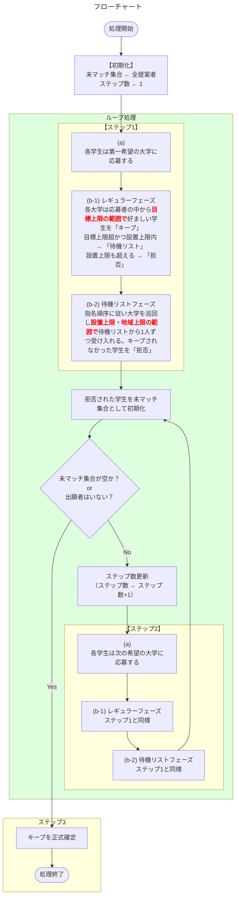

## はじめに


前回はDAアルゴリズムを紹介しました。その中で安定性を満たすことがDAアルゴリズムの特徴であることを説明し、Pythonのソースコードとその動作確認を行いました。本記事では安定性を弱めた「弱安定性」と呼ばれる性質を説明し、制約付きマッチング問題の解決方法としてFDAアルゴリズムを紹介します。

- 【**想定する読者**】マッチング理論の初学者エンジニア
- [【理論編】マッチング理論](https://qiita.com/_it_/items/1cdd9059282cb774f8cc)
- [【実装編】DAアルゴリズム](https://qiita.com/_it_/items/fc3d58a337d2eb6f2408)
- [【実装編】FDAアルゴリズム](https://qiita.com/_it_/items/0b30fe9acdb55c7e8897) ← 今回はここ！
- [【実装編】CAアルゴリズム](https://qiita.com/_it_/items/75f1f63e3d57a3de4aaf)
- [サンプルコード](https://github.com/itokohei0/MarketDesignStudy/tree/master/%E3%83%9E%E3%83%83%E3%83%81%E3%83%B3%E3%82%B0%E7%90%86%E8%AB%96)

FDAアルゴリズム（Flexible Deferred Acceptance / 柔軟な受入保留方式）は**地域上限制約のもとで弱安定マッチングを求めるアルゴリズム**です。

#### FDAアルゴリズムのマッチング結果が満たす性質（弱安定性について）


| 性質       | 結果  | 補足                                                         |
| ---------- | :---: | ------------------------------------------------------------ |
| 個人合理性 |   ✅   | どの参加者によってもブロックされないこと                     |
| 耐戦略性   |   ✅   | 提案者側において耐戦略性を満たす。受入側は満たさない。       |
| 安定性     |   ❌   | 地域上限制約のもとでは安定マッチングの**存在が保証されない** |
| 弱安定性   |   ✅   | 設置上限・地域上限を考慮した安定性の条件を弱めた性質         |

弱安定性の定義の前に、制約付きマッチングではこれまでの学校 $c$ の定員$q_c$に加え、新たに設置上限$q_{c_{max}}$と地域上限 $q_{r}$を制約として扱います。

| パラメータ | 記号          | 役割                     |
| ---------- | ------------- | ------------------------ |
| 設置上限   | $q_{c_{max}}$ | $c$ の物理的な最大受入数 |
| 地域上限   | $q_{r}$       | 地域 $r$ の合計受入上限  |

以降に示す動作確認でわかるのですが、実は上記の制約のもとでは安定性の存在が保証されません。そこで安定性を見直し、以下に示す「**弱安定性**」を定義します。

**弱安定性の定義**

- 実行可能である（$|\mu_c|\leqq q_{c_{max}}$ かつ $|\mu_r|\leqq q_{r}$）
- 個人合理性を満たす
- ブロッキングペアのうち以下の2つを満たすときはブロックを許容する
  1. 【**受入数の条件**】地域 $r$ の合計受入数が地域上限に達している（$|\mu(r)| = q_{r}$）
  2. 【**選好の条件**】大学 $c$ は現在受け入れている全員を学生 $s$ より好む（$\mu(c)\succ_c s$）


:::note info
【**安定性と弱安定性の違い**】
安定性は条件に受入側の定員 $q_c$ を扱います。一方、弱安定性では設置上限 $q_{c_{max}}$ と地域上限 $q_r$ を条件に扱います。このことから、安定性と弱安定性では定員に関して扱うパラメータが異なります。その他の個人合理性や選好については同じ性質を持ちます。
:::


## 課題設定とアルゴリズム


- 応募者（例：学生 $s$）$n$ 人と受入者（例：大学 $c$）$m$ 校
- 参加者は相手全員に対する選好（好み順）を持つ
- 地域ごとに**地域上限** $q_r$ が設定される
- 各大学（受入側）は**目標上限** $q_c$、**設置上限** $q_{c_{\max}}$、**所属地域** $r(c)$ を持つ

### アルゴリズム

DAアルゴリズムの「受入フェーズ」を **レギュラーフェーズ** と **待機リストフェーズ** の2段階に分けることが、FDAの特徴です。

- 【**ステップ1**】
  - （**a**）各学生は受け入れ可能な第1希望の大学に応募する（なければ$\emptyset$）。
  - （**b-1：レギュラーフェーズ**）各大学は応募してきた学生の中から好ましい順に**目標上限の範囲内で**キープする。目標上限からあふれたが設置上限に余裕がある学生は**待機リスト（wait list）** に加える。設置上限も超える場合のみ即時拒否する。
  - （**b-2：待機リストフェーズ**）予め決められた**指名順序**に従って大学を1つずつ巡回し、待機リストにいる学生を**設置上限と地域上限の範囲内で**1人ずつ受け入れる。地域上限が満員になるか、各待機リストが空になるまで繰り返す。ここでキープされなかった学生は拒否され、次のステップへ進む。
- 【**ステップ2**】
  - （**a**）前のステップで拒否された各学生は次に希望する大学に応募する（なければ$\emptyset$）。
  - （**b-1：レギュラーフェーズ**）各大学は応募してきた学生とすでにキープしている学生の合計から、**目標上限の範囲内で**キープする。あふれた学生は待機リストへ追加する。
  - （**b-2：待機リストフェーズ**）ステップ1と同様に指名順序に従って待機リストから受け入れを行う。
- 【**ステップ3**】応募がなくなるまでステップ2を繰り返す。最後に大学がキープしている学生を正式に採用してマッチングが確定する。

<details><summary><b>フローチャート</b></summary>



</details>


## プログラム

以下に実装したソースコードの主要部分を示します。

### データ構造

DAアルゴリズムと比較して、今回FDAアルゴリズムの実装では `Input` のデータクラスに4つのパラメータを追加します。ここで、DAの `Input`  の `capacities` はDAの定員ではなく「**目標上限**（レギュラーフェーズの閾値）」に用語が変わっていますが、実装上の役割は変わりません。


**DAアルゴリズムから新たに追加するパラメータ**

| パラメータ         | 記号           | 役割                                     |
| ------------------ | -------------- | ---------------------------------------- |
| `max_caps[j]`      | $q_{c_{\max}}$ | 設置上限（物理的な最大受入数）           |
| `regions[j]`       | $r(c)$         | 受入者 $j$ が属する地域                  |
| `regional_caps[r]` | $q_r$          | 地域 $r$ の受け入れ合計上限              |
| `nomination_order` | —              | 待機リストフェーズで受入者を指名する順序 |


```diff_python
from dataclasses import dataclass

@dataclass
class Input:
    proposer_prefs: list[list[int]]
    receiver_prefs: list[list[int]]
    capacities:     list[int]
+   max_caps:         list[int]            # ← 【追加】受入者 j の設置上限（物理的な最大）
+   regions:          list[int]            # ← 【追加】受入者 j が属する地域
+   regional_caps:    list[int]            # ← 【追加】地域 r の上限
+   nomination_order: list[int]            # ← 【追加】待機リストフェーズでの受入者の指名順序
    proposer_names: list[str] | None = None
    receiver_names: list[str] | None = None

    @property
    def n_proposers(self) -> int:
        return len(self.proposer_prefs)

    @property
    def n_receivers(self) -> int:
        return len(self.receiver_prefs)

    def p_name(self, i: int) -> str:
        return self.proposer_names[i] if self.proposer_names else f"P{i+1}"

    def r_name(self, j: int) -> str:
        return self.receiver_names[j] if self.receiver_names else f"R{j+1}"


@dataclass
class Result:
    proposer_match: list[int]
    receiver_match: list[list[int]]
```


### メインアルゴリズム

```python
def flexible_deferred_acceptance(data: Input, verbose: bool = True) -> Result:
    """
    FDA アルゴリズムを実行し、弱安定マッチングを返す。
    """
    P = data.n_proposers
    R = data.n_receivers

    # 受入者の優先順位表（r_rank[j][i] = 受入者jにとっての提案者iの順位）
    r_rank = _build_rank(data.receiver_prefs, P)

    proposer_match: list[int]        = [-1] * P   # 応募側のマッチング結果
    receiver_match: list[list[int]]  = [[] for _ in range(R)] # 受入側のマッチング結果
    wait_list:      list[list[int]]  = [[] for _ in range(R)]
    next_proposal:  list[int]        = [0]  * P   # 次に応募する志望順位
    free: set[int] = set(range(P))                # 未マッチの提案者

    if verbose:
        _print_preferences(data)
        print("=== FDA アルゴリズム 開始 ===\n")

    step = 1
    while free:
        if verbose:
            print(f"--- ステップ {step} ---")

        # (a) 提案フェーズ
        proposals: dict[int, list[int]] = {r: [] for r in range(R)}
        for p in list(free):
            if next_proposal[p] >= len(data.proposer_prefs[p]):
                if verbose:
                    print(f"  {data.p_name(p)}: 全受入者に提案済み → 未マッチ")
                continue
            r = data.proposer_prefs[p][next_proposal[p]] - 1
            next_proposal[p] += 1
            proposals[r].append(p)
            if verbose:
                print(f"  {data.p_name(p)} → {data.r_name(r)} に提案")
        free.clear()

        # (b-1) レギュラーフェーズ
        if verbose:
            print(f"\n  【レギュラーフェーズ】")

        for r in range(R):
            if not proposals[r]:
                continue

            # 現在の仮受入者 + 新しい提案者を優先順位順にソート
            candidates = sorted(
                receiver_match[r] + proposals[r],
                key=lambda p: r_rank[r][p],
            )
            keep     = candidates[:data.capacities[r]]   # 定員分だけキープ
            overflow = candidates[data.capacities[r]:]   # 溢れた提案者

            # 仮受入を更新（弾かれた提案者は解放）
            for p in receiver_match[r]:
                if p not in keep:
                    proposer_match[p] = -1
            receiver_match[r] = list(keep)
            for p in keep:
                proposer_match[p] = r

            # 溢れた提案者を待機リストへ追加（設置上限の範囲内）
            rejected_by_cap = []
            for p in overflow:
                if len(receiver_match[r]) + len(wait_list[r]) < data.max_caps[r]:
                    wait_list[r].append(p)   # 即時拒否せず待機リストへ
                else:
                    free.add(p)              # 設置上限も超える場合のみ拒否
                    rejected_by_cap.append(p)

            if verbose:
                keep_str = ", ".join(data.p_name(p) for p in keep)
                wait_str = ", ".join(data.p_name(p) for p in wait_list[r])
                print(f"    {data.r_name(r)}: キープ=[{keep_str}]  待機=[{wait_str}]")
                if rejected_by_cap:
                    rej_str = ", ".join(data.p_name(p) for p in rejected_by_cap)
                    print(f"      → 設置上限（{data.max_caps[r]}人）により拒否: [{rej_str}]")

        # (b-2) 待機リストフェーズ
        if verbose:
            print(f"\n  【待機リストフェーズ】")

        # 地域ごとの現在マッチ数を集計
        regional_count = [0] * len(data.regional_caps)
        for r, matched in enumerate(receiver_match):
            for p in matched:
                regional_count[data.regions[r]] += 1

        for r in data.nomination_order:
            region = data.regions[r]
            release_reason = None
            while wait_list[r]:
                # 地域上限チェック
                if regional_count[region] >= data.regional_caps[region]:
                    release_reason = f"地域上限（{data.regional_caps[region]}人）により拒否"
                    if verbose:
                        print(f"    {data.r_name(r)}: を受入なし")
                    break
                # 設置上限チェック
                if len(receiver_match[r]) >= data.max_caps[r]:
                    release_reason = f"設置上限（{data.max_caps[r]}人）により拒否"
                    if verbose:
                        print(f"    {data.r_name(r)}: を受入なし")
                    break
                # 待機リストから最優先の提案者を1人受入
                best = min(wait_list[r], key=lambda p: r_rank[r][p])
                wait_list[r].remove(best)
                receiver_match[r].append(best)
                proposer_match[best] = r
                regional_count[region] += 1
                if verbose:
                    print(f"    {data.r_name(r)}: {data.p_name(best)} を受入"
                          f"（地域{region}: {regional_count[region]}"
                          f"/{data.regional_caps[region]}）")

            # 上限を超えて受入拒否された参加者の情報を出力
            if verbose and wait_list[r] and release_reason:
                rel_str = ", ".join(data.p_name(p) for p in wait_list[r])
                print(f"      → {release_reason}: [{rel_str}]")

            # 残った待機リストの提案者は次のステップへ
            for p in wait_list[r]:
                free.add(p)
            wait_list[r] = []

        if verbose:
            print()
        step += 1

    result = Result(
        proposer_match=proposer_match,
        receiver_match=receiver_match,
    )

    print("=== FDA アルゴリズム 終了 ===\n")
    _print_result(result, data)
    return result
```


### 動作確認

例2と3は安定性と弱安定性を比較するために恣意的に設定したデータになります。FDAアルゴリズムにおいて、なぜ安定性を弱めた「**弱安定性**」を望ましい性質にしたのか分かるかと思います。

#### 【例1】安定性✅ かつ 弱安定性✅（研修医10人・病院2施設、地域上限=10）

| パラメータ       |  北部医療センター  |  南部医療センター  |
| ---------------- | :----------------: | :----------------: |
| 目標上限         |         3          |         5          |
| 設置上限         |         10         |         10         |
| 地域（地域上限） | 地域$\alpha$（10） | 地域$\alpha$（10） |

<details><summary><b>【例1】の動作確認用Pythonコード</b></summary>

```python
from fda_algorithm import Input, flexible_deferred_acceptance

resident_names = ["花田", "石橋", "坂本", "岡田", "池田",
                  "丸山", "福島", "今井", "谷口", "村山"]

data = Input(
    proposer_prefs=[[1]] * 3 + [[2]] * 7,   # 花田〜坂本→北部のみ、岡田〜村山→南部のみ
    receiver_prefs=[
        list(range(1, 11)),   # 北部医療センター: 花田>石橋>...>村山
        list(range(1, 11)),   # 南部医療センター: 花田>石橋>...>村山
    ],
    capacities=[3, 5],        # 目標上限
    max_caps=[10, 10],        # 設置上限
    regions=[0, 0],           # 両病院とも地域α
    regional_caps=[10],       # 地域αの上限
    nomination_order=[0, 1],  # 北部→南部の順に指名
    proposer_names=resident_names,
    receiver_names=["北部医療センター", "南部医療センター"],
)

result = flexible_deferred_acceptance(data)
```

</details>

**実行トレース**

| ステップ | フェーズ          | 内容                                                                                                            | 拒否 |
| -------- | ----------------- | --------------------------------------------------------------------------------------------------------------- | ---- |
| 1        | (a) 提案          | ◼花田・石橋・坂本 → 北部、岡田〜村山（7人）→ 南部                                                               | —    |
| 1        | (b-1) レギュラー  | ◼北部キープ=[花田,石橋,坂本]（定員3）待機=[]<br>◼南部キープ=[岡田,池田,丸山,福島,今井]（定員5）待機=[谷口,村山] | —    |
| 1        | (b-2) 待機リスト  | ◼地域$\alpha$：8人→南部が谷口を受入（9/10）→村山を受入（10/10）                                                 | なし |
| —        | 全員マッチ → 終了 |                                                                                                                 |      |

```bash
...
=== FDA アルゴリズム 終了 ===

【マッチング結果】
  花田: 北部医療センター
  石橋: 北部医療センター
  坂本: 北部医療センター
  岡田: 南部医療センター
  池田: 南部医療センター
  丸山: 南部医療センター
  福島: 南部医療センター
  今井: 南部医療センター
  谷口: 南部医療センター
  村山: 南部医療センター
```


**弱安定性の確認**

| 性質       | 結果  | 補足                                                            |
| ---------- | :---: | --------------------------------------------------------------- |
| 個人合理性 |   ✅   |                                                                 |
| 安定性     |   ✅   | 定員に設置上限$q_{c_{max}}$を使用しているため、安定性を満たす。 |
| 弱安定性   |   ✅   |                                                                 |


#### 【例2】安定性❌ かつ 弱安定性✅（研修医4人・病院2施設（同じ地域所属）、地域上限=2）

| パラメータ       |      東病院       |      西病院       |
| ---------------- | :---------------: | :---------------: |
| 目標上限         |         1         |         1         |
| 設置上限         |         3         |         3         |
| 地域（地域上限） | 地域$\alpha$（2） | 地域$\alpha$（2） |

<details><summary><b>【例2】の動作確認用Pythonコード</b></summary>

```python
from fda_algorithm import Input, flexible_deferred_acceptance

data = Input(
    proposer_prefs=[
        [1, 2],   # 西村: 東病院 > 西病院
        [1, 2],   # 川上: 東病院 > 西病院
        [2, 1],   # 北川: 西病院 > 東病院
        [2, 1],   # 南田: 西病院 > 東病院
    ],
    receiver_prefs=[
        [1, 2, 3, 4],   # 東病院: 西村 > 川上 > 北川 > 南田
        [3, 4, 1, 2],   # 西病院: 北川 > 南田 > 西村 > 川上
    ],
    capacities=[1, 1],     # 目標上限（レギュラーフェーズの閾値）
    max_caps=[3, 3],       # 設置上限（物理的な最大）
    regions=[0, 0],        # 両病院とも地域α
    regional_caps=[2],     # 地域α全体の上限 = 2人
    nomination_order=[0, 1],
    proposer_names=["西村", "川上", "北川", "南田"],
    receiver_names=["東病院", "西病院"],
)

result = flexible_deferred_acceptance(data)
```

</details>

**実行トレース**

| ステップ | フェーズ                     | 内容                                                                                       | 拒否       |
| -------- | ---------------------------- | ------------------------------------------------------------------------------------------ | ---------- |
| 1        | (a) 提案                     | 西村・川上 → 東病院、北川・南田 → 西病院                                                   | —          |
| 1        | (b-1) レギュラー             | ◼東病院キープ=[西村]（定員1）待機=[川上]<br>◼西病院キープ=[北川]（定員1）待機=[南田]       | —          |
| 1        | (b-2) 待機リスト             | ◼地域$\alpha$：2人（西村+北川）= **地域上限到達** → 川上・南田は受け入れ不可               | 川上・南田 |
| 2        | (a) 提案                     | ◼川上 → 西病院、南田 → 東病院                                                              | —          |
| 2        | (b-1) レギュラー             | ◼東病院キープ=[西村]（変化なし）待機=[南田]<br>◼西病院キープ=[北川]（変化なし）待機=[川上] | —          |
| 2        | (b-2) 待機リスト             | ◼地域$\alpha$：2人 = **地域上限到達** → 川上・南田は受け入れ不可                           | 川上・南田 |
| 3        | (a) 提案                     | ◼川上・南田: 全病院に提案済み → 未マッチ                                                   | —          |
| —        | 終了（川上・南田は未マッチ） |                                                                                            |            |

```bash
...
=== FDA アルゴリズム 終了 ===

【マッチング結果】
  西村: 東病院
  川上: 未マッチ
  北川: 西病院
  南田: 未マッチ
```

**弱安定性の確認**

| 性質       | 結果  | 補足                                                                               |
| ---------- | :---: | ---------------------------------------------------------------------------------- |
| 個人合理性 |   ✅   |                                                                                    |
| 安定性     |   ❌   | 地域上限（2人）によりブロッキングペアが発生： [`(南田, 東病院)`, `(川上, 西病院)`] |
| 弱安定性   |   ✅   | 設置上限は未到達だが地域上限到達が理由                                             |


:::note info
**【補足】安定性❌ かつ 弱安定性✅ の理由**

安定性におけるブロッキングペアでは「地域上限」というパラメータを制御できないため、ブロッキングペアとして検出されます（安定性❌）。しかし、弱安定性におけるブロッキングペアは「地域上限」を考慮しているため、ブロッキングペアとして判定されません（弱安定性✅）。

地域上限制約のもとではブロッキングペアが発生しても「地域枠が満員なので仕方がない」と許容する設計思想が弱安定性です。
:::


#### 【例3】安定性❌ かつ 弱安定性✅（社員18人・部署6つ・地域3つのケース）

| パラメータ       |        営業1課         |    基幹システム課     |      製品開発課       |       経営企画課       |       商品企画課       |    マーケティング課    |
| ---------------- | :--------------------: | :-------------------: | :-------------------: | :--------------------: | :--------------------: | :--------------------: |
| 目標上限         |           2            |           4           |           4           |           2            |           1            |           1            |
| 設置上限         |           3            |           5           |           5           |           3            |           2            |           2            |
| 地域（地域上限） | 地域$\alpha$（上限 3） | 地域$\beta$（上限 8） | 地域$\beta$（上限 8） | 地域$\gamma$（上限 7） | 地域$\gamma$（上限 7） | 地域$\gamma$（上限 7） |

<details><summary><b>【例3】の動作確認用Pythonコード</b></summary>

```python
from fda_algorithm import Input, flexible_deferred_acceptance

employee_names = [
    "田中", "鈴木", "佐藤",
    "高橋", "渡辺", "伊藤", "山本", "中村",
    "加藤", "吉田", "山田", "佐々木", "松本",
    "井上", "木村", "中山",
    "林", "清水",
]

data = Input(
    proposer_prefs=(
        [[1, 2, 3, 4, 5, 6]] * 3 +   # 田中・鈴木・佐藤: 営業1課 > 基幹 > 製品開発 > 経営企画 > 商品企画 > マーケ
        [[2, 5, 6, 4, 3, 1]] * 5 +   # 高橋〜中村:      基幹 > 商品企画 > マーケ > 経営企画 > 製品開発 > 営業1課
        [[3, 5, 6, 4, 2, 1]] * 5 +   # 加藤〜松本:      製品開発 > 商品企画 > マーケ > 経営企画 > 基幹 > 営業1課
        [[4, 5, 6, 1, 2, 3]] * 3 +   # 井上・木村・中山: 経営企画 > 商品企画 > マーケ > 営業1課 > 基幹 > 製品開発
        [[5, 6, 4, 1, 2, 3]] * 1 +   # 林:              商品企画 > マーケ > 経営企画 > 営業1課 > 基幹 > 製品開発
        [[6, 5, 4, 1, 2, 3]] * 1     # 清水:            マーケ > 商品企画 > 経営企画 > 営業1課 > 基幹 > 製品開発
    ),
    receiver_prefs=[
        list(range(1, 19)),                                                  # 営業1課
        [4, 5, 6, 7, 8, 1, 2, 3, 9, 10, 11, 12, 13, 14, 15, 16, 17, 18],   # 基幹システム課
        [9, 10, 11, 12, 13, 4, 5, 6, 7, 8, 1, 2, 3, 14, 15, 16, 17, 18],   # 製品開発課
        [14, 15, 16, 1, 2, 3, 4, 5, 6, 7, 8, 9, 10, 11, 12, 13, 17, 18],   # 経営企画課
        [17, 1, 2, 3, 4, 5, 6, 7, 8, 9, 10, 11, 12, 13, 14, 15, 16, 18],   # 商品企画課
        [18, 1, 2, 3, 4, 5, 6, 7, 8, 9, 10, 11, 12, 13, 14, 15, 16, 17],   # マーケティング課
    ],
    capacities=[2, 4, 4, 2, 1, 1],        # 目標上限（β合計=8=地域上限、レギュラーフェーズで満杯）
    max_caps=[3, 5, 5, 3, 2, 2],           # 設置上限
    regions=[0, 1, 1, 2, 2, 2],            # 地域α=0, β=1, γ=2
    regional_caps=[3, 8, 7],               # 各地域の上限
    nomination_order=[0, 1, 2, 3, 4, 5],   # 対称的な指名順序
    proposer_names=employee_names,
    receiver_names=["営業1課", "基幹システム課", "製品開発課", "経営企画課", "商品企画課", "マーケティング課"],
)

result = flexible_deferred_acceptance(data)
```

</details>

**実行トレース**

| ステップ | フェーズ         | 内容                                                                                                                                                                                                                                                                                                                                | 拒否（フリーへ）                    |
| -------- | ---------------- | ----------------------------------------------------------------------------------------------------------------------------------------------------------------------------------------------------------------------------------------------------------------------------------------------------------------------------------- | ----------------------------------- |
| 1        | (a) 提案         | ◼田中・鈴木・佐藤 → 営業1課<br>◼高橋・渡辺・伊藤・山本・中村 → 基幹システム課<br>◼加藤・吉田・山田・佐々木・松本 → 製品開発課<br>◼井上・木村・中山 → 経営企画課<br>◼林 → 商品企画課  ◼清水 → マーケティング課                                                                                                                       | —                                   |
| 1        | (b-1) レギュラー | ◼営業1課:キープ=[田中,鈴木]（定員2）待機=[佐藤]<br>◼基幹システム課:キープ=[高橋,渡辺,伊藤,山本]（**定員4**）待機=[中村]<br>◼製品開発課:キープ=[加藤,吉田,山田,佐々木]（**定員4**）待機=[松本]<br>◼経営企画課:キープ=[井上,木村]（定員2）待機=[中山]<br>◼商品企画課:キープ=[林]（定員1）<br>◼マーケティング課:キープ=[清水]（定員1） | —                                   |
| 1        | (b-2) 待機リスト | ◼営業1課: 佐藤を受入（$\alpha$：3/3）<br>◼経営企画課: 中山を受入（γ: 5/7）<br>◼基幹・製品開発: キープ合計=**4+4=8=地域$\beta$上限** → 待機リスト処理前に地域β満杯 → **中村・松本を解放**                                                                                                                                            | 中村・松本（地域$\beta$満杯のため） |
| 2        | (a) 提案         | ◼中村 → 商品企画課（第2志望）<br>◼松本 → 商品企画課（第2志望）                                                                                                                                                                                                                                                                      | —                                   |
| 2        | (b-1) レギュラー | ◼商品企画課: 候補=[林,中村,松本]→キープ=[林]（定員1）<br>　松本は設置上限（1+1=2）に阻まれ即時拒否、中村は待機リストへ                                                                                                                                                                                                              | 松本                                |
| 2        | (b-2) 待機リスト | ◼商品企画課: 中村を受入（$\gamma$：6/7）                                                                                                                                                                                                                                                                                            | —                                   |
| 3        | (a) 提案         | ◼松本 → マーケティング課（第3志望）                                                                                                                                                                                                                                                                                                 | —                                   |
| 3        | (b-1) レギュラー | ◼マーケティング課:キープ=[清水]（定員1）待機=[松本]                                                                                                                                                                                                                                                                                 | —                                   |
| 3        | (b-2) 待機リスト | ◼マーケティング課: 松本を受入（**$\gamma$：7/7 満杯**）→ **全員マッチ**                                                                                                                                                                                                                                                             | —                                   |

```bash
...
=== FDA アルゴリズム 終了 ===

【マッチング結果】
  田中: 営業1課
  鈴木: 営業1課
  佐藤: 営業1課
  高橋: 基幹システム課
  渡辺: 基幹システム課
  伊藤: 基幹システム課
  山本: 基幹システム課
  中村: 商品企画課
  加藤: 製品開発課
  吉田: 製品開発課
  山田: 製品開発課
  佐々木: 製品開発課
  松本: マーケティング課
  井上: 経営企画課
  木村: 経営企画課
  中山: 経営企画課
  林: 商品企画課
  清水: マーケティング課
```

**【補足】弱安定性の確認**

| 性質       | 結果  | 補足                                                                                                        |
| ---------- | :---: | ----------------------------------------------------------------------------------------------------------- |
| 個人合理性 |   ✅   |                                                                                                             |
| 安定性     |   ❌   | 地域$\beta$の地域上限（8人）によりブロッキングペアが発生： [`(中村, 基幹システム課)`, `(松本, 製品開発課)`] |  |
| 弱安定性   |   ✅   |                                                                                                             |


## 参考文献

- [マッチング理論とマーケットデザイン](https://www.amazon.co.jp/dp/453555935X)
- [マーケットデザイン総論 (シリーズ マーケットデザイン)](https://www.amazon.co.jp/dp/4320096819)
