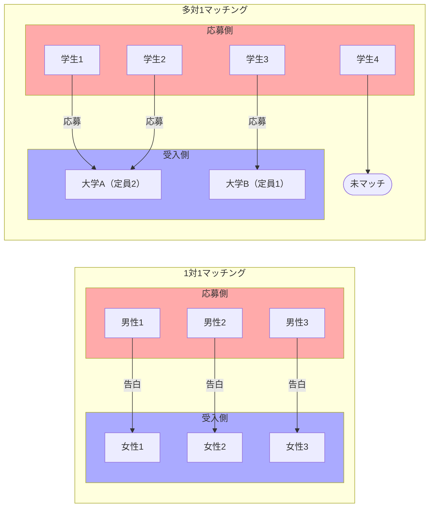
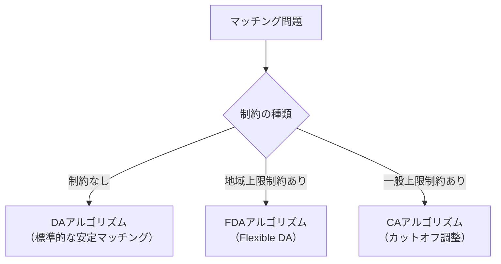

## はじめに

今回、マッチング理論の勉強をしていく中でエンジニアとしてソースコードを作って動きを確認しながら勉強しました。その振り返りも兼ねて記事を作成しました。

- 【**想定する読者**】マッチング理論の初学者エンジニア
- [【理論編】マッチング理論](https://qiita.com/_it_/items/1cdd9059282cb774f8cc) ← 今回はここ！
- [【実装編】DAアルゴリズム](https://qiita.com/_it_/items/fc3d58a337d2eb6f2408)
- [【実装編】FDAアルゴリズム](https://qiita.com/_it_/items/0b30fe9acdb55c7e8897)
- [【実装編】CAアルゴリズム](https://qiita.com/_it_/items/75f1f63e3d57a3de4aaf)
- [サンプルコード](https://github.com/itokohei0/MarketDesignStudy/tree/master/%E3%83%9E%E3%83%83%E3%83%81%E3%83%B3%E3%82%B0%E7%90%86%E8%AB%96)

1エンジニアの独学で作った記事なので間違った内容を含むと思います。遠慮なくコメントいただけますと幸いです。

## 【基礎】数式や各種用語の説明

マッチング理論とは、価格を介さず（もしくは重要とせず）、「人と人・人とモノの組合せ」を考える経済学の分野です。例えば、以下の例があります。

- 結婚マッチング
- 大学入試における学生と大学のマッチング
- 配属先マッチング
- 医師の研修病院への配属
- Etc...

この記事では、後続の実装記事（DAアルゴリズム・FDAアルゴリズム・CAアルゴリズム）を理解するために必要な用語や理論的背景を整理します。

本記事では**学生** $s \in S$ を応募側、**大学** $c \in C$ を受入側として定式化します。

| 要素                | 記号      | 説明                                                           |
| ------------------- | --------- | -------------------------------------------------------------- |
| 学生の集合          | $S$       | 選好を持ち、相手に応募する側（例: 学生、研修医）               |
| 大学の集合          | $C$       | 選好または優先順位を持ち、応募を受け入れる側（例: 大学、病院） |
| 学生 $s$ の選好     | $\succ_s$ | 学生 $s$ にとっての大学の好ましい順序                          |
| 大学 $c$ の優先順位 | $\succ_c$ | 大学 $c$ にとっての学生の好ましい順序                          |
| 大学 $c$ の定員     | $q_c$     | 大学 $c$ が受け入れられる学生の最大数                          |

**マッチング $\mu$** とは、学生と大学を対応づける関数です。$\mu(s) \in C$ は学生 $s$ の入学先を、$\mu(c) \subseteq S$ は大学 $c$ が受け入れる学生の集合を表します。未マッチの場合は $\mu(s) = \emptyset$ と書きます。

選好 $\succ_s$ の読み方：$c \succ_s c'$ は「学生 $s$ にとって大学 $c$ は大学 $c'$ より好ましい」を意味します。同様に $s \succ_c s'$ は「大学 $c$ にとって学生 $s$ は学生 $s'$ より優先される」を意味します。

#### 対象とするマッチング → 両側マッチング・1対1・多対1

本記事では、学生側（や研修医側）と大学側（や病院側）がともに選好を持つ**両側マッチング**（Two-Sided Matching）を対象とします。一方のみが選好を持つ片側マッチング（例: 学校選択制でランダム配分）とは区別します。

扱うマッチングは次の2種類です。

| 種類            | 代表例                         |
| --------------- | ------------------------------ |
| 1対1マッチング  | 男女マッチング、腎臓交換       |
| 多対1マッチング | 大学入試、研修医配属、部署配属 |

## 【取り扱う3つのアルゴリズム】〜DA・FDA・CA〜

### ⓪【早見表】アルゴリズムの位置付けと比較

本シリーズで実装する3つのアルゴリズムは、マッチングに課される**制約の種類**によって使い分けます。

| アルゴリズム                  | 問題設定                              | 達成する主な性質                                           |
| ----------------------------- | ------------------------------------- | ---------------------------------------------------------- |
| **DA**（Deferred Acceptance） | 標準的な多対1マッチング（制約なし）   | 安定性・学生側耐戦略性・学生最適安定マッチング             |
| **FDA**（Flexible DA）        | **地域上限制約**付きの多対1マッチング | 弱安定性・学生側耐戦略性                                   |
| **CA**（Cutoff Adjustment）   | **一般上限制約**付きの多対1マッチング | 公平性・学生側耐戦略性（条件付き）・学生最適公平マッチング |

各アルゴリズムの性質の詳細は下表の通りです。

<table style="text-align:center;">
  <caption><b>アルゴリズム比較表</b></caption>
  <tr>
      <th>性質</th>
      <th>DAアルゴリズム</th>
      <th>FDAアルゴリズム</th>
      <th>CAアルゴリズム</th>
  </tr>
  <tr>
      <td>個人合理性</td>
      <td>✅</td>
      <td>✅</td>
      <td>✅</td>
  </tr>
  <tr>
      <td>安定性</td>
      <td>✅</td>
      <td>❌</td>
      <td>❌</td>
  </tr>
  <tr style="border-bottom: 4px double #000000;">
      <td>耐戦略性（応募側）</td>
      <td>✅</td>
      <td>✅</td>
      <td>⚠️ 条件付き</td>
  </tr>
  <tr style="border-bottom: 4px double #000000;">
      <td>弱安定性（FDAで登場）</td>
      <td>—</td>
      <td>✅</td>
      <td>—</td>
  </tr>
  <tr>
      <td>公平性（CAで登場）</td>
      <td>—</td>
      <td>—</td>
      <td>✅</td>
  </tr>
  <tr>
      <td>効率性（CAで登場）</td>
      <td>—</td>
      <td>—</td>
      <td>❌</td>
  </tr>
</table>

:::note info
「—」はその段階で導入されない概念であることを示し、❌はその性質が保証されない、もしくは満たされないことを示します。FDAとCAが安定性を満たさないのは制約が存在する場合に安定マッチング自体が存在しないか、制約を守りながら安定性を達成することが理論的に不可能なためです。FDAは「$\text{安定性 → 弱安定性}$」へ、CAは「$\text{安定性 → 公平性}$ 」へと目標を再設定することで対処します。
:::

### ①DAアルゴリズム（Deferred Acceptance）

DAアルゴリズムは Gale と Shapley（1962）が提案した**安定マッチングを求めるアルゴリズム**です。「学生が大学に出願し、大学が**仮**合格・不合格を繰り返す」入試プロセスを模しており、「仮受入」がポイントです。より好ましい出願者が来たら取り消せるため、最終的に安定したマッチングが実現します。

- **問題設定**: 標準的な1対1・多対1マッチング（制約なし）

### ②FDAアルゴリズム（Flexible Deferred Acceptance）

FDAアルゴリズムは**地域上限制約のもとで弱安定マッチングを求めるアルゴリズム**です。

- **問題設定**: **地域上限制約**付きの多対1マッチング
- **背景**: 日本の研修医マッチング制度において、地方への研修医配置のため病院ごとの「目標上限」と「地域上限」が設定されており、DAアルゴリズムでは地域制約を考慮できない（制御パラメータとして保持していない）ため、地域枠に余裕があるにも関わらず未マッチが発生していました。この問題を解決する方法としてFDAアルゴリズムを紹介します。

### ③CAアルゴリズム（Cutoff Adjustment Algorithm）

CAアルゴリズムは**一般上限制約のもとで最適公平マッチング（OFM：Optimal Fair Matching）を求めるアルゴリズム**です。

- **問題設定**: **一般上限制約**付きの多対1マッチング（例: 保育園マッチング）
- **背景**: 保育園の年齢別受け入れ制約（保育士1人あたりの担当可能人数が年齢ごとに異なる）や予算制約（1人を受け入れるのに必要な費用的・時間的コスト）などの複雑な制約に対応。DAでは適切なマッチングが得られない。

## 【まとめ】

| アルゴリズム | 問題設定                   | 達成する特有の性質 |
| ------------ | -------------------------- | ------------------ |
| **DA**       | 標準的な多対1マッチング    | 安定性             |
| **FDA**      | 地域上限制約付きマッチング | 弱安定性           |
| **CA**       | 一般上限制約付きマッチング | 公平性             |

## 【参考文献】

- [マッチング理論とマーケットデザイン](https://www.amazon.co.jp/dp/453555935X)
- [マーケットデザイン総論 (シリーズ マーケットデザイン)](https://www.amazon.co.jp/dp/4320096819)
