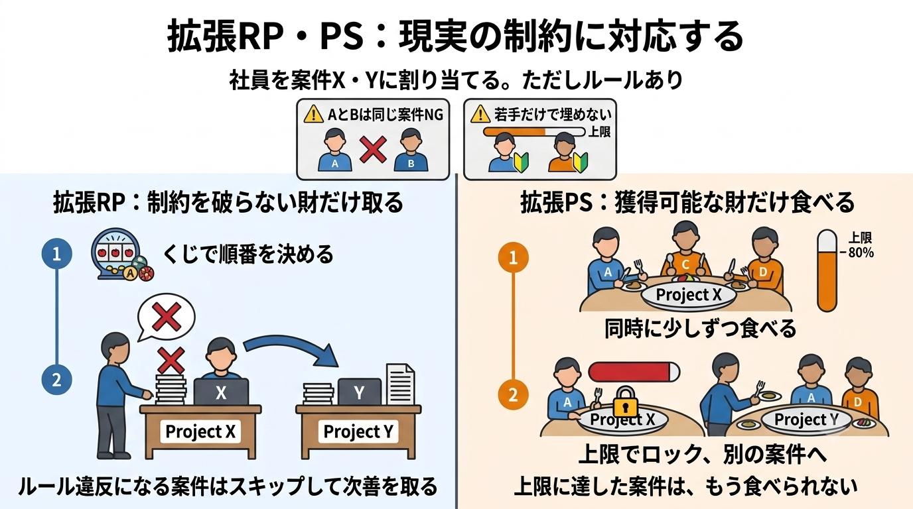
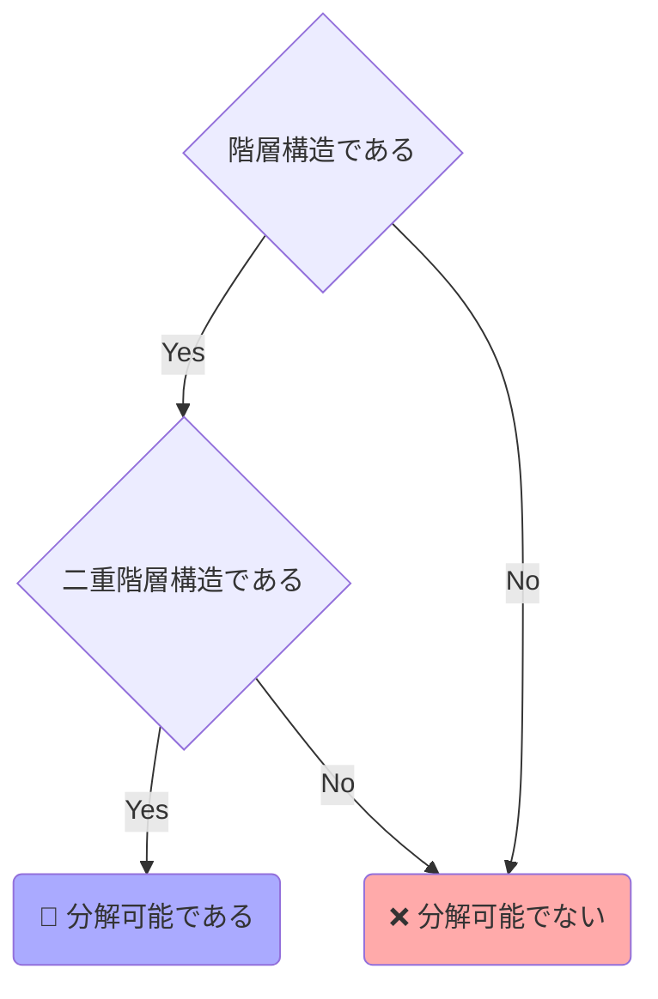

## はじめに

<!-- バナー画像をここに貼る（例: 2RPPS_ext.png）。前作の 1DA.png と同じ要領で Qiita にアップロードしてURLを差し込む -->


前回は「各財の供給数が1・各人は高々1つ」というシンプルな割り当てを扱いました。本記事では、RP・PSメカニズムを**複雑な制約に対応**できるように拡張し、「同じ案件に入れないペア」「若手だけで固めない」といった現実的な割り当てをPythonで解きます。さらに、求めた期待行列が**実際に実現できるのか**を判定する一般理論（二重階層構造）まで踏み込みます。

- 【**想定する読者**】マッチング理論の初学者エンジニア
- 【**理論編**】マッチング理論 〜割り当て問題の共有知識〜
- 【**実装編**】RP・PSメカニズムと実際の割り当て 〜確率行列を作って「くじ」に変える〜
- 【**実装編**】RP・PSメカニズムの拡張 〜現実の制約に対応する〜 ← <font color=red><b>今回はここ！</b></font>
- [サンプルコード](https://github.com/itokohei0/MarketDesignStudy/tree/master/%E3%83%9E%E3%83%83%E3%83%81%E3%83%B3%E3%82%B0%E7%90%86%E8%AB%96)
<!-- TODO: 理論編・実装編1の公開後、上記リストにURLを差し込む -->

<font color=red>1エンジニアの独学で作った記事なので間違った内容を含むと思います。遠慮なくコメントいただけますと幸いです。</font>

### この記事のゴール

前回までの流れは「選好 → 確率行列 → 実際の割り当て」でした。今回は、この流れに**制約**を組み込みます。


題材は「**会社の案件割り当て**」です。社員（ヒト）をプロジェクト（モノ）にアサインする問題として、3つの制約シナリオを解いていきます。

---

# 第1部　制約をどう表すか

## 現実の割り当てにある制約

教科書『マッチング理論とマーケットデザイン』の第9章では、現実の割り当てに現れる制約を次のように整理しています。

| 制約           | 例                                                                      |
| -------------- | ----------------------------------------------------------------------- |
| **部分列制約** | 入学枠100のうち、多数派グループは70まで（アファーマティブ・アクション） |
| **複数列制約** | 経済学科・経営学科は各100だが、同じ建物なので合計150まで                |
| **不等式制約** | 入学者数は定員ちょうどでなく「定員以下」でよい                          |
| **部分行制約** | 1年で30科目まで、うち教養科目は15科目まで                               |

本記事の拡張メカニズムは、このうち**上限制約**（「ある個人と財の組み合わせの合計が、ある上限以下」）を扱います。

:::note info
**上限制約のみを扱う理由**
Budish et al. (2013) の一般理論は上限・下限を含む区間制約まで扱えますが、「最低◯人」のような**下限制約**を入れるとメカニズムの設計・実装が複雑になるため、本実装では対象外とします。教科書『マッチング理論とマーケットデザイン』の「獲得可能性」の定義も上限制約をベースにしているため、本記事も上限制約に絞ります。
:::

## 上限制約のモデル

上限制約は「**ペア $(i,a)$ の集合 $S$ と、その合計の上限 $\bar q_S$**」で表します。

```math
\sum_{(i,a)\in S}P_{ia}\leqq \bar q_S
```

コードでは `Constraint` データクラスで表現し、`ConstrainedInput` に制約のリストを持たせます。

```python
from dataclasses import dataclass, field
from fractions import Fraction

EMPTY = "∅"

@dataclass(frozen=True)
class Constraint:
    """上限制約集合 S：ペア (個人 i, 財 a) の集合とその和の上限 q̄_S。"""
    pairs: frozenset[tuple[int, str]]
    upper: int
    label: str = ""

@dataclass
class ConstrainedInput:
    prefs: list[list[str]]
    capacities: dict[str, int]
    constraints: list[Constraint] = field(default_factory=list)  # 追加の上限制約
    agent_names: list[str] | None = None
    # （columns / acceptable_pref などは基本版と同じ）
```

## 制約ビルダー

よく使う制約は、ヘルパー関数で組み立てます。

```python
def forbid_pair(agent_i, agent_j, goods, names=None) -> list[Constraint]:
    """社員 i, j を同じ案件に入れない（各案件で「2人の合計 ≤ 1」）。"""
    who = f"{names[0]}と{names[1]}" if names else f"社員{agent_i+1}と社員{agent_j+1}"
    return [
        Constraint(pairs=frozenset({(agent_i, a), (agent_j, a)}), upper=1,
                   label=f"{who}を案件{a}で同席させない")
        for a in goods
    ]

def at_most_juniors(juniors, good, cap, *, label=None) -> Constraint:
    """案件 good に入れる若手の人数を cap 人までに制限する。
    cap = 供給数 − 1 とすれば「若手だけで埋めない」になる。"""
    return Constraint(
        pairs=frozenset((i, good) for i in juniors),
        upper=cap,
        label=label or f"案件{good}の若手は最大{cap}人（若手だけで埋めない）",
    )
```

- `forbid_pair`：仲の悪い2人を「各案件で合計1人まで」＝同席禁止にします。
- `at_most_juniors`：ある案件に入れる若手を上限 `cap` 人に制限します。`cap =`（定員 − 1）にすれば、必ず1枠を中堅以上に確保できます。

---

# 第2部　拡張メカニズムの実装

## 拡張RPメカニズム

拡張は簡単です。くじで優先順位を決め、各人が順番に「**供給に空きがあり、関係する上限制約を破らない**」財を取るだけです。基本版との差分は `_feasible(...)` のチェックを足した点だけです。

```python
def extended_random_priority(data, *, n_samples=None, seed=None):
    columns = data.columns()
    col_index = {c: k for k, c in enumerate(columns)}
    n = data.n_agents
    orders = permutations(range(n)) if n_samples is None else _sampled_orders(...)

    counts = [[Fraction(0) for _ in columns] for _ in range(n)]
    total = 0
    for order in orders:
        remaining = dict(data.capacities)
        csum = [0] * len(data.constraints)        # 各上限制約の現在の整数和
        alloc = [EMPTY] * n
        for agent in order:
            for item in data.acceptable_pref(agent):
                if item == EMPTY:
                    break
                # 供給に空きがあり、かつ上限制約を破らない財だけを取る
                if remaining.get(item, 0) > 0 and _feasible(data, agent, item, csum):
                    alloc[agent] = item
                    remaining[item] -= 1
                    for idx, S in enumerate(data.constraints):
                        if (agent, item) in S.pairs:
                            csum[idx] += 1
                    break
        for i, good in enumerate(alloc):
            counts[i][col_index[good]] += 1
        total += 1
    rows = [[c / total for c in row] for row in counts]
    return ProbabilityMatrix(columns=columns, rows=rows, ...)

def _feasible(data, agent, item, csum) -> bool:
    """(agent, item) を含む全ての上限制約をまだ破らないか。"""
    for idx, S in enumerate(data.constraints):
        if (agent, item) in S.pairs and csum[idx] >= S.upper:
            return False
    return True
```

## 拡張PSメカニズム

PSも「食べる」過程は同じですが、各時点で食べられるのは**獲得可能（available）**な財だけになります。

:::note info
**獲得可能性（available）**
財 $a$ が個人 $i$ にとって獲得可能とは、$(i,a)$ を含むすべての上限制約 $S$ について

```math
\sum_{(j,x)\in S}P_{jx}<\bar q_S
```

がまだ成り立つ（上限に達していない）ことです。上限に達した財は、もう食べられません。
:::

差分は「食べる財を選ぶときに `_within_constraints(...)` で獲得可能性を確認する」点と、「上限制約が飽和する瞬間もイベントに含める」点です。

```python
def extended_probabilistic_serial(data):
    columns = data.columns()
    col_index = {c: k for k, c in enumerate(columns)}
    n = data.n_agents
    remaining = {g: Fraction(q) for g, q in data.capacities.items()}
    remaining[EMPTY] = None

    rows = [[Fraction(0) for _ in columns] for _ in range(n)]
    t, end = Fraction(0), Fraction(1)
    while t < end:
        alloc = [EMPTY] * n
        for agent in range(n):
            for item in data.acceptable_pref(agent):
                if item == EMPTY:
                    break
                amt = remaining[item]
                # 「供給に空きがあり、上限制約に余地がある」獲得可能な財だけ食べる
                if amt is not None and amt > 0 and _within_constraints(data, agent, item, rows, col_index):
                    alloc[agent] = item
                    break
        # 次に「財が尽きる」or「上限制約が飽和する」までの時間 Δt
        dt = end - t
        for good in set(alloc):
            amt = remaining[good]
            if amt is not None:
                dt = min(dt, amt / alloc.count(good))
        for S in data.constraints:                     # 上限制約の飽和もイベントに含める
            rate = sum(1 for i, g in enumerate(alloc) if (i, g) in S.pairs)
            if rate > 0:
                cur = sum((rows[i][col_index[a]] for (i, a) in S.pairs), Fraction(0))
                dt = min(dt, (Fraction(S.upper) - cur) / rate)
        for i, good in enumerate(alloc):
            rows[i][col_index[good]] += dt
        for good in set(alloc):
            amt = remaining[good]
            if amt is not None:
                remaining[good] = amt - alloc.count(good) * dt
        t += dt
    return ProbabilityMatrix(columns=columns, rows=rows, ...)
```

<details><summary><b>獲得可能性チェック <code>_within_constraints</code></b></summary>

```python
def _within_constraints(data, agent, item, rows, col_index) -> bool:
    """(agent, item) を含む全ての上限制約にまだ余地があるか。"""
    for S in data.constraints:
        if (agent, item) in S.pairs:
            cur = sum((rows[i][col_index[a]] for (i, a) in S.pairs), Fraction(0))
            if cur >= S.upper:
                return False
    return True
```

</details>

---

# 第3部　動作確認：会社の案件割り当て

ここからは拡張PSメカニズムで3つのシナリオを解きます。性質検証（`extended_assignment_check.py`）は numpy / scipy を使い、順序効率性は線形計画で判定します。

:::note info
**「制約の下での」順序効率性**
ここで判定する順序効率性は「**制約を満たす割り当ての中で**確率支配されない」という制約の下での順序効率性です。制約で禁止されている確率の交換は改善と見なさないため、無制約版（前回）の非巡回判定ではなく線形計画で判定します。また、紙面の都合上、各実行例では論点となる判定結果のみを表示します（耐戦略性の全数チェックは計算が重いため、反例が論点になる実行例2でのみ表示しています）。
:::

### 実行例1：1案件に複数人

案件ごとに必要人数（供給数）を変えます（A=3人, B=2人, C=1人）。社員6人のうち4人が案件Aを第1希望にして競合します。

```python
data = ConstrainedInput(
    prefs=[
        ["A", "B", "C", EMPTY],   # 佐藤
        ["A", "B", "C", EMPTY],   # 鈴木
        ["A", "C", "B", EMPTY],   # 高橋
        ["A", "B", "C", EMPTY],   # 田中
        ["B", "A", "C", EMPTY],   # 伊藤
        ["C", "B", "A", EMPTY],   # 渡辺
    ],
    capacities={"A": 3, "B": 2, "C": 1},
    agent_names=["佐藤", "鈴木", "高橋", "田中", "伊藤", "渡辺"],
)
matrix = extended_probabilistic_serial(data)
```

```bash
=== 拡張PSメカニズムの期待行列 ===
               A       B       C       ∅
佐藤         3/4     1/4       0       0
鈴木         3/4     1/4       0       0
高橋         3/4     1/8     1/8       0
田中         3/4     1/4       0       0
伊藤           0       1       0       0
渡辺           0     1/8     7/8       0
  --------------------------------------
期待人数       3       2       1       0

【制約充足】✅ 成立
【順序効率性】✅ 成立
```

案件Aを希望する4人（佐藤・鈴木・高橋・田中）が、定員3を確率 $\frac{3}{4}$ ずつで分け合っています。供給数より希望者が多くても、確率的に公平に分配されました。

### 実行例2：ペアにしてはいけない社員がいる

鈴木と高橋は同じ案件に入れません（`forbid_pair`）。2人とも案件Aを希望しますが、同席不可なので必ず別々になります。

```python
data = ConstrainedInput(
    prefs=[
        ["A", "B", "C", EMPTY],   # 佐藤
        ["A", "B", "C", EMPTY],   # 鈴木 ← ペア対象
        ["A", "B", "C", EMPTY],   # 高橋 ← ペア対象
        ["B", "A", "C", EMPTY],   # 田中
        ["B", "C", "A", EMPTY],   # 伊藤
    ],
    capacities={"A": 2, "B": 2, "C": 1},
    constraints=forbid_pair(1, 2, ["A", "B", "C"], names=("鈴木", "高橋")),
    agent_names=["佐藤", "鈴木", "高橋", "田中", "伊藤"],
)
matrix = extended_probabilistic_serial(data)
```

```bash
=== 拡張PSメカニズムの期待行列 ===
               A       B       C       ∅
佐藤         7/8       0     1/8       0
鈴木         1/2     1/4     1/4       0
高橋         1/2     1/4     1/4       0
田中         1/8     3/4     1/8       0
伊藤           0     3/4     1/4       0
  --------------------------------------
期待人数       2       2       1       0

【制約充足】✅ 成立
【順序効率性】✅ 成立
【耐戦略性】❌ 不成立
    - 佐藤 は虚偽申告 [B, A, C, ∅] で得できる可能性がある
```

鈴木と高橋は案件Aを $\frac{1}{2}$ ずつ。2人の案件Aの合計はちょうど1で、「同席させない」制約（合計 ≤ 1）が守られています。なおPSなので耐戦略性は満たしません（制約付きでも変わりません）。

### 実行例3：若手だけで案件を埋めてはいけない

若手（鈴木・高橋・伊藤）が各案件（定員2）で最大1人になるよう制限し、必ず1枠を中堅以上に確保します（`at_most_juniors`）。

```python
juniors = [1, 2, 4]  # 鈴木・高橋・伊藤
data = ConstrainedInput(
    prefs=[
        ["A", "B", EMPTY],   # 佐藤（中堅以上）
        ["A", "B", EMPTY],   # 鈴木（若手）
        ["A", "B", EMPTY],   # 高橋（若手）
        ["B", "A", EMPTY],   # 田中（中堅以上）
        ["A", "B", EMPTY],   # 伊藤（若手）
        ["B", "A", EMPTY],   # 渡辺（中堅以上）
    ],
    capacities={"A": 2, "B": 2},
    constraints=[at_most_juniors(juniors, "A", cap=1), at_most_juniors(juniors, "B", cap=1)],
    agent_names=["佐藤", "鈴木", "高橋", "田中", "伊藤", "渡辺"],
)
matrix = extended_probabilistic_serial(data)
```

```bash
=== 拡張PSメカニズムの期待行列 ===
               A       B       ∅
佐藤       11/15       0    4/15
鈴木         1/3    4/15     2/5
高橋         1/3    4/15     2/5
田中        2/15     3/5    4/15
伊藤         1/3    4/15     2/5
渡辺        2/15     3/5    4/15
  ------------------------------
期待人数       2       2       2

【制約充足】✅ 成立
【順序効率性】✅ 成立
```

若手3人の案件Aの合計は $\frac{1}{3}\times 3 = 1 \leqq 1$ で、若手上限が守られています。複雑な制約があっても、拡張PSは制約を満たしつつ順序効率的な期待行列を返せました。

---

# 第4部　拡張RP vs 拡張PS

前回、無制約のRPは順序効率性を満たさないことを見ました。**制約付きでも同じ**で、拡張RPは順序効率的とは限りませんが、**拡張PSは順序効率性を保ちます**。これをコードで確認します。

設定：財 $a,b,c$ 各1、社員1・2の選好は $a,b,c$、社員3・4は $b,a,c$。制約は「**$a$ と $c$ は合わせて1つまで**」（複数列制約）とします。

```python
prefs = [["a","b","c",EMPTY], ["a","b","c",EMPTY],
         ["b","a","c",EMPTY], ["b","a","c",EMPTY]]
pairs = frozenset([(i,"a") for i in range(4)] + [(i,"c") for i in range(4)])
cons  = [Constraint(pairs=pairs, upper=1, label="a と c は合わせて1つまで")]
```

**拡張RPの結果**

```bash
=== 拡張RPの期待行列 ===
               a       b       c       ∅
社員1       5/12    1/12       0     1/2
社員2       5/12    1/12       0     1/2
社員3       1/12    5/12       0     1/2
社員4       1/12    5/12       0     1/2

【順序効率性】❌ 不成立
    - 確率支配する制約実行可能な割当が存在（順序効率的でない / 改善量≈0.3333）
```

**拡張PSの結果**

```bash
=== 拡張PSの期待行列 ===
               a       b       c       ∅
社員1        1/2       0       0     1/2
社員2        1/2       0       0     1/2
社員3          0     1/2       0     1/2
社員4          0     1/2       0     1/2

【順序効率性】✅ 成立
```

拡張RPでは、$b$ を第1希望としない社員1・2に $b$ の確率が $\frac{1}{12}$ ずつ、$a$ を第1希望としない社員3・4に $a$ の確率が $\frac{1}{12}$ ずつ漏れてしまい、非効率です（社員1・2の $b$ と社員3・4の $a$ を交換すれば全員が得をする）。一方、拡張PSは第2希望以下の財に確率を割かず、無駄のない順序効率的な配分になっています。教科書第9章の「制約付きRPは非効率／PSは順序効率的」がそのまま再現できました。

---

# 第5部　その期待行列、本当に実現できる？

ここまでで「制約を満たす期待行列」は求まりました。最後の問いは、前回のBvN分解と同じく「**その期待行列を、確定的な割り当てのくじとして実現できるか**」です。制約があると、これは必ずしも自明ではありません。

## 期待行列への一般化

制約付きの一般的な割り当てでは、行列は正方とは限らず、列和が1とも限りません。そこで確率行列を一般化した**期待行列** $P=(P_{ia})$ を考えます（$P_{ia}$ は個人 $i$ が財 $a$ をもらう個数の期待値）。目標は次のように言い換えられます。

> **与えられた制約を満たす期待行列 $P$ を、同じ制約を満たす整数行列の凸結合で表現する。**

整数行列が「確定的な割り当て」にあたり、これができれば前回同様「くじ」として実現できます。

## 分解可能性は「二重階層構造」で決まる

制約構造 $\mathcal{H}$（制約集合の集まり）が、どんな数量制約に対しても期待行列を整数行列の凸結合で表せるとき、$\mathcal{H}$ は**分解可能**といいます。分解可能かどうかは、次の条件で判定できます。



- **階層構造（Hierarchy）**：任意の2つの制約集合 $S,S'$ が「交わらない」か「一方が他方を完全に含む」かのどちらか（入れ子構造）。
- **二重階層構造（Bihierarchy）**：制約構造を、2つの階層構造に分割できること。

:::note info
**分解可能定理（Budish, Che, Kojima, Milgrom 2013）**
制約構造 $\mathcal{H}$ が**二重階層構造ならば、$\mathcal{H}$ は分解可能**である。さらに、制約構造にすべての行・列が含まれる場合、二重階層構造でないならば分解できない。
:::

たとえば二重確率行列は「各行の和＝1」と「各列の和＝1」という2つの階層構造（行の制約・列の制約）に分けられるので、二重階層構造です。したがって**前回のバーコフ＝フォン・ノイマンの定理は、この分解可能定理の特別な場合（系）**として導けます。

## 分解できない例

一方、制約が「斜めにまたがる」と二重階層構造に分割できません。

```math
\mathcal{H}=\bigl\{\{(1,a),(2,a)\},\ \{(1,a),(1,b)\},\ \{(2,a),(1,b)\}\bigr\}
```

このように制約集合どうしが互いに少しずつ重なり合っていると、2つの階層構造へきれいに分けられず、期待行列を整数行列の凸結合で表せなくなります。

:::note warn
**実務的な意味**
二重階層構造であることは分解可能の十分条件であり、ほとんどの割り当て問題では必要条件にもなります。つまり、ある制約付きの割り当てが「実際に実現できるか」は、**制約構造が二重階層構造かどうかをチェックすればよい**ということです。
:::

なお本記事の会社の案件割り当て（供給数・1人1案件・各案件の上限制約）はいずれも二重階層構造なので、拡張PSが出した期待行列は前回のBvN分解と同じ要領で「くじ」に変換でき、実際に実現できます。

## まとめ

本記事では、RP・PSメカニズムを制約付きに拡張しました。

- **上限制約**を `Constraint` で表し、拡張RP（制約を破らない範囲で逐次独裁制）と拡張PS（獲得可能な財だけを食べる）を実装した。
- 会社の案件割り当て（複数人枠・ペア禁止・若手制限）を拡張PSで解き、制約充足と順序効率性を確認した。
- 制約付きでも拡張PSは順序効率的だが、拡張RPは順序効率的とは限らないことをコードで確認した。
- 期待行列が実現可能かは**二重階層構造**で決まり、バーコフ＝フォン・ノイマンの定理はその系である。

これで割り当て問題（ヒトとモノのマッチング）の理論編・実装編は完結です。前作の両側マッチング（DA・FDA・CA）とあわせて、マッチング理論の主要なメカニズムをコードで一通り確認できました。

## 参考文献

- [マッチング理論とマーケットデザイン](https://www.amazon.co.jp/dp/453555935X)
- [マーケットデザイン総論 (シリーズ マーケットデザイン)](https://www.amazon.co.jp/dp/4320096819)
- Budish, E., Y.-K. Che, F. Kojima, and P. Milgrom (2013) "Designing Random Allocation Mechanisms: Theory and Applications," *American Economic Review*, 103, pp.585-623.
- Bogomolnaia, A. and H. Moulin (2001) "A New Solution to the Random Assignment Problem," *Journal of Economic Theory*, 100(2), pp.295-328.
- Hylland, A. and R. Zeckhauser (1979) "The Efficient Allocation of Individuals to Positions," *Journal of Political Economy*, 87(2), pp.293-314.
- Birkhoff, G. (1946) "Three Observations on Linear Algebra," *Universidad Nacional de Tucuman Revista*, A5, pp.147-151.
