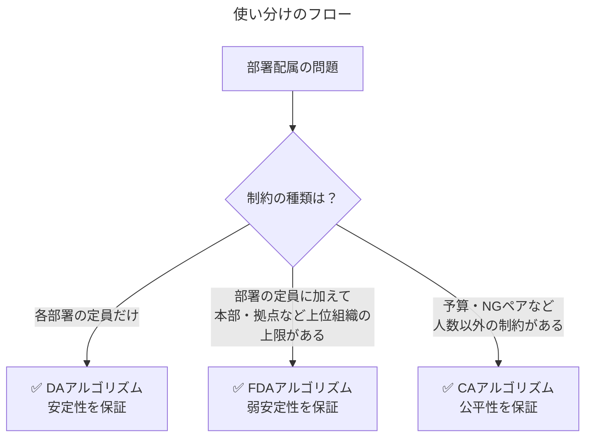

## はじめに

マッチング理論の勉強をしていく中で「これは社内の部署配属にそのまま使えるのでは？」と感じ、実際の配属業務を想定した6つの実行例を作成しました。本記事はそのまとめです。

- 【**想定する読者**】部署配属・アサイン業務を自動化/公平化したいエンジニア、マッチング理論の初学者
- [【理論編】マッチング理論](https://qiita.com/_it_/items/1cdd9059282cb774f8cc)
- [【実装編】DAアルゴリズム](https://qiita.com/_it_/items/fc3d58a337d2eb6f2408)
- [【実装編】FDAアルゴリズム](https://qiita.com/_it_/items/0b30fe9acdb55c7e8897)
- [【実装編】CAアルゴリズム](https://qiita.com/_it_/items/75f1f63e3d57a3de4aaf)
- 【応用編】社内の部署配属で学ぶマッチング理論 ← 今回はここ！
- [サンプルコード](https://github.com/itokohei0/MarketDesignStudy/tree/master/%E3%83%9E%E3%83%83%E3%83%81%E3%83%B3%E3%82%B0%E7%90%86%E8%AB%96)

<font color=red>1エンジニアの独学で作った記事なので間違った内容を含むと思います。遠慮なくコメントいただけますと幸いです。</font>

### 【使い分け】あなたの配属問題はどれ？

アルゴリズム選びの基準は「**配属に課される制約の種類**」です。



- 【**DAアルゴリズム**】みんなが納得する組み合わせを作る基本形。希望と定員だけで誰もが文句を言えない配属を実現します。
- 【**FDAアルゴリズム**】枠の融通が利くDAの拡張版。本部全体の枠内で人気部署が定員を柔軟に超過でき、無駄なあぶれを防ぎます。
- 【**CAアルゴリズム**】足切りラインの調整で解く万能型。工数・予算・NGペアなど人数以外の制約でもえこひいきのない配属を実現します。


:::note info
**「上位互換」ではなく「適材適所」**
CAは何でも扱えるように見えますが、安定性そのものは保証されず、制約は「上限制約」に限られ、下限制約や比例的制約は対象外になります。制約が定員だけならDAを使うのが理論的にも実装的にも最善です。
:::

本記事のコードは [`dept_assignment_exec.py`](https://github.com/itokohei0/MarketDesignStudy/tree/master/%E3%83%9E%E3%83%83%E3%83%81%E3%83%B3%E3%82%B0%E7%90%86%E8%AB%96) にまとめています。アルゴリズム本体（`da_algorithm.py` / `fda_algorithm.py` / `ca_algorithm.py`）と性質検証モジュール（`matching_check.py`）は実装編のものをそのまま使います。

## 配属マッチング例

あなたは架空のIT企業の人事担当です。今期の配属シーズン、次の6つの依頼が舞い込みました。

| #   | 依頼内容                                                   | 制約                     | 使うアルゴリズム |
| --- | ---------------------------------------------------------- | ------------------------ | ---------------- |
| 例1 | 新卒5名を3部署へ配属したい                                 | 定員のみ                 | **DA**           |
| 例2 | 14名を2本部5課へ。本部ごとに人数上限がある。               | 定員＋本部上限           | **FDA**          |
| 例3 | 兼務メンバー12名の工数を3製品チームに配分したい            | 稼働量（工数）上限       | **CA**           |
| 例4 | 16名を4チームへ。同席NGのペアと配属先を制限したい社員がいる | 定員＋回避制約＋配属禁止 | **CA**           |
| 例5 | 20名を4グループへ。若手が花形部署に集中しないようにしたい  | 定員＋属性人数制約       | **CA**           |
| 例6 | 24名を5チームへ。定員も工数もNGペアも全部ある              | 定員＋稼働量＋回避       | **CA**           |

それぞれの依頼を、マッチング理論のアルゴリズムで順番に解いていきます。理論的な背景（安定性・耐戦略性・公平性など）は[理論編](https://qiita.com/_it_/items/1cdd9059282cb774f8cc)を参照してください。

### 例1【DA】新卒配属（定員制約のみ、5名 → 3部署）

#### 状況設定

新卒5名（佐藤・鈴木・高橋・田中・伊藤）を、開発部（定員2）・インフラ部（定員2）・データ分析部（定員1）へ配属します。新卒は配属希望調査の希望順位を、部署側は面接評価に基づく優先順位を持ちます。

```python
p_names = ["佐藤", "鈴木", "高橋", "田中", "伊藤"]
r_names = ["開発部", "インフラ部", "データ分析部"]

# 新卒の希望順位（1=開発部, 2=インフラ部, 3=データ分析部）
proposer_prefs = [
    [1, 3, 2],  # 佐藤
    [1, 2, 3],  # 鈴木
    [3, 1, 2],  # 高橋
    [2, 1, 3],  # 田中
    [1, 2, 3],  # 伊藤
]
# 部署側の優先順位（面接評価順、1=佐藤, ..., 5=伊藤）
receiver_prefs = [
    [2, 1, 5, 3, 4],  # 開発部
    [4, 5, 2, 1, 3],  # インフラ部
    [3, 1, 4, 2, 5],  # データ分析部
]
capacities = [2, 2, 1]

data = DAInput(proposer_prefs, receiver_prefs, capacities, p_names, r_names)
result = deferred_acceptance(data, verbose=True)
```

#### 実行結果

```text
--- ステップ 1 ---
  佐藤 → 開発部 に提案
  鈴木 → 開発部 に提案
  高橋 → データ分析部 に提案
  田中 → インフラ部 に提案
  伊藤 → 開発部 に提案

  【受入フェーズ】
    開発部（定員2）: キープ=[鈴木, 佐藤]
      → 定員（2人）により拒否: [伊藤]
    インフラ部（定員2）: キープ=[田中]
    データ分析部（定員1）: キープ=[高橋]

--- ステップ 2 ---
  伊藤 → インフラ部 に提案

  【受入フェーズ】
    インフラ部（定員2）: キープ=[田中, 伊藤]

【マッチング結果】
  佐藤: 開発部
  鈴木: 開発部
  高橋: データ分析部
  田中: インフラ部
  伊藤: インフラ部

【安定性】✅ 成立
【効率性（無駄なし）】✅ 成立
```

第1希望の開発部からあぶれた伊藤が第2希望のインフラ部に滑り込み、2ステップで収束しました。`matching_check.py` による検証でも安定性（個人合理性＋ブロッキングペアなし）が成立しています。

:::note info
**実務上のポイント: 耐戦略性**
DAは応募側に対して耐戦略的なので、「希望を偽って書いても得しない」ことを新卒に説明できます。「正直に第1希望を書くと不利になるのでは」という配属調査への不信感を制度設計レベルで解消できるのがDAの最大の利点です（Gale and Shapley, 1962; Roth, 1982）。
:::

### 例2【FDA】本部上限付き配属（14名 → 2本部5課）

#### 状況設定

社内公募で14名を5つの課へ配属します。課は2つの本部に属し、**本部単位で人件費予算による総受入枠**があります。これは研修医マッチングの「地域上限制約」と数学的に同じ構造です。

| 本部     | 課             | 目標定員 | 設置上限 | 本部上限 |
| -------- | -------------- | -------- | -------- | -------- |
| 開発本部 | 第1開発課      | 2        | 5        | 8        |
| 開発本部 | 第2開発課      | 2        | 4        | (同上)   |
| 開発本部 | 第3開発課      | 2        | 4        | (同上)   |
| 業務本部 | 業務推進課     | 3        | 4        | 6        |
| 業務本部 | 顧客サポート課 | 3        | 4        | (同上)   |

- **目標定員**: 各課が「まずはこのくらい欲しい」と申告した人数（合計12）
- **設置上限**: 座席数・指導体制から決まる物理上限
- **本部上限**: 本部単位の予算枠（$8 + 6 = 14$）

本部 $r$ に属する課の集合を $C_r$ とすると、本部上限制約は次式です。

$$
\sum_{c \in C_r} |\mu(c)| \leq Q_r
$$

#### まずDAで解いてみる → 失敗する

目標定員をそのまま `capacities` にしてDAを実行すると、こうなります。

```text
【マッチング結果（抜粋）】
  山本: 未マッチ
  小林: 未マッチ

未配属者: ['山本', '小林']（目標定員の合計12 < 14名のため必ず2名あぶれる）
```

目標定員の合計（12）が人数（14）より少ないため、**本部の予算枠には余裕があるのに2名が未配属**になります。DAは課ごとの定員しか制御パラメータとして持たないため、「人気のある課が目標定員を超えて柔軟に受け入れる」という調整ができません。

#### FDAで解く

FDAは、目標定員からあぶれた応募者を即時拒否せず**待機リスト**に載せ、本部上限と設置上限の範囲内で順次受け入れます。

```python
data = FDAInput(
    proposer_prefs=EX2_PROPOSER_PREFS,
    receiver_prefs=EX2_RECEIVER_PREFS,
    capacities=[2, 2, 2, 3, 3],      # 目標定員（計12）
    max_caps=[5, 4, 4, 4, 4],        # 設置上限
    regions=[0, 0, 0, 1, 1],         # 0=開発本部, 1=業務本部
    regional_caps=[8, 6],            # 本部上限（人件費予算枠）
    nomination_order=[0, 1, 2, 3, 4],  # 待機リストフェーズの指名順序
    proposer_names=EX2_PROPOSERS,
    receiver_names=EX2_RECEIVERS,
)
result = flexible_deferred_acceptance(data, verbose=True)
```

#### 実行結果

```text
【マッチング結果】
  佐藤: 第3開発課      鈴木: 第1開発課      高橋: 第3開発課
  田中: 第1開発課      伊藤: 第2開発課      渡辺: 第2開発課
  山本: 顧客サポート課  中村: 顧客サポート課  小林: 業務推進課
  加藤: 顧客サポート課  吉田: 顧客サポート課  山田: 業務推進課
  佐々木: 第1開発課    山口: 第1開発課

本部別人数: 開発本部 8/8, 業務本部 6/6
未配属者: なし（全員配属）

【安定性】❌ 不成立（空き定員へのブロッキングペアあり）
【弱安定性】✅ 成立
```

全員が配属されました。人気の第1開発課は目標定員2を超えて4名を受け入れており、本部上限8の範囲内で目標定員が柔軟に融通されています。

:::note warn
**安定性❌は仕様であり、バグではない**
検証で安定性が不成立なのは「第2開発課には設置上限まで空きがあるのに、そこを希望する佐藤が入れない」ようなペアが残るためです。これは本部上限（予算枠）を守る以上避けられません。制約付きマッチングでは安定マッチングが存在しないことがあるため、FDAは目標を「弱安定性」（定員が埋まっている課で双方が改善できるペアがないこと）に再設定しています（Kamada and Kojima, 2015）。
:::

### 例3【CA】兼務メンバーの工数配分（12名 → 3製品チーム）

#### 状況設定

ここからは「人数」では縛れない制約が登場します。エンジニア12名を3つの製品チームにアサインしたいのですが、**専任もいれば兼務・時短勤務者もいる**ため、各メンバーの提供工数（人月）はバラバラです。チーム側の受入能力は「人数」でなく「工数の上限」で決まっています。

| 項目                     | 値                                  |
| ------------------------ | ----------------------------------- |
| メンバーの提供工数 $w_i$ | 1.0（専任）/ 0.3〜0.8（兼務・時短） |
| チームの工数上限 $W_c$   | Alpha: 3.5 / Beta: 2.5 / Gamma: 2.0 |

つまり、チーム $c$ の制約は人数 $|\mu(c)|$ ではなく次式です。

$$
\sum_{i \in \mu(c)} w_i \leq W_c
$$

「同じ1枠でも、専任の佐藤（1.0人月）と兼務の加藤（0.3人月）では重みが違う」——この種の制約はDA/FDAでは扱えず、**一般上限制約**を扱えるCAの出番です。

#### 実装

CAでは受入側の制約を「提案者の集合を受け取り、実行可能か否かを返す関数」として自由に定義できます。工数制約は実装編で作った `budget_constraint`（予算制約）がそのまま使えます。

```python
# 各メンバーが提供できる工数（人月）。1.0=専任、それ以外は兼務・時短
EX3_LOADS = [1.0, 0.5, 0.8, 1.0, 0.4, 0.6, 1.0, 0.5, 0.8, 0.3, 0.6, 1.0]
# 各製品チームが受け入れられる工数の上限（人月）
EX3_MAX_WORKLOADS = [3.5, 2.5, 2.0]

# 稼働量制約: チームに配属されたメンバーの工数合計 <= 上限
costs = {i: EX3_LOADS[i] for i in range(len(EX3_PROPOSERS))}
constraints = [budget_constraint(costs, b) for b in EX3_MAX_WORKLOADS]

data = CAInput(EX3_PROPOSER_PREFS, EX3_RECEIVER_PREFS, constraints,
               EX3_PROPOSERS, EX3_RECEIVERS)
result = cutoff_adjustment(data, verbose=True)
```

#### 実行結果

```text
【最終カットオフ】 p* = [7, 7, 8]

  製品Alpha: [佐藤, 渡辺, 山本, 小林] 工数計 3.4/3.5 人月
  製品Beta: [鈴木, 田中, 加藤, 吉田] 工数計 2.4/2.5 人月
  製品Gamma: [高橋, 山田] 工数計 1.8/2.0 人月
  未配分（現所属で継続）: ['伊藤', '中村']

【公平性（正当な羨望なし）】✅ 成立
```

各チームとも工数上限ギリギリまで受け入れつつ、上限超過は発生していません。

注目すべきは**未配分の2名**です。例えば伊藤の工数は0.4人月で、製品Gammaの残り0.2人月には入れませんが、「カットオフ（足切り順位）を通過できなかったから」未配分なのであって、誰かをえこひいきした結果ではありません。実際、公平性（自分より優先順位の低い人が配属されているのに自分が入れない、という「正当な羨望」がないこと）が成立しています。

:::note info
**公平性と効率性のトレードオフ**
「Gammaに0.2人月の空きがあるのに誰も入れない」のは効率性の観点では無駄です。しかし空きを埋めようとカットオフを下げると、その順位以上の希望者全員が押し寄せて需要が膨らみ、制約違反や優先順位の逆転（正当な羨望）が発生します。CAは公平性を優先するアルゴリズムであり、効率性は保証しません（理論編の比較表参照）。未配分者は「現所属で継続」「次回の異動で優先」など運用でフォローします。
:::

### 例4【CA】NGペアの分離＋配属禁止（16名 → 4チーム）

#### 状況設定

16名を4チーム（定員5・5・4・4）へ配属します。人事要件は2種類あります。

まず、**同一チームに配属してはならないペア**が3組。

| NGペア       | 理由                                 |
| ------------ | ------------------------------------ |
| 佐藤・鈴木   | 兼業先が競合関係（利益相反）         |
| 伊藤・加藤   | 過去のハラスメント事案               |
| 佐々木・井上 | 夫婦（社内規程により同一チーム不可） |

加えて、**特定のチームに配属してはならない社員**が3名います。

| 社員 | 禁止チーム | 理由                                                 |
| ---- | ---------- | ---------------------------------------------------- |
| 高橋 | 第2チーム  | 直前まで第2チーム案件の内部監査を担当（独立性の確保） |
| 渡辺 | 第1チーム  | 第1チームの主要取引先に近親者が在籍（利益相反）       |
| 吉田 | 第4チーム  | 夜間オンコール免除措置中（第4チームはオンコール必須） |

ペア $(i, j)$ を同一チームに入れない回避制約は次式です。

$$
\forall (i,j) \in \text{NG}: \quad \lnot \left( i \in \mu(c) \land j \in \mu(c) \right)
$$

一方、社員 $i$ をチーム $c$ に配属しない配属禁止は「$i$ と $c$ が互いに**受け入れ不可能**（unacceptable）である」こと、すなわち選好リストからの除外として表現します。

#### 実装

NGペアは実装編で作った `combined_constraint`（定員＋回避）で、配属禁止は**双方の選好リストからの除外**で表現します。

```python
EX4_CAPACITIES = [5, 5, 4, 4]
# 同一チームに配属してはならないペア（0-indexed）
EX4_CONFLICT_PAIRS = [(0, 1), (4, 9), (12, 15)]
# 特定チームへの配属禁止（社員idx → 禁止チームidx）
EX4_FORBIDDEN = {2: 1, 5: 0, 10: 3}  # 高橋→第2, 渡辺→第1, 吉田→第4

def apply_forbidden_assignments(proposer_prefs, receiver_prefs, forbidden):
    """配属禁止を選好リストの除外で表現する"""
    pprefs = [list(p) for p in proposer_prefs]
    rprefs = [list(r) for r in receiver_prefs]
    for i, j in forbidden.items():
        pprefs[i] = [t for t in pprefs[i] if t != j + 1]  # 社員iの希望からチームjを除外
        rprefs[j] = [p for p in rprefs[j] if p != i + 1]  # チームjの優先順位から社員iを除外
    return pprefs, rprefs

pprefs, rprefs = apply_forbidden_assignments(
    EX4_PROPOSER_PREFS, EX4_RECEIVER_PREFS, EX4_FORBIDDEN)

constraints = [combined_constraint(c, EX4_CONFLICT_PAIRS) for c in EX4_CAPACITIES]

data = CAInput(pprefs, rprefs, constraints, EX4_PROPOSERS, EX4_RECEIVERS)
result = cutoff_adjustment(data, verbose=True)
```

:::note alert
**配属禁止を制約関数で書いてはいけない**
「チーム $c$ の配属メンバーに社員 $i$ が含まれたら実行不可能」という制約関数でも一見表現できそうですが、これは罠です。CAのカットオフはチームごとに1本の「足切り線」なので、禁止対象者がそのチームの優先順位**上位**にいると、その人を需要から外すためにカットオフが彼らの順位を超えるまで上がり、**それより下位の応募者全員を巻き添えで排除**してしまいます（実際にこの方法で実行すると16名中5名が未配属になりました）。個人単位の配属禁止は「制約」ではなく「受け入れ不可能」として選好リストから除外するのが正しいモデリングです。
:::

#### 実行結果

```text
【最終カットオフ】 p* = [7, 6, 4, 5]

【マッチング結果（チーム別）】
  第1チーム: [山本, 中村, 吉田, 佐々木]
  第2チーム: [鈴木, 田中, 山田, 山口]
  第3チーム: [佐藤, 小林, 加藤, 松本]
  第4チーム: [高橋, 伊藤, 渡辺, 井上]

  NGペア（佐藤, 鈴木）: ✅ 分離
  NGペア（伊藤, 加藤）: ✅ 分離
  NGペア（佐々木, 井上）: ✅ 分離
  配属禁止（高橋 → 第2チーム）: ✅ 回避（実際の配属: 第4チーム）
  配属禁止（渡辺 → 第1チーム）: ✅ 回避（実際の配属: 第4チーム）
  配属禁止（吉田 → 第4チーム）: ✅ 回避（実際の配属: 第1チーム）
  未配属者: なし（全員配属）

【個人合理性】✅ 成立
【公平性（正当な羨望なし）】✅ 成立
```

16名全員が配属され、NGペア3組の分離と配属禁止3件の回避がすべて達成されました。配属禁止は3件とも「放置すればそこに配属されていた」ケースです。例えば渡辺の第1希望は第1チームでしたが禁止により除外され、第4チームに配属されています。

カットオフ $p^* = [7, 6, 4, 5]$ は各チームの「足切り線」で、市場の均衡価格に相当します。人気チームほどカットオフが高くなり、これが回避制約を含む制約充足と公平性を同時に達成する仕組みです。

### 例5【CA】若手の偏り防止（20名 → 4グループ、属性人数制約）

#### 状況設定

20名を4グループ（定員各5名）へ配属します。第1グループは新規AIプロダクト担当の花形部署で、**入社3年以内の若手7名**（鈴木・伊藤・中村・吉田・山口・木村・斎藤）の人気が集中しています。

しかし若手が1つのグループに固まると、OJTを担うベテランが足りず育成が回りません。そこで「**入社3年以内の社員は各グループ2名まで**」という属性人数制約を課します。若手の集合を $Y$、上限を $q^Y_c$ とすると次式です。

$$
|\mu(c) \cap Y| \leq q^Y_c
$$

定員制約と同じ「人数の上限」ですが、**特定の属性を持つ部分集合だけを数える**点が異なります。この制約も部分集合で常に成立する（遺伝的である）ため、CAでそのまま扱えます。

#### 実装

属性人数制約の制約関数は3行で書けます。定員制約とANDで合成するだけです。

```python
# 入社3年以内の社員（0-indexed）: 鈴木, 伊藤, 中村, 吉田, 山口, 木村, 斎藤
EX5_JUNIORS = {1, 4, 7, 10, 13, 16, 18}
EX5_JUNIOR_QUOTA = 2   # 各グループの若手受入上限
EX5_CAPACITIES = [5, 5, 5, 5]

def group_quota_constraint(group: set[int], quota: int):
    """属性人数制約: group に属するメンバーが quota 人以下"""
    return lambda members: sum(1 for m in members if m in group) <= quota

def make_constraint(cap: int):
    c_cap = capacity_constraint(cap)
    c_jr  = group_quota_constraint(EX5_JUNIORS, EX5_JUNIOR_QUOTA)
    return lambda members: c_cap(members) and c_jr(members)

constraints = [make_constraint(c) for c in EX5_CAPACITIES]

data = CAInput(EX5_PROPOSER_PREFS, EX5_RECEIVER_PREFS, constraints,
               EX5_PROPOSERS, EX5_RECEIVERS)
result = cutoff_adjustment(data, verbose=True)
```

#### 実行結果

比較のため、まず**定員制約のみ**で解いた結果がこちらです。

```text
--- (1) 定員制約のみ ---
  第1グループ: [鈴木(若), 吉田(若), 松本, 木村(若), 斎藤(若)] 若手4名
  第2グループ: [佐藤, 山田, 佐々木, 井上, 林] 若手0名
  第3グループ: [高橋, 渡辺, 中村(若), 山口(若), 清水] 若手2名
  第4グループ: [田中, 伊藤(若), 山本, 小林, 加藤] 若手1名
  未配属者: なし（全員配属）
```

懸念どおり、花形の第1グループに若手が4名集中し（5名中4名が若手！）、第2グループは若手0名という偏った構成になりました。次に**若手人数制約を追加**した結果です。

```text
--- (2) 定員制約＋若手人数制約（各グループ2名まで） ---
【最終カットオフ】 p* = [14, 14, 11, 13]

  第1グループ: [吉田(若), 山田, 松本, 林, 斎藤(若)] 若手2名
  第2グループ: [渡辺, 中村(若), 小林, 佐々木, 山口(若)] 若手2名
  第3グループ: [鈴木(若), 高橋, 井上, 木村(若), 清水] 若手2名
  第4グループ: [佐藤, 田中, 伊藤(若), 山本, 加藤] 若手1名

  未配属者: なし（全員配属）

【公平性（正当な羨望なし）】✅ 成立
```

若手の分布が 4-0-2-1 から **2-2-2-1 に平準化**され、全員配属のまま公平性も維持されました。第1グループの若手枠2名を勝ち取ったのは、第1グループの優先順位で上位だった吉田・斎藤。あぶれた鈴木・木村は第3グループへ移り、その玉突きで第3グループにいた中村・山口が第2グループへ——と、若手枠が連鎖的に調整されてもなお「正当な羨望なし」が守られています。

:::note info
**属性人数制約の応用範囲**
「入社3年以内は◯名まで」のほかにも、同じ制約関数で「同一出身部署の社員は◯名まで」（組織のサイロ化防止）、「管理職経験者は◯名まで」（ポスト重複の回避）など、属性ベースの偏り防止全般に流用できます。複数の属性制約をANDで重ねることも可能です。
:::

### 例6【CA】総合演習（24名 → 5チーム、定員＋稼働量＋回避制約）

#### 状況設定

最後は実務に最も近い総合例です。エンジニア組織24名を5チームに再編します。

| チーム       | 定員（人数） | 工数上限（人月） |
| ------------ | ------------ | ---------------- |
| 基盤チーム   | 6            | 5.5              |
| アプリチーム | 5            | 4.5              |
| データチーム | 5            | 4.5              |
| SREチーム    | 4            | 3.5              |
| QAチーム     | 4            | 3.5              |

さらに、メンバー24名のうち6名は兼務・時短勤務（提供工数 0.5〜0.8）、NGペアが2組（田中・中村: 利益相反、吉田・池田: 親子）あります。**定員・稼働量・回避の3制約が同時に**課されます。

#### 実装

CAの制約は「集合 → 真偽値」の関数なので、3つの制約のANDを取るだけで合成できます。

```python
costs = {i: EX6_LOADS[i] for i in range(len(EX6_PROPOSERS))}

def make_constraint(cap: int, max_workload: float):
    """定員・稼働量・回避の3制約をすべて満たす場合のみ実行可能"""
    c_cap  = capacity_constraint(cap)
    c_load = budget_constraint(costs, max_workload)
    c_ng   = collision_avoidance_constraint(EX6_CONFLICT_PAIRS)
    return lambda members: c_cap(members) and c_load(members) and c_ng(members)

constraints = [make_constraint(EX6_CAPACITIES[j], EX6_MAX_WORKLOADS[j])
               for j in range(len(EX6_RECEIVERS))]

data = CAInput(EX6_PROPOSER_PREFS, EX6_RECEIVER_PREFS, constraints,
               EX6_PROPOSERS, EX6_RECEIVERS)
result = cutoff_adjustment(data, verbose=True)
```

#### 実行結果

```text
【最終カットオフ】 p* = [17, 15, 9, 14, 16]

  基盤チーム（定員6・工数上限5.5）:   [吉田, 松本, 斎藤, 清水, 阿部] 人数5 工数計5.0
  アプリチーム（定員5・工数上限4.5）: [佐藤, 高橋, 伊藤, 池田, 橋本] 人数5 工数計4.5
  データチーム（定員5・工数上限4.5）: [小林, 加藤, 山田, 佐々木, 木村] 人数5 工数計4.5
  SREチーム（定員4・工数上限3.5）:    [鈴木, 中村, 井上] 人数3 工数計3.0
  QAチーム（定員4・工数上限3.5）:     [田中, 渡辺, 山口, 林] 人数4 工数計3.2

  NGペア（田中, 中村）: ✅ 分離
  NGペア（吉田, 池田）: ✅ 分離
  未配属者: ['山本', '森']

【公平性（正当な羨望なし）】✅ 成立
```

24名中22名が配属され、全チームで定員・工数上限が守られ、NGペアも分離されました。

- 利益相反の田中・中村は、田中がQAチーム、中村がSREチームに分離
- 工数上限がボトルネックになるチーム（アプリ・データは工数計4.5/4.5でちょうど満杯）と、人数定員より工数が先に尽きるチーム（SREは3名で工数3.0/3.5）が混在
- 未配分の山本・森（ともに専任1.0人月）は、残工数0.5以下のチームにしか空きがなく配属不可。ここでも公平性は維持

:::note warn
**CAが扱える制約は「遺伝的（上限型）」のみ**
CAの収束と公平性が保証されるのは、制約が**遺伝的**（実行可能な集合の部分集合も実行可能。定員・工数・予算・回避はすべて該当）な場合です。「チームには最低3名必要」のような**下限制約は遺伝的でない**ためCAのループには組み込めません。下限が必要な場合は、マッチング確定後に充足チェックして人手で調整する（後処理）のが現実的です。サンプルコードの `ca_algorithm_custom.py` に下限制約を後処理で検証する実装例があります。
:::

### 【実務適用のポイント】

6つの例を通じて見えてくる、実際の配属業務へ適用する際の注意点をまとめます。

**1. 希望調査の信頼性が制度の生命線**
DA・FDAは応募側耐戦略的なので「正直な希望申告が最適戦略」と社内に周知できます。CAは条件付きなので、希望順位の操作が利益になり得るケースがないか事前に確認が必要です（理論編・CAアルゴリズム実装編参照）。

**2. 「未配分」の運用設計をセットで考える**
公平性を守る代償として、空き枠があっても未配分者が出ることがあります（例3・例6）。「現所属で継続」「次回異動で優先権付与」など、未配分時の扱いを制度として先に決めておくと納得感が保てます。

**3. 受入側の優先順位は説明可能にしておく**
公平性とは「優先順位に照らして正当な羨望がない」ことなので、その前提となる優先順位（評価基準）自体の納得感が重要です。スキルマッチ度・面接評価など、根拠を示せる基準で作成してください。

**4. 制約は「上限型」に寄せてモデリングする**
「最低◯名」のような下限制約はCAでも直接は扱えません。可能な限り上限型に言い換え（例: 他チームの上限を絞って実質的に下限を作る）、どうしても必要な下限は後処理で検証します。また、個人単位の配属禁止は制約関数ではなく「受け入れ不可能」として選好リストから除外します（例4参照）。

**5. 計算量はほぼ気にしなくてよい**
本記事最大の例6（24名×5チーム、3制約合成）でもミリ秒オーダーで収束します。数百名規模の配属でも実用上問題ありません。


## 【まとめ】

| 例                    | 規模           | 制約                     | アルゴリズム | 結果                                       |
| --------------------- | -------------- | ------------------------ | ------------ | ------------------------------------------ |
| 1. 新卒配属           | 5名→3部署      | 定員                     | DA           | 安定性✅・効率性✅                           |
| 2. 本部上限付き配属   | 14名→2本部5課  | 定員＋本部上限           | FDA          | 全員配属・弱安定性✅（DAでは2名未配属）     |
| 3. 工数配分           | 12名→3チーム   | 稼働量上限               | CA           | 公平性✅（2名未配分は公平性の代償）         |
| 4. NGペア分離＋配属禁止 | 16名→4チーム   | 定員＋回避＋配属禁止     | CA           | 全員配属・3ペア分離・禁止3件回避・公平性✅  |
| 5. 若手の偏り防止     | 20名→4グループ | 定員＋属性人数制約       | CA           | 全員配属・若手分布4-0-2-1→2-2-2-1・公平性✅ |
| 6. 総合演習           | 24名→5チーム   | 定員＋稼働量＋回避       | CA           | 22名配属・2ペア分離・公平性✅               |

部署配属は「定員だけならDA、組織階層の総枠があるならFDA、工数・予算・NGペアまで考えるならCA」と覚えておけば、ほとんどのケースをカバーできます。サンプルコード（`dept_assignment_exec.py`）はそのまま実行できるので、自社の配属データに差し替えて試してみてください。

## 【参考文献】

- [マッチング理論とマーケットデザイン](https://www.amazon.co.jp/dp/453555935X)
- [マーケットデザイン総論 (シリーズ マーケットデザイン)](https://www.amazon.co.jp/dp/4320096819)
