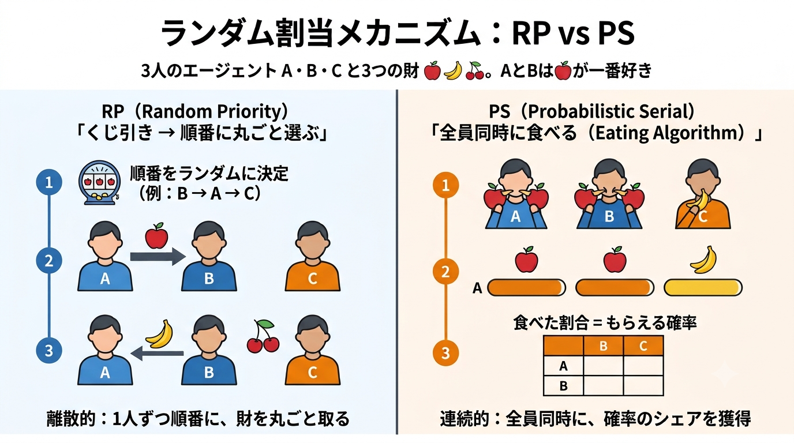
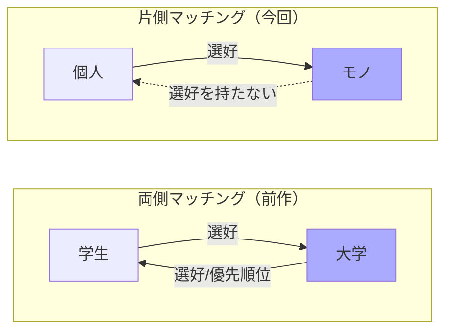
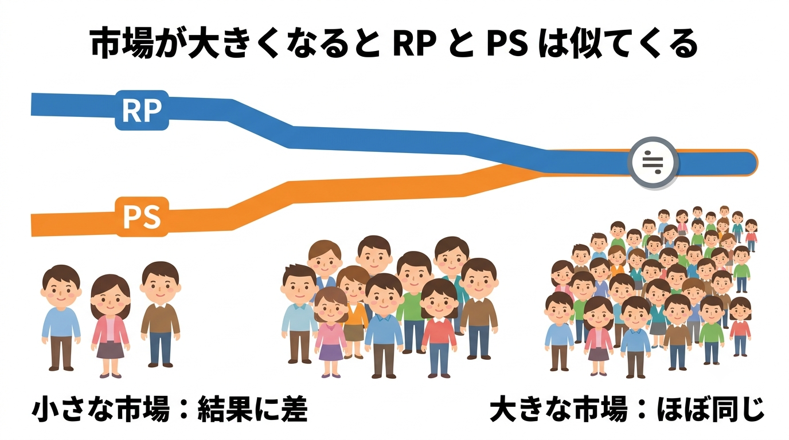
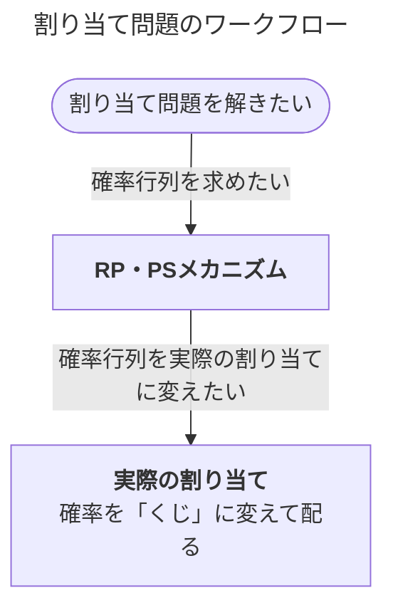

## はじめに

<!-- バナー画像をここに貼る（例: 0Overview2.png）。前作の 0Overview.png と同じ要領で Qiita にアップロードしてURLを差し込む -->


前作のマッチング理論シリーズ（DA・FDA・CA）では、両者がともに選好をもつ**両側マッチング**を扱いました。今回は片方のみ選好を持つ**片側マッチング**をソースコードを書きながらエンジニア目線で整理していきます。本記事は全体を通して使用する内容を共有知識として書いています。

- 【**想定する読者**】マッチング理論の初学者エンジニア
- 【**理論編**】マッチング理論 〜割り当て問題の共有知識〜 ← <font color=red><b>今回はここ！</b></font>
- 【**実装編**】RP・PSメカニズムと実際の割り当て 〜確率行列を作って「くじ」に変える〜
- [サンプルコード](https://github.com/itokohei0/MarketDesignStudy/tree/master/%E3%83%9E%E3%83%83%E3%83%81%E3%83%B3%E3%82%B0%E7%90%86%E8%AB%96)
<!-- TODO: 実装編2本の公開後、上記リストにURLを差し込む -->

前作（両側マッチング編）もあわせてどうぞ。

- [【理論編】マッチング理論〜共有知識〜](https://qiita.com/_it_/items/1cdd9059282cb774f8cc)
- [【実装編】DAアルゴリズム](https://qiita.com/_it_/items/fc3d58a337d2eb6f2408)
- [【実装編】FDAアルゴリズム](https://qiita.com/_it_/items/0b30fe9acdb55c7e8897)
- [【実装編】CAアルゴリズム](https://qiita.com/_it_/items/75f1f63e3d57a3de4aaf)

<font color=red>1エンジニアの独学で作った記事なので間違った内容を含むと思います。遠慮なくコメントいただけますと幸いです。</font>

## 【今回のテーマ】ヒトとモノのマッチング

今回扱うマッチングは片方（ヒト）だけが選好を持ち、もう片方（モノ）は選好を持たない**片側マッチング**です。特に、「何らかの意味で望ましい割り当てを見つけるメカニズム」を探すことを目的として、「**割り当て**」という言葉を使います。

:::note info
【**メカニズムとは？**】
人々が申告した選好（希望リスト）を受け取り、1つの割り当てを返す「手続き」のことです。本記事では代表的な2つ、**RPメカニズム**と**PSメカニズム**を扱います。
:::



身近な例としては次のようなものがあります。

| 例                 | ヒト | モノ         |
| ------------------ | ---- | ------------ |
| 学生寮の割り当て   | 学生 | 部屋         |
| 腎臓移植           | 患者 | 提供腎       |
| 社内の案件アサイン | 社員 | プロジェクト |

モノは「誰に割り当てられたいか」という希望を持たないので、両側マッチングの主役だった**安定性**は出番がありません。代わりに主役になるのが「**効率性**」と「**公平性**」です。

## 【基礎】なぜ「確率」で割り当てるのか

学校の入学枠を1つ、2人が希望したとします。枠は分割できない**非分割財**なので、どちらか1人しかもらえません。これでは公平な分け方が決められません。

そこで登場するのが**確率的な割り当て**です。「2人それぞれに確率 $\frac{1}{2}$ で枠を与える」と決めれば、非分割財をあたかも分割財のように扱えて、最低限の公平性を実現できます。

### 確率行列

「誰が・何を・どの確率で」もらえるかをまとめた行列を**確率行列**と呼びます。記号を整理します。

| 要素               | 記号              | 説明                               |
| ------------------ | ----------------- | ---------------------------------- |
| 個人の集合         | $N=\{1,2,\dots\}$ | 選好を持つ側（学生・社員など）     |
| 財の集合           | $O=\{a,b,\dots\}$ | 割り当てられるモノ（部屋・枠など） |
| 「何ももらわない」 | $\emptyset$       | 供給数は無制限                     |
| 財 $a$ の供給数    | $q_a$             | その財の在庫                       |
| 割り当て確率       | $P_{ia}$          | 個人 $i$ に財 $a$ が割り当たる確率 |

例えば、個人4人、供給数1の3つの財 $\{l,m,n\}$ の確率行列はこう書けます（左から $l,m,n,\emptyset$ の列）。

```math
P=\left(
  \begin{array}{cccc}
    1/6 & 3/6 & 1/6 & 1/6\\
    2/6 & 0   & 2/6 & 2/6\\
    0   & 3/6 & 1/6 & 2/6\\
    3/6 & 0   & 2/6 & 1/6
  \end{array}
\right)
```

確率行列 $P$ は各行が「ある個人の割り当て確率」を表し、次の2条件を満たします。

```math
\begin{align*}
  【\bold{条件1}】&\sum_{a\in O\cup\{\emptyset\}}P_{ia}=1\\[6mm]
  【\bold{条件2}】&\sum_{i\in N}P_{ia}\leqq q_a
\end{align*}
```

これら条件の解釈は以下のとおりです。

- 【**条件1の解釈**】各個人は必ずどれか（$\emptyset$も含む）を受け取る（行の和は1）。
- 【**条件2の解釈**】供給数を超えるような割り当てはない（列の和は供給数以下）。

## 【割り当て問題における望ましい性質】

割り当てメカニズムの「良さ」は、次の4つの性質で測ります。特に、**水平性と無羨望性は公平性の一種**であり、「水平性 → 無羨望性」の順に強くなります（無羨望性を満たせば水平性も満たします）。


| 性質           | ひとことで言うと                                           |
| -------------- | ---------------------------------------------------------- |
| **耐戦略性**   | 正直に希望を出すのが常に得（嘘をつくインセンティブがない） |
| **水平性**     | 同じ希望を出した人には同じ確率を与える（最低限の公平性）   |
| **無羨望性**   | 誰も他人の割り当てをうらやましがらない（強い公平性）       |
| **順序効率性** | 確率を融通し合っても、もう誰も得できない（事前の効率性）   |

#### 【準備】確率支配という「物差し」

効率性や公平性を正確に定義するには、「確率的な割り当て同士をどう比べるか」を決める必要があります。その物差しが**確率支配（first-order stochastic dominance）** です。

まず $p_i(a,P;\succ_i)$ を「選好 $\succ_i$ を持つ個人 $i$ が、割り当て $P$ のもとで**財 $a$ 以上に好ましいものを得る確率**」と定義します（累積確率）。

:::note info
【**確率支配とは**】
割り当て $P'$ が $P$ を選好プロファイル $\succ$ のもとで**確率支配する**とは、すべての個人 $i\in N$ とすべての財 $a$ について

```math
p_i(a,P';\succ_i)\geqq p_i(a,P;\succ_i)
```

が成り立ち、かつ**少なくとも個人$j$と財$b$の1組 $(j,b)$ で厳密な不等号**

```math
p_j(b,P';\succ_j) > p_j(b,P;\succ_j)
```

が成り立つことをいいます。また、厳密な不等号を要求せず、すべての弱い不等式だけが成り立つとき、$P'$ は $P$ を**弱確率支配する**といいます。
:::

以下の4つの性質のうち、耐戦略性・無羨望性・順序効率性はこの（弱）確率支配を使って定義します。

<details><summary>【<b>耐戦略性の定義</b>】</summary>

> 正直に自分の希望を表明することが支配戦略（他プレイヤーの行動によらず常に最適）となる性質のこと。確率的な割り当てでは、メカニズムが選好プロファイルに対して返す確率行列を $P(\succ)$ と書くと、「正直申告時の自分の割り当てが、どんな嘘の申告時の割り当ても（正直な選好のもとで）**弱確率支配**する」こととして定義されます（sd-耐戦略性）。式で表すと、すべての財 $a\in O\cup\{\emptyset\}$ について以下のとおり。
> ```math
> p_i\bigl(a,P(\succ_i, \succ_{-i});\succ_i\bigr) \geqq p_i\bigl(a,P(\succ_i', \succ_{-i});\succ_i\bigr)
> ```
> ```math
> \begin{align*}
>   \succ_i&：i\text{ の正直な希望}\\
>   \succ_i'&：i\text{ の嘘の希望}\\
>   \succ_{-i}&：i\text{ 以外の希望}
> \end{align*}
> ```


メカニズムが耐戦略的ならば、選好を偽って有利な結果を得ることができません。これは制度設計において非常に重要な性質です。

:::note info
【**補足**】
$\succ_{-i}$とは個人$i$以外の個人の選好を意味します。例えば、$n$人の個人がいる時、各個人の選好は$\succ=\{\succ_{1},\succ_{2},\cdots,\succ_{n}\}$と表現でき、$\succ_{-i}=\{\succ_{1},\succ_{2},\cdots,\succ_{i-1},\succ_{i+1},\cdots,\succ_{n}\}$を意味します。
:::

</details>

<details><summary>【<b>水平性の定義</b>】</summary>

> 割り当てメカニズムが水平性を満たすとは、同じ選好を申告した個人 $i,j\in N$ について、どの財 $a\in O\cup\{\emptyset\}$ についても $P_{ia}=P_{ja}$ が成り立つことである。
</details>


<details><summary>【<b>無羨望性の定義</b>】</summary>

> 割り当て$P$が無羨望性を満たすとは、すべての個人のペア$i,j\in N$について、$i$に割り当てられた確率$P_i=(P_{ia},\;P_{ib},\;\cdots,\;P_{i\emptyset})$が、$j$に割り当てられた確率$P_j=(P_{ja},\;P_{jb},\;\cdots,\;P_{j\emptyset})$を **$i$の選好$\succ_i$のもとで弱確率支配する**こと、すなわち、すべての財$a\in O\cup\{\emptyset\}$について
> ```math
> p_i(a,P;\succ_i)\geqq p_j(a,P;\succ_i)
> ```
> が成り立つことをいう。この時、「**$i$は$j$に羨望(envy)を持たない**」と言う。

:::note info
**無羨望性のポイント**
比較は**どちらも$i$自身の選好$\succ_i$で評価**します（$j$の選好ではありません）。個人 $i$ が個人 $j$ を**羨まない**とは、$i$ の選好で見たとき、自分の割り当て $P_i$ が他人の割り当て $P_j$ を**弱確率支配する**（すべての累積確率で $P_i \geqq P_j$）ことです。全員が誰のことも羨まなければ、その割り当ては無羨望性を満たします。
:::

</details>


<details><summary>【<b>順序効率性の定義</b>】</summary>

> 割り当て$P$が他のどんな割り当てによっても確率支配されないとき、$P$は順序効率性を満たす。また、どんな選好が表明されても必ず順序効率的な割り当てを与えるメカニズムのことを「<b>順序効率的なメカニズム</b>」と呼ぶ。

</details>

## 【2つのメカニズム】RP と PS

ここからが主役です。RPとPSは、それぞれ得意な性質が違う**ライバル**の関係にあります。本記事では2つのメカニズムの**考え方（処理イメージ）と性質の全体像**だけを押さえます。具体的な数値例・アルゴリズムの実装・性質の検証は、すべて実装編でコードを動かしながら行います。

|            |   RPメカニズム    |   PSメカニズム    |
| ---------- | :---------------: | :---------------: |
| 耐戦略性   |         ✅         | 大規模な市場なら✅ |
| 水平性     |         ✅         |         ✅         |
| 無羨望性   | 大規模な市場なら✅ |         ✅         |
| 順序効率性 | 大規模な市場なら✅ |         ✅         |

### RPメカニズム（均等確率優先順位 / Random Priority）

**くじで順番を決めて、順番が早い人から好きなモノを取っていく**、という直感的なメカニズムです。順番が来た人は、その場に残っているモノから一番好きなものを選んで退場します。これを「**逐次独裁制**」とも呼びます（順番が来た人はその瞬間"独裁者"のように好きに選べる）。

手順は次の通りです。

1. 各個人が財への希望順位を提出する。
2. くじで**均等に**優先順位を割り振る（希望内容には依存させない）。
3. 優先順位の高い人から順に、残っている財の中で一番好きなものを受け取る。
4. 全員に割り当て終わったら終了。

RPは**耐戦略性・水平性・事後的な効率性**を満たします。くじ（優先順位）は希望内容に依存せず、自分の順番が来たときに残っている中で一番好きなものを取るのが常に最適なので、嘘をつく理由がありません。
ただし**順序効率性は満たしません**。くじを引いて確定した割り当てに無駄はなくても（＝事後的には効率的）、確定する前の確率行列のレベルで見ると「お互いの確率を交換すれば両者とも得をする」余地が残ることがあるためです。この非効率が実際に起こる数値例と、全 $n!$ 通りの優先順位から確率行列を厳密に求める計算は、実装編でコードを動かして確認します。

### PSメカニズム（同時確率消費 / Probabilistic Serial）

順序効率性を満たすメカニズムです。全員が**同時に、好きなモノを少しずつ「食べていく」** イメージで、**イーティングアルゴリズム**とも呼ばれます。

1. 各財は完全に分割可能だとする。
2. 全員が同時に、自分が一番好きな財を「1秒あたり1単位」の速さで食べる。
3. 食べている財がなくなったら、残っている中で一番好きな財に移る。
4. 1秒後に終了。1秒間で食べた割合が、そのまま受け取る確率になる。

PSは**順序効率性**と、水平性より強い**無羨望性**を満たします。全員が各時点で「残っている中で一番好きなもの」を食べ続けるため、確率を交換して全員が得をする余地は残らず、誰も他人の食べたものを羨みません。
ただし**耐戦略性は満たしません**。嘘の申告で「財が食べ尽くされる時間」をずらすと、正直申告より得ができてしまうケースがあるためです。この反例（嘘をつくと期待効用が上がる数値例）も、実装編でコードを動かして確認します。

### 大きい市場におけるRPメカニズムとPSメカニズムの違い

<!-- くじ番号と確率の対応図 -->


ここまでで、RPとPSは互いに一長一短だと分かりましたが、そもそもすべての性質を満たす理想のメカニズムは作れないことが知られています。

:::note alert
【**割り当てメカニズムの不可能性定理（Bogomolnaia and Moulin 2001）**】
水平性・順序効率性・耐戦略性を同時に満たす確率的割り当てメカニズムは存在しない
:::

「では結局どちらが良いの？」を考えるために、市場を大きくしたことを考えます。この時、RPメカニズムとPSメカニズムは近似的に帰結が似ることが知られています。具体的には次のように説明できます。

:::note info
各財が $q$ 個供給される市場において、RPメカニズムのもとで選好 $\pi$ の個人が財 $a$ をもらう確率を $RP_a^q(\pi)$、同様にPSメカニズムのもとで選好 $\pi$ の個人が財 $a$ をもらう確率を $PS_a^q(\pi)$ とすると以下が成り立つ。

```math
\lim_{q\to\infty}\bigl|RP_a^q(\pi)-PS_a^q(\pi)\bigr|=0
```
:::

上記は「**チェ＝小島の定理（Che and Kojima 2010）**」と呼ばれ、供給数$q$ 無限に増えると**大数の法則**で2つのメカニズム（RPメカニズムとPSメカニズム）の確率が一致してくることを示しています。つまり、割り当ての結果が似てくるということです。

:::note warn
**【注意】「同じ」ではなく「漸近的に同じ」**
有限の市場では、どんなに大きくしてもRPはPSと厳密には一致せず、順序効率性も満たしません。差が**徐々に小さくなる**という連続的な見方が大事で、「効率的か否か」の二択だけで評価すると本質を見落とします。
:::

上記の詳細は[マッチング理論とマーケットデザイン](https://www.amazon.co.jp/dp/453555935X)をぜひ読んでもらいたいですが、関連する定理やそれらの具体例、当時の研究活動なども紹介されており、内容がわかりやすいだけでなく、読み応えもありました。

## 【まとめ】

|            | RPメカニズム                       | PSメカニズム                 |
| ---------- | ---------------------------------- | ---------------------------- |
| 直感       | くじで順番を決めて選ぶ             | 全員同時に少しずつ食べる     |
| 強み       | 耐戦略性・水平性を満たす           | 順序効率性・無羨望性を満たす |
| 弱み       | 順序効率性を満たさない             | 耐戦略性を満たさない         |
| 大市場では | 順序効率性・無羨望性も近似的に回復 | 耐戦略性も回復               |

理論的には不可能性があるものの、現実の大規模な割り当て（学校選択制など）では、RPもPSも望ましい性質を**近似的にすべて**満たします。

次回からは実装編です。理論をコードで確かめていきます。



- **【実装編】RP・PSメカニズムと実際の割り当て**：RPとPSをPythonで実装し、教科書の確率行列を厳密に再現して4性質を自動チェックします（RPの非効率・PSの操作可能性の数値例もここで確認します）。さらに、確率行列のままでは「実際に誰に何を配るか」は決まらないため、バーコフ＝フォン・ノイマンの定理で確率行列を「確定的な割り当て上のくじ」に変換するところまでを扱います。

## 参考文献

- [マッチング理論とマーケットデザイン](https://www.amazon.co.jp/dp/453555935X)
