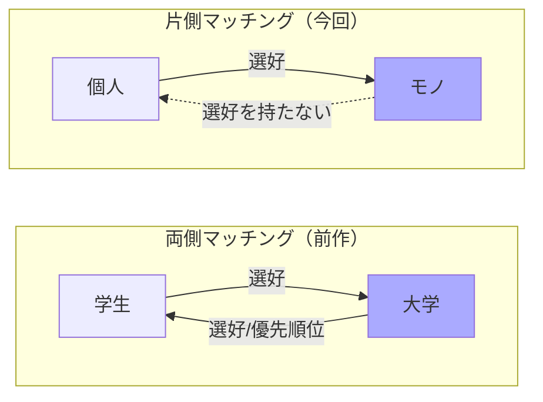
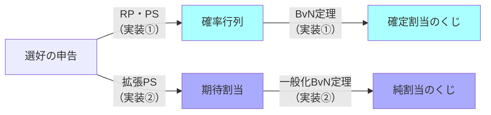

## はじめに

<!-- バナー画像をここに貼る（例: 0Overview2.png）。前作の 0Overview.png と同じ要領で Qiita にアップロードしてURLを差し込む -->


前作シリーズ（DA・FDA・CA）では、両者がともに選好をもつ**両側マッチング**を扱いました。今回は片方のみ選好を持つ**片側マッチング**を、ソースコードを書きながらエンジニア目線で整理します。本記事はシリーズ全体で使う内容を共有知識としてまとめたものです。想定する読者は「**マッチング理論の初学者エンジニア**」です。

**本シリーズ（片側マッチング）**

- 【**準備**】マッチング理論 〜割り当て問題の共有知識〜 ← <font color=red><b>今回はここ！</b></font>
- 【**実装①**】RP・PSメカニズムと実際の割り当て
- 【**実装②**】多対1の割り当てと一般化BvN定理
- [サンプルコード](https://github.com/itokohei0/MarketDesignStudy/tree/master/%E3%83%9E%E3%83%83%E3%83%81%E3%83%B3%E3%82%B0%E7%90%86%E8%AB%96)
<!-- TODO: 実装編2本の公開後、上記リストにURLを差し込む -->

**前作シリーズ（両側マッチング）**

- [【準備】マッチング理論 〜マッチング問題の共有知識〜](https://qiita.com/_it_/items/1cdd9059282cb774f8cc)
- [【実装】DAアルゴリズム](https://qiita.com/_it_/items/fc3d58a337d2eb6f2408)
- [【実装】FDAアルゴリズム](https://qiita.com/_it_/items/0b30fe9acdb55c7e8897)
- [【実装】CAアルゴリズム](https://qiita.com/_it_/items/75f1f63e3d57a3de4aaf)

<font color=red>1エンジニアの独学で作った記事なので間違った内容を含むと思います。遠慮なくコメントいただけますと幸いです。</font>

### 【今回のテーマ】ヒトとモノのマッチング

今回扱うのは、片方（ヒト）だけが選好を持ち、もう片方（モノ）は選好を持たない**片側マッチング**です。

:::note info
【**メカニズムとは？**】
人々が申告した選好（希望リスト）を受け取り、1つの割り当てを返す「手続き」のことです。本記事ではこれを探すことを目的として、**割り当て**という言葉を使います。
:::



身近な例としては次のようなものがあります。

| 例                 | ヒト | モノ         |
| ------------------ | ---- | ------------ |
| 学生寮の割り当て   | 学生 | 部屋         |
| 腎臓移植           | 患者 | 提供腎       |
| 社内の案件アサイン | 社員 | プロジェクト |

モノは「誰に割り当てられたいか」を持たないので、両側マッチングの**安定性**は今回出番がありません。代わりに「**効率性**」と「**公平性**」を考えます。

## 【基礎】

### 確率行列

割り当て問題では「2人それぞれに確率 $\frac{1}{2}$ で枠を与える」のような**確率的な割り当て**を考え、最低限の公平性を担保します。「誰が・何を・どの確率で」もらえるかをまとめた行列を**確率行列**と呼びます。

| 要素               | 記号              | 説明                               |
| ------------------ | ----------------- | ---------------------------------- |
| 個人の集合         | $N=\{1,2,\dots\}$ | 選好を持つ側（学生・社員など）     |
| 財の集合           | $O=\{a,b,\dots\}$ | 割り当てられるモノ（部屋・枠など） |
| 「何ももらわない」 | $\emptyset$       | 供給数は無制限                     |
| 財 $a$ の供給数    | $q_a$             | その財の在庫                       |
| 割り当て確率       | $P_{ia}$          | 個人 $i$ に財 $a$ が割り当たる確率 |

確率行列 $P$ は各行が「ある個人の割り当て確率」を表し、次の2条件を満たします。

- 【**条件1**】$\displaystyle\sum_{a\in O}P_{ia}=1$ ── 各個人は必ずどれか（$\emptyset$ も含む）を受け取る（**行の和は1**）
- 【**条件2**】$\displaystyle\sum_{i\in N}P_{ia}\leqq q_a$ ── 供給数を超える割り当てはない（**列の和は供給数以下**）

### 割り当て問題における望ましい性質

割り当てメカニズムの「良さ」は次の4つで測ります。ここで、**水平性と無羨望性は公平性の一種**で、無羨望性の方が強い性質です（無羨望性を満たせば水平性も満たします）。


| 性質           | ひとことで言うと                       |
| -------------- | -------------------------------------- |
| **耐戦略性**   | 正直に希望を出すのが常に得             |
| **水平性**     | 同じ希望の人には同じ確率を与える       |
| **無羨望性**   | 誰も他人の割り当てをうらやましがらない |
| **順序効率性** | 確率を融通しても、もう誰も得できない   |

## 【取り扱う内容】2つのメカニズムと確定的な割り当て変換

### 【2つのメカニズム】RPメカニズムとPSメカニズム

RPとPSは得意な性質が違います。ここでは**考え方と性質の全体像**だけを押さえます。

|            |   RPメカニズム    |   PSメカニズム    |
| ---------- | :---------------: | :---------------: |
| 耐戦略性   |         ✅         | 大規模な市場なら✅ |
| 水平性     |         ✅         |         ✅         |
| 無羨望性   | 大規模な市場なら✅ |         ✅         |
| 順序効率性 | 大規模な市場なら✅ |         ✅         |

- 【**RPメカニズム（均等確率優先順位 / Random Priority）**】くじで順番を決めて、順番が早い人から好きなモノを取っていく、という直感的なメカニズムです。「逐次独裁制」とも呼びます（順番が来た人はその瞬間"独裁者"のように好きに選べる）。
- 【**PSメカニズム（同時確率消費 / Probabilistic Serial）**】全員が同時に、好きなモノを少しずつ「食べていく」イメージで「イーティングアルゴリズム」とも呼ばれます。なお無羨望性を満たすので、水平性も自動的に満たします。

#### 大きい市場におけるRPメカニズムとPSメカニズム

<!-- くじ番号と確率の対応図 -->


RPとPSは一長一短ですが、そもそもすべての性質を満たす理想のメカニズムは作れません。

:::note alert
【**割り当てメカニズムの不可能性定理（Bogomolnaia and Moulin 2001）**】
水平性・順序効率性・耐戦略性を同時に満たす確率的割り当てメカニズムは存在しない
:::

では結局どちらが良いのか。市場を大きくすると、2つは近似的に似た帰結を与えます。

:::note info
【**チェ＝小島の定理（Che and Kojima 2010）**】
各財が $q$ 個供給される市場で、選好 $\pi$ の個人が財 $a$ をもらう確率を RP・PS それぞれ $RP_a^q(\pi)$、$PS_a^q(\pi)$ とすると $\lim_{q\to\infty}\bigl|RP_a^q(\pi)-PS_a^q(\pi)\bigr|=0$
:::

供給数を増やすと**大数の法則**で2つの確率が一致してきます。ただし「同じになる」のではなく「**漸近的に同じ**」です。差が徐々に小さくなるという連続的な見方が大事で、「効率的か否か」の二択で評価すると本質を見落とします。

|            | RPメカニズム                       | PSメカニズム             |
| ---------- | ---------------------------------- | ------------------------ |
| 直感       | くじで順番を決めて選ぶ             | 全員同時に少しずつ食べる |
| 大市場では | 順序効率性・無羨望性も近似的に回復 | 耐戦略性も回復           |

理論的な不可能性はあるものの、現実の大規模な割り当て（学校選択制など）では、RPもPSも望ましい性質を**近似的にすべて**満たします。

### 【確定的な割り当ての変換】バーコフ＝フォン・ノイマンの定理

RPもPSも、出力は**確率行列**です。しかし「財 $a$ を確率 $\frac{1}{2}$ でもらえます」と言われても、**実際に何をもらえるのかは決まっていません**。確率行列は**設計図**であって、最後は1つの確定的な割り当てに落とし込む必要があります。

その橋渡しが**バーコフ＝フォン・ノイマンの定理**（以下 $\text{BvN}$）です。ここでも**考え方だけ**を押さえ、分解手順と実装は実装編で扱います。用語は3つです。

| 用語         | 定義                                                      |
| ------------ | --------------------------------------------------------- |
| 二重確率行列 | 各要素が非負で、各**行・各列**の和が1の正方行列           |
| 置換行列     | 各行・各列に1が1つだけある行列（＝1つの確定的な割り当て） |
| 凸結合       | 重みが非負で総和が1の重みつき和                           |

:::note info
【**バーコフ＝フォン・ノイマン（$\text{BvN：Birkhoff-von Neumann}$）の定理**】
どんな**二重確率行列**も、**置換行列の凸結合**で表現できる。
:::

置換行列は「確率1で誰に何を配るか」を表す確定的な割り当てです。だから凸結合に分解できれば「**重みにしたがってくじを引き、当たった置換行列のとおりに配る**」という、実際に遂行できる手続きが得られます。個人2人に財 $\{a,b\}$ を割り当てる最小の例です。

```math
\left(
  \begin{array}{cc}
    1/2 & 1/2\\
    1/2 & 1/2
  \end{array}
\right)
=\frac{1}{2}\!
\underbrace{\left(
  \begin{array}{cc}
    1&0\\ 0&1
  \end{array}
\right)}_{置換行列}
+\frac{1}{2}\!
\underbrace{\left(
  \begin{array}{cc}
    0&1\\ 1&0
  \end{array}
\right)}_{置換行列}
```

この式は「**確率 $\frac{1}{2}$ で 個人1に $a$・個人2に $b$ を配り、確率 $\frac{1}{2}$ で 個人1に $b$・個人2に $a$ を配る**」という手続きを表しています。

:::note warn
**BvN定理が効く範囲**
定理が使えるのは「**正方の二重確率行列**」だけ、つまり「$n$人に$n$種類の財を1人1つずつ」という設定に限られます。定員が2以上の学校は扱えません。**この制限をどう外すか**が実装②のテーマです。
:::

## 【見取り図】

次回からは実装編です。ここで、実装編2本で何を学ぶのかを先に示しておきます。

### 処理フローは常に3段

割り当て問題は、どの設定でも「**選好 → メカニズム → 分解定理 → くじ**」の3段で進みます。ここまで見てきたRP・PSが**メカニズム**、BvN定理が**分解定理**にあたります。実装編2本は、この3段を**2つの設定**で埋めていきます。



### 実装①（1対1）と実装②（多対1）の違い

|              | 1対1（実装①）              | 多対1（実装②）                 |
| ------------ | -------------------------- | ------------------------------ |
| 例           | 学生寮の部屋割り（1人1室） | 学校選択（1校に複数人）        |
| **行の和**   | 1（各人ちょうど1つ）       | 1のまま                        |
| **列の和**   | 1（各財1個）               | **定員（2以上）**              |
| **列の内部** | 制約なし                   | **グループ別クォータを置ける** |
| メカニズム   | RP・PS                     | 拡張PS                         |
| 分解定理     | BvN定理                    | 一般化BvN定理                  |

「列の内部に制約を置く」とは「**この学校は特定の学区から取る人数を◯人まで**」といった条件です。ソウル市や日本の学校選択制で実際に使われています。

## 参考文献

- [マッチング理論とマーケットデザイン（2024）](https://www.amazon.co.jp/dp/453555935X)
- [Budish, Che, Kojima and Milgrom (2013)](https://static1.squarespace.com/static/5e56e1139e190014f1116cac/t/5e5c89d29d9d61249de4e77b/1583122898804/budish-che-kojima-milgrom-2013-aer.pdf)
