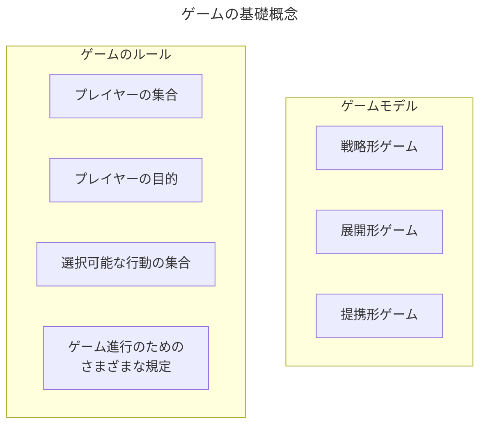
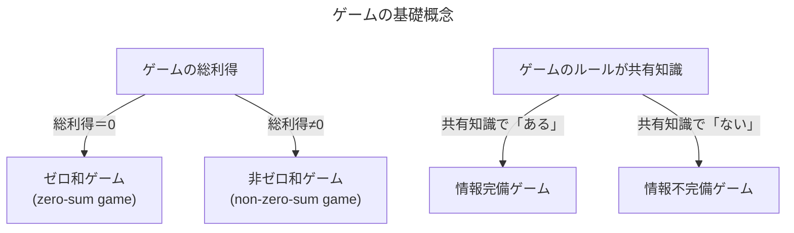
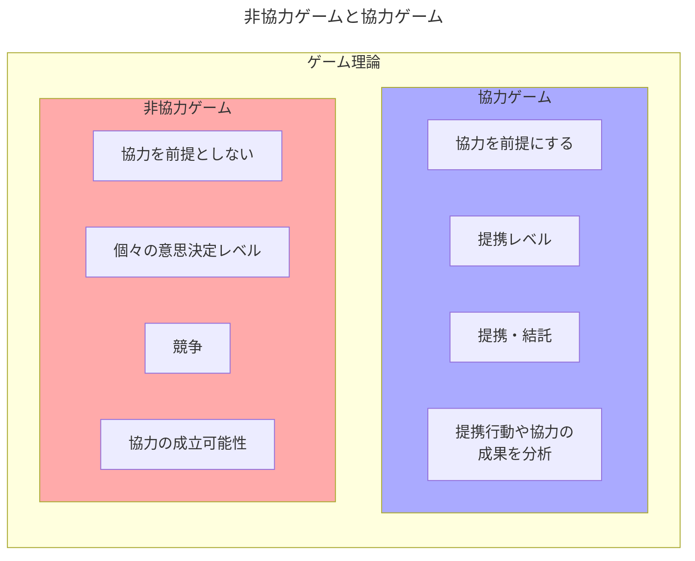

# ゲーム理論とは何か

## ゲーム的状況

- 日常生活・経済社会における意思決定を自動車を例に取ってみる。
  - 【**購入者個人の視点**】自身の収入と自動車価格、購入後の用途（通勤、レジャーなど）、居住区の自動車の普及率、購入車種の人気、購入先のディーラーの販売実績や評判、購入者の運転スキル、など
  - 【**自動車メーカーの視点**】消費者の需要動向調査、ライバルメーカーの調査、新車のデザインや性能の評価、販売価格の決定、営業戦略の策定、部品メーカーの折衝、海外市場への参入計画・戦略立案、など
- 上記のような、消費者、ディーラー、自動車メーカー、部品メーカー、外国企業、自国政府、外国政府、などの意思決定が程度の差はあれどさまざまな形で複雑に依存し合う。
- **ゲーム理論**は「経済社会におけるさまざまな意思決定の相互依存関係を数理的で厳密な方法論を用いて分析する理論」であり、あたかも複数のプレイヤーがそれぞれの目標に向かって互いに競い合い、時には協力し合う一種のゲームを指す。
- ゲーム理論の対象はあらゆる「ゲーム的状況」である。**ゲーム的状況**とは「複数の意思決定主体または行動主体が存在し、それぞれ一定の目的の実現を目指して相互に依存し合っている状況」を意味する。このようなゲーム的状況を数理モデルを用いて定式化し、プレイヤー間の利害の対立と協力を分析する。この数理モデルを「ゲーム」と言う。

## ゲームの基礎概念

- 【**プレイヤー**】意思決定し、行動する自律的な最小単位の主体。例えば、消費者や投資家などの個人、企業や政党などの組織、政府や国家など。
- 【**$n$人ゲーム**】プレイヤー数が$n$人のゲーム
- ゲームにおいて、プレイヤーはそれぞれに明確な目的を持ち、可能な限り自分の目的を達成するように行動を選択することが前提とされる。この意味でゲームにおけるプレイヤーは合理的である。
- 【**ゼロ和ゲーム（zero-sum game）**】プレイヤー（特に2人）の目的が完全に相反するゲーム
- 【**非ゼロ和ゲーム（non-zero-sum game）**】ゼロ和ゲームではないゲーム。プレイヤー（特に2人）の目的が部分的に一致するゲーム。
- 【**提携**】複数のプレイヤーが協力を目的として形成する集団
- 【**戦略**】ゲームをプレイするために日宇町な行動計画
- 【**選好順序**】個人が複数の選択肢に対して抱く「好みの度合い」や「望ましさの順序」を論理的に整理したもの
- 【**効用（利得）**】プレイヤーの選好順序を数値化したもの
- 【**ゲームのルール**】プレイヤーの集合、プレイヤーの目的、選択可能な行動の集合、さらにゲームのプレイの進行を定めるさまざまな規定の総称
- 【**情報完備ゲーム**】ゲームに参加する全プレイヤーがゲームのルールを完全に知っていて、さらに全プレイヤーが他のプレイヤーもゲームのルールを完全に知っていることを相互に認識し合っているゲーム。例えば、チェスや将棋、野球などのスポーツなど。この時のゲームのルールはプレイヤーの「**共有知識**」であるという。
- 【**情報不完備ゲーム**】ゲームのルールがプレイヤー間で共有知識でないゲーム。ライバル企業の目的や生産技術、国際交渉における相手国の事情など。
- 【**ゲームモデル**】ゲームモデルの代表的なものに、戦略形ゲーム、展開形ゲーム、提携形ゲームがある。
  - 【**戦略形ゲーム**】プレイヤーの戦略と利得の関係を関数や行列を用いてプレイヤーの相互依存関係を表現する基本的なモデル。
  - 【**展開形ゲーム**】プレイヤーの手番と行動の系列をゲームの木を用いて記述し、ゲームの動学的構造や情報構造を定式化する。現実の経済社会はダイナミックであり、現代の経済学では展開形ゲームのモデルを用いた分析が極めて重要になっている。
  - 【**提携形ゲーム**】プレイヤーのさまざまな提携にとって実現可能な総利得または利得分配の集合を記述し、提携行動の分析に用いられる。

## 非協力ゲームの理論と協力ゲームの理論

- ゲーム理論は「非協力ゲーム」の理論と「協力ゲーム」の理論に大別されてきた。現在のゲーム理論研究者の多くの一致した見解は以下のとおり。
  - 【**非協力ゲーム**】プレイヤーの間の協力を前提としないで、競争や協力などのさまざまな経済行動をここのプレイヤーの意思決定のレベルで分析する。**個々のプレイヤーの意思決定レベルでゲームを分析する理論**。
  - 【**協力ゲーム**】プレイヤーの間の協力を前提として、プレイヤーの提携行動や協力の成果を分析する。**プレイヤーの提携レベルでゲームを分析する理論**。
- 非協力ゲームと協力ゲームは対立する理論ではなく、複雑で多様な経済行動を個々のプレイヤーのレベルで分析するか、「プレイヤーの提携レベルで分析するかの違いである。これらの理論を統合するゲームの一般理論を構築する試みがさまざまな形で行われており、非協力ゲーム理論と協力ゲーム理論という2分法は意味を失いつつある。

## ゲーム理論の歴史

- 
