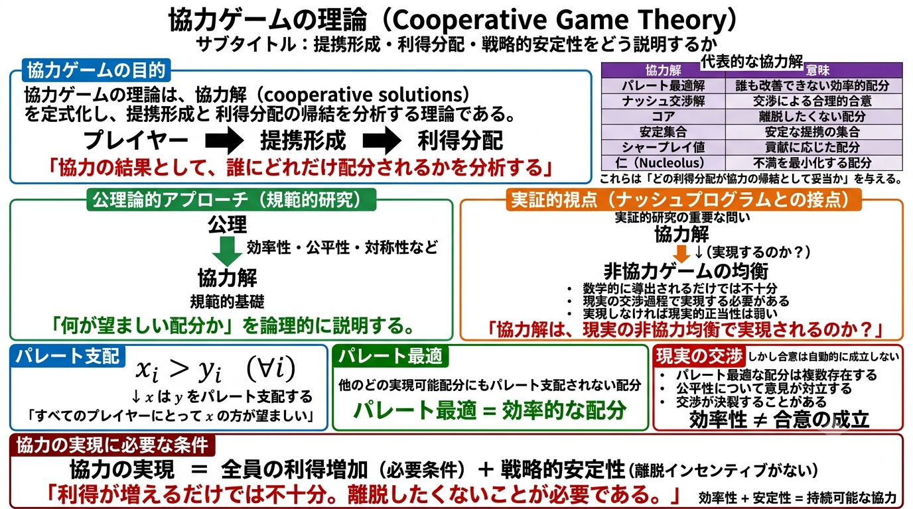
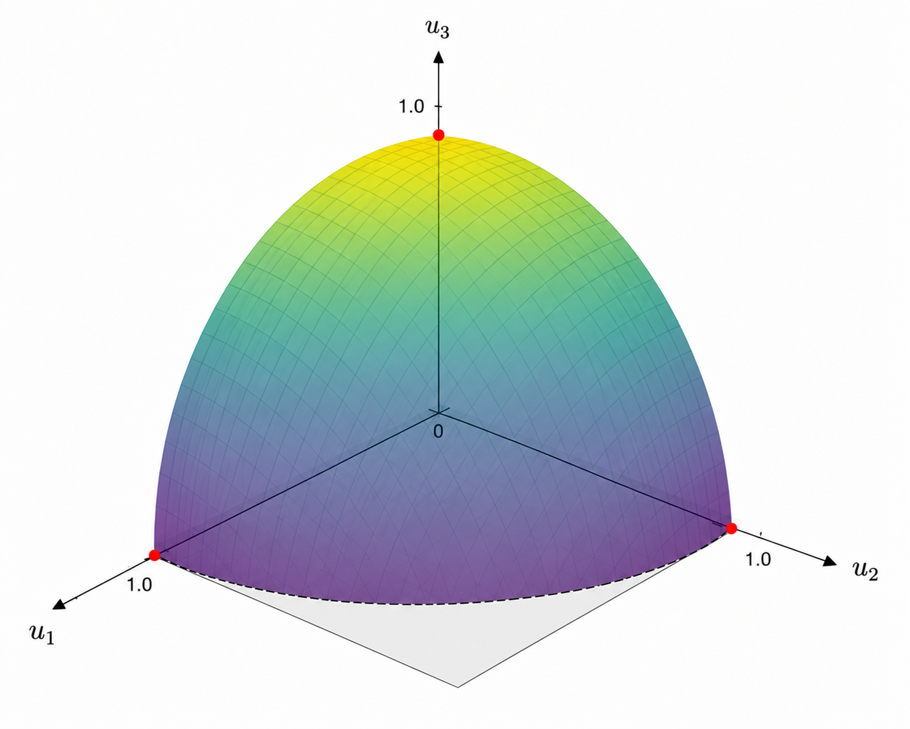

# $n$ 人提携交渉問題

## ナッシュプログラム

- ナッシュプログラムとは、非協力ゲーム理論を用いて協力の問題を研究する枠組みであり、本章では$n$人交渉問題における基本結果を扱う。ナッシュ（1951）は非協力ゲームを「**①プレイヤー間で話し合いができず、②拘束力のある合意ができないゲーム**」と定義した。これに対し、協力ゲームは「**話し合いと拘束力ある合意が可能なゲーム**」とされた。
- 非協力ゲームの典型例である囚人のジレンマは話し合いも拘束力のある約束や合意もできない。この区別は戦略形では明瞭だったが、展開形では必ずしも明確でなく、誤解を生んだ。現代では$\text{Harsanyi and Selten 1988}$による非協力ゲームの定義がより適切であり、その意味を考える。
- $\text{Rubinstein 1982}$による2人逐次交渉ゲームではプレイヤーが合意するまで分配の提案と応答を繰り返す。もし提案が受諾されれば合意が成立して交渉が終了し、合意に基づいて分配される。このモデルは話し合いも拘束力のある合意を持つ。なのになぜ、ルービンシュタインの交渉ゲームは非協力ゲームなのか、その理由は「**ゲームの<ruby>外で<rt>⚫⚫</rt></ruby>話し合いや合意ができないから**」である。
- 以上より、ルーサニとゼルテンは非協力ゲームを「<ruby>展開形ゲームの中で記述されているものを除いて<rt>⚫⚫⚫⚫⚫⚫⚫⚫⚫⚫⚫⚫⚫⚫⚫⚫⚫⚫⚫⚫⚫⚫</rt></ruby>プレイヤー間で拘束力のある合意ができないゲーム」と定義した。従って、<u>非協力ゲームを分析する適切な解はナッシュ均衡点とその精緻化である完全均衡点やベイジアン均衡点である</u>。

#### 協力ゲームの理論

- これまでの協力ゲーム理論は、パレート最適解、ナッシュ交渉解、コア、安定集合、シャープレイ値、仁、などの<b>協力解（$\text{cooperative solution}$）</b>を定式化し、ゲームにおける提携形成と利得分配を分析してきた。これらの協力解は一定の提携行動を前提として協力の帰結を示し、経済分析に広く応用されている。<u>協力ゲームの理論の主要な研究方法は公理論的アプローチ</u>であり、公理論的アプローチによって協力解は規範的基礎が論理的に明らかにされた。
- 一方、実証的視点では協力解を数学的に導出するだけでなく、「**現実の交渉状況を記述するゲームの非協力均衡点において協力解が実現されるか**」を明らかにすることが重要になる。もし実現されないなら協力解は現実的正当性を失う。提携による集団的意思決定はメンバーの選好を交渉や投票などの方法で集計したものであり、プレイヤーの提携行動は個々のメンバーの意思決定から説明すべきである。
- 例えば、ほとんどの協力解が前提とするパレート最適性について考える。今、2つの利得分配$x,\;y$に対して、ゲームに参加するすべてのプレイヤーが$x$の方が$y$より大きな利得を得るならば「$\color{red}x\text{は}y\text{をパレート支配する}$」という。また、実現可能な利得分配の中でどの利得分配にもパレート支配されない利得分配は「パレート最適である」という。
- パレート最適性の公理は「協力の帰結（またはその合意）はパレート最適である」というものである。公理の背景には、もし全員の利得が増えるならば、プレイヤーは協力するという考え（**協力の原理**）がある。<u>この協力の原理は直感的で自然であるが自明ではなく、その妥当性を検討する必要がある。すべてのプレイヤーの利得の増加は協力のために必要条件であっても十分条件ではない</u>。例えば、一般にパレート最適な利得分配は複数存在するがプレイヤーが対立した場合、合意が成立しない可能性がある。実際、現実の交渉では分配の公平性について意見が対立し、交渉が失敗することが多い。「<b>協力の実現</b>」には全員の利得の増加に加えて、プレイヤーが協力から離脱するインセンティブがないという戦略的な安定性が必要である。

## $n$ 人純粋交渉問題

- 最初に提携形成のない$n$人交渉問題である純粋交渉問題（$\text{pure bargaining problem}$）を考える。純粋交渉問題では、全員が協力するかどうかが重要である。もし全員が協力するならば、どのような利得分配を実現するかについて交渉が行われる。
- プレイヤーの集合を$N=\{1,\cdots,n\}$とすると、$n$人純粋交渉問題は定義11.1のようになる。

> 【**定義11.1**】
> $n$人純粋交渉問題は実現可能集合$U$と交渉の不一致点（または現状点）$d$の組$(U,\;d)$によって定義される。ここで、以下の3つを仮定する。
> 1. $U$ は $n$ 次元実空間 $R^n$ のコンパクトで凸な部分集合である。
> 2. $d=(d_1,\cdots,d_n)\in U$
> 3. 全ての $i\in N$ で $x_i>d_i$ となる $U$ の点 $x=(x_1,\cdots,x_n)$ が存在する

- 本節では純粋交渉問題を単に「**交渉問題**」と呼ぶ。定義8.2と同様に利得配分のパレート最適性と個人合理性が定義できる。
- 実現可能集合$U$の個人合理的な利得ベクトルの集合を$U_+$で表す。以下では、$U_+$の（強）パレート最適な利得ベクトルの集合（パレート境界という）が、ある$n$変数関数$H$について$H(x)=H(x_1,\cdots,x_n)=0$を満たす$x\in R^n$の集合として表されるとする。ここで、一般性を失うことなく、全ての$x\in U_+$に対して$H(x)\geqq 0$とする。また実現可能集合とパレート境界について次の仮定11.1を仮定する。
> 【**仮定11.1**】$(U,d)$を$n$人交渉問題とする。
> - 【**性質1**】実現可能集合$U$は$n$次元であり、$R^n$と同じ次元を持つ。
> - 【**性質2**】個人合理的な利得ベクトルの集合$U_+$のパレート境界は点$d$を通る$n$本の直線 $\{(x_i,\;d_{-i})\;|\;x_i\in R\}\quad i\in N$ と交わる。つまり、$U_+$では「パレート最適な利得分配の集合」と「強いパレート最適な利得分配の集合」は一致する。
> - 【**性質3**】$n$変数関数$H$は微分可能な凸関数で、次を満たす。$$\frac{\partial H}{\partial x_1}\leqq 0,\;\frac{\partial H}{\partial x_2}\leqq 0,\;\cdots,\;\frac{\partial H}{\partial x_n}\leqq 0,\;$$つまり、$U_+$のパレート境界上ではどの2つの変数$x_i,\;x_j$も（他の変数の値が一定のとき）互いの減少関数であることを意味する。

- $n$人のプレイヤーが一定額の分配をめぐる交渉問題は仮定11.1を満たす。これを次の3人交渉問題の例で確認する。

#### 【例】3人交渉問題

3人のプレイヤーが純利益$1$の分配をめぐって交渉し、交渉が失敗すればプレイヤーの利益は$0$である。実現可能集合$U$、交渉の不一致点$d$、利得分配$x$、関数$H$はそれぞれ以下のように定義し、①全てのプレイヤーがリスク中立的であるケースと②リスク回避的であるケースで分けて考える。

$$\begin{align*}
    【\text{実現可能集合}】&U\coloneqq\{x\in R^3_+\;|\;H(x_1,x_2,x_3)\geqq 0\}\\[1mm]
    【\text{交渉の不一致点}】&d=(0,0,0)\in U\\[1mm]
    【\text{利得分配}】&x=(x_1,x_2,x_3)\in U\quad (x_1+x_2+x_3\leqq 1)\\[1mm]
    【\text{関数}】&H(x_1,x_2,x_3)=1-(x_1+x_2+x_3)\\[1mm]
\end{align*}$$

- 【**リスク中立的**】金額$x_i$に対する効用関数を$u_i(x)=x_i$とすると、実現可能な利得分配$x=(x_1,x_2,x_3)$は$x_1+x_2+x_3\leqq 1$を満たす。この時、交渉問題$(U,d)$は仮定11.1を満たす。
- 【**リスク回避的**】金額$x_i$に対して効用関数$u_i(x)=\sqrt{x_i}$を持つとする。この時、実現可能な利得ベクトル$u=(u_1,u_2,u_3)$ は $u^2_1+u^2_2+u^2_3\leqq 1$ を満たす。すると$H$は$H(u_1,u_2,u_3)=1-(u^2_1+u^2_2+u^2_3)$と表現でき、$U$は$U\coloneqq\{u\in R^3_+\;|\;H(u_1,u_2,u_3)\geqq 0\}$で与えられる。この時、交渉問題$(U,d)$は仮定11.1を満たす。

下図は個人合理性を満たす実現可能集合$U_+$を示す。

- 次にナッシュ交渉解を考える。プレイヤー集合$N$の上の確率分布の集合を$\varDelta(N)$遠く。

> 【**定義11.2**】
> プレイヤー集合$N$の上の確率分布の集合を$\varDelta(N)$と置く。$(U,d)$を$n$人交渉問題とし、$\theta=(\theta_1,\cdots,\theta_n)\in\varDelta(N)$とする。利得ベクトル$x^*\in U$が$(U,d)$のナッシュ交渉解であるとは、以下を満たす時をいう。$$
> \max_{x\in U：u\geqq d}\;(x_1-d_1)^{\theta_1}\times\cdots\times(x_n-d_n)^{\theta_n}
> $$$\theta$をプレイヤーの**重みベクトル**といい、第 $i$ 成分 $\theta_i$ をプレイヤー $i$ の重みという。（一般化された）ナッシュ交渉解では、効用差の積はプレイヤーの重みで調整される。重みの大きいプレイヤーの効用差の積が他のプレイヤーに比べて高く評価され、重みベクトルはプレイヤーの交渉力の違いを反映している。

- 定義11.2を踏まえ、ナッシュ交渉会の基本的な性質を示す。

> 【**定理11.1**】
> $(U,d)$を$n$人交渉問題とする。利得ベクトル$x^*\in U$が$(U,d)$のナッシュ交渉会であるための必要十分条件は、ある$\lambda\geqq 0$とプレイヤー $i$ の重み $\theta_i$ が存在して、以下が成り立つことである。$$\begin{align}
>   &\frac{\theta_i}{x_i^*-d_i}+\lambda\frac{\partial H}{\partial x_i}(x^*)=0,\quad i\in N\\[4mm]
>   &H(x^*)=0
> \end{align}$$
> 
> 【**証明**】
> 

#### 【例】利得1の分配交渉

- 

> 【**定理11.2**】
> 
> 
> 【**証明**】
> 

#### 部分ゲーム完全均衡点の精緻化

- 

> 【**定義11.3**】
> 

> 【**定理11.3**】
> 
> 
> 【**証明**】
> 

## 提携交渉のパレート最適性

- 

#### 【例】3人対称協力ゲーム

- 

#### 提携形成を含む交渉ゲームにおけるSSPE

> 【**定義11.4**】
> 

> 【**定理11.4**】
> 
> 
> 【**証明**】
> 

> 【**定理11.5**】
> 
> 
> 【**証明**】
> 

#### パレート最適でないSSPE

- 

## コアの交渉ゲーム

- 

#### 【例】非コア配分を実現するSSPE

- 

> 【**定義11.5**】
> 

> 【**定理11.6**】
> 
> 
> 【**証明**】
> 

## シャープレイ値の交渉ゲーム

- 

> 【**定理11.7**】
> 
> 
> 【**証明**】
> 

> 【**定理11.8**】
> 
> 
> 【**証明**】
> 

## 応用例

### 1人の売り手と2人の買い手の取引

- 

### 2大国と1小国の分配交渉

- 

### 資本家と労働者の賃金交渉：完全雇用の条件

- 

### $n$ 人多数決ゲーム

- 

### 議会交渉の実証分析

- 
