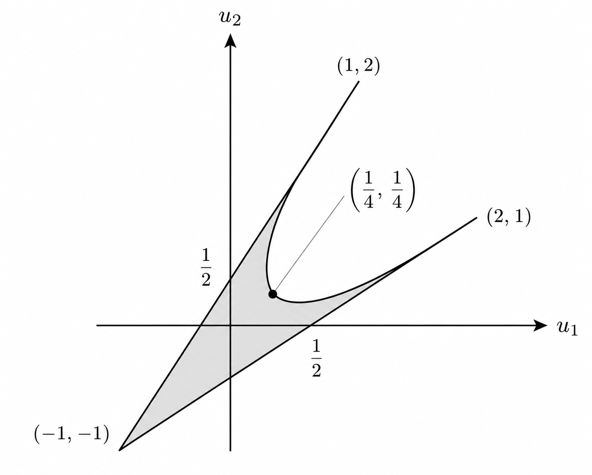

# 戦略型ゲーム

## 戦略型ゲームの定義

- 社会におけるさまざまなゲーム的状況では、プレイヤーの意思決定は相互に関連し、他のプレイヤーの戦略にも依存する。このようなプレイヤーの相互依存関係を表現する基本的なモデルが戦略形ゲームであり、プレイヤーの可能な戦略と利得の関係を関数や行列を用いて表現する。
- 本章では戦略形ゲームの基本的事項とナッシュ均衡点の基本的性質について述べる。

#### 戦略形ゲーム（標準形ゲーム）のモデル

$$
【\bold{戦略形n人ゲーム}】G=(N,\{S_i\}_{i\in N},\{f_i\}_{i\in N})\\[2mm]
\begin{align*}
    (1)\quad&N=\{1,\cdots,n\}\text{ はプレイヤーの集合}\\
    (2)\quad&S_i\text{ はプレイヤー }i\text{ の選択可能な行動あるいは戦略の集合}\\
    (3)\quad&f_i\text{ は直積集合}S=S_1\times\cdots\times S_n\text{で定義された実数値関数であり、}\\&\text{プレイヤー}i\text{の利得関数を表す。}
\end{align*}
$$

- 前節の例のように、プレイヤーの戦略と利得によって定義されるゲームを**戦略形ゲーム（$\text{game in strategic form}$）** や**標準形ゲーム（$\text{game in normal form}$）** と呼ばれる。
- 戦略形ゲームのモデルは上のように表現され、次のようにプレイされる。
  1. すべてのプレイヤー$i$は他のプレイヤーの選択を知らずにそれぞれの戦略$s_i$を選択する。
  2. プレイヤー$i$は利得$f_i(s_1,\cdots,s_n)$を得る。プレイヤーの目的は利得最大化である。
- ゲームのプレイにおいて上で定義されるゲームの各要素はすべてのプレイヤーの共有知識（$\text{common knowledge}$）とする。共有知識は「**すべてのプレイヤーがゲームの各要素を完全に知っているだけでなく、そのような事実自身もプレイヤーは完全に知っていること**」を意味する。

**ゼロ和ゲーム・非ゼロ和ゲーム**

$$
【\bold{ゼロ和ゲーム}】\sum_{i=1}^nf_i(s_1,\cdots,s_n)=0,\;
【\bold{非ゼロ和ゲーム}】\sum_{i=1}^nf_i(s_1,\cdots,s_n)\neq 0
$$

- 上式のようにプレイヤーの利得の和が0のゲームを**ゼロ和ゲーム**と言い、そうでないゲームを**非ゼロ和ゲーム**という。また**定和である**とは、任意の定数$K$を用いて以下を満たす時をいう。$$【\bold{定和}】\sum_{i=1}^nf_i(s_1,\cdots,s_n)=K$$

#### 【例】市場シェアゲーム

2つの企業A社とB社が新製品の生産・販売を通して市場シェアを競っている。現在は$50\%$の市場シェアを占有しているが、もし1社だけが新製品の販売を始めれば市場シェアを$70\%$に上げることができる。もし両者とも新製品の販売を始めれば、市場シェアは現状と同じ$50\%$になる。企業の市場シェアはライバル企業の経営戦略にも依存し、企業の市場シェアと経営戦略の関係は下表のようになる。

| A社＼B社       | 新製品開発    | 現状維持      |
| -------------- | ------------- | ------------- |
| **新製品開発** | $50\%,\;50\%$ | $70\%,\;30\%$ |
| **現状維持**   | $30\%,\;70\%$ | $50\%,\;50\%$ |

#### 【例】囚人のジレンマ

犯罪者2人が取り調べを受けている。検事は十分な証拠を掴んでいないが、拳銃の不法所持などの余罪で2人を起訴できる。容疑者2人を相談できないように別々の取調室に隔離し、次のように言った。

> 「お前たちの選択は罪を自白するか黙秘するかだ。もし2人が自白すれば2人とも8年の懲役刑を受け、もし2人とも自白しなければ2人の刑は拳銃の不法所持で1年であろう。もし一方だけが罪を自白すれば自白した者は3ヶ月の軽い刑となり、自白しなかった者は10年の刑を受ける。」

このゲームは**囚人のジレンマ**と呼ばれ、利得行列は下表のようになる。

| 囚人1＼囚人2 | 黙秘            | 自白            |
| ------------ | --------------- | --------------- |
| **黙秘**     | $1$年, $1$年    | $10$年, $3$カ月 |
| **自白**     | $3$カ月, $10$年 | $8$年, $8$年    |

#### 【例】男女の争い

男性と女性がデートの行き先として、ボクシングとバレエの選択肢を持っている。男性はボクシング、女性はバレエを好むとし、2人にとって別々に好きなものを見るより一緒に出掛ける方が大切である。この時の利得行列は下表になり、男女間で相談なしに相手と独立にデートの行き先を選択しなければならないとき、どのような選択をするだろうか。このゲームは**男女の争い**と呼ばれている。

| 男性＼女性     | ボクシング | バレエ    |
| -------------- | ---------- | --------- |
| **ボクシング** | $2,\;1$    | $-1,\;-1$ |
| **バレエ**     | $-1,\;-1$  | $1,\;2$   |

## ナッシュ均衡点

#### 非協力ゲームの理論と取り扱う問題

- 前節では戦略形ゲームの3例を見た。いずれのゲームでもプレイヤーは互いに相談することなく、自分の戦略を選択しなければならない。
  1. **市場シェアゲーム**はゼロ和であり、戦略について相談すること自体が無意味である。
  2. **囚人のジレンマゲーム**では、2人の囚人は隔離されているため物理的にコミュニケーションが不可能である。
  3. **男女の争いゲーム**では、たとえ男女間で話し合いが可能であっても相談を始める前に互いの希望を表明し合う状況を想定すれば良い。
- 上記いずれの状況においても、プレイヤーは相手プレイヤーの戦略を予測した上で、自らの取るべき戦略を選択しなければならない。このように「<b>プレイヤーが互いの戦略を独立決定するような状況においてプレイヤーの合理的な予測と意思決定を解明する理論</b>」が非協力ゲームの理論である。
- 非協力ゲームの理論における最も重要な問題は「**ゲームにおいてもし個々のプレイヤーが十分に理性的で合理的ならば相手プレイヤーの戦略をどのように予測し、どのような戦略を選択するか**」ということである。

#### 【非協力ゲームの解概念】ナッシュ均衡点

- 今、$G=(N,\{S_i\}_{i\in N},\{f_i\}_{i\in N})$を戦略形$n$人ゲームとする。$s=(s_1,\cdots,s_n)$プレイヤーの戦略の組とし、$s$の第$i$成分$s_i$を除いてできるプレイヤー$i$以外の$n-1$人のプレイヤーの戦略の組を$s_{-i}=(s_1,\cdots,s_{i-1},s_{i+1},\cdots,s_n)$と置く。また、戦略の組$s$に対するプレイヤー$i$の利得$f_i(s)$を$f_i(s_i,s_{-i})$とも表記する。

> 【**定義2.1**】
> 戦略形$n$人ゲームを$G=(N,\{S_i\}_{i\in N},\{f_i\}_{i\in N})$ とする。プレイヤー$i$の戦略$s_i\in S_i$が他の$n-1$人のプレイヤーの戦略の組$s_{-i}=(s_1,\cdots,s_{i-1},s_{i+1},\cdots,s_n)$に対する**最適応答（$\text{best response}$）である**とは次の式を満たすことをいう。$$
> f_i(s_i,s_{-i})=\max_{t_i\in S_i}\;f_i(t_i,s_{-i})
> $$戦略の組$s_{-i}$に対するプレイヤー$i$の最適応答の全体を$B_i(s_{-i})$と置く。

- 最適応答は非協力ゲームの理論において基本的な概念である。上式の最適反応は「プレイヤー$i$は他のプレイヤーの戦略の組$s_{-i}$を予想し、その予想の下で自分の利得を最大にする戦略$s_i$を選択すること」を意味する。

> 【**定義2.2**】
> 戦略形$n$人ゲーム$G$においてプレイヤーの戦略の組$s^*=(s_1^*,\cdots,s_n^*)$が**ナッシュ均衡点（$\text{Nash Equilibrium point}$）である**とは、全てのプレイヤー$i$に対して戦略$s_i^*$が他のプレイヤーの戦略の組$s_{-i}^*$に対する最適応答である時をいい、以下の式を満たす。$$f(s^*)\geqq f_i(t_i,s_{-i}),\quad\forall s_i\in S_i$$以降、ナッシュ均衡点$s^*=(s_1^*,\cdots,s_n^*)$が均衡点であるとは、すべてのプレイヤー$i$に対して上式が成立することである。この時、もし戦略の組$s^*$がプレイされるならば、どのプレイヤーも自分だけ戦略を変更する動機を持たず、ゲームのプレイは$s^*$で均衡することになる。

- 均衡点の理解を深めるために均衡点の概念がどのようなプレイヤーの推論と意思決定に基づいているかを下図を用いて考える。議論単純化のためにプレイヤーは2人とする。以下、推論のプロセスの例を示す。
  1. 今はじめに、プレイヤー1はプレイヤー2の戦略を$s_2^0$と予想し、プレイヤー2はプレイヤー1の戦略を$s_1^0$と予想するとしよう。
  2. この予想の下、プレイヤー1の合理的な戦略は$s_2^0$に対する最適応答$s_1^*$を取ることである。
  3. 同様にプレイヤー2の合理的な戦略は$s_1^0$に対する最適応答$s_2^*$を取ることである。
  4. しかしながら一般に、プレイヤーの推論はここで停止しない。いま2人のプレイヤーは同じ推論能力を持つとする。プレイヤー1はプレイヤー2の推論を辿ることによって相手の戦略$s_2^*$を推論できる。同様にプレイヤー2はプレイヤー1の戦略$s_1^*$を推論できる。
  5. この時、プレイヤー1と2の合理的な戦略はそれぞれ$s_1^*$と$s_2^*$ではなく、それぞれが推論した$s_1^*$と$s_2^*$の最適応答$s_1^{**}$と$s_2^{**}$である。
  6. しかし、先ほどと同じ理由で2人の推論はここで停止することはなく、一般にこのようなプレイヤーの戦略の「読み合い」はさらに続くことになる。

- それでは、もしこのような2人のプレイヤーの推論の連鎖が停止するとしたら、それはどのような状態であろうか。プレイヤーが互いに予想する相手の戦略の組$(s_1,s_2)$とし、予想に対するそれぞれの最適応答の組を$(s_1^*,s_2^*)$とする。容易にわかるようにプレイヤーの推論が停止するのは以下が成立する時である。$$s_1=s_1^*,\quad s_2=s_2^*$$上の条件は2人のプレイヤーの予想と最適応答が一致することを意味する。戦略$s_1^*$は戦略$s_2^*$に対する最適応答であり、戦略$s_2^*$は戦略$s_1^*$に対する最適応答である。すなわち、戦略の組$(s_1^*,s_2^*)$が均衡点である条件に他ならず、プレイヤーの予想と最適行動が整合的であることを示している。

#### 均衡点の性質（鞍点、支配、パレート最適）

- ゼロ和2人ゲームでは均衡点はよく知られた鞍点の概念と同値である。

> 【**定理2.1**】
> ゼロ和2人ゲームにおいて戦略の組$s^*=(s_1^*,s_2^*)$が均衡点であるための必要十分条件は全ての$s_1\in S_1$と全ての$s_2\in S_2$に対して以下が成立することである。$$f(s_1,s_2^*)\leqq f(s^*)\leqq f(s_1^*,s_2)$$ただし、$f(s_1,s_2)$はプレイヤー1の（最大化プレイヤー）の利得関数$f_1(s_1,s_2)$を表す。上式が成立するとき、戦略の組$s^*=(s_1^*,s_2^*)$を**ゼロ和2人ゲームの鞍点（$\text{saddle point}$）** という。
>
> 【**証明**】
> ゼロ和2人ゲームの定義より、$f_1(s_1,s_2)+f_2(s_1,s_2)=0$である。ここで、$f_1(s_1,s_2)=f(s_1,s_2)$であることから$f_2(s_1,s_2)=-f(s_1,s_2)$ である。ナッシュ均衡の定義より、$f_1(s_1,s_2^*)\leqq f_1(s^*),\;f_2(s_1^*,s_2)\leqq f_2(s^*)$ 従って、上式が導出される。

> 【**定義2.3**】
> プレイヤー$i$の2つの戦略$s_i$と$t_i$に対して、戦略$s_i$が戦略$t_i$を**支配する（$\text{dominate}$）** とは他の$n-1$人のプレイヤーが持つ全ての戦略の組$s_{-i}\in S_1\times\cdots\times S_{i-1}\times S_{i+1}\times\cdots\times S_n$に対して以下が成立することである。$$f_i(s_i,s_{-i})>f_i(t_i,s_{-i})$$また、戦略$s_i$が戦略$t_i$を**弱支配する**とは全ての戦略の組$s_{-i}$に対して上の条件が弱い不等式$\geqq$で成立し、さらに少なくとも1つの戦略の組$t_{-i}$に対して強い不等式$>$が成立することをいう。

- プレイヤー$i$の戦略$t_i$がある戦略$s_i$に支配される時、明らかに戦略$t_i$は他のプレイヤーのどのような戦略の組に対しても最適応答にはならない。従って、**ゲームの均衡点は支配される戦略を含まない**。

**市場シェアゲーム・囚人のジレンマゲーム・男女の争いゲームの均衡点**

- 市場シェアゲームでは利得行列からA社とB社にとって新製品を販売する戦略は現状維持の戦略を支配しており、両社とも新製品販売が唯一の均衡点であり、両社の市場シェアはともに$50\%$になる。もし均衡点から1社だけが現状維持の戦略に変更すると、その市場シェアは$50\%$から$30\%$に減少してしまう。このゲームから技術革新の原動力は企業間の競争であることがわかる。
- 次に囚人のジレンマの均衡点を求める。まず利得行列を下表に示す。利得行列から「自白」は「黙秘」を支配しており、均衡点は$(\text{自白, 自白})$である。実際、もし1人の囚人が「黙秘」するならば、もう片方の囚人は「自白」の動機を持つ。この囚人のジレンマの例は社会状況における個人合理性（自分の利得の追求）と全体合理性（全員の利得の追求）の本質的な対立を示している。

| 囚人1＼囚人2 | 黙秘      | 自白       |
| ------------ | --------- | ---------- |
| **黙秘**     | $5$, $5$  | $-4$, $6$  |
| **自白**     | $6$, $-4$ | $-3$, $-3$ |

- 上例より、均衡点は必ずしもプレイヤー全員の利得を最大にしないことを示した。ゲームに参加するプレイヤー全員の利得の最大化の基準で基本的な性質として、「**パレート最適性**」がある。

> 【**定義2.4**】
> 戦略形$n$人ゲーム$G=(N,\{S_i\}_{i\in N},\{f_i\}_{i\in N})$において戦略の組$s=(s_1,\cdots,s_n)$が**戦略集合$S=S_1\times\cdots\times S_n$に関してパレート最適（$\text{Pareto optimal}$）である**とは全てのプレイヤー$i\in N$に対して以下を満たす戦略の組$(t_1,\cdots,t_n)\in S$が存在しないことである。$$
> f_i(t_1,\cdots,t_n)>f_i(s_1,\cdots,s_n)
> $$「**全てのプレイヤーにとってそれ以上に望ましい実行可能な戦略の組がないこと**」を意味する。

- 囚人のジレンマにおいて均衡点$（\text{自白, 自白}）$は明らかにパレート最適ではない。このように、一般に均衡点はパレート最適ではない。また、囚人のジレンマでは均衡点は一意に存在するが、次の男女の争いゲームの例が示すように、一般にゲームの均衡点は複数個存在する。

## 混合戦略と期待利得

#### 【例】硬貨合わせゲーム

プレイヤー1と2が100円硬貨を使い、以下のルールに従ってゲームを行う。

- 【**ルール1**】もし2人が同じ面を選択したら、2の勝ちで1は2に100円を支払う
- 【**ルール2**】もし2人が違う面を選択したら、1の勝ちで2は1に100円を支払う

<table>
    <tr>
        <td>
            <table>
                <caption>【<b>表2.5</b>】硬貨合わせゲーム</caption>
                <tr>
                    <th>個人1＼2</th>
                    <th>表</th>
                    <th>裏</th>
                </tr>
                <tr style="text-align: center;">
                    <td>表</td>
                    <td>$\text{-1, 1}$</td>
                    <td>$\text{1, -1}$</td>
                </tr>
                <tr style="text-align: center;">
                    <td>裏</td>
                    <td>$\text{1, -1}$</td>
                    <td>$\text{-1, 1}$</td>
                </tr>
            </table>
        </td>
        <td>
            <table>
                <caption>【<b>表2.6</b>】実現確率の分布</caption>
                <tr>
                    <th>個人1＼2</th>
                    <th>表($p_2$)</th>
                    <th>裏($1-p_2$)</th>
                </tr>
                <tr style="text-align: center;">
                    <td>表($p_1$)</td>
                    <td>$p_1p_2$</td>
                    <td>$p_1(1-p_2)$</td>
                </tr>
                <tr style="text-align: center;">
                    <td>裏($1-p_1$)</td>
                    <td>$(1-p_1)p_2$</td>
                    <td>$(1-p_1)(1-p_2)$</td>
                </tr>
            </table>
        </td>
    </tr>
</table>

#### 混合戦略と実現可能集合

上記の利得行列より、均衡点が存在しない。どの戦略の組においても戦略を変更する動機をもつ。このように、ゲームの均衡点が存在しない場合でもゲームの分析を可能にするために、新たに「**混合戦略**」という概念を導入する。

- 混合戦略（$\text{mixed strategy}$）とは「**ある確率分布に従って選択を行う戦略**」であり、これまでのように「**確定的にある行動を選択する戦略**」を純戦略（$\text{pure strategy}$）という。
- 戦略形ゲームにおいてプレイヤーが混合戦略を用いる時、プレイヤーの利得の確率分布が定まる。このような状況では、プレイヤーが利得の確率分布をどのように評価して意思決定するかが重要であり、**以降**、プレイヤーは利得の期待値（期待利得）の最大化を行うと仮定する。このような意思決定の仮定を<b>期待効用仮説</b>と言う。期待効用理論については7章で詳説する。

$$
【\bold{戦略形n人ゲーム混合拡大}】G^*=(N,\{Q_i,F_i\}_{i\in N})\\[2mm]
\begin{align*}
  (1)\quad&N=\{1,\cdots,n\}\text{はプレイヤーの集合である。}\\[1mm]
  (2)\quad&\text{$Q_i$は$S_i$の上の確率分布の全体である。$S_i$の上の確率分布$q_i$を$i$の混合戦略という。}\\[1mm]
  (3)\quad&\text{$F_i$は直積集合$Q=Q_1\times\cdots\times Q_n$の上の実数値関数で次のように定義される。}\\
  &\begin{align*}
    (a)\quad&\text{$q_j(s_j)$は混合戦略$q_j$は純戦略$s_j$に付与する確率を表す。}\\
    (b)\quad&\text{$F_i(q_1,\cdots,q_n)$ はプレイヤー$i$の期待利得関数という}
  \end{align*}
\end{align*}\\[1mm]
F_i(q_1,\cdots,q_n)=\sum_{s_1\in S_1}\cdots\sum_{s_n\in S_n}\left\{
  \prod_{j=1}^nq_j(s_j)
\right\}f_i(s_1,\cdots,s_n)
$$

- 上の期待利得関数（$\text{expected payoff function}$）$F_i(q_1,\cdots,q_n)$は直積集合$Q=Q_1\times\cdots\times Q_n$の上で連続で各変数$q_i$に関して線形な関数である。
- 以下では、特に断らない限り、戦略形ゲームの混合拡大を考える。ゲームの混合拡大では混合戦略によるプレイヤーの期待利得を考えるので、次に、プレイヤーの実現可能な期待利得ベクトルの集合$U$を定義する。

> 【**定義2.5**】
> 戦略形ゲーム$G=(N,\{Q_i\}_{i\in N},\{F_i\}_{i\in N})$の混合戦略による**実現可能集合（$\text{feasible set}$）$U$** は以下で定義される。$$U=\{(F_1(q),\cdots,F_n(q))\;|\;q=(q_1,\cdots,q_n)\in Q\}$$$U$はプレイヤーの実現可能な期待利得ベクトルの集合を表す。

- 実現可能集合$U$は期待利得関数 $F_1,\cdots,F_n$ の連続性より$n$次元ユークリッド空間の有界な閉集合（コンパクト集合）であることがわかる。
- 定義2.4（パレート最適性）ではプレイヤーの戦略の組$s=(s_1,\cdots,s_n)$に関してパレート最適性を定義したが、プレイヤーの（期待）利得ベクトルに関しても同様にしてパレート最適性の概念を定義2.6として記述できる。

> 【**定義2.6**】
> 戦略形ゲーム$G$における期待利得ベクトル$u=(u_1,\cdots,u_n)\in U$が**実現可能集合$U$に関してパレート最適である**とは、全てのプレイヤー$i\in N$に対して$$v_i>u_i$$となる期待利得ベクトル$v=(v_1,\cdots,v_n)\in U$が存在しないことである。

#### 【例】男女の争いゲームの実現可能集合

| 男性＼女性     | ボクシング | バレエ    |
| -------------- | ---------- | --------- |
| **ボクシング** | $2,\;1$    | $-1,\;-1$ |
| **バレエ**     | $-1,\;-1$  | $1,\;2$   |

上表の利得行列を考える。プレイヤー1（男性）とプレイヤー2（女性）がボクシングを選択する確率をそれぞれ $x,y（0\leqq x,y\leqq 1）$とする。この時プレイヤー1とプレイヤー2の期待利得はそれぞれ次のようになる。

$$
\begin{align*}
  u_1&=2xy-x(1-y)-(1-x)y+(1-x)(1-y)=5xy-2(x+y)+1\\[1mm]
  u_2&=xy-x(1-y)-(1-x)y+2(1-x)(1-y)=5xy-3(x+y)+2
\end{align*}
$$

ここで、$x+y=s,xy=t$とすると、

$$
\left\{\begin{array}{lll}
  u_1&=5t-2s+1\\
  u_2&=5t-3s+2
\end{array}\right.
\implies
\left\{\begin{array}{lll}
  s&=u_1-u_2+1\\[1mm]
  t&=\displaystyle\frac{3u_1-2u_2+1}{5}
\end{array}\right.
$$

また、$s,t$は解と係数の関係より、$x,y$は二次方程式$z^2-sz+t=0$の解である。$(s,t)$が満たすべき条件は、$x,y$は確率であることを考慮して$0\leqq z\leqq 1$の範囲で2つの実数解を持つことであり、以下のように表現できる。

$$
\left\{\begin{array}{lll}
  s^2-4t\geqq 0\\[1mm]
  t\geqq 0\\[1mm]
  1-s+t\geqq 0\\[1mm]
  0\leqq s\leqq 1
\end{array}\right.
\implies
\left\{\begin{array}{lll}
  5u_1^2+5u_2^2-10u_1u_2-2u_1-2u_2+1\geqq 0\\[1mm]
  3u_1-2u_2+1\geqq 0\\[1mm]
  2u_1-3u_2-1\leqq 0\\[1mm]
  u_1-1\leqq u_2\leqq u_1+1
\end{array}\right.
$$

実現可能集合を図示すると下図のようになり、図の曲線は45度戦$u_1=u_2$を中心軸に持つ放物線である。

**男女の争いゲームの実現可能集合$U$**

## 均衡点の存在

- 効果合わせゲームで見たように純戦略の範囲ではゲームの均衡点は必ずしも存在しない。この説では、混合戦略の範囲で均衡点は少なくとも1つ存在することを証明しよう。

> 【**定理2.2**】
> 戦略形$n$人ゲームにおいて混合戦略の組 $q^*=(q_1^*,\cdots,q_n^*)$が均衡点であるための必要十分条件は以下が成立することである。$$q^*\in B(q^*)$$
>
> 【**証明**】
> 

#### 角谷の不動点定理

> 【**定理2.3**】
> $S$を$r$地下ニュークリッド空間のコンパクトで凸な部分集合とする。$F$を$S$から$S$への点対集合写像で次の2条件を満たすとする。
> 1. 【**凸値**】全ての$x\in S$に対して$F(x)$は$S$の非空な凸部分集合である。
> 2. 【**上半連続性**】$S$内の任意の点列$\{x_n\}_{v=1}^{\infty}$と$\{y_n\}_{v=1}^{\infty}$に対して$$y_v\in F(x_v),\quad x_v\rightarrow x,\quad y_v\rightarrow y,\quad v=1,2,\cdots\;( v\rightarrow\infty)$$ならば、$y\in F(x)$である。この時、$x^*\in F(x^*)$となる写像$F$の不動点$x^*$が少なくとも1つ存在する。
>
> 【**証明**】
> 

> 【**定理2.4**】
> 戦略形$n$人ゲーム$G=(N,\{Q_i\}_{i\in N},\{F_i\}_{i\in N})$において、混合戦略の範囲で少なくとも1つの均衡点が存在する。
>
> 【**証明**】
> 

#### ミニマックス定理

> 【**定義2.7**】
> ゼロ和2人ゲームにおいて$F(q_1,q_2)$をプレイヤー1の期待利得関数とする。
> 1. プレイヤー1の混合戦略$q_1\in Q_1$の保証水準（$\text{security level}$）とは戦略$q_1$を選択した場合の期待利得の最小値$$\min_{q_2\in Q_2}\;F(q_1,q_2)$$をいう。また、プレイヤー2の混合戦略$q_2\in Q_2$の保証水準とは戦略$q_2$を選択した場合の期待利得の最大値$$\max_{q_1\in Q_1}\;F(q_1,q_2)$$をいう。
> 2. プレイヤー1の混合戦略$q_1^*\in Q_1$が**マックスミニ戦略（$\text{maxmini strategy}$）である**とは$q_1^*$が$$\min_{q_2\in Q_2}\;F(q_1^*,q_2)=\max_{q_1\in Q_1}\hspace{1mm}\min_{q_2\in Q_2}\;F(q_1,q_2)$$を満たす時をいう。上式の右辺の値を**マックスミニ値**という。
> 3. プレイヤー2の混合戦略$q_2^*\in Q_2$が**ミニマックス戦略($\text{minimax strategy}$)である**とは$q_2^*$が$$\max_{q_1\in Q_1}\;F(q_1,q_2^*)=\min_{q_2\in Q_2}\hspace{1mm}\max_{q_1\in Q_1}\;F(q_1,q_2)$$を満たす時をいう。上式の右辺の値を**ミニマックス値**という

> 【**定理2.5**】
> ゼロ和2人ゲームにおいて以下の式が成り立つ。$$
> \max_{q_1\in Q_1}\hspace{1mm}\min_{q_2\in Q_2}\;F(q_1,q_2)\leqq\min_{q_2\in Q_2}\hspace{1mm}\max_{q_1\in Q_1}\;F(q_1,q_2)
> $$
>
> 【**証明**】
> 

> 【**定理2.6**】
> ゼロ和2人ゲームにおいて均衡点$q^*=(q_1^*,q_2^*)$が存在するための必要十分条件は以下が成立することである。$$\max_{q_1\in Q_1}\hspace{1mm}\min_{q_2\in Q_2}\;F(q_1,q_2)=\min_{q_2\in Q_2}\hspace{1mm}\max_{q_1\in Q_1}\;F(q_1,q_2)$$
>
> 【**証明**】
> 

- 

> 【**定理2.7**】
> ゼロ和2人ゲームにおいて以下が成立することである。$$\max_{q_1\in Q_1}\hspace{1mm}\min_{q_2\in Q_2}\;F(q_1,q_2)=\min_{q_2\in Q_2}\hspace{1mm}\max_{q_1\in Q_1}\;F(q_1,q_2)$$
>
> 【**証明**】
> 

## 均衡点の計算方法

- 

> 【**定理2.8**】
> 混合戦略の組$(s,t)\in S\times T$が戦略形2人ゲームの均衡点であるための必要十分条件は以下が成立することである。$$I(s)\subseteq B_1(t),\quad J(t)\subseteq B_2(s)$$ただし、$B_k$はプレイヤー$k(=1,2)$の最適応答対応を表す。
>
> 【**証明**】
> 

> 【**定理2.9**】
> 混合戦略の組$(s,t)$が戦略形2人ゲームの均衡点であるための必要十分条件は以下が成立することである。$$L(s,t)=I\cup J$$上式が成り立つ時、混合戦略の組$(s,t)$は「完全ラベルを持つ」という。
>
> 【**証明**】
> 

## 利得支配とリスク支配

- 

> 【**定義2.8**】
> |            | $\alpha_2$  | $\beta_2$   |
> | ---------- | ----------- | ----------- |
> | $\alpha_1$ | $a_1,\;b_1$ | $a_3,\;b_3$ |
> | $\beta_1$  | $a_2,\;b_2$ | $a_4,\;b_4$ |
>
> 上表の$2\times 2$ゲームで均衡点$\alpha=(\alpha_1,\alpha_2)$からのプレイヤー1と2の離脱損失をそれぞれ$U_1=a_1-a_2$と$U_2=b_1-b_3$とする。同様に均衡点$\beta=(\beta_1,\beta_2)$からのプレイヤー1と2の離脱損失をそれぞれ$V_1=a_4-a_3$と$V_2=b_4-b_2$とする。この時$U_1U_2>V_1V_2$ならば、均衡点$\alpha=(\alpha_1,\alpha_2)$は均衡点$\beta=(\beta_1,\beta_2)$を**リスク支配（$\text{risk-dominate}$）する**という。

## 応用例

### クールノー複占市場

- 

### 寄付金ゲーム

- 

### 公共財の供給ゲーム

- 

### 電力消費ゲーム

- 

### 湖水の汚染ゲーム

- 

### 査察ゲーム

- 
