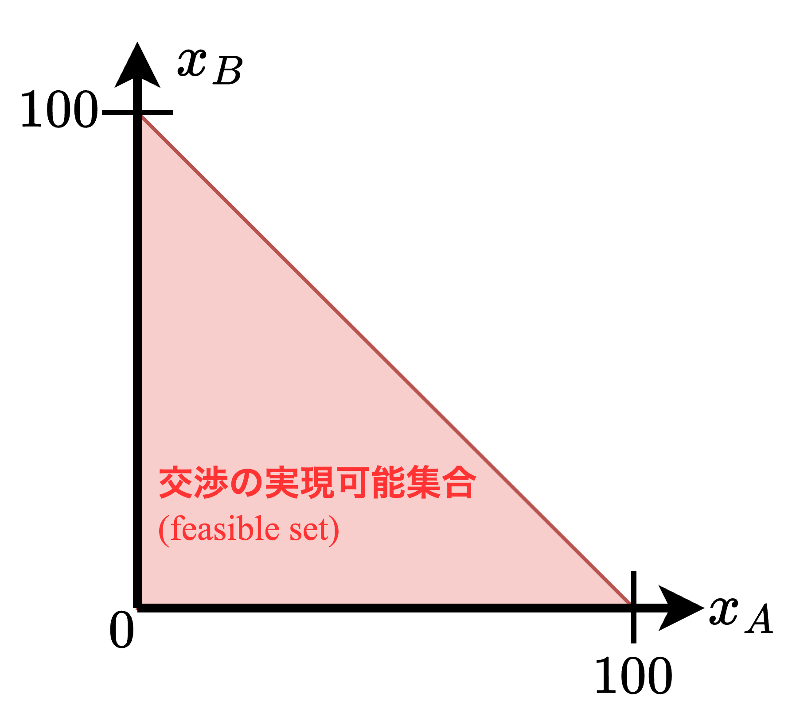

# 2人交渉問題

## 2人交渉問題の定式化

- 本章ではナッシュの交渉理論を中心に2人交渉問題について述べよう。
- これまでの章で見てきた非協力ゲームではプレイヤーは互いに独立にそれぞれの戦略を決定する。一般にゲームの非協力均衡点はパレート最適ではない。このとき、すべてのプレイヤーが利得を改善することが可能であり、そのためにはプレイヤーは互いに協力する必要がある。しかし、協力方法は多様であり、プレイヤーは協力によってどのような状態を実現するかについて利害が一致するとは限らない。ここにプレイヤーの間で「**交渉問題**」が生じる。プレイヤーは<b>①協力すべきかどうか</b>、また、<b>②協力の結果としてどのような状態を実現すべきか</b>、を話し合いによって決定しなければらない。

#### 【例】利得分配をめぐるコンフリクト

A氏とB氏はある共同事業を行うことによって100万円の利益を得ることができる。共同事業を始める前にA氏とB氏は100万円をどのように分配するかについて合意する必要がある。もし合意に達しなければ2人は共同事業を行わず、各人の利益は0円である。A氏とB氏は話し合いの結果、合意に達するであろうか。また100万円をどのように分配するであろうか。

- 下の図と式はA氏とB氏が100万円の分配方法に合意したケースである。$x_A$と$x_B$はそれぞれA氏の取り分とB氏の取り分を表す。下式を満たす分配$(x_A,\;x_B)$集合は下図の赤色領域である。このような領域を「**交渉の実現可能集合（feasible set）**」という。
- また、A氏とB氏の間で合意が実現しなければ、2人の取り分は0円である。すなわち、原点$(0,0)$はA氏とB氏の間で交渉が決裂した場合に実現する点であり、このような点を「**交渉の不一致点（disagreement point）**」あるいは「**現状点（status quo point）**」という。

$$
x_A+x_B\leqq 100,\quad x_A\geqq 0,\quad x_B\geqq 0
$$

- 上記の例から分かるように、2人のプレイヤーの交渉問題は一般に次のように定式化できる。

> 【**定義8.1**】
> **2人交渉問題（tow-person bargaining problem）** は実現可能集合$U$と交渉の不一致点$d=(d_1,\;d_2)$の組$(U,d)$によって定義される。そして以下の仮定を満たす交渉問題の族を$B$と置く。$$\begin{align}
>   &Uは2次元実空間R^2のコンパクトで凸な部分集合\\[1mm]
>   &d\in U\\[1mm]
>   &Uの点u=(u_1,\;u_2)が存在して、u_i>d_i\;(i=1,2)
> \end{align}$$すでに見たように実現可能集合$U$は2人のプレイヤーが協力によって実現可能な利得ベクトル$u=(u_1,\;u_2)$の集合を表す。交渉の不一致点$d=(d_1,\;d_2)$は交渉が決裂する場合のプレイヤーの利得の組を表す。

> 【**定義8.2**】
> $(U,\;d)$を交渉問題とする。以下に交渉理論の基本的な概念を3つ定義する。
> 1. 実現可能集合$U$の利得ベクトル$u=(u_1,\;u_2)$が**パレート最適である**とは、$t_i>u_i\quad(i=1,2)$である$U$の利得ベクトル$t=(t_1,\;t_2)$が存在しないときをいう。
> 1. 実現可能集合$U$の利得ベクトル$u=(u_1,\;u_2)$が**個人合理的（$\text{individually rational}$）である**とは、$u_i\geqq d_i\quad(i=1,2)$である時をいう。
> 1. 実現可能集合$U$のパレート最適で個人合理的なすべての利得ベクトルの集合を「**交渉領域（$\text{negotiation set}$）**」という。

#### 【例】男女の争い

|                | ボクシング  |   バレエ    |
| -------------- | :---------: | :---------: |
| **ボクシング** |  $(2,\;1)$  | $(-1,\;-1)$ |
| **バレエ**     | $(-1,\;-1)$ |  $(1,\;2)$  |

上表のような利得行列を持つ男女の争いゲームを考える。このゲームは2つの純戦略による均衡点$(\text{ボクシング},\;\text{ボクシング})$, $(\text{バレエ},\;\text{バレエ})$と1つの混合戦略の均衡点$(\;(3/5,\;2/5),\;(2/5,\;3/5)\:)$を持つ。これらの均衡点は男女のコンフリクトを完全に解決するものではない。純戦略による2つの均衡点はともにパレート最適であるが、どの均衡点を選ぶかに関して男女の間でコンフリクトが生ずる。また、混合戦略による均衡点では、プレイヤーの期待利得は等しく$1/5$であるがパレート最適ではない。すなわち、2人のプレイヤーはりとくを改善する余地がある。

- 一般に戦略形ゲームからどのようにして交渉問題が構成できるかを見てみる。$G=(S_1,\;S_2;\;f_1,\;f_2)$を戦略形2人ゲームとする。ここで$S_i\;(i=1,2)$ はプレイヤー$i$の純戦略の（有限）集合であり、$f_i$はプレイヤー$i$の利得関数である。純戦略の組$s=(s_1,s_2)$ をプレイヤーの**相関純戦略（$\text{correlated pure strategy}$）** といい、相関純戦略の集合$S_1\times S_2$ の上の同時確率分布をプレイヤーの**相関混合戦略（$\text{correlated mixed strategy}$）** という。相関混合戦略$q$ に対してプレイヤー$i(=1,2)$の期待利得が以下のように定まる。$$F_i(q)=\sum_{s_1\in S_1}\sum_{s_2\in S_2}q(s_1,\;s_2)f_i(s_1,\;s_2)$$ただし、$q(s_1,\;s_2)$は相関混合戦略$q$が純戦略の組$(s_1,s_2)$に付与する確率である。プレイヤーの期待利得ベクトルの全体$$U=\{(F_1(q),\;F_2(q))\;|\;q\text{は相関混合戦略}\}$$がプレイヤーの実現可能集合である。$U$はコンパクトで凸な集合である。
- 

## ナッシュ交渉解の公理

- 

> 【**定義8.3**】
> 

**ナッシュ交渉解が満たすべき4つの公理**

> 【**公理1：（強）パレート最適性**】
>
> 
> 【**公理2：対称性**】
>
> 
> 【**公理3：効用の正1次変換からの独立性**】
>
> 
> 【**公理4：無関係な選択肢からの独立性**】
>
> 

- 

> 【**定理8.1**】
>
> 
> 【**証明**】
> 

## 交渉の非協力ゲームの分析（I）

- 

> 【**定理8.2**】
>
> 
> 【**証明**】
> 

> 【**定理8.3**】
>
> 
> 【**証明**】
> 

## 交渉の非協力ゲームの分析（II）

- 

> 【**定理8.4**】
>
> 
> 【**証明**】
> 

> 【**定理8.5**】
>
> 
> 【**証明**】
> 

## 交渉ゲームの実験

- 

## 応用例

### 100万円の分配交渉

- 

### 経営者と労働組合の団体交渉

- 

### 環境汚染と補償交渉

- 

### 不完備契約とホールドアップ問題

- 

### 収穫分配契約の交渉

- 
