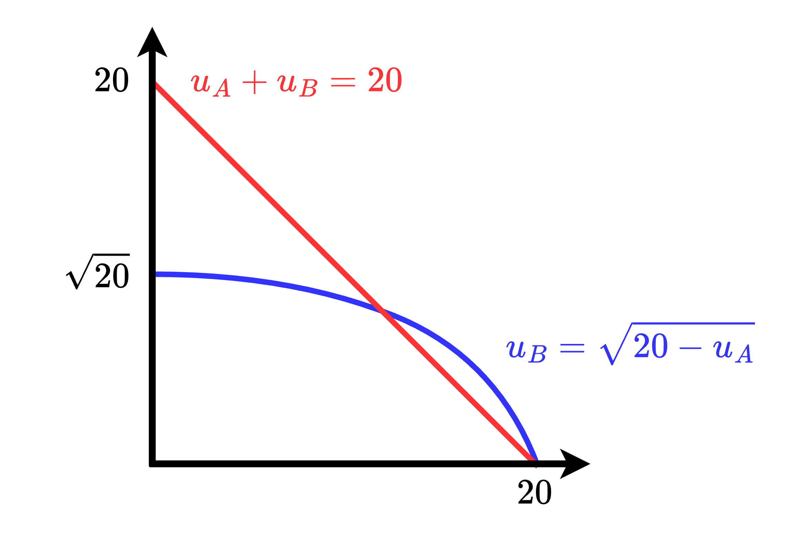
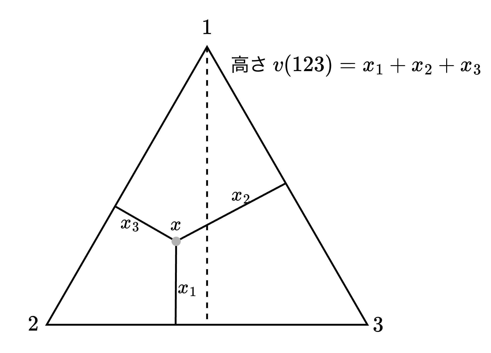
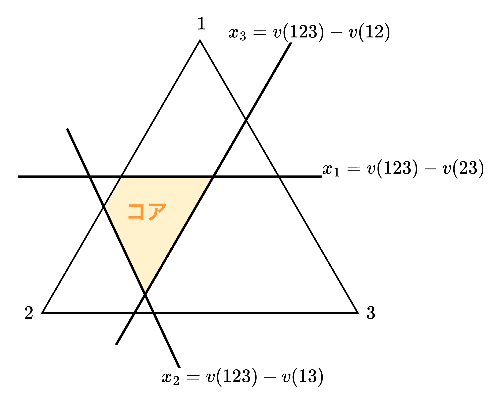
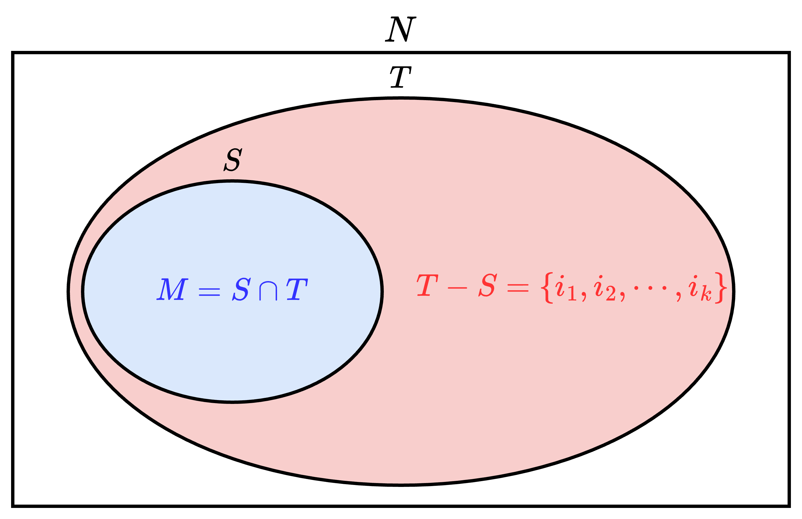
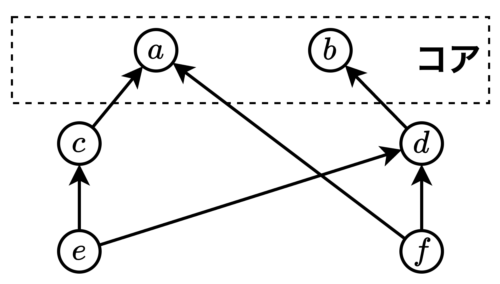
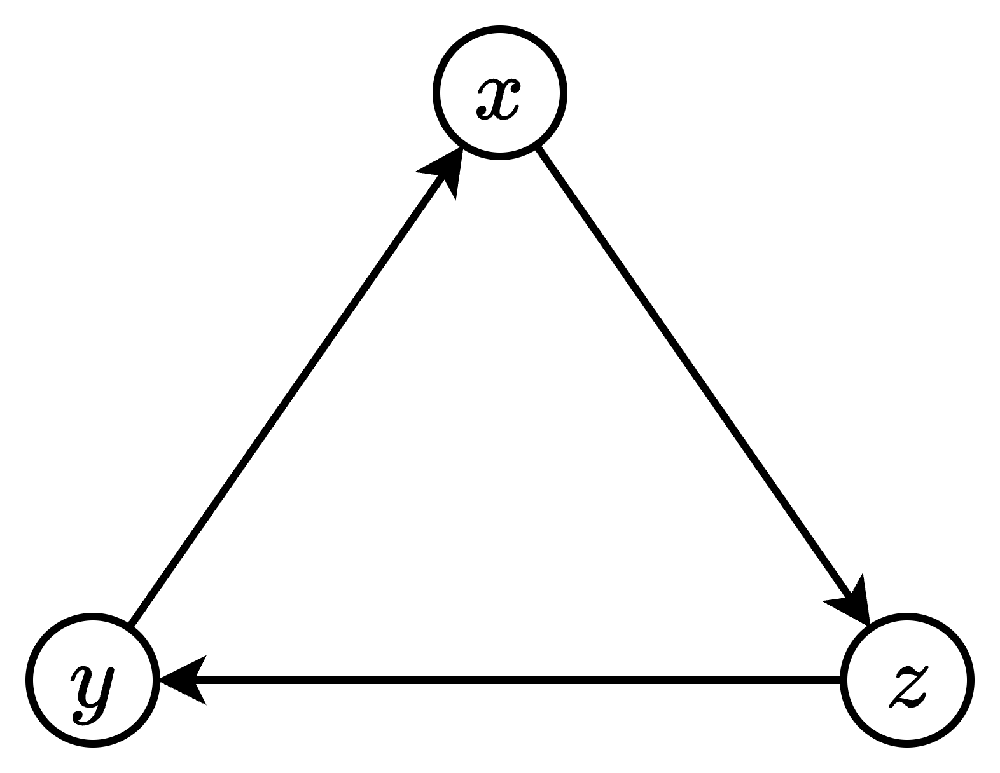
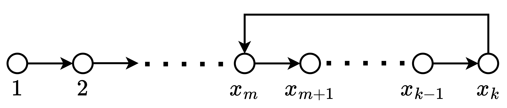
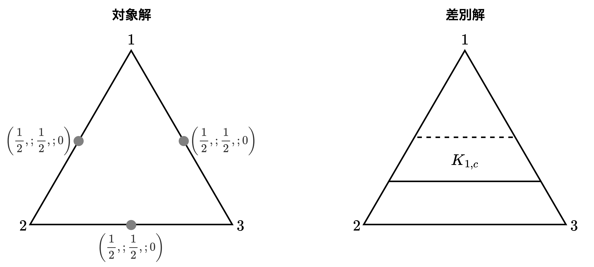

<div class="chap9">

# コアの理論

- 本章（9章）では協力ゲームの理論の基本的な事項について述べる。非協力ゲームの基本モデルは戦略形 / 展開形ゲームであるが、**協力ゲームの代表的なモデルは提携形ゲーム**と呼ばれる。

## 協力ゲームの定式化

#### 【例】アルバイトゲーム(1)

> 大学生のA君、B君、C君は夏休みにアルバイトをしようと計画している。3人の専門分野や能力と求人との関係からアルバイトから得られる収入は次のようになる。
> 1. 3人が別々にアルバイトする時、A君は6万円、B君は4万円、C君は2万円の収入を得る
> 2. 2人が一緒にアルバイトをする場合、A君とB君は総額で20万円、A君とC君は15万円、B君とC君は10万円の収入を得る
> 3. 3人が一緒にアルバイトをする場合、総額24万円の収入をえる
> 
> 以上を踏まえ、3人は誰と一緒にアルバイトをして総収入をどのようにして分配するだろうか。

$$
【\bold{提携の表現}】\\[1mm]
\begin{align*}
    \text{1人提携：}&\{A\},\;\{B\},\;\{C\}\\
    \text{2人提携：}&\{A,B\},\;\{A,C\},\;\{B,C\}\\
    \text{3人提携：}&\{A,B,C\}
\end{align*}\\[3mm]
【\bold{ゲームの特性関数}】\\[1mm]
\begin{align*}
    &v(\{A\})=6,\;v(\{B\})=4,\;v(\{C\})=2\\
    &v(\{A,B\})=20,\;v(\{A,C\})=15,\;v(\{B,C\})=10\\
    &v(\{A,B,C\})=24
\end{align*}
$$

- ゲームにおいてある共同行動を取るために形成されるプレイヤーの集合を**提携**または**結託**といい、提携の表現と総収入（または総価値）を対応させる特性関数 $v$ は上式のように表現できる。
- ここで、プレイヤー $i\in\{A,B,C\}$ が得る総収入を$x_i$、効用関数を $u_i(x)$ とし、A君とB君が総収入 $v(\{A,B\})=20$ 万円を以下のように分配することを考える。$$x_A+x_B=20,\; x_A\geqq 0,\; x_B\geqq 0$$
<div style="page-break-before:always"></div>

- A君とB君の効用関数を$u_A(x)$と$u_B(x)$に対する効用ベクトル$(u_A,u_B)$を2つのケースで考える。
$$
\begin{array}{llll}
    &【\text{ケース1}】u_A(x)=x,\;u_B(x)=\sqrt{x}&\implies&u_B(x_B)=\sqrt{20-u_A(x_A)}\\[1mm]
    &【\text{ケース2}】u_A(x)=x,\;u_B(x)=x&\implies&u_A(x_A)+u_B(x_B)=20    
\end{array}
$$上式の【ケース2】が成立する時、B君への分配額を1万円増すごとに効用ベクトルは$(u_A,u_B)\rightarrow (u_A-1,u_B+1)$に移行することが可能である。つまり、「**A君の効用を1単位減らしてB君の効用を1単位増やす**」ことが可能である。この時<b>A君とB君の間で<font color=red>譲渡可能（transferable）である</font></b>と言い、<b>A君とB君は<font color=red>譲渡可能な効用（transferable utility）を持つ</font></b>と言う。

**【補足】効用関数$u_Aとu_B$**



#### 譲渡可能な効用を持つ提携形ゲーム

> 【**定義9.1**】
> 譲渡可能な効用を持つ提携形ゲーム（game in coalitional form with transferable utility）は $(N,\;v)$ で表現される。ここで、$N=\{1,2,\cdots,n\}$はプレイヤーの集合、$N$の非空（$N\neq\emptyset$）な部分集合$S$をプレイヤーの**提携**という。$v$はNの提携全体で定義された実数値関数であり、$v$は$N$の任意の提携$S$に対して$S$のメンバーが得ることのできる総効用$v(S)$を対応させる。**関数$v$はゲームの特性関数**と言う。<u>提携形ゲーム$(N,v)$の定式化において、提携$S$の価値$v(S)$は$S$のみによって定まることに注意する</u>。

- 上の例のように一般にプレイヤーが譲渡可能な効用を持つためには、貨幣のような任意に分割可能な効用の媒介手段（あるいは交換手段）が存在し、プレイヤーが貨幣に関して「**線形な**」効用関数を持つことが必要である。この章以降、プレイヤーは譲渡可能な効用を持つと仮定する。
- 以降、譲渡可能な効用を持つ提携形ゲームを単に「提携形ゲーム」と呼ぶ。

<div style="page-break-before:always"></div>

## 特性関数の性質

> 【**定義9.2**】
> $(N,v)$を提携形ゲームとする。
> 1. 特性関数$v$が**優加法的である（super-additive）** とは、互いに交わらない任意の提携$S$と$T$に対して以下が成り立つことをいう。
> $$v(S\cup T)\geqq v(S)+v(T)$$優加法的なゲームでは2つの提携$S$と$T$が分裂するよりも$S$と$T$が合併してより大きな提携$S\cup T$を形成する方がプレイヤーの総効用は増加する。
> 1. 特性関数$v$が**単調的である（monotonic）** とは、$S\supset T$なる任意の提携$S$と$T$に対して以下が成り立つことをいう。
> $$v(S)\geqq v(T)$$
> 1. 特性関数$v$が**本質的である（essential）** とは、以下が成り立つことをいう。
> $$v(N)>\sum_{i\in N}v(\{i\})$$また、不等式の代わりに等式が成立する時特性関数$v$は**非本質的（inessential）である**という。
> 1. 特性関数$v$が**定和（constant-sum）** とは、任意の提携$S$（$N$を除く）に対して以下が成り立つことをいう。
> $$v(N)=v(S)+v(N-S)$$
>
> 上記4つの性質を踏まえ、<font color=red>特性関数$v$が優加法的（単調的、本質的、定和）であるとき、提携形ゲーム$(N,v)$は優加法的（単調的、本質的、定和）である</font>と言う。

<div style="page-break-before:always"></div>

> 【**定義9.3**】
> 2つの提携形ゲーム$(N,v)$と$(N,v')$が**戦略的同等（strategically equivalent）である**とは、正数$\alpha$と実数$\beta_{i\in N}$が存在し、任意の提携$S$に対して以下の式が成り立つことをいう。
> $$v'(S)=\alpha v(S)+\sum_{i\in S}\beta_i$$ゲームの戦略的同等の性質は同値関係の3つの条件、つまり、反射性、対称性、推移性を満たす。

#### 戦略的同等が成立するケース

- 戦略的同等が成り立つケースとしてさまざまな状況が考えられるが、その1つが全てのプレイヤー$i$の効用が正1次変換$u_i'=\alpha u_i+\beta_i$によって変化する場合である。
- 本質的なゲーム$(N,v)$において、戦略的同等なゲーム$(N,v')$を考える。
  - 【**0-正規化ゲーム**】$$v'(\{i\})=0,\quad i=1,\cdots,n$$が成り立つ時、$(N,v')$を<b>0-正規化ゲーム</b>と言う。
  - 【**(0,1)-正規化ゲーム**】$$v'(N)=1,\quad v'(\{i\})=0,\quad i=1,\cdots,n$$が成り立つ時、$(N,v')$を<b>(0,1)-正規化ゲーム</b>と言う。
- 以降、集合の記号を省略し、特性関数の表記を簡略化する。例えば、$v(\{1,2,3\})$を$v(123)$と書く。

<div style="page-break-before:always"></div>

## 協力ゲームのコア

#### 提携形ゲームの基本的な問題と配分について

> 【**定義9.4**】
> ゲーム$(N,v)$においてプレイヤー$i$の利得を$x_i$とするとき$x=(x_1,x_2,\cdots,x_n)$をゲームのゲーム$(N,v)$の**利得ベクトル（payoff vector）** と言う。
> ゲーム$(N,v)$の利得ベクトル$x=(x_1,x_2,\cdots,x_n)$が**配分（imputation）である**とは次の2つの条件が成り立つことである。
> 1. **個人合理性**：$x_i\geqq v(i),\quad i=1,2,\cdots,n$
> 2. **全体合理性**：$\sum_{i\in N}x_i=v(N)$
>
> 上式より、**個人合理性**はプレイヤーが協力するための必要条件であり、全てのプレイヤーは他のプレイヤーと協力する方が単独で行動するよりも決して悪くならないことを示す。**全体合理性**は実現される利得ベクトルがパレート最適であることを意味する。

- 提携形ゲーム$(N,v)$における基本的な問題は次の2つ。
  1. 【**提携形成問題**】どのような提携が形成されるか
  1. 【**利得配分問題**】提携の総利得がメンバー間でどのように配分されるか
- 以下では、ゲーム$(N,v)$は優加法的であると仮定する。協力ゲームの理論では通常、優加法的なゲームではプレイヤーの交渉の結果、全体提携$N$が形成されると仮定する。$N$以外の部分提携が形成されるならば実現される利得分配は一般にパレート最適ではない。協力が可能でその合意が法律や慣習などの外的メカニズムによって保障される状況ではプレイヤーはパレート最適な利得分配に合意することが合理的で自然であると考えられる。この理由から優加法的なゲームでは全体提携$N$の総利得がどのように全てのプレイヤーの間で分配されるかが主な考察の対象となる。

<div style="page-break-before:always"></div>

**基本三角形**



- 実際に3人ゲーム$(N,v)$を考える。配分$x=(x_1,x_2,x_3)$は以下を満たすとする。$$x_1+x_2+x_3=v(123),\quad x_{i\in N}\geqq 0,\quad N=\{1,2,3\}$$
- 【**上図の三角形について**】ここでゲーム$(N,v)$は**0-正規化**されているとする、つまり、$v(\{1\})=v(\{2\})=v(\{3\})=0$ が成立するとする。この時、高さが $v(123)$ の正三角形を上図に示す。上図の$x_i$は三角形の任意の1点$x$から各辺に下ろした垂線の長さであり、ヴィヴィアーニの定理より $v(123)=x_1+x_2+x_3$ が成り立つ。つまり、**3人ゲーム任意の配分 $x=(x_1,x_2,x_3)$ は正三角形の中の1点として表現できる**。これを基本三角形と呼ぶ。

#### 【例】アルバイトゲーム(2)

$$
【\bold{ゲームの特性関数}】\\[1mm]
\begin{align*}
    &v(A)=6,\;v(B)=4,\;v(C)=2\\
    &v(AB)=20,\;v(AC)=15,\;v(BC)=10\\
    &v(ABC)=24
\end{align*}\\[2mm]
【\bold{利得ベクトル}】\\[1mm]
x_A+x_B+x_C=24,\quad x_A\geqq 6,\quad x_B\geqq 4,\quad x_C\geqq 2
$$

- 総収入24万円が3人の間で分配されるときの配分の条件を上式のように表現する。
- 2つの配分$x,y$において**配分$y$は提携$\{A,B\}$を通じて配分$x$を支配するケース**を考える
  - 配分$x=(10,8,6)$を考える。この時、A君とB君の利得の和は18万円であり、$v(AB)=20$万円より少ない。
  - 別の配分$y=(11,9,4)$を考える。この時、配分 $y$ における11万円と9万円の分配はA君とB君でアルバイトをしても実現可能であるのに、配分 $x$ の方が配分 $y$ よりも利得が小さい。
- これらの内容を踏まえ、次に**コアの理論における基本的な役割**を考える。

#### コアの理論における基本的な役割

> 【**定義9.5**】
> 提携形ゲーム$(N,v)$の2つの配分$x=(x_1,x_2,\cdots,x_n)$と$y=(y_1,y_2,\cdots,y_n)$および提携$S$について、次の2条件が成り立つ時、<font color=red>配分$x$は提携$S$を通して配分$y$を支配するといい、<b>$x\;dom_S\;y$</b></font>と書く。
> - 【**条件1**】$v(S)\geqq\sum_{i\in S}x_i\\[1.5mm]$
> - 【**条件2**】$x_i>y_i,\quad\forall i\in S$
> 
> 【**条件1**】は提携$S$のメンバー提携の総利得$v(S)$を分配することにより分配$x$の利得を実現できることを意味する。
> 【**条件2**】は提携$S$のすべてのメンバーが配分$x$の方を配分$y$よりも好むことを示す。このような時、提携$S$のメンバーは配分$y$に不満を持つと言える。

> 【**定義9.6**】
> 提携形ゲーム$(N,v)$の**コア（core）** とは他のいかなる配分にも支配されない配分の集合である。コアに属するどの配分も他の配分に支配されず、<font color=red><b>どのような提携もコアに属する配分に対して不満を持たない</b></font>。このことから、コアに属する配分は交渉における安定な利得分配を示す。
> 　実際にゲームのコアは戦略的同等な2つのゲームの間で実質的に変わらないことを示す。2つのゲーム$(N,v)$と$(N,v')$は以下の正一次変換によって戦略的同等であるとする。$$v'(S)=\alpha v(S)+\sum_{i\in S}\beta_i,\quad\alpha >0$$この時、ゲーム$(N,v)$の任意の配分$x=(x_1,\cdots,x_n)$は以下の1次変換によってゲーム$(N,v')$の配分$x'=(x_1',\cdots,x_n')$に対応する。$$x_i'=\alpha x_i+\beta_i,\quad i=1,2,\cdots,n$$対応$x\rightarrow x'$は2つのゲーム$(N,v)$と$(N,v')$の配分の全体の間の同型対応（1対1勝全射）である。

- 【**定義9.5**】について、提携形ゲーム$(N,v)$の配分の全体を $X$ とするとき、$dom_S$および$dom$は $X$ の上の二項関係である。提携$S$が固定されている時、$dom_S$は推移律を満たし、2つの配分$x,y$について$x\;dom_S\;y$と$y\;dom_S\;x$が同時に成り立つことはない。支配関係$dom$は提携が変化するため複雑であり上の2つの性質は成り立たない。

<div style="page-break-before:always"></div>

> 【**定理9.1**】
> 戦略的同等な2つのゲーム$(N,v)$と$(N,v')$に対して、$x$と$y$を$(N,v)$の配分とし、$x'$と$y'$を$(N,v')$の配分とする。このとき、提携$S$に対して$x\;dom_S\;y$であるための必要十分条件は$x'\;dom_S\;y'$が成り立つことである。
> 
> 【**証明**】
> 定義9.5と、定義9.6の配分$x$の一次変換$x\rightarrow x'$より言える。定理9.1より配分の支配関係ゲームの戦略的同等の変換によって不変である。

> 【**定理9.2**】
> 戦略的に同等な2つのゲーム$(N,v)$と$(N,v')$のコアをそれぞれ$C$と$C'$とするとき、定義9.6の配分の変換は$C$と$C'$の間の同型対応を与える。
> 
> 【**証明**】
> 定理9.1より、配分の支配関係は定義9.6の配分の変換によって不変であるから、コアの定義から容易に示せる。$\blacksquare$

- 定理9.2は戦略的同等な2つのゲームにおいて一方のゲームのコアが求められれば、配分の同型対応によって他方のゲームのコアが容易に求められることを示している。この結果よりゲームのコアの性質を分析する際、ゲームの**0-正規化**あるいは **(0,1)-正規化**しても一般性を失わないことがわかる。

<div style="page-break-before:always"></div>

> 【**定理9.3**】
> 優加法的なゲーム$(N,v)$のコアは以下の条件を満たす配分の集合と一致する。
> $$【\bold{提携合理性}】\quad\sum_{i\in S}x_i\geqq v(S),\quad\forall S\sub N$$
> 
> 【**証明**】
> 上式を満たす配分$x$がコアに属さないとする。この時$x$は別の配分$y$に支配される。配分の支配の定義より、ある提携$S$が存在して以下を満たす$$
> \sum_{i\in S}x_i\leqq\sum_{i\in S}y_i\leqq v(S)
> $$これは配分$x$が定理9.3のコアの条件式を満たすことに矛盾する。
> 　次にコアに属する配分$x$がある提携$S$に対してコアの条件式を満たさないとする。この時、$\varepsilon$と$\alpha$を以下のように定義する。$$
> \varepsilon =v(S)-\sum_{i\in S}x_i>0,\quad \alpha=v(N)-v(S)-\sum_{j\in N-S}v(j)
> $$$v$の優加法性より、$\alpha\geqq 0$である。また配分$y=(y_1,y_2,\cdots,y_n)$を次のように定義する。$$\begin{align*}
> y_i&=x_i+\frac{\varepsilon}{|S|},\quad i\in S\\[3mm]
> &=v(i)+\frac{\alpha}{n-|S|},\quad i\in N-S
> \end{align*}$$ただし、$|S|$は提携$S$のメンバー数である。この時$y\;dom_S\;x$となり、$x$がコアに属することに矛盾する。$\blacksquare$

- 定理9.3の条件式は「**提携合理性（coalitional rationality）**」と言われ、次の意味を持つ。コアに属する配分では任意の提携$S$のすべてのメンバーの利得の和が提携$S$にとって実現可能な総利得以上であり、この意味で提携$S$のメンバーはコアの配分に不満がない。
- 定理9.3より、ゲームのコアは1次不等式系の解集合として特徴付けられることがわかる。従ってもしコアが非空ならば、コアは$n$次元ユークリッド空間の凸多面体である。
- 本章では以後、ゲームは優加法性であるとする。

<div style="page-break-before:always"></div>

## コアの存在条件



$$
\left\{\begin{array}{l}
    x_1+x_2+x_3=v(123)\\[1mm]
    x_1+x_2\leqq v(12)\\[1mm]
    x_2+x_3\leqq v(23)\\[1mm]
    x_1+x_3\leqq v(13)\\[1mm]
    x_1\geqq 0,\quad x_2\geqq 0,\quad x_3\geqq 0
\end{array}\right.
\implies
\left\{\begin{array}{l}
    x_1+x_2+x_3=v(123)\\[1mm]
    0\leqq x_1\leqq v(123)-v(23)\\[1mm]
    0\leqq x_2\leqq v(123)-v(13)\\[1mm]
    0\leqq x_3\leqq v(123)-v(12)\\[1mm]    
\end{array}\right.
$$

- コアは協力ゲームの理論の他の解概念と比べて定義が簡明でその意味も明確であるため、多くの経済分析に応用されている。しかしながらコアは常に存在するとは限らない。この説ではコアの存在条件について述べる。
- 上式は3人ゲームにおけるコアの1次不等式系の解である。元は左側の式であり、それを書き直したものが右側の式になる。

<div style="page-break-before:always"></div>

#### コアが非空であるための必要十分条件

> 【**定理9.4**】
> 0-正規化された3人ゲーム$(N,v)$のコアが非空であるための必要十分条件は以下の式が成り立つことである。$$\begin{align}v(12)+v(23)+v(13)\leqq 2v(123)\end{align}$$
> 
> 【**証明**】
> まずは必要条件を証明する。上の1次不等式より以下のことが成立する。
> $$
> \begin{align*}
>   v(123)&=x_1+x_2+x_3\\
>   &\leqq v(123)-v(23)+v(123)-v(13)+v(123)-v(12)\\
>   &=3v(123)-v(12)-v(23)-v(13)
> \end{align*}\\[3mm]
> \therefore\quad\underline{v(12)+v(23)+v(13)\leqq 2v(123)}
> $$　次に十分条件を証明する。まず式$(1)$を仮定する。$v(123)\geqq v(12)+v(23)$の場合、以下の配分は上の1次不等式を満たす。$$x_1=v(123)-v(23),\;x_2=0,\;x_3=v(23)$$次に、$v(123)<v(12)+v(23)$の場合、以下の配分は式$(1)$の仮定より、上の1次不等式を満たす。$$x_1=v(123)-v(23),\;x_2=v(12)+v(23)-v(123),\;x_3=v(123)-v(12)$$

- 式$(1)$は3人提携の特性関数値が2人提携の特性関数値の和に比べて比較的大きい時、3人ゲームのコアが存在することを意味する。
- 逆に2人提携と3人提携の特性関数値が近い時、ゲームのコアは空である。これはどの配分に対しても少なくとも1つの2人提携が存在し、それに不満を持つ空である。

<div style="page-break-before:always"></div>


#### 【例】アルバイトゲーム(3)

$$
\begin{align*}
    &v(A)=6,\;v(B)=4,\;v(C)=2\\
    &v(AB)=20,\;v(AC)=15,\;v(BC)=10\\
    &v(ABC)=24
\end{align*}\\[2mm]
\Downarrow\text{0-正規化}\\[2mm]
\begin{align*}
    &v(A)=0,\;v(B)=0,\;v(C)=0\\
    &v(AB)=10,\;v(AC)=7,\;v(BC)=4\\
    &v(ABC)=12
\end{align*}\\[3mm]
v(AB)+v(BC)+v(AC)\leqq 2v(ABC)であるため、\\[1mm]
\underline{\bold{アルバイトゲーム(3)にはコアが存在する。}}
$$

- 上記の例とは別にコアが空である典型的な例が3人多数決ゲームである。これはゲームの特性関数が $v(123)=v(12)=v(23)=v(13)=1,\;v(1)=v(2)=v(3)=0$ で与えられ、明らかに式$(1)$が成立せず、ゲームのコアは空である。
- 3人多数決ゲームは次のような配分の支配関係からも言える。任意の配分$x=(x_1,x_2,x_3)$に対して、$x_i+x_j<1$である2人提携$\{i,j\}$が存在する。この時$y\;dom_{\{i,j\}}\;x$となる配分$y$が見つかるため3人多数決ゲームのコアは空である。

> 【**定理9.5**】
> 本質的定和ゲームのコアは空である。
>
> 【**証明**】
> コアが非空であると仮定する。コアに属する配分を$x$とすると定和ゲームの定義より、任意の提携$S\neq N$に対して次の関係を満たす。$$v(N)=v(S)+v(N-S)\leqq\sum_{i\in S}x_i+\sum_{j\in N-S}x_j=v(N)$$以上より、$\displaystyle{\sum_{i\in S}x_i=v(S),\quad\sum_{j\in N-S}x_j=v(N-S)}$であり、特に$S=\{i\}$と置くと$x_i=v(i)$であることから、以下が成立する。$$v(N)=v(S)+v(N-S)=\sum_{i\in S}v(i)+\sum_{j\in N-S}v(j)=\sum_{i\in N}v(i)$$これはゲームが本質的であることに反する$\blacksquare$

#### コアが非空となるゲームのクラス

> 【**定義9.7**】
> 提携形ゲーム$(N,v)$においてメンバー数が等しい2つの提携$S$と$T$に対して$v(S)=v(T)$である時ゲームは**対称（symmetric）である**という。

> 【**定理9.6**】
> 対称ゲーム$(N,v)$のコアが非空であるための必要十分条件は以下の式が成立することである。ただし、$|S|$は提携$S$のメンバー数を表す。$$\frac{v(S)}{|S|}\leqq\frac{v(N)}{|N|}$$
>
> 【**証明**】
> まずは必要条件を証明する。上式が成立するならば均等配分（$v(N)/n,\cdots,v(N)/n$）は提携合理性を満たす。定理9.3より均等配分はコアに属する。
> 　次に十分条件を証明する。コアが非空であると仮定する。$|S|=1,n$の場合、上式は明らかである。コアの配分を$x$とすると定理9.3より以下を満たす。$$\sum_{i\in S}x_i\geqq v(S),\quad\forall S\sub N$$各$s=2,3,\cdots,n-1$に対して、$|S|=s$なる全ての提携$S$に関して上式の両編を加えると以下の式となる。$$
> \left(\begin{array}{l}
>   n-1\\
>   s-1
> \end{array}\right)
> \sum_{i\in N}x_i\geqq
> \left(\begin{array}{l}
>   n\\
>   s
> \end{array}\right)v(S)
> $$ここで、$\left(\begin{array}{l}
>   n-1\\
>   s-1
> \end{array}\right)
> \displaystyle\frac{n}{s}\geqq
> \left(\begin{array}{l}
>   n\\
>   s
> \end{array}\right)$に注意して、計算すると以下の結果が得られる。$$
> \frac{s}{n}v(N)\geqq v(S)\quad\therefore\;\underline{\frac{v(S)}{s}\leqq\frac{v(N)}{n}}
> $$

- 提携$S$に対して$v(S)/|S|$はメンバー1人あたりの提携$S$の価値を表し、**提携$S$の平均提携値**と呼ばれる。定理9.6より、対称ゲームでは全体提携$N$が全ての提携の中で最大の平均提携値を持つこととコアが非空であることは同値である。

<div style="page-break-before:always"></div>

#### 凸ゲームについて

> 【**定義9.8**】
> 提携形ゲーム$(N,v)$が**凸ゲーム（convex game）である**とは、任意の提携$S$と$T$に対して以下が成立することである。ただし、$S\cap T=\emptyset$の場合$v(\emptyset)=0$とする。$$
> v(S)+v(T)\leqq v(S\cup T)+v(S\cap T)
> $$ここで$S\cap T=\emptyset$ の時、優加法性の条件と同じであり、<font color=red>凸ゲームは優加法性を満たす</font>。

> 【**定理9.7**】
> 提携形ゲーム$(N,v)$が凸ゲームであるための必要十分条件は$S\sub T$である任意の提携$S$と$T$に対して以下が成立することである。$$【\bold{限界貢献度}】v(S)-v(S-\{i\})\leqq v(T)-v(T-\{i\}),\quad \forall i\in S$$
>
> 【**証明**】
> まずは必要条件を証明する。$i\in S\sub T$とする。ゲーム$(N,v)$が凸ゲームならば定義9.8より、$v(S)+v(T-\{i\})\leqq v(S\cup(T-\{i\}))+v(S\cap(T-\{i\}))=v(T)+v(S-\{i\})$である。故に定理9.7は成立する。
> 　次に十分条件を証明する。まず、定理9.7が成立すると仮定する。定義9.8は$S\sub T$または$T\sub S$の場合は自明である方、$S-T\neq\emptyset$かつ$T-S\neq\emptyset$とする。$T-S=\{i_1,i_2,\cdots,i_k\},\;S\cap T=M$と置く。定理9.7より、以下の不等式が成立する。$$\begin{align*}
> &v(\color{red}M\cup\{i_1\}\color{black})-v(M)\hspace{14mm}\leqq v(\color{red}S\cup\{i_1\}\color{black})-v(S)\\[1mm]
> &v(\color{blue}M\cup\{i_1,i_2\}\color{black})-v(\color{red}M\cup\{i_1\}\color{black})\leqq v(\color{blue}S\cup\{i_1,i_2\}\color{black})-v(\color{red}S\cup\{i_1\}\color{black})\\[1mm]
> &\hspace{15mm}\vdots\hspace{65mm}\vdots\\[1mm]
> &v(M\cup\{i_1,i_2,\cdots,i_k\})-v(\color{orange}M\cup\{i_1,i_2,\cdots,i_{k-1}\}\color{black})\\[1mm]
> &\hspace{20mm}\leqq v(S\cup\{i_1,i_2,\cdots,i_k\})-v(\color{orange}S\cup\{i_1,i_2,\cdots,i_{k-1}\}\color{black})
> \end{align*}$$上の不等式の両辺の総和をとると以下の不等式が得られる。$$v(M\cup\{i_1,i_2,\cdots,i_k\})-v(M)\leqq v(S\cup\{i_1,i_2,\cdots,i_k\})-v(S)$$ここで、$T=M\cup\{i_1,\cdots,i_k\},\;S\cup T=S\cup\{i_1,\cdots,i_k\},\;M=S\cap T$であることに注意して式変形すると以下の結果が得られる。$$
> v(T)-v(S\cap T)\leqq v(S\cup T)-v(S)\;
> \therefore\;\underline{v(T)+v(S)\leqq v(S\cup T)+v(S\cap T)}
> $$これは定義9.8の凸ゲームであることを満たす。$\blacksquare$

##### 【補足】定理9.7の図的表現



- 定理9.7において$\color{red}v(S)-v(S-\{i\})$はプレイヤー$i$の参加によって提携$S$が形成されるときの<font color=red>提携の価値の増分</font>を表し、提携$S$に対するプレイヤー$i$の**限界貢献度（marginal contribution）** と呼ばれる。定理9.7は「凸ゲームでは定型に対するプレイヤーの限界貢献度は提携の規模の増加関数であること」を示している。
- 0-正規化された3人凸ゲームの条件は以下のようになる。
$$\begin{array}{l}
    v(12)+v(23)\leqq v(123)\\[1mm]
    v(13)+v(23)\leqq v(123)\\[1mm]
    v(12)+v(13)\leqq v(123)\\[1mm]
\end{array}\implies
v(12)+v(23)+v(23)\leqq\frac{3}{2}v(123)
$$上の不等式は定理9.4よりコアが非空である（コアが存在する）。このときのコアの配分$(0,\;v(12),\;v(123)-v(12))$を考える。この配分でのプレイヤーの利得を調べると3人のプレイヤーが$1,2,3$の順序で全体提携$\{1,2,3\}$を形成するとき、各プレイヤーは参加する提携に対する限界貢献度と等しい利得を得ている。このような配分をプレイヤーの**限界貢献度ベクトル**という。
- 上記の内容を踏まえ、一般の$n$人凸ゲームにおける定理9.8を以下に示す。

<div style="page-break-before:always"></div>

> 【**定理9.8**】
> <font color=red><b>$n$人凸ゲームのコアは非空である</b></font>。
>
> 【**証明**】
> 利得ベクトル$x=(x_1,\cdots,x_n)$において、$x_i$を以下のように定義する。$$
> x_i=v(\{1,2,\cdots,i\})-v(\{1,2,\cdots,i-1\}),\quad i=1,2,\cdots,n
> $$ここで、$v(\emptyset)=0$とする。凸ゲームの性質より$x$はゲームの配分である。
> 　次に配分$x$は提携合理性を満たすことを示す。$S(\neq N)$を任意の提携とし、$N-S=\{i_1,\cdots,i_k\},\;i_i<i_2<\cdots <i_k(k\leqq 1)$と置く。凸ゲームの定義より$$
> v(S)+v(\{1,\cdots,i_i-1,i_1\})\leqq v(S\cup \{i_1\})+v(\{1,\cdots,i_i-1,i_1\})
> $$上記の定義式より、配分$x_{i_1}$は以下のように表現できる。$$
> x_{i_1}\leqq v(S\cup \{i_1\})-v(S)
> $$上記の操作を用いて、$i_j$を求めると以下の不等式を得る。$$
> x_{i_j}\leqq v(S\cup\{i_1,i_2,\cdots,i_j\})-v(S\cup\{i_1,i_2,\cdots,i_j-1\}),\quad j=1,\cdots,k
> $$これら$k$個の不等式の両辺の総和をとると。$$
> \sum_{i\in N-S}x_i\geqq v(N)-v(S)
> $$であり$$
> \sum_{i\in S}x_i\geqq v(S)
> $$が成り立つ。$\blacksquare$

<div style="page-break-before:always"></div>

#### 線形計画方の双対定理を用いたコアの存在条件

> 【**定理9.9**】
> ゲーム$(N,v)$のコアが非空であるための必要十分条件は以下の線形計画問題の最小値$z^*$が$z^*\leqq v(N)$を満たすことである。$$
> \begin{equation}
>   z^*=\min\sum_{i\in N}x_i\quad s.t.\quad \sum_{i\in S}x_i\geqq v(S),\quad\forall S\sub N
> \end{equation}
> $$上式における$S$は$N$の真部分集合であることに注意する。
>
> 【**証明**】
> まずは必要条件を証明する。上式$(2)$は線形計画問題であり、明らかに実行可能解（制約条件を満たす利得ベクトル）を持つ。また、任意の実行可能解$x$に対して$\sum_{i\in N}x_i\geqq\sum_{i\in N}v(\{i\})$が成立するため、式$(2)$の最小値$z^*$は有限な値になる。ゲーム$(N,v)$のコアが非空であるとする。コアの配分$x$は実行可能解であり、$\sum_{i\in N}x_i=v(N)$を満たす。故に$z^*\leqq v(N)$である。
> 　次に十分条件を証明する。まず$z^*\leqq v(N)$とすると$z^*$を実現する最小解を$y=(y_1,\;\cdots,\;y_n)$とすると、以下のように定義される利得ベクトル$x$はゲームのコアに属する。$$x_i=\frac{y_i+v(N)-z^*}{n},\quad\forall i\in N$$

- 定理9.9の双対問題を作る。定理9.9の式$(2)$の制約条件の係数行列$A$は$(2^n-2)\times n$行列で行は提携$S$、列はプレイヤー$i$に対応する。行列$A$の各成分は次のように与えられる。ただし、$\delta_S(i)$は$i$が$S$に属すれば$1$、そうでなければ$0$である。$$
\begin{array}{l}
    &1\quad\cdots\quad i(n個)\quad\cdots\quad n&\\
    \begin{array}{c}
        \vdots\\[1mm]S(2^n-2個)\\\vdots
    \end{array}
    &
    \left[\begin{array}{l}
              &  \vdots   &      \\[1mm]
        \cdots&\delta_S(i)&\cdots\\[1mm]
              &  \vdots   &      \\[1mm]
    \end{array}\right]&
\end{array}
$$
- 式$(2)$は変数の非負条件を持たないから、式$(2)$を主問題としたとき双対問題は以下のように表現できる。この双対定理を用いてコアの存在条件を次のように言い換えることができる。$$\begin{equation}
    w^*=\max\sum_{S\sub N}\gamma_Sv(S)\quad s.t.\quad\sum_{S：i\in S\sub N}\gamma_S=1,\quad\forall i\in N,\;\gamma_S\geqq 0,\;\forall S\sub N
\end{equation}
$$

<div style="page-break-before:always"></div>

> 【**定理9.10**】<font color=red>←<b>定理9.9の双対問題</b></font>
> ゲーム$(N,v)$のコアが非空であるための必要十分条件は以下の条件を満たすことである。$$\sum_{S\sub N}\gamma_Sv(S)\leqq v(N)$$ここで $\gamma=(\gamma_S：S\sub N)$ は任意の$2^n-2$次元非負ベクトルであり、以下の式を満たす。$$\sum_{S：i\in S\sub N}\gamma_S=1,\quad\forall i\in N$$
>
> 【**証明**】
> 非負ベクトル $\gamma=(\gamma_S：S\sub N)$ を $\gamma_{\{i\}}=1,\;\forall i\in N,\;\gamma_S=0（\text{他の提携}S）$と置くと、$\gamma$ は双対問題の式$(3)$の制約条件を満たす。したがって、定理9.9の主問題とその双対問題はともに実行可能であり、線形計画問題の双対定理より両問題の最小値$z^*$と最大値$w^*$が存在して$z^*=w^*$である。故に定理9.9よりコアが非空であるための必要十分条件は$w^*\leqq v(N)$である。$\blacksquare$

> 【**定義9.9**】
> 定理9.10を満たす非負ベクトル $\gamma=(\gamma_S：S\sub N)$ で $\gamma_S>0$ である提携$S$の族$\{S_1,S_2,\cdots,S_n\}$を平衡集合族という。集合 $N=\{1,2,\cdots,n\}$ の非空な真部分集合の族$C=\{S_1,S_2,\cdots,S_m\}$が**平衡集合族（balanced collection）である**とは、正数$\gamma_1,\gamma_2,\cdots,\gamma_m$が存在し、以下の式が成立することである。$$\sum_{j：i\in S_j}\gamma_j=1,\quad\forall i\in N$$この時 $\gamma=(\gamma_1,\gamma_2,\cdots,\gamma_m)$を<b>平衡集合族$C$の重みベクトル</b>と言う。

- $N$の任意の分割 $\pi=(S_1,\cdots,S_m)$ は$\gamma_{S_i}=1（i=1,\cdots,m）$を重みに持つ平衡集合族である。したがって平衡集合族$C=\{S_1,\cdots,S_m\}$は集合の分割の概念を一般化するものといえ、平衡集合族の重みは必ずしも一意でないことに注意する。

> 【**定義9.10**】
> 提携形ゲーム$(N,v)$が**平衡ゲーム（balanced game）である**とは$N$の任意の平衡集合族$C=\{S_1,S_2,\cdots,S_m\}$とその任意の重み $\gamma=(\gamma_1,\gamma_2,\cdots,\gamma_m)$ に対して以下の式が成立するときを言う。$$\sum_{j=1}^m\gamma_jv(S_j)\geqq v(N)$$

> 【**定理9.11**】
> <font color=red>ゲーム$(N,v)$のコアが非空であるための必要十分条件は<b>ゲームが平衡ゲームである</b>ことである。</font>

<div style="page-break-before:always"></div>

## 市場ゲーム

#### 交換経済$E$の定式化

- まずは次のような**交換経済（Exchange Economy）** を考える。$N=\{1,2,\cdots,n\}$をプレイヤー（**経済主体**）の集合とし、$n$人のプレイヤーが$m+1$種類の財の交換を行う。プレイヤー$i\in N$の財の初期保有ベクトルを$w_i=(w_i^1,w_i^2,\cdots,w_i^m,w_i^{m+1})\in R_+^{m+1}$とする。以下では$m+1$番目の財$x^{m+1}$を貨幣（money）と呼び、任意の分割可能な財とする。財ベクトル$x=(x^1,x^2,\cdots,x^m,x^{m+1})$に対するプレイヤー$i$の効用関数$U_i(x)$は次のように書けるとする。$$
U_i(x^1,x^2,\cdots,x^m,\color{red}x_i^{m+1}\color{black})=u_i(x^1,x^2,\cdots,x^m)+\color{red}x_i^{m+1}\color{black}
$$この時 $i$は貨幣に関して線形な効用関数を持ち、$i$は譲渡可能な効用を持つことを意味する。
- 以下では、譲渡可能な効用を持つ<font color=red><b>交換経済</b>を$E=(N,\;R_+^{m+1},\;\{w_i\}_{i\in N},\;\{u_i\}_{i\in N})$で表す</font>。
- いまプレイヤーの提携$S$が形成され、$S$のメンバーの間で財が交換されるとする。この時 $S$のすべてのメンバー$i$にとって実現可能な財ベクトル $x_i=(x_i^1,\cdots,x_i^m,x_i^{m+1})$ は下式を満たす。$$
\sum_{i\in S}x_i^j\leqq\sum_{i\in S}w_i^j,\quad j=1,2,\cdots,m+1
$$
- 次に、提携$S$のメンバーの総効用は以下のように表現できる。$$
\sum_{i\in S}U_i(x_i^1,x_i^2,\cdots,x_i^m,\color{red}x_i^{m+1}\color{black})=\sum_{i\in S}u_i(x_i^1,x_i^2,\cdots,x_i^m)+\sum_{i\in S}\color{red}x_i^{m+1}\color{black}
$$
- また、交換によって実現可能な提携$S$のメンバーの総効用の最大値を提携$S$の特性関数値$v(S)$とすると、この最大値問題は以下のように記述できる。$$\begin{align*}
    v(S)&=\max_{(x_i)_{i\in S}}\left\{\sum_{i\in S}u_i(x_i^1,x_i^2,\cdots,x_i^m)+\sum_{i\in S}\color{red}x_i^{m+1}\color{black}\right\}\\[5mm]
    &s.t.\quad\sum_{i\in S}x_i^j\leqq\sum_{i\in S}w_i^j,\quad j=1,2,\cdots,m,\color{red}m+1
\end{align*}\\[3mm]
\Downarrow\\[3mm]
\begin{align*}
    v(S)&=\max_{(x_i)_{i\in S}}\left\{\sum_{i\in S}u_i(x_i^1,x_i^2,\cdots,x_i^m)\right\}+\sum_{i\in S}\color{red}x_i^{m+1}\color{black}\\[5mm]
    &s.t.\quad\sum_{i\in S}x_i^j\leqq\sum_{i\in S}w_i^j,\quad j=1,2,\cdots,m
\end{align*}$$
- このことから、上式で定義される特性関数$v(S)$は下の式$(4)$の特性関数と戦略的に同等である。$$
\begin{equation}
    \begin{align*}
        v(S)&=\max\sum_{i\in S}u_i(x_i^1,x_i^2,\cdots,x_i^m)\\[2mm]
        &s.t.\quad\sum_{i\in S}x_i^j\leqq\sum_{i\in S}w_i^j,\quad j=1,2,\cdots,m
    \end{align*}    
\end{equation}$$

> 【**定義9.11**】
> プレイヤーの集合$N=\{1,2,\cdots,n\}$と上の式$(4)$で定義される特性関数$v$の組$(N,v)$を**譲渡可能な効用を持つ市場ゲーム（Market Game with Transferable Utility）** という。

- 上記の通り交換経済$E$は提携形ゲームとして定式化できる。また、式$(4)$より特性関数$v(S)$は貨幣（$m＋1$番目の財）を用いずに定義できることから、以後簡単化のために財ベクトルを$x=(x_1,x_2,\cdots,x_m)$と表し、貨幣を省略する。

#### 【例】エッジワース市場ゲーム（Edgeworth Market Game）

- $N=\{1,2,\cdots,n\}$をプレイヤーの集合とし、財ベクトルの全体を$R_+^m$とする。すべてのプレイヤー$i$は初期保有ベクトル$w_i=(w_i^1,w_i^2,\cdots,w_i^m)$と、$R_+^m$の上の同一の効用関数$u(x^1,x^2,\cdots,x^m)$を持つとする。ここで、2つの財$x=(x^1,x^2,\cdots,x^m)$と$y=(y^1,y^2,\cdots,y^m)$に対して効用関数は次の2つの性質を満たすとする。
  - 【**単調性**】$x\geqq y$ならば、$u(x)\geqq u(y)$
  - 【**凸性**】任意の$0\leqq\lambda\leqq 1$に対して $u(\lambda x+(1-\lambda )y)\geqq\lambda u(x)+(1-\lambda)u(y)$ を満たす。
- 提携$S$のメンバー数を$s$とする財ベクトル$x_i=(x_i^1,x_i^2,\cdots,x_i^m),\;i\in S$が$$\sum_{i\in S}x_i^j\leqq\sum_{i\in S}w_i^j,\quad j=1,2,\cdots,m$$を満たすとき、効用関数の凸性と単調性より以下の不等式が成り立つ。$$\frac{1}{s}\sum_{i\in S}u(x_i)\leqq u\left(\frac{\sum_{i\in S}x_i}{s}\right)\leqq u\left(\frac{\sum_{i\in S}w_i}{s}\right)$$
- ここで、式$(4)$の特性関数の定義より、$v(S)$は次のように表すことができる。$$v(S)=s\hspace{.2mm}u\left(\frac{\sum_{i\in S}w_i}{s}\right)$$
- 例えば、$N=\{1,2\},\;m=2,\;w_1=(a,0),\;w_2=(0,b)$である時、特性関数$v$は次の通り。$$v(1)=u(a,0),\;v(2)=u(0,b),\;v(12)=\left(\frac{a}{2},\;\frac{b}{2}\right)$$

<div style="page-break-before:always"></div>

#### エッジワース市場ゲームのコアが非空であることの証明

- 次に定理9.11を用いて市場ゲームのコアは非空であることを証明する。交換経済$E$から構成される譲渡可能な効用を持つ市場ゲームの特性関数は先ほどの式$(4)$で定義される。

> 【**定理9.12**】
> 市場ゲーム$(N,v)$は平衡ゲーム（定義9.10）であり、**非空なコアを持つ**。
>
> 【**証明**】
> $C=(S_1,\cdots,S_m)$ を $N$ の任意の平衡集合族とし、その任意の重みベクトルを $\gamma=(\gamma_S：S\in C)$ とする。提携 $S$ に対して、特性関数値 $v(S)$ を実現する財ベクトルの組を $(x_i^S)_{i\in S}$ とすると $v(S),v(N)$ は以下のように表現できる。$$
> v(S)=\sum_{i\in S}u_i\left(x_i^S\right),\quad v(N)=\sum_{i\in N}u_i\left(x_i^N\right)
> $$この時、効用関数$u_i$の凸性と重み$\gamma$の性質より以下の式変形ができる。$$\begin{align*}
    \sum_{S\in C}\gamma_Sv(S)&=\sum_{S\in C}\gamma_S\left(\sum_{i\in S}u_i\left(x_i^S\right)\right)=\sum_{i\in N}\hspace{1mm}\sum_{S：i\in S\in C}\gamma_Su_i\left(x_i^S\right)\\[5mm]
    &\leqq\sum_{i\in N}u_i\left(\color{red}\sum_{S：i\in S\in C}\gamma_Sx_i^S\color{black}\right)
\end{align*}$$すべての $i=1,2,\cdots,n$ に対して、財ベクトルを $z_i=\color{red}\sum_{S：i\in S\in C}\gamma_Sx_i^S$ とし、$z_i$の総和を取ると以下のように計算できる。$$\begin{align*}
    \sum_{i\in N}z_i&=\sum_{i\in N}\hspace{1mm}\sum_{S：i\in S\in C}\gamma_Sx_i^S=\sum_{S\in C}\gamma_S\sum_{i\in S}x_i^S\\[5mm]
    &\leqq\sum_{S\in C}\gamma_S\sum_{i\in S}w_i=\sum_{i\in N}w_i\sum_{S：i\in S\in C}\gamma_S=\sum_{i\in N}w_i
\end{align*}
> $$したがって、$v(N)$の定義と上の2つの式より、以下の不等式が成り立つ$$\begin{equation}
>   \sum_{S\in C}\gamma_Sv(S)\leqq v(N)
> \end{equation}$$上の式$(5)$は平衡ゲームの定義（定義9.10）と一致する。$\blacksquare$

- 定理9.12より、市場ゲームにはコアが存在し、財ベクトル$w=\{w_i^1,\;w_i^2,\;\cdots w_i^m\}$を保有する$n$人のプレイヤー$i（=1,\cdots,n）$が市場で自発的な交渉を通じて財を交換する時、どの提携も不満を持たない安定な財の分配が少なくとも1つ存在する。

<div style="page-break-before:always"></div>

#### 交換経済の競争均衡と市場ゲームのコアの関係について

- 次に交換経済の競争均衡と市場ゲームのコアがどのような関係にあるかを調べる。交換経済$E$における財の価格ベクトルを $p=(p_1,p_2,\cdots,p_m)\in R_+^m$ と置く。ここで、$p_j（j=1,2,\cdots,m）$は貨幣価値によって表された財$j$の価格である。
- 以下では $R_+^m$ の2つのベクトル $x$ と $y$ に対して $x\cdot y$ はベクトルの内積を表す。

> 【**定義9.12**】
> 譲渡可能な効用を持つ交換経済 $E=(N,\;R_+^{m+1},\;\{w_i\}_{i\in N},\;\{u_i\}_{i\in N})$ において価格ベクトル $p^*=(p_1^*,\;\cdots,p_m^*)$ とプレイヤー $i（=1,\cdots,n）$ の財ベクトル $x_i^*\in R_+^m$ の組 $(p^*,\;x_1^*,\;\cdots,x_m^*)$ が**競争均衡（competitive equilibrium）である**とは、すべてのプレイヤー $i（=1,\cdots,n）$ とすべての財ベクトル $x_i\in R_+^m$ に対して、次の2つが成り立つことを言う。
> 1. $u_i(x_i^*)-p^*\cdot (x_i^*-w_i)\geqq u_i(x_i)-p^*\cdot (x_i-w_i)$
> 2. $\sum_{i\in N}x_i^*=\sum_{i\in N}w_i$
>
> ここで、<font color=red>競争均衡を実現する価格ベクトルを「<b>競争均衡価格</b>」という</font>。

- 交換経済が完全競争状態である場合、各プレイヤー $i（1,2,\cdots,n）$ は価格ベクトル $p^*$ を所与とし、初期保有ベクトル $w_i$ を売却し、財ベクトル $x_i$ を購入して効用を最大化する。
- 条件1.は完全競争均衡におけるプレイヤーの消費ベクトル $x_i^*$ が最適であることを示す。条件2.は財の総需要と総供給の一致を示す。

> 【**定理9.13**】
> 譲渡可能な効用を持つ交換経済 $E$ の競争均衡を $(p^*,\;x_1^*,\;x_2^*,\;\cdots,x_m^*)$ とする。この時、$$
> z_i=u_i(x_i^*)-p\cdot (x_i^*-w_i),\quad i=1,2,\cdots,n
> $$のように定義される利得ベクトル $z=(z_1,z_2,\cdots,z_n)$ は交換経済 $E$ から構成される市場ゲーム$(N,v)$の配分である。
>
> 【**証明**】
> 定義9.12の条件1の式において右辺で$x_i=w_i$とおくと、$z_i\geqq u_i(w_i)=v(i)$ より、利得ベクトル $z$ の個人合理性が成り立つ。次に $z$ が全体合理性を満たすことを示す。財ベクトルの組 $y=(y_1,\cdots,y_n)$ が $v(N)$ を実現するとする。すなわち、$$
> v(N)=\sum_{i\in N}u_i(y_i),\quad\sum_{i\in N}y_i\leqq\sum_{i\in N}w_i
> $$であり、この時$$
> \begin{equation}
>   \sum_{i\in N}z_i\geqq\sum_{i\in N}u_i(y_i)-p\cdot \left(\sum_{i\in N}y_i-\sum_{i\in N}w_i\right)\geqq\sum_{i\in N}u_i(y_i)=v(N)
> \end{equation}
> $$である。一方、$z_i$ の定義と需給の一致条件より、以下の式が成り立つ。$$
> \begin{equation}
>   \sum_{i\in N}z_i=\sum_{i\in N}u_i(x_i^*)-p\cdot \left(\sum_{i\in N}x_i^*-\sum_{i\in N}w_i\right)=\sum_{i\in N}u_i(x_i^*)\leqq v(N)
> \end{equation}
> $$式$(7)$の不等式は $v(N)$ の定義による。上の式$(6),(7)$を満たすものは $\sum_{i\in N}z_i=v(N)$ のみである。$\blacksquare$
> ここで、<font color=red>定理9.13の利得ベクトル$z$（完全競争均衡におけるプレイヤーの効用ベクトル）を<b>交換経済 $E$ における競争均衡配分</b>という</font>。

> 【**定理9.14**】
> 競争均衡配分は市場ゲームのコアに属する。
>
> 【**証明**】
> 競争均衡 $\left(p^*,x_1^*,\cdots,x_n^*\right)$ によって定まる市場ゲームの配分を $z=(z_1,\cdots,z_n)$ とする。$z$ が任意の提携 $S$ に関して提携合理性を満たすことを示す。財ベクトルの組 $y=(y_i：i\in S)$ が $v(S)$ を実現するとする。すなわち、$$
> v(S)=\sum_{i\in S}u_i(y_i),\quad\sum_{i\in S}y_i\leqq\sum_{i\in S}w_i
> $$であり、この時、以下を満たす。$$
> \sum_{i\in S}z_i\geqq\sum_{i\in S}u_i(y_i)-p^*\cdot \left(\sum_{i\in S}y_i-\sum_{i\in S}w_i\right)\geqq\sum_{i\in S}u_i(y_i)=v(S)
> $$

- 定理9.14によって競争均衡配分はプレイヤーが自発的な交渉によって財を交換する時、交渉プロセスの安定状態（コア）として実現することがわかる。定理9.14は効用が譲渡可能でない一般の交換経済においても効用関数（あるいは選好順序）に関する同様の条件のもとで成立し、さらに、競争均衡が存在することも証明されている。
- 以上の完全競争市場における競争均衡とコアの関係は1950〜1960年代にかけて、アロー、デブルー、スカーフ、シュービック、シャープレイ、オーマンらによって精力的に研究された。
- 市場ゲームの理論の最高到達点は市場における経済主体の数が無限に大きくなるとき、コアは縮小し、市場の完全競争配分の集合に収束するという結果であり、**市場ゲームにおけるコアの極限定理（limit theorem）** と呼ばれる。コアの極限定理によって完全競争均衡が経済主体の自発的な交渉プロセスの安定状態（コア）として明確に特徴付けられることになった。

<div style="page-break-before:always"></div>

## 投票ゲーム

- 市場ゲームとともに提携形ゲームの重要なモデルに投票ゲームがある。投票は政治や日常生活において代表的な集団的意思決定の方法であり、定義9.13のように定義できる。

> 【**定義9.13**】
> 提携形ゲーム$(N,v)$において、任意の提携$S$の特性関数値$v(S)$が0または1である時、**ゲームを譲渡可能な効用を持つ投票ゲーム（voting game with transferable utility）または単純ゲーム（simple game）** という。
> 　投票ゲーム$(N,v)$において、**$v(S)=1$ である提携$S$を勝利提携（winning coalition）**、**$v(S)=0$ である提携$S$を敗北提携（losing coalition）** という。勝利提携の族を $W$ と置く。以下では投票ゲーム$(N,v)$を$(N,W)$で表すことにする。

- 定義9.13を踏まえ、一般に勝利提携に関して次を仮定する。
  1. $N\in W\rightarrow$全体提携$N$は常に勝利提携であることを示す。
  2. $S\in W,\;S\sub T$ ならば $T\in W\rightarrow$特性関数$v$の単調性に対応することを示す
  3. $S\in W$ならば$N-S\notin W\rightarrow$互いに交わらない2つの提携が同時に勝利提携になることはないことを示す。

#### 投票ゲームの重要な概念

> 【**定義9.14**】
> $(N,W)$を投票ゲームとする。
> 1. 勝利提携$S$が**最少勝利提携（minimal winning coalition）である**とは提携$S$の任意の真部分集合$T$に対して$T\notin W$である時をいう。
> 2. 提携$S$が**妨害提携（blocking coalition）である**とは$S\notin W$かつ$N-S\notin W$である時をいう。
> 3. プレイヤー$i$が**独裁者（dictator）である**とはプレイヤー$i$を含む任意の提携は勝利提携であり、さらに、勝利提携はそのような提携に限られるときをいう。特に独裁者は1人だけでも勝利提携になれる。
> 4. プレイヤー$i$が**拒否権プレイヤー（veto player）である**とはプレイヤー$i$がすべての勝利提携$S$に含まれる時を言う。すなわち、（拒否権プレイヤーが存在する時）拒否権プレイヤーを含まない提携は敗北提携である。

- <font color=red>独裁者は拒否権プレイヤーであるが、逆は必ずしも真ではないことに注意が必要</font>である。**拒否権プレイヤーの代表的な例**は国連の安全保障理事会における常任理事国（アメリカ、ロシア、イギリス、フランス、中国）である。
- 日本の衆議院や参議院の国政選挙では有権者は1人1票を持つが、会社の株主総会などでは持株数によって株主の票数が異なる。このような投票制度は次の重み付き多数決ゲームとして定式化可能である。

#### 【例】重みつき多数決ゲーム

- プレイヤー集合$N=\{1,2,\cdots,n\}$とし、プレイヤー$i$の持つ票数を$w_i$、投票に勝利するための必要な票数を$q$とする。このとき、勝利提携の全体は以下のように与えられる。$$W=\left\{S\subseteq N\left|\sum_{i\in S}w_i\geqq q\right.\right\}$$組$(q,w_1,w_2,\cdots,w_n)$を**重み付き多数決ゲーム（weighted majority game）** と言う。
- 投票ゲームのコアの存在条件について述べよう。$(N,W)$を譲渡可能な効用を持つ投票ゲームとする。ここで、$N=\{1,2,\cdots,n\}$はプレイヤー集合で、$W$は勝利提携の族である。

> 【**定理9.15**】
> 投票ゲーム$(N,W)$のコアが非空であるための必要十分条件は拒否権プレイヤーが存在することである。ゲームのコア$C$は拒否権を持たないプレイヤーの利得がゼロである配分の集合と一致する。
>
> 【**証明**】
> まず必要条件を証明する。拒否権プレイヤーが存在すると仮定し、拒否権プレイヤーの集合を $V$ とする。配分 $x=(x_1,x_2,\cdots,x_n)$ が $\sum_{i\in V}x_i=1$ を満たすとする。任意の勝利提携$S$は$V$を含むから、配分$x$は提携合理性の条件を満たす。ゆえに$x$はコアに属する。
> 　次に十分条件を証明する。まずコアは非空とし、配分 $x=(x_1,x_2,\cdots,x_n)$ がコアに属すると仮定する。$x_j>0$ なる $j(=1,2,\cdots,n)$ を1つ選ぶ。拒否権プレイヤーが存在しないとすると、プレイヤー$j$を含まない勝利提携$S$が存在する。配分 $y=(y_1,y_2,\cdots,y_n)$ を以下のように定義する。$$
> y_i=\left\{\begin{array}{lll}
>     \displaystyle{x_i+\sum_{k\in N-S}\frac{x_k}{|S|}}&if&i\in S\\[5mm]
>     0&if&i\notin S
> \end{array}\right.
> $$すると$y$は提携$S$を通じて$x$を支配する。これは、$x$ がコアに属するうことに矛盾する。$\blacksquare$

- 定理9.15より、投票ゲームのコアが非空であるのは「**拒否権プレイヤーが存在するという限定された場合のみ**」であることがわかる。また、総利得 $v(N)$ は拒否権プレイヤーの間でのみ分配される。特に、もし拒否権プレイヤーが1人ならば、拒否権プレイヤーが総利得 $v(N)$ を独占する。
- **多数決ルールでは拒否権プレイヤーが存在せず、コアは空である**。このことは多数決ルールのような民主的な投票ルールのもとでは多数を占めるプレイヤーが結託すれば常に投票結果を変えることができるため、安定な投票結果は実現しないことを意味する。このことが国連の安全保障理事会などで拒否権プレイヤーが制度化されている理由の1つと考える。

#### 譲渡可能な効用を「仮定しない」投票ゲーム

- 本節では、譲渡可能な効用を「**仮定しない**」投票ゲームについて述べる。

> 【**定義9.15**】
> 譲渡可能な効用を前提としない投票ゲームは以下のように表現できる。$$
> G=(N,\;W,\;\Omega,\;\{\succsim_i\}_{i\in N})
> $$

- 譲渡可能な効用を前提としない投票ゲーム$G$での支配関係とコアは譲渡可能な効用を持つ場合と同様に次のように定義できる。

> 【**定義9.16**】
> **投票ゲーム$G$のコア**とはいかなる選択対象 $y\in\Omega$ にも支配されない選択対象 $x\in\Omega$ の集合である。ここで、2つの選択対象$x$と$y$に対して、<b>$x$が提携$S$を通して$y$を支配する</b>とは以下の2つが成り立つ時である。この時、$x\;dom_S\;y$ と書く。また、$x$ がある提携$S$を通して$y$を支配するとき、単に$x$は$y$を支配するといい、$x\;dom\;y$ と書く。
> 1. $S\in W$
> 1. $x\succ_iy,\quad\forall i\in S$



- 定義9.16からわかるように、コアの概念にとって重要な要素は選択対象の全体と支配関係である。これらが適当な方法で定義されればコアは支配されない選択対象の集合として定義できる。
- 上図はコアが存在する例を示している。図の$y\rightarrow x$は$x$が$y$を支配することを意味する。図の破線はコアであり、選択対象$a$と$b$からなる。
- しかし定理9.15より投票ゲームのコアは必ずしも存在が保証されない。次の例で確認する。

<div style="page-break-before:always"></div>

#### 【例】投票のパラドックス



- 3人のプレイヤー$1,2,3$が多数決ルールで選択対象$x,y,z$のうちから1つを選択する状況を考える。3人の選好順序は次のとおりとする。$$
プレイヤー1：x\succ y\succ z\\[1mm]
プレイヤー2：y\succ z\succ x\\[1mm]
プレイヤー3：z\succ x\succ y$$
- 選択対象の間の支配関係を調べる。プレイヤー1とプレイヤー2はともに$y$の方を$z$より好むから、$y\;dom_{\{1,2\}}\;z$ である。同様にして $z\;dom_{\{2,3\}}\;x$ と $x\;dom_{\{1,3\}}\;y$ がいえる。これよりコアは空である。すなわち、<font color=red>民主的な社会的選択ルールと考えられる多数決ルールでは、選択が不可能な場合がある。これを<b>投票のパラドックス</b>という</font>。

> 【**定義9.17**】
> 投票ゲーム$G=(N,W,\Omega,\{\succsim_i\}_{i\in N})$ の支配関係 $dom$ が**サイクル（cycle）を持つ**とは選択対象 $x_1,x_2,\cdots,x_m\in\Omega$ が存在して、以下の式が成り立つ時をいう。$$
> x_2\;dom\;x_1,\;x_3\;dom\;x_2,\;\cdots,\;x_m\;dom\;x_{m-1},\;x_1\;dom\;x_m
> $$また、サイクルを持たないとき、支配関係$dom$は**非循環的（acyclic）である**という。

<div style="page-break-before:always"></div>

> 【**定理9.16**】
> 投票ゲーム$G=(N,W,\Omega,\{\succsim_i\}_{i\in N})$ において支配関係 $dom$ が非循環的であるならばコアは非空である。
>
> 【**証明**】
> 投票ゲーム$G$のコアが空であると仮定する。この時、コアの定義より、任意の選択対象$x\in\Omega$に対して$x$と異なる選択対象$y\in\Omega$が存在して $y\;dom\;x$ が成り立つ。今、ある選択対象$x_1\in\Omega$から始めて、以下のような支配関係の列を構成する。$$
> x_2\;dom\;x_1,\;x_3\;dom\;x_2,\;\cdots,\;x_{k}\;dom\;x_{k-1},\;x_{k+1}\;dom\;x_{k},\;\cdots
> $$この時、$\Omega$は有限集合だから、ある自然数$k$が存在して、$x_{k+1}\in\{x_1,x_2,\cdots,x_k\}$が成り立つ。この時の最小の自然を$k$とし、以下のように$x_{k+1}$を設定する。$$x_{k+1}=x_m,\quad 1\leqq m\leqq k-1$$この時、以下のようなサイクルが存在する。
> $$
> x_{m+1}\;dom\;x_m,\;\cdots,\;x_{k}\;dom\;x_{k-1},\;x_{m}(=x_{k+1})\;dom\;x_k
> $$これは$dom$の非循環性に矛盾する。$\blacksquare$

- 定理9.16は有限この選択対象を持つ投票ゲームにおいて支配関係$dom$の日循環声がコアの存在のための十分条件であることを示している。

<div style="page-break-before:always"></div>

#### 投票制度の設計上の重要な問題とその解答

- 投票ゲームのモデルは**プレイヤーの投票行動の分析**ばかりでなく、さまざまな**投票制度の評価や設計の問題の分析**にも有用である。
- 投票制度の分析においてはプレイヤーの持つ選好順序を事前に特定できないため、以下の議論では各投票主体 $i$ の選好順序 $\succsim_i$ は $\Omega$ 上の推移性と完備性を満たす全ての可能な二項関係を取りうるとする。このとき、投票制度の設計上、重要な問題は次のように言える。$$【\bold{投票制度の設計上の問題}】\\[2mm]
\begin{align*}
    &\Omega 上の全ての可能な選好順序の組\{\succsim_i\}_{i\in N}に対して投票ゲームGのコアが\\
    &非空であるのはどのような場合か
\end{align*}$$
- 上記の問題について、中村（Nakamura 1979）は完全な解答を与えている。それが次の定義9.18である。これは投票ルールに内在する1つの自然数である。

> 【**定義9.18**】
> 拒否権プレイヤーを持たない投票ゲーム$G=(N,W,\Omega,\{\succsim_i\}_{i\in N})$ において共通部分が空である勝利提携の族 $\sigma=(S：S\in W)$ の全体を以下のように定義する。$$
> \Sigma=\left\{\sigma|\sigma=(S：S\in W),\quad\bigcap_{s\in\sigma}S=\emptyset\right\}
> $$この時、投票ゲーム$G$の **Nakamura数（自然数）** は以下のように定義される。ここで、$|\sigma|$ は族 $\sigma$ に含まれる勝利提携の数を表す。$$
> v(G)=\min\left\{|\sigma|\;|\sigma\in\Sigma\right\}
> $$

- **Nakamura数**は共通部分が空集合になる勝利提携の族の最小カーディナル数である。例えば、3人多数決ゲーム$W=\left[\{1,2\},\;\{2,3\},\;\{1,3\},\;\{1,2,3\}\right]$の**Nakamura数は3**である。

#### $\bold{q-}$多数決ゲーム（$1\leqq q<n$）

- $N=\{1,2,\cdots,n\}$とし、$q$人以上の投票者からなる全ての提携が勝利提携である投票ゲームを<b>$\bold{q-}$多数決ゲーム</b>という。
- 選択対象の数が$m$個とする。勝利提携の族$\sigma=(S_1,S_2,\cdots,S_m)$において、全ての勝利提携$S_i(i=1,2,\cdots,m)$ の共通部分が空集合であるとする。
- $S_i$の補集合の族$\sigma'=(N-S_1,\;N-S_2,\;\cdots,\;N-S_m)$をとれば、$\sigma'$の各提携$N-S_i$のメンバー数は $n-q$ 以下であり、その和集合は$N$である。このような勝利提携の族 $\sigma$ が存在するためには $m(n-q)\geqq n\implies m\geqq\frac{n}{n-q}$ を満たす必要がある。
- 以上のことから<font color=red><b>$\bold{q-}$多数決ゲーム</b>のNakamura数は $[n/(n-q)]$ である</font>。
※$[x]$ は実数 $x$ 以上の最小整数を表す（切り上げ）。

> 【**定理9.17**】
> 選択対象の集合$\Omega$ は有限とする。投票ゲーム$G=(N,W,\Omega,\{\succsim_i\}_{i\in N})$ が$\Omega$ の上のすべての可能な選好順序の組 $\{\succsim_i\}_{i\in N}$ に対して非空なコアを持つための必要十分条件は以下の少なくとも1つ以上が成り立つことである。ここで$|\Omega|$は選択対象の数を表す。
> 1. $G$が拒否権プレイヤーを持つ
> 1. $v(G)>|\Omega|$
>
> 【**証明**】
> まず十分条件を証明する。ある選好順序の組 $\{\succsim_i\}_{i\in N}$ に対して、投票ゲーム$G$ のコアが空であると仮定する。このとき、定理9.16の証明と同様にして支配関係のサイクル$$
> x_2\;dom\;x_1,\;x_3\;dom\;x_2,\;\cdots,\;x_{p}\;dom\;x_{p-1},\;x_{1}\;dom\;x_{p}
> $$が存在し、$x_1,x_2,\cdots,x_p$は全て異なる。ここで勝利提携$S_i(i=1,2,\cdots,p)$が$x_{i+1}\;dom_{S_i}\;x_i$を満たすとする。ただし、$x_{p+1}=x_1$ である。このとき、選好順序$\succ_i$の性質より、$\bigcap_{i=1,\cdots,p}S_i=\emptyset$ がいえる。したがって、投票ゲームは拒否権プレイヤーを持たず、$v(G)\leqq p\leqq|\Omega|$ を満たす。
> 　次に必要条件を証明する。$G$が拒否権プレイヤーを持たないとし、$v(G)\leqq|\Omega|$ と仮定する。 <b>Nakamura数 $v(G)$</b>を実現する勝利提携の族を $\sigma=\{S_1,S_2,\cdots,S_p\},\quad p=v(G)$ とする。このとき、$p\leqq|\Omega|$より、$\Omega$ は$p$個の異なる選択対象 $x_1,x_2,\cdots,x_p$ を含む。$\bigcap_{i=1,\cdots,p}S_i=\emptyset$であることから、任意の$i\in N$に対して$i\notin S_k$である$k$が存在する。そのような$k$を1つ固定する。今プレイヤー$i$の選好順序 $\succ_i$ を以下のように作る。$$\begin{equation}
>   x_{k+1}\succ_ix_{k+2},\;\cdots,\;x_{p+1}\succ_ix_{p},\;x_{p}\succ_ix_{1},\;\cdots,\;x_{k-1}\succ_ix_{k}    
> \end{equation}$$$\succ_i$ は $x_k$ を最も低く評価し、以後、番号が下がるにつれて評価が上がるような選好順序である。上の式$(8)$において、$x_0=x_p$と置く。これにより任意の$j(=1,2,\cdots,p-1)$と任意の$i\in S_j$に対して$x_j\;\succ_i\;x_{j+1}$ である。ゆえに、$x_j\;dom_S\;x_{j+1}$ である。また、任意の$i\in S_p$に対して $x_p\succ_ix_1$ である。故に $x_p\;dom_{S_p}\;x_{1}$ である。したがって支配関係のサイクル$$
> x_1\;dom\;x_2,\;x_2\;dom\;x_3,\;\cdots,\;x_{p-1}\;dom\;x_p,\;x_p\;dom\;x_1
> $$が存在する。$\{x_1,x_2,\cdots,x_p\}$以外の任意の選択対象$y\in\Omega$ に対して、全てのプレイヤー$i$の選好順序$\succ_i$が $x_1\succ_i y$ を満たすとする。この時$N\in W$より、$x_1\;dom_N\;y$である式$(8)$と$x_1\succ_i y$を満たす選好順序の組$\{\succsim_i\}_{i\in N}$に対して投票ゲーム$G$のコアは空である。$\blacksquare$

- 例えば、$\bold{q-}$多数決ゲームでどのような投票主体の選好順序に対してもコアが存在するためには$\left[\frac{n}{n-q}\right]>p$でなければならない。ここで$p$は選択対象の数である。これより、$\frac{q}{n}>1-\frac{1}{p}$である。
- 投票に勝利するための最小票数$q$と投票者総数$n$との比$\frac{q}{n}$の下限は選択対象数$p$の増加関数である。例えば、$p=3$の時$67\%$、$p=4$の時$75\%$、$p=10$の時$90\%$である。プレイヤーのどのような選好順序に対してもコアが存在する$\bold{q-}$多数決ゲームは選択対象の数が増えるにつれて全員一致投票ルールに近くなる。

## 安定集合

#### 外部安定性と内部安定性

```plantuml
title 【外部安定性】と【内部安定性】のイメージ

rectangle "配分の部分集合 K" {
    storage x
    storage a
    storage b
    x . a: "互いに他を支配しない"
    a . b: "互いに他を支配しない"
}
storage "y" as c
interface "　" as d
interface "　" as e
interface "　" as f

x <-- c: 支配する
a <-- d: 支配する
a <-- e: 支配する
b <-- f: 支配する
```

- コア以外に配分の支配関係に基づいて定義される提携形ゲームの解概念に「**安定集合**」がある。安定集合はフォン・ノイマン＝モルゲンシュテルン（von Neumann and Morgenstern 1944）によって提示された協力ゲームの最初の解概念であり、**フォン・ノイマン＝モルゲンシュテルン解**とも呼ばれる。
- 安定集合の説明のためには「**外部安定性**」と「**内部安定性**」の2つを説明する必要がある。そこで、ある配分の集合$K$が存在するとき、外部安定性と内部安定性の条件はそれぞれ以下のように記述できる。$$【集合Kの\bold{外部安定性（external\;stability）}の条件】\\[1mm]
配分のある部分集合Kに属さない全ての配分yに対して\\
K内にある配分xが存在してxがyを支配する\\[4mm]
【集合Kの\bold{内部安定性（internal\;stability）}の条件】\\[1mm]
配分の集合Kの中の任意の2つの配分aとbは互いに他を支配しない$$

#### 安定集合（フォン・ノイマン＝モルゲンシュテルン解）

> 【**定義9.19**】
> 提携形ゲーム$(N,v)$における配分の（部分）集合$K$が外部安定性と内部安定性を満たす時、$K$を<b>安定集合（stable set）</b>または<b>フォン・ノイマン＝モルゲンシュテルン解</b>という。

> 【**定理9.18**】
> 提携形ゲーム$(N,v)$においてコアと安定集合がともに存在するならば、コアは安定集合に含まれる。
> 
> 【**証明**】
> 安定集合の外部安定性とコアの定義より言える。$\blacksquare$

- 提携形ゲームの<font color=red><b>安定集合の形状はコアに比べてかなり複雑</b>である</font>。また、安定集合の存在はフォン・ノイマン＝モルゲンシュテルン以来長く未解決出会ったが、1969年にルーカル（Lucas 1969）が安定集合を持たない10人ゲームの例を提示した。<u>安定集合の一般的な存在条件やその構造に関して今なお多くが未解決である</u>。安定集合の詳しい解説については鈴木（1994）、鈴木・武藤（1985）を参照されたい。

#### 【例】3人定和（多数決）ゲームの安定集合（対象解と差別解の説明）

$$
【特性関数v】\\[1mm]
\begin{align*}
    &v(1,2,3)=v(1,2)=v(2,3)=v(1,3)=1\\[1mm]
    &v(1)=v(2)=v(3)=0
\end{align*}\\[3mm]
【安定集合の1例】\\[1mm]
K_0=\left\{
    \left(\frac{1}{2},\;\frac{1}{2},\;0\right),\;
    \left(\frac{1}{2},\;0,\;\frac{1}{2}\right),\;
    \left(0,\;\frac{1}{2},\;\frac{1}{2}\right)
\right\}
$$

- 上式に3人定和（多数決）ゲームの特性関数とその安定集合の1例$K_0$を示す。
  - 【集合$K_0$の**内部安定性**の説明】$K_0$は互いに他を支配しておらず、内部安定性を満たす。
  - 【集合$K_0$の**外部安定性**の説明】$K_0$に属さない任意の配分$y=(y_1,\;y_2,\;y_3)$ に対して、ある$i$と$j$が存在して、$y_i<\frac{1}{2},\;y_j<\frac{1}{2}$ である。この時、$z_i=z_j=\frac{1}{2}$ である。$K_0$内の配分$z$は$y$を支配する。すなわち、$K_0$は外部安定性を持つ。
- ここで、配分の集合$K_0$は3人定和ゲームの**対象解（symetric solution）** という。
- 3人定和ゲームは対象解以外にも下図（対象解と差別解）のような安定集合$K_{1,c}$を持つ。$$K_{1,c}=\left\{(c,\;x_2,\;1-c-x_2)\;|\;0\leqq x_2\leqq 1-c\;\right\},\quad 0\leqq c\leqq\frac{1}{2}$$
  - 【集合$K_{1,c}$の**内部安定性**の説明】$K_{1,c}$は互いに他を支配しておらず、内部安定性を満たす。
  - 【集合$K_{1,c}$の**外部安定性**の説明】$y=(y_1,\;y_2,\;y_3)$ を$K_{1,c}$に属さない任意の配分とする。$y_1>c$の場合、$K_{1,c}$に属する配分 $(c,\;y_2+\frac{y_1-c}{2},\;y_3+\frac{y_1-c}{2})$ は$y$を支配する。次に$y_1<c$の場合を考える。$y_2\leqq\frac{1}{2}$あるいは$y_3\leqq\frac{1}{2}$であることに注意する。$y_2\leqq\frac{1}{2}$の時、$K_{1,c}$の配分$(c,\;1-c,\;0)$は$y$を支配する。$y_3\leqq\frac{1}{2}$の時も同様である。したがって$K_{1,c}$は外部安定性を持つ。
- ここで、配分の集合$K_{1,c}$を3人定和ゲームの**差別解（discriminatory solution）** という。
- プレイヤー1の立場をプレイヤー2と3に置き換えることによって他の差別解$K_{2,c},\;K_{3,c}$も同様に定義できる。ここで、3人定和ゲームの安定集合は$K_0,\;K_{i,c}\;(i=1,2,3)$ のみであることが知られている。

**対象解と差別解**



#### 安定集合の貢献

- <font color=red>安定集合の概念の重要な貢献は<b>物理的・技術的条件（特性関数）が同じ社会（ゲーム）でも異なる行動基準（社会慣習）が成立する可能性を示したこと</b>である</font>。この成果はコアなどの他の協力ゲームの会には見られないものである。
- 例えば、上の3人定和ゲームの例における安定集合$K_0$と$K_{i,c}\;(i=1,2,3)$を分析する。
  - 【**対象解$K_0$の分析**】3人のプレイヤーの中である2人のプレイヤーが提携を形成し、総利得1を気のつ分配することを示している。
  - 【**差別解$K_{i,c}$の分析**】プレイヤー$i$が一定利得$c$を確保し、残りの利得$1-c$を他の2人が分配することを示している。
- このようにそれぞれのタイプの安定集合は提携形成に関してプレイヤーの異なる行動基準（standard of behavior）を記述している。**安定集合の中のどの配分が実現するかはプレイヤーの交渉力により定まると言える**。

<div style="page-break-before:always"></div>

## 応用例

- 最後に提携形ゲームのコアを用いた分析の応用例を紹介する。

### 1人の売り手と2人の買い手の非分割財市場

- 

### 手袋ゲーム

- 

### ゴミ処理ゲーム

- 

<div style="page-break-before:always"></div>

### ルームメイト問題

|     | $A$ | $B$ | $C$ | $D$ |
| --- | --- | --- | --- | --- |
| 1位 | $B$ | $C$ | $A$ | $A$ |
| 2位 | $C$ | $A$ | $B$ | $B$ |
| 3位 | $D$ | $D$ | $D$ | $C$ |

- 4人の大学生、A君、B君、C君、D君は冬休みにスキー旅行を計画している。ホテルは2人部屋しかなく、4人は部屋割りを考えなくてはならない。それぞれがルームメイトとしたい順序（選好順序）は上表で与えられているとする。**提携形ゲームのコアの概念を応用してこのルームメイト問題を考える**。
- 4人の可能な部屋割りプランは次の$3$通り（プラン$a$、$b$、$c$）である。ただし、同じ列の2人がルームメイトである。$$
【\bold{実現可能な部屋割り結果}】\\[1mm]
a=\left(
    \begin{array}{l}
        A & C \\[1mm]
        B & D
    \end{array}
\right),\quad
b=\left(
    \begin{array}{l}
        A & B \\[1mm]
        C & D
    \end{array}
\right),\quad
c=\left(
    \begin{array}{l}
        B & A \\[1mm]
        C & D
    \end{array}
\right)$$
- 上記3つの実現可能な部屋割りの支配関係を調べる。A君とB君の提携によって実現可能である。ここで、上表の選好順序の表を見ると、提携$\{A,B\}$を通してプラン$a$はプラン$b$を支配することがわかる。同様にして他の支配関係を調べると以下の支配関係があることがわかる。$$a\;dom_{\{A,B\}}\;b,\quad b\;dom_{\{A,C\}}\;c,\quad c\;dom_{\{B,C\}}\;a$$上記のどの部屋割りプランも他の部屋割りプランに支されることから、このルームメイト問題にはコアが存在しない。したがって、<font color=red>4$人の話し合いによって部屋割りを決めることは容易ではなく、<b>コアの概念以外の交渉の理論が必要となる</b>。</font>

<div style="page-break-before:always"></div>

### マッチング問題

- 前節のルームメイト問題は同じ集団に属する2人のプレイヤーの安定な組み合わせ絵を求める問題であった。本節では男性と女性、雇用者と労働者などのように2つの異なる集団からそれぞれ1人ずつのプレイヤーからなる安定な組み合わせを求める問題を考える。

#### 結婚問題

- 提携形ゲームのコアの概念を用いてどのようなカップルが誕生するかを考える。以降、ロス＝ソトマイヤー（Roth and Sotomayor 1990）に基づく。男性3名と女性2名がそれぞれの結婚相手を見つけようとしており、選好順序はそれぞれ以下のように与えられているものとする。$$
【\bold{選好順序}】\\[1mm]
【男性】
\begin{align*}
    m_1：w_1\succ w_2\\[1mm]
    m_2：w_1\succ w_2\\[1mm]
    m_3：w_2\succ w_1
\end{align*}
\quad\quad\quad
【女性】
\begin{align*}
    w_1：m_1\succ m_2\succ m_3\\[1mm]
    w_2：m_1\succ m_3\succ m_2
\end{align*}$$
- 実現可能なカップルの組合せは以下の6通りであり、同列の男性と女性が結婚するものとする。$$
【\bold{実現可能なマッチング結果}】\\[1mm]
a=\left(
    \begin{array}{l}
        m_1 & m_2 \\[1mm]
        w_1 & w_2
    \end{array}
\right),\quad
b=\left(
    \begin{array}{l}
        m_1 & m_2 \\[1mm]
        w_2 & w_1
    \end{array}
\right),\quad
c=\left(
    \begin{array}{l}
        m_1 & m_3 \\[1mm]
        w_1 & w_2
    \end{array}
\right)\\[3mm]
d=\left(
    \begin{array}{l}
        m_1 & m_3 \\[1mm]
        w_2 & w_1
    \end{array}
\right),\quad
e=\left(
    \begin{array}{l}
        m_2 & m_3 \\[1mm]
        w_1 & w_2
    \end{array}
\right),\quad
f=\left(
    \begin{array}{l}
        m_2 & m_3 \\[1mm]
        w_2 & w_1
    \end{array}
\right)$$
- 2つの異なるグループからなるペアの組合せを**マッチング（mathcing）** という。上の3人の男性と2人の女性の結婚問題の例では、$a$から$f$の6つのマッチングが可能である。
- マッチングの支配関係を調べる。$a$ は男性$m_1$と女性$w_1$の提携によって実現可能である。上の選好順序からわかるように男性$m_1$と女性$w_1$ともお互いに$b$ の相手よりも好む。したがって、$a\;dom_{\{m_1,w_1\}}\;b$である。他の支配関係も同様に調べると以下の支配関係があることがわかる。$$
c\;dom_{\{m_3,w_2\}}\;a,\quad
a\;dom_{\{m_1,w_1\}}\;b,\quad
a\;dom_{\{m_1,w_1\}}\;d,\quad\\[1mm]
a\;dom_{\{m_1,w_1\}}\;e,\quad
a\;dom_{\{m_1,w_1\}}\;f$$このことから$c$以外の全てのマッチングはコアに属さない。
- 一方、**マッチング$c$はコアに属する**。$c$では男性$m_1$と女性$w_1$はそれぞれ最愛の相手であり、また女性$w_2$は2番目にこのむ男性$m_3$を相手に選べるから$c$は他のマッチングに支配されない。
- 一般に**マッチング問題（matching problem）** は組$(M,\;W,\;P)$で表現される。ここで、$M,\;W,\;P$はそれぞれ以下の通り。
  - $M$：男性$m$の有限集合
  - $W$：女性$w$の有限集合
  - $P$：各$m\in M$に対して$M\cup\{m\}$の上の選好順序（無差別を含む）$P(m)$を対応させる関数である。$m$が$m$自身を選択することは独身を意味し、$P(m)$の強い選好関係を$\succ_m$で表す。同様に$P$は各$w\in W$に対して$W\cup\{w\}$の上の選好順序（無差別を含む）$P(w)$を対応させる。$P(w)$の強い選好関係を$\succ_w$で表す。
- 上のマッチング問題は男女の結婚を例にしているので**結婚問題（marriage proble）** とも呼ばれる。
- 上記を踏まえマッチング$\mu$を説明する。**$\mu$は$M\cup W$からそれ自身への$1$対$1$写像**であり、**独身を含めて男女の結婚相手の割り当てを示すルール**である。具体的には$\mu$は次の3つを満たす。
  1. 全ての$x\in M\cup W$に対して$\mu(\mu(x))=x$
  2. $\mu(m)\neq m$ ならば $\mu(m)\in W$
  3. $\mu(w)\neq w$ ならば $\mu(w)\in M$

**【補足】マッチング結果の支配関係 $dom$**

```plantuml
storage a
storage b
storage c
storage d
storage e
storage f

note right of c
**コア**
end note

c <-- a: 支配
a <-- b: 支配
a <-- d: 支配
a <-- e: 支配
a <-- f: 支配
```

<div style="page-break-before:always"></div>

#### マッチング問題におけるコアの概念

> 【**定義9.20**】
> 1. 男性$m$がマッチング$\mu$をブロック（block）するとは、$m\succ_m\mu(m)$の時を言う。女性$w$がマッチング$\mu$をブロック（block）するとは、$w\succ_w\mu(w)$の時を言う。1人の男性または女性によってブロックされない時、マッチング$\mu$は**個人合理的である**という。
> 2. 男女のペア$(m,w)$がマッチング$\mu$をブロックするとは、$w\succ_m\mu(m)$かつ$m\succ_w\mu(w)$が成り立つ時を言う。
> 3. マッチング$\mu$が**安定（stable）である**とは、$\mu$が個人合理的であり男女のどのペア$(m,w)$にもブロックされない時をいう。

- マッチング$\mu$をブロックするケースは2つあり、それぞれ以下の通り。
  - 【**パターン1**】1人の男性や女性がマッチング$\mu$ をブロックする$\rightarrow$<b>マッチングの相手と結婚するよりは独身でいることの方が好ましい</b>。
  - 【**パターン2**】男女のペアがマッチング$\mu$をブロックする$\rightarrow$<b>マッチングの相手と結婚するよりはペアの相手と結婚する方がそれぞれにとって好ましい（<font color=red>駆け落ちのメリットがある</font>）</b>。
- 上記のパターン1を踏まえ、男女にとって独身より好ましいか同等である相手は**受容可能（acceptable）である**という。また、パターン2のマッチングのブロッキングは提携ゲームの2人提携に関する支配の概念と本質的に同じである。
- 結婚問題では3人以上の提携は実質的な役割を持たないため、<font color=red><b>安定マッチングの集合は提携ゲームのコアとみなすことができる</b></font>。

#### 安定マッチングのアルゴリズム（DAアルゴリズム）

- ゲール＝シャープレイ（Gale and Shapley 1962）は結婚問題の安定マッチングを計算するアルゴリズム、**受入保留アルゴリズム（DA：Deferred Acceptance Algorithm）** を提示した。
- DAアルゴリズムの具体的な手順は次のとおり。
  1. 全ての男性は受容可能な女性（独身より好ましい女性）の中で最愛の女性にプロポーズする
  2. 女性はプロポーズを受けた男性の中で最も好ましい男性と$"$婚約$"$し、他の男性のプロポーズを断る。独身の方が好ましければ、女性は全てのプロポーズを断る。
  3. プロポーズを断られた男性は受容可能な女性の中で2番目に最愛の女性にプロポーズする。
  4. 女性はプロポーズを受けた男性と（もしあれば）$"$婚約$"$中の男性の中で最も好ましい男性と$"$婚約$"$し、他の男性のプロポーズを断る。
  5. 以下、同じプロセスを繰り返す。ただし、プロポーズを断られた男性は過去のプロポーズを断られていない受容可能な女性のうちで最愛の女性にプロポーズする。
  6. どの男性もプロポーズする女性が亡くなった時点でアルゴリズムは終了して、婚約中のペアが結婚する。他の男女は独身でいる。
- DAアルゴリズムは特に、男性がプロポーズするのであれば男性提案DAアルゴリズム、女性がプロポーズするのであれば女性提案DAアルゴリズムと呼ばれている。

> 【**定理9.19**】
> 結婚問題には少なくとも1つの安定マッチングが存在する。
> 
> 【**証明**】
> 男性提案DAアルゴリズムが安定マッチングを作ることを示せば良い。
> 　男女の総数は有限であるため、アルゴリズムは有限回のステップで必ず終了する。男女とも各ステップでたかだか1人の相手としか結婚できないので、アルゴリズムは1つのマッチング $\mu$ を作る。また、**アルゴリズムのルールより $\mu$ は個人合理的である**。
> 　$\mu$ が安定マッチングであることを示す。もし男女のペア $(m,w)$ が $\mu$ をブロックすると仮定する。この時、$w$ は $m$ にとって受容可能であるので、アルゴリズムの定義より途中のステップで $m$ は $w$ にプロポーズしていなければならない。しかし、$\mu$ では $w$ は $m$ と結婚しないので $m$ のプロポーズを $w$ は断っている。アルゴリズムの定義より、$\mu$ では $w$ は $m$ より好ましいか同等な男性 $\mu(w)$ と結婚する（または独身である）。一方、仮定より $w$ は $m$ を $\mu(w)$ より好む。ゆえに $m\succ_w\mu(w)\succsim_w m$ であり、$w$ の選好順序の性質に矛盾する。$\blacksquare$

- ゲームのコアと同様に、安定マッチングは一般に複数存在する。2つのマッチング$\mu$と$\mu'$に対して、男性$m$が$\mu(m)$を$\mu'(m)$より好む時、「**$m$は$\mu$を$\mu'$より好む**」という。女性に対しても同様である。

#### 安定マッチングの最適性とDAアルゴリズムの関係

> 【**定義9.21**】
> 安定マッチング$\mu$が **$M-$最適（M-optimal）である**とは全ての男性が$\mu$をどんな安定マッチングよりも好むか同等である時をいう。同様に、安定マッチング$\mu$が **$W-$最適（W-optimal）である**とは全ての女性が$\mu$をどんな安定マッチングよりも好むか同等である時をいう。

- 男性の選好順序が無差別を含まない時、全ての男性は$M-$最適マッチングを他のどの安定マッチングより好む。したがって$M-$最適マッチングはたかだか1つである。
- ここで、**DAアルゴリズムは提案側最適な安定マッチングを計算する**。つまり、男性提案DAアルゴリズムは$M-$最適な安定マッチングを、女性提案DAアルゴリズムは$W-$最適な安定マッチングを計算する。以下の定理9.20にてそれを示す。

<div style="page-break-before:always"></div>

> 【**定理9.20**】
> 男女の選好順序が無差別を含まないとする。この時、男性提案DAアルゴリズムによる安定マッチングは$M-$最適である。同様に、女性提案DAアルゴリズムによる安定マッチングは$W-$最適である。
> 
> 【**証明**】
> 男性提案DAアルゴリズムは$M-$最適マッチングを作ることを示す。男性 $m$ がある安定マッチングで女性 $w$ と結婚する時、$w$ は $m$ にとって $"$**可能な**$"$ 女性と呼ぶ。DAアルゴリズムでは全てのステップ$t$ でどの男性も可能な女性に断られないという命題を証明すれば良い。もし命題が成り立てば、全ての男性はDAアルゴリズムで可能な最愛の女性と結婚できるので男性提案DAアルゴリズムは$M-$最適なマッチングを作ることがわかる。以下で$t$に関する帰納法で上の命題を証明する。
> 【**$t=1$のとき**】ステップ$1$で男性 $m$ が女性 $w$ に断られたとする。もし $w$ が $w\succ_wm$ の理由で $m$ を断ったのであれば、どんな安定マッチングでも $m$ は $w$ と結婚することはないから $w$ は $m$ にとって可能な女性ではない。次に他の男性 $m'$ も $w$ にプロポーズして $m'\succ_w m$ の理由で $w$ は $m$ を断った場合を考える。背理法より $w$ が $m$ にとって可能な女性であると仮定する。この時、ペア $(m,w)$ を含むある安定マッチング $\mu$ が存在する。$m'$ は $w$ のステップ1でプロポースするから、$w$ は$m'$ の最愛の女性である。選好順序は無差別を含まないから $w\succ_{m'}\mu(m')$ である。一方、$m'\succ_wm$ だから、ペア $(m',w)$ は $\mu$ をブロックし矛盾する。したがって $w$ は $m$ にとって可能な女性ではない。
> 【**$t=k+1$のとき**】$t=k(\geqq 2)$まで命題が成り立つと仮定する。ステップ$k+1$ で男性 $m$ が女性 $w$ に断られたとする。$t=1$ の場合と同様に、他の男性 $m'$ も $w$ にプロポーズして（または婚約中で）$m'\succ_wm$ の理由で $w$ は $m$ を断った場合を考えれば良い。$w$ が $m$ にとって可能な女性であると仮定する。この時、ペア$(m,w)$を含むある安定マッチング$\mu$ が存在する。帰納法の仮定より、$w$ より前に $m'$ を断った女性は $m'$ にとって可能な女性ではないから、$\mu(m')\neq w$ はステップ$t$ 以降に婚約する相手である。この時、男性提案DAアルゴリズムの定義より、$w\succ_{m'}\mu(m')$ である。ゆえにペア$(m',w)$は $\mu$ をブロックするから矛盾である。したがって、$w$ は $m$ にとって可能な女性ではない。$\blacksquare$

<div style="page-break-before:always"></div>

### ネットワークの形成

#### 用語の説明

- 私たちの社会では、個人の人間関係、コミュニティでの付き合いや情報伝達、企業間の提携関係、航空路線など**様々なネットワークが形成されている**。コアの理論は社会や経済におけるネットワークの効率性と形成の分析にも応用されている。
- 以下の説明は、ジャクソン＝ウォリンスキー（Jackson and Wolinsky 1996）に基づいている。
- プレイヤーの集合を$N=\{1,2,\cdots,n\}$ とし、以下ではプレイヤーを点（node）とも呼ぶ。プレイヤーの間のネットワークはグラフ理論でいう（無向）グラフ（graph）で表現される。ここで、$N$の上のグラフ$g$とは要素数が2の$N$の部分集合の集まりをいう。
- プレイヤー$i,\;j（i\neq j）$からなる集合$\{i,\;j\}$を「**$i$と$j$を結ぶリンク**」と言い、$ij$で表す。グラフ$g$がリンク$ij$を含む時、**$i$と$j$は直接に連結している**という。$i_1$と$i_n$を結ぶグラフ$g$のパス（path）とは、$g$に含まれるリンクの集合$\{i_1i_2,\;i_2i_3,\;\cdots,\;i_{n-1}i_n\}$ のことである。グラフ$g$に$ij$を加えてできるグラフを$g+ij$、グラフ$g$から$ij$を除いてできるグラフを$g-ij$と書く。
- グラフ$g$の部分集合$g'$が **$g$の連結成分である**とは次の2つを満たすものをいう。
  1. $g'$の任意の2点を結ぶ$g'$のパスが存在する。
  2. $g'$内の点と$g'$外の点を結ぶ$g$のリンクが存在しない。
- $N$の上の**完全グラフ**とは、$N$のすべての2点を結ぶリンクからなるグラフのことを言う。$N$の上のグラフ$g$が**スター（star）である**とは、ある点（中心点という）が存在して、$N$の他のすべての点は中心点とリンクで結ばれていて、さらに他のリンクはないときをいう。

- グラフ$g$に対して、プレイヤー$i$の利得を以下のように定義する。$$u_i(g)=\sum_{j\neq i}\delta^{t_{ij}}-\sum_{j：ij\in g}c,\quad 0<\delta <1,\;c>0$$ただし、$t_{ij}$は$i$と$j$を結ぶ最短パスのリンク数であり、$i$と$j$を結ぶパスが存在しない時は $t_{ij}=\infty$ と置く。上式のプレイヤー$i$の利得$u_i(g)$の意味は次のようである。プレイヤー$i$が他のプレイヤー$j$と結ばれる価値は1であり、$i$と$j$の間のリンク数だけ$\delta$の因子で割り引かれる。$c>0$はリンクのコストである。

> 【**定義9.22**】
> $N$上のグラフ$g$の**価値（value）** を $v(g)=\sum_{i\in N}u_i(g)$ で定義する。$g$が**効率的である**とは、$N$の上のグラフのうちで$g$が最大の価値$v(g)$を持つことである。$g$が**ペア安定である**とは、次の2つの条件が成り立つ時をいう。
> - 【**条件1**】全てのリンク$ij\in g$に対して、$u_i(g)\geqq u_i(g-ij)$ および $u_j(g)\geqq u_j(g-ij)$ である
> - 【**条件2**】全てのリンク$ij\notin g$に対して、$u_i(g)<u_i(g+ij)$ ならば $u_j(g)>u_j(g+ij)$ である

- **ペア安定性**の条件はネットワークの形成について次を仮定している。どのプレイヤーも自分が結ばれているリンクを（相手の合意なしに）自由に切ることができる。また、2人のプレイヤーが合意すれば、その間にリンクを結ぶことができる。
  - 【**条件1**】どのプレイヤーも結ばれているリンクを切っても利得は増加しないことを意味する。
  - 【**条件2**】どんな新しいリンクを結んでも2人のプレイヤーの利得がともに増加する（1人のプレイヤーの利得は等しくても良い）ことはないことを意味する。特に、条件2はコアの定義で用いられる提携による支配関係をペアに限定したものと言える。
- グラフの効率性については次の定理9.21が成り立つ。

> 【**定理9.21**】
> $N$の上の効率的なグラフは次のように特徴付けられる。
> 1. もし$c<\delta-\delta^2$ならば、完全グラフである。
> 2. もし$\delta-\delta^2<c<\delta+\frac{N-2}{2}\delta^2$ならば、$N$のすべての点が結ばれるスターである。
> 3. もし$\delta-\delta^2<c<\delta+\frac{N-2}{2}\delta^2<c$ならばグラフはリンクを持たない。
> 
> 【**証明**】
> [**1.の証明**]
> $c<\delta-\delta^2$ とする。直接に結びついていない2点の間にリンクを作れば、それぞれの点の利得は少なくとも $\delta-c-\delta^2>0$ だけ増加するので完全グラフがただ1つの効率的なグラフである。
> 
> [**2.の証明**]
> 最初に $\delta-\delta^2<c$ の時、$N$ のすべての点が結ばれるスターは他の非空なすべてのグラフ$g$より価値が高いことを示す。$g'$を$m$個の点を持つ$g$の連結成分とする。$k$を$g'$のリンク数とすると、$k\geqq m-1$である。また、$g'$の2点が間接に結びついてるパスの数は高々$\frac{m(m-1)}{2}-k$である。したがって、$g'$の価値は高々$$\begin{equation}f_1(m)=k(2\delta-2c)+(m(m-1)-2k)\delta^2\end{equation}$$である。一方、$g'$のグラフがスターであれば、その価値は以下のように計算できる。$$\begin{equation}f_2(m)=(m-1)(2\delta-2c)+(m-1)(m-2)\delta^2\end{equation}$$ここで、$\delta-\delta^2<c$ より、$$f_1(m)-f_2(m)=(k-(m-1))(2\delta-2c-2\delta^2)$$は$k>m-1$の時、負である。$k=m-1$を仮定する。$m=2,3$の時、$g'$の非空なグラフはスターのみである。$m\geqq 4$の時、スターでない$g'$はリンク数が3以上のパスを少なくとも1つ含みその価値は $2\delta^3$ 以下だから、$g'$ の価値は上の式$(10)$より小さい。以上より、$\delta-\delta^2<c$の時、$N$ の効率的なグラフの連結成分はスターであることが示された。
> 　今、$N$ の上の効率的なグラフが $m$ 個$(m\geqq 2)$ の点を持つスター成分と $n$ 個の点を持つスター成分を持つとする。効率性より、それぞれの価値は非負である。2つの成分を合わせて作られる $m+n$ 個の点を持つスターの価値と2つのスター成分の価値の和の差は、$$\begin{align*}
> f_2(m+n)-f_2(m)-f_2(n)=&(m+n-1)(2\delta-2c)+(m+n-1)(m+n-2)\delta^2\\[1mm]
> -&(m-1)(2\delta-2c)+(m-1)(m-2)\delta^2\\[1mm]
> -&(n-1)(2\delta-2c)+(n-1)(n-2)\delta^2\\[1mm]
> =&2\delta-2c+(2mn-2)\delta^2>0
> \end{align*}$$である。最後の不等式は$m$個の点を持つスター成分の価値が非負であることより言える。したがって、$N$ の上の効率的なグラフはすべての点が結ばれるスターかリンクを持たないかのどちらかである。すべての点が結ばれるスターの価値は$$(N-1)(2\delta-2c)+(N-1)(N-2)\delta^2$$である。この値が正である必要十分条件は$c<\delta+\frac{(N-2)\delta^2}{2}$ である。リンクを持たないグラフの価値は0であるから、題意が示された。
> 
> [**3.の証明**]
> $\delta+\frac{(N-2)\delta^2}{2}<c$の時、すべての点が結ばれるスターの価値は負であるから、$N$の効率的なグラフはリンクを持たない。$\blacksquare$

- 定理9.21の直感的な説明は次のとおり。リンクのコストが小さい時、すべてのプレイヤーが直接に結ばれた方がネットワークの価値が高い。リンクのコストが高い時はできるだけリンク数を少なくする必要があり、そのためにはすべてのプレイヤーが高々2本のリンクで結ばれているスターが効率的と言える。リンクのコストが非常に高い時はどのグラフの価値も腑になるため、空グラフが効率的となる。
- 効率的なグラフがペア安定であるかどうかはネットワークの自律的な形成にとって重要である。

> 【**定理9.22**】
> ペア安定なグラフについて次が成り立つ。
> 1. ペア安定なグラフはたかだか1つの非空な連結成分を持つ。
> 2. $c<\delta-\delta^2$ならば、完全グラフがただ1つのペア安定なグラフである。
> 3. $\delta-\delta^2<c<\delta+\frac{N-2}{2}\delta^2$ならば、$N$のすべての点が結ばれるスターはペア安定である。
> 4. $\delta-\delta^2<c<\delta+\frac{N-2}{2}\delta^2<c$ならば、非空なペア安定グラフはすべての点が少なくとも2つのリンクを持つ。
> 
> 【**証明**】
> [**1.の証明**]
> ペア安定なグラフ$g$が2つ以上の連結成分を持つとし、リンク $ij$ と $kl$ が異なる連結成分に含まれるとする。今、$u^{ij}$と$u^{kj}$を以下のように定義する。$$
> u^{ij}=u_i(g)-u_i(g-ij),\quad u^{kj}=u_k(g+kj)-u_k(g)
> $$$g$はペア安定だから、$u^{ij}\geqq 0$である。$u^{kj}$は$g$にリンク$kj$が加わるときの点$k$の利得の増分であり、$u^{kj}=\delta+\delta^2+\delta W-c$。である。ただし、$W$は$j$と繋がっている$i$以外の点との連結によって$k$が得られる利得の和である。一方、$u^{ij}$は$g$からリンク$ij$が覗かれるときの点$i$の利得の減少分であり、$u^{ij}=\delta+\delta W-c$である。故に$u^{kj}>u^{ij}\geqq 0$である。すなわち、$u_k(g+kj)>u_k(g)$である。同様にして、$u_j(g+kj)>u_j(g)$も示せるから$g$はペア安定でない。
>
> [**2.の証明**]
> 定理9.21の1.で証明したように、$c<\delta-\delta^2$ の時は連結していない任意の2点の間にリンクを作ることで両方の点の利得は増加する。したがって、完全グラフのみがペア安定である。
> 
> [**3.の証明**]
> $c<\delta$ より、スターのどの点もリンクを切っても利得は増加しない。$\delta-\delta^2<c$ より、スターの中心でないどの2点の間にリンクを作っても利得の増加はなく、スターはペア安定である。
> 
> [**4.の証明**]
> 非空なペア安定グラフがただ1つのリンクしか持たない点 $i$ を含むとする。$\delta<c$ より、$i$ とリンクを持つ点 $j$ はリンクを切ることによって利得が増加するので、ペア安定性に矛盾する。$\blacksquare$

- リンクのコストが小さいとき($c<\delta-\delta^2$)、リンクを作った方が各点の利得は増加するから、完全グラフのみが効率的でペア安定なグラフである。
- リンクのコストがあまり大きくないとき($\delta-\delta^2<c<\delta$)、スターは効率的でペア安定なグラフである。
- リンクのコストが大きいとき($\delta<c$)、スターはただ1つの効率的なグラフであってもペア安定でない。中心点にいるプレイヤーがリンクを結ぶインセンティブを失う。この結果はリンクのコストが大きいとき自律的な形成によってネットワークの非効率性が生じることを示している。