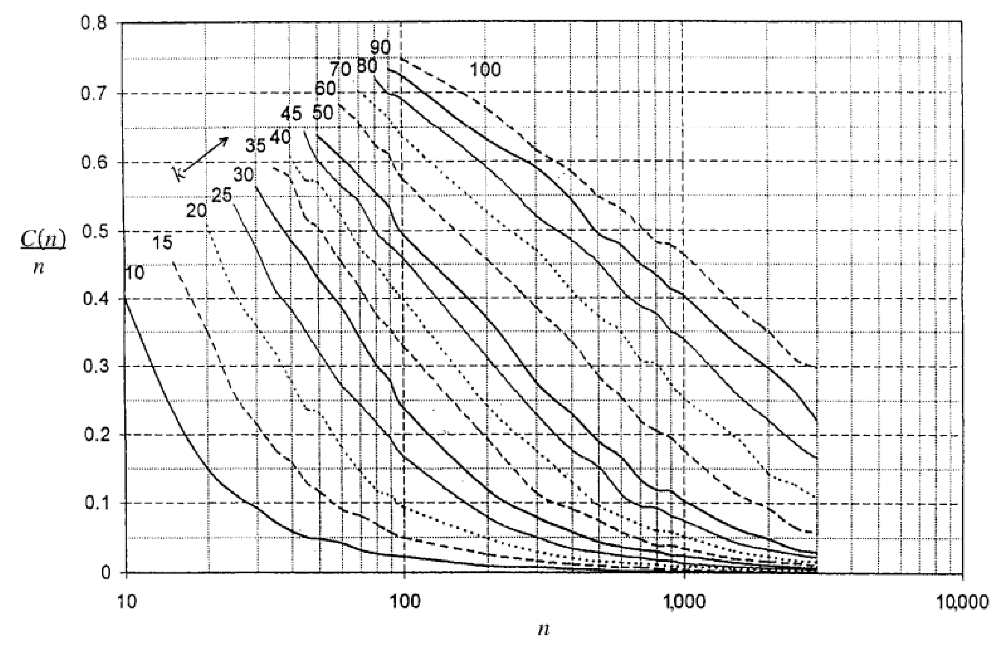

# 古典的マッチング理論の限界をいかに克服するか

- 2章まではマッチング理論の基本的な成果を紹介したが、3章ではマッチング理論が現実のマッチング市場の設計にどのように活用されているのかを見ていく。

## 研修医マッチングの現場を見て考える

- 古典的なマッチング理論の世界では、DAアルゴリズムを使うことで簡単に「**安定性**」という望ましい性質を満たすマッチングを見つけることができた。しかし、「**耐戦略性**」と呼ばれる性質、つまり戦略的な嘘の申告を防げないという欠点もあった。
- NRMPなどの現実のマッチング市場では、<u>カップルが多く参加している場合</u>、古典的なマッチング理論では安定マッチングが存在しない場合があることが示されている。
- 古典的なマッチング理論では「どの程度重大な影響を持つのか」を説明できない。
  - 参加者たちの戦略的な虚偽申告によりマッチングの帰結はどの程度操作されているのか。
  - カップルの存在によってどの程度安定性が失われているのか。

### 研修医マッチングの黎明期

- 【**歴史**】アメリカの研修医制度は医学生がプロの医師として働く前に見習いの医師として実地訓練を行う制度として、1900年頃に開始された。**当時**、研修医と病院とをマッチさせる市場は分権的(decentralized)で集権的(centralized)な方法ではなかった。具体的には、日本における就職活動のように個々の研修医と病院が各々勝手なタイミングで面接をしたり内定を出したりしていた。
- 【**問題点**】①研修医の活動の早期化と②学生と病院のミスマッチの2つが挙げられる。まず①の問題について。医学生側は将来のキャリアのために良い病院を選択したい、一方、病院側は優秀な学生を雇うために早く契約を結びたい。これにより、すべての病院で内定時期が早まり、「青田買い」が横行した。次に②の問題について。早期に契約を結んだ学生が実は「血を見ると失神する体質」であったり、「当初の希望は外科だったが、耳鼻科に変わった」など、さまざまなミスマッチが発生するリスクを持っている。
- 【**解決策**】1950年代に集権的(centralized)な研修医制度に変更した。当初は受け入れ即決アルゴリズムと類似した考えであったが、その後改善を重ね、DAアルゴリズムと本質的に同じ手法（ただし、病院応募制DAアルゴリズム）になった。DAアルゴリズムはゲイルとシャプリーにより1960年代に見つけられたものであることから、研修医制度の改革に用いられたアルゴリズムは偶然の産物であるものの安定的なマッチングであった。

### 医学生たちの不満と1990年代の改革

- NRMPは1990年代に危機を迎える。学生団体や有名運動家ラルフネーダーが主導する政治団体などを中心に、NRMPの不当性を訴えマッチングアルゴリズムの再設計を要求する声が上がった。挙げられた指摘や欠点は以下の通り。
  - 【**指摘1：最適安定マッチングの指摘**】「NRMPは研修医たちの利益を犠牲にし、病院側に不当に有利なマッチングを行なっている」というものであった。これは病院応募制DAアルゴリズムが病院最適安定マッチングであることに起因し、正当な指摘である。
  - 【**指摘2：耐戦略性の指摘**】「NRMPのマッチング制度は研修医側にとって複雑な制度であり、正直に自分の希望順位に申告した研修医が損をする可能性がある」というものであった。これはDAアルゴリズムが耐戦略性がないことを意味しており、多対1マッチングにおいては両側の耐戦略性を満たさないため、正当な指摘である。
  - 【**欠点1：特殊な選好の考慮不足**】従来の理論が排除している特殊な選好、例えば、カップル達の選好を上手く尊重できず、上手く扱えない。DAアルゴリズムは参加者それぞれを「完全に独立した存在」として扱っているため、

### データを見る

- NRMPの運営者は前述の不満を受けて、マッチングアルゴリズムの再設計を行なったが、以下の問題を抱えていた。
  - 【**問題1**】参加者による戦略的操作がマッチングに「どの程度」の影響を与えるのか。
  - 【**問題2**】研修医最適安定マッチングと病院最適安定マッチングの差は「どれくらい」あるのか。制度の選択に関してどの程度の利害対立があるのか。
  - 【**問題3**】古典的な理論では対応不可の仮定(カップルなど)が、どのような影響を与えるのか。
- 以下に**1987年と1990年代のNRMPのデータ**と**そのデータを用いたDAアルゴリズムの実行結果の比較表**を示す。結果を見ると、研修医応募制と病院応募制による影響は2万人中20人$(0.1\%)$程度にしか影響がないことが分かった。
- 実データの結果から、現実世界では必ずしも最適安定マッチングや僻地病院定理などが成立しないことが分かった。これは、カップルの存在やその他の複雑性のためであり、理論自体が間違っていたのではない。さらに、医学生が戦略的操作により得することが可能であったかどうかを調べたところ、そのような医学生は非常に少ないことが分かった。
- 実データを用いて理論を適用したところ、戦略的操作やカップルの問題はあるものの、近似的に成立していることが分かった。
  - 【**確認1**】カップルのいる実データを用いてマッチング理論を適用したところ、不満のある参加者は$0.1\%$未満であることを確認した。
  - 【**確認2**】戦略的操作によってマッチングが不安定になる可能性について、さほど大きな問題にならず、2万人に対して20人$(0.1\%)$程度であることを確認した。

<table>
    <caption><b>NRMP参加者のデータ</b></caption>
	<tbody>
		<tr>
			<th></th>
			<th>1987年</th>
			<th>1993年</th>
			<th>1994年</th>
			<th>1995年</th>
			<th>1996年</th>
		</tr>
		<tr>
			<td>
            研修医の数 
            カップルの数 
            病院の数 
            </td>
			<td>
            20,071 
            694 
            3,170
            </td>
			<td>
            20,916 
            854 
            3,622
            </td>
			<td>
            22,353 
            892 
            3,662
            </td>
			<td>
            22,937 
            998 
            3,745
            </td>
			<td>
            24,749 
            1,008 
            3,758
            </td>
		</tr>
		<tr>
			<td>定員の合計</td>
			<td>19,973</td>
			<td>22,737</td>
			<td>22,801</td>
			<td>22,806</td>
			<td>22,578</td>
		</tr>
	</tbody>
</table>

<table>
    <caption><b>研修医応募制DAと病院応募制DAの結果の比較</b></caption>
	<tbody>
		<tr>
			<th colspan="2"></th>
			<th>1987年</th>
			<th>1993年</th>
			<th>1994年</th>
			<th>1995年</th>
			<th>1996年</th>
		</tr>
		<tr>
			<th rowspan="4">研 修 医</th>
			<td>研修医応募制を好む</td>
			<td>12</td>
			<td>16</td>
			<td>11</td>
			<td>14</td>
			<td>12</td>
		</tr>
		<tr>
			<td>病院応募制を好む</td>
			<td>8</td>
			<td>0</td>
			<td>9</td>
			<td>0</td>
			<td>9</td>
		</tr>
		<tr>
			<td>研修医応募制にすると 研修先を得る</td>
			<td>0</td>
			<td>0</td>
			<td>0</td>
			<td>0</td>
			<td>1</td>
		</tr>
		<tr style="border-bottom: 6px double">
			<td>研修医応募制にすると 研修先を失う</td>
			<td>1</td>
			<td>0</td>
			<td>0</td>
			<td>0</td>
			<td>0</td>
		</tr>
		<tr>
			<th rowspan="4">病 院</th>
			<td>研修医応募制を好む</td>
			<td>8</td>
			<td>0</td>
			<td>12</td>
			<td>1</td>
			<td>10</td>
		</tr>
		<tr>
			<td>病院応募制を好む</td>
			<td>12</td>
			<td>15</td>
			<td>11</td>
			<td>14</td>
			<td>9</td>
		</tr>
		<tr>
			<td>研修医応募制にすると 受け入れ人数が増える</td>
			<td>0</td>
			<td>0</td>
			<td>2</td>
			<td>1</td>
			<td>1</td>
		</tr>
		<tr>
			<td>研修医応募制にすると 受け入れ人数が減る</td>
			<td>1</td>
			<td>0</td>
			<td>2</td>
			<td>0</td>
			<td>0</td>
		</tr>
	</tbody>
</table>

<table>
    <caption><b>戦略的操作が可能だった参加者の人数</b></caption>
	<tbody>
		<tr>
			<th></th>
			<th>1987年</th>
			<th>1993年</th>
			<th>1994年</th>
			<th>1995年</th>
			<th>1996年</th>
		</tr>
		<tr>
			<td>研修医の数</td>
			<td>20,071</td>
			<td>20,916</td>
			<td>22,353</td>
			<td>22,937</td>
			<td>24,749</td>
		</tr>
		<tr>
			<td>病院応募制で 戦略的操作可能</td>
			<td>12</td>
			<td>22</td>
			<td>13</td>
			<td>16</td>
			<td>11</td>
		</tr>
		<tr>
			<td>研修医応募制で 戦略的操作可能</td>
			<td>0</td>
			<td>0</td>
			<td>2</td>
			<td>2</td>
			<td>9</td>
		</tr>
	</tbody>
</table>

## シミュレーションによる分析

- 前節のNRMPのデータを用いたDAアルゴリズムの適用により分析したところ、以下のことが分かった。
  - 【**批判1**】理論の結論が近似的に正しいのはNRMPという特殊な市場に固有の特徴かもしれない。他の労働市場や学校選択などのマッチング市場でも同じことが言えるとは限らない。
  - 【**批判2**】NRMPに提出された選好リストがあたかも「真の」選好リストであると仮定しているが、提出されたものはすでに多くの参加者が「戦略的操作を行った後の」選好リストかもしれない。後者の場合、これ以上嘘をついて得をすることができる参加者が少ないのは当たり前という可能性がある。
  - 【**批判3**】理論的な近似値であることや、戦略的操作ができる参加者が少数であることについて、「**なぜそうなるのか**」について説明できない。

### モデル

- 上記を踏まえ、RothとPeranson（1999）がシミュレーションを行い、批判1と2について調査した。具体的にはコンピュータによりランダムデータを生成し、仮想的なマッチング市場を作り上げて、理論を適用するものである。
  - $n$人の研修医と$n$個の研修プログラム（病院）との1対1マッチングを考えた。ここで$n$は市場規模を表すパラメータとする。
  - 各参加者の応募可能数を$k(≦n)$とし、選好リストの$k+1$番目以降は受け入れ不可能（外部オプション$\emptyset$）とする。例えば、$n=3000$件以上の研修プログラムがあったとき、$k=10$や$k=15$までのプログラムにしか応募できないものとする。

### シミュレーション結果

$$
\begin{align*}
    \frac{C(n)}{n}&：評価関数\\[2mm]
    C(n)&：研修医応募制と病院応募制とで異なる結果を得た研修医数\\
    n&：研修医数、研修プログラム数（病院）\\
    k&：応募可能数、選好リストの長さ（k≦n）
\end{align*}
$$

- RothとPeranson(1999)はパラメータ$n$、$k$を色々な値に設定し、研修医応募制と病院応募制のアルゴリズムとで異なる結果を得た研修医の数$C(n)$を調べた。$C(n)$の大きさは戦略的操作が可能な度合いも表している。つまり、$C(n)$の多寡が戦略的な虚偽申告の有用性・危険性をそのまま表す。
- 上記の実験結果より、$n$が大きくなるにつれて$\frac{C(n)}{n}$が減少するという関係があることが明らかになった。つまり、「大規模な市場」では2つのDAアルゴリズムの結果にはほとんど違いがなくなり、戦略的操作もほとんどできなくなる。

## 大市場のマーケットデザイン理論

- 前節のシミュレーションから分かったこと・分かっていないことは以下の通り。
  - 【**分かったこと**】一般化された「大規模な市場」では、研修医応募制と病院応募制の2つのDAアルゴリズムの結果にはほとんど違いがなく、戦略的操作もほとんどできなくなる。
  - 【**分かっていないこと**】分析結果から「なぜそうなるのか」を説明できない。
- **本節**では、なぜ理論的な予測はだいたい正しいのかを説明するための理論を紹介する。

### 市場規模と戦略的操作の問題

$$
【病院】H,S、【研修医】i,j\\[2mm]
\begin{align*}
\succ_i&：S,H\hspace{10mm}\succ_j：H,S\\
\succ_H&：i,j\hspace{12.1mm}\succ_S：j,i
\end{align*}\\
\color{red}【研修医応募制DAアルゴリズムの帰結】i\hearts S、j\hearts H
$$

- RothとPeranson(1999)はシミュレーション結果から「大規模な市場ではDAアルゴリズムは戦略的操作に強い」という推測を得た。その後KojimaとPathak(2009)によって理論的に証明された。
- 以降、上記の所与で市場規模と戦略的操作の分析を行う。

#### 【例1】大学$S$が虚偽申告した場合〜「拒否の連鎖」について〜

$$
【大学】H,S、【研修医】i,j\\[2mm]
\begin{align*}
\succ_i&：S,H\hspace{10mm}\succ_j：H,S\\
\succ_H&：i,j\hspace{12.1mm}\color{red}\succ_S'\color{red}：j
\end{align*}\\
【研修医応募制DAアルゴリズムの帰結】i\hearts H、j\hearts S\\[5mm]
【\bold{拒否の連鎖}】\\[2mm]
\begin{align*}
&i\hspace{.5mm}が\hspace{.5mm}S\hspace{.5mm}に応募\rightarrow S\hspace{.5mm}が\hspace{.5mm}i\hspace{.5mm}を拒否\rightarrow i\hspace{.5mm}が\hspace{.5mm}H\hspace{.5mm}に応募\rightarrow H\hspace{.5mm}が\hspace{.5mm}j\hspace{.5mm}を拒否\\
\rightarrow&j\hspace{.5mm}が\hspace{.5mm}S\hspace{.5mm}に応募（\color{red}拒否の連鎖がSに戻ってくる\color{black}）
\end{align*}
$$

- 大学$S$の拒否をきっかけに他の病院と研修医を経由して連鎖反応が起きている。この連鎖を「拒否の連鎖」と呼び、また、「$S$が拒否したことで始まった拒否の連鎖の影響により、その後のステップでいずれかの学生が$S$に応募する」ことを「拒否の連鎖が$S$に戻ってくる」と言う。

#### 【例1】から導かれること

$$
【\bold{定理（補題1+補題2）}】\\
研修医応募制DAアルゴリズムのもとでは市場規模が大きくなるほど、\\
戦略的操作によって得をすることができる病院の割合は限りなく0に近づく。\\[4mm]
【\bold{補題1}】\\
研修医応募制DAアルゴリズムのもとで、もし病院Sに戻ってくる\color{red}拒否の連鎖\color{black}が\\
存在しないならばSはいかなる戦略的操作によっても得をすることができない。\\[4mm]
【\bold{補題2}】\\
研修医応募制DAアルゴリズムの下では、市場規模が大きくなるほど、\\
どの病院についても\color{red}拒否の連鎖\color{black}が自分に戻ってくる確率は限りなく0に近づく。
$$

- **補題1**について、「いかなる戦略的操作」と言うのは①選好の虚偽申告だけでなく、②定員数の虚偽申告なども含む。拒否の連鎖が戻ってくるケースは「①多くの病院の定員に空きがなく、②新たな応募が発生した際にいずれかの研修医を拒否せざるを得ない状況が、③何度も続いてしまう時」であり、病院の定員の豊富さ（**市場の厚み**）が戦略的操作の可能性を決める。
- **補題2**について、市場規模$n$が大きくなるにつれて「各病院が持つ市場への影響力」が徐々に小さくなっていくことを意味する。厳密では市場が正則性（定員数や選好リストの長さは市場規模$n$とは無関係に定まっていることを要求する条件）
- **定理**について、これは従来のマッチング理論では扱っていなかった市場規模や市場の厚みといった概念を導入し、参加者が十分に多い市場では戦略的操作が得をすることができる参加者がほとんどいない理由を解明した。

### 市場規模とカップルの問題

$$
【\bold{定理}】\\[1mm]
\begin{align*}
&たとえカップルが参加していてもその割合が小さければ、市場規模が大きくなると、\\
&安定マッチングが存在する確率は限りなく1(100\%)に近づく。\bold{\color{red}ただし}、市場規模nが\\
&拡大する速さに対してカップルの数は\sqrt{n}未満の速度でしか拡大しないと言う仮定で\\
&成り立つ
\end{align*}
$$

- これまでの内容を踏まえ、研修医マッチングは「病院応募制DAアルゴリズム$\rightarrow$研修医応募制DAアルゴリズム」に変更され、さらにカップルの希望を自然に組み込んだアルゴリズムに改変した。このアルゴリズムは$\color{red}ロス=ペランソン・アルゴリズム$と呼ばれている。
- しかし、それでもカップルが参加している場合はそもそも安定なマッチングが存在しない問題は残っている。この問題については、KojimaとPathakとRoth(2013)が解決しており、上式の定理を導出した。

---

#### 参考文献

<ol class="brackets">
  <li>Ashlagi, Itai, Mark Braverman and Avinatan Hassidim (2014) "Stability in Large Matching Markets with Complementarities," <i>Operations Research</i>, 62(4), pp.713-732.</li>
  <li>Demange, Gabrielle, David Gale and Marilda Sotomayor (1987) "A Further Note on the Stable Matching Problem," <i>Discrete Applied Mathematics</i>, 16(3), pp.217-222.</li>
  <li>Immorlica, Nicole and Mohammad Mahdian (2005) "Marriage, Honesty, and Stability," Proceedings of the sixteenth annual ACM-SIAM symposium on Discrete algorithms, pp.53-62.</li>
  <li>Kojima, Fuhito and Parag A. Pathak (2009) "Incentives and Stability in Large Two-Sided Matching Markets," <i>American Economic Review</i>, 99(3), pp.608-627.</li>
  <li>Kojima, Fuhito, Parag A. Pathak and Alvin E. Roth (2013) "Matching with Couples: Stability and Incentives in Large Markets," <i>Quarterly Journal of Economics</i>, 128(4), pp.1585-1632.</li>
  <li>Roth, Alvin E. (2008) "Deferred Acceptance Algorithms: History, Theory, Practice, and Open Questions," <i>International Journal of Game Theory</i>, Special Issue in Honor of David Gale on his 85th birthday, 36(3-4), pp.537-569.</li>
  <li>Roth, Alvin E. and Marilda A. Oliveira Sotomayor (1990) <i>Two-Sided Matching: A Study in Game-Theoretic Modeling and Analysis</i>, Cambridge University Press.</li>
  <li>Roth, Alvin E. and Elliott Peranson (1999) "The Redesign of the Matching Market for American Physicians: Some Engineering Aspects of Economic Design," <i>American Economic Review</i>, 89(4), pp.748-780.</li>
</ol>