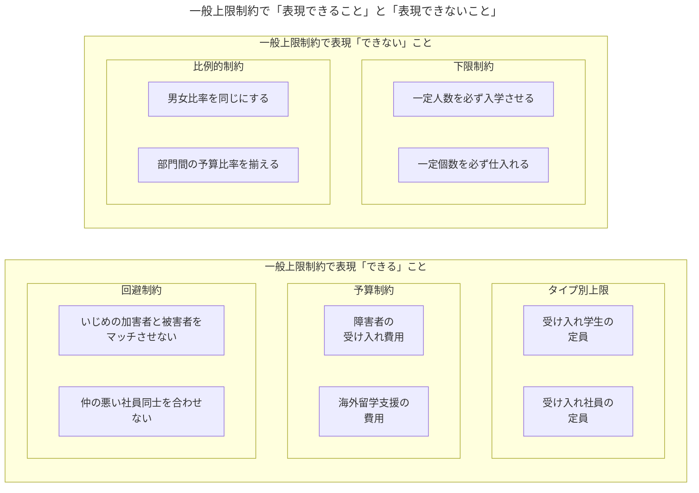
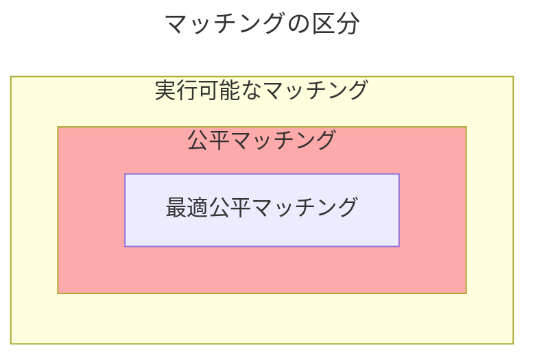

<div class="chap6">

# 複雑な制約のもとで公平なマッチングを考える

## 待機児童問題と制約付きマッチング

- 「子どもをどの保育園に預けるか」という保育園マッチングは典型的な多対一マッチングであり、これまでの理論では扱えない複雑な制約条件が課されていることが多い。
- 本章では、保育園マッチングのような複雑な制約が課されたマッチング問題を分析し、待機児童問題などに対するより良い解決策を理論的に考察する。

## モデル



- 典型的な例である「**学生と学校の制約付きマッチング**」を考える。
  - $I$：有限人の学生の集合（$i\in I$）
  - $S$：有限個の学校や保育園の集合（$s\in S$）
  - $\succ_i$：学生$i$が持つ$S\cup\{\emptyset\}$上にある選好
  - $\succ_s$：学校$s$が持つ$I$上にある優先順位

### 一般上限制約

$$
【\bold{一般上限制約}】
I'\in\mathcal{F}_s\hspace{2mm}かつ\hspace{2mm}I''\subseteqq I'\hspace{1mm}\implies\hspace{1mm}I''\in\mathcal{F}_s\\[3mm]
$$

- 各学校は法律などにより何らかの制約を課されている。ここで、学校$s$にとって「実行可能な学生の割り当て方（集合）」を$\mathcal{F}_s\subseteqq2^I$とし、$\mathcal{F}_s\neq \emptyset$と仮定する。つまり、何らかの学生の集合$I'\subseteqq I$が学校$s$にとって<font color=red>実行可能ならば$I'\in \mathcal{F}_s$</font>であり、<font color=blue>実行不可能ならば$I'\notin \mathcal{F}_s$</font>である。
- ここで前章の制約関数 $f：\mathbb{Z}^n\rightarrow\{0,1\}$ との違いは2つある。
  - 【**違い1**】入力項目が異なる。$f$は割り当て人数のみを入力として実行可否を決めていたが、$\mathcal{F}$は人数だけでなく個人の属性も考慮可能である。例えば、「3歳の児童は4人まで受け入れ可能だが、1歳の児童は1人までしか受け入れ可能ではない」という制約も付与可能である。
  - 【**違い2**】$f$は「**複数**」の学校（病院）の「**同時**」に関わる制約、$\mathcal{F}$は「**個々**」の学校（病院）ごとに「**独立**」に定められた制約を表す。そのため、地域上限のような「独立していないグループとして考慮が必要なパラメータ」は一般上限制約では対応できない。
- 上式は【**一般上限制約**】の式を表しており、「**学生の集合$I'$を学校$s$に割り当てることができるならば、$I'$のどんな部分集合$I''$も$s$に割り当てることが可能である**」ことを意味している。これは各学校や各病院について人数の上限のみを定める通常の制約を一般化したものである。

#### 人数制約

$$
【\bold{人数制約}】\\[1mm]
\text{0以上の整数 }q\text{ が存在して}\quad{F}_s=\left\{I'\subseteqq I：|I'|\leqq q\right\}\\[4mm]
【\bold{人数制約の一般上限制約}】\\[1mm]
I'\in \mathcal{F}_s\hspace{1mm}かつ\hspace{1mm}I''\subseteqq I'\implies|I''|\leqq|I'|\leqq q
$$

- ある整数$q\geqq 0$が存在し、$|I'|\leqq q\implies I'\in\mathcal{F}_s$が成り立つとき、$\mathcal{F}_s$を人数制約という。これは明らかに一般上限制約の一種である。

### 一般上限制約の例

#### 多様性への配慮（タイプ別上限）

- 学校選択において入学する学生の「人種の多様性」や「性別」のバランスが考慮されることがある。例えば、学校全体の定員は100人でも男女それぞれ70人までしか入学できないというような制約が考えられる。
- 上記のような制約は各学生の属性ごとに入学できる人数の上限を定めることでモデル化でき、このような制約を「**タイプ別定員**」という。

<div style="page-break-before:always"></div>

#### 障害がある学生の受け入れ制約（予算制約）

$$
\bold{【予算制約】}\\[1mm]
\mathcal{F}_s=\left\{I'\subseteqq I：\sum_{i\in I'}c_i\leqq b_s\right\}\\[5mm]
\bold{【予算制約の一般上限制約】}\\[2mm]
I''\subseteqq I'かつI'\in\mathcal{F}_s\implies\sum_{i\in I''}c_i\leqq\sum_{i\in I'}c_i\leqq b_s\\[4mm]
\begin{align*}
  c_i&：学生iの追加的な費用\\
  b_s&：学校sが持っている予算
\end{align*}
$$

- 何らかの障害がある学生は学校生活を送るために追加的な費用を必要とする場合がある。
- 上式は予算制約と呼ばれるものであり、各学生$i\in I$のコスト$c_i\in\mathbb{R}_+$と大学$s\in S$の持つ予算$b_s\in\mathbb{R}_+$を用いて表現できる。
- 本節は障害のある学生に対して「**予算制約**」という制約を与えたが、別の考え方として、海外留学などの外国語の運用能力のサポートとしての「**予算制約**」も考えることが可能である。

#### いじめを防ぐための制約

$$
\bold{【いじめを防ぐための制約】}\\[1mm]
\mathcal{F}_s=\left\{I'\subseteqq I：(i,j)\in B\implies\{i,j\}\nsubseteqq I'\right\}\\[4mm]
\begin{align*}
  B&：I\times Iの二項関係\\
  i&：加害者\\
  j&：被害者\\
\end{align*}
$$

- 学校選択を行う際にいじめの加害者と被害者を同じ学校に通わせないようにすることで緩和を図る方法が考えられる。
- 上式は「**加害者と被害者のペアを同じ学校にマッチさせない**」という制約であり、学校選択問題をモデル化したものである。
- これも一般上限制約の一種である。もし $I'\in\mathcal{F}_s$ なら加害者と被害者のどんなペアも $I'$ に含まれていないので $I'$ の任意の部分集合 $I''\subseteqq I'$ もそのようなペアを含まない。

<div style="page-break-before:always"></div>

### 一般上限制約ではない制約の例

- 前節の一般上限制約の例と反対にそうでない例も紹介する

#### 下限を定める制約

$$
\bold{【下限制約】}\\[1mm]
I'\in\mathcal{F}_s\iff |I'|\geqq q\\[4mm]
\begin{align*}
  q&：任意の整数（q\geqq 1）\\
\end{align*}
$$

- 教育効果を高めるためや単に営利上の観点から大学が一定の人数以上の学生を入学させたいと考えるのは自然なことである。「一定の人数以上を必ず入学させる」ことを要求する制約は「**下限制約**」と呼ばれる。下限制約を定式化した表現は上式になる。
- **下限制約は一般上限制約ではない**。なぜなら$\mathcal{F}_s$が一般上限制約だとすると、明らかに$\emptyset\in\mathcal{F}_s$でなければならないが、前提より$|\emptyset|=0<q$であり、食い違いが発生する。

#### 比例的制約

- マッチング市場において学生や労働者のタイプを考慮すること（多様性を確保すること）も制約の要求の一つと考えられる。例えば、低い世帯出身の学生の比率をその地区に住む社会経済的地位の低い世帯の比率に近づけるような制約、男女比率を同じにするような制約がある。このような制約は「**比例的制約**」と呼ばれ、一般上限制約ではない。
- **比例的制約が一般上限制約ではない**。まず定員100人の学校があり、「男性50人と女性50人」というマッチングはその制約を満たすため実行可能である。一方、その部分集合である「男性20人、女性50人」というマッチングも一般上限制約なら実行可能でなければならないが、これは明らかに男女比率が同じではない。このことから比例的制約は一般上限制約ではない。

<div style="page-break-before:always"></div>

## 公平マッチング

- 「一般上限制約を課されたマッチング問題において$"$望ましい$"$マッチングとは何か」という問いを考える。実は、<font color=red>一般上限制約のもとでは安定マッチングの存在は保証されない</font>。このことを確認するためにまず安定性の定義を分解する。

### 安定マッチングの定義の分解と非存在

```plantuml
title 安定マッチングの構成要素

rectangle 安定マッチング {
  rectangle "**個人合理的**である"
  rectangle ブロックするペアが存在しない {
    rectangle "**公平性**\n（正当な羨望を持つ人がいない）"
    rectangle "**効率性**\n（無駄がない）"
  }
}
```

<div style="padding: 15px 15px 15px 15px; border: 2px solid; border-radius: 5px;">
  【<b>公平性の定義</b>】以下の2つの条件は正当な羨望を持つ条件であり、<b>マッチング$\mu$において正当な羨望を持つ学生がいない時、$\mu$は公平であるという</b>。<br>
  <ol>
    <li>$\mu(j)\succ_i\mu(i)$</li>
    <li>$\mu(j)=s\hspace{2mm}かつ\hspace{2mm}i\succ_sj$</li>
  </ol>
  条件1.は$i$が今のペア$\mu(i)$よりも$j$のペア$\mu(j)$を好んでいて、$j$を羨ましいと思っていることを表す。<br>
  条件2.は大学$s=\mu(j)$もまた、$i$を$j$よりも好む（$i$の方が$j$より優先順位が高い）ことを表しており、$i$の持つ羨望が正当であることを意味している。<br>
  公平性はこのような正当な羨望を持つ学生が存在しないことを要求する条件である。
</div>
<br>
<div style="padding: 15px 15px 15px 15px; border: 2px solid; border-radius: 5px;">
  【<b>効率性の定義</b>】次の条件を満たす学生と大学のペア$(i,s)\in I\times S$が存在しない時、マッチング$\mu$には<b>無駄がない</b>という。<br>
  <ol>
    <li>$s\succ_i\mu(i)\hspace{2mm}かつ\hspace{2mm}\mu(s)\cup\{i\}\in\mathcal{F}_s$</li>
  </ol>
  これはある種の効率性の条件であり、「大学の定員に空きがあるにも関わらず入学を希望する学生を受け入れられない事態が生じないこと」を要求している。
</div>
<br>

- 実行可能なマッチング$\mu$が $(i)個人合理的$ であり、$(ii)ブロックするペアが存在しない$ ならば、$\mu$は安定マッチングであり、$(ii)$の条件は上の定義のようにある種の公平性と効率性の条件に分解できる。
- 上記の公平性と効率性はミクロ経済学における標準的な規範的条件であり、マッチング理論以外の分野でもよく扱われる。

#### 安定マッチングの例（安定マッチングが存在しないことの確認）

| 選好    | 1           | 2           | 3           | 4           | 5           | 6           | 7           | 8           | 9           | 10          | 11          |
| ------- | ----------- | ----------- | ----------- | ----------- | ----------- | ----------- | ----------- | ----------- | ----------- | ----------- | ----------- |
| 第1希望 | A           | A           | A           | A           | A           | A           | A           | A           | A           | A           | A           |
| 第2希望 | $\emptyset$ | $\emptyset$ | $\emptyset$ | $\emptyset$ | $\emptyset$ | $\emptyset$ | $\emptyset$ | $\emptyset$ | $\emptyset$ | $\emptyset$ | $\emptyset$ |

| 選好     | A           |
| -------- | ----------- |
| 第1希望  | 1           |
| 第2希望  | 2           |
| $\vdots$ | $\vdots$    |
| 第11希望 | 11          |
| 第12希望 | $\emptyset$ |

$$
\begin{align*}
  【例1】\mu(A)&=\{1,2,\ldots,10\}\hspace{3mm}\implies\text{実行不可能（予算超過している: }11>b_A\text{）}\\[1mm]
  【例2】\mu(A)&=\{1,2,\ldots,9\}\hspace{5mm}\implies\text{効率性違反（予算が余る）}\\[1mm]
  【例3】\mu(A)&=\{1,2,\ldots,9,11\}\implies\text{公平性違反（学生10が11に正当な羨望を持つ）}  
\end{align*}
$$

- 【**前提条件**】予算を$b_A$、学生の入学コストを$c_i$とすると、$b_A=10$、$c_{10}=2$、$c_i=1$（$i=\{1,2,\ldots,9,11\}$）である。
- 【**マッチング例の分析**】
  - **例1**について、これは確かに公平性と効率性を満たすが、学生の受け入れ費用の合計が11であり予算10を超過しており「**実行不可能**」である。
  - **例2**について、これは学生の受け入れ費用が9で予算に余裕がある（予算上限は10である）ことから「**効率性違反**」である。
  - **例3**について、これは学生の受け入れ費用と予算は釣り合っているが、学生10は11に対して正当な羨望を持っている状態にある。つまり、「**公平性違反**」である。

### 公平マッチングの定義と存在



<div style="padding: 15px 15px 15px 15px; border: 2px solid; border-radius: 5px;">
  【<b>公平マッチングの定義</b>】<br>
  実行可能なマッチング$\mu$が「個人合理性」と「公平性」を満たすとき<b>公平マッチング</b>と呼ぶ。
</div>
<br>

- 公平マッチングは「安定マッチングから効率性を除いたマッチング」であるが、この場合「**どの大学も誰も入学させないマッチング**」、つまり$\mu(s)=\emptyset$も公平マッチングになる。実際、実行可能であり、個人合理的・公平性も満たしている。このことから、公平マッチングを望ましいマッチングの定義としてそのまま採用できない。
- 次節では「公平マッチングの中で$"$最も望ましい$"$マッチング」を考える。

### 学生最適公平マッチング

<div style="padding: 15px 15px 0px 15px; border: 2px solid; border-radius: 5px;">
  【<b>学生最適公平マッチングの定義</b>】以下の条件を満たす時、マッチング$\mu$を<b>学生最適公平マッチング（SOFM：Student Optimal Fair Matching）</b>と呼ぶ<br>
  <ol>
    <li>実行可能である</li>
    <li>個人合理性と公平性を満たす</li>
    <li>上記2つの条件を満たすマッチング$\mu'$のうち、すべての学生 $i\in I$ について $\mu(i)\succeq_i\mu'(i)$ を満たす</li>
  </ol>
</div>
<br>

- 上の定義は学生最適マッチングについて説明したものである。学生最適マッチングは公平マッチングの中ですべての学生にとっての利益を（同時に）最大にするマッチングのことである。

## 学生最適公平マッチングの特徴づけと存在証明

- 「複雑な制約のない」マッチング理論では、DAアルゴリズムを用いて安定マッチングの存在を証明した。**本節では学生最適公平マッチング（SOFM）という帰結を導くカットオフ調整アルゴリズム（CAアルゴリズム：Cutoff Adjustment Algorithm）を定義する**。
- CAアルゴリズムは見た目はややこしいが市場均衡理論における価格調整プロセスと似た、直感的なアルゴリズムである。

### カットオフと需要

#### 【準備】カットオフと優先順位の定義

$$
【\bold{カットオフの定義}】\\[2mm]
\begin{align*}
  【カットオフプロファイル】&p=\{p_1,p_2,\ldots,p_{|s|}\}\\[1mm]
  【すべてのpを含む集合】&P\coloneqq \{1,2,\ldots,|I|,|I|+1\}^s\\[1mm]
  【半順序】&p\leq p'\iff p_s\leq p_s'\hspace{3mm}\forall s\in S
\end{align*}\\[5mm]
【\bold{優先順位の定義}】\\[2mm]
\begin{align*}
  【最下位の学生】&i^{(s,1)}\\[1mm]
  【最も好ましい学生】&i^{(s,|I|)}\\[1mm]
  【仮想的な学生】&i^*=i^{(s,|I|+1)}\\[1mm]
  【学校の優先順位のドメイン】&I\cup\{i^*\}
\end{align*}
$$

- 「**カットオフ**」とは優先順位のうち下から何番目までを切り捨てるかを決める整数である。カットオフは各学校の足切りラインのようなものであり、市場の価格調整プロセスにおける価格のような役割を果たす。
- すべての学校についてカットオフを並べたものをカットオフプロファイル$p$、すべてのカットオフプロファイルが含まれる集合を$P$とする。また$P$について、任意のプロファイル$p,p'$について上式のように半順序が定義されているものとする。このように何らかの半順序が与えられた集合を「半順序集合」と呼び、$(P,\leq)$ と書くこともある。
- 次に、各学校$s\in S$の優先順位$\succ_s$において下から$l$番目の学生を $i^{(s,l)}$ とすると上式のように定義できる。ここで、<font color=red>仮想的な学生は学校$s\in S$のすべての学生$i\in I$について $i^*\succ_s i$ を満たす</font>。

<div style="page-break-before:always"></div>

#### 需要の定義

$$
【\bold{需要の定義}】\\[2mm]
\begin{align*}
  \color{red}D_s(p)\color{black}=\left\{i\in I\hspace{1mm}\left|\begin{array}{l}
    \color{blue}i\succeq_si^{(s,p_s)}\color{black},\\
    \color{green}s\succ_i\emptyset\color{black},\\
    \color{orange}i\succeq_{s'}i^{(s',p_{s'})}
    \implies s\succeq_i s'
  \end{array}\right.\right\}
\end{align*}\\[5mm]
【\bold{カットオフ調整関数の定義}】\\[2mm]
\begin{align*}
  T_s(p)=\left\{
    \begin{array}{l}
      p_s+1&if&\color{red}D_s(p)\notin\mathcal{F}_s\\[1.5mm]
      p_s&if&\color{blue}D_s(p)\in\mathcal{F}_s
    \end{array}
  \right.
\end{align*}
$$

- $\color{red}D_s(p)\color{black}$は$p$によって切り捨てられた学校の優先順位リストに載っている学生のうち、$s$のことを受け入れ可能かつ最も好んでいるものたちをすべて含む集合である。以下に式の補足を示す。
  - $\color{blue}i\succeq_si^{(s,p_s)}$ について、学生$i$が下から$p_s$番目以上には好まれていることを表しており、**下から$p_s-1$番目までを切り捨てた後の優先順位のリストに$i$が載っていることを意味する**。
  - $\color{green}s\succ_i\emptyset$ は学校$s$は$i$にとって受け入れ可能であることを意味している。
  - $\color{orange}i\succeq_{s'}i^{(s',p_{s'})}\implies s\succeq_i s'$ は$i$が他の学校$s'\in S$の足切り済みの優先順位リストにも載っているなら、$s$は$i$に最も好まれている学校であるということを意味する。
- カットオフ調整関数$T$ は $p\in P$に対して各学校$s$の需要$D_s(p)$が実行不可能（$\color{red}D_s(p)\notin\mathcal{F}_s$）ならカットオフの値を1増やし、実行可能（$\color{blue}D_s(p)\in\mathcal{F}_s$）なら何もしない。以下に式の補足を示す。
  - カットオフが1増加するということは学校$s$の優先順位が追加的に1つ切り捨てられるということであり、足切りラインが1つ上がるということである。
  - 関数の入力と出力が一致する点を**不動点**と呼ぶ。あるカットオフプロファイル$p\in P$において、もしすべての学校$s$の需要について$D_s(p)\in\mathcal{F}_s$が成り立つなら、<b>$p$は不動点</b>であり、$T(p)=p$が成り立つ。

<div style="page-break-before:always"></div>

### 公平マッチングの特徴づけと最適公平マッチングの存在

<div style="padding: 15px 15px 0px 15px; border: 2px solid; border-radius: 5px;">
  【<b>定理</b>】<br>
  <ol>
    <li>もしカットオフプロファイル$p\in P$が関数$T$の不動点ならば、$\mu^p$は実行可能で、個人合理的で、公平性を満たす。</li>
    <li>あるマッチング$\mu$が実行可能で、個人合理的で、公平ならば、カットオフ調整関数$T$の不動点となるカットオフプロファイル $p\in P$ が存在して $\mu=\mu^p$ が成り立つ。</li>
  </ol>
</div>
<br>
<div style="padding: 15px 15px 15px 15px; border: 2px solid; border-radius: 5px;">
  【<b>1.の証明</b>】カットオフプロファイル$p\in P$がカットオフ調整関数$T$の不動点であると仮定する。この時、すべての学校$s\in S$について$T_s(p)=p$が成立する。つまり、すべての$s$について$\mu^p(s)=D_s(p)\in\mathcal{F}_s$が成立する。ここで、$\mathcal{F}_s$は実行可能な集合であることから<font color=red>$\mu^p$は実行可能である</font>。また、定義より$D_s(p)$の中には$s$のことを受け入れ可能な学生しか含まれていないことから、<font color=red>$\mu^p$が個人合理性を満たす</font>こともすぐにわかる。最後に公平性を満たすことを確認する。$D_s(p)$の定義より、ある学生$i$が学校$s$の優先順位リストに入っているのに入学していないならば別の学校$s'$の方が好きということであり、つまり$i\in D_{s'}(p)$であり、$s'\succ_i s$が成立する。よって、<font color=red>$\mu^p$は公平性を満たすである</font>。【<b>証明終了</b>】
  <br><br>
  【<b>2.の証明</b>】実行可能で、個人合理的で、公平性を満たすマッチング$\mu$を1つ取ってくることを考える。各学校$s\in S$についてカットオフを以下のように定める。
  $$
  【\bold{カットオフ}】p_s=\left\{\begin{array}{l}
    \min\{l\hspace{1mm}|\hspace{1mm}i^{(s,l)}\in\mu(s)\}&if&\mu(s)\neq\emptyset\\[2mm]
    |I|+1&otherwise
  \end{array}\right.
  $$
  $p_s=l$ は $\mu(s)$ の中で最も優先順位の低い学生（下から$l$番目の学生）までの入学を許可し、それより優先順位の低い学生を足切りするというカットオフになっている。この時、$\mu^p(s)=D_s(p)$ で定まるマッチングは$\mu$そのものであり、$\mu^p=\mu$が成り立つ。また、$\mu$は実行可能だったため$T(p)=p$が成り立ち、$T$の不動点であることがわかる。【<b>証明終了</b>】
</div>
<br>

- 上記の定理は、①実行可能性、②個人合理性、③公平性、を満たすマッチングがカットオフ調整関数の不動点として特徴付けられることを示したものである。
- しかし、ここではまだ制約条件については何も仮定しておらず、特に一般上限制約であることを用いていない。

<div style="page-break-before:always"></div>

#### 一般上限制約がある場合のマッチング

<div style="padding: 15px 15px 15px 15px; border: 2px solid; border-radius: 5px;">
  【<b>定理</b>】すべての学校の制約が一般上限制約ならば、学生最適公平マッチングが存在する。
</div>
<br>

- 上記の定理により、一般上限制約を課されたマッチング問題において、学生最適公平マッチングが必ず存在することを保証してくれることが分かる。また、学生最適公平マッチングは公平マッチングの中ではすべての学生にとって最適である。

#### 最適公平マッチングを見つける方法

**【準備】タルスキの不動点定理（Tarski's fixed point theorem）**

<div style="padding: 15px; border: 2px solid; border-radius: 5px;">
  【<b>定理：タルスキの不動点定理</b>】
  <br>
  半順序集合$(P,\leq)$が有限束であるとする。関数 $T：P\rightarrow P$ が弱増加関数（ $p\leq p'\implies T(p)\leq T(p')$ ）ならば、$T$ には不動点が存在し、不動点の集合も有限束となる。最大の不動点と最小の不動点が存在する<font color=red>$^＊$</font>。
  <div style="border-top: 2px solid #888; margin: 12px 0;"></div>  <font color=red>$^＊$</font>
  正確に言うと、これはタルスキの不動点定理の特殊ケースである。一般にタルスキの不動点定理は有限束よりも一般性の高い完備束上の関数について成立する。
</div>
<br>

- 次のCAアルゴリズム（最適公平マッチングを見つける方法）を説明するためにタルスキの不動点定理を解説する。
- タルスキの不動点定理はマッチング理論で活躍する定理の一つである。**半順序集合$(P,\leq)$が束である**とは任意のカットオフ$p,p'\in P$について、$\inf\{p,p'\}\in P$と$\sup\{p,p'\}\in P$が成り立つことをいう。例えば、$p=(2,1,6)$、$p'=(1,3,4)$とすると$\inf\{p,p'\}$と$\sup\{p,p'\}$は以下のようになる。
  - $\inf\{p,p'\}=\left(\min(2,1),\min(1,3),\min(6,4)\right)=(1,1,4)$
  - $\sup\{p,p'\}=\left(\max(2,1),\max(1,3),\max(6,4)\right)=(2,3,6)$
- また、定義 $P\coloneqq \{1,2,\ldots,|I|,|I|+1\}$ より、$P$は有限束である。

<div style="page-break-before:always"></div>

**CAアルゴリズム（Cutoff Adjustment Algorithm）**

1. 最小のカットオフプロファイル$\underline{p}$を作る
2. もし $\underline{p}=T\left(\underline{p}\right)$ならアルゴリズムは停止する。<font color=red>$\underline{p}<T\left(\underline{p}\right)$ なら $p^{(1)}=T\left(\underline{p}\right)$ </font>を新たなカットオフプロファイルとする。
3. もし $p^{(1)}=T\left(p^{(1)}\right)$ならアルゴリズムは停止する。<font color=red>$p^{(1)}<T\left(p^{(1)}\right)$ なら $p^{(2)}=T\left(p^{(1)}\right)=T\left(T\left(\underline{p}\right)\right)$</font> を新たなカットオフプロファイルとする。
4. この手続きを繰り返し続けていくと、<font color=red>$\underline{p}\leq T\left(\underline{p}\right)\leq T\left(T\left(\underline{p}\right)\right)\leq T\left(T\left(T\left(\underline{p}\right)\right)\right)\leq\cdots$</font>を満たすカットオフプロファイル $p^{(n)}=T^n\left(\underline{p}\right)$ を見つけることができる。$P$は有限束の集合なので、この手続きはいつか必ず停止する。初めて停止した点（不動点）を$p^*\in P$とすると $p^*=T\left(p^*\right)$ が成り立つ。こうして見つけた$p^*$は任意の不動点 $p^{**}\in P$ に対して $p^*\leq p^{**}$ が成り立つことが簡単に示すことができる。
5. カットオフが $p^*$ の時の需要に基づくマッチング $\mu^{p^*}$ は実行可能性、個人合理性、公平性を満たし、また、不動点の中で最小のカットオフである。つまり、<font color=red>$\mu^{p^*}$ は学生最適公平マッチングとなっている</font>。

### インセンティブについて

<div style="padding: 15px 15px 15px 15px; border: 2px solid; border-radius: 5px;">
  【<b>命題</b>】学校側の優先順位 $\succ_s$ がすべての学校で共通ならば、CAアルゴリズムは耐戦略性を満たす。
</div>
<br>

- **CAアルゴリズムは一般には耐戦略性を満たさない**。ただし上記のように、すべての学校で優先順位が共通ならば耐戦略性を満たす。
- 制度設計において環境で共通の優先順位を持つのであればCAアルゴリズムは有用である。

<div style="page-break-before:always"></div>

## 保育園マッチングへの応用とシミュレーション

- 現在、国が定めている実際の制約について、国は認可保育園に対して年齢ごとに受け入れ可能な児童の数と保育士の数の比率のみを定めている。具体的には、保育士1人に対し、0歳の児童なら3人まで、1歳と2歳は6人まで、3歳は20人まで、4歳と5歳の児童は30人まで受け入れ可能であると定められている。
- 例えば、0歳の児童を6人、1歳と2歳の児童を合計12人、3歳の児童を10人受け入れるには、以下の計算式で保育士の数を求める。
$$
6\times \frac{1}{3}+12\times \frac{1}{6}+10\times \frac{1}{20}=2+2+0.5=4.5[人]
$$計算結果より5人の保育士が必要である。本節では上記のような保育園マッチングをモデル化・定式化する。

### 保育園マッチングのモデル

$$
【\bold{保育園制約}】\\[2mm]
児童の集合のパーティションを\\[2mm]
I=\bigcup_{t\in\mathcal{J}}I_t\quad\left(I_t\cap I_{t'}=\emptyset\quad if\quad t\neq t'\right)\\
として以下を満たす\\
\mathcal{F}_s=\left\{I'\subseteqq I：\sum_{t\in\mathcal{J}}r_t\cdot |I'\cap I_t|\leq m_s\quad\forall t\in\mathcal{J}\right\}\\[5mm]
【\bold{保育園制約の一般上限制約}】\\[2mm]
\color{red}I''\color{black}\subseteqq \color{blue}I'\color{black}かつ\color{blue}I'\color{black}\in\mathcal{F}_s\iff\sum_{t\in\mathcal{J}}r_t\cdot |\color{red}I''\color{black}\cap I_t|\leq\sum_{t\in\mathcal{J}}r_t\cdot |\color{blue}I'\color{black}\cap I_t|\leq m_s\\[5mm]
\begin{align*}
  \mathcal{F}_s&：実行可能な学生の割り当て方（集合）\quad\mathcal{F}_s\subseteqq2^I,\hspace{1mm}\mathcal{F}_s\neq \emptyset\\
  \mathcal{J}&：\text{児童の年齢の集合}\quad\mathcal{J}=\{0,1,2,3,4,5\}\\
  r_t&：\text{国が定めた保育士1人の担当許可された}t\text{歳の児童の人数の逆数}\\
  m_s&：\text{保育園}s\text{の保育士の数}\quad m_s\in\mathbb{N}\\
\end{align*}
$$

- 国が保育園に課している制約は上式のように表現できる。上式は保育園にいる保育士で児童たちを受け入れ可能かどうかを判定する式になる。

#### 実運用上の保育士の制約（硬直的制約）

$$
【\bold{硬直的制約}】\\[2mm]
\sum_{t\in\mathcal{J}}r_t\cdot q_t\leq m_s\\[2mm]
\text{を満たす人数制約 }q_t\in\mathbb{N}\text{ が存在し、以下を満たす}\\[3mm]
\mathcal{F}_s=\left\{I'\subseteqq I：|I'\cap I_t|\leq q_t\quad\forall t\in\mathcal{J}\right\}\\[5mm]
【\bold{保育園制約の一般上限制約}】\\[2mm]
\color{red}I''\color{black}\subseteqq \color{blue}I'\color{black}かつ\color{blue}I'\color{black}\in\mathcal{F}_s\iff|\color{red}I''\color{black}\cap I_t|\leq|\color{blue}I'\color{black}\cap I_t|\leq q_t\\[5mm]
$$

- 先ほど保育園制約として定式化したが、運用上の制約は別であり、「**硬直的制約**」として上式のように定義できる。
- 硬直的制約もまた一般上限制約を満たす。

### シミュレーション分析の結果

- 

## 終わりに

- 

<div style="page-break-before:always"></div>

---

#### 参考文献

<ol class="brackets">
  <li>鈴木亘（2018）『経済学者、待機児童ゼロに挑む』新潮社<i></i></li>
  <li>Abdulkadiroglu, Atila and Tayfun Sonmez（2003） "School Choice: A Mechanism Design Approach," <i>American Economic Review</i>, 93(3), pp.729-747.</li>
  <li>Ehlers, Lars, Isa E. Hafalir, M. Bumin Yenmez, and Muhammed A. Yildirim（2014） "School Choice with Controlled Choice Constraints: Hard Bounds Versus Soft Bounds," <i>Journal of Economic Theory</i>, 153(C), pp.648-683.</li>
  <li>Fragiadakis, Daniel and Peter Troyan（2017） "Improving Matching under Hard Distributional Constraints," <i>Theoretical Economics</i>, 12(2), pp.863-908.</li>
  <li>Fragiadakis, Daniel, Atsushi Iwasaki, Peter Troyan, Suguru Ueda, and Makoto Yokoo（2016） "Strategyproof Matching with Minimum Quotas," <i>ACM Transactions on Economics and Computation</i>, 4(1), pp.1-40.</li>
  <li>Kamada, Yuichiro and Fuhito Kojima（2024） "Fair Matching under Constraints: Theory and Applications," <i>Review of Economic Studies</i>, 91(2), pp.1162-1199.</li>
  <li>Kasuya, Yusuke（2016） "Anti-bullying School Choice Mechanism Design," mimeo</li>
  <li>Nguyen, Thanh and Rakesh Vohra（2019） "Stable Matching with Proportionality Constraints," <i>Operations Research</i>, 67(6), pp.1503-1519.</li>
  <li>University of Oxford（2022） Applicants with Disabilities, <a href=https://www.ox.ac.uk/admissions/graduate/applying-to-oxford/applicants-with-disabilities>https://www.ox.ac.uk/admissions/graduate/applying-to-oxford/applicants-with-disabilities</a>, 2022年2月にアクセス</li>
</ol>