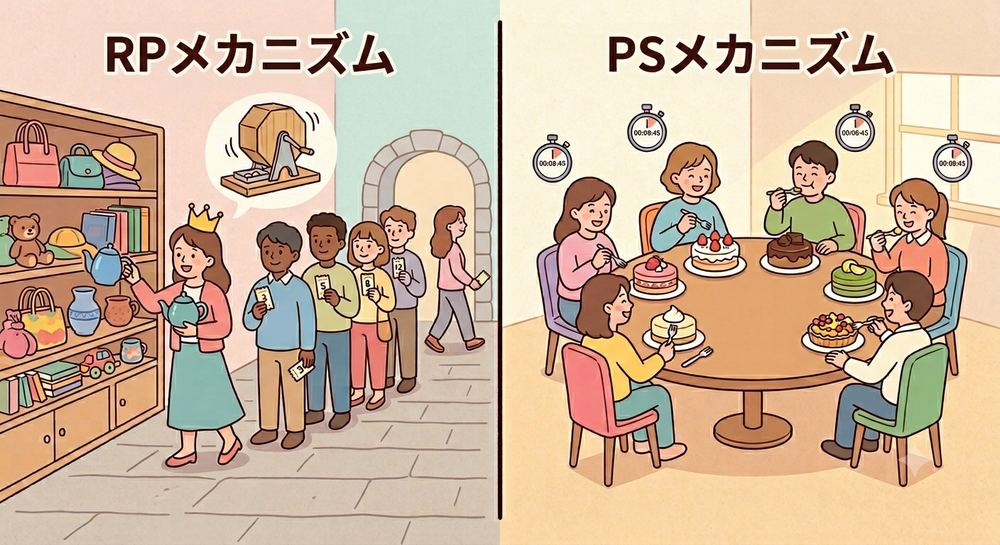

# 割り当て問題の公平な解決策を考える

## ヒトとモノのマッチング

|            |   RPメカニズム    |   PSメカニズム    |
| ---------- | :---------------: | :---------------: |
| 耐戦略性   |         ⚫         | 大規模な市場なら⚫ |
| 水平性     |         ⚫         |         ⚫         |
| 無羨望性   | 大規模な市場なら⚫ |         ⚫         |
| 順序効率性 | 大規模な市場なら⚫ |         ⚫         |

- 本章では「**ヒトとモノ**」のマッチングを扱う。これまでは両側マッチング（互いに選好を持つグループのマッチング）を扱っていたが、本章からは片側マッチング（一方が選好を持つグループのマッチング）を扱う。例えば、学生と学生寮のマッチング、患者と腎臓のマッチング、などが挙げられる。
- 以降、「**割り当て**」という言葉を使用する。本章では「**何らかの意味で望ましい割り当てを見つけるメカニズム**」を探すことを目的とする。登場するメカニズムは**RPメカニズム（Random Priority Mechanism：均等確率優先順位メカニズム）**と**PSメカニズム（Probabilistic Serial Mechanism：同時確率消費メカニズム）** の2つである。
- また、モノは選好を持たないため、望ましい性質として「**効率性**」に注目する。

## モデル

$$
【\bold{定義}】\\
\begin{align*}
  \text{個人の集合}\quad&N=\{1,2,3,4\},\hspace{2mm}i\in N\\
  \text{財の集合}\quad&O=\{l,m,n\},\hspace{4.5mm}a\in O\cup\{\emptyset\}\\
  \text{財の提供数}\quad&q_a\quad\text{※財}\emptyset\text{の供給数には際限は無い}
\end{align*}\\[3mm]
【\bold{ベクトル・行列表現}】\\
\begin{align*}
  P_i&=(P_{ia})=(P_{il}\quad P_{im}\quad P_{in}\quad P_{i\emptyset})\\[2mm]
  P&=\left(
    \begin{array}{l}
      P_{1l}\quad P_{1m}\quad P_{1n}\quad P_{1\emptyset}\\
      P_{2l}\quad P_{2m}\quad P_{2n}\quad P_{2\emptyset}\\
      P_{3l}\quad P_{3m}\quad P_{3n}\quad P_{3\emptyset}\\
      P_{4l}\quad P_{4m}\quad P_{4n}\quad P_{4\emptyset}\\
    \end{array}
  \right)
  =\left(
    \begin{array}{l}
      \displaystyle\frac{1}{6}\quad\frac{3}{6}\quad\frac{1}{6}\quad\frac{1}{6}\\[2.5mm]
      \displaystyle\frac{2}{6}\quad     0     \quad\frac{2}{6}\quad\frac{2}{6}\\[2.5mm]
      \displaystyle     0     \quad\frac{3}{6}\quad\frac{1}{6}\quad\frac{1}{6}\\[2.5mm]
      \displaystyle\frac{3}{6}\quad     0     \quad\frac{2}{6}\quad\frac{1}{6}
    \end{array}
  \right)
\end{align*}\\[3mm]
【\bold{条件}】\\
\sum_{a\in O\cup\{\emptyset\}}P_{ia}=1,\quad
\sum_{i\in N}P_{ia}\leqq q_a
$$

- 以降、「**最低限の公平性**」を保証するために確率的な割り当て問題を考える。個人の集合を$N$、割り当てられる財の集合を$O$とする。そして、「**どの財も受け取らない**」ことを$\emptyset$で表す。
- 個人$i\in N$に財$a\in O\cup\{\emptyset\}$が割り当てられる確率を$P_{ia}$とし、$0\leqq P_{ia}\leqq 1$を満たす。
- 人々が申告した選好プロファイルに対して1つの確率的な割り当てを与える手続きのことを「**割り当てメカニズム**」と呼ぶ。

#### 確率的な割り当ての例

$$
\begin{align*}
  \text{財の提供数}\quad q_a=1,\quad
  P&=\left(
    \begin{array}{l}
      1\quad 0\quad 0\quad 0\\
      0\quad 1\quad 0\quad 0\\
      0\quad 0\quad 1\quad 0\\
      0\quad 0\quad 0\quad 1
    \end{array}
  \right)
\end{align*}
$$

- 個人$1$に財$l$を「確実に」割り当てる（$P_{1l}=1=100\%$）
- 個人$2$に財$m$を「確実に」割り当てる（$P_{2m}=1=100\%$）
- 個人$3$に財$n$を「確実に」割り当てる（$P_{3n}=1=100\%$）
- 個人$4$には「確実に」何も割り当てない（$P_{4\emptyset}=1=100\%$）

## 均等確率優先順位メカニズム（RP：Random Priority）

- 均等確率優先順位メカニズム（Random Priority Mechanism）はその手続きの特徴から**均等確率逐次独裁制（Random Serial Dictatorship）** とも呼ばれる。

### 定義

  【<b>RPメカニズムの性質</b>】<b>耐戦略性</b>、<b>水平性</b>、<b>事後的な効率性</b>、の3つを満たすメカニズムであり、また、定義がシンプルで分かりやすいため実際に使うのも簡単である。ただし、事前の意味での効率性である「<b>順序効率性を満たさない</b>」という欠点もある。

 

- RPメカニズムの定義はとてもシンプルであり、以下の手順で手続きを進める。
  1. 各個人は財に対する希望順位を提出する。
  2. 各個人の優先順位を割り振る。優先順位はくじなどを使って（各個人が提出した希望順位などには依存させずに）均等に割り振る。
  3. 優先順位の高い人から順番に、まだ残っている財の中から自分が提出した希望順位のもとで一番望ましい財を受け取る。
  4. 全ての個人に財が割り振られたら手続きを終了する。
- 【**アルゴリズムの説明**】PRメカニズムでは、優先順位が1位になった人が、いわば「**最初の独裁者**」であり、他の人に邪魔されずに自分の好きなように財を選んで良いという意味で「**独裁者**」のように振る舞う。独裁者はその場にある財の中から好きなものを選んでその場から退場する。すると次の独裁者になるのは優先順位が2位の人であり、その人はその場に残っている財の中から好きなものを選んで退場する。以降も同様に優先順位の高い順にその場に残っている財の中から好きなものを選んで退場する。このプロセスを順番に行い、全員が退場すれば終了。
- 上記のように逐次的に独裁者が現れてはさっていくのでRPメカニズムは均等確率逐次独裁制とも言われる。

#### 例：プレイヤー4人、財2つの場合

$$
【\text{ゲーム環境}】\\
\begin{align*}
  \text{個人の集合}N=\{1,2,3,4\}\quad\quad
  \text{財の集合}O=\{a,b\}\quad\quad
  \text{財の提供数}q_a=q_b=1
\end{align*}\\[3mm]
【\text{選好}】\\
\begin{align*}
  \succ_1：a,b,\emptyset\quad\quad
  \succ_3：b,a,\emptyset\\
  \succ_2：a,b,\emptyset\quad\quad
  \succ_4：b,a,\emptyset\\
\end{align*}\\[3mm]
【\bold{RPメカニズムによって決まる確率行列}】\\[1mm]
\begin{align*}
  P&=\left(
    \begin{array}{l}
      P_{1a}\quad P_{1b}\quad P_{1\emptyset}\\
      P_{2a}\quad P_{2b}\quad P_{2\emptyset}\\
      P_{3a}\quad P_{3b}\quad P_{3\emptyset}\\
      P_{4a}\quad P_{4b}\quad P_{4\emptyset}\\
    \end{array}
  \right)
  =\left(
    \begin{array}{l}
      \displaystyle\frac{5}{12}\quad\frac{1}{12}\quad\frac{1}{2}\\[2.5mm]
      \displaystyle\frac{5}{12}\quad\frac{1}{12}\quad\frac{1}{2}\\[2.5mm]
      \displaystyle\frac{1}{12}\quad\frac{5}{12}\quad\frac{1}{2}\\[2.5mm]
      \displaystyle\frac{1}{12}\quad\frac{5}{12}\quad\frac{1}{2}\\[2.5mm]
    \end{array}
  \right)
\end{align*}
$$

- 今4人のプレイヤーが存在し、4人に財を配分するパターンは$4!=24$通りになる。このうち、個人1に対して割り当てられる財の場合分けを考える。
  - 【**個人$1$に財$a$を獲得できる確率**】「①個人1の優先順位が1位のとき」、または、「②個人3、4のいずれかが優先順位が1位のかつ個人1の優先順位が2位のとき」である。①の確率は$\frac{3!}{4!}=\frac{6}{24}$、②の確率は$\frac{_2P_1\times 2!}{4!}=\frac{4}{24}$よって、$①+②=\frac{10}{24}=\frac{5}{12}$
  - 【**個人$1$に財を獲得できない確率（$\emptyset$）**】個人1が3位または4位のときであるため、$\frac{3!\times 2}{4!}=\frac{12}{24}=\frac{1}{2}$
  - 【**個人$1$に財$b$を獲得できる確率**】1から上記2つの確率を引くことで求められる。よって、$1-\frac{10}{24}-\frac{12}{24}=\frac{2}{24}=\frac{1}{12}$
- 上記と同様の考え方で個人2〜4の財の割り当ての確率を求め、行列として表現すると上のようになる。

### 耐戦略性と公平性

  【<b>水平性の定義</b>】割り当てメカニズムが水平性を満たすとは、同じ選好を申告した個人 $i,j\in N$ について、どの財 $a\in O\cup\{\emptyset\}$ についても $P_{ia}=P_{ja}$ が成り立つことである。

 

- RPメカニズムのもとでは人々は嘘をついても得をしない。自分の優先順位が何位になろうとも正直に自分の選好を申告しておくことが各個人にとって最適であり、**RPメカニズムは耐戦略性を満たす**
- また、RPメカニズムは**水平性（Equal Treatment of Equals）** という、公平性の条件を満たす。水平性は等しい選好を表明した人には等しい確率を割り当てることを要求する条件である。厳密な表現は上記のようになる。

### 効率性

- RPメカニズムは**事後的な効率性（ex post efficiency）** を満たす。つまり、一旦財の割り当てが確定したら、財をさらに交換することによって誰も損させることなく誰かに得をさせることができない。なぜなら優先順位の高い順に個人はその時一番欲しい財を選ぶためです。例えば、2位の個人が1位の個人と財を交換することで2位の個人が得する可能性がありますが1位の個人は損をする。
- ここで、事後的な評価はRPメカニズムによって決まった確定的な割り当てについて行われる。一方で、事前の評価（水平性や後述の順序効率性など）はRPメカニズムによって決まる確率行列について行われることに注意が必要である。

#### 事前の効率性について

$$
\begin{align*}
  P&=\left(
    \begin{array}{l}
      \frac{5}{12}\quad\frac{1}{12}\quad\frac{1}{2}\\[2.5mm]
      \frac{5}{12}\quad\frac{1}{12}\quad\frac{1}{2}\\[2.5mm]
      \frac{1}{12}\quad\frac{5}{12}\quad\frac{1}{2}\\[2.5mm]
      \frac{1}{12}\quad\frac{5}{12}\quad\frac{1}{2}\\[2.5mm]
    \end{array}
  \right)
  \quad\quad\quad
  P'&=\left(
    \begin{array}{l}
      \frac{1}{2}\quad     0     \quad\frac{1}{2}\\[2.5mm]
      \frac{1}{2}\quad     0     \quad\frac{1}{2}\\[2.5mm]
            0    \quad\frac{1}{2}\quad\frac{1}{2}\\[2.5mm]
            0    \quad\frac{1}{2}\quad\frac{1}{2}\\[2.5mm]
    \end{array}
  \right)
\end{align*}
$$

- RPメカニズムによる割り当て$P$と別の割り当て$P'$を比較する。$P'$は$P$よりも「事前の意味で厳密に好ましい」と言える割り当てである。一方で、**$P$は事前の意味で非効率的**である。
- $P$において個人$1$は財$a$を$b$よりも厳密に好んでおり、個人$3$は財$b$を$a$よりも厳密に好んでいる。従って、個人$1$が財$b$を受け取る確率$P_{1b}=\frac{1}{12}$と個人$3$が財$a$を受け取る確率$P_{3a}=\frac{1}{12}$を交換すれば、お互いに今よりも得をすることができる。同様に個人$P_{2b}$と$P_{4a}$を交換すればお互いに得ができる。**このようにして得られた割り当てが$P'$である**。

#### 順序効率性

$$
P_1=\left(\frac{5}{12},\;\frac{1}{12},\;\frac{1}{2}\right)
\quad\quad
p_i(a,P;\;\succ_i)\\[2mm]
\begin{align*}
  p_1(a,P;\;\succ_1)&=\frac{5}{12}\\
  p_1(b,P;\;\succ_1)&=\frac{5}{12}+\frac{1}{12}=\frac{1}{2}\\
  p_1(\emptyset,P;\;\succ_1)&=\frac{5}{12}+\frac{1}{12}+\frac{1}{2}=1
\end{align*}
$$

  【<b>確率支配</b>】割り当て$P'$が$P$を選好プロファイル $\succ$ のもとで<b>確率支配する（first-order stochastically dominate）</b>とはすべての個人$i\in N$とすべての財$a\in O\cup\{\emptyset\}$について、$p_i(a,P';\;\succ_i)\geqq p_i(a,P;\;\succ_i)$が成り立ち、少なくとも1人の個人$j\in N$と1つの財$b\in O$が存在して、$p_i(b,P';\;\succ_i)\geqq p_i(b,P;\;\succ_i)$が成り立つことを言う。

  【<b>順序効率性</b>】割り当て$P$が他のどんな割り当てによっても確率支配されないとき、$P$は順序効率性を満たす。また、どんな選好が表明されても必ず順序効率的な割り当てを与えるメカニズムのことを「<b>順序効率的なメカニズム</b>」と呼ぶ。

- $p_i(a,P;\;\succ_i)$は「選好$\succ_i$を表明した個人$i$が割り当て$P$において財$a\in O\cup\{\emptyset\}$以上に好ましいものを得る確率」を表す。

## 同時確率消費メカニズム（PS：Probabilistic Serial）

- 本節では順序効率的な確率行列を見つける同時確率消費メカニズム（Probabilistic Serial Mechanism）を考える。頭文字をとってPSメカニズムと呼ぶことにする。このメカニズムは確率を「食べる」イメージを持つイーティングアルゴリズム（Eating Algorithm）によって定義される。

### 定義

  【<b>PSメカニズムの性質</b>】PSメカニズムは<b>順序効率性</b>、<b>無羨望性</b>を満たす。一方で、<b>耐戦略性</b>を満たさない。

- RPメカニズムが「個人に優先順位をつけその順位に従って財を1つずつ割り当てていくメカニズム」であるのに対し、PSメカニズムは「**全員が同時に少しずつ財を食べていくメカニズム**」である。
- 手順は次のとおり。
  1. 各財が完全に分割可能であるとする
  2. 各個人は全員同時に自分が一番好きな財を食べていく。各個人が食べるスピードは全員同じで「1秒あたり1単位」とする。
  3. もし自分が食べている財が食べ尽くされたら、その場に残っている中で一番好きな財をまた食べていく。
  4. 1秒後にアルゴリズムは終了する。この1秒間で食べた角材の割合が、そのままそれらの財を受け取る確率になる。
- PSメカニズムが決めるのは確率行列だけであり、この点は具体的な確定的配分を決める手続きであるRPメカニズムとは異なる。**PSメカニズムによって決まる確率行列から確定的な配分を求める方法は第9章で説明する**。

#### PSメカニズムの例1

$$
【\text{ゲーム環境}】\\
\begin{align*}
  \text{個人の集合}N=\{1,2,3,4\}\quad\quad
  \text{財の集合}O=\{a,b\}\quad\quad
  \text{財の提供数}q_a=q_b=1
\end{align*}\\[3mm]
【\text{選好}】\\
\begin{align*}
  \succ_1：a,b,\emptyset\quad\quad
  \succ_3：b,a,\emptyset\\
  \succ_2：a,b,\emptyset\quad\quad
  \succ_4：b,a,\emptyset\\
\end{align*}\\[3mm]
【\bold{PSメカニズムによって決まる確率行列}】\\[1mm]
\begin{align*}
  P&=\left(
    \begin{array}{l}
      \displaystyle\frac{1}{2}\quad     0     \quad\frac{1}{2}\\[2.5mm]
      \displaystyle\frac{1}{2}\quad     0     \quad\frac{1}{2}\\[2.5mm]
      \displaystyle     0     \quad\frac{1}{2}\quad\frac{1}{2}\\[2.5mm]
      \displaystyle     0     \quad\frac{1}{2}\quad\frac{1}{2}\\[2.5mm]
    \end{array}
  \right)
\end{align*}
$$

- 【$t=0$】個人$1$と$2$は財$a$が一番好きなので財$a$を食べ始める。個人$3$と$4$は財$b$が一番好きなので財$b$を食べ始める。
- 【$t=\frac{1}{2}$】開始から$\frac{1}{2}$秒が経過すると財$a$は食べ尽くされる。これは、2人の個人が同じ「1秒あたり1単位」と言う速度で食べたからである。同様に、財$b$も食べ尽くされてしまう。残る財は$\emptyset$だけなので、全員で$\emptyset$を食べ始める。
- 【$t=1$】開始から1秒後、アルゴリズムは終了する。個人$1$と$2$は財$a$を$\frac{1}{2}$ずつ食べ、$\emptyset$も$\frac{1}{2}$ずつ食べたので、彼らには$\left(\frac{1}{2},0,\frac{1}{2}\right)$が割り当てられる。同様に、個人$3$と$4$には$\left(0,\frac{1}{2},\frac{1}{2}\right)$が割り当てられる。

#### PSメカニズムの例2

$$
【\text{ゲーム環境}】\\
\begin{align*}
  \text{個人の集合}N=\{1,2,3,4\}\quad\quad
  \text{財の集合}O=\{a,b\}\quad\quad
  \text{財の提供数}q_a=q_b=1
\end{align*}\\[3mm]
【\text{選好}】\\
\begin{align*}
  \succ_1&：b,a,\emptyset\\
  \succ_2&：a,\emptyset\\
  \succ_3&：b,\emptyset\\
  \succ_4&：b,\emptyset\\
\end{align*}\\[3mm]
【\bold{PSメカニズムによって決まる確率行列}】\\[1mm]
\begin{align*}
  P&=\left(
    \begin{array}{l}
      \displaystyle\frac{1}{3}&\displaystyle\frac{1}{3}&\displaystyle\frac{1}{3}\\[2.5mm]
      \displaystyle\frac{2}{3}&\displaystyle     0     &\displaystyle\frac{1}{3}\\[2.5mm]
      \displaystyle     0     &\displaystyle\frac{1}{3}&\displaystyle\frac{2}{3}\\[2.5mm]
      \displaystyle     0     &\displaystyle\frac{1}{3}&\displaystyle\frac{2}{3}\\[2.5mm]
    \end{array}
  \right)
\end{align*}
$$

- 【$t=0$】個人$1$と$3$と$4$は財$b$が一番好きなので、財$b$を食べ始める。個人$2$は財$a$を食べ始める。
- 【$t=\frac{1}{3}$】開始から$\frac{1}{3}$秒が経過すると財$b$は食べ尽くされてしまう。3人の個人が同じ「1秒あたり1単位」と言う速度で食べたからである。財$a$はまだ$\frac{1}{3}$しか食べられていないため、まだ$\frac{2}{3}$残っている。次に、個人$1$と$2$は好きな$a$を食べ、個人$3$と$4$は$\emptyset$を食べ始める。
- 【$t=\frac{2}{3}$】開始から$\frac{2}{3}$秒後、財$a$も食べ尽くされる。次に、個人$1$と$2$は$\emptyset$を食べ始め、個人$3$と$4$は$\emptyset$を食べ続ける。
- 【$t=1$】開始から1秒後、アルゴリズムは終了する。

### 効率性と公平性

  【<b>PSメカニズムが効率性を満たす簡易的な証明</b>】 
  任意の個人$i\in N$について考えます。一般性を牛なくことなく、$i$の選好を
  $$\succ_i：a\;b\;c\;\cdots\;\emptyset\;\cdots$$
  とする。まず、$i$は自分が一番好きな財$a$をもらえる確率をPSメカニズムの帰結よりも大きくすることができない。なぜなら全員が一番好きなものから食べ始め、それが食べ尽くされるまでは食べ続けるためである。例えば、3人で財$a$を$t=0$で同時に食べ始めて全員$\frac{1}{3}$ずつ食べることができたとする。この時、財$a$を食べた3人は他の財がもらえる確率とを交換しようとは思わない。同様に、個人$i$は交換によって2番目以降に好きな財がもらえる確率をPSメカニズムの帰結よりも（自分が得をする範囲で）大きくすることができない。これは任意の個人について成り立つため、PSメカニズムが与える割り当ては順序効率性を満たす。
   
【<b>証明終わり</b>】

  【<b>PSメカニズムが無羨望性を満たす簡易的な証明</b>】 
  各個人は各時点$t(0\leqq t\leqq 1)$において、その場に残っている財の中で自分が一番好きなものを食べている。つまり、どの時点$t$においても他の人が食べているものを羨ましがらない。よって最終的に自分が食べたものと比べて他人が食べたものを羨ましがることはないと言える。厳密に示すために、任意の個人$i\in N$の選好を
  $$\succ_i：a\;b\;c\;\cdots\;\emptyset\;\cdots$$
  とする。個人$i$にとって一番好きな財が食べ尽くされた時点を$t=s_1$とする。時点$t$において任意の個人$j\in N$が財$x\in O\cup\{\emptyset\}$を食べた量を$p_{jx}^t$と書く。すると、$i$が$a$を食べた量を$p_{ia}^{s_1}$と他の任意の個人$j\in N\backslash\{i\}$が食べた量$p_{ja}^{s_1}$について以下が成り立つ。
  $$p_{ia}^{s_1}\geqq p_{ja}^{s_1}$$
  なぜなら$i$は$t=0$から$t=s_1$まで$a$のことが一番好きで$a$だけを食べてきたので誰かが$i$より多く$a$を食べていることはあり得ないからである。時点$s_1$ですでに$a$は食べ尽くされたので、最終的にも $p_{ia}\geqq p_{ja}$ は成立する。よって、$i$が財$a$に関して他人のことを羨ましがることはない。 
  　次に財$a,b$が両方とも食べ尽くされた時点を$t=s_2\geqq s_1$とする。また、$t=s$の時点でまだ残っている財を$B^s\subseteq O\cup\{\emptyset\}$とする。ここで、任意の財$x\in O$と任意の財の集合$B\subseteq O\cup\{\emptyset\}$について、以下のように定義する。
  $$M(x,B)=\left\{
    \begin{array}{l}
      \{i\in N：x\succ_i y\quad \forall y\in B\; with\; y\neq x\}&if&x\in B\\[1.5mm]
      \emptyset&if&x\notin B
    \end{array}
  \right.$$
  つまり、$M(x,B)$は財の集合$B$の中で$x$のことが一番好きな個人の集合である。今、$s_2$よりも前の任意の時点$s< s_2$において、以下が成り立つ。
  $$i\in M(a,B^s)\;\cup\;M(b,B^s)$$
  PSメカニズムの定義より$a$が一番好きで$b$が2番目に好きな個人$i$は時点$s_2$に至るまでの間に財$a$または$b$を最もたくさん食べることができる。すなわち他の任意の個人$j\in N\backslash i$について以下が成立する。
  $$p_{ia}^{s_2}+p_{ib}^{s_2}\geqq p_{ja}^{s_2}+p_{jb}^{s_2}$$
  時点$s_2$はすでに財$a$も$b$も食べ尽くされた時点であり、両辺がそのまま各個人の財$a$、$b$に関する最終的な割り当てに等しくなり、$p_{ia}+p_{ib}\geqq p_{ja}+p_{jb}$が成立する。従って財$a$、$b$に関しては$i$が他人を羨ましがることはない。このような論法を続けていけば、$P_i$が任意の他人への割り当て$P_j$を弱確率支配することが示せる。
   
【<b>証明終わり</b>】

- PSメカニズムは順序効率性に加え、水平性よりもさらについ良い公平性の条件である「**無羨望性（envy-freeness）**」を満たす。割り当て$P$において個人$i$にとって自分に割り当てられた確率$P_i=(P_{ia},\;P_{ib},\;\cdots,\;P_{i\emptyset})$の方が、他の個人$j$に割り当てられた確率$P_j=(P_{ja},\;P_{jb},\;\cdots,\;P_{j\emptyset})$以上に好ましい時、「**$i$は$j$に羨望(envy)を持たない**」と言う。ここで、$i$にとって$P_i$が$P_j$以上に好ましいとは、すべての財$a\in O\cup\{\emptyset\}$について、$p_i(a,P:\succ_i)\leq p_j(a,P:\succ_j)$が成り立つ（**弱確率支配する**）ことを言い、この時、$i$は$j$を羨ましいとは思わない。

### 耐戦略性

  【<b>PSメカニズムが効率性を満たさない簡易的な証明</b>】 
  $$
  \begin{align*}
    &【\text{選好}】\hspace{11mm}【PSメカニズムの帰結】\\
    &\begin{align*}
      \succ_1&：a,b,\emptyset\\
      \succ_2&：a,\emptyset\\
      \succ_3&：b,\emptyset\\
      \succ_4&：b,\emptyset\\
    \end{align*}
    \implies
    \begin{align*}
      P&=\left(
        \begin{array}{l}
          \frac{1}{2}\quad     0     \quad\frac{1}{2}\\[2.5mm]
          \frac{1}{2}\quad     0     \quad\frac{1}{2}\\[2.5mm]
               0     \quad\frac{1}{2}\quad\frac{1}{2}\\[2.5mm]
               0     \quad\frac{1}{2}\quad\frac{1}{2}\\[2.5mm]
        \end{array}
      \right)
    \end{align*}\\[13mm]
    【\text{嘘の申告}&\color{red}\succ_1'\color{black}\text{がある場合}】【PSメカニズムの帰結】\\
    &\begin{align*}
      \color{red}\succ_1'&\color{red}：b,a,\emptyset\\
      \succ_2&：a,\emptyset\\
      \succ_3&：b,\emptyset\\
      \succ_4&：b,\emptyset\\
    \end{align*}
    \implies
    \begin{align*}
      P'&=\left(
        \begin{array}{l}
          \frac{1}{3}&\frac{1}{3}&\frac{1}{3}\\[2.5mm]
          \frac{2}{3}&     0     &\frac{1}{3}\\[2.5mm]
               0     &\frac{1}{3}&\frac{2}{3}\\[2.5mm]
               0     &\frac{1}{3}&\frac{2}{3}\\[2.5mm]
        \end{array}
      \right)
    \end{align*}
  \end{align*}$$
  これら2つの割り当て$P$と$P'$を以下のように見比べると弱確率支配していないことがわかる。
  $$
  p_1(a,P;\;\succ_i)=\frac{1}{2}>\frac{1}{3}=p_1(a,P';\;\succ_i)\\[2mm]
  p_1(b,P;\;\succ_i)=\frac{1}{2}<\frac{2}{3}=p_1(b,P';\;\succ_i)$$
  従って、例えば各財に対する個人$1$の効用の値を$u_a=6,u_b=5,u_{\emptyset}=0$とすると、期待効用$U$は以下のようになる。
  $$
  \begin{align*}
    U(P)&=\frac{1}{2}\times 6+0\times 0+\frac{1}{2}\times 0=3\\[2mm]
    U(P)&=\frac{1}{3}\times 6+\frac{1}{3}\times 5+\frac{1}{3}\times 0=3+\frac{2}{3}
  \end{align*}
  \hspace{5mm}
  \therefore\underline{\color{red}U(P)<U(P')}$$
  従って嘘をついて$P_1'$をもらった方が個人$1$にとって特になる可能性がある。よって<b>PSメカニズムは対戦略性を満たさない</b>。
   
【<b>証明終わり</b>】

## 終わりに

- 本章では2つの代表的な割り当てメカニズムであるRPメカニズムとPSメカニズムの性質を調べ、性能を比較した。
  - RPメカニズムは耐戦略性と水平性を満たすが、事前の意味での効率性である順序効率性を満たさない。
  - 一方、PSメカニズムは順序効率性と無羨望性（水平性より強い公平性の条件）を満たすが、耐戦略性を満たさない。
- 上記2つのメカニズムはいずれも長所と短所があり、互いにライバルのような関係にある。この章で考えた各メカニズムのユースケースや望ましい性質を全て満たすメカニズムの存在については次章で考える。

---

#### 参考文献

<ol class="brackets">
  <li>岡田章（2011）『ゲーム理論 新装』有斐閣</li>
  <li>林貴志（2020）『意思決定理論』知泉書館</li>
  <li>Bogomolnaia, Anna and Herve Moulin（2001） "A New Solution to the Random Assignment Problem," <i>Journal of Economic Theory</i>, 100(2), pp.295-328.</li>
</ol>