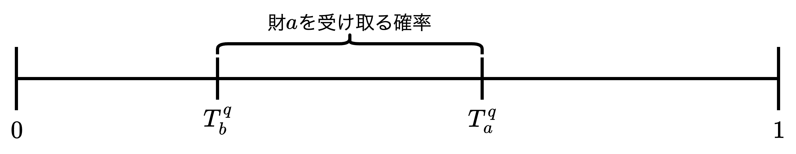

# 大きな市場における割り当て問題

- 前章の7章に引き続き、学生寮や公立学校の入学枠など、1人が高々1つしか欲しがらないものを確率的に割り当てる問題を考える。

## 割り当てメカニズムの不可能性定理

  【<b>割り当てメカニズムの不可能性定理</b>】 
  水平性、順序効率性、対戦略性を満たす確率的割り当てメカニズムは存在しない。
  

  <ul>
    <li>【<b>水平性</b>】同じ選好を申告した人には同じ確率を割り当てる。最低限の公平性の条件。</li>
    <li>【<b>順序効率性</b>】割り当てられた確率を再配分しても、誰にも損させずに誰かを得させることができないくらいに無駄なく割り当てる。事前の効率性の条件</li>
    <li>【<b>耐戦略性</b>】正直に自分の選好を申告することが各個人にとって常に最適になるように割り当てる。利用者にとって制度をわかりやすくするためと、正しい情報を集めて効率性や公平性を満足させやすくするための条件。</li>
  </ul>

- 確率的な割り当てを考える主な理由は「**最低限の公平性**」を満たすためである。1つの入学枠は分割して複数人で分け合うことができない非分割財であるが、確率的な割り当てを行うことであたかも分割財のように扱えるようになり、公平な割り当てが実現しやすくなる。
- 前章の7章では均等確率優先順位メカニズム（RPメカニズム）と同時確率消費メカニズム（PSメカニズム）の2つの代表的な割り当てメカニズムに着目した。
  - 【**RPメカニズム**】各個人に優先順位をランダムに割り振り、優先順位に従って各個人が好きな財を選んでいくと言う非常に直感的な方法。このメカニズムは水平性と耐戦略性を満たすが、順序効率性を満たさない。
  - 【**PSメカニズム**】順序効率性に加え、無羨望性という水平性よりも強い公平性をも満たすメカニズムである。一方で対戦略性を満たさない。
- 上記とは別に順序効率性と対戦略性を満たす割り当てメカニズムとして「**確定的逐次独裁制（Deterministic Serial Dictatorship）**」があるが、最低限の公平性である水平性を満たさないため本書では取り扱わない。本書の割り当て問題ではPSメカニズムとRPメカニズムのうち、どちらのメカニズムを使うのが望ましいのか、それとも他のメカニズムの方が良いのかと言う問題である。

## データを見て考える

- パラグ・パサックの分析によると、多くの学生についてPSメカニズムによる割り当てがRPメカニズムの割り当てを確率指定していた。しかし、実は各学生にとっての非効率性の度合いはとても小さかった。具体的にはPSメカニズムのもとで第1志望の学校に入学できる学生の数は（平均）$5,016$人で、RPメカニズムのもとで第1志望の学校に入学できる学生は$4,999$人とほとんど差がなかった。同様に第2志望、第3志望についてもその差はとても小さいものであった。この結果からRPメカニズムの欠点である非効率性は現実の大きな市場において無視できるものであることが示唆される。
- ただし、この結果は「どちらのアルゴリズムを使っても同じ」ということを意味しているわけではない。PSメカニズムは対戦略性を満たさないので、実際にPSメカニズムを使った際は学生が嘘をつくかも知れず、シミュレーション分析のように効率的な割り当てが本当に行われるかどうかは不明である。このことから、パサックは耐戦略的でほぼ効率的なRPメカニズムの方が効率的でが耐戦略性を満たさないPSメカニズムよりも実用上は優れているのではないかと予想した。
- しかし、問題はまだ残っている。PSメカニズムは確かに対戦略性を満たさないが、大市場において戦略的操作はどれくらい問題になるのかわかっていない。また、上記の分析結果から、大市場においてはPSメカニズムとRPメカニズムの帰結が非常に似ていることがわかる。以降、このことを理論的に解明する。

## 大市場におけるPSメカニズム

- 大市場におけるPSメカニズムの戦略的操作の問題を分析する。ここで、設定を軽くおさらいする。有限人の個人の集合を$N$、有限種類の財の集合を$O$とする。各財$a\in O$の供給数を$q_a\in\mathbb{N}$で表す。つまり、学校$a$の入学枠の数が$q_a$である。各$q_a$も有限であるが、何も財を与えないことを表す財$\emptyset$については無限に供給されるものとする。各財の供給量が市場の規模を表すものとする。各個人は強選好を各学校$a,b,\cdots,\in O$および$\emptyset$上に持つ。個人$i$の選好を表現する期待効用関数を$u_i$とする。

### 小島＝マネアの定理

  【<b>小島＝マネアの定理</b>】 
  任意の個人$i\in N$と任意の期待効用関数$u_i$を固定する。この時、$i$ と $u_i$ だけに依存する $M>0$ が存在して全ての財 $a\in O$について $q_a\geqq M$ ならばPSメカニズムのもとで $i$ にとって自分の選好を正直に申告することが支配戦略になる。つまり、他の個人がどのような申告をしようとも、自分は正直申告をするのが最適になる。この主張、および $M$ の値は参加者の人数には依存しない。

- 上記の定理の興味深い点は各財の供給数が$M$以上でありさえすれば、各個人にとって正直申告が「厳密に」支配戦略となる点である。「虚偽申告によって得ができる確率が極限において0に収束する」のではなく、**ある一定の供給数さえあれば、有限個の財と有限人の個人の市場において正直申告が最適となる**。
- 気をつけないといけないのは、供給数の下限$M$が個人の期待効用関数$u_i$に依存する点である。つまり「各財の供給数が十分に多ければ任意の個人の期待効用関数について正直申告が支配戦略に**なるわけではない**」と言うことに注意が必要である。期待効用関数は選好順序を表現している限り、かなり極端な値を取ることが可能なので、どんな$M$についても何らかの期待効用関数を作って嘘をついた方が得できるようにすることが可能になってしまう。従って「**各$u_i$について$M$が存在する**」という順番が大事である。
- また、このような市場規模に関する定理を解釈する際に気をかけるべきことがある。仮に学生が申告する選好リストの長さを高々10とし、各$j$について第$j$志望の学校$a_j$と第$j+1$志望の学校$a_{j+1}$の期待効用の差$u_i(a_j)-u_i(a_{j+1})$が定数であると仮定すると正直申告が支配戦略となるのは$M=18$程度で十分であると計算できる。つまり、この簡単な家庭のもとでは各学校の入学枠数がたった18以上であればPSメカニズムにおいてインセンティブの問題は無視できてしまうということである。

### 定理の証明とスケッチ

  【<b>小島＝マネアの定理の簡単な照明</b>】 
  まず、PSメカニズムにおいて嘘をつくことは次の2つの効果をもたらす。
  <ul>
    <li>【<b>効果1</b>】嘘をついて財を食べる順番を変えると、自分の好きな財を食べられる量が少なくなる</li>
    <li>【<b>効果2</b>】嘘をついて財を食べる順番を変えると、各財が食べ尽くされるまでの時間（expiration date）に影響を与えることができる</li>
  </ul>
  PSメカニズムのもとでは各個人は各時点で場に残っている財のうち最も好ましいものを食べるが、嘘をつくと各時点で一番好きなものを一旦諦めて別のものを食べることになる。結果的に効果1は嘘をついた人にとって常にマイナスに働き、効果2はプラスに働く。前章で扱った例より、$N=\{1,2,3,4\}$、$O=\{a,b\}$とし、個人の選好を以下のように設定したとき、PSメカニズムの帰結は以下のようになる。財$a$と$b$が食べ尽くされる時間はどちらも$T_a=T_b=\frac{1}{2}$となる。
  $$\begin{align*}
    &【\text{選好}】\hspace{11mm}【PSメカニズムの帰結】\\
    &\begin{align*}
      \succ_1&：a,b,\emptyset\\
      \succ_2&：a,\emptyset\\
      \succ_3&：b,\emptyset\\
      \succ_4&：b,\emptyset\\
    \end{align*}
    \implies
    \begin{align*}
      P&=\left(
        \begin{array}{l}
          \frac{1}{2}\quad     0     \quad\frac{1}{2}\\[2.5mm]
          \frac{1}{2}\quad     0     \quad\frac{1}{2}\\[2.5mm]
               0     \quad\frac{1}{2}\quad\frac{1}{2}\\[2.5mm]
               0     \quad\frac{1}{2}\quad\frac{1}{2}\\[2.5mm]
        \end{array}
      \right)
    \end{align*}
  \end{align*}$$
  ここで個人$1$が嘘をついたケースを考える。この時のPSメカニズムの帰結は以下のようになる。
  $$  \begin{align*}
    【\text{嘘の申告}&\color{red}\succ_1'\color{black}\text{がある場合}】【PSメカニズムの帰結】\\
    &\begin{align*}
      \color{red}\succ_1'&\color{red}：b,a,\emptyset\\
      \succ_2&：a,\emptyset\\
      \succ_3&：b,\emptyset\\
      \succ_4&：b,\emptyset\\
    \end{align*}
    \implies
    \begin{align*}
      P'&=\left(
        \begin{array}{l}
          \frac{1}{3}&\frac{1}{3}&\frac{1}{3}\\[2.5mm]
          \frac{2}{3}&     0     &\frac{1}{3}\\[2.5mm]
               0     &\frac{1}{3}&\frac{2}{3}\\[2.5mm]
               0     &\frac{1}{3}&\frac{2}{3}\\[2.5mm]
        \end{array}
      \right)
    \end{align*}
  \end{align*}$$
  個人$1$は財$b$を先に食べたことから結果的に$a$を食べた量が$\frac{1}{2}\rightarrow\frac{1}{3}$に減っている（【<b>効果1</b>】の影響）。しかし、財$a$が食べ尽くされるまでにの時間は$T_a=\frac{2}{3}$であり、時間が伸びていることがわかる（【<b>効果2</b>】の影響）。個人$1$は財$b$を少し食べつつ、財$a$も食べることができていることから、期待効用の持ち方によってはこのように消費することで得することができる。しかし、財の供給量が増えると【<b>効果2</b>】の影響が【<b>効果1</b>】の影響と比べてとても小さくなっていく。 
  　上記の例で財の供給数と個人の人数をそれぞれ100倍にした大きな市場、つまり財$a,b$の供給はそれぞれ100単位、そして$a,b,\emptyset$の選好を持つ個人と、$b,a,\emptyset$の選好を持つ個人がそれぞれ200人ずついる状況を考える。この時、個人$1$が嘘の申告$b,a,\emptyset$をしたとする。すると先ほどの小さな市場と異なり、$199（200-1）$人もの個人が$a,b,\emptyset$という申告をしているため$a$が食べ尽くされるタイミングは$T_a=\frac{2}{3}$とはならず、元の$T_a=\frac{1}{2}$とほとんど変わらない。このことから嘘をつくことによる【<b>効果2</b>】の影響はほとんどないことがわかる。一方で、食べる順番を変えたことで本当は自分が一番好きな$a$ではなく$b$を食べてしまうという負の効果1は大きな市場でも小さくなっていない。そのため、大きな市場では効果1と2を合わせた効果は嘘の選好を提出した個人にとってより悪いものになっており、市場を十分大きくすれば負の効果2が効果1を凌駕する。
   
【<b>証明終わり</b>】

## PSメカニズムとRPメカニズムの漸近的一致

### チェ＝小島の定理

  【<b>チェ＝小島の定理</b>】 
  それぞれの財が$q$個供給される市場（$q-$市場）において、RPメカニズムのもとで選好 $\pi$ を持つ個人が財 $a$ をもらう確率を $RP_a^q(\pi)$、PSメカニズムのもとで選好 $\pi$ を持つ個人が財 $a$ をもらう確率を $PS_a^q(\pi)$ とする。この時、財の種類 $O$ を固定し、全ての財 $a\in O$ と全ての個人の選好 $\pi$ について以下が成立する。
  $$\lim_{q\rightarrow\infty}\left|RP_a^q(\pi)-PS_a^q(\pi)\right|=0$$

- 上記の定理より、2つのメカニズムの帰結の差$\left|RP_a^q(\pi)-PS_a^q(\pi)\right|$が0に近づいていくならば、これら2つのメカニズムは大きな市場では非常に似た確率的割り当てを与えることになる。

### 定理の証明のスケッチ

  【<b>チェ＝小島の定理の簡単な照明</b>】 
  PSメカニズムが与える割り当ては各財が食べ尽くされるまでの時間によって特徴づけることができる。各$q-$市場において各財$a\in O$が食べ尽くされる時間を$T_a^q$とする。例えば、個人$i$は財$b$が1番好きで、2番目に$a$が好きだと申告したとすると個人$i$が財$a$をもらえる確率は$T_a^q-T_b^q$となる。一般に$q-$市場においてPSメカニズムのもとで個人が財$a$をもらえる確率は以下の式で与えられる。
  $$\max\{T_a^q-\max\{T_b^q|b\text{は}a\text{より好まれる}\},0\}$$
  次にRPメカニズムによる割り当てを考える。今PSメカニズムによる割り当てを$T_a^q$を使って表現したが2つのメカニズムの割り当てがにていることを示すためにRPメカニズムの割り当ても「財が食べ尽くされる時間」と似たような概念で表現する。まずRPメカニズムを次のように表現し直す。
  <ul>
    <li>優先順位を決めるくじを$[0,1]$区間の一様分布で作る。各個人に$[0,1]$区間上の数をランダムに与える。</li>
    <li>与えられた数が小さい人から順にその場に残っている財の中で一番好きなものを選んでいく。ここで、くじは$[0,1]$上の一様分布であり、2人以上が完全に同じ数を引き当てる確率は0であることから優先順位は確率1で同順位を含まない形で決定できることになる。</li>
  </ul>
  　このようなくじを考えても$n$人の個人があれば$n!$通りの順序が均等な確率で得られる。次に$q-$市場において申告された選考とくじの結果を所与として個人$i$が財$a$を選ぶことができるような最大のくじの数を$\widehat{T}_a^q$と書く。つまり、個人$i$が引いたくじの数字を$x$とすると以下のように場合分けできる。
  <ul>
    <li>【$x<\widehat{T}_a^q$】財$a$がまだ余っているため$a$を選ぶことができる。</li>
    <li>【$x=\widehat{T}_a^q$】その場に残った最後の$a$を選ぶことができる</li>
    <li>【$x>\widehat{T}_a^q$】他の誰かに全ての財$a$が取られてしまっているため$a$を選ぶことができない。</li>
  </ul>
  　先ほどと同様に個人$i$は財$b$が1番好きで2番目に財$a$が好きだと申告したとして、 $\widehat{T}_a^q>\widehat{T}_b^q$ だとすると、今、くじは一様に分布しているためその確率は上図のように $\widehat{T}_a^q-\widehat{T}_b^q$ で与えられる。 
  　PSメカニズムでは$[0,1]$区間上の数はメカニズムの進行時間または各個人に割り当てられる確率を表していたが、ここでの区間$[0,1]$上の数はくじの番号を表していることに注意すると、一般に$q-$市場においてRPメカニズムのもとで個人が財$a$をもらえる確率は期待値$E$を用いて以下のように与えられる。
  $$E\left[\max\{\widehat{T}_a^q-\max\{\widehat{T}_b^q|b\text{は}a\text{より好まれる}\},0\}\right]$$
  先ほどの式と見比べると形式的にはPSメカニズムによる割り当てとRPメカニズムによる割り当てをとても似た形で表現することができた。しかし、一般には「財が食べ尽くされてしまう時間$T_a^q$」と「財が取り尽くされてしまう番号$\widehat{T}_a^q$」は異なる。
  <ul>
    <li>【$T_a^q$】各タイプのに員数日によって<b>決定論的に確定する</b>。</li>
    <li>【$\widehat{T}_a^q$】個人の好みとは<b>無関係に定まる</b>くじ番号によって左右される。</li>
  </ul>
  上記のように$T_a^q$と$\widehat{T}_a^q$は異なるが、各財の供給数$q$と各個人の人数が増えると、大数の法則より、大規模な$q-$市場では$\widehat{T}_a^q$は$T_a^q$に近づく。そのためにPSメカニズムによる割り当てとRPメカニズムの割り当てが似てくる。
   
【<b>証明終わり</b>】

### 近似的・漸近的性質を論じることの重要性

- チェ＝小島の定理は$q\rightarrow\infty$の極限において2つのメカニズムの帰結が一致すると述べているが、有限な$q-$市場においては厳密には一致しない。つまり、どんなに大きな$q-$市場を考えても一般にRPメカニズムはPSメカニズムとは異なる割り当てになり、順序効率的も満たさない。
- このことから次の帰結を得る。もし$q=1$の市場でRPメカニズムが与える割り当てが順序効率的でないならば、任意の有限の大きさ$q-$市場においてRPメカニズムが与える割り当ては順序効率的ではない。また、もし$q=1$の市場でRPメカニズムが与える割り当てが順序効率的ならば任意の有限の大きさの$q-$市場においてRPメカニズムが与える割り当ては順序効率的である。
- 上記の帰結について、市場規模が大きくなるにつれてRPメカニズムの非効率性の度合いが**徐々に小さくなっていく**という点を無視している。このように二項対立に基づき「順序効率的か、そうでないか」という評価基準を用いるとRPメカニズムはどのような有限な市場においても順序効率性を満たすことができない可能性があるため、その漸近的な性質を論じることができずメカニズムの大事な側面を見逃してしまう。

## 終わりに

- 本章ではRPメカニズムとPSメカニズムの性質を分析した。理論的には水平性・順序効率性・耐戦略性、を全て満たす理想的なメカニズムは存在しないという不可能性があるが、現実にニューヨーク市などで行われている学校選択制どのように大規模な割り当て問題ではRPメカニズムとPSメカニズムが漸近的に一致するため、RPメカニズムとPSメカニズムはこれら全ての望ましい性質を近似的に満たすことがわかった。
- 次の9章では、RPメカニズムとPSメカニズムによって決まる確率的な割り当てを実際に遂行する手続きについて考察する。また、現実の学校選択問題では男女や人種のバランスなど様々な制約を考慮する必要がある。複雑な制約条件がある場合にどのように学生と学校とを割り当てれば良いのか考えていく。

#### 参考文献

<ol class="brackets">
  <li>Bogomolnaia, Anna and Herve Moulin (2001) "A New Solution to the Random Assignment Problem," <i>Journal of Economic Theory</i>, 100(2), pp.295-328.</li>
  <li>Che, Yeon-Koo and Fuhito Kojima (2010) "Asymptotic Equivalence of Probabilistic Serial and Random Priority Mechanisms," <i>Econometrica</i>, 78(5), pp.1625-1672.</li>
  <li>Kojima, Fuhito and Mihai Manea (2010) "Incentives in the Probabilistic Serial Mechanism," <i>Journal of Economic Theory</i>, 145(1), pp.106-123.</li>
  <li>Li, Shengwu (2017) "Obviously Strategy-Proof Mechanisms," <i>American Economic Review</i>, 107(11), pp.3257-3287.</li>
  <li>Pathak, Parag A. (2006) "Lotteries in Student Assignment," <i>unpublished manuscript</i>, Harvard University.</li>
  <li>Rees-Jones, Alex (2018) "Suboptimal Behavior in Strategy-Proof Mechanisms: Evidence from the Residency Match," <i>Games and Economic Behavior</i>, 108, pp.317-330.</li>
</ol>