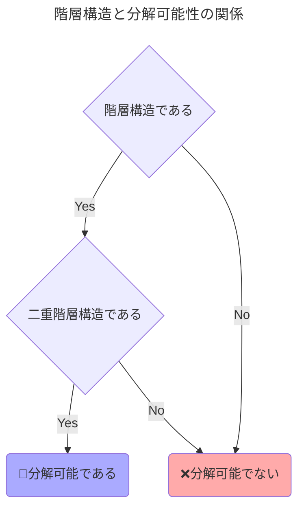

# 実際に確率的に割り当てる方法を考える

## バーコフ＝フォン・ノイマンの定理

$$
\begin{align*}
  P&=\left(
    \begin{array}{l}
      \displaystyle\frac{1}{6}&\displaystyle\frac{1}{3}&\displaystyle\frac{1}{2}\\[2.5mm]
      \displaystyle\frac{1}{3}&\displaystyle\frac{2}{3}&\displaystyle     0     \\[2.5mm]
      \displaystyle\frac{1}{2}&\displaystyle     0     &\displaystyle\frac{1}{2}
    \end{array}
  \right)
\end{align*}
$$

- 第8章までは割り当てメカニズムの性能を比較するために「**誰が、何を、どれくらいの確率で獲得できるか**」を並べた行列（**確率行列**）に着目してきた。しかし、確率行列だけでは「**実際にどうやって割り当てを行うか**」がわからない。そこで上の割り当て$P$を用いて以降具体的に考える。

### 確率行列を分解する

$$
\left(
  \begin{array}{l}
    \displaystyle\frac{1}{6}&\displaystyle\frac{1}{3}&\displaystyle\frac{1}{2}\\[2.5mm]
    \displaystyle\frac{1}{3}&\displaystyle\frac{2}{3}&\displaystyle     0     \\[2.5mm]
    \displaystyle\frac{1}{2}&\displaystyle     0     &\displaystyle\frac{1}{2}
  \end{array}
\right)
=\frac{1}{6}
\left(
  \begin{array}{l}
    1& 0& 0\\
    0& 1& 0\\
    0& 0& 1
  \end{array}
\right)
+\frac{1}{3}
\left(
  \begin{array}{l}
    0& 1& 0\\
    1& 0& 0\\
    0& 0& 1
  \end{array}
\right)
+\frac{1}{2}
\left(
  \begin{array}{l}
    0& 0& 1\\
    0& 1& 0\\
    1& 0& 0
  \end{array}
\right)
$$

- 確率行列を上式のように分解できれば割り当ての実現方法が見えてくる。上式は左辺の確率行列が3つのシンプルな行列の加重和で表現できることを示している。そして、**右辺の第1項の行列は「財$a$を個人$1$に、財$b$を個人$2$に、財$c$を個人$3$に確率1で与える」ことを意味していると解釈できる**。つまり、確定的な割り当てを表す行列である。右辺の第2項、第3項の行列もそれぞれ同様である。
- 上式の分解から以下の解釈が可能になる。
  - 確率$\frac{1}{6}$で第1項の確定的な割り当てを選ぶ
  - 確率$\frac{1}{3}$で第2項の確定的な割り当てを選ぶ
  - 確率$\frac{1}{2}$で第3項の確定的な割り当てを選ぶ

### バーコフ＝フォン・ノイマンの定理

  【<b>バーコフ＝フォン・ノイマンの定理</b>】 
  どんな二重確率行列（すべての成分が非負の実数であり、かつ、すべての行の和とすべての列の和がそれぞれ \(1\) になる正方行列）も置換行列の凸結合で表現できる。

$$
【\text{二重確率行列→凸結合・置換行列の変換}】\\
\left(
  \begin{array}{l}
    \displaystyle\frac{1}{6}&\displaystyle\frac{1}{3}&\displaystyle\frac{1}{2}\\[2.5mm]
    \displaystyle\frac{1}{3}&\displaystyle\frac{2}{3}&\displaystyle     0     \\[2.5mm]
    \displaystyle\frac{1}{2}&\displaystyle     0     &\displaystyle\frac{1}{2}
  \end{array}
\right)
=\frac{1}{6}
\left(
  \begin{array}{l}
    1& 0& 0\\
    0& 1& 0\\
    0& 0& 1
  \end{array}
\right)
+\frac{1}{3}
\left(
  \begin{array}{l}
    0& 1& 0\\
    1& 0& 0\\
    0& 0& 1
  \end{array}
\right)
+\frac{1}{2}
\left(
  \begin{array}{l}
    0& 0& 1\\
    0& 1& 0\\
    1& 0& 0
  \end{array}
\right)
$$

- 先ほどの確率行列の分解について、$n$人の個人に$n$種類の財をちょうど1つずつランダムに割り当てる問題を考える。まずは準備として以下の用語を用いる。
  - 【**確率行列**】各要素が非負で，各行の和が1であるような行列
  - 【**二重確率行列**】各要素が非負で，各行・各列の和が1であるような行列
  - 【**置換行列**】各行・各列に1が1つありそれ以外の要素は0であるような行列（二重確率行列の特別なケース）
  - 【**凸結合**】ウェイト（上式右辺の$\frac{1}{6}$や$\frac{1}{3}$など）が非負で和が1であるような重みつき和
- 以上を踏まえ、上式右辺は各ウェイトがそれぞれの確定的な割り当てが起こる確率を表していると解釈でき、「**もし二重確率行列が置換行列の凸結合で表現できれば具体的な割り当て方がわかる**」ことを意味する。この問題を解決する方法がバーコフ＝フォン・ノイマンの定理である。

### 定理の証明

  【<b>補題</b>】 
  置換行列以外の任意の二重確率行列$P$は次の条件を満たす二重確率行列$P^1$と$P^2$の凸結合に分解できる。
  $$【\text{凸結合}】P=\lambda P^1+(1-\lambda)P^2$$
  <ul>
    <li>【<b>条件1</b>】もし$P_{ix}$が整数なら$P_{ix}^1$と$P_{ix}^2$も整数である</li>
    <li>【<b>条件2</b>】$P^1$と$P^2$は$P$よりも厳密に多くの整数の要素を持つ</li>
  </ul>

$$
P=\left(
  \begin{array}{l}
    1/6 & 1/3 & 1/2 \\
    1/3 & 2/3 &  0  \\
    1/2 &  0  & 1/2
  \end{array}
\right)
$$

- 本節では、上記の補題と二重確率行列を例として、凸結合の置換行列変換を行う。

#### 【ステップ1】

1. 二重確率行列$P$の要素のうち0でも1でもない要素を⚪で囲む。今回の例では$P_{1c}=\frac{1}{2}$に⚪を付ける。$P$は置換行列ではないので少なくとも1つは0でも1でもない要素が存在するはずである。

1. 次に⚪をつけた要素から横方向（右でも左でも良い）に出発し、その行き先で最も近くにある0でも1でもない要素を□で囲む。今回の例では$P_{1b}=\frac{1}{3}$に□をつける。P$は二重確率行列なので⚪をつけた要素がある行にはやはり0でも1でもない要素が必ずあるはずである。そうでなければ和が1にならない。

1. 次に、□をつけた要素から縦方向（上でも下でも良い）に出発して0でも1でもない要素にたどり着いたら⚪をつける。今回の例では$P_{2b}=\frac{2}{3}$に⚪を付ける。

1. 次に⚪をつけた要素から横方向（右でも左でも良い）に進み、同じことを交互に繰り返し、サイクルが生じるまで続ける。今回の例では$P_{2a}=\frac{1}{3}$に□をつけ、$P_{3a}=\frac{1}{2}$に⚪を付け、$P_{3c}=\frac{1}{2}$に□をつける。

1. これで、各行と各列に⚪と□が同数ずつ存在するサイクルを見つけることができた。今回の例では、$\color{red}P_{1c}(=1/2)\color{black}\rightarrow P_{1b}(=1/3)\rightarrow P_{2b}(=2/3)\rightarrow P_{2a}(=1/3)\rightarrow P_{3a}(=1/2)\rightarrow P_{3c}(=1/2)\rightarrow\color{red}P_{1c}(=1/2)$のサイクルになる。

#### 【ステップ2】

1. ⚪をつけた数から何らかの数$x$を引いて、□をつけた数に同じ数$x$を足す。これにより各行と各列の和は変わらず1のままである。ここで、$x$の値は⚪をつけた数のうち、最小の数を割り当てる。□をつけた数にこうして選んだ$x$を足して1を超える場合は□をつけた数から最大の数を$x$に割り当てる。今回の例では$x=\frac{1}{2}$となる。こうして得られた行列を$P^1$とする。
$$
\left(
  \begin{array}{l}
    \displaystyle\frac{1}{6}&\displaystyle\frac{1}{3}+\frac{1}{2}&\displaystyle\frac{1}{2}-\frac{1}{2}\\[2.5mm]
    \displaystyle\frac{1}{3}+\frac{1}{2}&\displaystyle\frac{2}{3}-\frac{1}{2}&     0     \\[2.5mm]
    \displaystyle\frac{1}{2}-\frac{1}{2}&     0     &\displaystyle\frac{1}{2}+\frac{1}{2}
  \end{array}
\right)
=\left(
  \begin{array}{l}
    \displaystyle\frac{1}{6}&\displaystyle\frac{5}{6}&\displaystyle 0\\[2.5mm]
    \displaystyle\frac{5}{6}&\displaystyle\frac{1}{6}& 0 \\[2.5mm]
    0  &     0     &1
  \end{array}
\right)
=P^1
$$
1. 今度は□から適当な数$y$を引いて、⚪に同じ数を足す。ここでも前のステップと同じ形式で適当な数$y$を割り当てる。今回の例では$y=\frac{1}{3}$となる。こうして得られた行列を$P^2$とする。
$$
\left(
  \begin{array}{l}
    \displaystyle\frac{1}{6}&\displaystyle\frac{1}{3}-\frac{1}{3}&\displaystyle\frac{1}{2}+\frac{1}{3}\\[2.5mm]
    \displaystyle\frac{1}{3}-\frac{1}{3}&\displaystyle\frac{2}{3}+\frac{1}{3}&     0     \\[2.5mm]
    \displaystyle\frac{1}{2}+\frac{1}{3}&     0     &\displaystyle\frac{1}{2}-\frac{1}{3}
  \end{array}
\right)
=\left(
  \begin{array}{l}
    \displaystyle\frac{1}{6}&\displaystyle 0&\displaystyle\frac{5}{6}\\[2.5mm]
    0 & 1 & 0 \\[2.5mm]
    \displaystyle\frac{5}{6} & 0 & \displaystyle\frac{1}{6}
  \end{array}
\right)
=P^2
$$
1. 凸結合のウェイト$\lambda$を求める。今$P^1$の要素は$\frac{1}{2}$だけ増減し、$P^2$の要素は$\frac{1}{3}$だけ増減した。これらの増減を打ち消すために$P^1$を$\frac{2}{5}$倍し、$P^2$を$\frac{3}{5}$倍して足し合わせる。

$$
P=\frac{2}{5}P^1+\frac{3}{5}P^2
=\frac{2}{5}
\left(
  \begin{array}{l}
    \displaystyle\frac{1}{6}&\displaystyle\frac{5}{6}&\displaystyle     0     \\[2.5mm]
    \displaystyle\frac{5}{6}&\displaystyle\frac{1}{6}&\displaystyle     0     \\[2.5mm]
    \displaystyle     0     &\displaystyle     0     &\displaystyle     1     
  \end{array}
\right)
+\frac{3}{5}
\left(
  \begin{array}{l}
    \displaystyle\frac{1}{6}&     0     &\displaystyle\frac{5}{6}\\[2.5mm]
    \displaystyle     0     &     1     &     0     \\[2.5mm]
    \displaystyle\frac{5}{6}&     0     &\displaystyle\frac{1}{6}
  \end{array}
\right)
$$

#### 【ステップ3】

1. $P^1$はまだ置換行列ではないため、ステップ2と同じ操作を$P^1$に対しても行う。$P_{1b}=5/6$に⚪をつけて、これを始点とすると、$\color{red}P_{1b}(=5/6)\color{black}\rightarrow P_{1a}(=1/6)\rightarrow P_{2a}(=5/6)\rightarrow P_{2b}(=1/6)\rightarrow\color{red}P_{1b}(=5/6)$というサイクルが出来上がる。

1. ⚪に$\frac{1}{6}$を足し、□から$\frac{1}{6}$を引く。こうして得られる行列を$P^3$とする。
$$
\left(
  \begin{array}{l}
    \displaystyle\frac{1}{6}-\frac{1}{6}& \displaystyle\frac{5}{6}+\frac{1}{6} & 0\\[2.5mm]
    \displaystyle\frac{5}{6}+\frac{1}{6} & \displaystyle\frac{1}{6}-\frac{1}{6} & 0\\[2.5mm]
    0 & 0 & 1
  \end{array}
\right)
=\left(
  \begin{array}{l}
    0& 1& 0\\
    1& 0& 0\\
    0& 0& 1\\
  \end{array}
\right)
=P^3
$$
1. また、□に$\frac{1}{6}$を足し、⚪から$\frac{1}{6}$を引く。こうして得られる行列を$P^4$とする。
$$
\left(
  \begin{array}{l}
    \displaystyle\frac{1}{6}+\frac{5}{6}& \displaystyle\frac{5}{6}-\frac{5}{6} & 0\\[2.5mm]
    \displaystyle\frac{5}{6}-\frac{5}{6} & \displaystyle\frac{1}{6}+\frac{5}{6} & 0\\[2.5mm]
    0 & 0 & 1
  \end{array}
\right)
=\left(
  \begin{array}{l}
    1& 0& 0\\
    0& 1& 0\\
    0& 0& 1\\
  \end{array}
\right)
=P^4
$$
1. $P^3$と$P^4$を用いて$P^1$を表現するための凸結合のウェイト$\lambda$を求める。$P^3$を$\frac{5}{6}$倍し、$P^4$を$\frac{1}{6}$倍して足し合わせることで求められる。
$$
P^1=\frac{5}{6}P^3+\frac{1}{6}P^4
=\frac{5}{6}
\left(
  \begin{array}{l}
    0& 1& 0\\
    1& 0& 0\\
    0& 0& 1\\
  \end{array}
\right)
+\frac{1}{6}
\left(
  \begin{array}{l}
    1& 0& 0\\
    0& 1& 0\\
    0& 0& 1\\
  \end{array}
\right)
$$

1. 次に、$P^2$もステップ2と同じ操作を行う。$P_{1c}=5/6$に⚪をつけて、これを始点とすると、$\color{red}P_{1c}(=5/6)\color{black}\rightarrow P_{1a}(=1/6)\rightarrow P_{3a}(=5/6)\rightarrow P_{3c}(=1/6)\rightarrow\color{red}P_{1c}(=5/6)$というサイクルが出来上がる。

1. ⚪に$\frac{1}{6}$を足し、□から$\frac{1}{6}$を引く。こうして得られる行列を$P^3$とする。
$$
\left(
  \begin{array}{l}
    \displaystyle\frac{1}{6}-\frac{1}{6} & 0 & \displaystyle\frac{5}{6}+\frac{1}{6} \\[2.5mm]
    0 & 1 & 0 \\[2.5mm]
    \displaystyle\frac{5}{6}+\frac{1}{6} & 0 & \displaystyle\frac{1}{6}-\frac{1}{6}
  \end{array}
\right)
=\left(
  \begin{array}{l}
    0& 0& 1\\
    0& 1& 0\\
    1& 0& 0\\
  \end{array}
\right)
=P^5
$$
1. また、□に$\frac{1}{6}$を足し、⚪から$\frac{1}{6}$を引く。ここで得られる行列は先ほどの$P^4$と同じになる。
$$
\left(
  \begin{array}{l}
    \displaystyle\frac{1}{6}+\frac{5}{6}& \displaystyle\frac{5}{6}-\frac{5}{6} & 0\\[2.5mm]
    \displaystyle\frac{5}{6}-\frac{5}{6} & \displaystyle\frac{1}{6}+\frac{5}{6} & 0\\[2.5mm]
    0 & 0 & 1
  \end{array}
\right)
=\left(
  \begin{array}{l}
    1& 0& 0\\
    0& 1& 0\\
    0& 0& 1\\
  \end{array}
\right)
=P^4
$$
1. $P^4$と$P^5$を用いて$P^2$を表現するための凸結合のウェイト$\lambda$を求める。$P^4$を$\frac{1}{6}$倍し、$P^5$を$\frac{5}{6}$倍して足し合わせることで求められる。
$$
P^2=\frac{1}{6}P^4+\frac{5}{6}P^5
=\frac{1}{6}
\left(
  \begin{array}{l}
    1& 0& 0\\
    0& 1& 0\\
    0& 0& 1\\
  \end{array}
\right)
+\frac{1}{6}
\left(
  \begin{array}{l}
    0& 0& 1\\
    0& 1& 0\\
    1& 0& 0\\
  \end{array}
\right)
$$

1. 最後に、二重確率行列$P$を上記の$P^3、P^4、P^5$を用いて凸結合の置換行列に分解する。
$$
\begin{align*}
  P&=\frac{2}{5}P^1+\left(1-\frac{2}{5}\right)P^2\\
  &=\frac{2}{5}\left(\frac{5}{6}P^3+\frac{1}{6}P^4+\right)+\frac{3}{5}\left(\frac{1}{6}P^4+\frac{5}{6}P^5\right)\\
  &=\color{red}\underline{\frac{1}{6}P^4+\frac{1}{3}P^3+\frac{1}{2}P^5}
\end{align*}
$$

- 以上の結果を踏まえ、$n$人$n$財の各財の供給数が$1$で各個人への割り当てもちょうど1つというシンプルなケースではPSメカニズムの望ましい確率行列を$"$実現$"$する手続きが存在することが保証され、しかも簡単に見つけることができることを確認した。

#### 注意点

- 【**注意点1：分解結果の複数性**】分解アルゴリズムの手順からわかるように二重確率行列を置換行列の凸結合で表す方法は複数あり得る。しかし今回扱った$P$はたまたま1通りしか分解できなかっただけである。
- 【**注意点2：アルゴリズムの計算量**】$n\times n$の行列を置換行列に分解するにはかなりの計算量を必要とするように見えるが、割り当てを実現するだけならあまり時間はかからない。というのも最初に補題を適用して$P^1$と$P^2$に分解し、くじを使って$P^1$か$P^2$を選び、もし$P^1$が選ばれたら$P^2$の方は無視できるからである。$P^1$が選ばれた場合も同様に$P^1$を$P^3$と$P^4$に分解し、くじを使い、もし$P^4$が選ばれたら$P^3$の方を無視して分解作業を続けることができる。分解のたびに少なくとも1つの整数の要素が増えるので多く見積もっても$n\times n=n^2$のステップ数で全てが整数である置換行列（**確定的な割り当て**）にたどり着くことが可能である。$n^2$というステップ数であればコンピュータを使えばかなり大きな$n$であっても現実的な時間で計算を完了できる。
【※】完全に分解する最悪のケースで$2^{n^2}$という規模の時間がかかる。この場合、$n$の増加に対して計算量が爆発的に増加してしまうので計算困難である。ただし、この計算量は今回紹介した方法に依存しており、もっと計算量の小さい方法も知られている。

## 割り当て問題の一般化

- 前述の通り、シンプルなケースでは帰結を二重確率行列で表せることを確認したが、一般に行列が正方行列であるとは限らず、そして行列の縦方向の和が1である（**二重確率行列である**）とは限らない。これを現実問題に置き換えると、入学者数と学校の数は同じではなく、各学校の入学枠（供給数）が1つしかないこともまずない。
- 供給される財の数や1人がもらえる財の数を増やすような拡張は比較的簡単に処理できる問題であるが現実の制度を観察するとこれまで考えてこなかった複雑な制約が多数ある。本節では、その複雑な制約の例をいくつか紹介する。

### 複雑な制約構造

$$
\bold{【部分列制約の例】}\text{\color{red}赤枠内\color{black}の和が100以下かつ\color{blue}青枠内\color{black}の和が70以下}\\
\begin{pmatrix}
  \begin{array}{c} P_{1a} \\ P_{2a} \\ \vdots \\ P_{na} \end{array} &
  \begin{array}{c} P_{1b} \\ P_{2b} \\ \vdots \\ P_{nb} \end{array} &
  \fcolorbox{black}{#faa}{$
    \begin{array}{c} 
      \fcolorbox{black}{#aaf}{$\begin{array}{c}
        P_{1c} \\ P_{2c} \\ \vdots
      \end{array}$}\\
      P_{nc} 
    \end{array}
  $} &
  \begin{array}{c} P_{1x} \\ P_{2x} \\ \vdots \\ P_{nx} \end{array}
\end{pmatrix}
$$
$$
\bold{【複数列制約の例】}\text{\color{red}赤枠内\color{black}の和が150以下かつそれぞれの\color{blue}青枠内\color{black}の和が100以下}\\
\begin{pmatrix}
  % 1列目
  \begin{array}{c} P_{1a} \\ P_{2a} \\ \vdots \\ P_{na} \end{array} &

  % 2列目と3列目
  \fcolorbox{black}{#faa}{$  
    % 2列目
    \begin{array}{c}
      \fcolorbox{black}{#aaf}{$\begin{array}{c}
        P_{1b} \\ P_{2b} \\ \vdots \\ P_{nb} 
      \end{array}$}
    \end{array}
    % 3列目
    \begin{array}{c}
      \fcolorbox{black}{#aaf}{$\begin{array}{c}
        P_{1c} \\ P_{2c} \\ \vdots \\ P_{nc} 
      \end{array}$}
    \end{array}
  $}
  
  % n列目
  \begin{array}{c} P_{1x} \\ P_{2x} \\ \vdots \\ P_{nx} \end{array}
\end{pmatrix}
$$

- 現実の割り当て問題でしばしば観察される、さまざまな制約構造をいくつか例示する。
- 【**部分列制約**】学校選択問題では特定のグループの入学者数に上限を設けることがある。例えば、全体の入学枠は100でも、その地域で多数派を占める人種はそのうち70人までしか入学できないと言った制約が設けられている場合がある。特に人種や出自などを理由に入学が不利になっていると考えられる集団を優遇する措置のことをアファーマティブ・アクションと呼ぶ。他にも学区外からの入学者数を制限し、学区内からの入学者を優遇することもある。つまり、各列の総和に制約があるだけでなく、各列の内部にも制約があるケースである。
- 【**複数列制約**】1つの大学における学生と学科（経済学科と経営学科など）の割り当て問題で、2つの学科の入学枠はそれぞれ100ずつあるとする。しかし、その2つの学科は同じ建物を使用しており、合わせて150人までしか入学できないというケースがある。つまり、各列について制約があるだけでなく、複数の列にまたがった制約もある。
- 【**不等式制約**】学校選択問題においては常に「$入学者数=入学定員$」とする必要はなく、「$入学者数\leqq 入学定員$」であれば良い。つまり、行列の縦の和がちょうど定員$q$である」という制約ではうく「縦の和が$q$以下である」という不等式の制約を考える必要がある。
- 【**部分行制約**】学生と授業の割り当て問題で学生は1年間に30科目まで履修できるが、そのうち教養科目は15科目までしか履修できないという制約が考えられる。つまり、各行の総和だけでなく、各行の内部にも制約があるケースである。

### モデル

$$
【期待行列】\\[1mm]
P=\left(
  \begin{array}{c}
    2 & -2 & 1.5 & 0 \\
    1.7 & 4 & -2.2 & 1 \\
    3.1 & 0.36 & -0.8 & -2 \\
  \end{array}
\right)
$$

- この問題を考えたエリック・ブディッシュらの論文に従って分析を進める（Budish, Che, Kojima, and Milgrom 2013）。個人の集合$N$と財の集合$O$を用いて一般的な割り当て問題の帰結を$P=(P_{ia})\in\mathbb{R}^{N\times O}$と表す。
- また、これまでの確率行列とは異なり、上のような行列$P$も考えられる。負の数は「すでに持っているものを手放す」ことを意味し、例えば、部屋の交換問題で今住んでいる部屋を誰かに渡すことなどを表す。$P_{ia}$は個人$i\in N$がもらえる財$a\in O$の個数の期待値であると解釈する。従ってこれからは$P$のことを**期待行列（Expected Matrix）** と呼び、また、すべての要素が整数である行列を**整数行列（Integer-valued Matrix）** と呼ぶ。これが確定的な割り当てを表す行列であり、確率行列の時とは異なり整数は0か1であるとは限らない。
- ここでの目標は「**与えられた制約を満たす期待行列$P$を与えられた制約を満たす整数行列の凸結合で表現すること**」とする。

#### 数学的記号の導入

$$
【\text{制約構造 }\mathcal{H}\text{ と制約集合 }S】\\
S\in\mathcal{H}\subseteq 2^{N\times O}\\[3mm]
【\text{制約ベクトル }\bold{q}\text{、下限制約 }\underline{q}_S\text{、上限制約 }\bar{q}_S】\\
\bold{q}=(\underline{q}_S,\;\bar{q}_S)_{S\in \mathcal{H}}
$$

- 前述の通り、ここでの目標は「**与えられた制約を満たす期待行列$P$を与えられた制約を満たす整数行列の凸結合で表現すること**」である。そのために数学的記号をいくつか導入する。
- 上記の制約構造$\mathcal{H}$と制約集合$S$の関係を説明する。$\mathcal{H}$は個人と財のペア$(i,a)$が入っている集合$N\times O$に含まれるすべての部分集合を集めた集合$2^{N\times O}$のうちの何らかの部分集合を表す。$S$は$\mathcal{H}$の要素である。
- 各$S\in\mathcal{H}$には下限制約 $\underline{q}_S$ と上限制約 $\bar{q}_S$ があり、どちらも整数であるものとする。
- 制約構造$\mathcal{H}$に含まれるすべての制約集合$S$の下限制約と上限制約を集めたものを**制約ベクトル（vector of quotas）** と呼び、$\bold{q}=(\underline{q}_S,\;\bar{q}_S)_{S\in \mathcal{H}}$のように表現する。
- 制約構造$\mathcal{H}$を所与として期待行列$P$が**制約ベクトル$\bold{q}$を満たす（feasible under $\bold{q}$）** とはすべての制約集合$S\in \mathcal{H}$について以下の条件を満たすことを言う。
$$\underline{q}_S\leqq\sum_{(i,a)\in S}P_{ia}\leqq\bar{q}_S\quad\forall S\in\mathcal{H}$$
- さらに制約構造$\mathcal{H}$を所与として制約ベクトル$\bold{q}$を満たす期待行列$P$が$\bold{q}$を満たす整数行列の凸結合で表現できる時、$P$は<b>$\bold{q}$のもとで実現可能（implementable under $\bold{q}$）</b> であると言い、数式だと下式のように表現できる。そしてこの時、制約構造$\mathcal{H}$は<b>分解可能（universally decomposable）</b>であると言う。
$$P=\sum_{k=1}^K\lambda^kP^k$$
  - 【**条件1**】各$P^k$は整数行列であり、制約ベクトル$\bold{q}$を満たす。
  - 【**条件2**】各$\lambda^k$は$0\leqq\lambda^k\leqq 1$であり、$\sum_{k=1}^K\lambda^k=1$を満たす。
- 以上のことから、制約構造が分解可能であるとは、**どんな数量的な制約$\bold{q}$に対しても期待行列を整数行列の凸結合で表現できる**と言うことを意味する。

#### 制約構造の例

$$
【\text{制約条件の期待行列例}】\\
P=\left(
  \begin{array}{c}
    0.5 & 0.2 & 0.3 \\
    0.5 & 0.5 & 0 \\
    0.8 & 0 & 0.2 \\
    0.2 & 0.3 & 0.5
  \end{array}
\right)\\[5mm]
【\text{期待行列}\rightarrow\text{凸結合の整数行列の分解}】\\
P=
\frac{1}{2}\left(
  \begin{array}{c}
    1 & 0 & 0 \\
    0 & 1 & 0 \\
    1 & 0 & 0 \\
    0 & 0 & 1
  \end{array}
\right)+
\frac{3}{10}\left(
  \begin{array}{c}
    0 & 0 & 1 \\
    1 & 0 & 0 \\
    1 & 0 & 0 \\
    0 & 1 & 0
  \end{array}
\right)+
\frac{1}{5}\left(
  \begin{array}{c}
    0 & 1 & 0 \\
    1 & 0 & 0 \\
    0 & 0 & 1 \\
    1 & 0 & 0
  \end{array}
\right)\\[5mm]
【\text{制約集合}SとS'】\\
\begin{align*}
  S&=\{(1,a),\;(2,a)\}&\underline{q}_S=\bar{q}_S=1\\
  S'&=\{(1,a),\;(2,a),\;(3,a),\;(4,a)\}&\underline{q}_{S'}=\bar{q}_{S'}=2\\  
\end{align*}
$$

- 個人の集合と財の集合をそれぞれ$N=\{1,2,3,4\}$と$O=\{a,b,c\}$とする。財$a$の供給数は2、そのほかの財（$b,c$）の供給数は1とし。各個人は高々1つしか財をもらえないものとする。
- 制約条件として、「財$a$は個人1と2のどちらか一方だけが必ずもらえる」という制約があるとし、$P_{1a}+P_{2a}=1$を満たす。上の期待行列$P$はこの制約条件を満たし、さらにこの制約を満たす整数行列の凸結合で表現可能である。

### 階層構造と分解可能定理

- ほとんどの割り当て問題において、制約構造が分解可能であるための必要十分条件がある。具体的には二重階層構造を満たす制約構造$\mathcal{H}$は分解可能である。
- 本節では、まず階層構造と二重階層構造の説明をし、その後、制約構造が**分解できる条件**と**分解できない条件**を紹介する。

#### 階層構造（Hierarchy）と二重階層構造（Bihierarchy）の定義

$$
【\bold{階層構造の定義とその例}】\\
S\cap S'=\emptyset\;または\;S\subseteq S'\;または\;S'\subseteq S\\[1mm]
ただし、\forall S,S'\in\mathcal{H}\\[2mm]
\begin{pmatrix}
  % 1列目〜3列目
  S\hspace{10mm}\\
  \fcolorbox{black}{#faa}{$
    % 1列目
    \begin{array}{c}
      S'\\
      \fcolorbox{black}{#aaf}{$\begin{array}{c}
        P_{1a} \\ P_{2a} \\ \vdots \\ P_{na}
      \end{array}$}
    \end{array}
    % 2列目
    \begin{array}{c}
      \text{}\\
      \fcolorbox{black}{#aaf}{$\begin{array}{c}
        P_{1b} \\ \fcolorbox{black}{#afa}{$P_{2b}$} \\ \vdots \\ P_{nb} 
      \end{array}$}
    \end{array}
    % 3列目
    \begin{array}{c}
      \text{}\\
      \fcolorbox{black}{#aaf}{$\begin{array}{c}
        P_{1c} \\ P_{2c} \\ \vdots \\ P_{nc} 
      \end{array}$}
    \end{array}
  $}
  
  % n列目
  \begin{array}{c} P_{1x} \\ P_{2x} \\ \vdots \\ P_{nx} \end{array}
\end{pmatrix}\\[5mm]
$$

$$
【\bold{二重階層構造の定義}】\\
\mathcal{H}=\mathcal{H}^1\bigcup\mathcal{H}^2\; かつ\; \mathcal{H}^1\bigcap\mathcal{H}^2=\emptyset\\[1mm]
ただし、\mathcal{H}^1と\mathcal{H}^2は階層構造を満たす\\[3mm]
【\bold{二重確率行列の二重階層構造の分割例}】\\
\begin{pmatrix}
  % 1列目〜3列目
  \mathcal{H}\\
  \fcolorbox{black}{#faa}{$
    % 1列目
    \begin{array}{c}
      \mathcal{H}^1\\
      \fcolorbox{black}{#eee}{$
        \begin{array}{c}
          \fcolorbox{black}{#aaf}{$\begin{array}{c}
            P_{1a} \\ P_{2a} \\ P_{3a}
          \end{array}$}
        \end{array}
        % 2列目
        \begin{array}{c}
          \fcolorbox{black}{#aaf}{$\begin{array}{c}
            P_{1b} \\ P_{2b} \\ P_{3b} 
          \end{array}$}
        \end{array}
      $}
    \end{array}
    % 3列目
    \begin{array}{c}
      \mathcal{H}^2\\
      \fcolorbox{black}{#aaf}{$\begin{array}{c}
        P_{1c} \\ P_{2c} \\ P_{3c} 
      \end{array}$}
    \end{array}
  $}
\end{pmatrix}\quad
\begin{pmatrix}
  \mathcal{H}\\
  \fcolorbox{black}{#faa}{$
    \begin{array}{c}
      \fcolorbox{black}{#aaf}{$\begin{array}{ccc}
        P_{1a} & \fcolorbox{black}{#afa}{$P_{1b}$} & P_{1c}
      \end{array}$} \\[2mm]
      \fcolorbox{black}{#aaf}{$\begin{array}{ccc}
        \fcolorbox{black}{#afa}{$P_{2a}$} & P_{2b} & P_{2c}
      \end{array}$} \\[2mm]
      \fcolorbox{black}{#aaf}{$\begin{array}{ccc}
        P_{3a} & P_{3b} & \fcolorbox{black}{#afa}{$P_{3c}$}
      \end{array}$}
    \end{array}
  $}
\end{pmatrix}\\[5mm]
$$

- 制約構造$\mathcal{H}\subseteq 2^{N\times O}$が階層構造であることは上の定義式より確認できる。任意の制約集合$S,S'\in\mathcal{H}$において、$S,S'$が「**互いに交わらない**」もしくは「**一方の枠が完全に含まれている**」かのどちらかが成り立つことを意味する。
- ここで、二重確率行列は階層構造を満たさない。これは行に関する制約集合と列に関する制約集合には包含関係がなく、共通部分が空集合（$=\emptyset$）でもないためである。
- 二重確率行列は階層構造を満たさないが、2つの階層構造に分けることなら可能である。制約構造が2つの階層構造に分割できる時<b>$\mathcal{H}$は二重階層構造である</b>という。
- 二重確率行列の例のように「枠内の和がちょうど1」、「枠内は0以上1以下」という制約を課すことができることから、**二重確率行列は二重階層構造**である。

#### 制約構造の分解可能定理

  【<b>定理</b>】制約構造 $\mathcal{H}$ が二重階層構造ならば、$\mathcal{H}$ は分解可能である。

- 以上の定理より、制約構造$\mathcal{H}$が二重階層構造でありさえすればどんな数量的な制約に対しても$P$を整数行列の凸結合で表すことが可能である。
- このことから二重確率行列に課されている制約構造$\mathcal{H}$は二重階層構造なのでバーコフ＝フォン・ノイマンの定理は上記の定理の系として直ちに導かれる。

#### 二重階層構造ではない例（制約構造の分解不可能性）

  【<b>定理</b>】制約構造 $\mathcal{H}$ には全ての列と行が含まれているとする。$\mathcal{H}$ が二重階層構造でないならば $\mathcal{H}$ は分解できない。
  </ul>

  

$$
【\bold{二重階層構造ではない制約構造}】\\
\mathcal{H}=\{\{(1,a),(2,a)\},\;\{(1,a),(1,b)\},\;\{(2,a),(1,b)\}\}
$$

- 上の行列に示すように斜めに制約がまたがっていると、2つの階層構造をうまく分割できない、つまり、上の制約構造は二重階層構造ではない。実際、各$S\in\mathcal{H}$について和が1という制約を課すと、上の期待行列をこれらの制約を満たす整数行列の凸結合で表すことが不可能になる。
- 二重階層構造であることは分解可能であるための十分条件である（二重階層構造を満たすと分解可能の条件も満たす）が、必要条件ではない（二重階層構造を満たさなくても分解可能なものもある）。しかし、ほとんどの割り当て問題において必要条件ともなることが示されている。それが、上の定理である。このことからほとんどの場合において割り当て問題が実現可能かどうかの判断は「**制約構造が二重階層構造かどうかをチェックする**」ことで確認できる。

## メカニズムの拡張

$$
【\bold{プレイヤー・財}】\\
N=\{1,2,3,4\}\quad O=\{a,b,c,\emptyset\}\quad q_a=q_b=q_c=1\\[2mm]
【\bold{制約条件}】\\
\text{財は3種類あるがそのうち高々2種類までしか供給されない}\\[2mm]
【\bold{選好}】\\
\begin{align*}
  \succ_1：a,b,\emptyset\quad\quad
  \succ_3：c,b,\emptyset\\
  \succ_2：a,b,\emptyset\quad\quad
  \succ_4：c,b,\emptyset\\
\end{align*}\\[3mm]
$$

- 前節では$"$確定的な割り当て上のくじ$"$を作るために、「**与えられた制約のもとで期待行列を整数行列の凸結合で表現可能かどうか、そしてその条件は何か**」という問題を分析した。
- しかし、重要なのは「**与えられた制約のもとでどんな期待行列が望ましいのか**」ということである。本節ではRPメカニズムとPSメカニズムを対象に、各個人が受け取る財の数を1、財の上限制約を1としてこの問いを考える。

### RPメカニズムの非効率性

- 複雑な制約がある割り当て問題におけるRPメカニズムとPSメカニズムの性能を比較する。
- RPメカニズムを制約が複雑なケースでも使えるように拡張することは簡単である。最初にくじを使って個人に優先順位を割り振り、**順番に制約を満たす範囲で好きな財を選ばせていくだけ**である。

#### RPメカニズムの実行例

- 上のルールでRPメカニズムを適用する。これにより得られる帰結は7章のRPメカニズムと同じ考え方で求めることができ、個人1〜4の財の割り当ての確率を求めると行列$P$が得られる。
$$
【\bold{RPメカニズムによって決まる確率行列}】\\[1mm]
P=\left(
  \begin{array}{l}
    \displaystyle\frac{5}{12}&\displaystyle\frac{1}{12}&0&\displaystyle\frac{1}{2}\\[2.5mm]
    \displaystyle\frac{5}{12}&\displaystyle\frac{1}{12}&0&\displaystyle\frac{1}{2}\\[2.5mm]
    0&\displaystyle\frac{1}{12}&\displaystyle\frac{5}{12}&\displaystyle\frac{1}{2}\\[2.5mm]
    0&\displaystyle\frac{1}{12}&\displaystyle\frac{5}{12}&\displaystyle\frac{1}{2}
  \end{array}
\right)
$$
- 財$a,b,c$についてどの2列の和をとっても2未満になっていることがわかる。制約は満たしているが、これは明らかに非効率的な割り当てである。そこで、財$b$の確率$\frac{1}{12}$を財$a$や$c$に移してみると以下の行列$P'$が得られる。実際に$a$と$c$の2列の和が2になっていることからも無駄のない割り当てになっていることがわかる。
$$
【\bold{RPメカニズムの帰結より効率的な行列}】\\[1mm]
P'=\left(
  \begin{array}{l}
    \displaystyle\frac{1}{2}&\displaystyle     0     &\displaystyle 0&\displaystyle\frac{1}{2}\\[2.5mm]
    \displaystyle\frac{1}{2}&\displaystyle     0     &\displaystyle 0&\displaystyle\frac{1}{2}\\[2.5mm]
    0 & 0 &\displaystyle\frac{1}{2}&\displaystyle\frac{1}{2}\\[2.5mm]
    0 & 0 &\displaystyle\frac{1}{2}&\displaystyle\frac{1}{2}
  \end{array}
\right)
$$
- 以上のことから制約付きのRPメカニズムにおいても順序効率的ではない帰結が得られる。ではどのようにして順序効率的な期待行列を求めるのか、次節でそれを具体的に考える。

### PSメカニズムの拡張

- たとえ制約が複雑でもPSメカニズムは順序効率的な期待行列を求めることができる。ただし、アルゴリズムを少し修正する必要があり、以下のようになる。
  1. まず各財が完全に分割可能であるとする。
  2. 各個人は全員同時に**獲得可能な**財の中で自分が一番好きな財を食べていく。各個人が食べるスピードは全員同じで「1秒あたり1単位」とする。
  3. もし自分が食べている財が食べ尽くされた場合、**獲得可能な**財の中で一番好きな財をまた食べていく。
  4. 1秒後にアルゴリズムは終了する。この1秒間で食べた角材の割合が、そのままそれらの財を受け取る確率になる。
- ここで財$a$が個人$i$にとって**獲得可能（available）** であるとはペア$(i,a)$を含むようなすべての制約集合$S$について$\sum_{(j,x)\in S}P_{jx}\leqq\bar{q}_S$が成り立つことを言う。
- このようにPSメカニズムを修正すれば制約構造を満たしつつ、順序効率的な期待行列を得ることができる。実際、先ほどの例ではまず個人1と2は財$a$を食べ始め、個人3と4は財$c$を食べ始める。$\frac{1}{2}$秒後、各個人は各財を$\frac{1}{2}$ずつ食べ終わる。そしてあとは全員が最後まで$\emptyset$を食べる。先ほどのRPメカニズムの帰結は$P'$と同じになる。
$$
【\bold{PSメカニズムによって決まる確率行列}】\\[1mm]
P=\left(
  \begin{array}{l}
    \displaystyle\frac{1}{2}&\displaystyle     0     &\displaystyle 0&\displaystyle\frac{1}{2}\\[2.5mm]
    \displaystyle\frac{1}{2}&\displaystyle     0     &\displaystyle 0&\displaystyle\frac{1}{2}\\[2.5mm]
    0 & 0 &\displaystyle\frac{1}{2}&\displaystyle\frac{1}{2}\\[2.5mm]
    0 & 0 &\displaystyle\frac{1}{2}&\displaystyle\frac{1}{2}
  \end{array}
\right)
$$
- PSメカニズムはこのように順序効率的な配分を容易に見つけることができ、さらに今考えている問題の制約は二重階層構造になっているため、$P'$は整数行列の凸結合で表現可能である。よって、PSメカニズムにより得られた期待行列を実現するための具体的な手続きも求めることができる。
- ブディッシュらの論文では他にも様々な割り当て問題を考察しており、たとえば、野球のリーグ交流戦で過去の戦績を元に公平な対戦相手の組み合わせを求める問題などを分析している。

## 終わりに

- 本章では主に与えられた確率行列や期待行列を具体的にどうやって$"$実現$"$するのかについて考えた。
- 制約が簡単なケースではバーコフ＝フォン・ノイマンの定理より、確率行列を「**確定的な割り当て上のくじ**」として表現できることを確認した。そして、その後の研究によって、たとえ制約が複雑あっても、それが二重階層構造になっているならば、同様に期待行列を「**確定的な割り当て上のくじ**」として表現可能であることを確認した。

#### 参考文献

<ol class="brackets">
  <li>Birkhoff, Garrett (1946) "Three Observations on Linear Algebra," <i>Universidad Nacional De Tucuman Revista</i>, A5, pp.147-151.</li>
  <li>Budish, Eric, Yeon-Koo Che, Fuhito Kojima, and Paul Milgrom (2013) "Designing Random Allocation Mechanisms: Theory and Applications," <i>American Economic Review</i>, 103, pp.585-623.</li>
  <li>Hylland, Aanund and Richard Zeckhauser (1979) "The Efficient Allocation of Individuals to Positions," <i>Journal of Political Economy</i>, 87(2), pp.293-314.</li>
  <li>von Neumann, John (1953) "A Certain Zero-sum Two-person Game Equivalent to the Optimal Assignment Problem," <i>Contributions to the Theory of Games</i>, Vol.2., ed. H. W. Kuhn and A. W. Tucker, Princeton University Press.</li>
</ol>