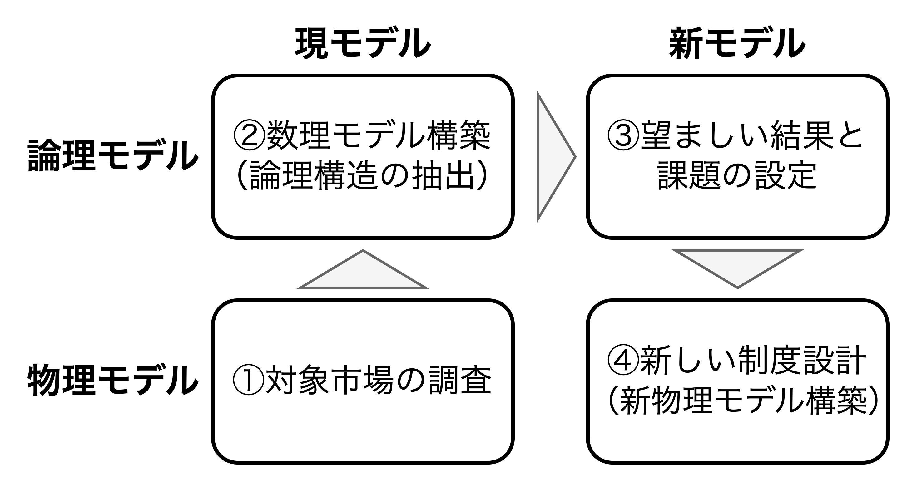
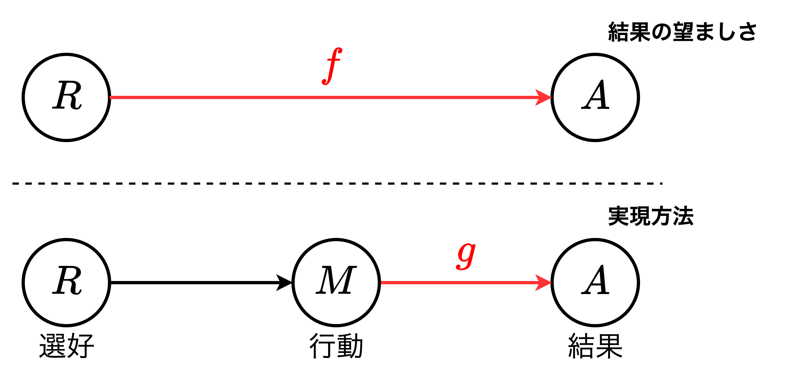
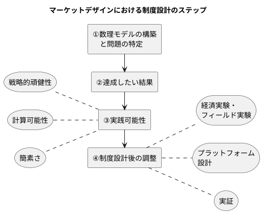
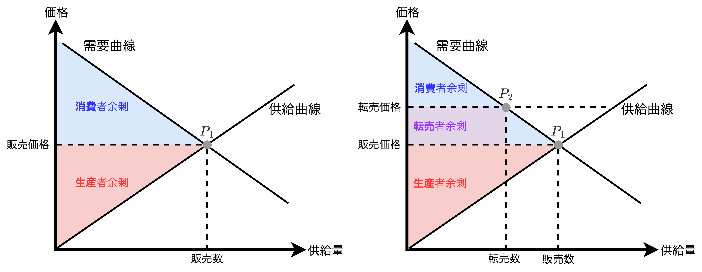

<div class="chap2">

# マーケットデザインという思想

- マーケットデザインは理学的側面と工学的要素を融合した実践的な学問領域であり、2000年以降に学術界で見受けられるようになった。**AEA JEL classification**では、マーケットデザインは$D47$、マッチング理論は$C78$、オークションは$D44$という区分になっている。
- 本章ではマーケットデザインの考え方がどのように構築されたのかを近年の関連する3つのノーベル賞と共に辿った後、思想としてのマーケットデザインを定式化する。

## 思想の根幹

- 近年、<u>市場の分析</u>だけでなく、<u>市場の制度設計</u>が求められている。社会の発展に伴い複雑化する市場において、特定の市場の特定の問題を解決する必要が発生している。
- マーケットデザインに直結する3つの分野として、**メカニズムデザイン理論・マッチング理論・オークション理論**がある。
  - 【**メカニズムデザイン理論**】ゲーム理論の応用分野の1つであり、インセンティブの制御を中心とした制度設計に関する理論。登場する手法が概念的であり、マッチング理論やオークション理論と比べて抽象的である。
  - 【**マッチング理論**】人とモノ、人とサービスの最適な組合せを考える理論であり、「適材適所」を実現する。例として、<u>研修医マッチング、ドナー交換腎移植、学校選択</u>などがある。
  - 【**オークション理論**】限られた財（商品）を最も効率的に売買できるメカニズムをを設計・分析する理論。例として、<u>インターネット広告、周波数オークション、公共事業の競争入札</u>などがある。
- <font color=red>マーケットデザインは、①メカニズム理論が生み出した「<b>制度の可変性</b>」という発想を、②マッチング理論・オークション理論を用いて、現実社会で実践している分野である</font>。

<div style="page-break-before:always"></div>

### メカニズムデザイン理論

- メカニズムデザイン理論では、以下の手順で進む。
  1. 達成したい結果を設定する
  2. 設定した結果を達成するための制度の構築可能性を模索する
- メカニズムデザインは、ナッシュ均衡を達成可能かどうかを分析し、ゲーム理論の枠組みで定式化している。達成したい結果が制度を通して解概念（ナッシュ均衡、サブゲーム完全なナッシュ均衡、完全ベイジアン均衡など）で達成されることを「<font color=red>遂行可能</font>」と定義し、ナッシュ遂行やベイズ遂行を設計・分析する。
- マーケットデザインとメカニズムデザインの違いとして、実用性の違いがある。マーケットデザインは現実に明日から使える**具体的・実践的な制度**であり、メカニズムデザインは**概念的・抽象的な制度**になる。

### マッチング理論

- マッチング理論はマーケットデザインを代表する重要な分野の1つである。マッチング理論は研修医マッチングや学校選択、臓器移植といった<font color=red>金銭が介在しない、金銭が配分に大きな影響を与えない、金銭の介在が倫理的に望ましくないような市場</font>を分析の射程とする。
- マッチング理論は安定性、耐戦略性、DAアルゴリズム、などさまざまな検討事項を踏まえて、<font color=red>実践的・理論的にミクロ経済理論と実社会との距離を縮める</font>。

### オークション理論

- オークションにかけられた財はその過程を通じて価格が決定する。絵画、宝石、旧車、場合によっては帝国など「**オークション**」は古くから取引手段の一つとして人類史に根付いている。
- 応用例として、世界各国の政府の公共事業や国債の入札、GoogleやInstagramのインターネット広告、周波数オークション、などがある。

## 思想の定式化



- マーケットデザインは「**制度は可変である**」という考えに依拠する。そのため制度設計者の視点で市場を覗き込む必要があり、以下の4つのステップから進む。
  1. 【**ステップ1：対象市場の調査**】<u>市場の特徴を捉える作業</u>。現実の市場を構成する要素を洗い出し、参加者やルール、構造、制約条件を特定する。
  2. 【**ステップ2：数理モデル構築**】<u>市場の数理モデルを構築する作業</u>。ステップ1で洗い出した市場の構成要素から、市場で解決すべき課題と実装されている解決方法を明確する。その上で、<font color=red>効率で、公平で、安定した望ましい結果を洗い出す</font>。
  3. 【**ステップ3：望ましい結果と課題の設計**】<u>市場が抱える課題を特定し、望ましい結果を抽出する作業</u>。ステップ2までに特定した課題と望ましい結果を踏まえ、新たに実践可能な論理モデルを構築する。
  4. 【**ステップ4：新しい制度設計**】<u>ステップ3で構築した新論理モデルを用いて、社会実装可能な制度を設計する作業</u>。実際に制度として適用する場合に発生する制約条件を明確にし、制度を設計していく。

<div style="page-break-before:always"></div>

### 経済用語と数学表現

#### 市場・人・財

$$
\begin{align*}
&人x\in N,\hspace{1mm}財の種類l\in L,\hspace{1mm}財の組合せx\in X(\sub\mathbb{R}_+^{|L|})\\
&※\mathbb{R}_+は非負実数の集合
\end{align*}
$$

- 【**市場**】マーケットデザインで対象とするような市場は取引される「財」、取引する「人」の集合、そして取引ルールで表現される箱のようなもの。
- 【**人$n$**】意思決定し、経済活動（消費、生産など）を行う基本単位。意思決定者とも呼ぶ。
- 【**財$l,x$**】意思決定者に消費されること何らかの便益（損失）を生むもの。

#### 好ましさ

$$
\begin{align*}
&x,y,z\in Xとするとき、完備性、推移性、反対称性を以下に定義する。\\
&【完備性】\hspace{3.5mm}x\succsim y\hspace{2mm}または\hspace{2mm}x\precsim y&(1)\\
&【推移性】\hspace{3.5mm}[\hspace{1mm}x\succsim y\hspace{2mm}かつ\hspace{2mm}y\succsim z\hspace{1mm}]\iff x\succsim z&(2)\\
&【反対称性】x\succsim y\hspace{2mm}かつ\hspace{2mm}x\precsim y\iff x=y&(3)
\end{align*}
$$

#### 選好と結果

$$
\begin{align*}
&【選好の組み】R=R_1\times R_2\times\dotsb R_i\times\dotsb R_N\\
&【結果の集合】A\in X^{|N|}
\end{align*}
$$

- 上記の完備性と推移性を満たすような全体の選好を$R$、任意の意思決定者$i\in N$の選好を$R_i$とした時、直積を用いて上式のように表現できる。
- $A$は財の配分状況を示している、かつ、市場の制約のもとで実現可能なものの集合。

<div style="page-break-before:always"></div>

#### 【例】個々人への財の分配

> 市場にいる意思決定者$i$に財をどのように分配するかを表した1つの配分を$a_i$とすると、$$
> a_i\in X=\mathbb{R}_+^{|L|}
> $$と書ける。この市場の意思決定者$i$が自分がどれだけの財を消費できるかのみに興味がある場合、選好は$\mathbb{R}_+^{|L|}$上に定義されることになる。市場には$|N|$人の意思決定者がいるので、全体の配分$a$は以下のように表現できる。$$
> a=(a_1,a_2,\dots,a_{|N|})\in X^{|N|}
> $$　ここで**1つ制約を追加する**。例えば、市場にはそれぞれの財が10ずつしか存在しない場合、実現可能な結果の集合$A$は以下のようになる。$$
> A=\left\{a\in X^{|N|}\left|\forall l\in L,\hspace{1mm}\sum_{i\in N}a_{il}≦10\right.\right\}
> $$各財の配分の総和が市場に存在する総和以下となっているのは、市場に存在する財全てを必ずしも全員に配分していない状況も許容するためである。例えば、ある財が3日経った生ゴミのような、全ての意思決定者が必要としない（受け取っても困る）場合などに該当する。

#### 【例】サッカーユニフォームのオークション

> ユニフォームは1つしか存在せず、分割は不可能とする。意思決定者$i$のユニフォームの数と金銭移転をそれぞれ$x_i$と$m_i$とした時、オークション市場の結果の集合$A$は以下のようになる。$$
> A=\left\{(x,m)\in [\{0,1\}\times\mathbb{R}]^{|N|}\left|\sum_{i\in N}x_{i}≦1\right.\right\}
> $$意思決定者$i$の配分($x_i,m_i$)について、$x_i$は分割不可であるため$0$か$1$しか取らず、総和は$1$以下である。また、$m_i$について、もしユニフォームの競り落としで$10,000$円支払った場合、$m_i=-10,000$と表現する。
> 　ここで、入札に参加した人のみの配分を結果として定義しているが、ユニフォームの売り手を参加者として含むこともできる。その際、売り手は支払額を受け取ることになるので、売り手の金銭移転は正の数（非負の数）となる。

<div style="page-break-before:always"></div>

#### 結果への関数$f$と$g$



$$
\begin{align*}
【選好Rから結果A】&f:R\rightarrow A\\
【行動Mから結果A】&g:M\rightarrow A\hspace{2mm}ただし、M=\prod_{i\in N}M_i
\end{align*}
$$

- <font color=red>マーケットデザインにおける制度設計とは、<b>$f(R)$を達成する現実に応用可能な関数$g(M)$をうまく見つけ出すこと</b>に他ならない</font>。
- 制度設計者がマーケットデザインをする際の特徴は以下の通り。
  1. 意思決定者$i$の選好$R_i$を知ることができない。
  2. 意思決定者$i$の真の選考$R_i$に基づき、自身にとってより良い配分を導くような行動$M_i$がある。
  3. 真の選好$R$を「**知らないまま**」に$g(M)$を通していかに達成するかが制度設計である。

<div style="page-break-before:always"></div>

### マーケットデザインの思想

<div style="padding: 10px 10px 0px 10px; margin-bottom: 10px; border: 2px solid #333333; border-radius: 10px;">
    <ol>
        <li>【<b>特定</b>】市場の特徴を捉えたモデルを構築し、問題を特定する</li>
        <li>【<b>目的</b>】達成したい結果 <i>f</i> を明確に設定する</li>
        <li>（【<b>確認</b>】既存の制度が <i>f</i> を達成できるか確認する）</li>
        <li>【<b>方法</b>】その結果を導く実践可能な制度 <i>g</i> を設計する</li>
        <li>【<b>調整</b>】設計された制度と現実の間に生じる<font color=red>ギャップを埋める</font></li>
    </ol>
</div>



- 制度設計者の立場は大きく2つある。
  - 【**立場1**】新しく制度を導入する（できる）立場
  - 【**立場2**】既存の制度を再評価する（できる）立場
- 制度設計者は感覚的にうまくいっていない制度を数理的に明確化し、制度を設計した上で、現実との間に生じるギャップを埋める。
- <font color=red>マーケットデザインは「<b>特定の市場の特定の問題をカスタムメイドな方法で解決すること</b>」と解釈でき、汎用性のあるモデルから解決策を見出すわけではない</font>。

<div style="page-break-before:always"></div>

#### 【ステップ1】数理モデルの構築と問題の特定

```plantuml
title 現市場の因数分解

rectangle "市場(構造)" {
    storage "参加者" as elem1
    storage "取引ルール" as elem2
    storage "制約条件" as elem3
    storage "相互作用・依存関係" as elem4

    elem1 -[hidden] elem2
    elem2 -[hidden] elem3
    elem3 -[hidden] elem4
}
```

- マーケットデザインで対象となる市場は以下の特徴を持つ。
  - 【**特徴1**】既存の制度のもとで<font color=red>不具合が起こっている</font>
  - 【**特徴2**】既存制度が<font color=red>うまく機能しているかわからない</font>
  - 【**特徴3**】<font color=red>新制度が必要となっている</font>
- <font color=blue>数理モデルの構築は「<b>言語的・感覚的</b>な市場」→「<b>論理的・数理的</b>な市場」に視覚化する作業</font>であり、市場特有の構造や要求をモデリングし、不要な要素は捨象して、市場の状況をうまく描写する。
- <font color=red>モデル構築には<b>ステークホルダーを明らかにする</b>ことから始まる</font>。また、取引ルール（例えば、転売など）の影響範囲を適切に評価し、<b>取り扱う財も考慮した幅広い分析</b>が必要になる。もし、<u>本ステップのモデル構築で十分な分析をしなければ、既存市場では対処できないことを真に明らかにできず、**以降のステップで分析が矮小化してしまう**</u>。例えば、コンサートチケットの購入の場だけでなく音楽業界まで影響すると考えた場合、コンサートグッズやファンクラブ特典なども財の対象になり得る。

<div style="page-break-before:always"></div>

##### 【ステップ1】の具体例



> <font size=4>【<b>具体例</b>】</font>
> 人気アーティストのコンサートチケット市場では、しばしば転売が（感覚的に）問題視されている。この市場を分析する場合は「部分均衡分析」がよく用いられ、<b>①チケットに対する需要関数</b>、<b>②チケットの販売価格</b>、<b>③転売者</b>を用意することが多い。モデリングとしては「転売者のできることとして他の需要者よりも先にある割合のチケットを確保できると仮定し、転売者はチケットを購入できなかった需要者に定価よりも高い価格でチケットを販売する」を考える。
> 　人気のコンサートチケットの供給量は一般に需要量よりも少ないため、定価が市場均衡価格（需給が一致する価格）よりも低く、超過需要が発生し、市場が均衡状態になっていない。$$
> \begin{align*}
> &消費者余剰=評価額(払っても良いと考える価格)-支払額（購入価格）\\
> &生産者余剰=チケット販売収入（価格\times 人数）-コンサート費用\\
> &転売者余剰=転売価格-購入価格
> \end{align*}
> $$　上式に<b>消費者余剰</b>、<b>生産者余剰</b>、<b>転売者余剰</b>を示す。ここで、余剰とは市場での取引結果から参加者が得する（損する）部分を金銭評価したものであり、社会厚生を測る1つの指標である。部分均衡分析は余剰分析に適しており、需要量と供給量を元に市場を均衡させる「価格」を分析することを目的としている。実際に<font color=red>市場にいる3者（消費者、生産者、転売者）の余剰の総和は変わらない</font>こともわかる。
> 　当該市場では、①チケット価格は定額で需要量に対して変化しないこと、②チケットの供給量は一定であること、③常に超過需要であること、の3つが部分均衡分析からわかる。これは、「<font color=red>高い価格を支払える人が財を得られる</font>」という至極真っ当な経済原理が示唆される。マーケットデザインの思想に従って上記市場をモデル化する場合、「価格は定額」という設定理由をよく吟味する必要がある。チケットの販売者やアーティストは「より多くの人にチケットを供給したい」という思いから定額にしたい理由があるかもしれない。

<div style="page-break-before:always"></div>

#### 【ステップ2】達成したい結果

- 一般的に市場には「望ましい結果」があるが、これは制度設計者が自由に設定して良い。例えば、①正当な競争の保証、②不公平性の排除、③アファーマティブアクション（積極的差別是正措置）の尊重、などがある。
- ここで、望ましい結果を満たす性質は1つ以上であり、複数であっても問題ない。ここではパレート効率性と安定性について説明する。
  - 【**パレート効率性**】組み替えによって誰も損させることなく、誰かの組合せを今よりも好ましいものに変えることはできない性質、つまり、<font color=red>誰かを犠牲にしないと別の誰かの組合せを組合せを良くすることができないほど無駄がないという性質</font>。
  - 【**安定性**】どの意思決定者とそれらのペアもマッチングから抜け出して別のマッチングを組もうとするインセンティブがない状態、つまり、<font color=red>意思決定者がマッチング結果に対して不満がない状態</font>。

##### パレート効率性の例

> おやつの時間に1枚のピザと2本のコーラをワタルくんとユースケくんの兄弟に分けようとする状況を考える。二人の好みは以下の通り。
> - 【**好みA-1**】ワタルくんは固形物を食べることのみが嬉しい
> - 【**好みA-2**】ユースケくんは竜動物を飲むことのみが嬉しい
>
> 好みAの場合、<font color=red>ワタルくんに1枚のピザ、ユースケくんに2本のコーラ、を与えることが<b>「パレート効率的」な配分</b></font>と言える。次に以下の好みを考える。
> - 【**好みB-1**】ワタルくんとユースケくんは共にピザもコーラもあればあるほど嬉しい
> ※ピザ$k\in [0,1]$枚とコーラ$2k$本は常に等しい嬉しさとする
>
> 好みBの場合、<font color=red>①ワタルくんかユースケくんのどちらかに全部を与える、または、②ワタルくんとユースケくんにそれぞれピザ半分とコーラ1本ずつを与えることが<b>「パレート効率的」な配分</b></font>と言える。次に以下の好みを考える。

- パレート効率性の例から分かることは以下の通り。
  - 【**パレート効率性の特徴1**】市場にいる意思決定者全員の選好$R$に依存して決まる
  - 【**パレート効率性の特徴2**】パレート効率的な結果$A$は複数存在する
  - 【**パレート効率性の特徴3**】配分される財は多ければ多いほど嬉しい場合、資源を余すことなく使い切ることが効率的な結果と言える。
  - 【**パレート効率性の特徴4**】パレート効率性を満たしていない結果は、必ず誰かの嬉しさを損なうことなく、今よりも改善できる状態にある。
  - 【**パレート効率性の特徴5**】<font color=red>平等性のような基準とは全く関係がない</font>。

##### 安定性の例

> 架空の村に2人の女A、Bと2人の男C、Dがいるとし、以下の前提条件があるとする。
> - 【**前提1**】AがCと結婚し、BがDと結婚することを命じられている。
>
> 上記の前提だけの場合、AとC、BとDがそれぞれ結婚すると言う状況が市場の結果の1つである。次に、新たに2つの前提を追加する。
> - 【**前提1**】AがCと結婚し、BがDと結婚することを命じられている。
> - 【**前提2**】Aは許嫁のCよりDを好んでいる。
> - 【**前提3**】Dは許嫁のBよりAを好んでいる。
>
> <font color=red>上記3つの前提があるとき、AとCの結婚とBとDの結婚は安定的ではない</font>。ここで、<font color=red>前提1と3のみがある状況を考えると、この時のAとCの結婚とBとDの結婚は安定的である</font>。これは、別のマッチングを組むインセンティブがD以外に存在しないからである。

- 安定性の例から分かることは以下の通り。
  - 【**安定性の特徴1**】どの意思決定者によってもブロックされない（<font color=red>個人合理性</font>）
  - 【**安定性の特徴2**】どのペアによってもブロックされない

#### 【ステップ3】実践可能性

```plantuml
title ステップ3でやること
left to right direction

rectangle "【**ステップ2**】\n望ましい結果\n（目的）の設定" as step2
rectangle "【**ステップ3**】\n望ましい結果を\n達成できる制度の設計" as step3
note left of step3
**ステップ3で満たすべき特性**
◼戦略的頑健性
◼計算可能性
◼簡素さ
end note

step2 --> step3
```

- 制度設計者は、まず達成したい望ましい結果（目的）を設定し、次にその結果を市場で達成できる制度を作らなければならない。
- 実践可能性は主に以下の3つの特性を満たす。
  - 【**特性1**】戦略的頑健性
  - 【**特性2**】計算可能性
  - 【**特性3**】簡素さ

<div style="page-break-before:always"></div>

##### 【特性1】戦略的頑健性

- 設計された制度は意思決定者の選考を入力データとしない、つまり、<font color=red>設計された制度は市場参加者がいかなる選好を持っていてもうまく機能する必要がある</font>。
- 制度は意思決定者$i$の行動$M_i$に対して結果$A_i$を定めるものである。ここで、$M_i$が選好表明$R_i$である最もシンプルな場合（$M_i=R_i$）を考える。得られる全ての選好が真の選好表明であれば問題ないが、制度設計者は$i$の真の選好$R_i$を知ることができない（もしくは嘘を見抜く方法がない）ため、<font color=red>制度設計者は「$i$が嘘の選好$R'_i$が存在する可能性があること」を念頭に入れなければならない</font>。
- このように、制度設計者は「真実を表明することが合理的である」ということを促す必要があり、「**他の意思決定者$i$がいかなる行動を選択しようとも真実を表明することが最適となる性質**」を耐戦略性またはSP（Strategy-Proof）と呼ぶ。<u>耐戦略性は戦略的に操作不可能であることを意味するため、非常に望ましい性質であるが、必ずしも制度設計において満足する必要はない</u>。

##### 【特性2】計算可能性

- 制度設計者が思案する市場は一般に多数の意思決定者$i$が参加しており、研究室配属などの**小規模**な市場であれば200人程度、一方で、大学入試などの**大規模**な市場であれば数10万人の参加者が存在する。
- 設計された制度$g(M)$は全ての参加者の行動$M$を入力データとして、対応する結果$A$を出力する必要があるが、計算量は多項式時間であることが求められる。例えば、100人の順位パターンを考える場合、$_{100}P_{100}$通り（$>10^{90}$）の計算量が存在する。これだけの回数アルゴリズムは計算機科学的に不可能であり、<font color=red>望ましい結果を多項式時間で計算できるアルゴリズムを模索することが求められる</font>。

##### 【特性3】簡素さ

- 現在、<b>簡素さについての正式な定義は存在しない</b>が、<font color=red>もし制度があまりにも複雑で理解が難しい場合、意思決定者が制度を理解できず、ランダムな行動を選択してしまい、嘘の行動と同様に望ましい結果を達成できなくなる</font>。
- 簡素さの一例として、選択できる行動をシンプルにすることが挙げられる。例えば、オークションでは「金額」を、マッチングでは「選好のランキング」を設定することでシンプルにできる。
- <font color=red>もし表明行動が煩雑である場合、真のランキングの一部までしか提出しない意思決定者が存在することが観測されている</font>。例えば、<u>日本の新卒就活市場では企業数が莫大なため長い選好ランキングが必要になるが、実際は数社のランキングというシンプルな構造を組み込むことになる</u>。

<div style="page-break-before:always"></div>

#### 【ステップ4】

- 理論的に望ましい制度を設計できたとしても意思決定者が合理的であるとは限らず、理論と実践のギャップを明らかにする必要がある。具体的には、①パラメータ、②参加者、③制約条件、などの調整・追加・削除が挙げられ、実験による仮説検証と評価が重要になる。
  - 【**実験1**】経済実験・フィールド実験
  - 【**実験2**】プラットフォーム設計
  - 【**実験3**】実証
- <font color=red>制度設計者には実装後の運用までを視野に入れたグランドビジョンを描いておくことが求められる</font>。そのために実装前にも十分なデータを収集しておくことが望ましい。また、<u>制度の機能性を評価するために実装前と後のデータを利用し、理論と実践のギャップを明らかにする</u>。

##### 【実験1】経済実験・フィールド実験

- 設計した制度に対して経済実験を行い、理論とのギャップを見出す。具体的には、設計された制度にはアルゴリズムが存在するため、実験室（小さな社会）を作り出し、被験者（人間）に参加してもらう。

##### 【実験2】プラットフォーム設計

- プラットフォームはプラットフォーマーにより取引の場が提供され、財やサービスの売買が行われる。具体的には、①本や電化製品の売買、②中古品の売買、③ホテルや新幹線の予約、などのWebやモバイルのアプリが挙げられる。
- <font color=red>プラットフォームでの取引ルールはプラットフォーマーによって設計・実装・運用される</font>。その取引ルールは多岐に渡り、財やサービスの取引ルール、安全性を担保するルール、トラブル対応のためのルール、決済ルール、などさまざまである。
- <font color=red>プラットフォーマーはプラットフォーム上での参加者の行動データを取得し、レビューやレコメンドを参加者に表示し、データを利活用できる</font>。これを<b>ネットワーク効果</b>と呼び、参加者の増加がプラットフォームの価値を高める。例えば、ある本のレビューを誰かが書くと、他の参加者の購入検討の参考材料になり、<u>ネットワーク効果はプラットフォーム成功の鍵として認識される</u>。

##### 【実験3】実証

- 実装された制度$g$の運用が始まると、$g$のもとで意思決定者$i$のさまざまな行動データを収集でき、達成したい結果$f$を実際に達成しているかを検証できる。<font color=red>検証結果から$f$と$g$を比較し、理論と実践のバランスをとりながら改善を行う</font>。
