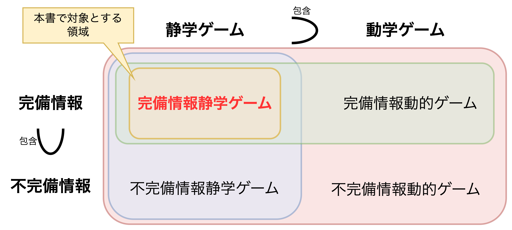
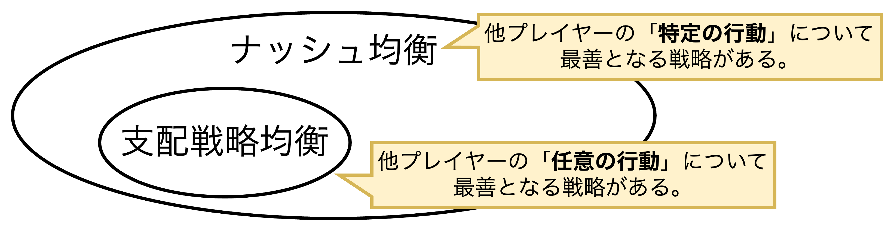
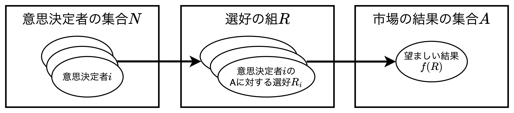
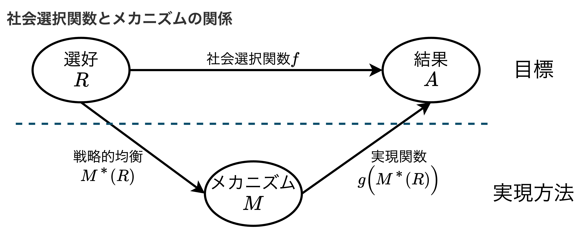

# マーケットデザインの基礎理論

## ゲーム理論

- 人の行動選択は他人の行動と相互依存し合っている。例えば、狭い道を歩くときに、前から歩いてくる他人に依存して右か左のどちらかに避ける行動選択を迫られる。<u>人の行動は、①他人の行動と相互依存すること、②何かしらの合理的な基準で行動選択がされること、の2つを満たすものとする</u>。
- マーケットデザインにおいて、例えば、戦略的頑健性に関しては「**非協力ゲームの方法**」が有用であり、結果の望ましさに関しては「**協力ゲームの概念**」が有用である。

### 非協力ゲームの枠組み

- 以下、用語を示す。
  - 【**戦略的環境**】結果が人々の行動の相互依存関係から導かれる状況
  - 【**ゲーム**】戦略的環境において人々が摂りうる戦略を数学モデルとして表したもの
  - 【**利得**】プレイヤーがゲームの結果から得られる嬉しさ
- 個々のプレイヤーは他のプレイヤーとは独立して行動を選択し、ゲームの結果は全てのプレイヤーの行動に依存して決まる。このように、ゲームの結果がプレイヤーの行動に依存するようにモデル化することでプレイヤー間に相互依存関係があることを表現できる。
- 戦略的環境は一般に2パターン（完備情報・不完備情報）$\times$2パターン（静学ゲーム・動学ゲーム）の4つのタイプに分類される。本書では、**完備情報静学ゲーム**を対象とする。

#### 静学ゲームの環境

$$
\begin{align*}
N&：プレイヤーの集合\\[2mm]
S_i&：プレイヤーiの戦略集合\\[2mm]
S&：全体の戦略集合S=\prod_{i\in N}S_i\\[2mm]
u_i&：プレイヤーiの利得関数u_i(S)\rightarrow \mathbb{R}
\end{align*}
$$

- プレイヤー間の相互依存関係がある場合において、相手の選択した行動を知る前に自らの行動を選択する状況を数学的に表現する。

##### 【例】ワタルとユースケの静学ゲーム

> 狭い道をワタルくんとユースケくんが異なる方向から歩いてくる状況を考える。それぞれは、右に避けるか・左に避けるか、を選択しなければならない。全体の戦略集合を$S$とし、ワタルくんとユースケくんの戦略集合をそれぞれ$S_{ワタル}$、$S_{ユースケ}$とすると以下のように表すことができる。
> $$
> \begin{align*}
> S&=S_{ワタル}\times S_{ユースケ}\\
> S_{ワタル}&=\{右に避ける,\hspace{1.5mm}左に避ける\}\\
> S_{ユースケ}&=\{右に避ける,\hspace{1.5mm}左に避ける\}\\
> \end{align*}
> $$ワタルくんとユースケくんそれぞれの利得$u_{ワタル}、u_{ユースケ}$は自分自身の行動だけでなく他人の行動にも依存するため、$S$上の関数となる。それぞれの利得は以下の関係にある。
> $$
> \begin{align*}
> u_{ワタル}(右,右)=u_{ワタル}(左,左)>&u_{ワタル}(右,左)=u_{ワタル}(左,右)\\
> u_{ユースケ}(右,右)=u_{ユースケ}(左,左)>&u_{ユースケ}(右,左)=u_{ユースケ}(左,右)
> \end{align*}
> $$上記の内容を踏まえ、以下に利得表を示す。うまく避けられた場合は利得を1、ぶつかった場合は利得を0とした。利得表は「ゲームの見える化」であり、ゲームそのものではない。利得表はあくまでも理解の助けでしかない。
> <table>
>   <caption>利得表</caption>
>	<tbody>
>		<tr>
>			<th>ワタル/ユースケ</th>
>			<th>右</th>
>			<th>左</th>
>		</tr>
>		<tr>
>			<th>右</th>
>			<td>1,1</td>
>			<td>0,0</td>
>		</tr>
>		<tr>
>			<th>左</th>
>			<td>0,0</td>
>			<td>1,1</td>
>		</tr>
>	</tbody>
> </table>

#### 最適反応

$$
\begin{align*}
【最適反応&】BR_i(s_{-i})=arg\hspace{.5mm}\max_{s'\in S_i}\hspace{1mm}u_i(s',s_{-i})\\
s'&:プレイヤーiの任意の戦略\\
s_{-i}&:プレイヤーiが想定する他プレイヤーの戦略\\
u_i(*)&:プレイヤーiの利得関数
\end{align*}
$$

- ゲームの環境では、**プレイヤーの利得は他のプレイヤーの行動にも依存する**。しかし、他のプレイヤーの行動を制御することはできないので、プレイヤーは自身の行動を定め、利得の最大化を図る。
- 本節では、シンプルに相手の行動に対して最も利得が高くなる行動に着目し、それぞれのプレイヤーが同様に考えることを仮定する。プレイヤー$i$が他プレイヤーの戦略を$s_{-i}\in S_{-i}$と想定するとき、自らの利得を最大にするような行動（戦略）を**最適反応**と呼び、プレイヤー$i$の最適反応の集合は対応$BR_i$は上式のように表される。
- 

##### 【例】ワタルとユースケの静学ゲームにおける最適反応

$$
\begin{align*}
【最適反応&】BR_i(右)=\{右\}、BR_i(左)=\{左\}\hspace{5mm}※i\in {ワタル、ユースケ}
\end{align*}
$$

- ワタルくんとユースケくんは対称な状況に置かれているので最適反応対応は同じである。この最適反応を用いて、分析者が予測する行動の組合せ（とその結果）である「解」を定義していく。

### 支配戦略均衡

$$
\displaystyle{
\begin{align*}
&\bigcap_{s_{-i}\in S_{-i}}BR_i(s_{-i})\left\{
\begin{array}{l}
=\emptyset : 支配戦略が存在しない\\[1mm]
\neq\emptyset : 1つ以上の支配戦略が存在する(=\color{red}\bold{支配戦略均衡})
\end{array}
\right.\\[5.5mm]
&【支配戦略】u_i(s_i,s_{-i})≧u_i(s_i',s_{-i})\\
&s_i:支配戦略均衡となるプレイヤーiの戦略\\
&s_{i}':プレイヤーiの全戦略\\
&s_{-i}:プレイヤーiが想定する他プレイヤーの戦略\\
&BR_i:プレイヤーiの利得が最大となる戦略(最適反応)
\end{align*}
}
$$

- ゲームが与えられたとき、最適反応からプレイヤーは他のプレイヤーの行動に対して最も利得の高くなる行動（複数あるかもしれないが）を定めることができる。このとき、稀にプレイヤーにとって他のプレイヤーの行動に関わらず特定の行動が最適となる場合がある。
- このように、他のプレイヤーの任意の戦略に対して、あるプレイヤーの特定の戦略が他の戦略よりも高い利得を導く戦略を「<b>支配戦略</b>」という。ここで、厳密に高い利得を導く場合は「強支配戦略」と言ったり、同じ利得も許容する場合は「弱支配戦略」と言ったりする。
- <u>もし全てのプレイヤーにとって支配戦略が存在する場合、その支配戦略の組合せをゲームの1つの解として、<b>支配戦略均衡</b>と定義する</u>。
- 上式のように「**最適反応の共通要素の有無**」が「**支配戦略の有無**」を表す。
- 支配戦略は非常に強い解概念であり、自らのどの戦略よりも高い利得になる。<u>支配戦略は存在しないことが多く、存在する場合は革新に近い予測ができるとも考えられる</u>。

##### 【例】ワタルとユースケの静学ゲームにおける支配戦略

$$
BR_i(右)\cap BR_i(左)=\{右\}\cap \{左\}=\{\emptyset\}\iff 支配戦略が存在しない
$$

### ナッシュ均衡

$$
\begin{align*}
&【ナッシュ均衡】\eqqcolon s^*\in\prod_{i\in N}BR_i(s_{-i}^*)\\[4mm]
&s^*\hspace{3.3mm}:ナッシュ均衡となる戦略の組\\
&s_{-i}\hspace{1.8mm}:プレイヤーiが想定する他プレイヤーの戦略\\
&BR_i:プレイヤーiの利得が最大となる戦略(最適反応)
\end{align*}
$$

- ナッシュ均衡とは、全てのプレイヤー$i\in N$と全ての戦略$s\in S_i$について、戦略$s^*$が最適反応対応の直積の不動点となっていることを意味し、誰も一方的に戦略を変更するインセンティブがない状態を指す。
- 前項にて「**支配戦略**」は、①強い解概念であること、②ゲーム内に存在するかどうかは疑わしいこと、に触れた。特にプレイヤーにとっての最適な行動が相手の行動によって変わる場合、支配戦略は存在しない。

#### 【例】ワタルとユースケのナッシュ均衡

$$
\begin{align*}
&\prod_{i\in \{ワタル,ユースケ\}}BR_i(s_{-i}^*)=\left[\hspace{1mm}\{右\}\times\{右\},\hspace{1mm}\{左\}\times\{左\}\hspace{1mm}\right]\\[4mm]
&s^*\hspace{3.3mm}:ナッシュ均衡となる戦略の組\\
&s_{-i}\hspace{1.8mm}:プレイヤーiが想定する他プレイヤーの戦略\\
&BR_i:プレイヤーiの利得が最大となる戦略(最適反応)
\end{align*}
$$

- 上式から戦略の組$(右,右)$と$(左,左)$はナッシュ均衡であり、いずれかのナッシュ均衡がプレイされると2人は衝突することなく軽く挨拶しながら颯爽とすれ違えるため、両者とも行動を変えることはない。

#### 【例】クルーノー競争・クルーノー均衡

> 2つの企業A、Bがある財を市場に供給している状況で、この財の市場には2つの企業しか存在しないものとする。このとき、販売価格$P$、費用$C$、市場全体の生産量$y$を以下のように定義する。
> $$
> y=y_A+y_B、P=a-by、C_i=cy_i\\[1.5mm]
> 定数項:a,b,c、y_i\in \{A, B\}:企業iの生産量
> $$このときの企業$i\in \{A,B\}$の利潤$\pi_i$は上記の指揮を用いて以下のように表すことができる。
> $$
> \begin{align*}
> \pi_i&=Py_i-C_i=\{a-b(y_A+y_B)\}y_i-cy_i\\
> \end{align*}
> $$　ここまでのことをまとめると以下のようになる。
> - プレイヤーの集合：$N=\{A,B\}$
> - 戦略の集合　　　：$S_A=[0,+\infty),S_B=[0,+\infty)$
> - 利得　　　　　　：$\pi_A(y_A,y_B),\pi_B(y_A,y_B)$
>
> 上記を踏まえ、最適反応を考える。企業A、Bの利得の最大値は$\frac{\delta \pi_A}{\delta y_A}=0$となる$y_A$を求めることと等しく、以下の式で表現できる。
> $$
> \begin{align*}
> \pi_A&=-by_A^2+(a-by_B-c)y_A, \pi_B=-by_B^2+(a-by_A-c)y_B\\[2mm]
> &\left\{
>   \begin{array}{l}
>   \displaystyle{\frac{\delta \pi_B}{\delta y_B}=-2by_B+a-by_A-c=0} \\[5mm]
>   \displaystyle{\frac{\delta \pi_A}{\delta y_A}=-2by_A+a-by_B-c=0}
>   \end{array}
> \right.\hspace{5mm}\therefore\hspace{3mm}y_A=y_B\\[8mm]
> このとき、&\displaystyle{\frac{\delta \pi_A}{\delta y_A}}=\displaystyle{\frac{\delta \pi_B}{\delta y_B}}=0を求めると、\bold{y_A=y_B=\frac{a-c}{3b}}となる。\\[3mm]
> \end{align*}
> $$企業A、Bそれぞれの最適反応$BR_A(y_B)、BR_B(y_A)$は以下のようになる。
> $$
> \bold{BR_A(y_B)}=arg\max_{y_A\in [0,+\infty)}\pi_A(y_A,y_B)=\frac{(a-c)^2}{6b}=\bold{BR_B(y_A)}
> $$
> このことから、$\displaystyle{y_A=y_B=\frac{a-c}{3b}}$の時、ナッシュ均衡となる。

## メカニズムデザイン理論

- 制度設計において、望ましい結果を実践可能な方法で達成する制度を模索することが課題であり、**戦略的頑健性**が重要な性質の1つとして挙げられる。また、望ましい結果を達成できる制度を模索することを「**遂行問題**」と呼び、そのような制度が存在するときに該当の望ましい結果は「**遂行可能**」であると呼ぶ。
- メカニズムデザイン理論はゲーム理論を応用して戦略的側面から市場の取引ルール（制度）を分析する。特徴としては以下の通り。
  - 望ましい結果を導く関数$f(R)\rightarrow A$を定義し、$f(R)$を達成する制度$g(M(R))$の有無を模索する。
  - インセンティブ制御を中心に「制度」の数学的定式化を行い、ある種のゲームのプロトコルを定義している。
  - 完備情報静学ゲームでは、各プレイヤー$i$は他プレイヤーの選好$R_{-i}$を知っているが、制度設計者は全プレイヤーの選好を知り得ない。

#### 【例】慣習的先着順ルール

> 
【具体例】

> ある学区には3つの公立高校$(X,Y,Z)$があり、学区内の学生はこの3つの高校のいずれかに入学したい。学区内にはアスカさん、キョーヘイさん、リョーケンさんの3人の学生がいる。学生と高校の選好表と学生受け入れステップは以下の通り。
> ##### 【学生と高校の選好】
> <table>
>	<tbody>
>       <caption>学生の選好（左）と公立高校の選好（右）</caption>
>		<tr>
>			<th></th>
>			<th>アスカ</th>
>			<th>キョーヘイ</th>
>			<th>リョーケン</th>
>			<th style="border-left: 5px double #ccc;">X</th>
>			<th>Y</th>
>			<th>Z</th>
>		</tr>
>		<tr>
>			<th>第1志望</th>
>			<td>X</td>
>			<td>X</td>
>			<td>Y</td>
>			<td style="border-left: 5px double #ccc;">アスカ</td>
>			<td>アスカ</td>
>			<td>リョーケン</td>
>		</tr>
>		<tr>
>			<th>第2志望</th>
>			<td>Z</td>
>			<td>Y</td>
>			<td>X</td>
>			<td style="border-left: 5px double #ccc;">キョーヘイ</td>
>			<td>キョーヘイ</td>
>			<td>キョーヘイ</td>
>		</tr>
>		<tr>
>			<th>第3志望</th>
>			<td>Y</td>
>			<td>Z</td>
>			<td>Z</td>
>			<td style="border-left: 5px double #ccc;"s>リョーケン</td>
>			<td>リョーケン</td>
>			<td>アスカ</td>
>		</tr>
>	</tbody>
> </table>
>
> ##### 【受け入れルール】
> 1. 各学生は第1志望の各学校に応募する。各学校は志望者が1名の場合はその学生を受け入れ、志望者が複数いる場合は順位の高い学生を受け入れる。
> 2. ステップ1で受け入れられなかった各学生は第2志望の学校に応募する。定員まで達している学校は新しい志望学生を受け入れない。定員に達していない学校に志望者が来た場合は、ステップ1と同様にして学生の受け入れを決定する。
> 
> 学生には1つの高校に応募するチャンスが2回（前期と後期）あり、事前に志望校2校を提出必要がある。ここで、<u>全員が正直に第1志望と第2志望を提出した場合、アスカがX、リョーケンがY、キョーヘイが浪人、という結果になる</u>。

- 上記の例をメカニズムデザインの視点から要素分解し、整理する。
  - 【**要素1**】学生の選好と高校の選好という所与は変更不可能であり、学生の受け入れルールは変更可能であること。
  - 【**要素2**】慣習的先着順のルールにおいて3人は戦略的に行動する必要がある。
  - 【**要素3**】制度設計者は学生の真の選好を知り得ない。
- 上記の要素を考慮して、「望ましさ」を追求する必要がある。例えば、「どの学生にとっても合格した高校よりも高い志望高では自分よりも好ましい学生が合格している」という公平さは望ましさの1つとして挙げられる。

### メカニズムデザインの環境

$$
\begin{align*}
i\in N&:意思決定者iとその集合N\\
R=(R_i)&:結果に対する選好の組\\
R_i&:意思決定者iのAに対する選好\\
A&:市場の結果の集合\\
f(R)\sub A&:選好の組Rにおける望ましい結果
\end{align*}
$$

- メカニズムデザイン理論の環境は抽象的であり、非常に広範な状況を描くことができる。そのため応用範囲が広く、投票、コモディティ市場、マッチング環境、オークション環境、など多岐にわたる。

#### 社会選択関数とその耐戦略性（SP：Strategy-Proof）について

$$
\begin{align*}
【関数】&f:R\rightarrow A\\
【対応】&f:R\rightrightarrows A\\
【関数の耐戦略性】&f(R_i,R_{-i})\succsim f(R_i',R_{-i})\\[2mm]
R_i:意思&決定者iの真の選好\\
R_i':意思&決定者iの嘘の選好\\
R_{-i}':意思&決定者iが想定する他プレイヤーの選好
\end{align*}
$$

- 選好の組に対して社会の結果を対応させる写像を「**社会選択関数（対応）**」とよび、関数と対応の2つがある。
  - 【**関数**】入力に対して<b>出力が一意（ユニーク）</b>に決まる
  - 【**対応**】入力に対して<b>出力が複数</b>に決まる
- また、社会選択関数のもとで任意の真の選好が常に最適となることを社会選択関数は耐戦略性を満たす。耐戦略性は関数に求められる性質であり、望ましい結果の性質ではない。そのため、耐戦略性のみを関数に求めることは意味がない。

#### 【メカニズムデザインの具体例】投票の環境

> 投票によって代表者を決定するような、いわゆる選挙では、以下の環境が設定できる。
> $$
> \begin{align*}
> N&:投票者の集合\\
> A&:候補者の集合\\
> R_i&:投票者iの候補者に対する選好
> \end{align*}
> $$上記の環境について、<u>全ての投票者が持ちうる選好の集合は等しいが、同じ選好を持っているわけではない</u>ことに注意されたい。多くの投票理論では、「**完備性・推移性・反対称性**」を満たすと仮定する。しかし、「1人の候補者にしか投票できない」というのは一般に採用されている投票方法$g$であって、投票者が複数の候補者を同等と捉えていたとしても問題はない。

#### 【メカニズムデザインの具体例】コモディティ市場

> 伝統的なミクロ経済学が対象とするコモディティ市場は以下の環境が設定できる。
> $$
> \begin{align*}
> N&:市場参加者（売り手にも買い手にもなり得る）\\
> L&:財の種類\\
> a_i&:参加者iへ配分されたコモディティ\\
> A&:参加者への実現可能なコモディティの配分の集合\\
> R_i&:市場参加者iの配分に対する選好
> \end{align*}
> $$上記の定義を用いて、コモディティの配分$a$を以下のように定義する。
> $$
> a=(a_1,a_2,\dots,a_i,\dots,a_N)\in A\sub \mathbb{R}_+^{|L|\times|N|}
> $$　価格を用いた取引ルールのもとで以下の3つを仮定する。
> - 【**仮定1**】全ての市場参加者は価格を見て行動を決定するプライステイカー（price-taker）である。
> - 【**仮定2**】市場参加者はコモディティの配分量が多ければ多いほど嬉しい。
> - 【**仮定3**】同じ量であれば1つのコモディティを配分されるよりも複数のコモディティを配分されたほうが嬉しい。
> 上記の市場（取引ルール）における均衡の配分（価格の配分）はパレート効率的であることが知られており、厚生経済学の第一基本定理と呼ばれる。

- 市場が価格を用いた取引ルールを適用する場合はパレート効率性を満たすため、市場への介入は極力避けるべきだという意見がある。一方で、<u>戦略性の概念が欠如していることが**デメリット**となる</u>。

### 遂行問題

$$
\begin{align*}
【実現関数の定義】&g\left(M^*(R)\right)\coloneqq\{a\in A\hspace{1mm}|\hspace{1mm}\exists m^*(R)\in M^*(R),\hspace{1mm}a=g(m^*(R))\}\\[3mm]
【fの遂行】&g\left(M^*(R)\right)=f(R)
\end{align*}\\[6mm]
メッセージ空間と実現関数の組(M,g)を「\color{red}メカニズム\color{black}」と呼ぶ。\\[3mm]
\begin{align*}
g(M^*(R))&:ある均衡のもとで達成される全ての結果（\bold{実現関数}）\\[1mm]
a\in A&:実現される結果の1つとその集合\\[1mm]
m^*(R)\in M^*(R)&:戦略的均衡の関数とその集合\hspace{2mm}※m_iはR_iとR_{-i}に依存する\\[1mm]
R&:選好の組\\[1mm]
M\left(=\prod_{i\in N}M_i\right)&:全ての意思決定者のメッセージ空間（行動の集合）の組\\
\end{align*}\\[3mm]
$$

- 社会選択関数$f$が定めた後、社会的に望ましい結果$f(R)$を達成する方法を考える。最もシンプルな考えは「参加者$i$に真の選好$R_i\in R$を自由に提出してもらい、$f(R)$を計算する方法」である。ここで、$M(R)=R$とし、社会選択関数$f$が耐戦略性を満たすならば、正直申告$m_i=R_i$は支配戦略となり、支配戦略均衡として$f(R)$が達成される。
- メッセージ空間$M$は選好$R$よりも広くも狭くも設定でき、制度設計者は意思決定者の選好を知る由もないため、選好をある程度ブラックボックス化できる。
- 以上の内容を踏まえ、<u>メカニズム$(M,g)$が任意の選好の組$R$に対して、望ましい結果$f(R)$を何かしらの戦略的均衡$M^*(R)$として達成することを「<b>メカニズムが$f$を遂行する</b>」という</u>。

##### 【例】意思決定者が2人の場合の表

| $i_1/i_2$ | $m_2$          | $\dots$  | $m_2'$          | $m_2''$          |
| --------- | -------------- | -------- | --------------- | ---------------- |
| $m_1$     | $g(m_1,m_2)$   |          | $g(m_1,m_2')$   | $g(m_1,m_2'')$   |
| $\vdots$  |                | $\ddots$ |                 | $\vdots$         |
| $m_1'$    | $g(m_1',m_2)$  |          | $g(m_1',m_2')$  | $g(m_1',m_2'')$  |
| $m_1''$   | $g(m_1'',m_2)$ | $\dots$  | $g(m_1'',m_2')$ | $g(m_1'',m_2'')$ |

#### 部分遂行について

$$
【fの部分遂行】g(M^*(R))\sub f(R)
$$

- 上式はどのような均衡$M^*(R)$も「**いずれかの望ましい結果$f(R)$**」を実現できる関数$g$が存在することを意味し、「<b>$f$を部分遂行できる</b>」という。

### 支配戦略遂行と表明原理

$$
\begin{align*}
【支配戦略遂行&】g(M^{DS}(R))=f(R)\\
【直接メカニズム&】(M,g)=(R,f)\rightarrow f(R^{DS}(R))=f(R)\\
g(*)&:行動Mと結果Aを結ぶ実現関数\\
M^{DS}(R)&:支配戦略均衡となる行動の集合\\
f(R)\sub A&:達成したい望ましい結果
\end{align*}\\
$$

- 支配戦略均衡となる遂行問題は上式のようになる。ここで、遂行可能なメカニズムを探すのは非常に難しい。そこで、$(M,g)=(R,f)$とする考え方である**直接メカニズム**が有用である。

### ナッシュ遂行

$$
\begin{align*}
【ナッシュ遂行&】g(M^{Nash}(R))=f(R)\\
【Maskin単調変換&】 L(R_i,a)\sub L(R_i',a)\hspace{5mm}※L(R_i,a)=\{b\in A\hspace{1mm}|\hspace{1mm}a\succsim b\}\\[2mm]
M^{Nash}(R)&:ナッシュ均衡となる行動の集合\\
b\in A&:aと同等もしくはそれよりも好ましくない結果
\end{align*}\\
$$

- ある選好$R_i$に対する結果$f(R)$より相対的に良くなる選好$R_i'$が存在したとき、**その選好$R_i'$はMaskin単調変換である**。
- 【**定理**】社会選択関数（対応）$f$がナッシュ遂行可能であるとき$f$はMaskin単調性を満たす。
