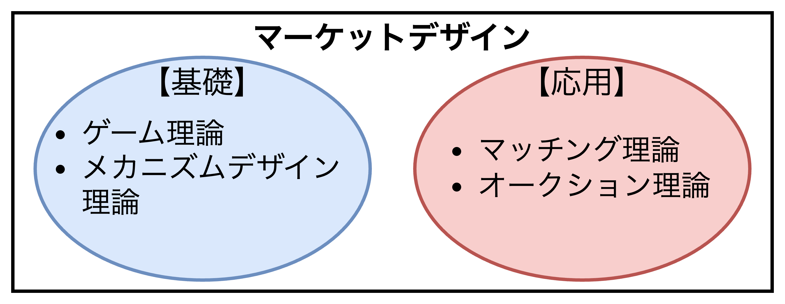
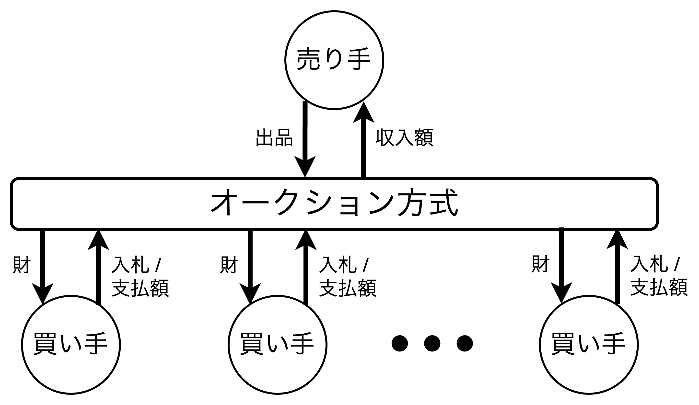
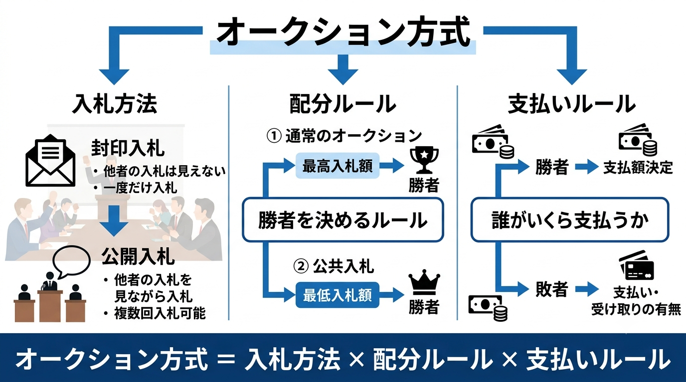

# マーケットデザインの応用理論

- **マッチング理論**は価格が介在しない場合や重要ではない場合の人と財（人と人）のマッチする状況を分析する。一方、**オークション理論**はマッチと同時に財の価格が定めるような状況を分析する。

## マッチング理論

- 本書では、**2つのグループがある中で、それぞれのグループがそれぞれの選好を持ち、マッチングが定まる環境とする**。これは、研修医と病院、学生と学校のような「2部マッチング」、かつ、人と人のような「両グループに選好がある」環境を指す。

### マッチング環境の設定

$$
\begin{align*}
\mu(w)&\in C\cup \{\emptyset\}、\mu(c)\in W\cup \{\emptyset\}、|\mu(c)|≦q_{c}\\[2mm]
W&=\{w_1,w_2,\dots,w_n\}\hspace{3.5mm}:労働者の集合\\
C&=\{c_1,c_2,\dots,c_m\}\hspace{5.9mm}:企業の集合\\
P_W&=\{P_{w_1},P_{w_2},\dots,P_{w_n}\}:労働者の選好の組\\
P_C&=\{P_{c_1},P_{c_2},\dots,P_{c_m}\}\hspace{1.5mm}:企業の選好の組\\
q&=\{q_{c_1},q_{c_2},\dots,q_{c_m}\}\hspace{3.5mm}:企業の定員のベクトル
\end{align*}
$$

- マッチング環境における結果は「<b>マッチング</b>」であるが、マッチングには複数の形成構造がある。
  - 【**1対1マッチング**】結婚やデートのように両側ともに1人が1人としかマッチできない構造
  - 【**多対1マッチング**】学校選択のように1人の学生が1つの学校にマッチして、1つの学校が複数の学生とマッチできる構造
  - 【**多対多マッチング**】企業と企業のように両側が複数とマッチできる構造

#### 【例】労働者と企業のマッチング

$$
W=\{w_1,w_2,w_3,w_4\}、C=\{c_1,c_2\}、q=(1,2)\\[3mm]
\mu=\left(
    \begin{array}{l}
    w_1\hspace{5mm}w_2\hspace{5mm}w_3\hspace{5mm}w_4\\[2mm]
    c_1\hspace{6.5mm}c_2\hspace{6.3mm}\emptyset\hspace{7mm}c_2
    \end{array}
\right)
$$

### 安定性

- 

### マッチングメカニズム

- 

## オークション理論

- 一般的なオークション理論の教科書では、現実的なオークション環境の描写に適している「**情報不完備ゲーム**」を出発点としてオークション環境が表現され、<u>初学者にとっては高いハードル</u>を課す。
- 本書は概論という特性上、情報完備のもとで概説する。オークション理論は金銭を通じた財の取引を**戦略性の観点**から分析する。オークション環境にはオークションされる財を手に入れたい「**買い手**」、その財を売って幾らかの金銭を受け取る「**売り手**」が存在する。ほとんどの場合、モデルに現れることはないがオークションを俯瞰し実施する存在としてオークショニア（売り手と同一視しても良い）がいると仮定しても構わない。これはメカニズムデザイン理論でいう「**メカニズムデザイナー**」である。
- それぞれの買い手は際に対する金銭評価された価値際に対する金銭評価された価値を持っている。そしてオークションの過程で買い手は戦略的行動として入札を行う。ゆえに「入札額」は必ずしも財に対する「自分の評価値」であるとは限らない。オークションにはさまざまなルールが存在するが、どのようなルールでも以下の2つを決定する。
  1. 誰に財を与えるか
  2. 買い手（たち）はいくら支払うか（財を得られる買い手は**勝者**と呼ばれる。）
- オークションの環境で取り扱う財は大きく2種類に大別される。1つは単一の非分割財をオークションにかける場合で、**単一財モデル**と呼ばれる。もう1つはインターネット広告や周波数割り当てオークションをモデル化する、**複数財モデル**である。本節では、単一財モデルを情報完備下で説明する。

### オークション環境の設定

- マッチング理論と異なり、オークション理論では「**金銭の介在**」がある。そのため、買い手の選好は金銭価値（財の金銭価値と金銭移転の和）の大小で表現することになる。
- 本節では、準線形の効用関数を用いる。また、シンプルな環境設定のために売り手と買い手に次のような仮説を置く。
  - 【**仮定1**】売り手はただ1人存在し、非分割財を1つだけオークションに出品する。売り手は罪に対して何の興味もなく、従って財に対する評価額は0とする。つまり、「財がいくら以上ではないから売らない」という状況は発生しない。
  - 【**仮定2**】すべての買い手は材を買うのに十分な予算を持っていて、お金がなくて買えないという状況には陥らないとする。よって買い手はその材を金銭的に評価した上で入札額を決定する。
- 上記の内容を数式で表現すると次の通り。$$【\bold{ゲーム的環境}】\\[1mm]
\begin{align*}
  N：&買い手の集合\;N=\{i_1,i_2,\cdots,i_n\}\\[1mm]
  s：&1人の売り手\\[1mm]
  u_i：&A\rightarrow\mathbb{R}\quad買い手の効用関数\;u_i(x,p)=v_ix_i-p_i\\
  &・v_i：買い手iの財に対する金銭的評価値を表す。非負の実数。\\
  &・x_i：参加者iの財の配分\;x_i\in\{0,\;1\}。x_i=1の時財を得たことを表す\\
  &・p_i：買い手iの金銭移転（p_i>0なら支払い、p_i<0なら受け取り）\\[1mm]
  A：&結果の集合
\end{align*}\\
A=\left\{(x,p)\in[\{0,1\}\times\mathbb{R}]^{|N|+1}\;\left|\;\sum_{i\in\{s\}\cup N}x_i=1\right.\right\}$$
- オークションの結果$a\in A$は単一の非分割財を誰がいくら支払って手に入れるかを明示する。結果$a$は2つの要素$x$と$p$で構成される。$x=(x_s,\;x_{i_1},\;x_{i_2},\;\cdots,\;x_{i_n})$ は売り手と書いての財の配分を表す。$x_i=1$の時、$i$が単一の非分割財を手に入れたことを意味し、非分割財は1つしかないため $\sum_{i\in\{s\}\cup N}x_i=1$ を満たす。$p=(p_s,\;p_{i_1},\;p_{i_2},\;\cdots,\;p_{i_n})$ は売り手と買い手の金銭移転を表す。
- すべての買い手の支払い総額は売り手が受け取ることとし、$p_s=-\sum_{i\in N}p_i$とする。また、売り手の財に対する評価値は0とし、オークションから収入を受け取るだけの存在として扱う。

### 効率性

  【<b>定義</b>】オークション結果$a$が<b>効率的である</b>とは以下が成り立つことである。$$x_i=1\iff i\in \arg\;\max_{j\in N}\;v_j$$

 

- マーケットデザインの思想に従えば、最初に「**望ましい結果を設定**」することになる。<u>オークションでは主に結果に対する2つの望ましさがある</u>。1つ目は「**パレート効率的な配分**」、2つ目は「**収入$p_s$の最大化**」である。本節ではオークションにおける買い手の行動とそれから導かれる結果の分析に重きを置いているので、効率性のみを扱う。
- 効率的なオークション結果では財を最も高く評価している買い手に財が分配される。
- ここで、パレート効率性とは異なる概念である。ある結果がパレート効率的であるとは、「**すべての意思決定者の嬉しさを下げることなく、誰かの嬉しさを上げる別の結果が存在しないこと**」である。
- 最初に、いかなる買い手も評価値以上の支払い（入札額とは限らない）をしないことに注意する。最も高い評価をしている買い手を$i$とし、仮に$i$以外の買い手$j$に財が渡っていたとする。すると、$v_i>v_j$なことに気がつくはずである。そして、$j$は$i$に$v_j$よりも高く、$v_i$よりも低い額$p$で材を売り渡すことを提案するはずである。$j$が財を得るために支払った額は$v_j$より低いので、$p>v_j$より$p$を受け取る方が財を保持するより嬉しい。$i$は$v_i-p>0$なので、当然この交換に応じることでより嬉しくなる。よってこの交換による新しい結果は、$i,j$以外の効用を下げることなく$i$と$j$の効用をあげている。さらに元の結果が実現可能であるならば、上述した取引も実現可能となる。よって元の結果はパレート効率的とはならない。
- 逆の場合（**ある結果で財を最も高く評価する買い手に財が配分されているにも関わらず結果がパレート効率的でない場合**）は容易であるので説明を省略する。

### オークションメカニズム

- 最も馴染み深いオークション方式の1つに**競り上げオークション**がある。入札者は随時入札額を提示し、オークション開催者（オークショニア、俗にトンカチを持っている人）がその時点での最高額をアナウンスする。ある時点での最高額に対してより高い入札額が提示されなくなったら、その最高額を提示した入札者が勝者となり、提示額を支払うことになる。

#### オークション方式の分類〜入札方法・配分ルール・支払いルール〜

- 【**入札方法**】入札には一般に「**封印入札**」と「**公開入札**」の2つの方法がある。封印入札は他の入札者の行動（入札）を観察できないままに入札を行う入札である。多くの公共入札（国債や公共事業の入札）では封印入札が採用されている。もう一つの公開入札は他の入札者の行動を観察しながら1回もしくは複数回行うことのできる入札である。
※入札できる単位は戦略空間に規定する。特に制限がない場合は入札できる額は実数（実際には最小通貨単位）と考えられるが、場合によっては100円単位でしか入札できないなどの制限がある。
- 【**配分ルール**】配分ルールは入札額に対して「誰を勝者とするか」を定める。一般的なオークションでは最も高い入札額を提示した入札者がオークションの勝者となる。しかし、それは現実によく観察されるだけで、あっていかなる配分ルールもそうである必要はない。例えば、公共事業の入札は最も低い入札額を入札した入札者が勝者となる。また複数財をオークションする場合は配分ルールも複雑となる。そのため配分ルールはきちんと明示されなければならない。
- 【**支払いルール**】支払いルールは入札額に対して誰がいくら支払う（受け取る）かを定める。一般には勝者が財の対価として幾らかを支払うことのように捉えられているかもしれないが、オークション方式としての支払いルールはもう少し広い意味を持っている。支払いルール以外が同一のオークション方式は多数存在するので、この支払いルールはオークション方式を定める極めて重要な要素である。勝者がいくら支払うかは最も重要である。さらに勝者以外の入札者がいくら支払うか、または受け取るかも明示されていなければならない。それは利得に直結するからである。
- オークション方式の形式に従って、**競り上げオークション**を以下のように簡単な形に書き直すことができる。オークショニアが十分に低い価格から徐々に価格を上げていき、すべての買い手は入札できる価格である限り手を挙げて続ける。入札できない価格になったら手を下げる。この手の上げ下げは不可逆であるとし、手を挙げている買い手が残り2人となり、片方が手を下げた時オークションは終了する。そして、手を挙げ続けている買い手が勝者となり、終了時点での価格を支払う。
- ひとたびオークション方式が定まると入札者の戦略的行動を分析することができる。オークションメカニズムとは、オークション方式をもとにしてメッセージ空間（**入札額**など）と実現関数（**配分ルール**と**支払いルール**）をメカニズムとして表現することである。
  - 【**入札方法がわかる**】ゲームが戦略型か展開型かが明らかになり、さらにメッセージ空間$M$が明らかになる。
  - 【**配分ルールと支払いルールによって実現関数を定義**】任意の買い手$i$の入札額(bid)を$b_i\in M_i$とする。そして、すべての買い手の入札額の組$(b_i)_{i\in N}$を$b$とかく。$b$を基に結果$a$を導く。

#### 2位価格オークション方式

  <ul>
    <li>
      【<b>入札方法</b>】封印入札（入札回数は1回）、各買い手のメッセージ空間$$M_i=[0,\infty)$$
    </li>
    <li>
      【<b>配分ルール</b>】$x(b)$
      $$
      x_i(b)=\left\{\begin{array}{l}
        1& if& b_i>b_j,\quad\forall j\neq i\\[2mm]
        0& if& b_i<b_j,\quad\exist j\neq i
      \end{array}\right.
      $$もし最高額を入札した買い手が複数いる場合（$b_i=\max_{i\neq j}b_j$）は等確率で財を配分するものとする。 
      ※ $\forall$は「すべての」を意味し、$\exist$は「少なくとも1つは存在する」を意味する。よって、$\forall j\neq i$は「$i$以外のすべての$j$について」と読み、$\exist j\neq i$は「$i$以外のある$j$が少なくとも1人存在する」と読む
    </li>
    <li>
      【<b>支払いルール</b>】$p(b)$
      $$
      p_i(b)=\left\{\begin{array}{l}
        \displaystyle\max_{j\neq i}b_j& if& b_i>b_j,\quad\forall j\neq i\\[3mm]
        0& if& b_i<b_j,\quad\exist j\neq i
      \end{array}\right.
      $$もし最高額を入札した買い手が複数いる場合（$b_i=\max_{i\neq j}b_j$）は等確率で支払いをするとする。ここで入札最高額が複数の場合、2番目に高い入札額は最高額と一致する。
    </li>
  </ul>

 

- 競り上げオークションは「**展開型**」ゲームを導出するので本書の範囲を超えるが一定の条件の下で競り上げオークションと2位価格オークションは同一視できることが知られている。2位価格オークションは「**戦略型**」ゲームを導出し、競り上げオークションの性質を2位価格オークションを通じて理解する。
- 2位価格オークションは封印入札であり、最も高い入札額を提示した買い手が勝者となる。最も大きな特徴は「勝者は自らの入札額ではなく2番目に高い入札額を支払う点」である。

**具体例**

> 幸運の石がオークションにかけられることになった。オークション方式は2位価格オークションと決まった。買い手としてワタルくんとユースケくんがオークションに参加する。それぞれの幸運の意思に対する評価値は$v_{ワタル}=100,\;v_{ユースケ}=80$ であるとする。評価値が一旦定まると1つのゲームが定まる。結果は2人の入札額によって決まるので、$b=(b_{ワタル},\;b_{ユースケ})$の組合せに対して2位価格オークションの結果を見ていく。
>
> 【**$b=(50,\;70)$の場合**】
> $b_{ワタル}<b_{ユースケ}$なので、ユースケくんが勝者となる。ユースケくんの支払いは2番目の高い入札額が $b_{ワタル}=50$ なので $p_{ユースケ}=50$ となる。ワタルくんの支払いは $p_{ワタル}=0$ である。よって2人のそれぞれの利得は $u_{ワタル}=0$、$u_{ユースケ}=80-50=30$
> 
> 【**$b=(85,\;90)$の場合**】
> $b_{ワタル}<b_{ユースケ}$なので、ユースケくんが勝者となる。ユースケくんの支払いは2番目の高い入札額が $b_{ワタル}=85$ なので $p_{ユースケ}=85$ となる。ワタルくんの支払いは $p_{ワタル}=0$ である。よって2人のそれぞれの利得は $u_{ワタル}=0$、$u_{ユースケ}=80-85=-5$となる。
>  　入札額が高ければ勝者となれるが、一方で利得は評価値にも依存するので、あまりにも高額な入札はマイナスの利得となってしまう。つまり、オークションに参加する目的は勝つことではなく、「**自分の利得$u_i$を最大化すること**」であることに注意したい。2つ目のケースではユースケくんは幸運の石の魔力にとりつかれてワタルくんにどうしても負けたくないと合理的ではない行動に走ってしまったのかもしれない。そして家に帰って石ころを見つめて後悔の言葉をつぶやく。

**2位価格オークションの分析**

  【<b>定理</b>】2位価格オークションでは、任意の$v$と任意の買い手$i$について評価値を正直に入札する戦略 $b_i=v_i$ が支配戦略となる。つまり、<b>正直申告が支配戦略</b>である。
    
  【<b>定理</b>】2位価格オークションは効率的である。

 

- 【$\hat{b}\geqq v_i$】
- 【$\hat{b}=v_i$】
- 【$\hat{b}<v_i$】

#### 1位価格オークション方式

  <ul>
    <li>
      【<b>入札方法</b>】封印入札（入札回数は1回）、各買い手のメッセージ空間$$M_i=[0,\infty)$$
    </li>
    <li>
      【<b>配分ルール</b>】$x(b)$
      $$
      x_i(b)=\left\{\begin{array}{l}
        1& if& b_i>b_j,\quad\forall j\neq i\\[2mm]
        0& if& b_i<b_j,\quad\exist j\neq i
      \end{array}\right.
      $$もし最高額を入札した買い手が複数いる場合（$b_i=\max_{i\neq j}b_j$）は等確率で財を配分するものとする。 
      ※ $\forall$は「すべての」を意味し、$\exist$は「少なくとも1つは存在する」を意味する。よって、$\forall j\neq i$は「$i$以外のすべての$j$について」と読み、$\exist j\neq i$は「$i$以外のある$j$が少なくとも1人存在する」と読む
    </li>
    <li>
      【<b>支払いルール</b>】$p(b)$
      $$
      p_i(b)=\left\{\begin{array}{l}
        \displaystyle b_i& if& b_i>b_j,\quad\forall j\neq i\\[3mm]
        0& if& b_i<b_j,\quad\exist j\neq i
      \end{array}\right.
      $$もし最高額を入札した買い手が複数いる場合（$b_i=\max_{i\neq j}b_j$）は等確率で支払いをする。
    </li>
  </ul>

 

- 

#### 競り上げオークションと2位価格オークションの違い