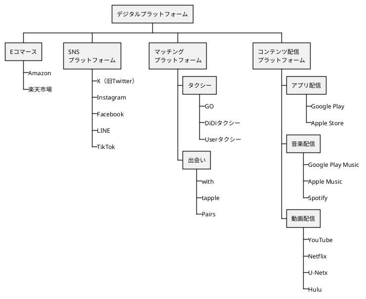
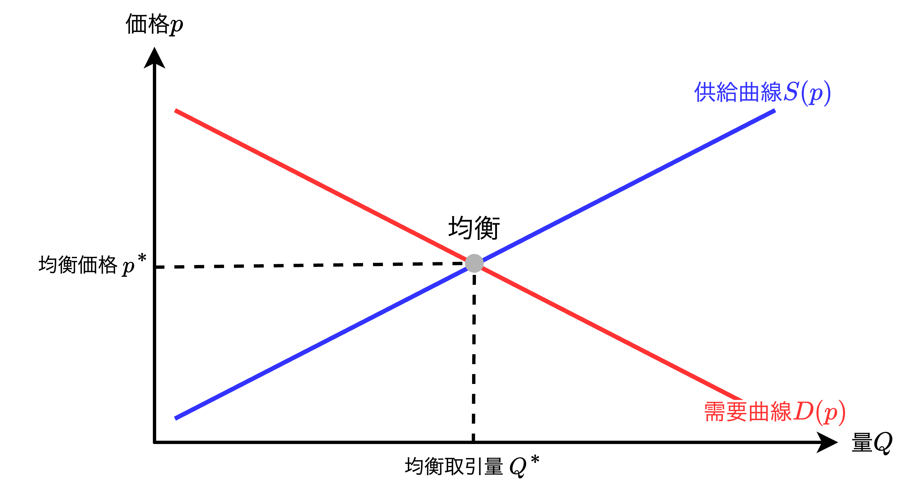
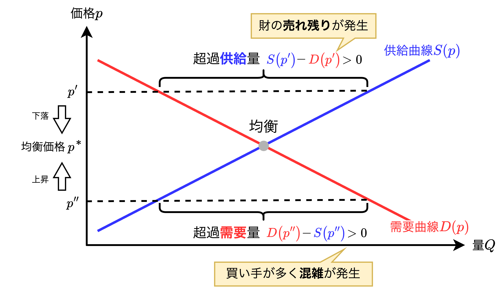
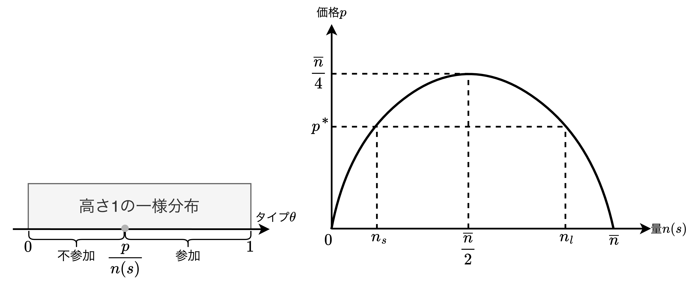
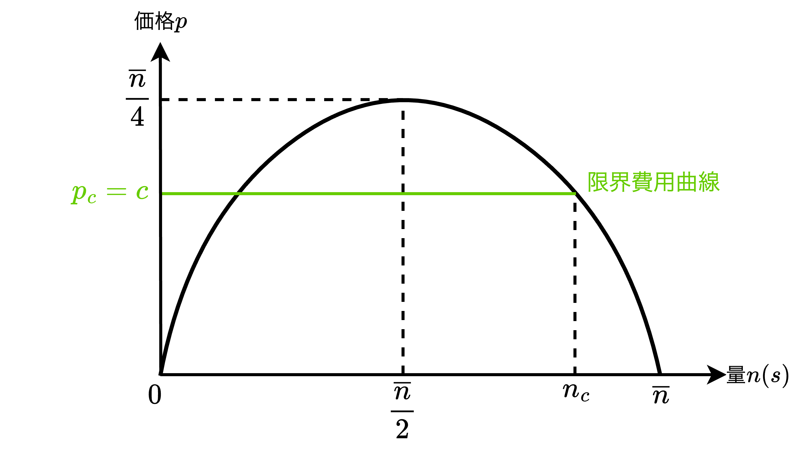
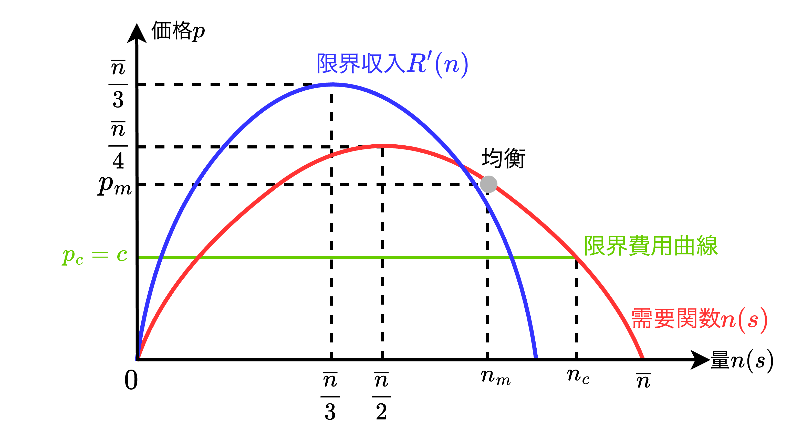

<div class="chap5">

# プラットフォームのデザイン

```plantuml
title 制度設計の実践プロセス
left to right direction

rectangle "【**第1段階：Input**】\n情報収集" as step1
rectangle "【**第2段階：Process**】\n計算" as step2
rectangle "【**第3段階：Output**】\n伝達" as step3

step1 --> step2
step2 --> step3
```

- **本章**ではプラットフォームを市場の仲介制度（ルール）として位置付けて、その特徴を紹介する。
- 制度設計を実践しようとすると次の3段階あることがわかった。ここで登場する3つはそれぞれが独立しておらず、相互依存関係にある。
  - 【**第1段階：情報収集**】制度の参加者から<font color=red>情報を収集すること</font>
  - 【**第2段階：計算**】収集された情報を用いて<font color=red>望ましい結果を計算すること</font>
  - 【**第3段階：伝達**】参加者に計算結果を<font color=red>伝えること</font>
- 参加者の増大に伴い上記の実践は難しくなる。**例えば**、コロナ禍でのワクチン予約では第1段階（情報収集）と第3段階（伝達）が困難である。また、第1段階が適切でないと第2段階（計算）が望ましくない結果になってしまう。
- 近年、デジタル技術の進展に伴い、情報の「**収集**」と「**伝達**」が容易になった。加えて、コンピュータの計算能力の向上や計算機科学の発展による「**計算**」の精度と速度も向上している。このような弊系からデジタルプラットフォームという材の売買や交換を行う場がインターネット上にも登場して新しくデザインされた制度が実践されてきている。

<div style="page-break-before:always"></div>

## プラットフォームの立ち位置

$$
【\bold{プラットフォーム}】\\
市場にいる参加者を結びつけて、\\参加者間での取引を可能にするような仲介の場
$$

```plantuml
title 【例】ショッピングセンター
left to right direction
rectangle ショッピングセンター as shopping_center {
    rectangle "【**売り手**】" as supplier {
        rectangle 小売店舗 as store
        rectangle テナント as tenant
        rectangle 映画館 as theater
    }
    actor "【**買い手**】\n顧客" as buyer
    buyer -- store
    buyer -- theater
    buyer -- tenant
}
note left of shopping_center
ショッピングセンターは
【**買い手ー売り手**】間の取引を
可能にする仲介の場
end note
```

- プラットフォームの典型例は「ショッピングセンター」や「ショッピングモール」である。ショッピングセンターには多くの小売り店舗や映画館、テナントなどの売り手が入居し、買い手である顧客と売り手を結びつけ、取引を可能にする仲介の場を提供している。
- 他にもプラットフォームの例としては以下が挙げられる。
  - 【**12世紀**】ヨーロッパのフランス北部、シャンパーニュ伯国で行われた定期的な交易市
  - 【**16世紀**】日本、織田信長により進められた楽市楽座（自由市場・自由取引の開放）
- プラットフォームは「ある特定の場所に立地して目立つ」ことで以下の特有の効果を持つ。
  - 買い手にも売り手にも欲しい材やサービスに出会うための<font color=red>探索費用を減らす効果</font>がある。
  - 買い手も売り手も多いほど（好みの財やサービスに出会う確率が増すので）プラットフォームを高く評価する（<font color=red>ネットワーク効果</font>）。

<div style="page-break-before:always"></div>

#### デジタルプラットフォームとその例



- 近年はインターネット上にプラットフォームが登場しており、以降、デジタルプラットフォームと呼ぶ。このデジタルプラットフォームは以下の4つに区分することができる。
  - 【**Eコマース**】<u>Amazonや楽天市場</u>など、ショッピングセンターのインターネット版と捉えられる。
  - 【**SNSプラットフォーム**】<u>X（旧Twitter）、Instagram、Facebook、LINE、TikTok</u>など、オープンなコミュニケーションを媒介するプラットフォーム。
  - 【**マッチングプラットフォーム**】<u>タクシーアプリGO、Uberタクシー、DiDiタクシー</u>など、配車サービスを提供するライドシェアプラットフォーム。また、<u>Pairs、with、tapple</u>など、男女の出会いを仲介するプラットフォームもある。
  - 【**コンテンツ配信型プラットフォーム**】<u>Google Play、Apple Store</u>など、アプリを提供するプラットフォーム。<u>Google Play Music、Spotify、Apple Music</u>など、音楽コンテンツを提供するプラットフォーム。<u>YouTube、Netflix、U-Next、Hulu</u>など、動画コンテンツを提供するプラットフォーム。

### 市場

$$
\begin{align*}
【\bold{市場とは}】&財を欲する意思決定者（需要者、買い手）と提供したい\\
&意思決定者（供給者、売り手）が存在し、財を取引する場    
\end{align*}
$$

- 一般的に市場とは、「**財には価格がついていて売り手は自由に価格をつけて競争し、買い手はその価格の下で自由に売り手を選んで好きなだけの量を購入する状況**」を想像するが、このような単純な市場(**完全競争市場**)はそれほど多くない。<font color=red>そこで本章では「市場」を上記のように広く捉える</font>。

### 伝統的な市場分析

#### 均衡とは



$$
【\bold{均衡}】D(p^*)=S(p^*)=Q^*
$$

- 一度、市場を伝統的な「**完全競争市場**」と捉え、どのように財やサービスの資源配分が達成されるかを見る。ここで、<u>**完全競争市場**とは「無数の売り手と買い手がいて、誰もが自由に市場に参加・退出でき、取引される商品は完全に同質で、情報も完全に共有されている理想的な市場」を言う</u>。
※完全競争市場において、企業や家計（消費者）が自らの行動で市場で決まった価格を変えられないという捉え方を「**プライステイカー(Price Taker)の仮定**」と呼ぶ。
- 上図は縦軸を価格$p$、横軸を量(生産数)としたグラフであり、需要曲線$D(p)$と供給曲線$S(p)$を図示している。$D(p)$と$S(p)$の交点を「**均衡**」と呼び、均衡における価格と量をそれぞれ「**均衡価格$p^*$**」と「**均衡取引量$Q^*$**」と呼ぶ。

<div style="page-break-before:always"></div>

#### 超過供給と超過需要



- 【$p'>p^*$】のケース、超過<font color=blue><b>供給</b></font>を考える。「<font color=blue>売り手が買い手を求めて競争している状態</font>」であり、超過供給を解消しようと均衡価格まで価格が下落していく。
- 【$p^*>p''$】のケース、超過<font color=red><b>需要</b></font>を考える。「<font color=red>買い手が財を求めて競争し、混雑している状態</font>」であり、混雑解消のために均衡価格まで価格が上昇する。<u>**しかし**、多くの市場では短期間で価格は混雑を調整できず、仲介制度（ルール）自体に混雑を解消ある岩緩和する仕組みが必要になる</u>。

### 市場が機能するために必要なこと

- 完全競争市場では「**均衡配分がパレート効率的になる**（厚生経済学の第1定理）」が成り立ち、「**参加者全員が均衡配分以上に得をするような買い手と売り手の取引が存在しない**」ことを意味する。
- 市場がうまく機能するとは、「市場参加者が特になる取引が実現」し、かつ「市場設計者が想定した望ましい配分が達成される」ことであり、そのためには以下の3要素が一般的に必要とされる。
  - 【**要素1：市場の厚み**】「市場の参加人数」を意味する。参加者の増加に伴い取引の機会が広がり、市場全体としてより魅力的になる（<font color=red>ネットワーク効果</font>）。
  - 【**要素2：混雑解消の仕組み作り**】市場の厚みが増すことによる「混雑を回避する仕組み作り」を意味し、参加者が多いと超過需要により混雑が発生し、取引まで至らない場合がある。
  - 【**要素3：安心・安全で簡素なルール**】「不信感を持たせない簡素さ」を意味する。参加者が財やサービスの情報（取引ルールや品質など）を不透明・曖昧だと感じてしまうと取引まで進まないことがある。

### 【プラットフォームの特徴】ネットワーク効果

$$
【\bold{ネットワーク効果（ネットワーク外部性）}】\\
参加者の増加により財やサービスの価値（効用）が高まる現象。\\[7mm]
\begin{align*}
\theta_in&：市場全体のネットワーク効果の影響度\\
\theta_i&：参加者\hspace{.5mm}i\hspace{.5mm}が受けるネットワーク効果の影響\\
n&：参加人数
\end{align*}\\[2mm]
\begin{align*}
\theta_i\left\{
    \begin{array}{l}
        >0\Rightarrow 参加者が増えることに得られる効用（\color{red}正の外部性\color{black}）\\
        =0\Rightarrow 外部性なし\\
        <0\Rightarrow 参加者が増えることに損失する効用（\color{blue}負の外部性\color{black}）
    \end{array}
\right.
\end{align*}
$$

- プラットフォームは買い手や売り手などの意思決定者が交流して経済活動を促す場であり、このようなプラットフォームが存在しないときは経済活動が難しくなる。このような<u>財やサービスの魅力が高まる現象を「**ネットワーク効果**」または「**ネットワーク外部性**」という</u>。
- 一般に**外部性**とは、「ある意思決定者の行動が他の意思決定者の経済厚生に金銭の保証なく影響を及ぼすこと」であり、その影響が良い場合は<font color=red>正の外部性</font>、悪い場合は<font color=blue>負の外部性</font>と呼ぶ。
- 一般的に外部性が存在する場合、外部性の発生源である意思決定者はその影響を考えずに意思決定をし、<font color=red>正の外部性の場合は過小な活動水準</font>、<font color=blue>負の外部性の場合は過大な活動水準</font>になる。
- 参加者にとって望ましい活動水準にするには<u>参加者が外部性を「**意識して**」決定することが重要であり、その制度的仕掛けを作る必要がある</u>。このような仕組みづくりを「**外部性の内部化**」という。

#### 【例】ネットワーク効果の事例

$$
【\bold{ネットワーク効果の効用}】u_i=v_i+\theta_in-p_i\\[2mm]
\begin{align*}
    v_i&：参加者\hspace{.5mm}i\hspace{.5mm}が何らかの活動をして得られる金銭単位で評価した効用値\\
    \theta_i&：参加者\hspace{.5mm}i\hspace{.5mm}が受けるネットワーク効果の影響\\
    n&：参加人数\\
    p_i&：参加者\hspace{.5mm}i\hspace{.5mm}の支払い
\end{align*}
$$

- 上記のネットワーク効果は簡単化のために参加者総数$n$に比例していると仮定しているが、**一般にはより複雑な非線形の関数と考えられる**。具体例として上式を示す。

<div style="page-break-before:always"></div>

## プラットフォームのデザイン

$$
【再定義：\bold{プラットフォーム}とは】\\
意思決定者が参加し、意思決定者の交流で生まれる
\\\color{red}ネットワーク効果\color{black}が積極的に管理される仲介の場。\\[5mm]
$$

```plantuml
title ネットワーク効果の仕掛け

cloud ネットワーク効果の仕掛け as effect
rectangle "情報の安全性・安心感を提供" {
  rectangle レーティング as trigger1
  rectangle レビュー as trigger2
}
rectangle レコメンド as trigger3

effect -- trigger1
effect -- trigger2
effect -- trigger3
```

- ネットワーク効果の定義を踏まえ、プラットフォームを再定義すると上記のようになる。プラットフォームの制度設計では、プラットフォームの強みの1つである「**ネットワーク効果**」を仲介制度（ルール）としてデザインし、管理することが重要である。<font color=red>ネットワーク効果の仕掛けとして有名なのは「<b>レーティング、レビュー、レコメンド</b>」である</font>。
  - 【**レーティング**】対象となる財について購入者がその評価を「**定量的**」に5段階などで評価するもの。評価人数なども表示されることが多い。
  - 【**レビュー**】対象となる財について購入者が財について「**定性的**」にさまざまな側面から自由にその感想を書いたもの。
  - 【**レコメンド**】過去の購入者の履歴データなどを用いてAIやアルゴリズムなどに計算させ、関心を持ちそうな関連する財を表示するもの。

<div style="page-break-before:always"></div>

## プラットフォームのモデル分析

- $5.1.2$節ではネットワーク効果がない伝統的な市場として完全競争市場を紹介した。**本節**ではBelleflamme and Peitz(2018)のモデルに従って、「**ネットワーク財**」というネットワーク効果を持つ財が取引される市場においてプラットフォームを紹介する。
- ネットワーク効果が存在すると「**価格**」だけでなくその「**プラットフォームの参加者数**」が意思決定に影響を及ぼす。

### ネットワーク財のモデル

$$
【\bold{式}】\\[2mm]
\begin{align*}
u_i(s_i,s_{-i};\theta)&=\left\{
  \begin{array}{l}
    \theta n(s)-p&,\hspace{1mm}s_i=Jの場合\\[1mm]
    0&,\hspace{1mm}s_i=Oの場合
  \end{array}
\right.\\[4mm]
S_i&=\left\{
  \begin{array}{l}
    J：参加\\[1mm]
    O：不参加（外部オプション）
  \end{array}
\right.\\[4mm]
n(s)&=\left|\hspace{.5mm}\{\hspace{.5mm}i\in N\hspace{1mm}|\hspace{1mm}s_i=J\hspace{.5mm}\}\hspace{.5mm}\right|
\end{align*}
\\[4mm]
【\bold{定数}】\\[2mm]
\begin{align*}
  N&：ユーザーの集合\hspace{15mm}\overline{n}：ユーザーの総数(=|N|)\\
  p&：プラットフォームの参加料金（p>0）
\end{align*}
\\[4mm]
【\bold{変数}】\\[2mm]
\begin{align*}
  S_i&：ユーザー\hspace{.5mm}i\hspace{.5mm}の戦略集合\hspace{4mm}u_i：ユーザー\hspace{.5mm}i\hspace{.5mm}のネットワーク効果の効用関数\\
  n(s)&：\color{red}需要関数\color{black}、参加者総数\hspace{4mm}\theta：ユーザータイプ。区間[0,1]の一様分布と仮定
\end{align*}
$$

- ユーザー$i$の効用関数を$u_i$とし、ユーザーが参加するか否かの戦略型ゲームを上式のように記述する。以降、$u_i$をベースに<font color=red>需要関数$n(s)$</font>を求める。
- 各ユーザーはプラットフォームに参加して財を1単位購入する（$s_i=J$）か、あるいは参加せずに財を購入しない（$s_i=O$：外部オプション）かの2つの戦略（選択肢）を持つ。

<div style="page-break-before:always"></div>

### 【ユーザの行動】需要関数$n(s)$の導出

$$
【ナッシュ均衡の条件】\bold{タイプ\thetaが参加する}\iff u_i(s_i,s_{-i};\theta)=\theta n(s)-p≧0
$$

- 前節で記述した戦略型ゲーム（静学ゲーム）を用いてナッシュ均衡における需要関数$n(s)$を求める。利得表で表されないようなゲームでは以下の手順でナッシュ均衡における$n(s)$を求める。
  1. 「**ナッシュ均衡を満たす条件**」を洗い出す。
  2. 洗い出した条件ごとに戦略の組の候補を洗い出す。
  3. 洗い出した条件に対する全ての戦略の組に対してナッシュ均衡であることを確認する。
  4. 確認したナッシュ均衡から需要関数$n(s)$を求める。
- 今回、ナッシュ均衡における需要関数$n(s)$は$n(s)=0$、$n(s)=\overline{n}$、$0<n(s)<\overline{n}$、の3つのケースで求める。結論から言うと以下の3つのナッシュ均衡が存在する。
  - 【**市場が成立しないパターン**】需要量0
  - 【**市場が小規模なパターン**】需要量$n_s$
  - 【**市場が大規模なパターン**】需要量$n_l$
- <font color=red>上記3パターンのうち、どのナッシュ均衡が実現するかは事前にはわからず「<b>予測不可能</b>」である。この克服方法は本章の最後で議論する</font>。

#### 【ケース1】$n(s)=0$ のとき

$$
u_i(s_i,s_{-i};\theta)=\theta n(s)-p=-p<0\\[2mm]
【\bold{ナッシュ均衡}】\Rightarrow あり\Rightarrow 参加しない
$$

- 上式より、$n(s)=0$の時はどの戦略に対しても負の値（$-p<0$）を取ることから**ユーザーは不参加が最適**となる。従って、ユーザーが参加しないことがナッシュ均衡となる。

#### 【ケース2】$n(s)=\overline{n}$ のとき(全員参加のとき)

$$
u_i(s_i,s_{-i};\theta)=\theta n(s)-p=\theta\overline{n}-p\\[2mm]
0≦\theta<\frac{p}{\overline{n}}のとき\hspace{2mm}\theta\overline{n}-p<0\\[2mm]
【\bold{ナッシュ均衡}】\Rightarrow 存在しない
$$

- 上式より、$n(s)=\overline{n}$のとき、つまり全員参加のとき、$0≦\theta<\frac{p}{\overline{n}}$ のタイプ$\theta$は不参加を選ぶ。従って、**全員参加（$n(s)=\overline{n}$）となるようなナッシュ均衡は存在しない**。

<div style="page-break-before:always"></div>

#### 【ケース3】$0<n(s)< \overline{n}$ のとき



$$
u_i(s_i,s_{-i};\theta)=\theta n(s)-p=0\hspace{1mm}\iff\hspace{1mm}\theta=\frac{p}{n(s)}\hspace{2mm}
\therefore\hspace{2mm}\theta\left\{
  \begin{array}{l}
    ≧\displaystyle{\frac{p}{n(s)}}\Rightarrow 参加\\[4mm]
    <\displaystyle{\frac{p}{n(s)}}\Rightarrow 不参加
  \end{array}
\right.\\[3mm]
【\bold{需要関数}n(s)】\\[2mm]
\begin{align*}
n(s)=\overline{n}\left(1-\displaystyle{\frac{p}{n(s)}}\right)&\iff n^2(s)-\overline{n}n(s)+\overline{n}p=0\\[2mm]
&\iff n(s)=\frac{\overline{n}}{2}\left(1\pm\sqrt{1-\frac{4p}{\overline{n}}}\right)
\end{align*}\\
if\hspace{2mm}0≦\sqrt{1-\frac{4p}{\overline{n}}}\hspace{2mm}and\hspace{2mm}0<p\iff 0<p≦\frac{\overline{n}}{4}\\[6mm]
【\bold{逆需要関数}p】\\[2mm]
\begin{align*}
n^2(s)-\overline{n}n(s)+\overline{n}p=0&\iff p=-\frac{1}{\overline{n}}\left(n(s)-\frac{\overline{n}}{2}\right)^2+\frac{\overline{n}}{4}
\end{align*}\\[3mm]
【\bold{ナッシュ均衡}】\Rightarrow あり\Rightarrow 参加する\left\{
  \begin{array}{l}
    \displaystyle{n_s=\frac{\overline{n}}{2}\left(1-\sqrt{1-\frac{4p}{\overline{n}}}\right)}\Rightarrow 市場が小規模\\[6mm]
    \displaystyle{n_l=\frac{\overline{n}}{2}\left(1+\sqrt{1-\frac{4p}{\overline{n}}}\right)}\Rightarrow 市場が大規模
  \end{array}
\right.
$$

### 価格戦略

- 前項で導出したユーザーの需要行動$n(s)$をもとに参加料金$p$の設定を行う。ここで、プラットフォーム企業は1人のユーザー当たり$c>0$の費用がかかり、固定費用はかからないとする。つまり、参加者総数$n$のときの総費用は$nc$であり、限界費用(1つの財・サービスを追加する際の費用)は$c$となる。

#### (1) 完全競争市場(企業が無数にある)



$$
n_l=\frac{\overline{n}}{2}\left(1+\sqrt{1-\frac{4p}{\overline{n}}}\right)\\[3mm]
n_c=n_l、p=p_c=cを代入すると、均衡取引量n_cが定まる。\\[2mm]
【\bold{均衡取引量}】n_c=\frac{\overline{n}}{2}\left(1+\sqrt{1-\frac{4c}{\overline{n}}}\right)\hspace{2mm}ただし\hspace{2mm}0<c(=p_c)≦\frac{\overline{n}}{4}
$$

- 最初はベンチマークとして完全競争市場から始める。**完全競争市場**ではネットワーク財を提供する企業が無数にあり、企業はプライステイカーで価格（参加料金$p$）を所与として行動する。
- 完全競争市場での価格を$p_c$とする。このとき、ミクロ経済学の企業理論によると企業は価格と限界費用$c$が等しくなるように供給量を選ぶ。つまり、$p_c=c$が成り立つ。<font color=red>ナッシュ均衡は3つ（$0,n_s,n_l$）が考えられるが、本節では最も大きい均衡取引量$n_l$を$n_c$として扱う</font>。

#### (2) 独占市場(企業が1社のみ)



$$
\begin{align*}
【\bold{収入}R(n)と\bold{利潤}\pi(n)】&R(n)=p\times n=n^2\left(1-\frac{n}{\overline{n}}\right)\hspace{5mm}\pi(n)=R(n)-cn\\[3mm]
【\bold{限界収入}】&\frac{\delta R(n)}{\delta n}=-\frac{3}{\overline{n}}n^2+2n=-\frac{3}{\overline{n}}\left(n-\frac{\overline{n}}{3}\right)^2+\frac{\overline{n}}{3}\\[4mm]
【\bold{利潤の最大化}】&\frac{\delta \pi(n)}{\delta n}=-\frac{3}{\overline{n}}n^2+2n-c=0\hspace{1mm}
\end{align*}\\[3mm]
\frac{\delta \pi(n)}{\delta n}=0の大きい方の解がn_mであるため、これを解くと
\hspace{3mm}\underline{\bold{n_m=\frac{\overline{n}}{3}\left(1+\sqrt{1-\frac{3c}{\overline{n}}}\right)}}\\
また、\color{red}n_m\color{black}<\color{blue}n_c\color{black}\hspace{1mm}であることから\hspace{1mm}\color{blue}p_c\color{black}<\color{red}p_m
$$

- 次に独占市場を考える。独占市場ではプラットフォームを提供する企業が1つだけのであり、ナッシュ均衡が複数ある場合、その独占企業は最も需要量の大きい$n_l$がナッシュ均衡として現れると仮定する。このときの$n_l$を特に$n_m$として独占的なプラットフォーム企業の収入$R(n_m)$を求める。
- $R(n_m)$の限界収入$R'(n_m)$は以下の手順で求める。
  1. 利潤$\pi(n)=R'(n)-cn$を求める。
  2. $\pi'(n)=0$となる$n_m$を求める。**解が複数ある場合**はその中の最大値を$n_m$とする。
- 上記の結果から、<font color=red>独占市場の市場規模（参加者総数）は完全競争市場よりも小さくなるが、参加料金は高くなることがわかる</font>。

#### (3) 総余剰を最大化する市場規模

$$
【総余剰W(n)の定義】\\[2mm]
\begin{align*}
  W(n)&=\overline{n}\times\int_{1-\frac{n}{\overline{n}}}^1n\theta\hspace{1mm}d\theta-cn=\overline{n}n\left[\frac{1}{2}\theta^2\right]_{1-\frac{n}{\overline{n}}}^1-cn=-\frac{1}{2\overline{n}}n^3+n^2-cn
\end{align*}
\\[4mm]
【W(n)の最大化】\\[2mm]
\begin{align*}
  W(\overline{n})-W(n)&=\left(-\frac{1}{2\overline{n}}\overline{n}^3+\overline{n}^2-c\overline{n}\right)-\left(-\frac{1}{2\overline{n}}n^3+n^2-cn\right)\\[4mm]
  &=-\frac{1}{2\overline{n}}(\overline{n}^3-n^3)+(\overline{n}^2-n^2)-c(\overline{n}-n)\\[4mm]
  &=-\frac{1}{2\overline{n}}(\overline{n}-n)(\overline{n}^2+\overline{n}n+n^2)+(\overline{n}-n)(\overline{n}+n)-c(\overline{n}-n)\\[4mm]
  &=\frac{\overline{n}-n}{2\overline{n}}\left\{-(\overline{n}^2+\overline{n}n+n^2)-2\overline{n}(\overline{n}+n)+2\overline{n}c\right\}\\[4mm]
  &=\frac{\overline{n}-n}{2\overline{n}}\left\{\overline{n}^2+n(\overline{n}-n)-\color{red}2\overline{n}c\color{black}\right\}≧\frac{\overline{n}-n}{2\overline{n}}\left\{\overline{n}^2+n(\overline{n}-n)-\color{red}\frac{\overline{n}^2}{2}\color{black}\right\}\\[4mm]
  &=\frac{\overline{n}-n}{2\overline{n}}\left\{\frac{\overline{n}^2}{2}+n(\overline{n}-n)\right\}>0
  \hspace{3mm}
  \left(if\hspace{3mm}0<n<\overline{n}\hspace{3mm}and\hspace{3mm}0<c≦\frac{\overline{n}}{4}\right)
\end{align*}\\[2mm]
従って、\underline{\color{red}総余剰W(n)はn=\overline{n}のとき最大化される}
$$

- パレート効率的な市場規模（参加者総数）を考える。パレート効率的な配分は「**総余剰を最大化**」することで求められる。
- 【**総余剰$W(n)$の定義について**】$W(n)$は市場全体$\overline{n}$のユーザーの効用和から総費用$cn$を差し引いたものである。ここで、タイプ$\theta$の積分範囲は$[\theta,1]$であり、$\theta=1-\frac{n}{\overline{n}}$である。
- 【**$W(n)$の最大化について**】$0<n<\overline{n}$における任意の$n$において、総余剰$W(n)$を最大にする需要量は$n=\overline{n}$である。つまり、<font color=red>完全競争市場と独占市場のどちらもそう余剰を最大化するには不十分な市場規模である</font>。

<div style="page-break-before:always"></div>

#### まとめ

$$
【\bold{独占市場と完全競争市場の比較}】\\
独占市場(monopoly)は完全競争市場(competition)より参加者nは少ないが価格pは高い\\[2mm]
\color{red}n_m\color{black}<\color{blue}n_c\color{black}（<\overline{n}）\hspace{2mm}かつ\hspace{2mm}\color{blue}p_c\color{black}<\color{red}p_m\color{black}\\[4mm]
\begin{align*}
【\bold{結論1}】&独占市場(monopoly)は完全競争市場(competition)\\
&よりも市場規模が小さくなり、料金も高く設定される。\\[5mm]
【\bold{結論2}】&独占市場(monopoly)は完全競争市場(competition)のどちらも\\
&総余剰を最大化するには不十分な市場規模になる。
\end{align*}
$$

- 【**結論1について**】ネットワーク効果の有無に関わらず<font color=red>独占市場全般に通じる結果</font>である。【**結論2について**】<font color=red>ネットワーク効果特有の結果</font>である。**つまり**、<u>ネットワーク効果がない完全競争市場では総余剰の最大化が達成されるが、ネットワーク効果がある場合は独占市場だけでなく完全競争市場でも総余剰最大化が達成されない</u>ことを示している。
- 完全競争市場では価格は市場で決まるので価格戦略はプラットフォーム企業の戦略の範囲にない。一方、価格を操作できる独占市場においては、①参加者が全くいない均衡、②中規模の均衡（需要量$n_s$）、③大規模な均衡（需要量$n_l$）、が潜在的に存在し、③の実現が望ましい。
- 本性で検討したモデルはプラットフォームに参加するかどうかの意思決定は同時に決定されるとしたが、実際は2つの考慮事項も必要になる。
  - 【**考慮事項1**】時間経過とともに意思決定は行われるため、ユーザーは意思決定のタイミングで市場規模を観察できる場合もある。
  - 【**考慮事項2**】モデルでは他ユーザーに与える外部性がユーザー間で均一としたが現実には「インフルエンサー」などの外部性の大きいユーザーも存在する。
- 上記の2つを考慮してプラットフォーム企業では「**シーディング戦略**」という戦略も選択肢の一つとなる。**シーディング戦略**とは、「インパクトのあるユーザー（インフルエンサーや有名な大テナントなど）を呼び込み、彼らに引き連れられてユーザーの参加を促す戦略」を指す。このように多くの企業では、<font color=red><b>シーディング戦略</b>に加え、前述した<b>レーティング、レビュー、レコメンド</b>を行い、ネットワーク効果創出を目指している</font>。


