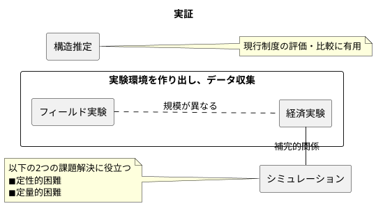

<div class="chap6">

# 実証



<table>
	<tbody>
		<tr>
			<th>実験名</th>
			<th>メリット</th>
			<th>デメリット</th>
		</tr>
		<tr>
			<td><b>経済実験</b></td>
			<td valign=top>
            ◼選好などのパラメータを<br>
            　統制できる<br>
            ◼被験者の振る舞い結果を<br>
            　データとして収集できる
            </td>
			<td valign=top>
            ◼多くは大学の実験室で行われ、<br>
            　被験者は大学生である。<br>
            ◼実験結果が異なる集団や状況には<br>
            　当てはまらない可能性がある<br>
            　（<font color=red>一般可能性・外的妥当性の問題</font>）
            </td>
		</tr>
		<tr>
			<td><b>フィールド実験</b></td>
			<td valign=top>
            ◼高精度に理論の有効性・<br>
            　妥当性を評価できる
            </td>
			<td valign=top>
            ◼選好などのパラメータの<br>
            　統制がしにくい。<br>
            ◼費用が膨大になりやすい<br>
            　（数千万円〜数億円規模）
            </td>
		</tr>
		<tr>
			<td><b>構造推定</b></td>
			<td valign=top>
            ◼行動の基となる選好の<br>
            　パラメータを推定可能。<br>
            ◼現行制度を評価・比較できる
            </td>
			<td valign=top>
            ◼新しい市場を作り出すことは<br>
            　できない。<br>
            ◼観察データが存在しない場合は<br>
            　使えない。
            </td>
		</tr>
		<tr>
			<td><b>シミュレーション</b></td>
			<td valign=top>
            ◼<b>定性</b>的困難をある程度<br>
            　克服できる<br>
            ◼<b>定量</b>的困難をある程度<br>
            　克服できる
            </td>
			<td valign=top>
            ◼仮想データを用いており、<br>
            　被験者の実データを収集できない
            </td>
		</tr>
	</tbody>
</table>

- 私たちが対象とする「制度」は意思を持つ人間の行動選択で成否が決まるため、<font color=red>設計した制度が現実の人間の行動選択により望ましい結果を達成できるかどうか確認し、調整する必要がある</font>。
- **本章**では、経済実験、フィールド実験、構造推定、シミュレーション（数値計算実験）、を取り上げ、マッチング市場を例としてマーケットデザインにおいてそれぞれが果たす役割を解説する。

## 経済実験

### 経済実験の役割

- 経済実験は、「**想定している環境を実験室で仮想的に作り出し、選好などの実際には観測できないパラメータを統制した上で、被験者の振る舞いデータを収集して理論と照合する実験**」である。<font color=red>マーケットデザインにおける経済実験の役割は「<b>設計した制度が制度設計者（政策立案者）が想定するような結果になるかどうかを経済実験で確かめること</b>」である</font>。
- Roth(1995)は経済実験を3つに分類している。
  - 【**理論家への話しかけ（Speaking to Theorists）**】明確に記述された理論の予測を検証し、予測されなかった規則性を観察するようにデザインされた実験。
  - 【**事実の探索（Searching for Facts）**】既存の理論では確認できない事実についてデザインされた実験。
  - 【**君主の耳元への囁き（Whispering in the Ears of Princes）**】経済実験実施者と政策立案者（制度設計者）との対話において、政策立案者を説得させるための実験。例えば、「市場のデザインの変更がどういう影響を与えるのか」など。<font color=red>マーケットデザインにおける経済実験の分類はここに当たる</font>。

### 【経済実験の例】学校選択問題

- マーケットデザインにおける経済実験の有効性を示した例として、Chen and Sonmez(2006)の学校選択制度におけるマッチングメカニズムの実験がある。学校選択問題は入学予定の生徒をどの公立学校に割り当てるかという問題であり、Abdulkadiroglu and Sonmez(2003)によってモデル化がなされた。
- 学校選択問題は、生徒は意思決定者として扱い、学校は受身的で意思決定者とは扱わない。このような多対1マッチング問題で一方の側が意思決定者でない問題は、一般的に「**非分割財配分問題**」と呼ばれ、対応策として「**耐戦略性のある**」DA（Deferred Acceptance：受け入れ保留）メカニズムとTTC（Top Trading Cycles）メカニズムが有名である。
※**非分割財**とは自動車やパソコンのように分割するとその財の価値がなくなるような単位が存在する財

<div style="page-break-before:always"></div>

#### 学校選択問題の定義

$$
【\bold{学校問題選択の定義}】[I,S,P_I,P_S,q]\\[3mm]
\begin{align*}
    I=\{i_1,i_2,\dots,i_n\}&：生徒の集合\\
    S=\{s_1,s_2,\dots,s_m\}&：学校の集合\\
    P_I=(P_i)_{i\in I}&：生徒の選好の組\\
    P_S=(P_s)_{s\in S}&：学校の選好（優先順序）の組\\
    q=(q_s)_{s\in S}&：学校の定員ベクトル
\end{align*}
$$

- 学校選択問題は$n$人の生徒$i$、$m$個の学校$s$があり、生徒と学校はそれぞれが選好$P_i$と$P_s$を持つ。また、学校$s$は学生を定員$q_s$まで受け入れることができ、また、$P_s$は外性的な基準（住居学区やその学校に通学している兄弟姉妹の有無など）によって決まる。
- 【**歴史**】従来、世界各国で用いられていた制度は「**通学区域制度**」と呼ばれ、生徒の選好は反映されない。そこで、生徒の選考を反映させるようなメカニズムが導入され始めている。アメリカでは通学区域制度の代わりとして先着順メカニズムが導入され始めたが、「**耐戦略性がない**」問題があり、嘘の選好を報告するインセンティブがある。Abdulkadiroglu and Sonmez(2003)は改善案としてSPを満たすDAメカニズムとTTC(Top Trading Cycles)メカニズムを提案し、改善案の有効性評価には**経済実験が有効**であることを述べている。
- **次節**では、経済実験がどういうものかを理解するために簡単な例を通じて実験を行う。

<div style="page-break-before:always"></div>

#### 【経済実験】学校選択マッチングメカニズム

$$
【\bold{実験環境}】\\[1mm]
\begin{align*}
    I=\{i_1,i_2,i_3\}&：生徒の集合\\
    S=\{s_1,s_2,s_3\}&：学校の集合\\
    P_I=(P_{i_1},P_{i_2},P_{i_3})&：生徒の選好の組\\
    P_S=(P_{s_1},P_{s_2},P_{s_3})&：学校の選好（優先順序）の組\\
    q=(1,1,1)&：学校の定員ベクトル
\end{align*}\\[3mm]
【\bold{選好リスト}】\\[1mm]
\begin{align*}
    【生徒側の真の選好】&
    P_{i_1}：s_1,s_2,s_3,\emptyset\hspace{7mm}
    P_{i_2}：s_1,s_2,s_3,\emptyset\hspace{7mm}
    P_{i_3}：s_2,s_1,s_3,\emptyset\\[1mm]
    【学校側の選好】&
    P_{s_1}：i_2,i_1,i_3,\emptyset\hspace{8mm}
    P_{s_2}：i_1,i_2,i_3,\emptyset\hspace{8mm}
    P_{s_3}：i_1,i_2,i_3,\emptyset
\end{align*}
$$

- 【**実験の目的**】先着順メカニズムと生徒提案型DAアルゴリズムではどちらの虚偽報告が多いかを検証する。
- 【**実験の設計**】被験者に生徒役になってもらい、ランダムに対照群と介入群に分ける。対照群は先着順アルゴリズム、介入群にはDAメカニズムに参加してもらい、<font color=red>メカニズム間での虚偽報告の割合を調べる</font>。
  - 【**介入群**】新制度の導入、価格変更、情報提供などの研究者が意図した特定の介入を受けるグループ。
  - 【**対照群**】介入を受けないグループ。介入（処置）の効果を測定・評価するための「基準」となるグループ。
- 【**実験の前提条件**】
  - 全ての生徒が他の生徒の選好を知っている。
  - 提出した選好を真とするために、**被験者に金銭的報酬**を与える。第1志望、第2志望、第3志望それぞれマッチした時$3,000$円、$2,000$円、$1,000$円の報酬が与えられる。それ以外は0円という報酬になる。
  - 全ての生徒は学校の選好（優先順序）を知っている。
- 【**実験結果・考察**】
  - 上記の実験について、Chen and Sonmez(2006)は虚偽報告率が先着順メカニズムが約$86\%$、DAメカニズムが約$28\%$であった。DAメカニズムは先着順メカニズムより虚偽報告率が低いものの、理論通り$0\%$ではない。つまり、<font color=red>被験者は必ずしも理論通りに行動しないこと</font>が実験から観測できる。
  - 経済実験の被験者は実験のために集められた人々であり、「現実の市場に参加する人々と異なる」。よって、**経済実験は外的妥当性（一般可能性）が問題になる**ことは念頭におく必要がある。

<div style="page-break-before:always"></div>

##### 【実験結果1】先着順メカニズムの結果

$$
【\bold{真の選好における結果}】\\[1mm]
i_1\hearts s_3\hspace{3mm}i_2\hearts s_1\hspace{3mm}i_3\hearts s_2\\[4mm]
【\bold{生徒i_1の虚偽申告による結果}】\\[1mm]
i_1\hearts \color{red}s_2\color{black}\hspace{3mm}i_2\hearts s_1\hspace{3mm}i_3\hearts \color{red}s_3\color{black}\\[1.5mm]
（if\hspace{3mm}虚偽選好P'_{i_1}：s_2,s_1,s_3,\emptyset）
$$

- まず、真の選好におけるメカニズムでは、以下の流れでマッチングが決まる。
  - 【**ステップ1**】生徒$i_1,i_2$が学校$s_1$に応募し、生徒$i_3$が学校$s_2$に応募した後、$s_1$は$i_2$を受け入れ、$s_2$は$i_3$に受け入れ、$i_1$が$s_1$から受け入れ拒否される。
  - 【**ステップ2**】$i_1$は第2志望の$s_2$に応募するが$s_2$は相手がいるため、受け入れ拒否される。
  - 【**ステップ3**】$i_1$は第3志望の$s_3$に応募し、$s_3$に受け入れられ、終了する。
- 次に、$i_1$が虚偽の選好でメカニズムでは、以下の流れでマッチングが決まる。
  - 【**ステップ1**】生徒$i_1,i_3$が学校$s_2$に応募し、$i_2$が学校$s_1$に応募した後、$s_1$は$i_2$を受け入れ、$s_2$は$i_1$を受け入れ、$i_3$は受け入れ拒否される。
  - 【**ステップ2**】$i_3$は第2志望の$s_1$に応募するが$s_1$は相手がいるため、受け入れ拒否される。
  - 【**ステップ3**】$i_3$は第3志望の$s_3$に応募し、$s_3$に受け入れられ、終了する。
- このように先着順メカニズムだと、<font color=red>生徒$i_1$は虚偽の選好を報告したほうがインセンティブがある、つまり、<b>耐戦略性がない</b></font>。

##### 【実験結果2】生徒提案型DAメカニズムの結果

$$
【\bold{真の選好における結果}】\\[1mm]
i_1\hearts s_2\hspace{3mm}i_2\hearts s_1\hspace{3mm}i_3\hearts s_3\\[4mm]
$$

- DAメカニズムでは以下の流れでマッチングが決まる。
  - 【**ステップ1**】生徒$i_1,i_2$が学校$s_1$に応募し、$i_3$が学校$s_3$に応募した後、$s_1$は$i_2$を「仮に」受け入れ、$s_2$は$i_3$を「仮に」受け入れ、$i_1$は$s_1$から受け入れ拒否される。
  - 【**ステップ2**】$i_1$は第2志望の$s_2$に応募した後、$s_2$は「仮受け入れ中」の$i_3$と合わせて$i_1$を「仮に」受け入れ、$s_3$が受け入れ拒否される。
  - 【**ステップ3**】$i_3$は第3志望の$s_3$に応募し、$s_3$は$i_3$を「仮に」受け入れる。
  - 【**ステップ4**】$s_1,s_2,s_3$は「仮に」受け入れている生徒を正式に受け入れ、処理を終了する。
- このように、<font color=red>生徒提案型DAメカニズムは「<b>耐戦略性がある</b>」ため、生徒は拒否報告するインセンティブがない</font>。

<div style="page-break-before:always"></div>

## フィールド実験

### フィールド実験の役割

- 経済実験の問題点は以下の通り。
  - 【**問題点1**】多くは大学の実験室で行われ被験者は大学生である。
  - 【**問題点2**】実験結果が異なる集団や状況にも当てはまらない可能性がある（<font color=red>一般可能性・外的妥当性の問題</font>）
- フィールド実験はこの問題を解決する。フィールド実験は、「**高精度に理論の有効性を評価するために、実際の環境を用いてデータを収集する実験**」である。ただし、フィールド実験は、<u>実験費用が非常に高くなる場合が多く、選好の統制が弱くなりやすい</u>。
【**補足**】経済実験は数十万〜数百万円、フィールド実験は数千万円から数億円の費用がかかる。
- 経済実験と同様、<font color=red>マーケットデザインにおけるフィールド実験の役割は「<b>設計した制度が制度設計者（政策立案者）が想定するような結果になるかどうかを経済実験で確かめること</b>」である</font>。
- Harrison and List(2004)はフィールド実験を3つに分類した。
  - 【**人工型フィールド実験(Artefactual Field Experiment)**】<u>一般人を被験者とした経済実験</u>。被験者は自分が実験に参加していることを自覚しており、人々が実験の対象であると自覚することにより行動が変化してしまうという「**ホーソン効果**」が問題となる。
  - 【**枠組み型フィールド実験(Framed Field Experiment)**】<u>被験者は任意とし、財・サービス、作業、得られる情報など実際の生活の中で行われる実験</u>。実験環境を現実に近づけること以外は人工型フィールド実験と同じであり、「**ホーソン効果**」の可能性は残る。
  - 【**自然型フィールド実験(Natural Field Experiment)**】<u>被験者が実験に参加していることを「自覚しない」実験</u>。人工型・枠組み型のフィールド実験との違いは、「**ホーソン効果**」を取り除いている点である。

### フィールド実験の例

- 以下に示すさまざまな経済実験でDAとTTCのメカニズムは真実報告率が$100\%$ではなく、「<font color=red>理論と実践との間にギャップがある</font>」ことがわかっている。
  - 【**Calsamiglia, Haeringer, and Klijn(2010)の報告**】DAの真実報告率$57〜58\%$、TTCの真実報告率$62〜74\%$
  - 【**Pais and Pinter(2008)の報告**】DAの真実報告率$67〜82\%$、TTCの真実報告率$87〜96\%$
  - 【**Pais, Pinter, and Veszteg(2011)の報告**】DAの真実報告率$58〜76\%$、TTCの真実報告率$62〜84\%$
- 上記を踏まえ、「**どのようなメカニズムの情報**」が真実報告を引き出すことに寄与するのかを調べるためにGuillen and Hakimov(2018)はフィールド実験を行った。

#### 【フィールド実験】真実報告を引き出すための学生への市場調査に関するレポート

<table>
  <caption>3つのグループ</caption>
	<tbody>
		<tr>
			<th></th>
			<th>メカニズムの詳細</th>
			<th>使用するメカニズムの「<b>耐戦略性</b>」について<br>（真実報告が最適であること）</th>
		</tr>
		<tr>
			<th>対照群</th>
			<td>知らせる</td>
			<td>知らせない</td>
		</tr>
		<tr>
			<th>介入群1</th>
			<td>知らせない</td>
			<td>知らせる</td>
		</tr>
		<tr>
			<th>介入群2</th>
			<td>知らせる</td>
			<td>知らせる</td>
		</tr>
	</tbody>
</table>

- 【**実験の目的**】「どのようなメカニズムの情報」が真実報告を引き出すことに寄与するのかを検証する。メカニズムは**TTCメカニズム（効率性重視のアルゴリズム）** を用いる。
- 【**実験の設計**】シドニー大学700人以上の大学1年生を対象に3つのトピックから1つを選びレポートを書いてもらう。講義の途中で3つのトピックを紹介した後、全学生は選びたいトピックを報告する。この時点では選んだトピックが実際のトピックになると学生は考えたと思われるため、この選んだトピックを第1志望度の選好として真実報告の分析に用いる。トピック報告後、メカニズムを用いてトピックの選好を改めて報告してもらう。対照群と介入群は上表の通り。
- 【**実験の前提条件**】※どれも実験結果に影響はない
  - 3つのトピックはスマートフォン、テレビセット、スキャナーがある。
  - レポート課題の得点は成績の$15\%$
- 【**実験結果・考察**】
  - 真実報告の第1志望の選好とメカニズム説明後の選好が異なる報告を調べた。対照群は$18.77\%$、介入群1は$5.66\%$、介入群2は$8.89\%$であった。
  - <font color=red>メカニズムの詳細を伝えるよりもむしろ、「<b>メカニズムの性質だけ</b>」を伝えたほうが虚偽報告が少なくなる</font>という結果が得られた。

<div style="page-break-before:always"></div>

## 構造推定

### 構造推定の役割

- 構造推定は「**人々の行動の基となる選好のパラメータを推定するために、選好や制度を含めた理論モデルを先に特定化した上で、観察データを用いて行う実験**」である。**一方で**、以下のデメリットがある。
  - 【**デメリット1**】新しい市場を作り出すことはできない。
  - 【**デメリット2**】観察データが存在しない場合は精度評価できない。
- 他方で構造推定とは別に、誘導型推定は「**理論モデルの特定化を行わずに関心のある変数を推定する実験**」であるが、マーケットデザインは精度の違いに焦点を当てるため、構造推定が特に役に立つ。
- 構造推定を用いれば様々な視点から制度を分析することができ、Agarwal and Budish(2021)は以下のような視点を挙げている。
  - 【**市場の失敗の診断（Diagnosing Market Failures）**】マーケットデザインでは制度の細部が市場の結果に大きな影響を与えることが報告されており、現行制度を観察データを用いて診断することは制度設計に必要な視点である。
  - 【**デザインの評価と比較（Evaluating and Comparing Designs）**】現行制度から得られた観察データを基に制度から独立した選好を推定し、他の制度での人々のパフォーマンスを測定する（<font color=red>反実仮想シミュレーション</font>）。これにより、様々な制度の有効性を確認できる。
  - 【**新しい市場設計の提案（Proposing New Market Designs）**】上記2つの視点から現行制度を評価・比較し、より望ましい制度の洞察を発見し、科学的根拠が得られる。

### 構造推定の例

- 研修医制度は医学部を卒業したばかりの医学生が研修医として病院で研鑽を積みキャリアを形成するための制度である。
- 米国でも日本でも研修医制度はDAメカニズムが用いられており、僻地病院定理により、僻地の病院は定員不足を解消できない。そこで、「僻地の病院の賃金を高くする」という僻地病院の順位を高くする施策がある。
- 上記を踏まえ、Agarwal(2017)は研修医に対するインセンティブ付けを構造推定を用いて検討した。

<div style="page-break-before:always"></div>

#### 【構造推定】家庭医プログラムのデータを用いた構造推定

$$
【\bold{登場人物}】\\[1mm]
i：研修医\hspace{10mm}j：病院\\[4mm]
【\bold{研修医が得られる効用}】\\[1mm]
u_{ij}=U(\mathcal{z}_{ij},\xi_j,\eta_i)\\[3mm]
\begin{align*}
  u_{ij}&：研修医\hspace{.5mm}i\hspace{.5mm}が病院\hspace{1mm}j\hspace{1mm}とマッチした時に得られる効用\\
  \mathcal{z}_{ij}&：研修医\hspace{.5mm}i\hspace{.5mm}と病院\hspace{.5mm}j\hspace{.5mm}間で観測される特性（賃金など）\\
  \xi_{j}&：病院\hspace{.5mm}j\hspace{.5mm}特有の観測されない特性（文化、人間関係など）\\
  \eta_{i}&：研修医\hspace{.5mm}i\hspace{.5mm}特有の観測されない特性（個人的な好み、嗜好性）\\
\end{align*}\\[4mm]
【\bold{病院が得られる効用}】\\[1mm]
h_{ji}=H(\mathcal{x}_{ji},\epsilon_i,\nu_j)\\[3mm]
\begin{align*}
  h_{ji}&：病院\hspace{.5mm}j\hspace{.5mm}が研修医\hspace{.5mm}i\hspace{.5mm}とマッチした時に得られる効用\\
  \mathcal{x}_{ji}&：研修医\hspace{.5mm}i\hspace{.5mm}と\hspace{.5mm}j\hspace{.5mm}間で観測される特性（賃金など）\\
  \epsilon_{i}&：研修医\hspace{.5mm}i\hspace{.5mm}特有の観測されない特性\\
  \nu_{j}&：病院\hspace{.5mm}j\hspace{.5mm}特有の観測されない特性（病院の個別な好み）\\
\end{align*}
$$

- 【**実験の目的**】僻地病院の定員不足を解消するための研修医に対する有効なインセンティブの発見。
- 【**実験の設計**】研修医と病院それぞれが得られる効用関数を定義し、観測不可の変数を確率分布に従うと仮定した後、効用関数のパラメータ推定を行う。データは家庭医プログラムのものを使用し、反実仮想として現行給与から上乗せされた報酬インセンティブがマッチング結果にどのように影響するのかを分析する。
- 【**実験の前提条件**】
  - 特記事項なし。
- 【**実験結果・考察**】
  - 報酬インセンティブにより僻地病院を志望する研修医が増えた。具体的には、<font color=red>報酬インセンティブが$5,000$ドルの時は$310\rightarrow 320(10人増加)$、$10,000$ドルの時は$310\rightarrow 327(17人増加)$、$50,000$ドルの時は$310\rightarrow 330(20人増加)$</font>、となった。

<div style="page-break-before:always"></div>

## シミュレーション（数値計算実験）

### シミュレーションの役割

```plantuml
title シミュレーションの役割
left to right direction

rectangle 経済実験 as exp1
rectangle シミュレーション as exp2

exp1 -- exp2: 補完的関係
note top of exp2
以下の2つの課題解決に役立つ
◼定性的困難
◼定量的困難
end note
```

- シミュレーションは「**理論モデルの様々な条件やパラメータを変更して数値計算し、結果を比較・検討する実験**」である。
- Roth(2002)はマーケットデザインにおいて「経済実験」と「シミュレーション」は**補完的な役割**を果たすと述べており、シミュレーションは以下の課題解決に役立つ。
  - 【**定性的困難**】理論的に定性的なことについて証明できない
  - 【**定量的困難**】理論的に定性的なことしか言えず、定量的に明確でない。
- 【**定性的困難**】について、多対1マッチングにおける新しいメカニズムを考案したが安定性という望ましい性質を満たすかわからない場面を考える。このようなとき、労働者や企業に関するパラメータを調整し、大量に仮想的な選考を作り出した後、考案したメカニズムが安定性を満たすかを判定する。これにより、<u>定性的困難をある程度克服できる</u>。
- 【**定量的困難**】について、多対1マッチングマッチングにおける先着順メカニズムは安定的でないこと（不安定であること）の証明は比較的容易であるが、「理論的にどの程度の頻度で発生するのか」を明らかにすることは非常に難しい。このようなとき、シミュレーションにより仮想的にデータを生成し、不安定なマッチングの頻度を計算できる。これにより、<u>定量的困難をある程度克服できる</u>。

<div style="page-break-before:always"></div>

### シミュレーションの例

- 
- 【**実験の目的**】
- 【**実験の設計**】
- 【**実験の前提条件**】
- 【**実験結果・考察**】
