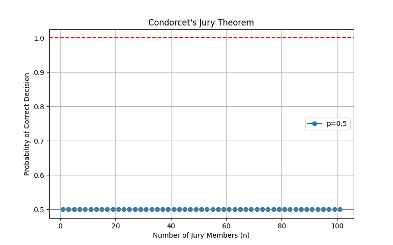
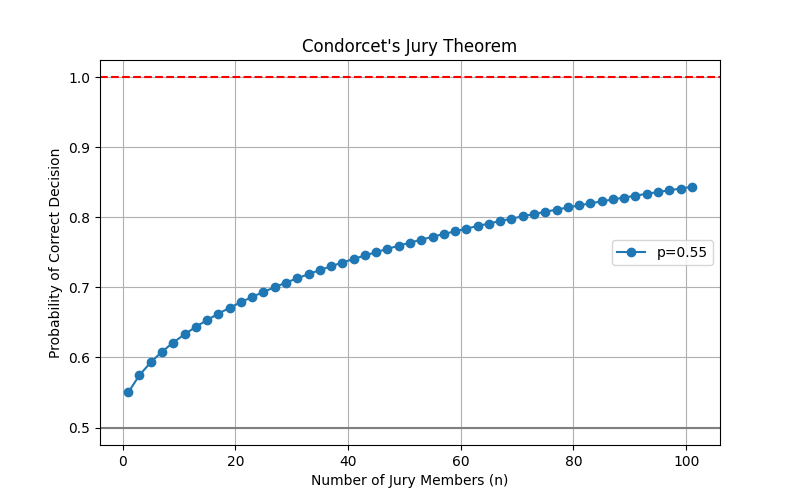
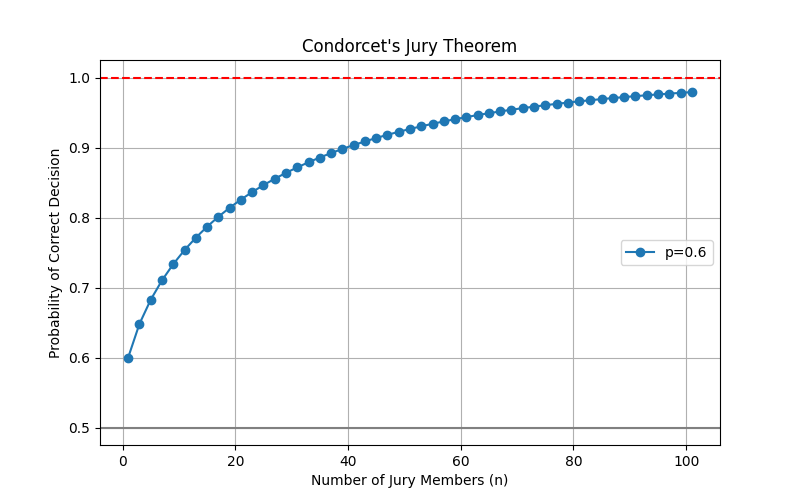
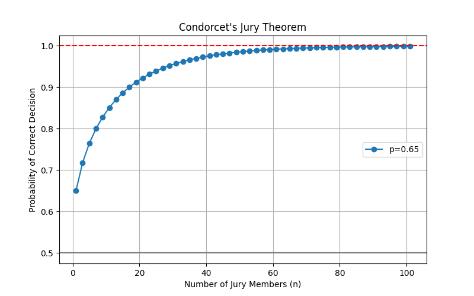
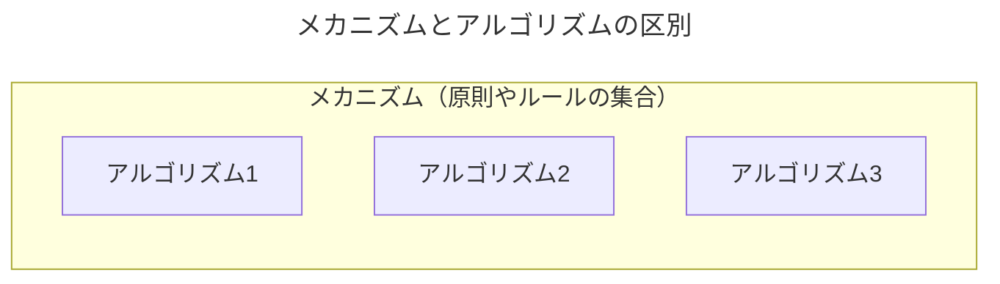
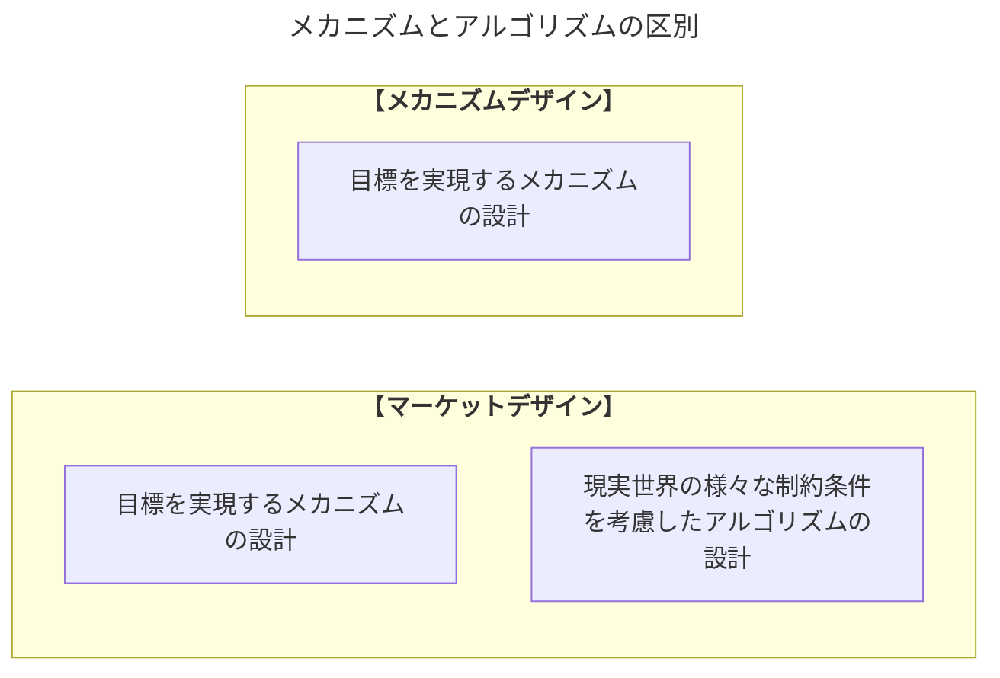
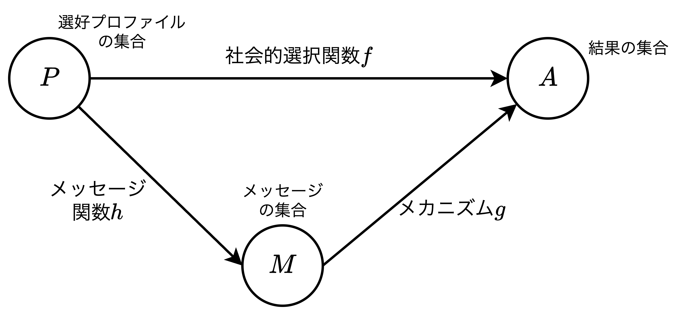

<div class="chap1">

# マーケットデザインの基礎理論

#### 導入

- 本章では、制度設計に欠かせないマーケットデザインの基礎理論を紹介する。内容は以下の通り。
  1. 投票や選挙の方式に関する例を取り上げ、制度設計でよく議論する「**メカニズムとアルゴリズムの違い**」を説明する。
  2. マーケットデザインの際の基礎となるモデルの構造や耐戦略性などの重要概念を説明し、制度設計の指針となる「**表明原理**」と、一般に耐戦略性を満たすルールは独裁的なものに限るという「**不可能性定理**」を解説する。
  3. プレイヤーの選好を制限することで独裁的ではない耐戦略的なルールが設計可能である「**可能性定理**」を示す。

## くじによる選出

- 聖書には聖書には神意を知る為に「くじ」が引かれた例がいくつかある。
  - イエスを裏切り自殺したイスカリオテのユダに代わって欠員となった使徒職に代役を選ぶにあたってくじが用いられている。
  - ソロモン王の作とされる旧約聖書の「箴言（しんげん）」には「くじは諍いを鎮め、手強いもの同士も引き分ける」とある。
- また、ルソーやモンテスキューも抽選の賛意を示している。
  - 【**ルソー**】全ての真の民主制においては行政官の職は利益ではなくして、重い負担である。（ネガティブな賛意）
  - 【**モンテスキュー**】抽選は誰をも傷つけない選出の方法であって、各市民にいつかは祖国の役に立つことができるという最もな希望を与える。（ポジティブな賛意）
- 上記の他、小説でもくじが取り上げれている。桂望実の『平等ゲーム』（幻冬舎、2008年）において、全ての仕事が4年ごとにくじによって決定され、特権階級も既得権益も存在しない平等な社会を描いている。詳細は作品を読んでみていただきたいが、<u>これには職業が完全にランダムであり、住民の得手不得手や好みを全く反映していないため、適材適所による効率的な配置とはいえない</u>。

<div style="page-break-before:always"></div>

## 陪審定理とコンドルセのパラドックス

- ニコラ・ド・コンドルセ（1743〜1794）は18世紀の数学者・哲学者で、特に投票制度に関してマーケットデザインの研究にもつながる2つの重要な成果を挙げている。
  - 【**1つ目**】コンドルセの陪審定理
  - 【**2つ目**】コンドルセのパラドックス

### コンドルセの陪審定理

<table>
    <caption>101人でシミュレーションした結果</caption>
	<tbody>
		<tr>
			<th>確率50%</th>
			<th>確率55%</th>
		</tr>
		<tr>
			<td></td>
			<td></td>
		</tr>
		<tr>
			<th>確率60%</th>
			<th>確率65%</th>
		</tr>
		<tr>
			<td></td>
			<td></td>
		</tr>
	</tbody>
</table>

> 【**コンドルセの陪審定理**】
> コンドルセの陪審定理は、個人が正しい判断をする確率が$50\%（0.5）$を超えていれば、投票人数を増やすほど多数決で正しい結論（正解）に達する確率が1に近づくという理論。少数の賢者より多数の素人の多数決が正しい結果を導きやすいことを数学的（大数の法則）に示した、民主主義の根拠となる定理である。

$$
\begin{align*}
    \pi\left(p_1,p_2,p_3\right)&=p_1p_2p_3+(1-p_1)p_2p_3+p_1(1-p_2)p_3+p_1p_2(1-p_3)\\[2mm]
    \pi\left(\frac{1}{2},p_2,p_3\right)&=\frac{1}{2}p_2p_3+\left(1-\frac{1}{2}\right)p_2p_3+\frac{1}{2}(1-p_2)p_3+\frac{1}{2}p_2(1-p_3)=\frac{p_2+p_3}{2}\\[3mm]
    \pi\left(p_1,\frac{1}{2},p_3\right)&=\frac{p_1+p_3}{2}\\[3mm]
    \pi\left(p_1,p_2,\frac{1}{2}\right)&=\frac{p_1+p_2}{2}\\[3mm]
\end{align*}\\[3mm]
\pi\left(p_1,p_2,p_3\right)>\pi\left(\frac{1}{2},p_2,p_3\right)>\pi\left(p_1,\frac{1}{2},p_3\right)>\pi\left(p_1,p_2,\frac{1}{2}\right)
$$

- 裁判員$i(=\{1,2,3\})$が存在し、その時に正しい決定をする確率を$p_i$とすると、多数決で正しい決定がされる確率は上式のようになる。ただし、$p_1\geqq p_2\geqq p_3>\frac{1}{2}$とする。

### コンドルセのパラドックス

> 【**コンドルセのパラドックス**】
> コンドルセのパラドックス（投票の逆理）とは、3つ以上の選択肢を多数決で選ぶ際、2つの候補を順番に比較していくという方式（コンドルセ方式）で決めるとどの候補から比較していくかでその順番によって当選者が変わってしまうという問題。民主的な投票システムにおける根本的な欠陥です。

|           | 1位 | 2位 | 3位 |
| --------- | --- | --- | --- |
| **Aさん** | $X$ | $Y$ | $Z$ |
| **Bさん** | $Y$ | $Z$ | $X$ |
| **Cさん** | $Z$ | $X$ | $Y$ |

- 上表は3つの候補$X,Y,Z$のどれを当選させた以下について3人の投票者A, B, Cの希望順位を表す。
- 上表より、コンドルセ方式で比較する場合、以下の帰結を得る
  - $X$と$Y$を比較する場合、希望順位表より2対1で$X$が選ばれる。
  - $Y$と$Z$を比較する場合、希望順位表より2対1で$Y$が選ばれる。
  - $Z$と$X$を比較する場合、希望順位表より2対1で$Z$が選ばれる。
- このことから投票者に選好があり、コンドルセ方式で当選させる場合、結果を1つに定めることができない現象を**コンドルセのパラドックス**という。

<div style="page-break-before:always"></div>

## 投票と戦略的行動

> 【**ボルダ方式投票の例**】
> 5人の投票者$1,2,3,4,5$が4人の候補者$1,2,3,4$を選ぶ選挙で、下記の希望順位があったとする。
> || 候補者1 | 候補者2 | 候補者3 | 候補者4 |
> |--| -- | -- | -- | -- |
> |**投票者1**|1位|4位|2位|3位|
> |**投票者2**|1位|2位|4位|3位|
> |**投票者3**|4位|3位|1位|2位|
> |**投票者4**|4位|1位|3位|2位|
> |**投票者5**|1位|2位|4位|3位|
> 
> この時、1位には4点、2位には3点、3位には2点、4位には1点が加点され、その合計が各候補者が獲得した得点となる。具体的には集計表は以下の通り。1位から4位はそれぞれ候補者1、2、4、3となる。
> || 候補者1 | 候補者2 | 候補者3 | 候補者4 |
> |--| -- | -- | -- | -- |
> |**投票者1**|4点|1点|3点|2点|
> |**投票者2**|4点|3点|1点|2点|
> |**投票者3**|1点|2点|4点|3点|
> |**投票者4**|1点|4点|2点|3点|
> |**投票者5**|4点|3点|1点|2点|
> |**合計**|14点|13点|11点|12点|
> 
> ここで、投票者3が候補者2と3の希望順位を入れ替えた場合、以下のように最終的な順位は変化する。つまり、1位から4位は候補者2、1、4、3となる。
> || 候補者1 | 候補者2 | 候補者3 | 候補者4 |
> |--| -- | -- | -- | -- |
> |**投票者1**|4点|1点|3点|2点|
> |**投票者2**|4点|3点|1点|2点|
> |**投票者3**|1点|<font color=red>4点</font>|<font color=red>2点</font>|3点|
> |**投票者4**|1点|4点|2点|3点|
> |**投票者5**|4点|3点|1点|2点|
> |**合計**|14点|<font color=red>15</font>点|<font color=red>9</font>点|12点|
> 
> 上記のように<u>プレイヤーの戦略的操作によって、投票結果が自分の都合の良いように変更できる余地がある</u>。

- 現実世界では、主体が自分に都合の良い結果を生み出す為に希望順位を偽る、つまり「**嘘をつく**」といった戦略的行動が考えられます。古典的な例として、上記のボルダ方式での投票結果がある。
- 「順位」の他にも「グレード」を用いた投票方式を用いた場合、戦略的操作に比較的強いが、それでも投票結果が左右される。グレードを用いた投票方式の特徴は以下の通り。
  - 良い悪い、ABCランク、と言った自然言語で主観的判断で評価する
  - A・B・Cやプラチナ・ゴールド・シルバーなど、グレード間の差は等間隔ではない
- このように、<font color=red>投票制度では希望順位や評価を偽って投票結果を左右しようとする戦略的行動の余地がある</font>。マーケットデザインでは社会的選択理論（**選好の組(プロファイル)に基づいて何らかの望ましい基準で望ましい結果を決定する考え方**）をベースにしてそこに主体の戦略的行動などを考慮したフレームワークを考え、制度設計を行う。

## メカニズムとアルゴリズム



- メカニズムとアルゴリズムはほぼ同じ意味で使われるが、あえて区別する場合は以下の通り。
  - 【**メカニズム**】基本的な原則やルールの集合のこと
  - 【**アルゴリズム**】メカニズムに基づく具体的な取引の価格や配分を決定する手順
- メカニズムの例には「**市場メカニズム**」がある。ここで、<font color=red>アルゴリズムが不明なまま、市場均衡となる価格や配分を決定することはできない</font>。そのため、下記コラムのように板寄せやザラ場といったアルゴリズムが提案され、使用される。
  - 【**市場メカニズム**】需要と供給が一致するような価格と取引数量（配分）を決めるルールを持つ。

#### 【コラム1.1】市場取引のアルゴリズム

> 【**コール市場（板寄せ）**】
> コール市場とは日本では「板寄せ」と呼ばれるアルゴリズムであり、具体例として、銀行などの金融機関が1年以内の短期的な資金（主に翌日物）を貸し借りする市場が挙げられる。<u>板寄せでは、需要と供給が一致するような配分がどのように決定されるのかを説明する</u>。
> 1. 売り手が販売希望価格、買い手が購入希望価格をそれぞれ（紙やコンピュータなどに入力して）提出する
> 2. 最も高い購入希望価格を書いた買い手と最も低い販売希望価格を書いた売り手を選び出し、購入希望価格が販売希望価格と同じかそれよりも高いならば取引を成立させる。
> 3. 以降、取引が成立する限り、1.と2.を続ける。
> 4. 最後に成立した取引での購入希望価格と販売希望価格との中間（多くの場合、真ん中の）価格で全ての取引を決済する。
> 
> 【**ダブルオークション市場**】
> 板寄せとは別に、ダブルオークション市場は日本では「ザラ場」と呼ばれ、具体例として「証券（株式）市場」や「為替市場」が挙げられる。<u>ザラ場では、複数の売り手と買い手が共通に見ることのできる場（例えば、コンピュータ画面）に販売希望価格と購入希望価格を提示し合い、合致した時点で取引が成立する</u>。ただし、売り手はすでに場に出ている販売希望価格以下の価格しか提示できず、また、買い手はすでに場に出ている購入希望価格以上の価格しか提示できない。
> 1. 通常、販売希望価格が購入希望価格を上回っている場合がほとんどであり、次第に販売希望価格が低下し、購入希望価格が上昇していく。
> 2. 購入希望価格が販売希望価格と一致する瞬間、取引が成立する。
> 3. 取引成立後、再び価格は御破算となり、残りの売り手と買い手でまた同じように価格の提示を行なっていく。
> 4. <font color=red><b>上記手順をあらかじめ決められた時間の間続けられる</b></font>。

<div style="page-break-before:always"></div>

#### メカニズムデザインとマーケットデザインの違い




- 経済学の研究ではマーケットデザインとは別にメカニズムデザインという領域がある。どちらも予め設定された目標や基準に合致するような結果を生み出すルールを設計するという研究分野であり違いは以下の通り。
  - 【**メカニズムデザイン**】目標を実現するメカニズムが理論的に設計できればそれで研究課題を達成したことになる。
  - 【**マーケットデザイン**】メカニズムの理論的設計に加え、現実世界のさまざまな制約条件を考慮したアルゴリズム設計まで落とし込む必要がある。

<div style="page-break-before:always"></div>

## マーケットデザインの基本概念

$$
\begin{align*}
    f(\theta)&=a\\
    g(m)&=g(h(\theta))=a
\end{align*}\\[3mm]
\begin{align*}
    \theta\in P&：プレイヤーの選好の組\theta とその集合P\\
    a\in A&：ある基準や目標を満たす望ましい結果aとその集合A\\
    m\in M&：\theta から選ばれる行動mとその集合M\\
\end{align*}
$$



```plantuml
title 登場人物
left to right direction

actor デザイナー as designer
actor プレーヤー as player
rectangle メカニズム as m {
    rectangle アルゴリズム as a
}

note left of designer
メカニズムや
アルゴリズムを
設計する人
end note

designer -- a: 制度設計
a -- player: ←選好\n→結果
```

- 社会的選択関数 $f$ は全ての選好プロファイル $\theta$ に対して、デザイナーが設計した望ましい結果 $a$ を選ぶものとし、$a$ が複数ある場合は何らかのルールから1つ選ぶ。しかし、<font color=red>現実世界では $\theta$ を完全には持っていないため、「<b>不完備情報</b>」の状況下で制度設計することになる</font>。
- マーケットデザインでは、メカニズム $g$ を設計する際の均衡概念としては「**支配戦略均衡**」を用いる場合が多い。ここで支配戦略とは、他のプレイヤーが選ぶどの戦略の組みに対しても常に最適反応となる戦略である。

<div style="page-break-before:always"></div>

## 表明原理

> 【**表面原理**】
> 間接メカニズムによって耐戦略的メカニズムが設計できる（支配戦略均衡になる）なら、直接メカニズムによって耐戦略的メカニズムは設計できる。

- <font color=red>メカニズム $g$ を設計する際に、最初に問題になるのはプレイヤーが提出するメッセージ $m$ をどのように定義するかである</font>。具体例としては以下の通り。
  - 【**市場メカニズム**】「価格」や「数量」などの数値をメッセージとして提出してもらう
  - 【**結婚マッチング市場**】「誰となぜマッチしたいのか」や「自己PR」などの自然言語をメッセージとして提出してもらう
- 上記のようなプレイヤーの選好に限定しないメカニズムを「**間接メカニズム**」と言い、プレイヤーの選好そのものを対象とするメカニズムを「**直接（表明）メカニズム**」と言う。
- 表明原理では間接メカニズムによる耐戦略的メカニズムが設計可能であれば、直接メカニズムでも設計可能であることを示す原理である。
- 以上より、メカニズムを設計するデザイナーの作業は次のようになる。
  1. プレイヤーは自分の選好をメッセージとして表明するものとする
  2. 可能な全ての選好プロファイル $\theta$ について、直接メカニズム $g(\theta)$ が選び出す結果 $a=g(\theta)$ は社会的選択関数 $f(\theta)$ と一致するようにする。
  3. 直接メカニズム $g$ は各プレイヤーにとって真の選好を表明することが支配戦略均衡になるように設計する。

## 不可能性定理

> 【**ギバード＝サタースウェイトの定理**】
> 3つ以上の選択肢がある場合、自明なメカニズムを除いて、耐戦略的なメカニズムは独裁的なものに限られる。
> - 【**独裁的メカニズム**】社会的選択関数が選び出す結果が他のプレイヤーの表明する選考に関わりなく、ある一人のプレイヤー（独裁者）の選好のみを反映するメカニズム。つまり、常に独裁者に都合の良い結果だけが選ばれる。
> - 【**自明なメカニズム**】プレイヤーの表明する選好とは全く関係なく、常に同じ結果を選ぶようなメカニズム。

- 独裁的な決定メカニズムは耐戦略的である、つまり、すべてのプレイヤーにとって正直に真の選好を表明することが支配戦略になる。理由は以下の通り。
  - 【**理由1**】
  - 【**理由2**】

<div style="page-break-before:always"></div>

## 可能性定理

- 1.7節に説明したギバード＝サタースウェイトはプレイヤーが持つ「**すべての選好の組み合わせ**」に対して耐戦略的なメカニズムは独裁的なものに限られるということを示している。
- 上記の前提を考慮して、「**単峰性**」という概念を導入する。<u>単峰性を満たす選好のみで構成されたプロファイルに対してメカニズムを設計すると、独裁的ではない耐戦略的なメカニズムを構築することができる</u>。

<div style="page-break-before:always"></div>

## 【付録】Pythonプログラム

### コンドルセノ陪審定理のシミュレーション


### 多数派判断方式


### 【Column】ゲーム理論における均衡概念


