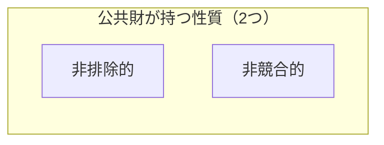

# 公共財供給とただ乗り問題

#### 導入

- 第1章では、マーケットデザインの基礎概念を整理し、ギバードサタースウェイトの定理を示した。この定理は、3つ以上の選択肢がある場合、耐戦略性を満たす（誰にも嘘をつくインセンティブを持たせない）社会的選択関数は必ず独裁的になってしまうことを意味している（1.7節）。
- また第1章ではさらに、「単峰性を満たすような選好」に限定してメカニズムを設計することで独裁的ではない耐戦略的なメカニズムが設計可能であることも示した（1.8節）。
- 本章では、公共財供給問題に焦点を当て、単峰性以外に準線形の効用関数の場合にも独裁的ではない耐戦略的なメカニズムが設計可能であることを示す。

## 公共財

- 公共財とは「道路・公園・国防・外交・消防などのようにその財やサービスの利用が**非排除的**かつ**非競合的**であるもの」いう。例えば、公共の公園や一般道路が挙げられる。
  -  【**非排除的**】財やサービスに対する利用料（価格）を支払わない人の利用を排除できない、あるいは排除することが不可能なほどの費用がかかること。
  -  【**非競合的**】誰かがその財やサービスを利用しても別の人に利用の制限がかからないこと。

##### 公共財供給メカニズムの比較表

|                          | ボーエン＝ サミュエルソン条件 | 予算均衡 条件 | 個人合理性 | 耐戦略性 |
| ------------------------ | -------------------------------- | ---------------- | ---------- | -------- |
| VCM                      | ×                                | ⚫︎                | ×          | ×        |
| リンダール メカニズム | ⚫︎                                | ⚫︎                | ⚫          | ×        |
| ボーエン メカニズム   | ×                                | ⚫︎                | ×          | ⚫︎        |
| ピボダル メカニズム   | ⚫︎                                | ×                | ×          | ⚫︎        |
| グローブス メカニズム | ⚫︎                                | ×                | ×          | ⚫︎        |
| ウォーカー メカニズム |                                  |                  |            |          |

- 【**ボーエン＝サミュエルソン条件**】パレート効率的な供給をするための条件
- 【**予算均衡条件**】プレイヤーからの徴収額の合計が公共財の供給費用を賄えるかどうかの条件
- 【**個人合理性**】均衡時に参加前の利得より上がっているかどうか（参加することで損をするかどうか）、つまり、利得$u_i$が私的財$x_i$以上であることを常に満たす（$u_i\geqq x_i$）必要がある。
- 【**耐戦略性**】正直に表明することが支配戦略であるかどうか（嘘をつくことでインセンティブが得られるか）

### ボーエン＝サミュエルソン条件（パレート効率的な公共財供給量）

$$
\begin{align*}
    \pi(G)&=\sum_{i}v_i(G)-c(G)\\[2mm]
    \frac{\partial \pi(G)}{\partial G}&=0\iff \color{red}\sum_{i}^nv'_i(G)=c'(G)
\end{align*}\\[2mm]
\begin{align*}
    \pi(G)&：公共財の利得関数\\
    v_i(G)&：プレイヤーiが公共財から得られる便益\\
    c(G)&：公共財の供給費用\\
\end{align*}
$$

- 上式の赤文字式はボーエン＝サミュエルソン条件を表す。
- 【**前提**】すべての参加者（プレイヤー）は公共財の利用により便益$v_i$を得ることができる。一方で公共財は非競合的なのでプレイヤー数に関係なく、供給費用$c(G)$が水準$G$のみで決定する。
- 上記の前提を踏まえ、1単位増加した時の各プレイヤー$i$が得る便益の増加分の総和$\sum_{i}^nv'_i(G)$と公共財1単位を追加的に供給した場合の費用の増加分$c'(G)$が等しくなるような公共財を提供することが最適となる。

### 予算均衡条件（水準$G$を満たすために必要な徴収額）

$$
\begin{align*}
    \color{red}\sum_{i}^nx_i=c(G)
\end{align*}\\[2mm]
\begin{align*}
    x_i&：プレイヤーiの公共財供給費用の負担額\\
    c(G)&：公共財の供給費用\\
\end{align*}
$$

- 上式の赤文字式は予算均衡条件を表す。
- 前述のボーエン＝サミュエルソン条件はパレート効率的な公共財供給量を定めるものであるが、当然、誰かがこの公共財の供給費用を負担しない限り、供給ができない。そこで、すべてのプレイヤーから負担額$x_i$を徴収するものとし、上式を導出した。

### まとめ

- このように、ボーエン＝サミュエルソン条件と予算均衡条件の2つを満たす水準$G$の公共財を供給することがパレート効率的であるという。
- しかし、一度公共財が誰かの費用負担によって供給されると、その公共財の供給に対して何の費用負担もしなかった人までもが利用できる（便益を得ることができる）ため、誰も公共財供給の負担を行いたくなくなる。これを<b>ただ乗り問題（free rider problem）</b>という。

## 公共財自発的供給メカニズム

### ただ乗り問題と公共財自発的供給メカニズム（VCM: Voluntary Contribution Mechanism）

$$
\begin{align*}
    【\bold{前提}&】\\
    v_i(G)&=\alpha G\\
    c(G)&=G=\sum_{i=1}^nx_i（予算均衡条件）\\
\end{align*}\\[2mm]
ただし、\frac{1}{n}<\alpha<1\hspace{5mm}（1）\\[3mm]
\pi(G)=\sum_{i=1}^nv_i(G)-c(G)=\alpha nG-G\\[3mm]
\begin{align*}
【\bold{結果}：&ボーエン＝サミュエルソン条件】\\[1mm]
&\frac{\partial\pi(G)}{\partial G}=\alpha n-1=0\hspace{2mm}\underline{\therefore\alpha=\frac{1}{n}}    
\end{align*}
$$

- ただ乗り問題はVCMを使って説明する。VCMは経済実験でただ乗り問題の検証をするためによく使用される単純なゲームである。
- 【**前提**】
  - 各プレイヤーはそれぞれ初期保有$w_i$を私的財（所持金）として保有しているものとし、そこから貢献額$x_i$の総和$\sum_i^nx_i$がそのまま公共財供給量$c(G)$となる。
  - 各プレイヤー$i$には公共財供給量$G$の$\alpha$倍の便益がもたらされる、つまり、$v_i(G)=\alpha G$である。
- 【**VCMのアルゴリズム**】
  1. 各プレイヤー$i（1\leqq i\leqq n）$はそれぞれ初期保有$w_i$から公共財への貢献学$x_i$を決定する
  2. 公共財供給量$G$は公共財に貢献された額の総和$\sum_i^nx_i$と等しい値に決定される
  3. 各プレイヤー$i$には公共財供給量$G$の$\alpha$倍の便益がもたらされる。ただし、$\frac{1}{n}<\alpha<1$とする。
- 上式より、VCMは次の特徴を持つメカニズムである。
  - 予算均衡条件を満たす。
  - ボーエン＝サミュエルソン条件を満たさない。これは、$\alpha=\frac{1}{n}$ が $\frac{1}{n}<\alpha<1$という前提に反する
- 【**結論**】VCMはボーエン＝サミュエルソン条件を満たさないが、予算均衡条件を満たす。

#### VCMにおける均衡

$$
\begin{align*}
    【\bold{個人の利得}】&u_i=w_i-x_i+\alpha G=w_i\color{red}-(1-\alpha)\color{black}x_i+\alpha\sum_{-i}x_{j}\\
    【\bold{全体の利得}】&\sum_{i=1}^nu_i=\sum_{i=1}^nw_i-\sum_{i=1}^nx_i+\alpha G\sum_{i=1}^n1=\sum_{i=1}^nw_i\color{red}-(1-\alpha n)\color{black}\sum_{i=1}^nx_i
\end{align*}
$$

- 個人の利得$u_i$で見た時、プレイヤー$i$は$x_i=0$の時が「個人的には」支配戦略になる。
- 一方、全体の利得$\sum u_i$で見た時、プレイヤー$i$は$x_i=w_i$の時が「全体的には」支配戦略になる。
- このように、「自分だけの利得を最大化するか」、「全体の利得合計を最大化するか」、によって支配戦略が変わる。

### 単純化されたVCM

- ここで、以下のように単純化したVCMを考える
  - 【**前提1**】プレイヤーは2人、つまり$i=\{1,2\}$とする。
  - 【**前提2**】プレイヤーは公共財に何も貢献しないか、初期保有全額を後見するかの2つの戦略しかない。つまり、$x_i=0,x_i=w_i$のいずれかとする。
  - 【**前提3**】2人の初期保有は等しい、つまり、$w_1=w_2$とする。
- 下表の利得表より、利得は4パターンに分類できる。ここで、$\alpha<1$より、プレイヤー1,2ともに$x_1=x_2=0$の組合せが「**個人的な**」支配戦略均衡となる。一方で、「**全体的な**」支配戦略均衡は前述の通り、$x_1=w_1,x_2=w_2$である。
- このことから、個人的に利得最大化を目指した場合に得られる利得は、全体の利得合計を最大化する場合に得られる利得よりも小さくなる。
- 以上のことから、VCMでは誰も公共財に対する真の選好を表明しない、つまり、ただ乗り問題の本質は「**VCMが耐戦略的ではない**」ということである。

##### 単純化したVCMの利得表

|           | $x_2=w_2$                                                   | $x_2=0$                                               |
| --------- | ----------------------------------------------------------- | ----------------------------------------------------- |
| $x_1=w_1$ | 【**パターン1**】 $\alpha(w_1+w_2)$ ,　$\alpha(w_1+w_2)$ | 【**パターン2**】 $\alpha w_1$ ,　$\alpha w_1+w_2$ |
| $x_1=0$   | 【**パターン3**】 $w_1+\alpha w_2$ ,　$\alpha w_2$       | 【**パターン4**】 $w_1$, $w_2$                     |

## リンダールメカニズム

- VCMモデルでは**①ボーエン＝サミュエルソン条件が満たされず**、さらに誰も公共財に貢献しないという**②ただ乗り行動が支配戦略である**、ということが示された。
- 上記の問題に対して、エリックリンダールは市場の価格調整にヒントを得て、以下のようなメカニズムを設計した。
- 【**リンダールメカニズム**】
  1. 政府は各プレイヤー$i$に対して個別に公共財供給費用 $c(G)$ に対する負担割合 $q_i$ を提示する。ただし、負担割合の合計は$\sum_i^nq_i=1$を満たすものとする。
  2. 各プレイヤー$i$は負担割合 $q_i$ を所与として自分にとって望ましい公共財の供給水準 $G_i$ について政府に伝える。
  3. $G_1=G_2=\cdots=G_n=G^*$の時、ステップ4に進む。そうでなければ、低い値の$G_i$を表明したプレイヤーの負担割合$q_i$を下げ、高い値の$G_i$を表明したプレイヤーの負担割合$q_i$を上げるという形で負担割合を変更して、ステップ1に戻る。ただし、負担割合の合計は$\sum_i^nq_i=1$を満たすものとする。
  4. $G_1=G_2=\cdots=G_n=G^*$の時、$G^*$という水準の公共財を供給することに決定し、各プレイヤー$i$からは$x_i=q_ic(G^*)$の負担額を徴収し、終了する。
- 最終的に決定した$G^*$と$q^*=(q_1^*,q_2^*,\ldots,q_n^*)$の組$(G^*,q^*)$を**リンダール均衡**と呼ぶ。
- <u>ここで</u>、このリンダールメカニズムのステップ3において$q_i$の更新方法について具体的な手順がないことから、「**メカニズム**」であって「**アルゴリズム**」ではないことを強調する。

#### リンダールメカニズムの性質

$$
【\bold{予算均衡条件}】\\[1mm]
\begin{align*}
    \sum_{i=1}^nx_i&=c(G)\sum_{i=1}^nq_i=c(G)
\end{align*}\\[3mm]
【\bold{ボーエン＝サミュエルソン条件}】\\[2mm]
\begin{align*}
    v_i'(G_i)&=q_ic'(G_i)\\
    \sum_{i=1}^nv_i'(G^*)&=\sum_{i=1}^nq_ic'(G^*)=c'(G^*)\\[2mm]
\end{align*}\\[5mm]
$$

- リンダールメカニズムは以下の特徴がある。
  - **予算均衡条件**を満たす。
  - **ボーエン＝サミュエルソン条件**を満たす。
  - **耐戦略的ではない**

#### リンダール均衡の数値例

$$
【\bold{初期設定}】\\[1mm]
v_1(G)=G-0.5a_1G^2\hspace{2mm}(a_1>0)、v_2(G)=G-0.5a_2G^2\hspace{2mm}(a_2>0)\\
c(G)=G、q_1+q_2=1\\[3mm]
【\bold{計算}】\\
ボーエン＝サミュエルソン条件より、\left\{
    \begin{array}{l}
        1-a_1G=q_1\\[1mm]
        1-a_2G=q_2(=1-q_1)
    \end{array}
\right.\\[3mm]
この時の水準をG^*として解くと\underline{G^*=\frac{1}{a_1+a_2}}\\[3mm]
よって、\underline{q_1^*=\frac{a_2}{a_1+a_2}\hspace{.5mm},\hspace{1.5mm}q_2^*=\frac{a_1}{a_1+a_2}}\\[6mm]
ここでプレイヤー1が虚偽申告w_1(\neq v_1)をした場合を考える\\
w_1=G-0.5\theta G\hspace{2mm}(\theta>a_1)とする。
上記と同様、G^{**}、q_1^{**}、q_2^{**}を求めると、\\[2mm]
\underline{
    G^{**}=\frac{1}{\theta+a_2}
    \hspace{.5mm},\hspace{1.5mm}
    q_1^{**}=\frac{a_2}{\theta+a_2}
    \hspace{.5mm},\hspace{1.5mm}
    q_2^{**}=\frac{\theta}{\theta+a_2}
}\\[3mm]
そして、v_1(G^*)-q_1^*c(G^*)とv_1(G^{**})-q_1^{**}c(G^{**})の差を求める。\\[3mm]
\begin{align*}
    v_1(G^*)-q_1^{*}c(G^*)&=\frac{a_1}{(a_1+a_2)^2}-\frac{0.5a_1}{(a_1+a_2)^2}=\frac{0.5a_1}{(a_1+a_2)^2}\\
    v_1(G^{**})-q_1^{**}c(G^{**})&=\frac{\theta}{(\theta+a_2)^2}-\frac{0.5a_1}{(\theta+a_2)^2}=\frac{\theta-0.5a_1}{(\theta+a_2)^2}
\end{align*}\\[2mm]
ここで、a_1=a_2=1、\theta=1.5とすると、\\
\frac{0.5a_1}{(a_1+a_2)^2}=\frac{0.5}{2^2}=\frac{1}{8}、\frac{\theta-0.5a_1}{(\theta+a_2)^2}=\frac{1}{\left(\frac{5}{2}\right)^2}=\frac{4}{25}>\frac{1}{8}
$$

- 以上より、リンダールメカニズムは選好を偽るインセンティブがあることがわかる。つまり、リンダールメカニズムは「**耐戦略的ではない**」メカニズムである。
- 【**補足**】一般に$n$人のプレイヤーがいる場合は以下のようになる。

$$
\begin{align*}
  v_i(G)&=G-0.5a_iG^2\\[1mm]
  G^*&=\frac{n-1}{\displaystyle\sum_{i=1}^na_i}\\[3mm]
  q_i^*&=1-a_iG^*
\end{align*}
$$

## ボーエンメカニズム

- 【**ボーエンメカニズム**】
  1. 政府は$n$人の各プレイヤー$i$に対して個別に公共財供給費用$c(G)$に対する負担割合$q_i$を提示する。ただし、この負担割合は公共財供給費用を均等割したもの、つまり、$q_i=\frac{1}{n}$とする。
  2. 各プレイヤー$i$は負担割合$q_i$を所与として自分にとって望ましい公共財の供給水準$G_i$について政府に伝える。
  3. 政府は各プレイヤー$i$が表明した$\{G_1,G_2,\cdots,G_n\}$を候補の集合として、この中から最も望ましい候補を選ぶために任意の2つを取り出し多数決投票によってどちらが得られるかを決定する（**コンドルセ方式**）。選ばれた候補とまた別の候補から多数決投票を実施し、最終的に他のどの候補に対しても多数決投票で勝利するような公共財供給量に決定し、終了する。
- ボーエンメカニズムは以下の性質を満たす
  - **予算均衡条件**を満たす
  - 限界便益が正規分布に従うならば、**ボーエン＝サミュエルソン条件**を満たす（厳しい制約）
  - プレイヤーの選好が**単峰的**であれば、**耐戦略的**である（制約）

#### ボーエンメカニズムの性質

$$
【\bold{予算均衡条件}】\\[2mm]
\begin{align*}
    \sum_{i=1}^nx_i&=\sum_{i=1}^nq_ic(G)=\frac{c(G)}{n}+\frac{c(G)}{n}+\cdots+\frac{c(G)}{n}=c(G)\\[2mm]
\end{align*}\\[5mm]
【\bold{ボーエン＝サミュエルソン条件}】\\[2mm]
\begin{align*}
&プレイヤー\hspace{1mm}i\hspace{1mm}は利得\hspace{1mm}u_i(G_i)=v_i(G_i)-q_ic(G_i)\hspace{1mm}を最大化させたいはずであり、\\
&中位投票者定理より選ばれたプレイヤーmも同様であるため、  
\end{align*}\\
\frac{\partial u_m}{\partial G}=0\quad\therefore v'_m(G_m)=q_mc'(G_m)=\frac{c'(G_m)}{n}\quad (1)\\[2mm]
また、\color{red}限界便益v_i'(G_i)が正規分布に従うとすると平均値と中央値が一致
\color{black}するため\\
v_m'(G_m)=\frac{\displaystyle\sum_{i=1}^nv'_i(G_i)}{n}\quad (2)\\[2mm]
上記の式(1)と(2)を合わせると\\
\sum_{i=1}^nv'_i(G_i)=c'(G_m)\\
このことから、\color{red}正規分布に従うならばボーエン＝サミュエルソン条件を満たす\color{black}。
$$

> 【**補題：中位投票者定理**】
> 投票者すべてが単峰的な選好を持っている場合には中位投票者が望む候補が多数決投票によって選択される。

> 【**ボーエン＝サミュエルソン条件を満たすために必要な制約（2つ）**】
> 1. 各プレイヤーは単峰的な選好を持つこと
> 2. 限界便益が正規分布に従うこと
> 
> このことから、**一般的にはボーエン＝サミュエルソン条件は満たされない**。

- 各プレイヤーが公共財に対して「**単峰的**」な選好を持っていると仮定されており、この時、候補は並び替え可能であり、ちょうど真ん中の順位（中位、中央値）の $G$ が選ばれる。これを「**中位投票者定理**」という。このことを踏まえ、プレイヤー数$n$を奇数、つまり$n=2m-1$とすると、中位投票者定理より順位$m$である$G_m$がコンドルセ勝者になる。
- また、限界便益$v'_i(G_i)$が正規分布に従う場合に限り、ボーエン＝サミュエルソン条件を満たす。
- 以上の結果から、**①各プレイヤーは単峰的な選好を持つこと**、**②限界便益が正規分布に従うこと**、の2つの制約がないとボーエン＝サミュエルソン条件を満たせず、非常に厳しい制約になる。

#### ボーエンメカニズムの数値例

$$
【\bold{初期設定}】\\
\begin{align*}
  プレイヤー\hspace{1mm}i&=\{1,2,3\}\\
  費用\hspace{1mm}c(G)&=G\\
  便益\hspace{1mm}v_i(G)&=G-0.5a_iG^2
\end{align*}\\[3mm]
【\bold{計算}】\\
v'_i(G_i)=1-a_iG_i\quad、\quad q_ic'(G_i)=q_i=\frac{1}{3}\\[2mm]
\therefore\hspace{3mm}G_i^*=\frac{2}{3a_i}\\
ここで、a_i=iとすると\{G_1,G_2,G_3\}=\left\{\frac{2}{3},\frac{1}{3},\frac{2}{9}\right\}\\[2mm]
上記の結果と中位投票者定理より、\color{red}\underline{コンドルセ勝者はG_2=\frac{1}{3}となる}\color{black}。
$$

## ピボタルメカニズム

$$
【\bold{式の定義}】\\
\begin{align*}
  u_i(x_i,G)&=x_i+v_i\cdot G-t_i,\quad v_i(0)=0\\[1mm]
  G&=\left\{
    \begin{array}{l}
      1\quad\text{if}\quad\displaystyle{\sum_{i=1}^nw_i}\geqq 0（=c(G)）\\[5mm]
      0\quad\text{if}\quad\displaystyle{\sum_{i=1}^nw_i}< 0（=c(G)）
    \end{array}
  \right.\\[10mm]
  t_i&=\left\{
    \begin{array}{lcl}
      &\left|\displaystyle\sum_{j\neq i}w_j\right|\quad&\text{if}\quad\displaystyle{\left(\sum_{i=1}^nw_i\right)\left(\sum_{j\neq i}w_j\right)}<0\\[6mm]
      &0\quad&\text{otherwise}
    \end{array}
  \right.
\end{align*}\\[5mm]
【\bold{用語の説明}】\\
\begin{align*}
  x_i&：私的財\\
  v_i&：公共財の評価値\\
  w_i&：公共財への支払意思額\\
  t_i&：各プレイヤーが徴収される追加費用\\
\end{align*}
$$

- リンダールメカニズムは耐戦略性を満たさず、ボーエンメカニズムはボーエンサミュエルソン条件を満たさないメカニズムであった。ここで、<u>プレイヤーの選好が**準線形（quasilinear）** の効用関数で表せるものに限定したピボタルメカニズムを紹介する</u>。
- 【**単純化のための前提**】
  - ある一定規模の公共財を供給するか、しないか、の2者択一の選択をする場合を考える。
  - 公共財の供給費用は$0$に基準化する。
  - プレイヤーたちは「**分割不可能**」な1単位の公共財を生産するか否かの意思決定を行うものとする。
- 【**ピボタルメカニズム**】
  1. 各プレイヤー$i$に公共財供給に対する評価値$w_i$を表明させる。（マイナスの評価値の場合、公共財を供給してほしくないという意味になる）
  2. 表明された全員の評価値の合計が供給費用$c(G)$（今回の例の場合は$c(G)=0$）以上なら公共財を供給し、それより小さい時は公共財を供給しない。
  3. 各プレイヤーはステップ2での決定とそのプレイヤーを除く他のプレイヤー全員の表明した評価値の合計額$S$に基づく公共財供給の可否の決定とが異なる場合には、$S$の絶対値$|S|$を追加費用として支払う。それ以外の場合は追加費用は$0$とする。

#### ピボタルメカニズムの性質

$$
【\bold{予算均衡条件}】\\
一般に\sum_{i=1}^nt_i\neq c(G)より、\color{red}予算均衡条件は満たされない\color{black}\\[4mm]
【\bold{ボーエン＝サミュエルソン条件}】\\[2mm]
正直に表明すること、つまりw_i=v_iの時、支配戦略になる。\\[2mm]
この時\sum_{i=1}^nw_i=\sum_{i=1}^nv_iとなり、限界便益が逓減的であることを考慮すると\\
\sum_{i=1}^nv_i=c(G)と一致する、つまり\color{red}ボーエン＝サミュエルソン条件を満たす\color{black}
$$

- 上式より、ピボタルメカニズムは以下の特徴がある。
  - 一般に、**予算均衡条件**を満たさない
  - **ボーエン＝サミュエルソン条件**を満たす
  - **耐戦略的である**

#### ピボタルメカニズムの数値例

$$
【\bold{初期設定}】\\[1mm]
\begin{align*}
  &i=\{1,2,3\}、
  \{x_1,x_2,x_3\}=\{2,2,2\}\\
  &\{v_1,v_2,v_3\}=\{3,1,-2\}、
  \{w_1,w_2,w_3\}=\{3,1,-2\}
\end{align*}\\[3mm]
【\bold{計算}】\\
\sum_{i=1}^3w_i=2\geqq 0より、G=1\\
また、\sum_{j\neq 1}w_j=-1、\sum_{j\neq 2}w_j=1、\sum_{j\neq 3}w_j=4より追加費用t_iは\\
\{t_1,t_2,t_3\}=\{1,0,0\}となる。よって、\\[2mm]
\left\{
  \begin{array}{l}
    u_1=x_1+v_1\cdot G-t_1=2+3\cdot 1-1=4\\[1mm]
    u_2=x_2+v_2\cdot G-t_2=2+1\cdot 1-0=3\\[1mm]
    u_3=x_3+v_3\cdot G-t_3=2-2\cdot 1-0=0\\[1mm]
  \end{array}
\right.
$$

- ピボタルメカニズムは正直に表明することが支配戦略である、つまり、耐戦略的である（嘘をつくインセンティブがない）ことがわかる。
- 上記に加え、ピボタルメカニズムは「**個人合理性が満たされない**」という問題がある。個人合理性は参加制約とも呼ばれ、「**均衡時の各プレイヤーの利得が参加前と比べて小さくならない性質**」を意味する。つまり、<u>ピボタルメカニズムは参加すると「損をするメカニズム」ということになる</u>。実際、$u_3=0$より、プレイヤー3は利得が下がっており、個人合理性を満たしていない。

## グローブスメカニズム

$$
【\bold{式の定義}】\\
\begin{align*}
  u_i(x_i,G)&=x_i+v_i(G)+t_i,\quad v_i(0)=0\\
  G&=\max\left[d(w(G))-c(G)\right]=\max\left[\sum_{i=1}^nw_i(G)-c(G)\right]\\
  t_i&=\sum_{j\neq i}w_j(d(w))+h(w_{-i})
\end{align*}\\[5mm]
【\bold{用語の説明}】\\
\begin{align*}
  x_i&：私的財\\
  v_i&：公共財の評価値\\
  w&：便益関数のプロファイル(w_1,w_2\cdots,w_n)\\
  d&：決定関数\\
  h&：任意関数\\
  t_i&：各プレイヤー課税関数\\
\end{align*}
$$

- グローブスメカニズムはピボタルメカニズムを特殊ケースの1つとして含むメカニズムであり、**ボーエン＝サミュエルソン条件**と**耐戦略性**を満たす。
- 【**グローブスメカニズム**】
  1. プレイヤー全員に公共財に対する選考を表明させる。
  2. 表明された全員の選好に基づき、高級材の供給量を決定する。
  3. 各プレイヤーの費用負担額はステップ2での決定とそのプレイヤーを除く他のプレイヤー全員の表明した選好に基づいて決定される。

#### グローブスメカニズムの性質

$$
【\bold{予算均衡条件}】\\[2mm]
一般に\sum_{i=1}^nt_i\neq c(G)より、\color{red}予算均衡条件は満たされない\color{black}\\[4mm]
【\bold{ボーエン＝サミュエルソン条件}】\\[2mm]
\max\left[\sum_{i=1}^nw_i(G)-c(G)\right]\iff\sum_{i=1}^nw'_i(G)=c'(G)\\[2mm]
ここでw_i(G)=v_i(G)の時、支配戦略である（耐戦略性を満たす）ことから、\\[2mm]
\begin{align*}
    \sum_{i=1}^nw'_i(G)=c'(G)\iff\sum_{i=1}^nv'_i(G)=c'(G)
\end{align*}\\
よって\color{red}{ボーエン＝サミュエルソン条件を満たす}\color{black}\\[4mm]
【\bold{個人合理性}】\\[2mm]
u_i(x_i,G)=x_i+v_i(G)+t_i\geqq x_i\quad\therefore v_i(G)+t_i\geqq 0\\[2mm]
ここで、支配戦略(w_i=v_i)とt_i=\sum_{j\neq i}w_j+h(w_{-i})を代入して、\\[1mm]
w_i+\sum_{j\neq i}w_j+h(w_{-i})\geqq 0\quad\therefore\sum_{i}^nw_i+h(w_{-i})\geqq 0\\[2mm]
本件は公共財供給を前提としており、\\
またボーエン＝サミュエルソン条件より\sum_{i}^nw_i\geqq 0\\[2mm]
従って、\color{red}h(w_i)\geqq 0が個人合理性を満たす条件\color{black}となる。
$$

- 上式より、グローブスメカニズムは以下の特徴がある。
  - ボーエン＝サミュエルソン条件と耐戦略性を満たす
  - 予算均衡条件と個人合理性を満たさない
  - 予算均衡条件と個人合理性は同時には満たせない

## 公共財供給メカニズムの比較

|                          | ボーエン＝ サミュエルソン条件 | 予算均衡 条件 | 個人合理性 | 耐戦略性 |
| ------------------------ | -------------------------------- | ---------------- | ---------- | -------- |
| VCM                      | ×                                | ⚫︎                | ×          | ×        |
| リンダール メカニズム | ⚫︎                                | ⚫︎                | ⚫          | ×        |
| ボーエン メカニズム   | ×                                | ⚫︎                | ×          | ⚫︎        |
| ピボダル メカニズム   | ⚫︎                                | ×                | ×          | ⚫︎        |
| グローブス メカニズム | ⚫︎                                | ×                | ×          | ⚫︎        |

- 【**振り返り**】
  - 【**ボーエン＝サミュエルソン条件**】パレート効率的な供給をするための条件
  - 【**予算均衡条件**】プレイヤーからの徴収額の合計が公共財の供給費用を賄えるかどうかの条件
  - 【**個人合理性**】均衡時に参加前の利得より上がっているかどうか（参加することで損をするかどうか）、つまり、利得$u_i$が私的財$x_i$以上であることを常に満たす（$u_i\geqq x_i$）必要がある。
  - 【**耐戦略性**】正直に表明することが支配戦略であるかどうか（嘘をつくことでインセンティブが得られるか）
- 上表を見ると公共財メカニズムが持つべき望ましい性質を4つとも満たすメカニズムは設計できないと結論づけることができる。ここで、「**ただ乗り問題を避け、パレート効率的な公共財供給を実現すること**」を目的とするならば、「**ボーエン＝サミュエルソン条件**」と「**耐戦略性**」の2つを満たすメカニズム（＝**グローブスメカニズム**）を採用するのが現実劇であると言える。

## ナッシュ均衡メカニズム

- 

### ウォーカーメカニズム

1. 各プレイヤー$i$は公共財に対する追加需要$x_i$を表明する
2. プレイヤー全員の表明した追加需要の合計額に当たる水準$G=\sum_ix_i$の公共財が供給される
3. 各プレイヤー$i$は公共財の供給費用$c(G)$を当分した額を負担する
4. さらに各プレイヤー$i$は自分の右隣にいるプレイヤー$i-1$の表明した追加需要$x_{i-1}$から、自分の左隣にいるプレイヤー$i+1$の表明した追加需要$x_{i+1}$を引いた額に公共財の供給水準$G$をかけた額を費用として負担する（$i-1$が$0$以下になる場合や$i+1$が$n$より大きくなる場合はそれぞれを$n$で割った甘利の値と考える）。この値がマイナスになる場合はその絶対値に当たる額を受け取る。

#### ウォーカーメカニズムの性質

$$
【\bold{予算均衡条件}】\\[2mm]
\begin{align*}
    \sum_{i=1}^nx_i&=\\[2mm]
\end{align*}\\[5mm]
【\bold{ボーエン＝サミュエルソン条件}】\\[2mm]
\begin{align*}
    v_i'(G_i)&=q_ic'(G_i)\\[2mm]
    \sum_{i=1}^nv_i'(G^*)&=\sum_{i=1}^nq_ic'(G^*)=c'(G^*)\\[2mm]
\end{align*}\\[5mm]
$$

- 上式より、ボーエンメカニズムは以下の特徴がある。

#### ウォーカーメカニズムの数値例

$$
【\bold{初期設定}】\\[1mm]
$$
