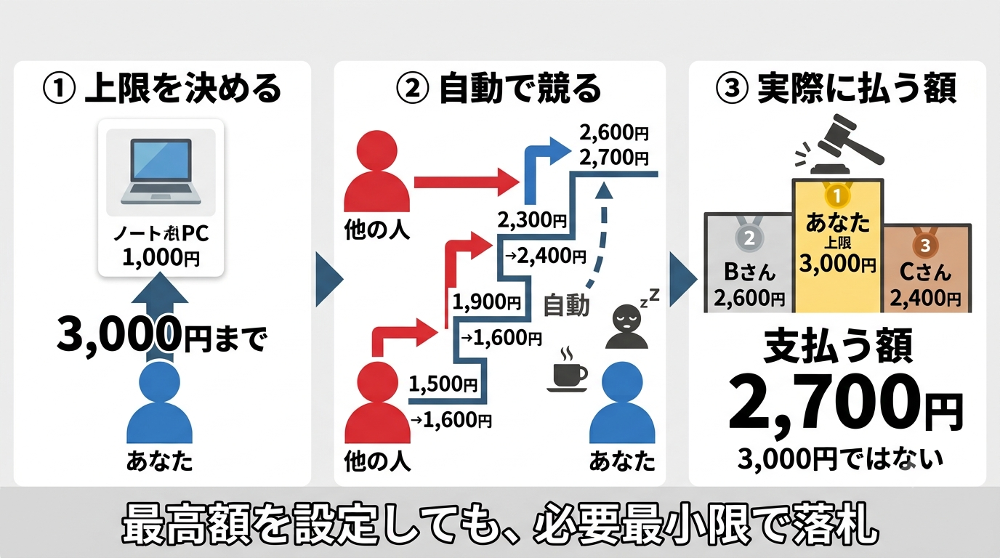
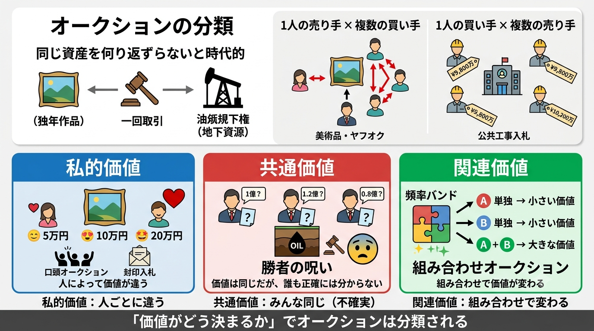
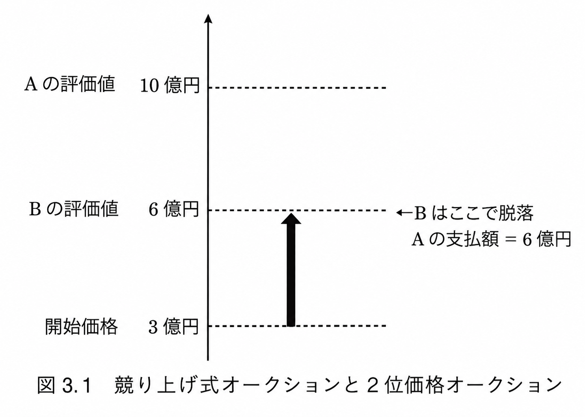
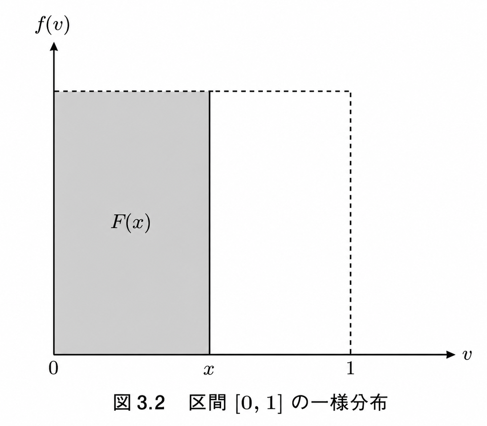

# オークション理論

#### 導入

- 本章ではオークションについて考えます。単一財のオークションから始めて、複数財を同時に販売する場合までを説明します。このようなオークションを考えていく上で重要なのが**2位価格オークション**や**VCG（Vickrey-Clarke-Groves）メカニズム**です。これらはグローブスメカニズムの特殊ケースであることから、2位価格オークションやVCGメカニズムは耐戦略性を満たします。そういう意味でこれらのオークション方式はマーケットデザインでは重要なものなのです。

## ヤフオクの自動入札

- 2007年にアメリカ最大のネットワークサイト$\text{eBay}$と提携したは$\text{Yahoo! Japan}$日本国内最大規模のネットオークションサイト「**ヤフオク！**」を運営しています。
- ヤフオク！では、買い手が出品されている商品に対して価格を入札し、最低入札価格となる「開始価格」が設定され、開始価格（最低入札価格）以上の価格から入札を開始します。入札が開始されると買い手は次々と価格を競り上げていくことができますが、逐一パソコン画面を見て価格変動のチェックは不要です。自動入札機能というものがあり、予め設定した価格になるまで他の人が入札をするたびに自動的に一定の価格を上乗せした価格をコンピュータが入札してくれる仕組みがあります。
- ここで、上乗せされる価格は入札単位と言って、入札されている価格が高くなるほど大きな値になります。1000円未満なら入札単位は10円ですが、入札価格が上昇していくと、100円、250円、500円となっていきます。入札価格が5万円以上では入札単位は1000円となりますが入札単位はこれ以上上昇することはありません。
- 例えば、自動入札機能を使って3000円という価格設定をしたとします。その後、他の買い手が1500円で価格を入札すると、それはまだ設定した3000円ではないので自動的に一定額、この場合では100円を上乗せした1600円をコンピュータが自分の代わりに入札してくれるのです。従って、自動入札機能を用いれば、入札終了時刻が深夜などでその時間まで起きていられないと言った場合でも安心して入札に参加できます。
- さらに、自動入札機能は（厳密には違いますが、）**2位価格オークション**と近い方式になっています。例えば、先ほどの例と同様に自動入札機能を使って3000円という価格を設定したとします。この後、他の買い手が入札をして価格は上昇していきますが、もしあなた以外の人が最後に入札した価格が2600円（3000円未満の価格）とすれば、あなたが支払う額は3000円ではなく、2番目に高い価格（$+\text{入札単位}100$円）になります。
- 以上より、ヤフオク！の仕組みが基本的には2位価格オークションであることがわかりましたが、それでは自動入札機能で一体いくらの価格を設定するのが良いのでしょうか？そこで次に2位価格オークションの仕組みを詳しく調べて、最適戦略がどのようなものであるかを明らかにしていきましょう。

## 様々なオークション

- 本節ではオークション方式を分類し、整理します。貴重な美術品や原油などの天然資源など、「繰り返し同一の財が取引されることがない場合」にオークションという手段が有用です。
- <u>オークションには一般に、美術品のオークションのように1人の売り手に複数の買い手がつく場合と、公共工事の入札のように1人の買い手に複数の売り手がつく場合があります</u>。美術品のオークションでは珍しい美術品を出品する1人の売り手に対して、それに興味を持った複数の買い手が互いに競い合います。公共工事の入札の場合、政府や地方自治体から提示された建設工事の依頼に対して、複数の業者がその工事をいくらで請け負うことができるか、その販売価格を入札します。
- 経済学的にはオークションは①私的価値オークション、②共通価値オークション、③関連価値オークションに分類されます。
  - 【**私的価値（$\text{private value}$）オークション**】オークションで取引される財の評価が、入札する人によって異なるようなオークションであり、美術品、古書、骨董品、など個人のコレクションとして入手しようと考える人にとってはそうした財の評価は人それぞれのはずです。1人の売り手に複数の買い手がつくオークションを想定するときの私的価値オークションの具体例としては、逐一購買希望価格を提示していくような**口頭（$\text{oral}$）オークション**やそれぞれ価格を封に入れて（あるいはコンピュータを使って）一度きりの入札をする**封印（$\text{sealed bid}$）オークション**まで、入札方式（販売ルール）によってさまざま存在します。
  - 【**共通価値（$\text{common value}$）オークション**】取引される財の評価が入札する全員にとって等しいようなオークションであり、具体例として原油の採掘権が挙げられます。ただし、実際に発掘してみるまではどれくらいの量の原油がそこに埋まっているのかはわからないことから、激しく競争し、大枚を叩いて原油採掘権を手に入れたが大損すると行ったこともよく発生します。こうした現象を「**勝者の呪い（$\text{winner's curse}$）**」といいます。
  - 【**関連価値（$\text{affiliated value}$）オークション**】取引される財の評価の間に関連性があるようなオークションであり、具体例として周波数オークションが挙げられます。アメリカを中心に通信事業の自由化が起こりそれまで規制のかかっていた周波数を利用する権利がオークションによって販売されるようになりました。その際、通信事業での利用に当たっては一定幅の周波数帯を利用する権利をまとめて入手しないと利用価値が少ないということがありました。これは周波数帯$A$と$B$の単体では価値は少ないが、$A+B$を手に入れられれば価値が上がるということです。この場合、複数財をどのように組み合わせて誰に販売するのが望ましいのかを考えることから「**組み合わせオークション（$\text{combinatiorial auction}$）**」などとも呼ばれます。

## 2位価格オークション

#### 2位価格オークションと戦略的同値なオークション（競り上げ式オークション）

  【<b>2位価格オークション</b>】単一財がオークションで販売されているとします。
  <ol>
    <li>各プレイヤーは同時に財に対する価格を入札します。</li>
    <li>最高価格を入札したプレイヤーが落札者となり、財を手に入れます。</li>
    <li>落札者は二番目に高い価格を支払います。それ以外のプレイヤーは何も手に入らない代わりに、何も支払う必要はありません。</li>
  </ol>

 

  【<b>競り上げ式（イギリス式）オークション</b>】単一財がオークションで販売されているとします。
  <ol>
    <li>オークショニア（売り手）が最初に開始価格を宣言します。</li>
    <li>オークショニアは価格を一定幅で上昇させます。それをこの時点での最高価格とします。</li>
    <li>その時点での最高価格で財を落札する意思があるプレイヤーはオークションに残り、それ以外のプレイヤーはオークションを降ります。</li>
    <li>もし前の手順3.で残っているプレイヤーが1人しかいない場合、そのプレイヤーが落札者となり、その財を手に入れ、次の手順5.に進みます。そうでない場合、前の手順3.に戻ります。</li>
    <li>落札者はその時点で最高価格を支払います。それ以外のプレイヤーは何も手に入れられない代わりに、何も支払う必要はありません。</li>
  </ol>

 

- 本節では指摘価値オークションに限定して議論します。組み合わせオークションのような関連価値オークションの場合については本性の後半でVCGメカニズムを使って説明します。2位価格オークションのルールは上の流れの通り。
- 一方で、私的価値オークションで1人の売り手に複数の買い手がついているような場合について、最もよく知られているのは**競り上げ式（$\text{asceding}$）** あるいは**イギリス式（$\text{English}$）** オークションです。身近なところでは魚市場での競りや、サザビーズやクリスティズといったオークションハウスで実施されている美術品のオークションが競り上げ式オークションの例になります。競り上げ式のオークションのルールは上の流れの通り。
- 実は2位価格オークションは見かけ上のルールは違いますが、この競り上げ式オークションと全く同じ結果をもたらすオークション方式になっており、**戦略的同値性（$\text{strategic equivalence}$）** を満たします。

#### 【例】2位価格オークションと競り上げ式オークションの戦略的同値性

> 例えば、今2人の入札者$A$と$B$が競り上げ式オークションにおいて、ある美術品を落札しようと競り合っているとします。今は私的価値オークションを考えていますから、ここで$A$と$B$にとっての美術品の評価値は一般に異なります。仮に、$A$にとっての評価値は10億円で、$B$にとっての評価値は6億円だとします。もちろん2人とも相手の評価値は知りませんが、自分の評価値はわかっているものとします。
> 　開始価格が3億円で競りは1000万円単位で行われるとします。オークショニアがだんだんと値を釣り上げていく中、$A$と$B$は互いに相手の出方を伺います。**しかし**オークショニアが提示する金額が6億円ちょうどになった瞬間、その時点でなお$A$には入札の意思があるのを見て、$B$はオークションから降りることになるでしょう。なぜなら6億円と評価している美術品を6億円で勝っても利益は0円ですし、それ以上に値が上がれば、赤字で購入することになって損です。
> 　従って、この2人の間で競り上げ式オークションを行えば、①一番高い評価値を持つ$A$が落札し、②2位の評価値を持つ$B$の評価値、つまり6億円を支払うことになります。
> 　実は2位価格オークションでも全く同じ結果になります。なぜなら、この後で説明しますが、2位価格オークションにおける支配戦略は自分の評価値を正直にそのまま入札することだからです。この例では$A$は10億円、$B$は6億円を入札し、より高い値をつけた$A$が落札し、2番目の価格である6億円を支払うことになります。これは競り上げ式オークションの場合と全く同じ結果になりますので、2位価格オークションと競り上げ式オークションは戦略的に同値であることがわかりました。
> 

#### 1位価格オークションと2位価格オークションの比較

- 2位価格オークションにおいては<b>耐戦略性を満たします</b>。まず、直感的な理解を進めるために1位価格と2位価格とを対比して考えてみましょう。なお1位価格オークションとは、入札者の中で最高の価格をつけた人が落札し、落札者自身がつけた価格を支払うというものです。**公共工事入札では通常、この1位価格オークションが用いられます（ただし、売り手と買い手の立場が逆ですが）**。どちらのオークションにおいても、「**利益と落札確率を共に高め、動機のバランスを取る**」という考えを最適戦略の基礎としています。
- 今、一般に$n$人のプレイヤーがいて、オークションで販売される財に対する各プレイヤー$i$の評価値を$v_i$、入札価格を$b_i$、落札確率を$P_i$とすると、1位価格オークションにおけるプレイヤー$i$の期待利得$E\pi_i^1$は以下のようになります。$$E\pi_i^1=(v_i-b_i)\times P_i$$ここでプレイヤー$i$の落札確率$P_i$はすべてのプレイヤーが入札価格のプロファイル$b=(b_1,\cdots,b_n)$ に依存して決まります。プレイヤー$i$はこの期待利得を最大にするような価格を入札することになります。
- 1位価格オークションにおける落札時の利得は $(v_i-b_i)$ となり、なるべく自分の評価値$v_i$以下の価格$b_i$で落札したいはずです。この性質は一般的に成り立ち、1位価格オークションでは自分の評価値以下の価格をビッドすることが最適戦略になります。具体的には各プレイヤー$i$の評価値が区間 $[0,1]$ の実数から一様分布に従って独立に選ばれており、各プレイヤーが対照的な戦略、つまり、同一の入札戦略を使用している時、プレイヤー$i$の最適なビッド$b_i$は以下のようになります。$$b_i=\frac{n-1}{n}v_i=\left(1-\frac{1}{n}\right)v_i\leqq v_i$$
- 上式からわかるように、プレイヤー$i$の最適なビッド$b_i$はその真の評価値$v_i$以下の値になります。なお$n\rightarrow\infty\implies\frac{1}{n}\rightarrow 0$となるので、$b_i=v_i$ つまり、最適なビッドは真の評価値に等しくなります。これは直感的にはオークションの参加人数が多くなるにつれて競争が激しくなり、入札価格を評価値まで高くしないと落札できなくなるという事実を反映しています。

**【補題3.1】1位価格オークションにおける最適戦略**

> まず、区間 $[0,1]$ の一様分布の確率密度関数$f(v)$ と分布関数 $F(v)$ は以下のようになります。$$f(v)=1,\quad F(v)=v$$評価値 $v=x$ の場合を図解すると、下図のようになります。実際、一様分布のもとでは$x$が区間$[0,1]$上のどの値出会っても等しい確率で選ばれますので、その確率密度は常に1となっています。図のグレー部分の面積は評価値$v$が$x$以下の値となる確率を表しています。これは確率密度$[0,x]$の範囲で合計（積分）した値なので、分布関数$F(x)$と言うことになります。
> 
> 　いま真の評価値が$v$であるプレイヤーが1位価格オークションにおいて価格$b(w)$を入札した場合の期待利得$E\pi$ は以下の通りになります。ここで、下式の$b(\cdot)$は最適な入札価格を決めるビッド関数であり、$F^{n-1}(w)$はプレイヤーの落札確率を表します。$$E\pi=\underbrace{(v-b(w))}_{利得}\times \underbrace{F^{n-1}(w)}_{落札確率}$$$F^{n-1}(w)$について、当該プレイヤーを除く$n-1$人のプレイヤーの評価値が$w$以下である確率$F(w)$を$n-1$回掛け合わせた値です。また、$b(w)$は単調増加関数（$w_1\leqq w_2\implies b(w_1)\leqq b(w_2)$）であるとし、すべてのプレイヤーにとって共通のものとします（**対称的な戦略を仮定**）。
> 　以上の内容を踏まえ、$b(\cdot)$は$w=v$の時にプレイヤーの期待利得$E\pi$を最大にするはずであり、従って、$w=v$における$\frac{\partial\pi}{\partial w}=0$の時に極値を取ります。$$\begin{align*}
    \left.\frac{\partial\pi}{\partial w}\;\right|_{w=v}&=(n-1)(v-b(v))F^{n-2}(v)f(v)-b'(v)F^{n-1}(v)=0
\end{align*}\\[3mm]
\begin{align*}
    \therefore\quad (n-1)vF^{n-2}(v)f(v)&=(n-1)b(v)F^{n-2}(v)f(v)+b'(v)F^{n-1}(v)\\[1mm]
    &=\left[b(v)F^{n-1}(v)\right]'
\end{align*}$$両辺を$v$で積分すると積分定数$C$を用いて下式のように計算できる。$$(n-1)\int vF^{n-2}(v)f(v)dv=b(v)F^{n-1}(v)+C$$ここで$F(v)=v$であり、$F(0)=0$を代入して$C$を求めると$C=0$が得られます。以上より、$f(v)=1,\;F(v)=v,\;C=0$を代入すると、$b(v)$は以下のように求められます。$$\begin{align*}
    (n-1)\int vF^{n-2}(v)f(v)dv=(n-1)\int v^{n-1}dv=\frac{n-1}{n}v^n=b(v)v^{n-1}\\[2mm]
    \therefore\;\underline{b(v)=\frac{n-1}{n}v}
\end{align*}$$以上の計算結果より、最適な入札価格を決めるビッド関数$b(v)$が求まります。

- 以上が1位価格オークションの最適戦略になりますが、2位価格オークションの場合はプレイヤー$i$が落札すると2位のビッド$s_i$を支払うので、落札時の利得は $(v_i-s_i)$ となります。つまり、落札時の支払額は1位価格より2位価格の方が小さくなります。言い換えると、2位価格オークションにおける最適なビッドは1位価格オークションの場合よりも高くなると予想できます。

#### 2位価格オークションの最適戦略

- 上記の予想を踏まえ、今度は落札価格を上げるために自分の評価値以上の価格を入札する誘因が生まれます。しかしこの場合は利益がマイナスになることから、**2位価格オークションでは他のプレイヤーの入札に関係なく、ビッド$b_i$を自分の評価値$v_i$に等しくすることが最適戦略になります**。つまり、**2位価格オークションは耐戦略性を満たします**。また、2位価格オークションは効率性と個人合理性を満たします。

> 【**2位価格オークションの耐戦略性**】
> 真の評価値が$v$であるプレイヤーが2位価格オークションで入札する価格を$w$とします。また、他のプレイヤーが入札する価格のうち最も大きな値を$s$とします。ここで$s$は有限の値$M<\infty$を用いて、区間$[0,M]$において確率密度関数$f$と分布関数$F$に従う確率変数とします。つまり、$s$は区間$[0,M]$上のどの値もゼロではない確率$f(s)>0$で取りうると仮定します。$s<w$と$w<s<M$で利得が異なることに注意して期待利得$E\pi$を求めると次のようになります。$$E\pi=\underbrace{\int_0^w(v-s)f(s)ds}_{「あなた」が落札者になった時の利得}+\underbrace{\int_w^M0\cdot f(s)ds}_{「あなた以外」が落札者になった時の利得}$$この期待利得を最大値は$\frac{\partial E\pi}{\partial w}=0$を解けば得られます。$$\begin{align*}
    \frac{\partial E\pi}{\partial w}&=(v-w)f(w)=0
\end{align*}$$ここで、前述の仮定より$f(w)>0$であることから、$w=v$が期待利得を最大にする価格になります。以上より、2位価格オークションでは自分の真の評価値$v$を入札することが最適である、つまり、耐戦略性を満たすことを証明できました。

## 収益同値定理

#### 前節の振り返り

  【<b>2位価格オークションの特徴</b>】耐戦略性、効率性、個人合理性を満たす。

 

- 2位価格オークションの特徴を上に示します。2位価格オークションは**耐戦略性を満たす**ことから財を最も必要とする人のところに適切に配分されるという**効率性を満たします**。さらに、落札者の評価値$v$は2位の評価値$s$より高く、耐戦略性よりすべてのプレイヤーが正直に表明するので、必ず$v-s>0$であり、落札者以外は何も費用がないため、**個人合理性も満たします**。
- 一方、売り手にとっては収益の方が重要だと考えられます。ところがこれまで考えてきた私的価値オークションで1つの財を販売する場合には（いくつかの標準的な条件のともで）2位価格オークションよりも売り手の収益が大きくなるようなオークション方式を見つけることはできず、**これを収益同値定理（$\text{revenue equivalence theorem}$）** と言います。

#### 収益同値定理

  【<b>収益同値定理</b>】
  ①私的価値オークションのもとで、②各プレイヤーは全員、リスク中立的でかつ対称的であり、最適戦略を用いて入札し、③評価値がゼロの人の支払額はゼロになる、と言う仮定を満たすすべてのオークションにおいて、売り手の期待収益はどれも等しくなる。

 

- 収益同値定理はオークション理論の中で最も重要な成果の一つです。なぜならオークションという方式を通じて売り手が取引から期待できる収益の上限を明らかにするためです。もう少し詳しく説明します。まずプレイヤーは皆**リスク中立的**な人であり、プレイヤーは**対称的**であると仮定します。そして、**情報の非対称性**を想定し、プレイヤーの**評価値は互いに独立**と仮定します。
  - 【**リスク中立的**】期待値が同じならばリスクの有無を問わずどちらでも構わないことをいう。例えば、$100\%$で1億円が得られる投資と$10\%$で10億円になる投資はどちらも期待値は同じ（1億円）なのでどちらも構わないと言う人はリスク中立的な人になります。
  - 【**対称的**】みんなが持っている情報の量や質は同一であると言うこと。
  - 【**情報の非対称性**】他のプレイヤーの評価値がどう言う値の範囲にあり、その範囲の中からそれぞれの評価値がどのような確率で選ばれているかと言う情報は持っていますが、相手が具体的にどのような評価値を持っているか、その実現値までは知らないと言うこと。
  - 【**評価値は互いに独立**】自分の評価値が高いからといって他人の評価値も高いと考える必然性はないと言うこと（必然性がある場合は「関連価値」オークションで考えます）。
- 以上の設定を踏まえ、売り手が収益同値定理の仮定を満たすどのように巧妙な入札方式を考えようとも、そこから得られる平均的な収益は、他の入札方式と変わらないと言うことです。
- これまで紹介してきた、競り上げ式や1位価格、2位価格オークションはすべて、収益同値定理の条件を満たします。なので、平均落札価格はどれも等しいことになります。逆に、この定理の条件を満たさない例としては落札者をランダムに決めるといった入札方式が考えられるでしょう。このように**収益同値定理は**オークションにおいて売り手が稼ぐことのできる期待収益の上限を明らかにすると言う意味で、**一種の不可能性定理**ともいえます。

#### 【例】3位価格オークションおよび$k$位価格オークションの最適戦略

> $n$人が参加する3位価格オークションにおける評価値$v$に対するビッド関数$b(v)$を求めます。各プレイヤーの評価値$v$は区間$[0,1]$から独立に一様分布に従って選ばれているものとします。また、計算の単純化のために、定数$\beta$を用いて$b(v)$は線形、つまり$\color{red}b(v)=\beta v$ だと仮定します。
> 　以降、すべてのプレイヤーが上記の$b(v)$を使用する対称的な場合を考えます。この時、3位価格オークションにおける売り手の収益の期待値$E^3$は3位の入札価格の期待値に等しいことになります。なお、値$x$が$k$番目である確率$P(x)^k$は一般に以下の式で与えられます。
> $$P(x)^k=\frac{n!}{(k-1)!(n-k)!}F(x)^{n-k}(1-F(x))^{k-1}$$　収益同値定理より、$E^3$は$E^1$（1位価格オークションにおける売り手の収益の期待値）に一致することを利用して、$b(v)$における$\beta$を求めます。$E^3$は3位だったプレイヤーの入札価格$b(v)$にそれが3位である確率をかけて、評価値$v$の取りうる範囲$[0,1]$にわたって積分（合計）した値になります。$b(v)=\beta v,\;F(v)=v$を考慮して$E^3$を求めると以下のようになります。
> $$\begin{align*}
    E^3&=\int_0^1b(v)\times P(v)^3dv
    =\int_0^1\beta v\times\frac{n(n-1)(n-2)}{2}v^{n-3}(1-v)^2dv\\[3mm]
    &=\beta\frac{n(n-1)(n-2)}{2}\int_0^1(v^{n-2}-2v^{n-1}+v^n)dv
    =\underline{\beta\frac{n-2}{n+1}}
\end{align*}$$となります。ここで$E^1$は以下の計算式から得られます。$$E^1=n\int_0^1b(v)\times F(v)^{n-1}=n\int_0^1\frac{n-1}{n}v\times v^{n-1}dv=\underline{\frac{n-1}{n+1}}$$従って、
> $$
    E^3=E^1\iff\beta\frac{n-2}{n+1}=\frac{n-1}{n+1}\quad
    \therefore\;\beta=\frac{n-1}{n-2}\quad
    \therefore\;\color{red}b(v)=\frac{n-1}{n-2}v
> $$ここで、$(n-1)/(n-2)>1$より、$b(v)>v$なので、<u>3位価格オークションは評価値$v$よりも高い価格で入札されることがわかります</u>。
> 　同様にして、$k$位価格オークションにおけるビッド関数を求めることができます。具体的には
> $$E^k=\int_0^1b(v)\times P(v)^{k}dv=\beta\int_0^1v\times P(v)^{k}dv=\beta\frac{n-k+1}{n+1}$$のように求められます。3位価格オークションの時と同様、$E^k=E^1$を求めると、以下のようになります。
> $$
>     E^k=E^1\iff\beta\frac{n-k+1}{n+1}=\frac{n-1}{n+1}\quad
>     \therefore\;\beta=\frac{n-1}{n-k+1}\quad
>     \therefore\;\color{red}b(v)=\frac{n-1}{n-k+1}v
> $$
> 

## 複数財オークションの分類

- ここまでは単一財を売り買いする場合のオークションを考え、**2位価格オークション**や**収益同値定理**といったオークション方式を設計する上で知っておくべき重要事項を学びました。
- ここからは同時に複数の財をオークションにかけられる場合を考えます。まずは複数財オークションの分類から行います。
  - 【**同質財 or 異質財**】販売される財が同一の品質であれば同質財、何らかの側面で質的に異なる財である場合は異質財となります。例えば、同じ年に製造されたワインは同室財、美術品はそれぞれ全く別の作品が競にかけられることから異質財になります。
  - 【**代替財 or 補完財**】2つの財のうちどちらか一方を入手できれば十分であれば代替財、両方を手に入れないと価値がない場合を補完財と言います。例えば、飲み物のお茶とジュースは代替財、パソコン本体とソフトウェアは補完財、という考え方になります。
  - 【**同時オークション or 逐次オークション**】複数財を同時にオークションにかけるのが同時オークション、1つずつ順番にオークションにかけるのが逐次オークションと言います。

## 差別化各オークションと一様価格オークション

- 

## Googleの広告オークション

- 

## VCGメカニズム

  【<b>VCGメカニズム</b>】
  <ol>
    <li>各プレイヤーはオークションされる財の配分に関する<ruby>あらゆる<rt>⚫︎⚫︎⚫︎⚫︎</rt></ruby>組み合わせに対する便益（選好）を表明します。</li>
    <li>表明された各プレイヤーの便益の合計が最大になるよう財の配分を決定します。</li>
    <li>各プレイヤーの支払額は手順2.での配分決定と、<ruby>そのプレイヤーを除く<rt>⚫︎⚫︎⚫︎⚫︎⚫︎⚫︎⚫︎⚫︎⚫︎⚫︎</rt></ruby>他のプレイヤー全員が表明した選好に基づく配分決定とに基づいて決定されます。</li>
  </ol>

 

- これまで、一般化された2位価格オークションは耐戦略性を満たさないことを確認しました。本節では、2位価格オークションを複数財取引する場合に一般化した「**VCGメカニズム**」を紹介します。VCGはこのメカニズムを独立に発見した3人の経済学者、ヴィッカレー、クラーク、グローブスの頭文字をとったものです。VCGメカニズムの具体的な処理は上記のとおりです。

#### モデル

- まず、一般に$n$人のプレイヤーと$m$個の財が存在し、同時オークションにかけられるとします。各プレイヤー$i$は私的財の初期保有$x_{i}$を持っているものとし、オークションにおけるプレイヤー全員の財の配分（の組み合わせ）を$G$とすると以下のように表現できます。$$
\begin{align*}
  G&=\left(\begin{array}{cccc}
    g_{11}&g_{12}&\cdots&g_{1m}\\[1mm]
    g_{21}&g_{22}&\cdots&g_{2m}\\[1mm]
    \vdots&\vdots&\ddots&\vdots\\[1mm]
    g_{n1}&g_{n2}&\cdots&g_{nm}\\[1mm]
  \end{array}\right)\quad
  g&=\left\{
    \begin{array}{ll}
      1&i\text{ に }j\text{ が配分された場合}\\[1mm]
      0&\text{otherwise}
    \end{array}
  \right.
\end{align*}\\[2mm]
\sum_{i=1}^ng_{ij}=1,\quad j\in\{1,2,\cdots,m\}$$ここで$G$の各要素は$g_{ij}\in\{0,1\}$を満たし、配分された場合は1、そうでなければ0となる。つまり、$G$の各行$g_i$はプレイヤー$i$の財の配分を表すベクトルを意味します。
- 次に$i$の選好$w_i$を集めた選好プロファイル$w$から決定関数$d$を定義します。$w(G)=(w_1,\;w_2,\cdots,w_n)$とすると、この時の財の配分$G$は$d$を用いて以下のように決まります。$$d(w)=\max_G\;\sum_{i=1}^nw_i(G)$$なお、どの財の供給費用もゼロ、つまり$c(G)=0$と基準化しておきます。これは、「**売り手にとっては財に価値はない**」ことを意味します。以上の定義より、各プレイヤー$i$が表明した選好をもとに便益の合計が最大になる財の配分が選ばれます。つまり、**VCGメカニズムは効率性を満たします**。
- 最後に各プレイヤーの支払額は支払関数$t_i$によって次のように定義されます。$$t_i=\sum_{k\neq i}w_k(d(w_{-i}))-\sum_{k\neq i}w_k(d(w))$$右辺の第1項はプレイヤー$i$が<ruby>参加しなかった<rt>⚫⚫⚫⚫⚫⚫⚫</rt></ruby>場合の利得合計を表し、第2項はプレイヤー$i$が<ruby>参加した<rt>⚫⚫⚫⚫</rt></ruby>場合の利得合計を表します。つまり、$t_i$はプレイヤー$i$の参加によって他プレイヤーが損した利得（稼ぐことができた利得）の合計を表します
- 最終的なプレイヤー$i$の利得関数$u_i$は$u_i(x_i,\;G)=x_i+v_i(G)-t_i$となります。ここで、利得関数$u_i$は準線形とします。

#### VCGオークションの例

> 今、3人のプレイヤー$A,B,C$が財$X,Y$を手に入れるためにオークションに参加することを考えます。財の配分$G$は第1列を$X$、第2列を$Y$の配分を示し、第1行から第3行はそれぞれ$A,B,C$を示す行列とすると、$G$は次の9通りが考えられます。$$\begin{align*}
>   &G_1=\left(\begin{array}{c}
>     1&1\\
>     0&0\\
>     0&0
>   \end{array}\right),\;
>   G_1=\left(\begin{array}{c}
>     1&0\\
>     0&1\\
>     0&0
>   \end{array}\right),\;
>   G_1=\left(\begin{array}{c}
>     1&0\\
>     0&0\\
>     0&1
>   \end{array}\right),\\[5mm]
>   &G_4=\left(\begin{array}{c}
>     0&1\\
>     1&0\\
>     0&0
>   \end{array}\right),\;
>   G_5=\left(\begin{array}{c}
>     0&0\\
>     1&1\\
>     0&0
>   \end{array}\right),\;
>   G_6=\left(\begin{array}{c}
>     0&0\\
>     1&0\\
>     0&1
>   \end{array}\right),\\[5mm]
>   &G_7=\left(\begin{array}{c}
>     0&1\\
>     0&0\\
>     1&0
>   \end{array}\right),\;
>   G_8=\left(\begin{array}{c}
>     0&0\\
>     0&1\\
>     1&0
>   \end{array}\right),\;
>   G_9=\left(\begin{array}{c}
>     0&0\\
>     0&0\\
>     1&1
>   \end{array}\right)
> \end{align*}$$次にプレイヤーの選好表は次のようになっているものとします。
>
> **表：配分に対するプレイヤーの評価値**
> 
> |     | 財$X$ | 財$Y$ | 財$X$と$Y$ |
> | --- | :---: | :---: | :--------: |
> | $A$ | $0$     | $0$     | $2$          |
> | $B$ | $2$     | $0$     | $2$          |
> | $C$ | $0$     | $2$     | $2$          |
>
> 上表より、$A$は$X$と$Y$の両方を手に入れて初めて利得2を得ます。一方、$B$と$C$はそれぞれ$X$か$Y$を手に入れる、あるいは両方を手に入れて利得2を得ます。このことから、財$X,Y$は **$A$にとって補完財**、**$B$と$C$にとって代替財**ということになります。また、各プレイヤーは財$X$のみ、$Y$のみ、$X,Y$両方の3通りにおける財の組み合わせに対してオークションするため、このオークションは「**関連価値オークション（組み合わせオークション）**」に分類されます。
> 　ここから、各プレイヤーの選好$w_i,\;i\in\{A,B,C\}$を求め、決定関数$d$を計算します。まず、各プレイヤーの選好は上表より次のようになります。$$\begin{align*}
>   w_A&=(v_A(G_1),\;v_A(G_2),\cdots,\;v_A(G_9))=(2,0,0,0,0,0,0,0,0)\\[1mm]
>   w_B&=(v_B(G_1),\;v_B(G_2),\cdots,\;v_B(G_9))=(0,0,0,2,2,2,0,0,0)\\[1mm]
>   w_C&=(v_C(G_1),\;v_C(G_2),\cdots,\;v_C(G_9))=(0,0,2,0,0,2,0,0,2)
\end{align*}$$以上の結果を踏まえ、配分$G_1$から$G_9$と選好$w_A,w_B,w_C$をまとめると下表のようになります。
> 
> **配分の組み合わせ**
> 
> | 配分  | 配分の内訳         |   3人の評価値の和 $d(w)$    |
> | :---: | ------------------ | :------------------: |
> | $G_1$ | $A$に$X$と$Y$      |      $2+0+0=2$       |
> | $G_2$ | $A$に$X$、$B$に$Y$ |      $0+0+0=0$       |
> | $G_3$ | $A$に$X$、$C$に$Y$ |      $0+0+2=2$       |
> | $G_4$ | $B$に$X$、$A$に$Y$ |      $0+2+0=2$       |
> | $G_5$ | $B$に$X$と$Y$      |      $0+2+0=2$       |
> | $G_6$ | $B$に$X$、$C$に$Y$ | $\color{red}0+2+2=4$ |
> | $G_7$ | $C$に$X$、$A$に$Y$ |      $0+0+0=0$       |
> | $G_8$ | $C$に$X$、$B$に$Y$ |      $0+0+0=0$       |
> | $G_9$ | $C$に$X$と$Y$      |      $2+0+0=2$       |
>
> これを決定関数$d$を用いて計算すると次のようになります。$$d=\max_G\sum_{i}w_i(G)=\sum_{i}w_i(G_6)=0+2+2=4$$このことから、財の配分は$B$に$X$、$C$に$Y$を配分する結果になりました。
> 　次に配分に対する支払額$t_i,\;i\in\{A,B,C\}$を計算します。まず、$A$の支払額$t_A$について、$A$が参加しなかった場合の配分と参加した配分はともに$G_6$であるため、$t_A$は以下になります。$$
> t_A=v_B(G_6)+v_C(G_6)-\left[\;v_B(G_6)+v_C(G_6)\;\right]=0
> $$次に$B$の支払額$t_B$について、$B$が参加しなかった時の配分は$G_1,G_3,G_9$になり、参加した場合の配分は$G_6$になります。今回は代表として$G_3$を選ぶと$t_B$は以下になります。$$
> t_B=v_A(G_3)+v_C(G_3)-\left[\;v_A(G_6)+v_C(G_6)\;\right]=0+2-\left[0+2\right]=0
> $$最後に$C$の支払額$t_C$について、$C$が参加しなかった時の配分は$G_1,G_4,G_5$になり、参加した場合の配分は$G_6$になります。今回は代表として$G_1$を選ぶと$t_C$は以下になります。$$
> t_C=v_A(G_1)+v_B(G_1)-\left[\;v_A(G_6)+v_B(G_6)\;\right]=2+0-\left[0+2\right]=0
> $$以上より、$B$が$X$、$C$が$Y$を手にいれ、3人とも何も支払わなくて良いという帰結を得る。

#### VCGメカニズムによる広告オークション

> 3つの旅行会社$A,B,C$があり、2つの広告枠のオークションを行います。$A,B,C$の各社の広告1クリックあたりの評価値はそれぞれ600円/回、300円/回、100円/回だとします。また1時間あたりで見て1位の広告枠の平均クリック数は100回、2位の広告枠の平均クリック数は90回とします。
> 　$A$社と$B$社がそれぞれ1位と2位の広告枠を落札することになり、それぞれ$600円/回\times 100回=60,000円$、$300円/回\times 90回=27,000円$を得ます。
> 　そして$A$社の支払額について、もし$A$社が参加しなかった時は$B$社は$300円/回\times 100回=30,000円$、$C$社は$100円/回\times 90回=9,000円$を得、$A$社が参加した場合は前述の通り$B$社は$30,000$円、$C$社は$0$円になります。このことから、$A$の支払額$t_A$と利得$u_A$は以下のようになります。$$\begin{align*}
>   t_A&=30,000+9,000-(27,000+0)=12,000円\\
>   u_A&=60,000-t_A=48,000円
> \end{align*}$$同様にして、$t_B,u_B,t_C,u_C$を求めると以下のようになります。$$\begin{align*}
>   t_B&=60,000+9,000-(60,000-0)=9,000円\\
>   u_B&=27,000-t_B=18,000円\\
>   t_C&=60,000+27,000-(60,000+27,000)=0円\\
>   u_C&=0-t_C=0円
> \end{align*}$$

- 以上のVCGメカニズムの結果は前述のGSP方式の広告オークションでの支払額の合計$39,000$円よりも低いという事実です。この性質はここでの例に限らず、両方の仕組みでプレイヤーが同じ価格を入札した場合にはいつでも成立することが示されています。
