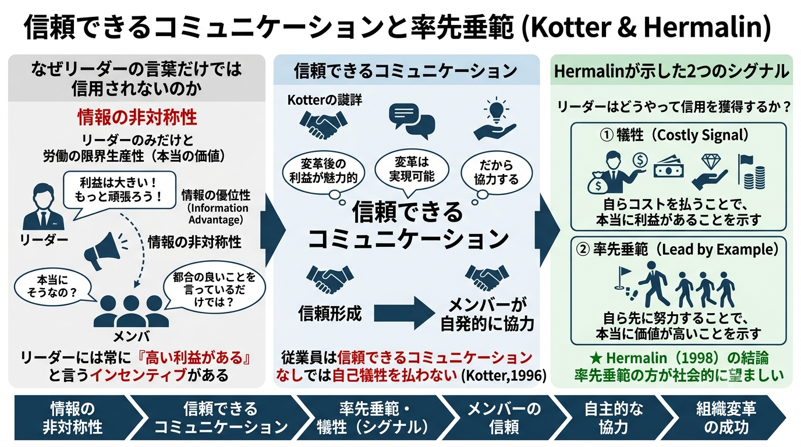
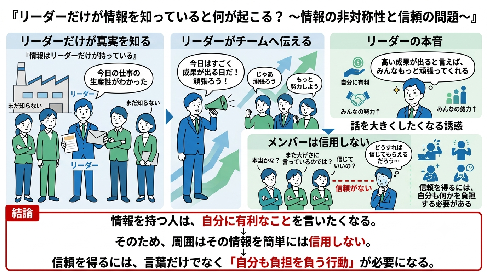

# A-14章 リーダーシップの経済学

## 信頼できるコミュニケーションと率先垂範

- リーダーシップ論の代表的な論客であるハーバード・ビジネス・スクールのコッター（John P.Kotter）はリーダーシップの性質について次のように述べている。
    > 大規模な変革は企業内のほとんどの従業員が時には短期的な自己犠牲を厭わず、変革に協力を惜しまないレベルに達しなければ、その成功はおぼつかない。しかし従業員はたとえ現状に満足していない場合でも、**変革の成功の後に得られる利益が魅力的、かつ、その変革が実現可能だと確信できない限り**、自己犠牲をは払うことはあり得ない。つまり、念の入った**トップからの信頼できるコミュニケーションがなければ、従業員の心と気持ちを掴むことは不可能となる**（Kotter, 1996）。
- また、組織の経済学のリーダーシップの経済学において Hermalin（1998）はリーダーシップを「組織のメンバーが強制されてではなく、自主的にリーダーの指示に従うこと」と定義している。その上で<u>なぜ組織のメンバーが自主的にリーダーの指示に従うか</u>を分析している。Hermalin（1998）のモデルはリーダーがメンバーよりも「情報の優位性」を持っていることを前提し、メンバー全体に影響を与えうる情報を持っていることがリーダーシップの源泉であるとして議論を展開している。
- 【**リーダーとメンバーのそれぞれの立場**】メンバー全体に影響を与えるような「**メンバーの労働の限界生産性**」を確率変数として考える。この値は高い値かもしれないし、低い値かもしれない。その真の値を知りうるのはリーダーしかいないと「仮定」する（確率変数の値について他のメンバーが知らない私的情報をリーダーが持っていることになる）。この場合、リーダーはメンバーに対して確率変数の真の値を正直に伝達するかと言えば、必ずしもそうとは限らない。リーダーとしてはメンバーには常により多く働いてもらいたいので真の値が高低にかかわらず、確率変数は高い値であるとメンバーに伝達して働かせようとするインセンティブがあるからである。これを予想するメンバーはリーダーが労働の限界生産性は高い値であるというシグナルをメンバーに対して送ったとしても、そのシグナルを信じないことになりうる。この構造の下でリーダーはどのような対応を取ることができるだろうか。
- 【**リーダーがメンバーを納得させる手段**】真に確率変数（労働の限界生産性）が高い値である時はリーダーは自分に協力して労働することが得であることをメンバーに伝達するとともに自らが真実を語っていることをメンバーに確信させなければならない。これは、Kotter（1996）のいう信頼できるコミュニケーションの必要性に相当する。そこで、リーダーは確率変数の値が本当に高い値であることをメンバーに納得させるための手段を講じることになる。この手段として Hermalin（1998）は2つの方法を挙げている。
  - 【**1つ目の手段**】リーダーの「**犠牲**」である。リーダーがメンバーに対して付加的な支払いをするなどの犠牲を払うことによって、その犠牲を払ってでも高い利益が実現するのだということを示し、メンバーに確率変数は高い値であることを納得させるわけである。
  - 【**2つ目の手段**】リーダーの「**率先垂範**」である。リーダー自身がまずは努力（労働）を自ら率先して行うことによって、確率変数が1人で努力をしても価値のあるほどの高い値であることをメンバーに対して信用できる情報として示すのである。
- Hermalin（1998）は「<b>率先垂範</b>」の方が社会的に望ましいことを示している。ここでは、Hermalin（1998）の連続変数のモデルではなく、Hermalin（2003, 2007）の離散変数モデルを簡略化したモデルを説明する。

## 【準備】リーダーシップのモデル

#### モデリング

- $n$人の同質的なメンバーから構成されるチームを考える。メンバー$j$の努力量を$e_j\geqq 0$とし、チームの生産性を表すパラメータ（確率変数）を$\theta$とする。この時、個々のメンバーには努力のコスト$d(e_j)$とチームの成果物（合計生産額）$V$を以下のように定義する。$$\begin{align*}
    【\text{チームの合計生産額}】&\quad V=\theta\sum_{i=1}^ne_i\\[3mm]
    【\text{メンバー}j\text{の努力コスト}】&\quad d(e_j)=\frac{e_j^2}{2}
\end{align*}$$
- $V$の値のみが観察可能かつ立証可能（verifiable：ある事実や個人の行動（努力など）を客観的な第三者が観察し、証明・確認できる状態）で、$\theta$と個々のメンバーの努力量$e_j$は立証可能ではないとする。このため、契約は合計生産物$V$の値のみに基づいて（条件づけて）可能である。個々のメンバーはチームの合計生産額の$1/n$を受け取るものとする。
- 上述の生産性$\theta$の値は1人のメンバーにだけ知らされるとし、そのメンバーを「**リーダー**」と呼び、リーダーは自分の努力量を決める前に$\theta$を知らされるとする。そして、リーダーに$\theta$の値が知らされることはチーム内での共有知識（common knowledge）であるとする。
- メンバー$j$が$\theta$について抱いている信念（belief）、いわば予想値を$\theta_j$とする。メンバー$j$の効用$u_j$はチームの合計生産額のうちの自分の取り分の期待値から自分の努力量のコストを差し引いたものであり、下式のように表現できる。$$【\text{効用関数}】\quad u_j=\frac{1}{n}E\left[\left.V\;\right|\;\theta_j\right]-d(e_j)=\frac{1}{n}E\left[\left.\theta\sum_{i=1}^ne_i\;\right|\;\theta_j\right]-\frac{e_j^2}{2}$$

#### チーム生産問題と最適な努力量

- メンバー$j$は努力量を次のように選択する。$$\begin{align*}
    \max_{e_j}\;u_i&=\max_{e_j}\;\left[\frac{\theta_j}{n}\left(e_j+\sum_{i\neq j}e_i\right)-\frac{e_j^2}{2}\right]\\[5mm]
    &\implies\frac{\partial u_j}{\partial e_j}=\frac{\theta_j}{n}-e_j=0
\end{align*}\\[3mm]
【\text{個人の最適な努力量}】\quad\underline{\therefore\;e_j=\frac{\theta_j}{n}(\;\equiv e(\theta_j)\;)}$$
- 上式のようにメンバー$j$が$\theta_j$を予想する時の自己にとって望ましい努力量である。ここから以下の洞察（結果）が得られる。
  - 【**結果1**】メンバー$j$（労働者$j$）にとって望ましい自己の努力量$e_j$は$\theta$の予想（$\theta_j$）が大きければ大きいほど大きくなる。つまり、$e(\theta_j)$が$\theta_j$の増加関数になっている。
  - 【**結果2**】各メンバーの努力量はチームの成果物（合計生産額）を最大化するファーストベストの場合の努力量よりも小さくなる。
- 【**結果2**】は次の通り導出される。すべてのメンバーが$\theta$についての同じ予想 $\bar{\theta}$ を抱いているとすると、すべてのメンバーが努力量として$e(\bar{\theta})=\bar{\theta}/n$を選ぶ。これを踏まえて、ファーストベストは下式のように求められる。$$\begin{align*}
    \max_{e_j}\;\left[V-\sum_{i=1}^nd(e_i)\right]&=\max\;\left[\bar{\theta}\sum_{i=1}^ne_i-\sum_{i=1}^n\frac{e_i^2}{2}\right]\\[5mm]
    &=\max\;\left[\bar{\theta}\left(e_j+\sum_{i\neq j}e_i\right)-\left(\frac{e_j^2}{2}+\sum_{i\neq j}\frac{e_i^2}{2}\right)\right]\\[5mm]
    &\Rightarrow\frac{\partial}{\partial e_j}\left(V-\sum_{i=1}^nd(e_i)\right)=\bar{\theta}-e_j=0
\end{align*}\\[5mm]
【\text{チーム全体の最適な努力量}】\therefore\quad\underline{e_j=\bar{\theta}(\;\equiv e^*(\bar{\theta})\;)}$$
- 以上より、自己の努力がまるまる受け取れるのであれば、各メンバーは $e_j=\bar{\theta}$ の努力をするが「成果はみんなで分かち合う」ので努力量が $e_j=\bar{\theta}/n$ に減少してしまう。経済学でいう古典的な「**チーム生産問題（フリーライド問題）**」が生じている。

## 情報が1人の人間には知らされる場合〜「リーダー」が存在する場合〜

- 以上の準備の上で以下、本題のリーダーシップの経済学の検討、すなわち「**生産性を表すパラメータ $\theta$ の値がリーダーだけ（1人だけ）知らされる場合**」を考える。リーダー割り当てからメンバーの努力量選択までの具体的な流れは次のとおり。
  1. メンバー（労働者）のうちの1人がリーダーとする。リーダーはメンバーらが自己の努力量$e_j$を選択する前に$\theta$の真の値を完全に知る（$\theta$について他のメンバーが知らない私的シグナル［$\text{private signal}$］を受け取る）。
  2. リーダーは他のメンバーに対して$\theta$の値は$\hat{\theta}$であると知らせる。
  3. リーダー以外のメンバーらは知らされた値をもとに自己の努力量$e(\hat{\theta})=\hat{\theta}/n$を選択する。
- この時のリーダーの努力量を$e_L$とすると次の効用関数$u_L$を得る。$$u_L=\frac{\theta}{n}\left(e_L+\frac{n-1}{n}\hat{\theta}\right)-\frac{e_L^2}{2}$$上式からリーダーにとっては$\hat{\theta}$の値に比例して自身の効用$u_L$が高くなり、他のメンバーに大きな努力をさせることができるため、望ましいということがわかる。このことからリーダーにとっては真の値$\theta$に関わらず、生産性が高いとアナウンスする、つまり「**一番高い$\theta$の値をアナウンスすることが常に望ましい**」ということになる。上記の内容を【**結果3**】として以下にまとめる。
  - 【**結果3**】リーダーの効用$u_L$は$\hat{\theta}$の値の増加関数であるが故にリーダーは取りうる生産性$\theta$の値のうち、最大の生産性をメンバーに知らせるインセンティブがあり（すなわち、耐戦略性がない・戦略的に操作可能である）、ゆえに、他のメンバーはリーダーのアナウンスメントを単純に信用しない。このことから、<u>信用しないメンバーに対してリーダーは自分にとって何らかコストになる行為を行い、アナウンスメントが嘘でないことを伝えないといけない</u>。
- 結果3を踏まえ、リーダーがとる「**何らかのコストになる行為**」について2つの方法を検討する。
  - 【**アプローチ1**】リーダーの「**犠牲**」によるリード
  - 【**アプローチ2**】リーダーの「**率先垂範**」によるリード

#### リーダーの犠牲によるリード

- 第一の方法はリーダーの「**犠牲**」によるリード（Leading by Sacrifice）と呼ばれる方法である。簡単化のため生産性が高い状態と低い状態の2つの状態だけがありうるとする。すなわち、$\theta\in\{\theta_0,\;\theta_1\},\quad\theta_0<\theta_1$ である。真の状態は生産性の低い状態$\theta_0$とする。従って、リーダーは「生産性は$\theta_1$である」とアナウンスするメリットがある（<b>嘘をつくインセンティブがある</b>）。
- この時、リーダーが正直に$\theta_0$をアナウンスして、メンバーたちがそれを信じたときのリーダーの効用を$u_L(\theta_0|\theta_0)$、リーダーが嘘をついて$\theta_1$をアナウンスして、メンバーたちがそれを信じたときのリーダーの効用を$u_L(\theta_1|\theta_0)$とすると、それぞれ次のように計算できる。$$\begin{align*}
  u_L(\color{red}\theta_0\color{black}|\theta_0)&=\frac{\theta_0}{n}\left(\frac{\theta_0}{n}+\frac{n-1}{n}\color{red}\theta_0\color{black}\right)-\frac{(\theta_0)^2}{2n^2}\\[3mm]
  u_L(\color{blue}\theta_1\color{black}|\theta_0)&=\frac{\theta_0}{n}\left(\frac{\theta_0}{n}+\frac{n-1}{n}\color{blue}\theta_1\color{black}\right)-\frac{(\theta_0)^2}{2n^2}
\end{align*}\\[2mm]
\underline{\theta_0<\theta_1\text{ より、}u_L(\color{red}\theta_0\color{black}|\theta_0)<u_L(\color{blue}\theta_1\color{black}|\theta_0)\text{ が成り立つ。}}$$上の結果から**リーダーは嘘をついて$\theta_1$をアナウンスするインセンティブがある**。
- ここで、$t_L(\theta_1)\equiv u_L(\theta_1|\theta_0)-u_L(\theta_0|\theta_0)$ と定義する。そして次の結果4を示す。
  - 【**結果4**】リーダーが嘘をついて$\theta_1$をアナウンスする時に限っては他のメンバーに対して合計で$t_L(\theta_1)$を支払う（「**犠牲**」を払う）ことに合意するならば、リーダーには嘘をつくインセンティブがなくなる。ちなみに他のメンバーはそれぞれ $\frac{t_L(\theta_1)}{n-1}$ を受け取ることになる。
- ここでのリーダーの「**犠牲**」とは努力が大きな便益に結びつくと確信させるためにチームに見返りを約束するものであり、<u>例えば、**①大きなプロジェクトが終了したのちの長い休暇の約束**や**②プロジェクトで残業するメンバーへの食事の提供**、などがある</u>。
- 念の為、真の生産性が$\theta_1$であるとき、リーダーは$t_L(\theta_1)$を支払ってでも正直に$\theta_1$とアナウンスするインセンティブがあるか$[\;u_L(\color{blue}\theta_1\color{black}|\theta_1)-u_L(\color{red}\theta_0\color{black}|\theta_1)>u_L(\color{blue}\theta_1\color{black}|\theta_0)-u_L(\color{red}\theta_0\color{black}|\theta_0)\;]$を確認する。$$\begin{align*}
  u_L(\color{blue}\theta_1\color{black}|\theta_0)-u_L(\color{red}\theta_0\color{black}|\theta_0)&=\frac{\theta_0}{n}\cdot\frac{n-1}{n}(\color{blue}\theta_1\color{black}-\color{red}\theta_0\color{black})\\[3mm]
  u_L(\color{blue}\theta_1\color{black}|\theta_1)-u_L(\color{red}\theta_0\color{black}|\theta_1)&=\underline{\frac{\theta_1}{n}\cdot\frac{n-1}{n}(\color{blue}\theta_1\color{black}-\color{red}\theta_0\color{black})>u_L(\color{blue}\theta_1\color{black}|\theta_0)-u_L(\color{red}\theta_0\color{black}|\theta_0)}
\end{align*}$$

#### リーダーの率先垂範によるリード

- 第二の方法はリーダーの「**率先垂範**」によるリード（Leading by Example）であり、この方法が$\text{Hermalin（1998）}$がメインテーマとして主張している。ゲームの設定は次のとおり。
  1. リーダーは他のメンバーが努力量を決める前に自己の努力量$e_i$を選択する
  2. 他のメンバー（フォロワー）はリーダーが決めた努力量を観察し、その後、各々の努力量を「**独立に、かつ、同時に**」選択する。
- ここで、リーダーの選択する努力量$e_i$はシグナル（コストがかかるもの）としての役割を果たす。リーダーが生産性$\theta_i$を観察した時、リーダーは$e_i$を選択する。この時、リーダー以外の他のメンバー（フォロワー）は$e_i$を観察したときに真の生産性の状態が$\theta_i$であると信じるならば、フォロワーは$e_i$を観察したとき努力量 $e(\theta_i)$ を選択する。これがリーダーの「<b>率先垂範</b>」によるリードである。リーダーの「**率先垂範**」によるリードが成立させることを考える時、「真の状態が生産性の低い$\theta_0$の状態である時、リーダーが$e_1$の努力量を選択したくならないようにできるだろうか」という視点から考える。具体的にはリーダーの効用$u_L$を以下のように定義し、次の2つの制約を考える。$$\begin{align*}
  【リーダーの効用】&u_L(e_i|\theta_i)=\frac{\theta_i}{n}\left\{e_i+\frac{n-1}{n}\theta_i\right\}+\frac{(e_i)^2}{2}
\end{align*}$$
  - 【**制約1**】真の状態が生産性の低い$\theta_0$であるとき、リーダーが$e_0$の努力量を選択したくならなければならない。つまり、$u_L(e_1|\theta_0)\leqq u_L(e_0|\theta_0)$
  - 【**制約2**】真の状態が$\theta_1$であるとき、リーダーが$e_1$の努力量を選択したくならなければならない。つまり、$u_L(e_0|\theta_1)\leqq u_L(e_1|\theta_1)$
- 上記2つの制約を両方満たす$(e_0,e_1)$のペアはたくさんあり得るが、この中でリーダーにとって自己のコストが最小となるペアを考えると $(e_0,\;e_1)=(e(\theta_0),\;\hat{e_1})$となる。ここで、$\hat{e_1}$は$u_L(\hat{e_1}|\theta_0)=u_L(e_0|\theta_0)$を満たす値である。上記のペアの直感的な理由は次の通り。$\hat{e_1}$の値は真の状態が$\theta_0$の時に偽って$e_1$を示したくならない程度にリーダーにとってかかる最小コストを意味する。問題の処理の詳細が知りたい方はミクロ経済学の教科書でシグナル理論を参照されたい。
- 以上を踏まえ、以下の結果5が得られる
  - 【**結果5**】もしチームの規模($n$)が大きければ、$e(\theta_1)=\theta_1/n<\hat{e_1}$となる。この結果、**リーダーによる「率先垂範」の場合**の方が、全てのメンバーが真の状態を知っている**対称情報（$\text{symmetric information}$）の場合**よりもかえってチーム全体にとってはチームの成果物（合計生産額）が大きくなり、総効用（ウェルフェア）は高くなる。
- 結果5を補足する。人数$n$（チームの規模）が大きくなると、全てのメンバーが真の生産性を知っている対称情報の場合、各メンバーの努力量 $e(\theta_1)=\theta_1/n$ はチームの成果物（合計生産額）を最大化するファーストベストの場合の努力量$\theta_1$よりもはるかに小さくなる（**フリーライド問題**）。このことから、リーダーが$e(\theta_1)=\theta_1/n$ではなく、$\hat{e_1}$の努力量を選択し、「<b>余計に</b>」働くことでチーム全体の成果物はファーストベスト（チームの成果物の最大化）の場合により近づくことになる。
- 以上の結果からリーダーは「**他のメンバーよりも高い努力をしなければならない**」ということであり、ハードワークをしなければならなくなる。一方で、他のメンバーの努力量は「**対称情報**」の場合と、「**率先垂範**」の場合とで変わらない。すなわち「**率先垂範**」の場合、リーダーが過剰な努力を1人で負担することになる。

## 率先垂範の優越性

- さらに得られる洞察としてリーダーの「**率先垂範**」によるリードの場合、リーダーの「犠牲によるリードの場合よりもチームとしてより大きな総効用が得られる。具体的には真の生産性が$\theta_0$の時は「犠牲」と「率先垂範」とで差はないが、真の生産性が$\theta_1$の時は、**リーダーの努力量の違いによって生じる差（$e(\theta_1)<\hat{e}$）が生まれ総効用が大きくなる**。ただし、フォロワー（リーダー以外のメンバー）の努力量に変化はない。
- 本章の内容をまとめると次のことが得られる。
  - ①リーダーの「**犠牲**」によるリードも、リーダーの「**率先垂範**」によるリードも両方とも**シグナリング（signalling）** の一形態である。
  - ②前者の「**犠牲**」の場合、シグナルは移転・移し替え（transfer）であって、チーム全体の効用（総効用）に直接的な影響がない。後者の「**率先垂範**」の場合、シグナルは生産的な行為であり、直接的にチーム全体の総効用を増加させる。
  - 「<b>率先垂範</b>」は全てのメンバーが真の状態を知っている対称情報（symmetric information）の場合より優れている。この点は<u>組織の構造を考えるにあたって、情報をリーダーの手元に置き、時期尚早のうちに社内に広く行き渡らせないようにすることがかえって望ましいことを示唆する可能性がある</u>。

**【表】犠牲と率先垂範のリーダーシップの違い**

| 真の生産性 | リーダーシップ | リーダーの努力量 | フォロワーの努力量 |
| :--------: | :------------: | :--------------: | :----------------: |
| $\theta_0$ |    【犠牲】    |  $e(\theta_0)$   |   $e(\theta_0)$    |
| $\theta_0$ |  【率先垂範】  |  $e(\theta_0)$   |   $e(\theta_0)$    |
| $\theta_1$ |    【犠牲】    |  $e(\theta_1)$   |   $e(\theta_1)$    |
| $\theta_1$ |  【率先垂範】  |   $\hat{e}_1$    |   $e(\theta_1)$    |

## 長期に活動するリーダーへの議論の拡張

- Hermalin（2003, 2007）は<u>リーダーが毎期毎期、リーダーシップを発揮し、フォロワーが毎期毎期、変わる（入れ替わる）場合にモデルを拡張している</u>。この場合、リーダーが偽る行動を取れば、のちにばれてしまい、そしてばれれば以降のフォロワーの協力は得られなくなってしまう。従って、この想定下ではコストのかかるシグナルを導入しなくても、リーダーが正直に行動する均衡が成立する可能性がある、つまり、**耐戦略性がある（戦略的に操作不可能である）** ことが可能性として示されている。なぜなら、過度な努力料を選択して「率先垂範」しなくても、「私を信じてください。だって、偽って、後でバレたら困るのは私でしょう。だから偽るはずがありません。」と言えるからである。
