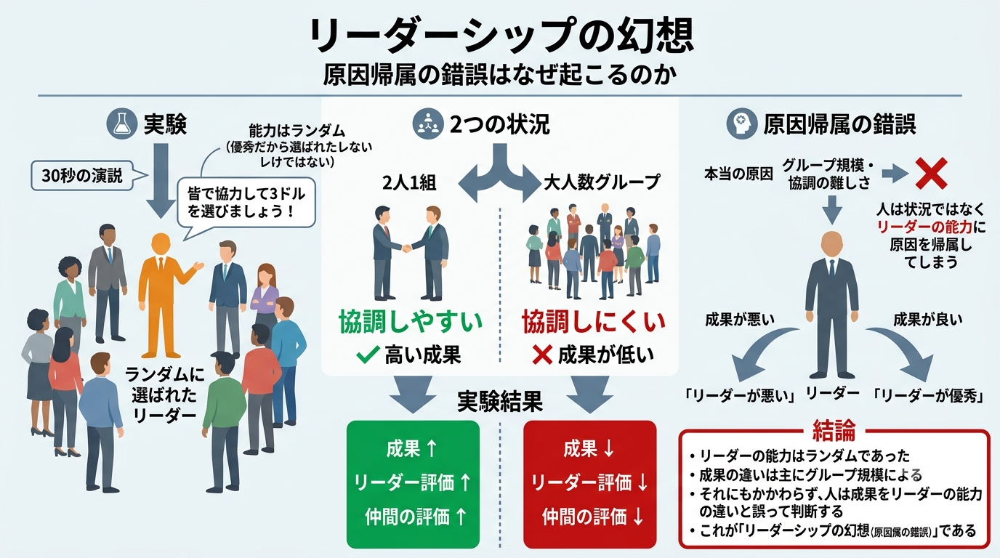

# A-15章 リーダーシップの幻想〜実験経済学による実証〜

## 【実験1】原因帰属の錯誤の仮説

- 前章で示したように、リーダーはチームの成果に対して重要な役割を負っており、組織のメンバーに特定の均衡を指し示すことによって**コーディネーション（複数の経済主体が互いの利益を最大化するために行動や選択を一致させるプロセス）** を改善することができる。これは現実の組織分析において重視する必要のある視点である。一方で別の考え方（**仮説**）として、<u>このリーダーシップの機能がメンバーからの過度な期待や責任、非難などを引き起こし、組織の成果や課題の原因を過度にリーダーの能力に帰属させてしまう可能性がある（**基礎的な原因帰属の錯誤**）</u>。例えば、以下のような議論の例が挙げられる。
  - 【**例1**】自分たちの仕事の成果が悪いのは部長の出来が悪いからだ
  - 【**例2**】総理大臣にリーダーシップが欠如しているから日本の景気が悪い
- 組織の経済学が現実の組織にアプローチしようとする以上、上記のようなリーダーシップは効果において限界がありその限界はリーダーの能力についてのメンバーの認識を誤らせる可能性があることを考える必要がある。$\text{Weber, Camerer, Rottenstreich and Knez}$（2001）はウィークリンクコーディネーションゲーム（$\text{Weak-link Coordination Game}$）と呼ばれるゲームにおいて、リーダーシップの大小をコーディネートする能力を実験、そして、状況（$\text{situation}$）の困難度の差異による成否をメンバーがリーダーシップの能力の差異に誤って過度に帰しているかどうかを確認する興味深い実験を行った。
- ウィークリンクコーディネーションゲームを用いた先行研究は一貫して**グループの規模効果（$\text{group-size effect}$）** の存在を示している。「**グループの規模効果**」とは、小さなグループはコーディネートに成功しやすく、大きなグループは失敗しやすい効果のことである。これを踏まえ、**基礎的な原因帰属の錯誤（$\text{fundamental attribution error}$）** と呼ばれる仮説に基けば、実際には状況の際によって引き起こされた効果に対して被験者は誤ってリーダーたちの責任にして、これを非難する傾向があることが予測される。もし実験によってこの点が確認されるならば、人々はリーダーシップに幻想（$\text{illusion of leadership}$）を抱いていることになるが、果たしてどうであろうか。

#### 原因帰属の錯誤を確認する実験

- 合計79人の被験者が実験に参加した。被験者は10人でグループを組んで（1グループだけ9人となる）、ランダムに2つの状況のいずれかに割り当てる。
  - 【**状況1**】大人数のグループの方では各グループのすべての被験者はゲームを一緒にプレーした（$n=39$）
  - 【**状況2**】少人数のグループ、すなわち2人1組の方（$n=40$）では、被験者はグループの中の他の9人のうちの1人とランダムかつ匿名的にペアを組まされ、ペアを組んだ人とだけゲームをプレーした。
- 被験者はそれぞれ、自分の支払料金（$\text{personal fee}$）として$\text{\$0, \$1, \$2, \$3}$ のいずれかを選ぶように指図される。グループのメンバーの選んだ支払料金のの最小額がメンバーに支払われる報酬の額を決める。具体的な報酬額は下表のとおりであり、**実験は8期繰り返す**。

**支払料金と報酬額の関係**

- 【**補足**】参加者は$\$0$の支払料金を選択することで確実に$\$1$の儲けを得ることができる。自分で最小額を決定できるからである。一方で$\$3$の支払料金を選択した場合、他のメンバーもすべて$\$3$の支払料金を選択すれば$\$5$の報酬を得ることができ、$\$2$の儲けとなるが、1人でも$\$0$の支払料金を選択すれば$\$1$の報酬しか得られる$\$2$の損失となる。

| グループのメンバーが選んだ 支払料金の最小額 | メンバーに支払われる 報酬額 |
| ---------------------------------------------- | ------------------------------ |
| $\$0$                                          | $\$1$                          |
| $\$1$                                          | $\$2.5$                        |
| $\$2$                                          | $\$3.75$                       |
| $\$3$                                          | $\$5$                          |

**実験の具体的な流れ**

1. 第1期の前に次の方法で「リーダー」が選ばれる。$N$人の被験者が$N-1$個の白色のボールと1個のオレンジ色のボールが入った袋からボールをひき、オレンジ色のボールを引き当てた被験者が実験全体にわたっての「リーダー」に指名される。
2. リーダーは第2期の終了後に残ったゲーム期間中、プレイヤーたちに$\text{\color{red}"組織化し"、"覚悟をさせる"}$ために短く演説を行うよう指示される。そして次のような演説原稿（ハンドアウト）を渡される。
    > 【**演説原稿**】
    > 下記のメッセージを他の参加者に対して伝えてください。単に読み上げない方が説得力があると思われます。一語、一語、正確に引用する必要はありません。わかりやすく言い換えることはかまいません。
    > **リーダーからのメッセージ**：われわれは調和的に動かなければならない。明らかに皆が$\$3$の支払料金を選択すれば、われわれ皆が幸せになれる。それは$\$5$の報酬を作り出す。一回ごとにわれわれ1人1人が$\$2$の設けを得られる。愚かにならないようにしようではないか。
3. 被験者は第2期のプレーの終了後、リーダーの演説が行われる前に質問表に答える。その後、リーダーは演説を行う（30秒以内）。この時点で被験者は2回目の質問表に答える。その後、被験者は残りの6期のプレーを行い、さらにその後、被験者は最後の質問表に答える。
- <u>上記の流れにおいて注意するのは</u>、$\text{Weber, Camerer, Rottenstreich and Knez（2001）}$がリーダーシップと呼ぶものはランダムに選ばれたグループのメンバー1人による単純な演説であり、<u>通常、リーダーシップと関連づけられる多くの要素を含んでいないという点である</u>。$\text{Weber, Camerer, Rottenstreich and Knez（2001）}$は**基礎的な原因帰属の錯誤**がこのような単純な状況でさえ生じるか否かを特定しようとしている。

#### 実験結果〜確認されたリーダーシップへの幻想〜

- 実験結果は次のとおり。演説前後の支払料金の選択は表A15-1の通りである。表A15-2はプレイヤーが尋ねられた質問票に対する回答を示している。
- 表A15-1によれば、演説後の期を見ると2人1組でプレーしている被験者の場合、最も高い$\$3$を$83\%$が、そして最も低い$\$0$を$\$6$が選択した。これに対して大人数のグループの場合、最も高い$\$3$を$49\%$が、そして最も低い$\$0$を$\$47$が選択しており、2人1組のプレーの成果の方がかなり高い。すなわち表A15-1より、**グループの規模効果が認められた**。
- 表A15-2よりわかることは次のとおり。
  - 「**リーダーの演説直後**」の質問は大人数（9〜10人）のグループと2人1組のグループの両方で、リーダーはほぼ同様の評価がされている
  - 演説直後（1回目）と8期終了後（2回目）のリーダーの評価の変化を見ると、2人1組のグループのリーダーの評価は高くなった（$5.80\rightarrow 6.17$）が、大人数（9〜10人）のグループのリーダーの評価は低くなった（$5.88\rightarrow 4.53$）。
  - 演説直後と8期終了後で準備期間が十分にあったかどうかの評価の変化を見る。この質問の回答判断の要素は「**リーダーによるメッセージの読み上げ能力**」のみであり、総合的な能力の推定は何ら必要とされない。それを踏まえ、2人1組のグループは演説直後と8期終了後との間で大きな差はない（中央値$7.0\rightarrow 7.0$、平均値$6.83\rightarrow 6.74$）。一方で、大人数のグループは8期終了後で大きく下がっている（中央値$6.5\rightarrow 4.0$、平均値$6.62\rightarrow 4.68$）。
  - 被験者が他の参加者が優秀であったかい中の評価を見ると、2人1組の場合は評価が上がっている（中央値$5.0\rightarrow 7.0$、平均値$5.94\rightarrow 6.80$）。一方、大人数のグループの場合は評価の上昇があまりなく（中央値$4.5\rightarrow 4.0$、平均値$3.74\rightarrow 4.21$）、2人1組と大人数グループにおいて有意差があることが確認できる。つまり、リーダーだけでなく仲間の従業員についても原因帰属の錯誤が生じる傾向があることを示している。
- ところで、被験者は置かれた状況の相違について、リーダーシップの可能性に相違が生じることを<ruby>認識してはいた<rt>⚫⚫⚫⚫⚫⚫⚫</rt></ruby>点には注意が必要である。第8期のゲームのプレーの終了後の質問で参加者を組織化し、参加者に準備をさせるリーダーの仕事（task）の困難度（$1=$この上なく困難、$9=$この上なく簡単）について尋ねられた際、2人1組は平均値で$6.74$の困難度を与えたのに対し、大人数グループは平均値で$5.91$の困難度を与えており、大人数のグループの被験者は2人1組のグループの評価と比較して、リーダーの仕事は困難と認識していることがわかる。
- 以上の結果から、被験者は状況の差異によって引き起こされる成果の違いを認識してはいたが、それにもかかわらず、<u>リーダーやグループ内の従業員を評価する際に、その効果を十分に勘案して調整することに失敗していることを示している</u>。

**表A15-1：リーダーによる演説の前後の支払料金の選択の分布**

|                          |  グループ人数  |                                                  $\$0\qquad\$1\qquad\$2\qquad\$3$                                                   | 平均値    |
| ------------------------ | :------------: | :---------------------------------------------------------------------------------------------------------------------------------: | --------- |
| 1期及び 2期（演説前） | 9〜10人 2人 |                       $25\%\quad 24\%\quad 20\%\quad 32\%$ $\hspace{2mm}5\%\quad 24\%\quad 26\%\quad 45\%$                       | $\$1.579$ |
| 3期及び 8期（演説後） | 9〜10人 2人 | $47\%\quad \hspace{2mm}4\%\quad \hspace{2mm}0\%\quad 49\%$ $\hspace{2mm}6\%\quad \hspace{2mm}6\%\quad \hspace{2mm}6\%\quad 83\%$ | $\$2.105$ |

**表A15-2：質問と答**

<table>
	<tbody>
		<tr>
			<th>質問種別</th>
			<th>質問内容</th>
			<th>人の数</th>
			<th>中央値</th>
			<th>平均値</th>
		</tr>
		<tr style="border-bottom: 4px double #000000;">
			<td>第2期 終了後</td>
			<td>
                あなたの意見ではグループの今日の 他の参加者の評価はどうですか。 
                （$1=$非常に出来が悪い、$9=$優れている）
            </td>
			<td>9〜10 2</td>
			<td>4.5 5.0</td>
			<td>3.74 5.94</td>
		</tr>
		<tr>
			<td rowspan="2">リーダー 演説直後</td>
			<td>
                リーダーは続く6期間のために十分に参加者に 準備させたか
                （$1=$この上なくうまくない、 $9=$この上なく良くやった）
            </td>
			<td>9〜10 2</td>
			<td>6.5 7.0</td>
			<td>6.62 6.83</td>
		</tr>
		<tr style="border-bottom: 4px double #000000;">
			<td>
                リーダーの総合的なリーダーシップ能力を 評価してください（1回目）。 
                （1$=$この上なく出来が悪い、9$=$この上なく優秀）
            </td>
			<td>9〜10 2</td>
			<td>6.0 6.0</td>
			<td>5.88 5.80</td>
		</tr>
		<tr>
			<td rowspan="4">第8期 終了後</td>
			<td>
                回想すると、今回のグループの 他の参加者の評価はどうですか。 
                （$1=$非常に出来が悪い、$9=$優れている）
            </td>
			<td>9〜10 2</td>
			<td>4.0 7.0</td>
			<td>4.21 6.80</td>
		</tr>
		<tr>
			<td>
                回想すると、リーダーは直近6期間のために 十分に参加者に準備をさせていたか。 
                （1$=$この上なくうまくない、9$=$この上なく良くやった）
            </td>
			<td>9〜10 2</td>
			<td>4.0 7.0</td>
			<td>4.68 6.74</td>
		</tr>
		<tr>
			<td>
                リーダーの総合的なリーダーシップ能力を 評価してください（2回目） 
                （1$=$この上なく出来が悪い、9$=$この上なく優秀）
            </td>
			<td>9〜10 2</td>
			<td>4.0 7.0</td>
			<td>4.53 6.17</td>
		</tr>
		<tr>
			<td>
                参加者を組織化し参加者に準備させるリーダーの 仕事を考えてください。<b>それは困難ですか</b> 
                （$1=$この上なく困難、$9=$この上なく簡単）
            </td>
			<td>9〜10 2</td>
			<td>6.0 7.5</td>
			<td>5.91 6.74</td>
		</tr>
	</tbody>
</table>

## 【実験2】コストをかければリーダーを交代させることができる場合

#### 実験内容

- コストをかければリーダーを交代させられる場合でも、前節の実験1と同様に被験者は成功や失敗の原因をリーダーシップの差異に帰着させるかどうかを検証する。本節で紹介する実験は8期のプレーの終了後、追加的に4期のプレーを行う。この4期についてリーダーを変更して臨むか否かを決定する「**コストのかかる投票**（実験2）」を行う。実験2は2つのパートから構成される。
  - 【**第1のパート**】実験1と全く同じである。実験1を正確に複製するために被験者が第1のパートを行なっている間、実験に第2パートがあることを知らせない。合計81人の被験者が実験に参加し、大人数のグループが$n=41$人、2人1組のグループが$n=40$人とする。
  - 【**第2パート**】
    1. 第1パート終了後、被験者は同じグループで追加的に4期のゲームを行うことが告げられ、新しいリーダーを継続するかどうかを投票する機会が与えられる。現在のリーダーを除く全ての参加者は新しいリーダーを選ぶかどうかの**無記名投票**を行う。
    2. 「新しいリーダーを求める」数が過半数の場合、新しいリーダーを参加者からランダムに選ばれる。そしてリーダーを求めた参加者には25セントの支払い（コスト）が課される。賛否同数もしくは「リーダーを継続する」数が過半数の場合、リーダー交代はなく、参加者は誰も支払いを課されることはない。
    3. 投票結果は全被験者に告げられ、新しいリーダーが選ばれるか、現在のリーダーの継続が決まると、そのリーダーは第1のパートで行われたのと同様にグループに対して短い演説を行う。その後、被験者は追加的な4期のゲームのプレーを行う。
- 以上より、リーダーを交代させるには少額のコストがかかり、被験者はリーダーを交代させるか否かの投票を行う際に正しく答える金銭的動機（25セント）を持つことになる。**実験2のポイント**は被験者がリーダーの交代について投票を求められた場合でも実験1の結果が繰り返されるか否かをテストすることである。

#### 実験結果〜投票結果のロジット分析〜

- 結果として、2人1組の場合より大人数のグループの場合の方がリーダーを交代させる投票が多かった（2人1組$\rightarrow 16\%$、大人数グループ$\rightarrow 32\%$）
- 従属変数を被験者の投票（新しいリーダーを持つ［$0$］、リーダーを継続する［$1$］）とするロジスティック回帰分析（$\text{logit regression}$）を実施した。独立変数は次のとおり。
  - 【**独立変数1：実験群（$\text{treatment}$）**】2人1組の場合は$0$、大人数のグループの場合は$1$、
  - 【**独立変数2：最終期でグループのメンバーが選んだ支払料金の最小額**】$\$0〜\$3$
  - 【**独立変数3：第8期のプレーの終了後に尋ねられた質問のうち3問に対する被験者の回答**】
    1. 他の参加者に対する評価
    2. <u>リーダーの総合なリーダーシップ能力の評価</u>
    3. リーダーが参加者を組織化し参加者に準備をさせる仕事の困難度
-  上記を踏まえ、分析結果において有意な係数は唯一、<u>リーダーの総合なリーダーシップ能力の評価</u>であり、係数$=0.452$である。このことは**被験者がリーダーを交代させるか否かの有意な決定要因は「リーダーシップ能力の評価のみ」であること**を意味する。グループのゲームの成果（グループのメンバーが選んだ支払料金の最小額）は投票内容に直接的に影響していない。実験2の結果は被験者の投票にコストがかかる場合でも、実験1と同様に被験者は成功と失敗の原因を誤ってリーダーシップの際に帰着させることを示している。

## 【実験3】より現実的な仕事による実験

#### 実験内容

- 実験1と2は被験者の選択が単に支払料金の選択であり現実的な状況ではないという批判がありうるとして、$\text{Weber, Camerer, Rottenstreich and Knez（2001）}$はより現実的な仕事による実験（**実験3**）を試みている。実験3は「<b>被験者への指示がより現実的</b>」であり、実験1、実験2とこの点だけが異なる。実験3は2人1組が $n=16$、大人数のグループが $n=17$で行われた。
- 実験3で指示される内容は次のとおり。
	> 【**指示**】
	> 1. あなたは一連のレポート作成の責任がある$N$人のプロジェクトメンバーの1人である。
	> 2. 1つのレポートは$N$個の節からなり、各メンバーはそのうちの1つの節を書く責任がある。1つのレポートはチームの全メンバーが自分の節を書き終えて初めて完成する。あなたの属するチームは合計で8つのレポートを作成する責任がある。1つのレポートが完成するまでメンバーは次のレポートの自分の担当する節の作業に入ることができない。
	> 3. あなたは個々のレポートがいかに早く完成したかによってお金を稼ぐことができる。個々のレポートの締め切りは4週間であるがチームが4週間未満でレポートを完成することができれば、各メンバーはボーナスを受け取る。早期完成の可能性は1週間・2週間・3週間の3つがあるとする。このためチームメンバーとしては、第1週か第2週か第3週か第4週のどこで自分の担当する節を書くかを決定しなければならない。レポートの完成が早ければ早いほど、ボーナスの金額は大きくなる。
	> 4. 被験者には締め切りまでの4週間のそれぞれについてレポートを書く時期によるコストとレポートを完成する時期による報酬が与えられる。これらのコストと報酬は実験1と実験2におけるコストと報酬と全く同一である。
- 「**より早期のレポートの完成時期はより高い支払い料金に対応している**」ことに留意してほしい。実験3はその他の点では実験1と全く同様である。すべての被験者が締め切りより3週間早い第1週の執筆を選択するとき効率性が達成される。

#### 実験結果

- 【**1/2つ目のレポートの回答**】実験3の実験結果は実験1の結果と非常に類似していた。演説前の1つ目のレポート、2つ目のレポートでは、大人数のグループの場合でも2人1組の場合でも選択に有意差は見られなかった。つまり、2人1組でゲームをプレーしている被験者の場合、第1週での執筆を$53\%$が、第4週での執筆を$6\%$が選択した。これに対して大人数のグループの場合、第1週での執筆を$32\%$が、第4週での執筆を2人1組の場合と同じ$6\%$が選択した。
- 【**3〜8つ目のレポートの回答**】しかしながら、リーダーの演説後、2つのグループ（2人1組と大人数グループ）の間でかなり相違が見られた。3つ目のレポートから8つ目のレポートでは、2人1組でプレーしている被験者の場合、第1週での執筆を$90\%$が、第4週での執筆を$9\%$が選択して、効率的な均衡にコーディネートできていたのに対し、大人数のグループの場合、第1週での執筆が$25\%$が、第4週での執筆を$56\%$が選択し、コーディネートできなかった。
- 以上の結果を踏まえ、質問票に対する答えを確認すると、これも実験1の結果と非常に類似していた。総合的なリーダーシップ能力の評価は演説直後の質問に対する答えでは2人1組の場合$5.64$に対し、大人数のグループの場合$4.67$で若干2人1組の方が評価が高いが、その差は有意ではない。これに対し、最後の8つ目のレポートが完成した後の質問に対する答えでは2人1組の場合$6.57$に評価が上昇したのに対し、大人数のグループの場合$3.13$に下降し、その差は有意であった。
- 現実的な仕事を想定しても、課題の原因をリーダーシップ能力の差異に誤って帰着させるという現象を弱めはしないことが示された。被験者がリーダーシップに幻想（$\text{illusion of leadership}$）を抱いていることがかなり一般的に確認されたと言える。

**レポート**

| 項目                                            | 2人1組グループ                | 大人数グループ                 | 結果・考察                                                                                  |
| :---------------------------------------------- | :---------------------------- | :----------------------------- | :------------------------------------------------------------------------------------------ |
| **演説前 （第1・2レポート）**                | 第1週：$53\%$ 第4週：$6\%$ | 第1週：$32\%$ 第4週：$6\%$  | 両グループ間に**有意差なし**。演説前はグループ規模による 違いは見られなかった。          |
| **演説後 （第3〜8レポート）**                | 第1週：$90\%$ 第4週：$9\%$ | 第1週：$25\%$ 第4週：$56\%$ | 2人1組は効率的均衡（第1週執筆）へコーディネートできたが、 大人数グループはできなかった。 |
| **リーダーシップ評価 （演説直後）**          | 5.64                          | 4.67                           | 2人1組の方がやや高評価だが **有意差なし**。                                              |
| **リーダーシップ評価 （第8レポート終了後）** | 6.57                          | 3.13                           | 2人1組では評価が上昇し、 大人数グループでは低下。 **両者の差は有意**であった。        |
