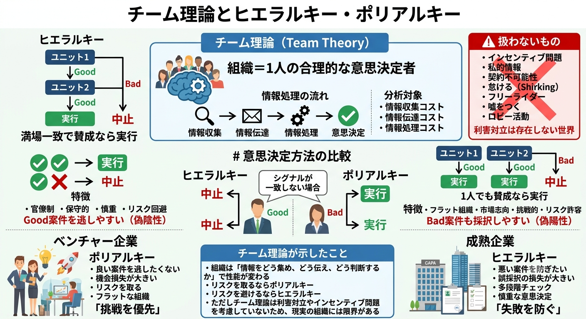
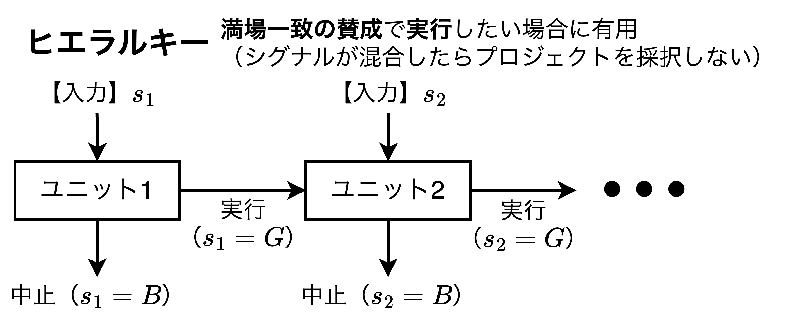
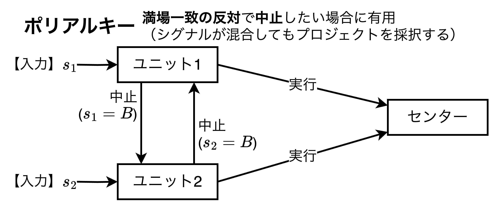

# A-16章 組織における意思決定

## チーム理論の登場

経済学の歴史においては$\text{Marschak and Radner（1972）}$のチーム理論（$\text{Team Theory}$）が内部組織についての初めての経済理論と言って良い。チーム理論は情報の「収集→伝達→処理」の流れでそれぞれのコストを分析する。チーム理論は組織をクリーンな機械のようにモデル化することから限界もある。チーム理論はインセンティブ問題を扱わず、私的な情報（$\text{private information}$）の問題も存在しない、そして、契約不可能性（$\text{non-contractibility}$）の問題も存在しない。
　具体的にはチーム理論においては全ての人間は同じペイオフ（同じ選好）を有しており、その結果、組織をあたかも一人の合理的な個人（$\text{individual}$）として扱う。このため全てのチーム理論のモデルでは、チームの個々のメンバーの間の利害衝突は無視され、チーム理論には、<b>怠ける（$\text{shirking}$）、ただ乗りする（フリーライダー問題）、嘘をつく、ロビー活動（超過利潤を得ようとする行動）</b>、と言った現象は生じない。それはあくまで、利害関係の視点で見て一人の人間のように扱うという意味である。例えば、組織内の1というユニット（部署）と2というユニット（部署）が異なる情報を有しており、**両者が意思決定を行うセンターに話をすると言ったコミュニケーションの問題を扱うことはチーム理論によって可能**となった。

## ヒエラルキーとポリアルキー

- それでは$\text{Sah and Stiglitz（1986）}$のチーム理論の分野の研究成果、具体的にはヒエラルキー（$\text{Hierarchies}$）とポリアルキー（$\text{Polyarchies}$）の2つの対比研究を解説する。先に対比表を下表に示す。上記2つの構造を読んだ後、振り返りで見てもらうと理解が進むであろう。

|                        | ヒエラルキー                                           | ポリアルキー                                                   |
| ---------------------- | ------------------------------------------------------ | -------------------------------------------------------------- |
| 組織構造               | 成熟企業に多い保守的な構造 （是認による損害に敏感） | リスクに寛容なフラットな構造 （拒絶による機会損失をに敏感） |
| 形態                   | 【**官僚制志向型**】 満場一致で賛成、それ以外は反対 | 【**市場志向型**】 満場一致で反対、それ以外は賛成           |
| 間違いの 生じやすさ | **第一種の過誤（偽陽性）** が生じやすい                | **第二種の過誤（偽陰性）** が生じやすい                        |

### ヒエラルキーとポリアルキーのモデル

#### プロジェクトの実行適否を判断するモデルの定式化

$$
\begin{align*}
    【プロジェクトの価値】&y\in\{0\text{（Bad）},\;1\text{（Good）}\}\\
    【ユニット】&i\in\{1,2\}\\
    【シグナル】&s_i\in\{G\text{（Good）},\;B\text{（Bad）}\}
\end{align*}
$$

- 上式のようなモデルを考える。プロジェクトは $\text{Good}$（$y=1$）か $\text{Bad}$（$y=0$）のいずれかである。$s_i$は潜在可能性を伝えるものであり、条件付き独立（$\text{conditionally independent}$）である。$i$が得るシグナル$s_i$は$"\text{真の値}"+"\text{ノイズ}"$からなり、ノイズは独立である。
- センターのユニットは意思決定を行おうとするが、プロジェクトの実行適否が問題である。ユニット$i(=1,2)$の仕事はプロジェクトを評価することであるが、**唯一の実行可能なコミュニケーションは評価者の判断としてプロジェクトが$\text{Good}$（実行されるべき）か$\text{Bad}$（中止されるべき）かを伝えること**である。次に問題になるのはプロジェクトの実行適否を判断する方法である。プロジェクトが「$\text{Good}$である」という（ある程度の）確信があれば実行すべき、「$\text{Bad}$である」という（ある程度の）確信があれば実行すべきでない、ということになる。
- ではプロジェクトの実行適否の判断方法を考える。プロジェクトの実行コストを$c（0\leqq c\leqq 1）$とすると、次の「プロジェクトの確信度$Prob$」と「コスト$c$」の不等式が表現できる。$$Prob(y=1\;|\;B,B)<c<Prob(y=1\;|\;G,G)$$
  - 【**$c<Prob(y=1\;|\;G,G)$ について**】ユニット$1,2$ともに、$G$のシグナルを得たことが判明したのであればプロジェクトが$\text{Good}（y=1）$である（事後的な）確率は$c$より大きい。このため、<u>プロジェクトを実行すべきことになる</u>。
  - 【**$Prob(y=1\;|\;B,B)<c$ について**】ユニット$1,2$ともに、$B$のシグナルを得たことが判明したのであればプロジェクトが$\text{Good}（y=1）$である（事後的な）確率は$c$より小さい。このため、<u>プロジェクトを中止すべきことになる</u>。
- 上式の唯一の問題は、ユニット間でシグナルが異なる場合、つまり、$(s_1,\;s_2)=(G,\;B)$または$(s_1,\;s_2)=(B,\;G)$の場合、どうすべきかである。これをヒエラルキーとポリアルキーでそれぞれ考える。

#### 意思決定過程を組織する〜ヒエラルキーとポリアルキー〜

- 意思決定過程を組織するのに2つの方法がある。
  - 【**意思決定の組織方法1**】シグナルが混合している場合（ユニット$1,2$のシグナルが異なる場合）にプロジェクトを中止したい場合に優れた組織。$\implies$【**ヒエラルキー**】が有用
  - 【**意思決定の組織方法2**】シグナルが混合している場合（ユニット$1,2$のシグナルが異なる場合）でも、プロジェクトを実行したい場合に優れた組織。$\implies$【**ポリアルキー**】が有用

【**ヒエラルキー**】

- 意思決定プロセスを組織する一つの方法にヒエラルキーがある。すべてのプロジェクトは最初に低い方のユニット（上図のユニット1）によって評価され、$s_1=G$のとき、高い方のユニット（上図のユニット2）に送られる。同様に$s_2=G$のとき、次のユニットに送られる。ここで任意のユニット$i$が$s_i=B$のシグナルを受け取った場合はプロジェクトを中止にする。
- 以上のことから、ヒエラルキーの場合にプロジェクトを「実行」するには「満場一致の賛成」が必要であり、シグナルが混合している場合にプロジェクトを実行したくないとき、ヒエラルキーは適切な組織形態である。つまり$Prob(y=1\;|\;G,B)<c$である。

【**ポリラルキー**】

- $c<Prob(y=1\;|\;G,B)$の場合、2つ目のポリアルキーが適切である。2つのユニットはお互い独立にプロジェクトを選別する。少なくとも1つ以上の$s_i=G$があれば、プロジェクトが実行され、すべてが$s_i=B$であればプロジェクトが中止になる。
- 以上のことから、ポリアルキーの場合にプロジェクトを「中止」するには「満場一致の反対」が必要であり、シグナルが混合している場合にプロジェクトを実行したいとき、ポリアルキーは適切な組織形態である。つまり$c<Prob(y=1\;|\;G,B)$である。

### ベンチャー企業のポリアルキーと成熟産業のヒエラルキー

- あるユニットがプロジェクトが$\text{Good}$であると判定する確率を$p（0\leqq p\leqq 1）$とすると、ポリアルキーにおいてプロジェクトが是認される確率は$1-(1-p)^2=2p-p^2$になる。一方、ヒエラルキーにおいてプロジェクトが是認される確率は$p^2$になる。ここで、$(2p-p^2)-p^2=2p(1-p)\geqq 0$より、**ポリアルキーはヒエラルキーよりプロジェクトが$\text{Bad}$であるのに是認することが確率的に多くなる**。逆にプロジェクトを拒絶する確率を比較すると$(1-p^2)-(1-p)^2=2p\geqq 0$より、**ヒエラルキーはポリアルキーよりプロジェクトが$\text{Good}$であるのに拒絶することが確率的に多くなる**。
- ここから、なぜ成長産業分野におけるベンチャー企業の組織形態がフラットで意思決定者であるCEOにダイレクトに情報が集中する形態（ポリアルキーに近い組織形態）を採用し、成熟産業になるにつれてヒエラルキーを形成するようになるのか、その合理性を説明する。
- 【**ベンチャー企業がポリアルキーに近い組織形態を採用する合理性**】ベンチャー企業にとって良いプロジェクトを拒絶してしまうことから生じる機会損失が大きいため（**リスクに寛容**）、リスクに環境な組織形態であるポリアルキーを採用する合理性がある。
- 【**成熟企業がヒエラルキーに近い組織形態を採用する合理性**】企業が大きくなると悪いプロジェクトを誤って採択してしまうことから生じる損害が大きいため（**リスクに敏感**）、ヒエラルキーが重層的なチェックをかける合理性がある。

## 組織は1人の合理的な個人ではない

- 前節までの内容がヒエラルキーとポリアルキーの説明になるが、一方で実際の組織を観察すると、他にも考慮を要する多くの要素があることが確認できる。チーム理論は組織をクリーンな機械のようにモデル化しているという意味で限界が存在するが、この点について本節で述べる。
- $\text{Feldman and March（1981）}$は通常の意思決定理論（$\text{decision theory}$）は意思決定プロセスが次の通りに進むと予測していると述べている。「意思決定に先駆けて関連した情報は集められ、分析されるであろう。意思決定において利用するために集められた情報は、その意思決定を行うにあたって（確かに）利用されるであろう。さらに多くの情報が要求され、集められる前に今の段階で利用可能な情報が精査されるであろう。情報を要求する前に情報が必要か確かめられるであろう。そして、意思決定に関連のない情報は集められないであろう。」と。
- 上記の記述は至極当たり前で疑いないように聞こえる。しかし、いずれの記述も実際の組織から程遠いと$\text{Feldman and March（1981）}$は主張する。
  - 集められ、伝達された情報の多くはほとんどが意思決定と関連がない。
  - 意思決定を正当化するために用いられる情報の多くは意思決定が行われた後にあるいは、実質的に行われた後になって初めて集められ、解釈される。
  - 最初に意思決定が考慮された時に利用可能な情報があったにもかかわらず、さらなる情報が求められる。
  - 現時点で利用可能な情報が無視されているにもかかわらず、組織が意思決定を行うのに十分な情報を持っていないとの不満が生じる。
- これらは何らかの組織で働いた経験のある読者ならば、いずれは思い当たる節があるのではないだろうか。なぜこのような現象が発生するのだろうか。それは個々人の選好は独自の順序を持っているからであり、組織単位で集計しようとすると問題がぶつかる。もちろん、全ての人が同じ選好を持っていれば問題は生じないが、それは想定しにくい。組織内の参加者たちの異なる選好順位（すなわち個々人の目標）の決着がついていないのに、組織を1人の合理的な個人として見るのは潜在的に矛盾を持つ。
- 次章ではなぜ成長産業分野におけるベンチャー企業の組織形態がフラットで、成熟企業・成熟産業になるにつれて、ヒエラルキーを形成するようになるのかを$\text{Rajan and Zingales（2001）}$を用いて説明する。
