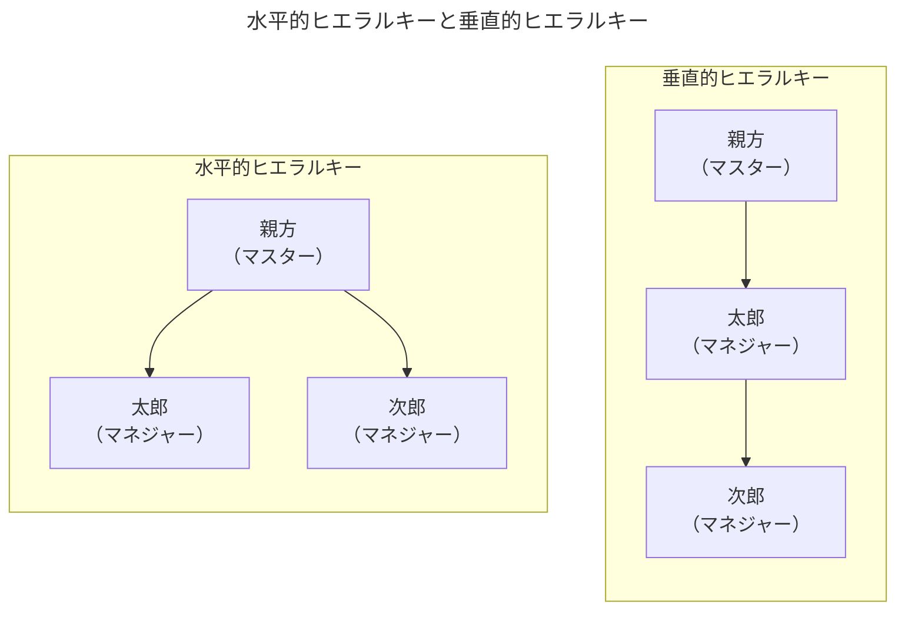

# A-17章 ヒエラルキーとパワー

| 水平的ヒエラルキー                                             | 垂直的ヒエラルキー                                               |
| -------------------------------------------------------------- | ---------------------------------------------------------------- |
| 接触は親方のみ （**所有権から生じるパワーを得るチャンス**） | 太郎が中間管理職 （**地位から発生するパワー**）               |
| 全員が技術を盗める                                             | 技術を盗めるのは太郎だけ                                         |
| 特化を選ぶインセンティブがある （安定した報酬がある）       | 競争（独立）のインセンティブがある （部下を連れて独立できる） |
| 組織は安定的                                                   | 組織は不安定的                                                   |

$\text{Rajan and Zingales（2001）}$に従って、ヒエラルキーを「**アクセスと地位から発生するパワー**」と呼ばれる視点から考える。結論を先に述べる。
- 【**結論1**】急勾配のヒエラルキーは物理的な資本集約型の（$\text{physical-capital-intensive}$）産業で優位となり、年功序列の昇進方法（$\text{seniority-based promotion policies}$）が採用される。
- 【**結論2**】フラットなヒエラルキーは人的資本集約型の（$\text{human-capital-intensive}$）産業で優位となり、昇進か解雇の昇進方法（$\text{up-or-out promotion systems}$）が採用される。

## 水平的ヒエラルキーと垂直的ヒエラルキー

- 起業家はアイデア、良好な顧客との関係、優秀な経営技術、といったユニークでクリティカルな資源を有している。起業家にとっての基本的な問題は生産に必要な多数のエージェント（従業員など）の協力を会社が生み出す余剰のうち過度に多くを彼らに譲り渡すことなく、いかに取り付けるかである。従業員に「着服されるリスク」は生産には常につきものである。
- 特に起業家は従業員（ここでは［マネジャー］と呼ぶ）に効率的に生産することを学ばせるために「$"\text{アクセス}"$（クリティカルな資源に近づくこと）」を認める。これを通じてマネジャーはアイデアを理解し、重要な顧客やサプライヤーに接触し、さらには起業家のユニークな経営技術さえも学習するかもしれない。"アクセス"はマネジャーにクリティカルな資源を自分のものにし、起業家と競争する機会をも与えてしまう。マネジャーはアイデアを盗み顧客を連れて出ていき、あるいは起業家のマネジメントスタイルを真似、ライバル会社を立ち上げるかもしれない。
- ここからは以下の2つの仮定のもと議論を進める。
  - 【**仮定1**】マネジャーが"アクセス"し、競争する可能性があることをマスターは知っている。
  - 【**仮定2**】市場規模が小さく、1つのチームしか仕事をする余地がない

#### 水平的／垂直的ヒエラルキーとそれぞれのインセンティブ

- 今、親方（マスター）がある製造技術を保有している。彼はできるだけ多くの従業員（マネジャー）と生産したい。今、太郎と次郎という2人の従業員候補がいる。このとき、自分と保有技術への$"\text{アクセス}"$を認める方法は2つある。
  - 【**方法1：水平的ヒエラルキー（$\text{horizontal hierarchy}$）**】太郎、次郎ともに親方とのみ接触させる方法。親方が全ての取引を仲介する。
  - 【**方法2：垂直的ヒエラルキー（$\text{vertical hierarchy}$）**】親方は太郎とのみ接触し、次郎は親方ではなく太郎にレポートする。
- 一旦雇われると、従業員（マネジャー）は「**①技術を盗んで親方と競争（$\text{compete}$）する**」、または「**②直属の上司の仕事を遂行するため学習し、特化（$\text{specialize}$）する**」のいずれかを選択する。上司は自分のスキルを補完する仕事を部下に割り当てるため、従業員（マネジャー）は一旦特化すると上司なしでは役立たなくなる。親方と直接接すると技術を完全ではないが観察できる。例えば、親方は各従業員から限界生産性$1.0$を引き出せる一方、独立した従業員は盗んだ技術でも$0.75$しか生産できない。また、親方に直接接しなければ着服はできない。生産物はバーゲニング（交渉、取引）で分配され、各従業員は自分の成果の半分と、部下が上げた成果の半分を獲得する。
- 続いて**従業員（マネジャー）のインセンティブ**を考える。水平的ヒエラルキーでは、各マネジャーは「特化」により$1.0$を生産し、その半分の$0.5$を得る。一方、「競争」を選んでも親方以外との接触がないため単独で$0.75$を生産するしかない。しかし親方は$1.0$を生産できるため、独立しても利益は得られない。したがって、<u>水平的ヒエラルキーにおいて、マネジャーは「競争」ではなく「特化」を選択する</u>。
- 水平的ヒエラルキーは全ての接触を親方経由にすることで技術の着服を防ぎやすくする。一方、垂直的ヒエラルキーでは、次郎は親方と直接接しないため技術を着服できず、特化を選ぶ。一方、太郎は自分の成果$1.0$の半分（$0.5$）と、次郎の成果$0.5$の半分（$0.25$）を加えた$0.75$を得る。これは$\text{Rajan and Zingales（2001）}$のいう「**地位から発生するパワー（$\text{positional power}$）**」であり、親方にとって次郎は太郎がいる場合にのみ生産的たり得ることを求められる。このため太郎はバーゲニングパワー（どちらがより有利な条件を引き出せるかを示す交渉力）を持つ。しかし太郎が退社すると次郎も従うため、2人で独立すれば$0.75\times2=1.5$を生産でき、親方の$1.0$を上回る。さらに太郎は次郎へ$0.375$を支払えばよく、最終的に$1.125$を獲得する。

#### まとめ

- 以上の議論から、従業員が親元から独立して「競争」する誘因は垂直的ヒエラルキーの方が大きい。しかし技術の着服可能性（略奪可能性）が$50\%$未満であれば、太郎は「特化」する戦略を選択する。
- たとえ、従業員にとっての「特化」のコストが高くとも「特化する」インセンティブ、具体的には重要な資源（$\text{critical resource}$）の所有権（$\text{ownership}$）を持つことから生まれるレント（超過利潤）を獲得する潜在的な可能性を約束することである。
- 親方が従業員に適切なレントを保障する方法はアクセスできる人数を制限し、所有権を「競る」ことができる人数を制限することによってである。水平的ヒエラルキーにおいて起業家（親方）がアクセスを制限するのは単に従業員の現在のパワーを制限するためだけではなく、従業員に対して「特化」するならば組織を所有する可能性を持つ選ばれ市少数の人間の一人となることを信用させるためである。

### 資源へのアクセスへのヒエラルキーのモデル

**【表】$\text{Rajan and Zingales（2001）}$のゲームのタイミング設定**

| No. | 内容                                       |
| --- | ------------------------------------------ |
| 1   | 起業家がアクセスを認める                   |
| 2   | マネジャーは特化するか競争するかを選択する |
| 3   | チーム間の競争が生じる                     |
| 4   | 生き残れ得るチームは分け前を交渉する       |
| 5   | 生産が行われ、分け前が支払われる           |

- 

### 垂直的ヒエラルキーの分析

- 

### 水平的ヒエラルキーの分析

- 

## 「地位から発生するパワー」vs「所有権から生じるパワーを得るチャンス」

- 
