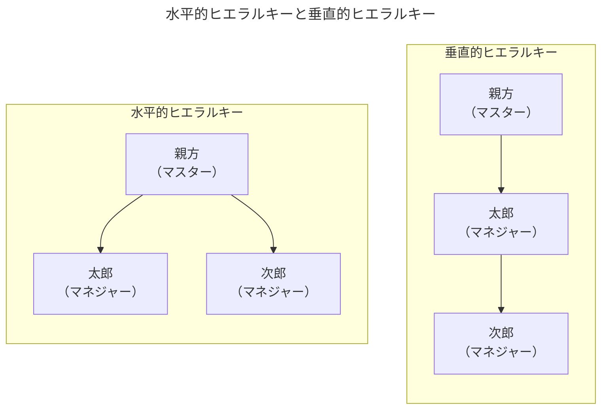

# A-17章 ヒエラルキーとパワー

$\text{Rajan and Zingales（2001）}$に従って、ヒエラルキーを「**アクセスと地位から発生するパワー**」と呼ばれる視点から考える。結論を先に述べる。
- 【**結論1**】大きな急勾配のヒエラルキーは物理的な資本集約型の（$\text{physical-capital-intensive}$）産業で優位となり、そこでは年功序列の昇進方法（$\text{seniority-based promotion policies}$）が採用される。
- 【**結論2**】フラットなヒエラルキーは人的資本集約型の（$\text{human-capital-intensive}$）産業で優位となり、そこでは昇進か解雇の昇進方法（$\text{up-or-out promotion systems}$）が採用されることがわかるはずである。

## 水平的ヒエラルキーと垂直的ヒエラルキー

#### 背景

- 経済的余剰を生み出す起業家はユニークでクリティカルな資源を有している。例えば、アイデア、良好な顧客との関係、優秀な経営技術、といったものである。起業家にとっての基本的な問題は生産に必要な多数のエージェント（従業員など）の協力を会社が生み出す余剰のうち角に多くを彼らに譲り渡すことなく、いかに取り付けるかである。従業員に「着服されるリスク」は生産には常につきものである。
- 特に起業家は従業員（ここではヒエラルキーを考察しているので［マネジャー］と呼ぶ）に効率的に生産することを学ばせるために「$"\text{アクセス}"$（クリティカルな資源に近づくこと）」を認めなければならない。これを通じて例えば、マネジャーはアイデアを理解し、重要な顧客安プライヤーに接触し、さらには起業家のユニークな経営技術さえも学習するかもしれない。"アクセス"はマネジャーにクリティカルな資源を自分のものにし、起業家本人と競争する機会をも与えてしまう。マネジャーはアイデアを盗み顧客を連れて出ていき、あるいは起業家本人のマネジメントスタイルを真似、ライバル会社を立ち上げるかもしれない。
- $\text{Rajan and Zingales（2001）}$はトレードオフ関係を示唆している。ここからは以下の2つの仮定のもと議論を進める。
  - 【**仮定1**】マネジャーがマスターの資源に着服し、競争する機会を与える可能性があることをマスターは知っている。
  - 【**仮定2**】市場規模が小さく、1つのチームしか仕事をする余地がない

#### 水平的／垂直的ヒエラルキーとそれぞれのインセンティブ

- 今、親方（マスター）がある製造の生産的な技術を持っている。彼は可能な限り多くの従業員（マネジャー）と生産した。今、太郎と次郎という2人の従業員候補（マネジャー候補）がいる。この時、自分とその保有する技術に"アクセス"を認めるために2つの方法がある。
  - 【**方法1：水平的ヒエラルキー（$\text{horizontal hierarchy}$）**】太郎、次郎ともに自分とだけ接触させる方法。親方は全ての取引を仲介することになる。
  - 【**方法2：垂直的ヒエラルキー（$\text{vertical hierarchy}$）**】親方は太郎とのみ接触し、次郎には自分ではなく太郎にレポートさせる方法。
- 以上を踏まえ、一旦雇われると従業員（マネジャー）は、「**①技術を盗んで親方と競争（$\text{compete}$）することを選択する**」、または「**②自分の直属の上司が自分に割り当てた仕事を遂行するため学習をする（＝特化する［$\text{specialize}$］）**」。上司は自分のスキルを補完する仕事を部下に割り当てるので、一旦特化すると上司なしでは役立たずになってしまう。従業員は親方と直接に接すると親方の技術を完全ではないが観察できる。例えば、親方は自分のチームの各従業員から限界生産性$1.0$を引き出せるが、盗んだ技術で独立した従業員は$0.75$しか生産できない。また、親方に直接に接しないと着服はできない。チームのメンバーへの生産物の分配はバーゲニング（交渉、取引）を通じて行われる。すなわち、それぞれの従業員は自分が生産した成果の半分を獲得し、さらに自分の部下たちがヒエラルキーの下から上げてきたものの半分を獲得する。
- ここで**従業員（マネジャー）に対するインセンティブ**を考える。水平的ヒエラルキーにおける各マネジャーは「特化」の後、$1.0$の生産を行い、その内$0.5$を獲得する。代わりにマネジャーは「競争」を試みることはできるが、親方以外との接触がないことから誰かと一緒に外に出てチームになって生産することはできない。従って「競争」を決意するマネジャーは盗んだ技術を使って、自分一人で生産するしかない（$0.75$の生産）。しかし、親方は$1.0$の生産ができることから、マネジャーは独立しても何も得られないことを予想する。そのため、<u>水平的ヒエラルキーにおけるマネジャーは「競争」せずに「特化」する方を選択する</u>。
- 水平的ヒエラルキーは全ての接触を親方経由に強いることで、彼らが技術を着服しようとする試みの阻止を容易にする。これに対し、垂直的ヒエラルキーの場合は事情が異なる。上図のように、親方と次郎の間に太郎がいるため次郎はそもそも親方の技術の着服ができない。次郎は特化するコストが比較的小さいのであれば太郎に特化するであろう。一方、太郎は非常に異なった地位にいる。太郎は自分が生産した成果$1.0$の半分（$0.5$）と、さらに次郎が下から上げてきた$0.5$の半分（$0.25$）を加えた$0.75$を得る。これは、$\text{Rajan and Zingales（2001）}$の言葉を借りて、太郎は「**地位から発生するパワー（$\text{positional power}$）**」と呼ぶ力を得ている。その源泉は親方から見ると太郎が加わった場合に限り、次郎は生産的たり得る。このことが太郎にある種のバーゲニングパワー（どちらがより有利な条件を引き出せるかを示す交渉力）を与える。しかし、太郎は社内でそのパワーを有するにも関わらず、独立して親方と「競争」する。なぜなら太郎が退社すると次郎も太郎に付いて退社するからである（次郎は太郎なしではチームに残っても役立たずになってしまう）。太郎は退社して親方と「競争」した場合、次郎とともに退社するので、$0.75\times 2=1.5$の生産をすることができる。この値は親方は自分だけで生産することができる$1.0$よりも大きいので独立した太郎のチームは親方に勝つことができる。さらに太郎は次郎に対しては次郎が生産した$0.75$の半分（$0.375$）を報酬として与えれば良いので、最終的に太郎は$0.75+0.375=1.125$を自分の手元に残すことになる。

#### まとめ

| 水平的ヒエラルキー                                       | 垂直的ヒエラルキー                                               |
| -------------------------------------------------------- | ---------------------------------------------------------------- |
| 接触は親方のみ                                           | 太郎が中間管理職（**地位から発生するパワー**）                   |
| 全員が技術を盗める                                       | 技術を盗めるのは太郎だけ                                         |
| 特化を選ぶインセンティブがある （安定した報酬がある） | 競争（独立）のインセンティブがある （部下を連れて独立できる） |
| 組織は安定的                                             | 組織は不安定的                                                   |

- 以上の議論から、従業員が親元から独立して「競争」する誘因は垂直的ヒエラルキーの方が大きい。しかし技術の着服可能性（略奪可能性）が$50\%$未満であれば、太郎は「特化」する戦略を選択する。
- たとえ、従業員にとっての「特化」のコストが高くとも「特化する」インセンティブ、具体的には重要な資源（$\text{critical resource}$）の所有権（$\text{ownership}$）を持つことから生まれるレント（超過利潤）を獲得する潜在的な可能性を約束することである。
- 親方が従業員に適切なレントを保障する方法はアクセスできる人数を制限し、所有権を「競る」ことができる人数を制限することによってである。水平的ヒエラルキーにおいて起業家（親方）がアクセスを制限するのは単に従業員の現在のパワーを制限するためだけではなく、従業員に対して「特化」するならば組織を所有する可能性を持つ選ばれ市少数の人間の一人となることを信用させるためである。

## 資源へのアクセスへのヒエラルキーのモデル

- 

### 垂直的ヒエラルキーの分析

- 

### 水平的ヒエラルキーの分析

- 

## 「地位から発生するパワー」vs「所有権から生じるパワーを得るチャンス」

- 
