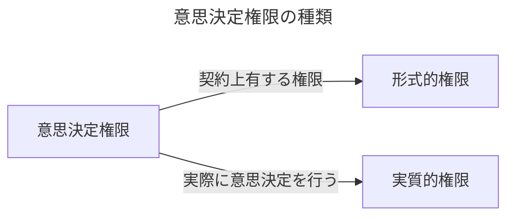

# A-18章 意思決定権限〜組織内の形式的権限と実質的権限〜</h1>

## 形式的権限を有する者は必ずしも実質的権限を有しない

- まず、組織内部の意思決定権限について考察する。これまで議論してきたように意思決定権限を有することは、それが所有権理論（$\text{Property Rights Theory}$）における物的資産の所有権によって与えられようが、コントロール権の契約（$\text{Contracting for Control}$）の理論における契約によって与えられようが、いずれにせよ、通常は当然ながら意思決定権限を実際に有することを意味するはずである。
- しかし実際の組織では、契約上意思決定権限を有する$"\text{形式的権限}"\text{(Formal Authority)}$と実際に意思決定を行う$"\text{実質的権限}"\text{(Real Authority)}$は異なることが往々にしてある。例えば、株主は$"\text{形式的権限}"$を有するが、実際は取締役会に対するコントロールは限定的であるし、その取締役会自体もCEOに対するコントロールは限定的であり、さらには、そのCEOも各事業部長に対するコントロールが限定的であることが実際には観察される。
- この形式的権限と実質的権限の乖離の問題は実際の組織を設計（デザイン）する場合、常に念頭におくべき重要な問題である。その乖離が生じる原因は何であろうか、また、その理由は存在するのだろうか。上司はしばしば部下の提案をチェックもせずにハンコを押す。たとえ、上司が権限を有していても決定は下でなされるのである。この時上司は形式的権限を有しているが、部下が実質的権限を有していることになる。$\text{Aghion and Tirole（1997）}$はこの点を包括的に考えたパイオニア的研究である。

## 形式的権限と実質的権限のモデル

- 

### $P$が形式的権限を有する場合

- 

### $A$が形式的権限を有する場合

- 

## モデルの解

- 

### 形式的権限が$P$を有する場合

- 

### 形式的権限が$A$を有する場合

- 

### 両者の比較

- 

## 権限移譲のベネフィットとコスト

- 

## 形式的権限を維持したまま部下の自発性・独創性を助長する方法

- 

### 上司の業務範囲に「過重負荷」をかける

- 

### 上司を複数にし、数を多くする

- 

## 組織内で権限の所在を分散させる効果

- 

### 権限分割のモデル

- 

## 部下に「貸す」ことができるのみ

- 

### 権限移譲にコミットできなかった会社

- 

### オーティコン社のスパゲッティ組織の変容

- 

### コントロール権はトップにある

- 
