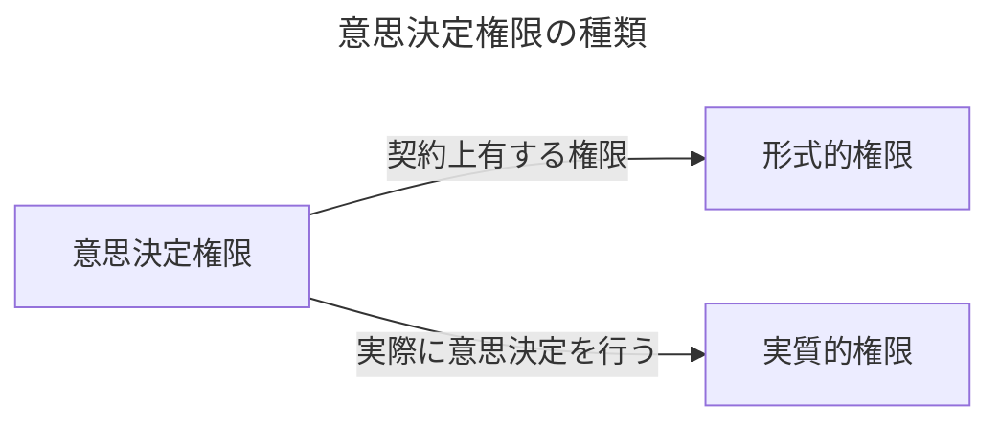

# A-18章 意思決定権限<span style="font-size: 24px;">〜組織内の形式的権限と実質的権限〜</span></h1>

## 形式的権限を有する者は必ずしも実質的権限を有しない


```mermaid
---
title: 意思決定権限の種類
---

graph LR
    A["意思決定権限"]
    B["形式的権限"]
    C["実質的権限"]

    A -- 契約上有する権限 --> B
    A -- 実際に意思決定を行う --> C
```

- まず、組織内部の意思決定権限について考察する。これまで議論してきたように意思決定権限を有することは、それが所有権理論（$\text{Property Rights Theory}$）における物的資産の所有権によって与えられようが、コントロール権の契約（$\text{Contracting for Control}$）の理論における契約によって与えられようが、いずれにせよ、通常は当然ながら意思決定権限を実際に有することを意味するはずである。
- しかし実際の組織では、契約上意思決定権限を有する<font color=red>$"\text{形式的権限}"\text{(Formal Authority)}$</font>と実際に意思決定を行う<font color=red>$"\text{実質的権限}"\text{(Real Authority)}$</font>は異なることが往々にしてある。例えば、株主は$"\text{形式的権限}"$を有するが、実際は取締役会に対するコントロールは限定的であるし、その取締役会自体もCEOに対するコントロールは限定的であり、さらには、そのCEOも各事業部長に対するコントロールが限定的であることが実際には観察される。
- この形式的権限と実質的権限の乖離の問題は実際の組織を設計（デザイン）する場合、常に念頭におくべき重要な問題である。その乖離が生じる原因は何であろうか、また、その理由は存在するのだろうか。上司はしばしば部下の提案をチェックもせずにハンコを押す。たとえ、上司が権限を有していても決定は下でなされるのである。この時上司は形式的権限を有しているが、部下が実質的権限を有していることになる。$\text{Aghion and Tirole（1997）}$はこの点を包括的に考えたパイオニア的研究である。

## 形式的権限と実質的権限のモデル

- 前提は次の通り。ヒエラルキーは1人のプリンシパル$P$と1人のエージェント$A$からなる。
  - 【**例1**】$P$を取締役会とすれば$A$が執行者（CEO）のケース
  - 【**例2**】$P$をCEOとすれば$A$が部門長のケース
  - 【**例3**】$P$を監督者とすれば$A$が労働者のケース

#### モデルの定式化

- プロジェクトは実行するか、全く実行しないかのいずれかである。$P$はプロジェクトの適否について情報を集め、さらにこれを実行するために$A$を雇う。プロジェクトの候補は3以上あり、<font color=red>それぞれのプロジェクト実行時に$P$は立証可能な利得を得、$A$は私的な利得を享受する</font>。
- プロジェクトが全く実行されなかった場合、両方の値は$0$になる。また、少なくとも1つのプロジェクトは双方から見て「完全な」失敗で、極度なマイナスの利得（$-\infty$）を与え、逆に2つのプロジェクトは双方にこのようなマイナスの利得与えないものと仮定する。<u>この仮定は通常の組織でよくある状況を想定した仮定</u>である。真の情報を有していない$A$はわからないまま特定のプロジェクトを$P$に推奨するより、自分が知らないことを認めてプロジェクトを何ら推奨しない方が得になる、同じことは真の情報を有していない$P$についても当てはまる。
- 例えば、モデル的には下表のような状況（$B>0,\;b>0$）を仮定する。下表において$P$にとって望ましいプロジェクトは2であり、$A$にとって望ましいプロジェクトは5である。
- $P$と$A$で同一のプロジェクトが志向される確率を$\alpha$とする。$\alpha$が大きいほど$P$と$A$の利害と嗜好性が類似する。仮にプロジェクト2が選択されると$A$の期待利得は$\alpha\cdot B$になる。
- 真の情報の獲得には費用（コスト）がかかるとし、候補のプロジェクトから生み出される利得は最初は$P$にも$A$にもわからないと仮定する。$A$と$P$のそれぞれの情報獲得の努力量（$\text{effort}$）のコストを$g_A(e),\;g_P(E)$とし、ともに増加関数（$g_A'(e)>0,\;g_P'(E)>0$）かつ厳密に凸（$g_A''(e)>0,\;g_P''(E)>0$）とする。$A$は$g_A(e)$の費用をかければ、$e$の確率で候補になっているプロジェクトの利得を完全に知ることができ、$1-e$の確率で費用をかけても何ら判明せず、依然としてプロジェクトは全て同一に見える。$g_P(E)$も同様の説明である。

|               |  $P$の利得   |  $A$の利得   |
| ------------- | :----------: | :----------: |
| プロジェクト1 |  $-\infty$   |  $-\infty$   |
| プロジェクト2 |     $B$      | $b$または$0$ |
| プロジェクト3 |  $-\infty$   |  $-\infty$   |
| プロジェクト4 |  $-\infty$   |  $-\infty$   |
| プロジェクト5 | $B$または$0$ |     $b$      |

### $P$が形式的権限を有する場合

```Mermaid
---
title: 上司Pが形式的権限を持つ場合の実質的権限のフロー
---
flowchart TD
    Start([プロジェクトの選択])
    Start --> PInfo{"$$P$$は真の情報を持つ？"}
    PInfo -->|Yes| Agree{"$$P$$の判断と一致する？"}
    Agree --> ResultP["【<b>意思決定権限</b>】<br>形式的権限：P<br>実質的権限：P"]
    PInfo --->|No| ResultA["【<b>意思決定権限</b>】<br>形式的権限：P<br/>実質的権限：A"]
```

- $P$は上司（$\text{superior}$）、$A$は部下（$\text{subordinate}$）とする。$P$が真の情報を持ち、$A$が推奨したものが自身の判断と一致していなければ、$P$は$A$の判断を覆す。この場合$P$はプロジェクトの選択に関して形式的権限と実質的権限の両方を持つ。そうでなくて$P$が真の情報を持っていない場合、$A$が推奨してきた選択を考えることなく判を押す。この場合、$A$が実質的権限を持つ。

### $A$が形式的権限を有する場合

- 形式的権限の権限移譲がなされているケースを考える。この場合、$A$が真の情報を持つときは自己の情報に従って判断を行い、$P$に覆されることはない。論理構造は$P$が形式的権限を有している場合と同様である。
- ゲームのタイミング設定は次の通り。

| $\text{No.}$ | 内容                                                                                                                                                 |
| ------------ | ---------------------------------------------------------------------------------------------------------------------------------------------------- |
| 1            | $P$は将来のプロジェクトの選択に関する意思決定の形式的権限（コントロール権）を<br>$P$か$A$のどちらかに配分する。                                      |
| 2            | $P$と$A$によりプロジェクトの利得に関する情報収集努力が行われる。                                                                                     |
| 3            | 形式的権限を持たない側は持つ側に対して、自らが収集した情報を<br>コミュニケートを通じて、選択すべきプロジェクトを推奨する。                           |
| 4            | 形式的権限を持つ側は実プロジェクトの実行適否を決定する。その際、<br>自らが収集した情報か、または相手からコミュニケートされた情報に基づいて判断する。 |

- 前述の通り、完全な失敗のひどいプロジェクトを選択した場合、悲惨なことになるので、もし何ら情報が判明していなければ形式的権限を持つ者はどのプロジェクトも選択しない。

## モデルの解

### 形式的権限が$P$を有する場合

- まず$P$の期待利得$U_P$を求める。$$\begin{align*}
    U_P&=\underbrace{E\cdot B}_{第1項}+\underbrace{(1-E)\cdot e\cdot \alpha B}_{第2項}+\underbrace{(1-E)\cdot(1-e)\cdot 0}_{第3項}-\underbrace{g_P(E)}_{第4項}
\end{align*}$$
  - 【**第1項**】確率$E$で真の情報を知り、利得$B$を得るケース
  - 【**第2項**】確率$1-E$で$P$が真の情報が得られず、確率$e$で$A$が真の情報を知り、確率$\alpha$で利害が一致したときの利得$B$を得るケース
  - 【**第3項**】$P$も$A$も利得を得られなかった場合、期待利得は0とする
  - 【**第4項**】$P$が負担する情報獲得の努力量
- 同様にして$A$の期待利得$U_A$を求める。$$\begin{align*}
    U_A&=E\cdot\alpha b+(1-E)\cdot e\cdot b+(1-E)\cdot(1-e)\cdot 0-g_A(e)
\end{align*}$$
- 上記を踏まえ、$\frac{\partial U_P}{\partial E}=0$と$\frac{\partial U_A}{\partial e}=0$を求めると次の結果が得られる。$$\begin{align*}\left\{\begin{array}{lll}
        \displaystyle\frac{\partial U_P}{\partial E}&=B-e\cdot\alpha B-g'_P(E)&=0\\[3mm]
        \displaystyle\frac{\partial U_A}{\partial e}&=(1-E)\cdot b-g'_A(e)&=0    
    \end{array}\right.
\end{align*}\implies
\begin{align*}\left\{\begin{array}{lll}
        (1-e\alpha)B&=g'_P(E)\\[3.5mm]
        (1-E)b&=g'_A(e)
    \end{array}\right.
\end{align*}$$<font color=red>上の連立方程式の解が$P$が形式的権限を有する場合におけるナッシュ均衡$(E_P,\;e_P)$になる</font>。
- 【**ナッシュ均衡$(E_P,\;e_P)$ の経営戦略上の意味**】$\frac{\partial U_P}{\partial E}=0$ を見ると$P$が監視をより強化する（$E$が大きくなる）と、$g_P(E)$の定義より、$g_P(E)$は大きくなり、$A$が努力しなくなっていく（$e$が小さくなる）。この結果から、**$P$の監視努力の増加は$A$の努力の結果に対する影響を低くするため、$A$の努力量を減少させ、パフォーマンス悪化に作用する**ことがわかる。

### 形式的権限が$A$を有する場合

- 次に形式的権限を$A$が有する場合（$A$に権限移譲されている場合）を考える。この時の$U_A$と$U_P$はそれぞれ次のとおり。$$\begin{align*}
    U_P&=e\cdot\alpha B+(1-e)\cdot E\cdot B-g_P(E)\\[1mm]
    U_A&=eb+(1-e)\cdot E\cdot\alpha b+(1-e)(1-E)\cdot 0-g_A(e)
\end{align*}$$ここで上式の確率$(1-e)\cdot E$について、これは$P$に実質的権限を移すことを意味する。これは部下$A$が上司$P$の提案をチェックせずに判を押す状況であり、奇妙である。このことから、**組織内で形式的権限はそもそも部下に「委譲」できず、一時的に貸しているだけで、不都合ならいつでも上司から返還を求めうるとの批判を導き出す余地を与えた**。この状況は後ほど議論する。
- 先ほどと同様に$\frac{\partial U_P}{\partial E}=0$と$\frac{\partial U_A}{\partial e}=0$を求めると次の結果が得られる。$$\begin{align*}\left\{\begin{array}{lll}
        \displaystyle\frac{\partial U_P}{\partial E}&=(1-e)\cdot B-g'_P(E)&=0\\[3mm]
        \displaystyle\frac{\partial U_A}{\partial e}&=b-E\cdot\alpha b-g'_A(e)&=0
    \end{array}\right.
\end{align*}\implies
\begin{align*}\left\{\begin{array}{lll}
        (1-e)\cdot B&=g'_P(E)\\[3.5mm]
        (1-\alpha E)b&=g'_A(e)
    \end{array}\right.
\end{align*}$$<font color=red>上の連立方程式の解が$A$が形式的権限を有する場合におけるナッシュ均衡$(E_A,\;e_A)$になる</font>。

### 両者の比較

- $E_P$と$E_A$、$e_P$と$e_A$をそれぞれ比較する。まず、$\alpha<1$より、$(1-\alpha E)b>(1-E)b$が得られる。ここで、$(1-\alpha E)b$は形式的権限が$A$の時の利得の勾配、$(1-E)b$は形式的権限が$P$の時の利得の勾配であることから<font color=red>$g'_A(e_A)>g'_A(e_P)$が得られ、$g_A(e)$は増加関数であるため、$\underline{e_P< e_A}$</font>が導出できる。同様にして$\alpha<1$より、$(1-\alpha e)B>(1-e)B$が得られ、<font color=red>$g'_P(E_P)>g'_P(E_A)$が得られ、$g_P(E)$は増加関数であるため$\underline{E_A<E_P}$</font>が導出できる。

## 権限移譲のベネフィットとコスト

- 

## 形式的権限を維持したまま部下の自発性・独創性を助長する方法

- 

### 上司の業務範囲に「過重負荷」をかける

- 

### 上司を複数にし、数を多くする

- 

## 組織内で権限の所在を分散させる効果

- 

### 権限分割のモデル

- 

## 部下に「貸す」ことができるのみ

- 

### 権限移譲にコミットできなかった会社

- 

### オーティコン社のスパゲッティ組織の変容

- 

### コントロール権はトップにある

- 
