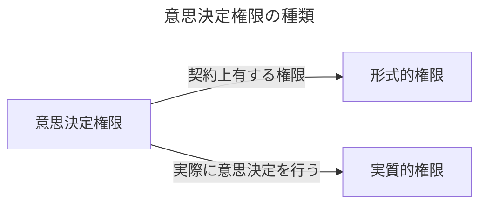
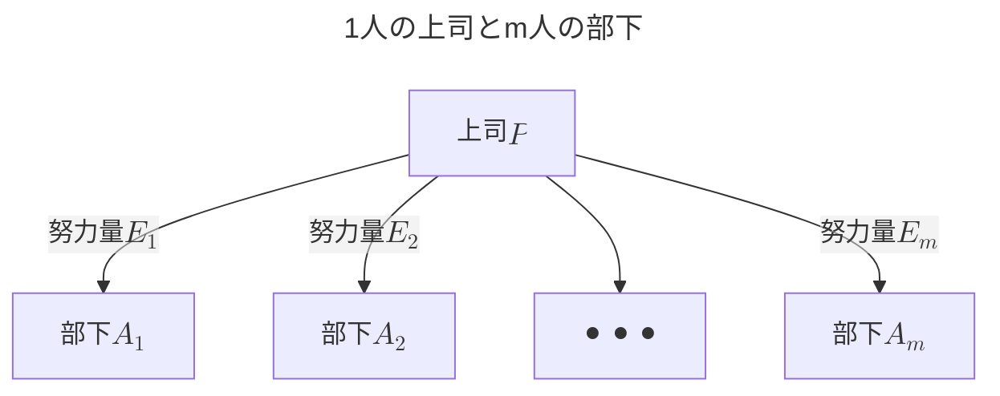
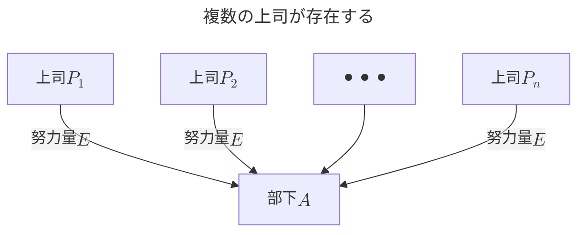

# A-18章 意思決定権限<span style="font-size: 24px;">〜組織内の形式的権限と実質的権限〜</span></h1>

## 形式的権限を有する者は必ずしも実質的権限を有しない


```mermaid
---
title: 意思決定権限の種類
---

graph LR
    A["意思決定権限"]
    B["形式的権限"]
    C["実質的権限"]

    A -- 契約上有する権限 --> B
    A -- 実際に意思決定を行う --> C
```

- まず、組織内部の意思決定権限について考察する。これまで議論してきたように意思決定権限を有することは、それが所有権理論（$\text{Property Rights Theory}$）における物的資産の所有権によって与えられようが、コントロール権の契約（$\text{Contracting for Control}$）の理論における契約によって与えられようが、いずれにせよ、通常は当然ながら意思決定権限を実際に有することを意味するはずである。
- しかし実際の組織では、契約上意思決定権限を有する<font color=red>$"\text{形式的権限}"\text{(Formal Authority)}$</font>と実際に意思決定を行う<font color=red>$"\text{実質的権限}"\text{(Real Authority)}$</font>は異なることが往々にしてある。例えば、株主は$"\text{形式的権限}"$を有するが、実際は取締役会に対するコントロールは限定的であるし、その取締役会自体もCEOに対するコントロールは限定的であり、さらには、そのCEOも各事業部長に対するコントロールが限定的であることが実際には観察される。
- この形式的権限と実質的権限の乖離の問題は実際の組織を設計（デザイン）する場合、常に念頭におくべき重要な問題である。その乖離が生じる原因は何であろうか、また、その理由は存在するのだろうか。上司はしばしば部下の提案をチェックもせずにハンコを押す。たとえ、上司が権限を有していても決定は下でなされるのである。この時上司は形式的権限を有しているが、部下が実質的権限を有していることになる。$\text{Aghion and Tirole（1997）}$はこの点を包括的に考えたパイオニア的研究である。

## 形式的権限と実質的権限のモデル

- 前提は次の通り。ヒエラルキーは1人のプリンシパル$P$と1人のエージェント$A$からなる。
  - 【**例1**】$P$を取締役会とすれば$A$が執行者（CEO）のケース
  - 【**例2**】$P$をCEOとすれば$A$が部門長のケース
  - 【**例3**】$P$を監督者とすれば$A$が労働者のケース

#### モデルの定式化

- プロジェクトは実行するか、全く実行しないかのいずれかである。$P$はプロジェクトの適否について情報を集め、さらにこれを実行するために$A$を雇う。プロジェクトの候補は3以上あり、<font color=red>それぞれのプロジェクト実行時に$P$は立証可能な利得を得、$A$は私的な利得を享受する</font>。
- プロジェクトが全く実行されなかった場合、両方の値は$0$になる。また、少なくとも1つのプロジェクトは双方から見て「完全な」失敗で、極度なマイナスの利得（$-\infty$）を与え、逆に2つのプロジェクトは双方にこのようなマイナスの利得与えないものと仮定する。<u>この仮定は通常の組織でよくある状況を想定した仮定</u>である。真の情報を有していない$A$はわからないまま特定のプロジェクトを$P$に推奨するより、自分が知らないことを認めてプロジェクトを何ら推奨しない方が得になる、同じことは真の情報を有していない$P$についても当てはまる。
- 例えば、モデル的には下表のような状況（$B>0,\;b>0$）を仮定する。下表において$P$にとって望ましいプロジェクトは2であり、$A$にとって望ましいプロジェクトは5である。
- $P$と$A$で同一のプロジェクトが志向される確率を$\alpha$とする。$\alpha$が大きいほど$P$と$A$の利害と嗜好性が類似する。仮にプロジェクト2が選択されると$A$の期待利得は$\alpha\cdot B$になる。
- 真の情報の獲得には費用（コスト）がかかるとし、候補のプロジェクトから生み出される利得は最初は$P$にも$A$にもわからないと仮定する。$A$と$P$のそれぞれの情報獲得の努力量（$\text{effort}$）のコストを$g_A(e),\;g_P(E)$とし、ともに増加関数（$g_A'(e)>0,\;g_P'(E)>0$）かつ厳密に凸（$g_A''(e)>0,\;g_P''(E)>0$）とする。$A$は$g_A(e)$の費用をかければ、$e$の確率で候補になっているプロジェクトの利得を完全に知ることができ、$1-e$の確率で費用をかけても何ら判明せず、依然としてプロジェクトは全て同一に見える。$g_P(E)$も同様の説明である。

|               |  $P$の利得   |  $A$の利得   |
| ------------- | :----------: | :----------: |
| プロジェクト1 |  $-\infty$   |  $-\infty$   |
| プロジェクト2 |     $B$      | $b$または$0$ |
| プロジェクト3 |  $-\infty$   |  $-\infty$   |
| プロジェクト4 |  $-\infty$   |  $-\infty$   |
| プロジェクト5 | $B$または$0$ |     $b$      |

### $P$が形式的権限を有する場合

```Mermaid
---
title: 上司Pが形式的権限を持つ場合の実質的権限のフロー
---
flowchart TD
    Start([プロジェクトの選択])
    Start --> PInfo{"$$P$$は真の情報を持つ？"}
    PInfo -->|Yes| Agree{"$$P$$の判断と一致する？"}
    Agree --> ResultP["【<b>意思決定権限</b>】<br>形式的権限：P<br>実質的権限：P"]
    PInfo --->|No| ResultA["【<b>意思決定権限</b>】<br>形式的権限：P<br/>実質的権限：A"]
```

- $P$は上司（$\text{superior}$）、$A$は部下（$\text{subordinate}$）とする。$P$が真の情報を持ち、$A$が推奨したものが自身の判断と一致していなければ、$P$は$A$の判断を覆す。この場合$P$はプロジェクトの選択に関して形式的権限と実質的権限の両方を持つ。そうでなくて$P$が真の情報を持っていない場合、$A$が推奨してきた選択を考えることなく判を押す。この場合、$A$が実質的権限を持つ。

### $A$が形式的権限を有する場合

- 形式的権限の権限移譲がなされているケースを考える。この場合、$A$が真の情報を持つときは自己の情報に従って判断を行い、$P$に覆されることはない。論理構造は$P$が形式的権限を有している場合と同様である。
- ゲームのタイミング設定は次の通り。

| $\text{No.}$ | 内容                                                                                                                                                 |
| ------------ | ---------------------------------------------------------------------------------------------------------------------------------------------------- |
| 1            | $P$は将来のプロジェクトの選択に関する意思決定の形式的権限（コントロール権）を<br>$P$か$A$のどちらかに配分する。                                      |
| 2            | $P$と$A$によりプロジェクトの利得に関する情報収集努力が行われる。                                                                                     |
| 3            | 形式的権限を持たない側は持つ側に対して、自らが収集した情報を<br>コミュニケートを通じて、選択すべきプロジェクトを推奨する。                           |
| 4            | 形式的権限を持つ側は実プロジェクトの実行適否を決定する。その際、<br>自らが収集した情報か、または相手からコミュニケートされた情報に基づいて判断する。 |

- 前述の通り、完全な失敗のひどいプロジェクトを選択した場合、悲惨なことになるので、もし何ら情報が判明していなければ形式的権限を持つ者はどのプロジェクトも選択しない。

## モデルの解

### 形式的権限が$P$を有する場合

- まず$P$の期待利得$U_P$を求める。$$\begin{align*}
    U_P&=\underbrace{E\cdot B}_{第1項}+\underbrace{(1-E)\cdot e\cdot \alpha B}_{第2項}+\underbrace{(1-E)\cdot(1-e)\cdot 0}_{第3項}-\underbrace{g_P(E)}_{第4項}
\end{align*}$$
  - 【**第1項**】確率$E$で真の情報を知り、利得$B$を得るケース
  - 【**第2項**】確率$1-E$で$P$が真の情報が得られず、確率$e$で$A$が真の情報を知り、確率$\alpha$で利害が一致したときの利得$B$を得るケース
  - 【**第3項**】$P$も$A$も利得を得られなかった場合、期待利得は0とする
  - 【**第4項**】$P$が負担する情報獲得の努力量
- 同様にして$A$の期待利得$U_A$を求める。$$\begin{align*}
    U_A&=E\cdot\alpha b+(1-E)\cdot e\cdot b+(1-E)\cdot(1-e)\cdot 0-g_A(e)
\end{align*}$$
- 上記を踏まえ、$\frac{\partial U_P}{\partial E}=0$と$\frac{\partial U_A}{\partial e}=0$を求めると次の結果が得られる。$$\begin{align*}\left\{\begin{array}{lll}
        \displaystyle\frac{\partial U_P}{\partial E}&=B-e\cdot\alpha B-g'_P(E)&=0\\[3mm]
        \displaystyle\frac{\partial U_A}{\partial e}&=(1-E)\cdot b-g'_A(e)&=0    
    \end{array}\right.
\end{align*}\implies
\begin{align*}\left\{\begin{array}{lll}
        (1-e\alpha)B&=g'_P(E)\\[3.5mm]
        (1-E)b&=g'_A(e)
    \end{array}\right.
\end{align*}$$<font color=red>上の連立方程式の解が$P$が形式的権限を有する場合におけるナッシュ均衡$(E_P,\;e_P)$になる</font>。
- 【**ナッシュ均衡$(E_P,\;e_P)$ の経営戦略上の意味**】$\frac{\partial U_P}{\partial E}=0$ を見ると$P$が監視をより強化する（$E$が大きくなる）と、$g_P(E)$の定義より、$g_P(E)$は大きくなり、$A$が努力しなくなっていく（$e$が小さくなる）。この結果から、**$P$の監視努力の増加は$A$の努力の結果に対する影響を低くするため、$A$の努力量を減少させ、パフォーマンス悪化に作用する**ことがわかる。

### 形式的権限が$A$を有する場合

- 次に形式的権限を$A$が有する場合（$A$に権限移譲されている場合）を考える。この時の$U_A$と$U_P$はそれぞれ次のとおり。$$\begin{align*}
    U_P&=e\cdot\alpha B+(1-e)\cdot E\cdot B-g_P(E)\\[1mm]
    U_A&=eb+(1-e)\cdot E\cdot\alpha b+(1-e)(1-E)\cdot 0-g_A(e)
\end{align*}$$ここで上式の確率$(1-e)\cdot E$について、これは$P$に実質的権限を移すことを意味する。これは部下$A$が上司$P$の提案をチェックせずに判を押す状況であり、奇妙である。このことから、**組織内で形式的権限はそもそも部下に「委譲」できず、一時的に貸しているだけで、不都合ならいつでも上司から返還を求めうるとの批判を導き出す余地を与えた**。この状況は後ほど議論する。
- 先ほどと同様に$\frac{\partial U_P}{\partial E}=0$と$\frac{\partial U_A}{\partial e}=0$を求めると次の結果が得られる。$$\begin{align*}\left\{\begin{array}{lll}
        \displaystyle\frac{\partial U_P}{\partial E}&=(1-e)\cdot B-g'_P(E)&=0\\[3mm]
        \displaystyle\frac{\partial U_A}{\partial e}&=b-E\cdot\alpha b-g'_A(e)&=0
    \end{array}\right.
\end{align*}\implies
\begin{align*}\left\{\begin{array}{lll}
        (1-e)\cdot B&=g'_P(E)\\[3.5mm]
        (1-\alpha E)b&=g'_A(e)
    \end{array}\right.
\end{align*}$$<font color=red>上の連立方程式の解が$A$が形式的権限を有する場合におけるナッシュ均衡$(E_A,\;e_A)$になる</font>。

### 両者の比較

- $E_P$と$E_A$、$e_P$と$e_A$をそれぞれ比較する。まず、$\alpha<1$より、$(1-\alpha E)b>(1-E)b$が得られる。ここで、$(1-\alpha E)b$は形式的権限が$A$の時の利得の勾配、$(1-E)b$は形式的権限が$P$の時の利得の勾配であることから<font color=red>$g'_A(e_A)>g'_A(e_P)$が得られ、$g_A(e)$は増加関数であるため、$\underline{e_P< e_A}$</font>が導出できる。同様にして$\alpha<1$より、$(1-\alpha e)B>(1-e)B$が得られ、<font color=red>$g'_P(E_P)>g'_P(E_A)$が得られ、$g_P(E)$は増加関数であるため$\underline{E_A<E_P}$</font>が導出できる。

## 権限移譲のベネフィットとコスト

$$
形式的権限=\left\{\begin{array}{lll}
    Aに権限委譲&\;if\;&\alpha^*<\alpha\\[1mm]
    Pが権限保持&\;if\;&\alpha<\alpha^*
\end{array}\right.
$$

- これまでの分析から上司$P$にとって部下$A$に権限を委譲するベネフィットとコストを考える。
  - 【**権限委譲のベネフィット**】<font color=red>$A$の自発性・独創力が助長される</font>。権限委譲により$P$が$A$の判断を覆すことができなくなり、$A$の努力の誘因が強く働く。
  - 【**権限委譲のコスト**】<font color=red>$P$の情報獲得の努力$g_P(E)$が小さくなる（誘引が弱くなる）</font>。$P$は形式的にも実質的にもコントロール力を弱めることになる。
- ここで実は、$P$と$A$で同一のプロジェクトが志向される確率$\alpha$がある閾値$\alpha^*$より大きい場合（$\alpha^*<\alpha$）は「$A$に形式的権限を委譲することが最適」であり、逆に、$\alpha$がある閾値$\alpha^*$より小さい場合（$\alpha<\alpha^*$）は「$P$が形式的権限を保持することが最適」であることが示せる。
- 本章で提示したモデルにおいては部下が自分より情報を持っており、しかも自分と目的とする方向（嗜好性、選好）が十分な程度に一致している（$\alpha$が閾値$\alpha^*$を超える）ことが求められる。

## 形式的権限を維持したまま部下の自発性・独創性を助長する方法

- 上司$P$が形式的権限を維持したままで、それでも部下$A$の自発性・独創性を助長することは可能かを検討する。このため、実質的権限を調整することを考える。

<div style="page-break-before:always"></div>

### 上司の業務範囲に「過重負荷」をかける（部下の数を増やす）


```mermaid
---
title: 1人の上司とm人の部下
---

graph TD
    P[上司$$P$$]
    A1[部下$$A_1$$]
    A2[部下$$A_2$$]
    cdots[⚫︎ ⚫︎ ⚫︎]
    Am[部下$$A_m$$]

    P -- "努力量$$E_1$$" --> A1
    P -- "努力量$$E_2$$" --> A2
    P --> cdots
    P -- "努力量$$E_m$$" --> Am
```

- これまでのモデルに上司の「**コントロールの範囲（$\text{span of control}$）**」という概念を導入する。これは、1人の上司$P$が$m$人の部下$A_i\;i\in\{1,\cdots,m\}$に対して、形式的権限を持つことを意味する。それぞれの部下$A_i$は努力$e_i$（確率）で自己プロジェクトの利得を完全に知ることができ、この時の$A_i$にかかる費用を$g_A(e_i)$とする。一方、上司$P$は努力$E_i$（確率）で$A_i$のプロジェクトの利得を完全に知ることができ、この時の$P$にかかる費用を$g_P(\sum_{i=1}^mE_i)$とする。ここで、<u>部下1人を使うにあたり、固定費$f$が上司にはかかるものとする（固定費がないと上司は無限大の部下を持とうとするため）</u>。
- 以上を踏まえ、$P$は形式的権限を持つ場合の$P$と$A$の期待利得$U_P,\;U_A$は以下のようになる。$$\begin{align*}
    U_P&=\sum_{i=1}^m\left(E_i\cdot B+(1-E_i)\cdot e_i\cdot\alpha B-f\right)-g_P\left(\sum_{i=1}^mE_i\right)\\[1mm]
    U_{A_i}&=E_i\cdot\alpha b+(1-E_i)\cdot e_i\cdot b-g_A(e_i)
\end{align*}$$
- さらに、$\frac{\partial U_P}{\partial E_i}=0,\;\frac{\partial U_{A_i}}{\partial e_i}=0$を求め、対称な均衡を仮定する、つまり、$e_i=e,\;E_i=E$とすると以下の連立方程式を得る。$$\begin{align*}\left\{\begin{array}{ll}
        \displaystyle\frac{\partial U_P}{\partial E_i}=(1-\alpha e_i)B-g'_P\left(\sum_{i=1}^mE_i\right)=0\\[3mm]
        \displaystyle\frac{\partial U_{A_i}}{\partial e_i}=(1-E_i)b-g'_A(e_i)=0        
    \end{array}\right.
\end{align*}\implies
\begin{align*}\left\{\begin{array}{lll}
        (1-\alpha e)B&=g'_P\left(m\cdot E\right)\\[3mm]
        (1-E)b&=g'_A(e)
    \end{array}\right.
\end{align*}$$<font color=red>上の連立方程式の解が$P$が形式的権限を維持する場合のナッシュ均衡であり、$(E(m),\;e(m))$になる</font>。

<div style="page-break-before:always"></div>

#### 【分析】上司の負荷$E$と部下の人数$m$の関係

- ここで、部下の人数$m$が変化すると、均衡$(E(m),\;e(m))$がどうなるのか分析する。$\frac{\partial U_P}{\partial E_i}=0$の結果より、$m\uparrow\implies E\downarrow$ がわかり、$\frac{\partial U_{A_i}}{\partial e_i}=0$の結果より、$E\downarrow\implies g'_A(e)\uparrow\implies e\uparrow$ がわかる。すなわち、$\underline{m\uparrow\implies E\downarrow\implies e\uparrow}$である。これは次のように解釈できる。**部下の人数$m$を増加させると、個々の部下の活動（プロジェクト）を知ろうとする上司$P$の監視努力量$E_i$が減少し、個々の部下の努力量$e_i$は増加することを意味している。ここに重要な含意として1人の上司$P$が管理する部下の人数を増やすことは個々の部下を働かせる効果があること**が確認される。
- 1人の上司$P$がコントロールする範囲の最適値を導出する。$m$を所与としたときの$P$の均衡における利得$U_P$とその最適値$\frac{\partial U_P(m)}{\partial m}=0$は次のように求められる。$$\begin{align*}
    U_P(m)&=m\{E(m)\cdot B+(1-E(m))\cdot e(m)\cdot\alpha B-f\}-g_P(m\cdot E(m))\\[2mm]
    \frac{\partial U_P(m)}{\partial m}&=\underbrace{\left[\;\left\{E(m)\cdot B+(1-E(m))\cdot e(m)\cdot\alpha B-f\right\}-E(m)\cdot g'_P(m\cdot E(m))\;\right]}_{\text{①部下を1人増やす（コントロール範囲を1単位広げる）ことによる上司の利得の増分}}\\[5mm]
    &+\underbrace{m\left[(1-E(m))\cdot\frac{\partial e}{\partial m}\cdot\alpha B\right]}_{\text{②上司の監督の減少による部下の努力量の増加の効果}}=0
\end{align*}$$ここで、①の項は部下1人の増加に対する収益分と監督コスト$g_P'\cdot E$の差分を表す。次に、②の項は常に正の値である。このことから、①の項がマイナスである必要があり、「**上司の利得の増分が負の値になっていなければならない**」。
- 以上より、<font color=red>わざと上司を忙しくさせ（意図的に荷重負荷をかけ）、部下の面倒を見にくくすることにより、部下の自発性・独創性が育つ</font>ことをこの**モデルは示唆**している。現実の組織設計において上司の管理範囲をどうするかを考察する上で重要な含意を示している。

<div style="page-break-before:always"></div>

### 上司を複数にし、数を多くする


```mermaid
---
title: 複数の上司が存在する
---

graph TD
    P1[上司$$P_1$$]
    P2[上司$$P_2$$]
    Pn[上司$$P_n$$]
    cdots[⚫︎ ⚫︎ ⚫︎]
    A[部下$$A$$]

    P1 -- "努力量$$E$$" --> A
    P2 -- "努力量$$E$$" --> A
    cdots --> A
    Pn -- "努力量$$E$$" --> A
```

- 上司$P$が形式的権限を維持したままで部下$A$の自発性・独創性を助長するもう一つの方法として、1人の部下に複数の上司がいる状況を考える。具体的には、株主と取締役の関係において上司がある株主が複数存在する状況を想定する。
- $n$人のパートナー（上司）に対して、各上司は$B/n$を受け取る。いずれの上司も真の情報の獲得についてかかる費用は同一でそれぞれの上司の費用関数は$g_P(E)$とする。上司が形式的権限を維持したままで各上司$P_i$と部下$A$の期待利得$U_{P_i},\;U_A$はそれぞれ次の通り。$$\begin{align*}
    U_{P_i}&=\frac{B}{n}(1-(1-E)^n)+\frac{B}{n}(1-E)^n\cdot e\cdot\alpha -g_P(E)\\[2mm]
    U_A&=(1-(1-E)^n)\cdot\alpha b+(1-E)^n\cdot e\cdot b-g_A(e)
\end{align*}$$
- $U_P$と$U_A$の最大化のために$\frac{\partial U_{P_i}}{\partial E}=0,\;\frac{\partial U_{A}}{\partial e}=0$を計算する。$$\begin{align*}
    \frac{\partial U_{P_i}}{\partial E}&=B(1-E)^{n-1}(1-\alpha e)-g'_P(E)=0\\[2mm]
    \frac{\partial U_{A}}{\partial e}&=b(1-E)^{n}-g'_A(e)=0
\end{align*}\implies
\left\{\begin{array}{ll}
    B(1-E)^{n-1}(1-\alpha e)&=g'_P(E)\\[1mm]
    b(1-E)^{n}&=g'_A(e)
\end{array}\right.$$
- 以上より、上司$P_i$にとってみると、上司の間でモニタリングの「**ただ乗り**」が生じてモニタリングの努力量が減少している（$\color{red}E\downarrow$）。この結果、部下の努力量が増加する方向に力が働く（$\color{red}e\uparrow$）。一方、部下$A$にとってみると上司の人数増加が実質的にモニタリングの構造を改善し、部下$A$の努力へのインセンティブを減少させる。この結果、部下の努力量が減少する方向に力が働く（$\color{blue}e\downarrow$）。
- 興味深いのは$P_i$の費用関数$g_P(E)$が極端に凸でなければ、$E$が大きく減少し、$e$が大きく増加するため、部下の努力量が増加する。すなわち、**上司の数が増加した場合に$g_P(E)$が極端に凸でなければ、上司間でのモニタリングの「フリーライディング効果」が優勢になり、上司のコントロール力が弱体化する結果、上司の人数増加が部下の努力へのインセンティブを増加させる**。例えば、株主数の増大・分散化は取締役の努力量を増大させる可能性がある。これが、上司が形式的権限を維持したままで、部下の自発性・独創性を助長するもう一つの選択肢の可能性である。

<div style="page-break-before:always"></div>

## 組織内で権限の所在を分散させる効果

```plantuml
title 権限の所在が分散されているケース

actor "ヘッドクォーター" as head
actor "R&D部門" as rd
actor "製造部門" as m

head -- rd
head -- m
rd -> m
```

- 前節まで形式的権限と実質的権限が乖離する状況について取り扱ったが、現実の組織においては形式的権限の所在が組織内で分散されているケースがある。例えば、$\text{R\&D}$と製造部門で意思決定権限を有する部門が組織内で分割されている場合である。本節では「**権限の所在を社内で分散されることの効果**」を考える。
- 結論から言うと、$\text{R\&D}$部門は行きすぎた空想的な開発プロジェクトに向かうバイアスを制御され、同時に$\text{R\&D}$の段階を支配する権限を持つことから、$\text{R\&D}$部門が懸命に働く（努力する）インセンティブが保護される。

### 権限分割のモデル

- ゲームは2部門$A,\;B$が存在し、2段階のステージからなるものとする。各ステージではアクション$s\in\{L\text{（左）},\;M\text{（中）},\;R\text{（右）}\}$とする。部門$A$は$L,M,R$の順で選好を持ち、部門$B$は$R,M,L$の順で選好を持つとする。さらに$s$に対する意思決定権限の部門間の分割（配分）は契約可能とする。
- ゲームのタイミング設定は次の通り。

| $\text{No.}$ | 内容                                                                                                                                   |
| ------------ | -------------------------------------------------------------------------------------------------------------------------------------- |
| $1$          | 部門$A$と$B$で意思決定権の分割（配分）について契約を締結する                                                                           |
| $2$          | $\text{No.}$1のアクション$s_1$を決定する（決定権は$A$にある）                                                                          |
| $3$          | $\text{No.}$2                                                のアクション$s_2$を決定する（決定権は契約に応じて部門$A$または$B$にある） |
| $4$          | 利得を配分する。部門$A$は$\Pi_A(s_1,\;s_2)$、部門$B$は$\Pi_B(s_1,\;s_2)$とする。                                                       |

- 簡単化のために利得の構造として、以下を仮定する。ここで、$\Pi^c$は$A,B$が協調した時の利得を意味する。
- 【**仮定1**】部門$A$にとって以下を仮定する。$$\begin{align*}
    \bar{\Pi}&=\Pi_A(L,\;L)\\[1mm]
    &>\Pi^c=\Pi_A(M,\;M)\\[1mm]
    &>\Pi_A(L,\;M)&(1)\\[1mm]
    &>\Pi_A(L,\;R)=0\\[1mm]
    &>\hat{\Pi}=\Pi_A(M,\;R)\qquad&(2)\\[1mm]
    &>\underline{\Pi}=\Pi_A(R,\;R)\\[1mm]
\end{align*}$$対称的に部門$B$についても同様の仮定をおく。$$\begin{align*}
    \bar{\Pi}&=\Pi_B(R,\;R)\\[1mm]
    &>\Pi^c=\Pi_B(M,\;M)\\[1mm]
    &>\Pi_B(M,\;R)&(3)\\[1mm]
    &>\Pi_B(L,\;R)=0\\[1mm]
    &>\hat{\Pi}=\Pi_B(L,\;M)\qquad&(4)\\[1mm]
    &>\underline{\Pi}=\Pi_B(L,\;L)\\[1mm]
\end{align*}$$
  - 【**式$(1)$**】他の$\text{No.}$で「**強調する**」なら部門$A$は$L$ではなく、$M$を選択し、協調した方が良いとの仮定
  - 【**式$(2)$**】他の$\text{No.}$で「**強調しない**」なら部門$A$は$M$ではなく、$L$を選択し、協調しない方が良いとの仮定
  - 【**式$(3)$**】他の$\text{No.}$で「**強調する**」なら部門$B$は$R$ではなく、$M$を選択し、協調した方が良いとの仮定
  - 【**式$(4)$**】他の$\text{No.}$で「**強調しない**」なら部門$B$は$M$ではなく、$R$を選択し、協調しない方が良いとの仮定
- 【**仮定2**】$\bar{\Pi}+\underline{\Pi}<2\cdot\Pi^c$ の状況を考える。
- 【**仮定3**】利得は事後に立証可能でないとする。実行したアクションについても事後に立証可能でないとする。
- 仮定3より、$A,B$間で締結する契約は「どちらの部門がアクションに対する意思決定権を持つか」のみを決定できる。異なる契約により生じる結果がどうことなるかをみるために、均衡（部分ゲーム完全均衡）に意識を集中する。
- 結論から述べると、<font color=red>社内の部門間で権限の所在を分割した場合</font>（$\text{No.1}$のアクションの決定権は部門$A$にあり、$\text{No.2}$のアクションの決定権が部門$B$にある場合）<font color=red>はファーストベストの状態に到達することができる</font>。権限の所在の$"\text{分割}"$は$\text{No.2}$のアクションの決定権を有する部門$B$が、いわゆる「**アメとムチ**」戦略を通じて、$\text{No.1}$のアクションの決定権を有する部門$A$を規律する余地を与え、協調的な決定をさせる。以下、その詳細を順を追って説明する。
  - 【**権限の所在を分割しない場合**】アクションの決定権が部門$A$に集中している場合であり、このとき、部門$A$は$\text{No.1,2}$とも$s=L$を選択する。$\displaystyle\max_{s_1,\;s_2}\Pi_A(s_1,s_2)=\Pi_A(L,L)=\bar{\Pi}$であるからである。従って、均衡の総余剰は$\Pi_A(L,L)+\Pi_B(L,L)=\bar{\Pi}+\underline{\Pi}<2\cdot\Pi^c$ となる。
  - 【**権限の所在を分割する場合**】$\text{No.1}$のアクションの決定権が部門$A$にあり、$\text{No.1}$のアクションの決定権が部門$B$にある場合であり、このとき、もし部門$A$が$\text{No.1}$においてアクション$M$を選択するならば、部門$B$は$\text{No.2}$において、これに応えてアクション$M$を選択する（**アメの部分**）。なぜなら、$\Pi^c=\Pi_B(M,M)>\Pi_B(M,R)$ だからである。しかし、もし部門$A$が$\text{No.1}$においてアクション$L$を選択するならば、部門$B$は$\text{No.2}$において、これを罰してアクション$R$を選択する（**ムチの部分**）。なぜなら、$\Pi_B(L,R)>\Pi_B(L,M)=\hat{\Pi}$ だからである。
- 従って、部門$A$は$\text{No.1}$において$(M,M)$と$(L,R)$を比較して、アクション$M$を選択する。なぜなら、$\Pi^c=\Pi_A(M,M)>\Pi_A(L,R)$ だからである。それゆえに$\text{No.2}$において部門$B$はアクション$M$を選択する。これが部分ゲーム完全均衡で総余剰は$2\cdot\Pi^c$ になる。すなわち、社内の部門間で権限の所在を分割した場合は均衡で相互協調の$(M,M)$に到達するので<font color=red><b>ファーストベストの状態（総余剰$2\cdot\Pi^c$）</b></font>に到達することができる。これは<font color=blue><b>権限を分割しない場合（$\bar{\Pi}+\underline{\Pi}$）</b></font>より総余剰が大きくなる。

<div style="page-break-before:always"></div>

## 部下に「貸す」ことができるのみ

- 

### 権限移譲にコミットできなかった会社

- 

### オーティコン社のスパゲッティ組織の変容

- 

### コントロール権はトップにある

- 
