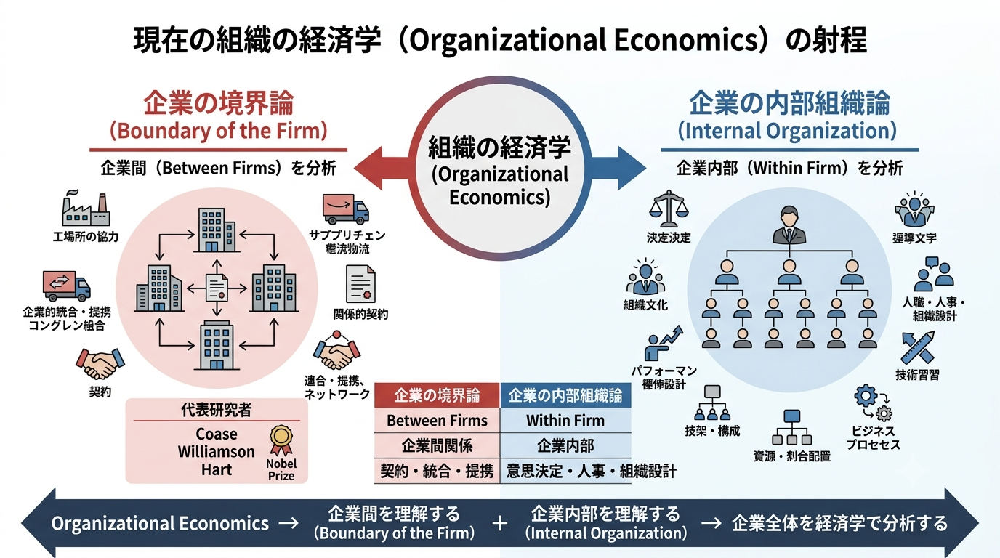
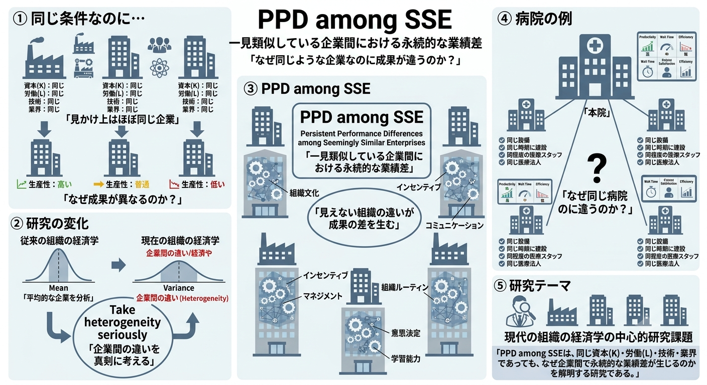
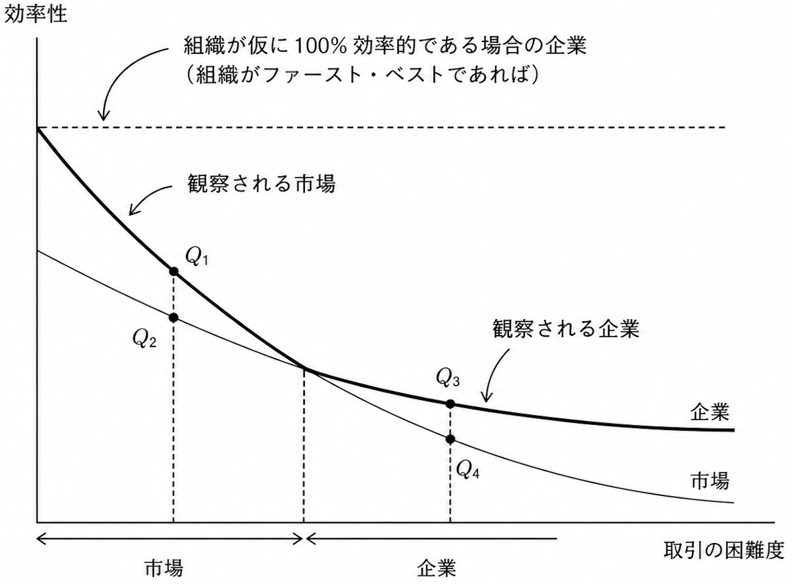

# A-2章 組織の経済学の構成

## 現在組織の経済学の射程

- 現在組織の経済学は大きく2つの側面に分解して考えることができる。
  - 【**第1の側面**】企業の境界論（boundary of the firm）である。組織の経済学の中で、**ある企業と他の企業の関係（between firms）を分析対象とする**。かつては「企業の理論（the theory of the firm）」と呼ばれていたが、良い呼び方とは言えない。なぜならまるで組織の経済学（Organizational Economics）全体を指しているが如くに聞こえるからである。
  - 【**第2の側面**】企業の内部組織論（internal organization）である。組織の経済学の中で比較的最近発達してきた分野で**企業の内部を分析対象とする**。長い間、社会学的に接近されてきた分野であり、企業の境界論と比較するとバックグラウンドをさほど有していない。
- 企業の境界論の研究についてはコース（Coase）、ウィリアムソン（Williamson）、ハート（Hart）らの歴代ノーベル経済学賞受賞者の貢献があり、経済学による研究が歴史的にも評価されている分野と考えて良い。具体的な研究テーマとしては以下が挙げられる。
  - 垂直統合
  - サプライチェーン
  - 水平統合とコングロマリット・コーポレートストラテジー
  - 企業間の契約（フォーマルなものと関係的［relational］なものの双方）
  - ハイブリッドな組織形態（アライアンス、ネットワーク、ジョイントベンチャー[合弁事業]）
- 企業の内部組織論の具体的な研究テーマとしては以下が挙げられる。
  - 意思決定（パワーと政治行動、組織文化とリーダーシップ）
  - 雇用（ペイ・フォー・パフォーマンス、スキル開発、ヒューマン・リソース・プラクティス）
  - ストラクチャーとプロセス（ヒエラルキーと代替的携帯、資源配分）

## PPD among SSE とマネジメントプラクティス

- 本書では経済学の内部組織論の一連の先端的研究成果も取り入れて議論を行う。課題はこれらの永続的なパフォーマンスの違い（PPD：Persistent Performance Differences）がどこからくるかについて考察するにあたり、どの均衡を選択するかで大きな違いが生じると考え、均衡を打ち立て、管理し、成長させる理論を打ち立てることである。

#### PPD among SSE とは

- 企業の内部組織論を探求していくと、その平均的像（mean）を探求することから最終的には、「**$K$（資本）や$L$（労働）などが同じでも企業による違い（variance）が生じるのはなぜか**」という疑問に直面することになる。なぜ成果が異なるのか。「Take heterogeneity seriously（違いを真剣に考えろ）」が直近の組織の経済学の最大のリサーチアジェンダである。PPD among SSE（Persistent Performance Differences among Seemingly Similar Enterprises）というアジェンダがある。日本語訳すると「一見類似している企業間における永続的な業績（パフォーマンス）の差異」であり、この研究はMITのスローンビジネススクールで Robert Gibbons と Nancey Beaulieu、Rebecca Henderson、Nelson Repenning、John Sterman によって開始された共同研究に端を発している。「**PPD among SSEとなるのはなぜか**」を研究テーマとしている。
- PPD among SSE の現象は特定の産業に限ってではなく、多くの産業で通常見られる現象である。SICコード（産業分類コード）による分類を用いると異なる2つの企業の比較のみでなく、同一の企業の内部の2つの施設・工場の比較をすることもできる。同じ企業の内部でも異なる工場・施設の間で大きなパフォーマンス（例えば生産性）の違いがある。
- PPD among SSEの例として、マサチューセッツ・ジェネラル・ホスピタル（Massachusetts General Hospital）という有名な病院がある。同院は本院の他に郊外にいくつかの分院を有している。そして、これらの分院は類似資本装備を有しており、同時期に建設されており、同じ水準の労働力を有している、のにもかかわらず、**なぜかパフォーマンスはここの分院によって異なる**。

#### 【研究紹介】マネジメントプラクティス（経営力を測る18の要素）

- 近年、Nicholas Bloom（スタンフォード大学）、John Van Reenen（MIT）、Raffaella Sadun（ハーバード大学ビジネススクール）らの経済学者による研究（＝ワールド・マネジメント・サーベイ［WMS］）により、システマティックなインタビューによるデータセットの整備とこれらを用いた計量経済学的手法によりマネジメント・プラクティス（management practice）の状態、すなわち、経営の良し悪しを計測しようとする経済学の手法を用いた実証研究が進展し、組織の経済学の研究に大きな影響を与えつつある。経済学者は生産性の相違の背後にある$"\text{経営力（マネジメント）}"$という要素を長い間無視し続けてきた。しかしながら彼らの実証研究により、企業間あるいは国の間の生産性（＝全要素生産性；TFP）の差のおよそ$1/4〜1/3$もが機械（資本）でも労働力でもなく、経営力に起因することが推計された。
- Bloom、Van Reenen らは注意深い方法でシステマティックにインタビューを行い、調査対象の工場（plant）などの事業所について、18の鍵となるマネジメントプラクティスごとに点数1（最悪）から点数5（最良）を定義して、インタビューベースで評価したデータセットを整備した。この評価は①モニタリング、②ターゲット（目標設定）、③インセンティブ（人的管理）、の3つの観点から行われている。インタビュー対象には、ミドルマネジャー層を選択した。製造業における工場長、小売業の店長、病院の看護師長、学校の校長、などである。
  - 【**ミドルマネジャーを選択した理由**】マネジメントプラクティスの全体像を掴んでいる一方、日々のオペレーションから離れすぎていないからである。
  - 【**トップマネジメント（CEOなど）を対象に選択しなかった理由**】CEOの仕事である戦略決定は外形的に、何が良い戦略で、何が悪い戦略かが判断しにくく、評点が難しいことが挙げられる。これらトップマネジメントの評価手法についても現在進行形で研究を進めている。

**実験結果**

- ミドルマネジャー層を対象としたデータセットについて、国ごとの平均点を比較すると、1位が米国、2位が日本、3位がドイツ、4位がスウェーデンであった。
- ミドルマネジャー層を対象とした日本のデータセットは一言で言うと「**平均点は高いが変化に弱い**」であり、特徴は以下の通り。
  - 平均点が高い
  - 上司の了解なく自立して意思決定・実行できるかを見るスコアが悪く、中央集権的な性格が他国と比べて際立っている
  - 分権化の遅れが目立つことから、変化が大きく、不確実な状況下では、迅速な投資決定や技術導入ができない
- ミドルマネジャーのマネジメントプラクティスの評点を説明変数として企業のパフォーマンス（①従業員あたりの売上高、②利益率、③トービンのq［企業の市場価値が保有資産の再調達コストの何倍であるかを示す指標］、④売上高成長率、⑤企業の生存率）を目的変数（被説明変数）にして回帰分析を行うと、いずれの場合も**正の相関を有意に確認**した。また、マネジメントプラクティスは企業を取り巻く環境に条件づけられている（contingent）とは言うものの、それが全てではなく、環境が同じでもマネジメントプラクティスは異なり、同じ国・同じ産業においても、より良いマネジメントプラクティスを採用している企業はより大きな利潤を上げ、早く成長し、高い企業価値を実現していることが確認された。このようにマネジメントプラクティスの基本的な要素を定量化する方法論を用いて国やセクター間、企業間の差を同定し、その上でさらには実験的手法（特に RCT［Randomized Control Trial］と呼ばれる手法）によって因果関係を特定する方法が組織の経済学において活用されていくこととなろう。

**マネジメントプラクティスの違いが永続する要因**

- 以上のように企業レベルあるいは国のレベルでのPPD（**永続的なパフォーマンスの差異**）が生じる原因としてマネジメントプラクティスの違いがその原因であるとする証拠が明確に提示されつつある（Bloom and Van Reenen, 2007; Boolm and Van Reenen, 2010; Bloom, Genakos, Sadun and Van Reenen, 2012; Bloom, Lemos, Sadun, Scur and Van Reenen, 2014）。
- 良好なマネジメントプラクティスが全般の企業に採用されない理由についても特定されつつある。BloomやVan Reenenの研究によると、次の4つのポイントが導き出された
  1. **製品市場における競争の役割**（製品市場の競争が激しければマネジメントスコアが高くなる傾向がある）
  2. **家族経営の企業か否か**（特に株式保有の問題よりも経営が実際に家族によって行われている場合マネジメントスコアが低くなる傾向がある）
  3. **人的資本**（従業員の大学卒の比率が高くなるとマネジメントスコアが高くなる傾向がある）
  4. **インフォメーション**（良いマネジャーは自企業のマネジメントを過小評価する傾向があり、出来の良くないマネジャーは自企業のマネジメントを過大評価する傾向がある）

## 市場の取引費用と企業内部の取引費用

#### 企業は市場よりコストが安い時に生まれる（Coase, 1937）

- Coase（1937）$"\text{The Nature of the Firm}"$は企業の境界論と組織の経済学の2つの発展において時代を画した論文である。Coase（1937）の問題意識は「**なぜ全ての経済取引は市場によって組織されないのか**」である。当論文の中でコースはD.H.Robertson（1923）を引用して、組織のことを次のように呼んでいる。
    > $"\text{Islands of \underline{conscious} power in this ocean of \underline{unconscious} co-operation like}\\\text{ lumps of butter coagulating in a pail of buttermilk}"$
    > バターミルクの手桶の中で凝固するバターの塊のように、
    > <u>無意識的</u>な協力の大会の中で漂う<u>意識的</u>なパワーに支配される島々
- 市場は資源の利用を調整し、希少な資源を配分する。その際、市場価格は「何が、どこで、誰によって」求められているかのシグナルになる。それでは、なぜ企業は存在するのだろうか。コースの回答によると、企業の存在は市場を利用するためのコストの存在である。このため、「**企業は市場よりコストが安い時に生まれるもの**」であるとし、コーディネーションメカニズムとしての企業を考察した。
  - パワーすなわち「権限（authority）」が市場に対し企業を特徴付ける鍵となる（$\text{Islands of conscious power}$）

#### 企業を理解するために必要な考え（Williamson）

- それでは企業は完全だろうか。ウィリアムソン（Williamson）は次の2つを考えた
  - ①「**企業を理解するためには市場を利用するためのコストの内容を検討し、分析のレベルをもう一度掘り下げなければならない**」
  - ②「**もし企業の存在が市場における取引費用の問題を回避させるならば、なぜ企業の規模に限界が生じるのか**」
- ①について、取引の性格はその取引の構造と過程を決める。なぜ、どのような時に、市場に、この「取引費用」が高くかかるのかを探求する必要がある。これが「**取引費用の経済学（Transaction Cost Economics）**」である。取引費用には例えば、相手を見つけるコスト、交渉し価格を見つけ契約するコスト、交渉コストを節約して長期契約にしようとすると柔軟性が欠けるコスト、などが想定される。このような取引費用が存在すると完全な契約を結ぶことは不可能となる（Arrow-Debreu型の条件付き契約は成立しない）。
- ②について、疑問の原因は複数の企業の「統合」後も、それが望ましい場合には経営者はあたかも「分離」していたときと同じ状況になるように経営に介入すること（これを「**選択的介入**」と呼ぶ）が認められるはずだからである。であるならば、競争政策上の考慮を除けば全ての企業が「統合」し、1つの企業になった方が望ましいはずである。にもかかわらず現実には、なぜ1つにならないのか。これについてウィリアムソンは統合することにも費用が発生すると説き（Williamson, 1985）、具体的には次の3つに整理できる。
  - 【**統合しない要因1：管理する傾向が強まるから**】第一に、組織には不確実性を抑えようとする傾向があり、実際には新たなさまざまな事象が次々と発生するにもかかわらず、それらを定型化したものとして扱い、以前の型に合わせた意思決定を行おうとする傾向が出てくることである。第二に、組織の目的自体よりも組織を維持することのような本来の目的でない副次的な目的を社員が追求する傾向が出てくることである。
  - 【**統合しない要因2：厳しさがなくなり許容度が大きくなるから**】同じ取引を市場を通じて行う場合と企業内で行う場合を比較してみると、取引条件を満たせなかった場合には市場を通じての契約の方がより厳しい処罰が行われることを意味している。
  - 【**統合しない要因3：政治的な影響があるから**】企業内部で社員がお互いに助け合うために企業内取引を選択した場合に生じる問題点である。企業の設備の更新などについても更新すべき設備が同一企業内の他部門によって提供されている場合は無理に同一企業内で調達を行い、非効率な設備が温存される傾向がある。

#### 企業のブラックボックス性

- 200年間、経済学の世界では、企業はあたかも物理学の「質点」のようにブラックボックスだった（企業は資本$K$と労働$L$を投入されて、生産関数 $F(K,\;L)$ を通じて生産物を生み出すブラックボックスだった）。ここにはマネジメント$M$という重要な生産要素が除かれている。**この点は企業がブラックボックスで内部組織がないとみなしてきたことと関係している**。
- 社会学の歴史を見ると官僚制度については1920年代のマックスウェーバー（Max Weber）らによるWeberian bureaucracy では「性格さ、スピード、専門家によるコントロール、継続性、思慮分別、そして、インプットに対する最適なリターン」がキーワードであり、「かなり利口な組織的機械」として観念されていた。これに対し、1950年代からの**ポストウェーバー**の組織社会学では、$\text{Not Weberian bureaucracy}$ として「ルールはしばしば破られ、決定事項はしばしば実行されず、$\cdots$ 評価と監査の体制はひっくり返される」ものとして、観念されるようになった。
- 最近では、このポストウェーバーの組織社会学と現代の組織の経済学のコンバージェンス（収束）が生じていると考えられる。すなわち、近年発達してきた組織の経済学のモデルはポストウェーバー的な考え方に立脚しており、非効率で、非公式で、制度化された組織行動の認識を有している。

#### 市場と企業の効率性

- 上図は本書でこれから展開しようとする内容全体を統合し、要約する図である。現実問題として市場は一般に言われているほどは、そのパフォーマンスは良くない。Coase（1937）は仮に市場が完全であれば、なぜ企業が必要になるのかを問うた。上図はこの問題提起に関連している。横軸はウィリアムソン（Williamson）が「**取引の困難度（transaction difficulty）**」、縦軸は「**効率性（effectiveness）**」を示している。横軸は右に行くほど困難度は大きくなる。
  - 【**横軸の補足**】情報の非対称性（asymmetric information）による取引の困難度、契約問題が取引に問題を惹起する程度が著しくなる度合い、取引上モラルハザードの度合い、などのように考えても良い
  - 【**縦軸の補足**】われわれが獲得する社会的余剰（social surplus）の現在価値のようなものと考えれば良い。