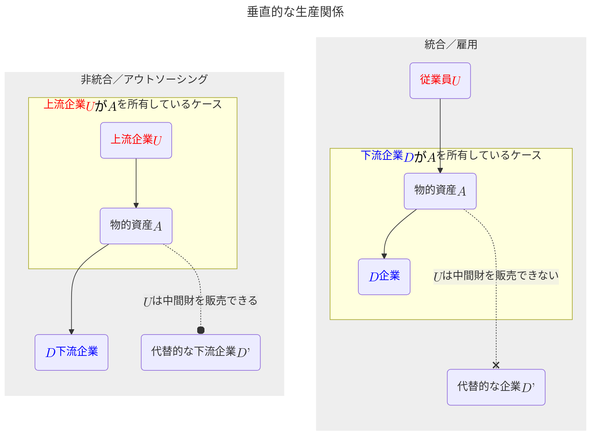
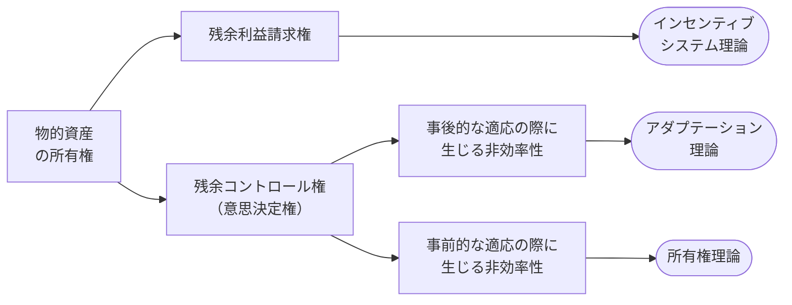

# A-3章 企業の境界論

- 企業の境界論（$\text{boundary of the firm}$）の詳細に入る。この問題はある種、古典的な問題である。企業の理論（$\text{the theory of the firm}$）とも呼ばれる。この問題に対する古典的な回答、ないしは、回答しようとした古典的な試みは2009年にノーベル経済学賞を受賞したウィリアムソン（$\text{Oliver Williamson}$）による取引費用（$\text{transaction costs}$）である。
- ウィリアムソンは「統治構造（$\text{governance structure}$）には多種多様なものがあり、直面する問題を最小化数量にその選択を行う」という基本的アイデアを創始した。ここでは、垂直統合（$\text{vertical integration}$）について議論を行う。<u>垂直統合とは、自社の仕入れ先あるいは販売先に$\text{M\&A}$を行うことで事業領域の拡張を行うことを言う</u>。

## 4つのフォーマルモデル

- 企業の境界論、より具体的には$\text{Make or buy}$（自社内で製造するか、または市場を通じて購入するか）の決定問題を<u>ここでは $\text{Gibbons（2005 a）}$に従って4つのモデルに類型化して議論する</u>。
  1. **インセンティブシステム理論**（$\text{Incentive System Theory}$）
  2. **アダプテーション理論**（$\text{Adaptation Theory}$）
  3. **所有権理論**（$\text{Property Rights Theory、PRT}$）
  4. **レントシーキング理論**（$\text{Rent-Seeking Theory}$）
- ここから<u>中間財を自社内で作るか（企業内部の取引）、外から購入してくるか（市場取引）という問題を考察する</u>。この問題では以下を事前知識とする。
  - 【**事前知識1**】製造設備などの物的資産の所有権（$\text{ownership of asset}$）の所在は生産される中間財の所有権（$\text{ownership of intermediate good}$）の所在を決める。
  - 【**事前知識2**】上流企業（$U\text{：upstream party}$）が製造設備などの物的資産の所有権を持っている場合が「非統合（$\text{non-integration}$）」の場合であり、中間財の所有権は$U$にある。この場合$U$は「独立した契約者（$\text{independent contractor}$）」と呼ばれる。
  - 【**事前知識3**】下流企業（$D\text{：downstream party}$）が製造設備などの物的資産の所有権を持っている場合が「統合（$\text{integration}$）」の場合であり、中間財の所有権は$D$にある。この場合、$U$は「従業員（$\text{employee}$）」と呼ばれる。
- 上記の補足として、**非統合の場合は「アウトソーシング（$\text{outsourcing}$）とも解釈でき、統合の場合は「雇用（$\text{employment}$）関係」とも解釈される**。

#### 垂直的な生産関係

- 非統合の場合は$U$は中間財を$D'$に対して（場合により）**販売できる**。一方で、統合の場合は中間財の所有権は$D$にあるので、$U$は$D'$に対して中間財を**販売できない**。この関係は上図のように表現できる。
- 【**上図の非統合／アウトソーシングの説明**】上流が資産を所有している場合を非統合あるいはアウトソーシングとよび、この場合、上流は品物$D'$に売却すると下流を脅すことができる（しかし、$D$に売却する場合の方が品物の評価は高いと想定する）。我々が非統合（アウトソーシング）で意味するものは上流部門が$A$を所有しているので中間財の所有権は（中間財を売却するまでは）上流部門にある。上流部門が$A$を所有している場合、上流部門はマルチタスクのアクションを取り、自分の資産（機械）$A$を用いて中間財を生産する。そして、上流部門は「$D$に売ろうか、$D'$に売ろうか」と自問する。この場合、上流部門は自分が所有している機械を使用しているので「**独立した契約者の説明**」である。
- 【**上図の統合／雇用**】下流が物資を所有している場合、上流を従業員と呼ぶ（なぜなら上流は自らは所有していない資産を使用して生産しているからである）。この場合、下流は上流に対し、「決してあなたは中間財を$D'$に売却することはできない。なぜならそれは私のものだから。」と主張できる。この統合（または雇用）の場合でも資産の所有権は生産される中間財の所有権をもたらす。上流部門はマルチタスクのアクションをとり、資産（機械）を用いて中間財を生産するが今や、下流部門が資産（機械）を所有しているので下流部門が生産された中間財を所有する。従って下流部門は上流部門に「アクションをとってくれてどうもありがとう。ところで、この中間財をどうですかなどと$D'$に提案することさえ考えてはいけない。なぜなら中間財は私（下流部門）が所有しているのだから」と言う。この場合は上流部門は自分が所有していない機械を使用しているので上流部門を「**従業員（employee）**」と呼ぶことができる。
- 【**数式の定義**】まず、資産か機械である$A$がある。上流部門$U$は$A$を使用して複数の活動・職務（$\text{multi-task}$）のアクション$a=(a_1,\;\cdots,\;a_n)$をとる。そして、中間生産物が生産される。生産された中間生産物は下流部門$D$もしくは$D'$に行きうる。しかし、アクション$a$は$D$に対する「**特殊的投資**」であるので、あるいは、$A$は$D$に対する「**特殊的な機械、資産**」であるので中間生産物自体は全く同じ財であるが、中間生産物が$D$に行った場合の価値$Q(a)=\{Q_1,\;\cdots,\;Q_I\}$、は$D'$に行った場合の価値$P(a)=\{P_1,\;\cdots,\;P_J\}$より大きい。常に$Q>P$ であり、これが「<b>特殊性</b>」の尺度となっている。$Q$と$P$の確率密度関数$f$は$Q_i$が$P_j$より大きい時だけ正の値をとる。（$f(Q_i,\;P_j)>0\quad\text{if only}\quad Q_i>P_j$）。$Q$と$P$の値は観察可能（$\text{observable}$）であるが第三者に立証可能（$\text{verifiable}$）ではない。
- 以上の準備の下に$\text{Gibbons（2005a）}$の4つのモデルの整理を行うために、以下のようにゲームの基本的なタイミングを設定する。
  1. 資産の所有権（$\text{asset ownership}$）あるいはコントロール権（control rights）の割り当てを行う（＝統治構造［$\text{governance structure}$］の選択）。
  2. 事前のアクション（$\text{ex anteactions }$）$a$ をとる。
  3. 具体的な世界の状態（$\text{the state of the world}$）$s$ が実現（$\text{realize}$）する。
  4. 事後の意思決定（$\text{ex post decisions}$）$d$を行う。
  5. 報酬（$\text{payoffs}$）が支払われる。
- この基本的なタイミングに沿って4つのモデルの区分けを行い、4つのモデルをそれぞれ適切な$"\text{巣}"$に入れてあげることを考える。
- 各モデルの整理を行うときに必要となるため、ここで「**所有権**」とは何かについて議論しておく。一般に、**所有権（$\text{ownership}$）** は①ぶって岸さんの利用に関する残余コントロール権（$\text{}$）と、②残余利益請求権（$\text{}$）、の2つをもたらす。①は（契約で明示的にぶって岸さんの非所有者に属す権利を除いて）すべての物的資産の利用をコントロールする権利を意味し、$"\text{decision right}"$である。これに対し、②は物的資産が生み出す残余利益を請求する権利であり、$"\text{payoff right}"$である。この分類に従ってあらかじめ4角打ち3つのモデルを位置付けるとした図のようになる。各モデルの説明を読み終わった後、この図に戻り確認をいただきたい。

## インセンティブシステム理論

- 

### 統合 / 雇用の場合

- 

### 非統合 / アウトソーシングの場合

- 

## アダプテーション理論

- 

## アダプテーション理論の修正

- 

## 所有権理論

- 

## レントシーキング理論

- 

## 事前のインセンティブと事後の適応

- 

## 特殊的投資をめぐる事前の非効率性と事後の非効率性

- 

## 企業ないのレントシーキング理論

- 

