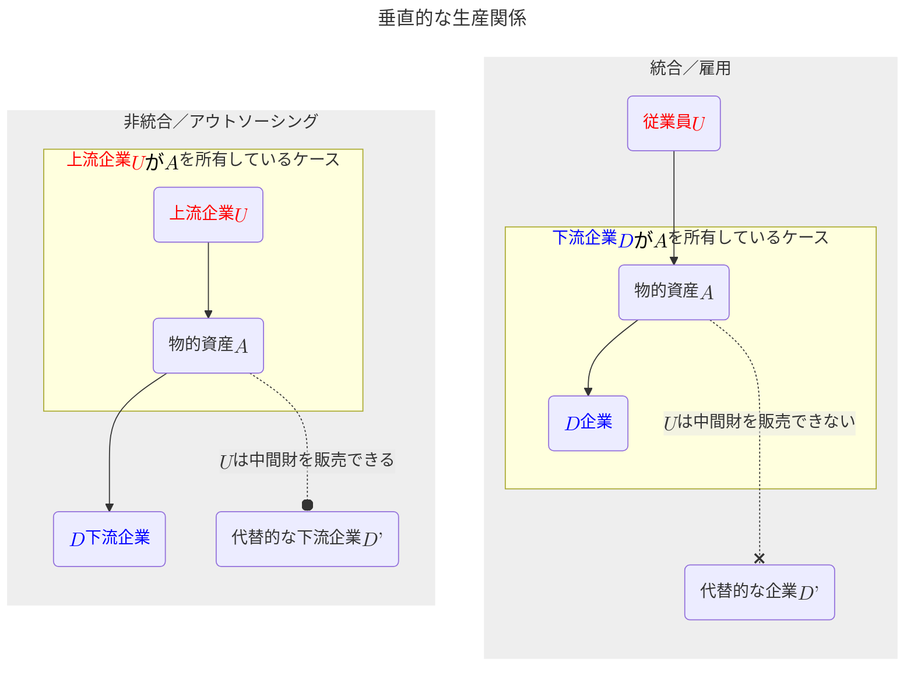
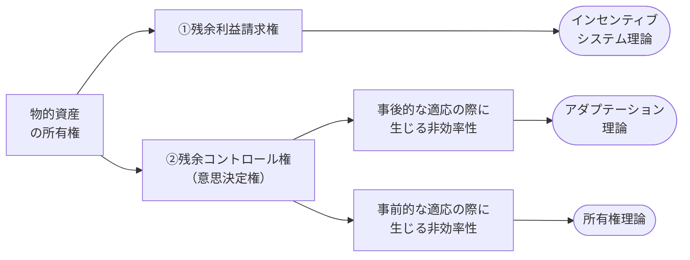
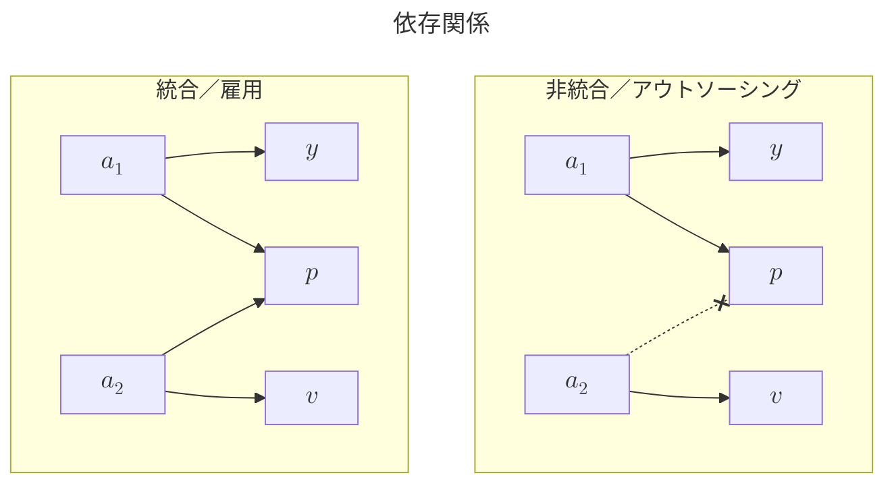

# A-3章 企業の境界論

- 企業の境界論（$\text{boundary of the firm}$）の詳細に入る。この問題はある種、古典的な問題である。企業の理論（$\text{the theory of the firm}$）とも呼ばれる。この問題に対する古典的な回答、ないしは、回答しようとした古典的な試みは2009年にノーベル経済学賞を受賞したウィリアムソン（$\text{Oliver Williamson}$）による取引費用（$\text{transaction costs}$）である。
- ウィリアムソンは「統治構造（$\text{governance structure}$）には多種多様なものがあり、直面する問題を最小化数量にその選択を行う」という基本的アイデアを創始した。ここでは、垂直統合（$\text{vertical integration}$）について議論を行う。<u>垂直統合とは、自社の仕入れ先あるいは販売先に$\text{M\&A}$を行うことで事業領域の拡張を行うことを言う</u>。

## 4つのフォーマルモデル

- 企業の境界論、より具体的には$\text{Make or buy}$（自社内で製造するか、または市場を通じて購入するか）の決定問題を<u>ここでは $\text{Gibbons（2005 a）}$に従って4つのモデルに類型化して議論する</u>。
  1. **インセンティブシステム理論**（$\text{Incentive System Theory}$）
  2. **アダプテーション理論**（$\text{Adaptation Theory}$）
  3. **所有権理論**（$\text{Property Rights Theory、PRT}$）
  4. **レントシーキング理論**（$\text{Rent-Seeking Theory}$）
- ここから<u>中間財を自社内で作るか（企業内部の取引）、外から購入してくるか（市場取引）という問題を考察する</u>。この問題では以下を事前知識とする。
  - 【**事前知識1**】製造設備などの物的資産の所有権（$\text{ownership of asset}$）の所在は生産される中間財の所有権（$\text{ownership of intermediate good}$）の所在を決める。
  - 【**事前知識2**】上流企業（$U\text{：upstream party}$）が製造設備などの物的資産$A$の所有権を持っている場合が「非統合（$\text{non-integration}$）」の場合であり、中間財の所有権は$U$にある。この場合$U$は「独立した契約者（$\text{independent contractor}$）」と呼ばれる。
  - 【**事前知識3**】下流企業（$D\text{：downstream party}$）が製造設備などの物的資産$A$の所有権を持っている場合が「統合（$\text{integration}$）」の場合であり、中間財の所有権は$D$にある。この場合、$U$は「従業員（$\text{employee}$）」と呼ばれる。
- 上記の補足として、**非統合の場合は「アウトソーシング（$\text{outsourcing}$）とも解釈でき、統合の場合は「雇用（$\text{employment}$）関係」とも解釈される**。

#### 垂直的な生産関係

- 非統合の場合は$U$は中間財を$D'$に対して（場合により）**販売できる**。一方で、統合の場合は中間財の所有権は$D$にあるので、$U$は$D'$に対して中間財を**販売できない**。この関係を上図に示す。
- 【**上図の非統合／アウトソーシングの説明**】$U$が$A$を所有している場合を「**非統合**」または「**アウトソーシング**」と呼び、$U$は品物を$D'$に売却すると$D$を脅すことができる（しかし、$D$に売却する方が品物の評価は高いと想定する）。非統合は「$U$が$A$を所有しているので中間財の所有権は（中間財を売却するまでは）$U$にある」ことを意味する。$U$が$A$を所有している場合、$U$はマルチタスクのアクション$a$を取り、自分の資産（機械）$A$を用いて中間財を生産する。そして$U$は「$D$に売ろうか、$D'$に売ろうか」と自問する。この場合、$U$は「**独立した契約者の説明**」である。
- 【**上図の統合／雇用**】$D$が$A$を所有している場合、「**統合**」または「**雇用**」と呼ぶ。$U$はマルチタスクのアクション$a$をとり、資産（機械）$A$を用いて中間財を生産するが、$D$が資産（機械）$A$を所有しているので$D$が生産された中間財を所有する。<u>資産の所有権は生産される中間財の所有権をもたらす</u>ことから、$D$は$U$に「$a$をとってくれてどうもありがとう。ところで、この中間財をどうですかなどと$D'$に提案することさえ考えてはいけない。なぜなら中間財は私（$D$）が所有しているのだから」と言う。この場合は$U$は自分が所有していない資産$A$を使用しているので$U$を「**従業員（employee）**」と呼ぶことができる。
- 【**数式の定義**】まず、資産か機械である$A$がある。上流部門$U$は$A$を使用して複数の活動・職務（$\text{multi-task}$）のアクション$a=(a_1,\;\cdots,\;a_n)$をとる。そして、中間生産物が生産される。生産された中間生産物は下流部門$D$もしくは$D'$に行きうる。しかし、アクション$a$は$D$に対する「**特殊的投資**」であるので、あるいは、$A$は$D$に対する「**特殊的な機械、資産**」であるので中間生産物自体は全く同じ財であるが、中間生産物が$D$に行った場合の価値$Q(a)=\{Q_1,\;\cdots,\;Q_I\}$、は$D'$に行った場合の価値$P(a)=\{P_1,\;\cdots,\;P_J\}$より大きい。常に$Q>P$ であり、これが「<b>特殊性</b>」の尺度を表す。$Q$と$P$の確率密度関数$f$は$Q_i$が$P_j$より大きい時だけ正の値をとる。これは以下のように表現できる。$$\color{red}f(Q_i,\;P_j)>0\quad\text{if only}\quad Q_i>P_j$$$Q$と$P$の値は観察可能（$\text{observable}$）であるが第三者に立証可能（$\text{verifiable}$）ではない。
- 以上の準備の下に$\text{Gibbons（2005a）}$の4つのモデルの整理を行うために、以下のように**ゲームの基本的なタイミング**を設定する。この基本的なタイミングに沿って4つのモデルの区分けを行い、4つのモデルをそれぞれ適切な$"\text{巣}"$に入れてあげることを考える。
  1. 資産の所有権（$\text{asset ownership}$）あるいはコントロール権（control rights）の割り当てを行う（＝統治構造［$\text{governance structure}$］の選択）。
  2. 事前のアクション（$\text{ex anteactions }$）$a$ をとる。
  3. 具体的な世界の状態（$\text{the state of the world}$）$s$ が実現（$\text{realize}$）する。
  4. 事後の意思決定（$\text{ex post decisions}$）$d$を行う。
  5. 報酬（$\text{payoffs}$）が支払われる。
- 各モデルの説明で必要となる「**所有権**」について説明する。一般に、**所有権（$\text{ownership}$）** は①物的資産の利用に関する**残余コントロール権（$\text{residual rights of control}$）** と、**②残余利益請求権（$\text{residual claim}$）**、の2つをもたらす。①は（契約で明示的に物的資産の非所有者に属す権利を除いて）すべての物的資産の利用をコントロールする権利を意味し、$"\text{decision right}"$である。これに対し、②は物的資産が生み出す残余利益を請求する権利（$"\text{payoff right}"$）である。この分類に従って、予め4つの内3つのモデルを位置付けると下図のようになる。

### インセンティブシステム理論

- MITのホルムストローム（$\text{Holmstrom}$）らによるインセンティブシステム理論（$\text{Incentive System Theory}$）を考える。本モデルの源泉となっている研究は$\text{Holmstrom and Milgrom（1991, 1994）}$、$\text{Holmstrom and Tirole（1991）}$、$\text{Holmstrom（1999b）}$である。
- この理論は基本的にプリンシパル$-$エージェント（依頼人$-$代理人）問題を扱うエージェンシーモデルに基づく。ホルムストロームは「**インセンティブ問題**」や「**エージェンシー問題**」の分野で多くの業績を産んでおり、インセンティブ問題に焦点を当てて継続的に研究が進められていたところ、それが「**企業の境界**」の理論にたまたま関連することがわかったと言うことである。
- エージェンシーモデルでは、エージェンシーが行おうとする行為・決定には**モラルハザード**（**道徳的危険**：本来負うべきリスクや損失に対する本人の警戒心が薄れ、不注意や無責任な行動を引き起こす現象）がありうることから、プリンシパルは「エージェンシー契約」を書き、<u>モラルハザードを防ごうとする</u>。

#### 【準備】エージェンシーモデルの定式化

$$
【\bold{定義}】\\
\begin{align*}
    y&：\text{生産量}\\
    v&：\text{製造設備などの資産価値}\\
    p&：\text{エージェントの活動成果を計測する業績指標}\\
\end{align*}
$$

- 上式に定式化で登場する式の定義を示す。ここで、$p$はその値に基づいて契約可能なパフォーマンスメジャーの役割もある。従って、この理論においては事後の意思決定（$\text{ex post decisions}$）、報酬は初めから契約可能である。何らかの契約を書き、そしてそれを履行させることができる。
- 資産価値$v$について補足する。$v$はエージェントがともに働く機械のようなものであり、エージェントが$v$に十分に配慮を払えばゲーム終了時点で資産価値は高くなっていることになる。<u>エージェントが資産（機械）に配慮を払い、面倒を見るインセンティブはエージェントがその資産（機械）$v$を所有しているか否かに依存する</u>。後に詳述する$\text{Baker and Hubbard（2003, 2004）}$がトラック運送で実証したようにトラックのドライバーが自分でトラックを所有していればドライバーはトラックに十分に配慮を払い、トラックのドライバーが自分でトラックを所有していなければドライバーはトラックをぞんざいに扱う恐れがある。つまり、誰が資産を所有しているかは資産価値$v$を誰が得るかを決定するのみではなくインセンティブまで変えてしまうのである。
- また前述の通り、資産の所有権は①残余コントロール権（$\text{residual control}$）をもたらす見方と、②残余利益請求権（$\text{residual claims}$）をもたらす見方の2つがあるが、<u>インセンティブシステム理論における物的資産の所有権は「②の経済的価値を運んでくる利益請求権をもたらす」との考え方に深く関わる（$"\underline{\text{decision right}}"$というより$"\underline{\text{payoff right}}"$）</u>。
- 以上を踏まえて、問題になるのは**資産をどちらが所有すべきか**という点であり、「どのようなインセンティブ契約を結ぶべきか」そして「誰が資産を所有するかでどのように異なってくるのか」を分析する。次のような簡単なモデルを考える。
  - 【**ケース1**】統合／雇用の場合
  - 【**ケース2**】非統合／アウトソーシングの場合

**統合 / 雇用の場合**

$$
【\bold{統合／雇用における効用}】\\[2mm]
\begin{align*}
    \text{プリンシパルの効用}(下流企業D)\quad&\color{blue}\pi=y+v-w(p)\\[1mm]
    \text{エージェントの効用}(従業員U)\quad&\color{red}U=w(p)-c(a)
\end{align*}\\[5mm]
【\bold{定義}】\\[1mm]
\begin{align*}
    c&：\text{エージェントの努力費用}\\
    a&：\text{活動水準}
\end{align*}
$$

- 下流企業（$D$）が製造設備などの物的資産の所有権を持っている「**統合**」の場合について検討する。
- この時、$D$は「**従業員**」とも言える。$D$は生産量$y$と資産価値$v$から正の効用を、賃金$w$から負の効用をえる。すなわち$D$のペイオフは$\color{blue}\pi=y+v-w(p)$と表すことができる。
- 他方、$U$は賃金$w$から正の効用を、活動$a$による努力費用$c(a)$から負の効用を得る。すなわち$U$のペイオフは$\color{red}U=w(p)-c(a)$と表すことができる。ここで、$c$は$a$に依存しており、活動すると費用は増え、活動水準が高いほど活動を追加的に増やすために必要な費用が増えると仮定する、つまり、$c'(a)>0\text{、}c''(a)>0$。

**非統合 / アウトソーシングの場合**

$$
【\bold{非統合／アウトソーシングにおける効用}】\\[2mm]
\begin{align*}
    \text{プリンシパルの効用}(下流企業D)\quad&\color{blue}\pi=y-w(p)\\[1mm]
    \text{エージェントの効用}(上流企業U)\quad&\color{red}U=w(p)+v-c(a)
\end{align*}
$$

- 上流企業（$U$）が製造設備などの物的資産の所有権を持っている「**非統合**」の場合について検討する。
- この時、$U$は「**独立した契約者**」である。この場合の$D$のペイオフは$\color{blue}\pi=y-w(p)$、$U$のペイオフは$\color{red}w(p)+v-c(a)$となる。

#### インセンティブ理論の機能〜$y,\;v,\;p$ の設定〜

- 以上のエージェンシーモデルの定式化を踏まえ、インセンティブ理論の機能を考える。まず、生産量$y$と資産価値$v$、そして業績指標$p$を次のように定義する。ここで、$\varepsilon,\;\eta,\;\mu$は平均的にゼロとなる誤差項を表す。すなわち、$y,\;v,\;p$ はそれぞれ$a_1,\;a_2$の水準に大きく依存するが、その関係は確定的なものではなく不確実な要素（$\varepsilon,\;\eta,\;\mu$）にも依存することを表す。$$\begin{array}{lll}
    【\bold{共通}】&y=a_1+\varepsilon,\quad v=a_2+\eta\\[1mm]
    【\bold{統合／雇用}】&p=a_1+a_2+\mu\\[1mm]
    【\bold{非統合／アウトソーシング}】&p=a_1+\mu
\end{array}$$ここで、$y$は活動$a_1$に応じて動き、$v$は活動$a_2$に応じて動く。$U$は複数の活動・職務（$\text{multi-task}$）を遂行するが、それらの活動水準を各々$a_1$と$a_2$で表している。例えば、$a_1$は生産量$y$を増やす活動量、$a_2$は製品の質$v$を高める活動量と考えれば良い。
- 再び、「統合／雇用の場合」と「非統合／アウトソーシングの場合」を考える。
  - 【**統合／雇用の場合**】この時、プリンシパル$D$が資産を所有し、$D$が資産価値$v$を獲得する。このため、エージェント$U$は**従業員**である。この時、$D$は$y$と$v$の値の双方に関心があるので$a_1+a_2$の値を気にし、このため、上の定義のように$p=a_1+a_2+\mu$と設定する。一方、$U$は$p$に従って$w$が支払われるので$a_1$と$a_2$に関心を持ち、ファーストベストの行為を行う。すなわち、統合／雇用のままで（$=D$が物的資産を所有したままで）、<u>**$D$にとって望ましい行為を$U$に選択させることができる**。なぜなら、$p$に関心を持つ$U$の利害と$y$と$v$の増加に関心を持つ$D$の利害が一致している状況となるからである。基本的に問題は発生しない</u>。
  - 【**非統合／アウトソーシングの場合**】この時、エージェント$U$が**独立した契約者・請負者**として資産を所有し、$U$が資産価値$v$を獲得する。ここで、プリンシパル$D$は資産を所有していないので$y$の値のを気にすることから$p=a_1+\mu$と設定する。この場合、問題に直面する。それは$D$は$a_1$のみを気にする一方で、$U$は$a_1$と$a_1$を気にする。つまり、**双方の目標がずれて$D$にとって望ましい行為を$U$に選択させることができなくなる**。
- 以上より、プリンシパル（下流$D$）がエージェント（上流$U$）の活動成果を計測する業績指標を有している時、資産（機械）の所有権を$U$と$D$に適切に配分する、すなわち、企業の境界を適切に設定することによって、うまく問題を解決することができる。
- **インセンティブシステム理論の特徴**は次のとおり。複数の活動に従事させる場合（$\text{multi-task}$）のインセンティブ共与問題において物的資産の所有権（$\text{asset ownership}$）がインセンティブ供与の手段となりうると考えるところにある。言い換えると、<u>活動成果の計測（$\text{performance measurement}$）の困難性に対して企業の境界の設定の仕方がその補完手段となりうる可能性を示唆する</u>。ここで、「複数の活動・職務（$\text{multi-task}$）」とは例えば、現実の企業がそうであるように上流者$U$が生産量を増やす活動・職務（あるいは短期利益に貢献する製品改良）と製品の質を高める活動・職務（あるいは企業の永続性には大切な長期利益に貢献する製品開発）の双方を行う場合などが想定される。

### アダプテーション理論

- 

#### アダプテーション理論の修正

- 

### 所有権理論

- 

### レントシーキング理論

- 

## 事前のインセンティブと事後の適応

- 

## 特殊的投資をめぐる事前の非効率性と事後の非効率性

- 

## 企業内のレントシーキング理論

- 

